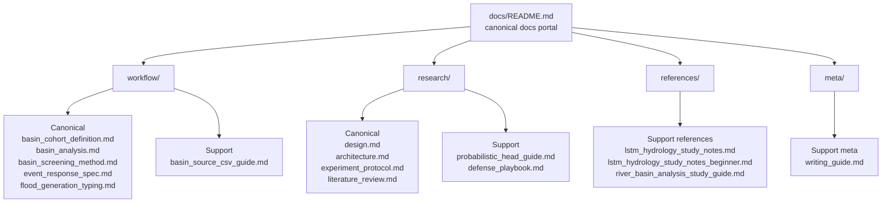
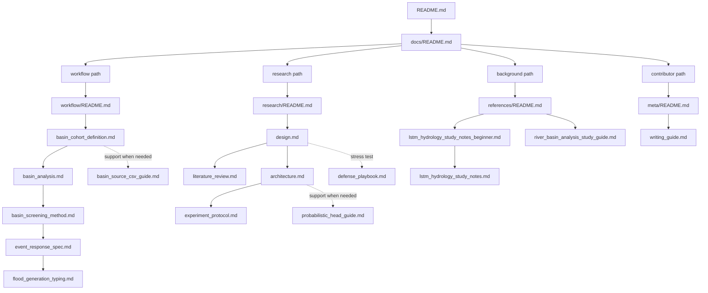

# CAMELS Docs

이 문서는 저장소 문서 체계의 기준 포털이다. 사람용 문서는 루트 `README.md`와 이 문서에서 시작한다. 각 폴더의 `README.md`는 폴더 안에서만 쓰는 로컬 인덱스다.

## Docs taxonomy

## Canonical vs support

공식 규칙, 정의, 실험 기준은 canonical 문서에만 둔다. guide, playbook, study note, writing guide는 support 문서다. support 문서는 설명과 배경을 보강하지만 source of truth가 되지 않는다.

| Area | Role | Local index |
| --- | --- | --- |
| [`workflow/`](workflow/README.md) | basin selection, screening, event workflow의 공식 기준 | [`workflow/README.md`](workflow/README.md) |
| [`research/`](research/README.md) | 연구 질문, 모델 구조, 실험 규범의 공식 기준 | [`research/README.md`](research/README.md) |
| [`references/`](references/README.md) | 외부 자료를 CAMELS 맥락으로 옮긴 참고 노트 | [`references/README.md`](references/README.md) |
| [`meta/`](meta/README.md) | 문서 작성 규칙과 contributor guidance | [`meta/README.md`](meta/README.md) |

## Recommended reading paths

## Folder indexes

- [`workflow/README.md`](workflow/README.md): workflow 문서의 관계와 읽기 순서를 정리한다.
- [`research/README.md`](research/README.md): research 문서의 기준선과 support 문서를 정리한다.
- [`references/README.md`](references/README.md): 참고 노트의 역할과 읽기 순서를 정리한다.
- [`meta/README.md`](meta/README.md): 문서 작성 규칙과 메타 문서를 정리한다.
