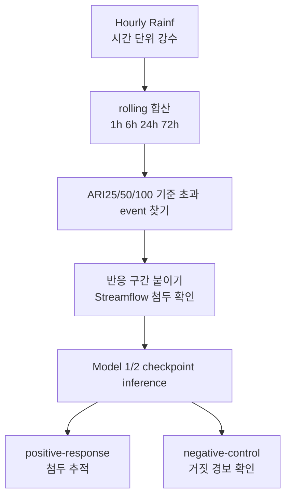

# 14. 극한호우 stress test 읽기

이 문서는 공식 300개 train subset으로 학습한 Model 1 / Model 2 결과에 새로 붙인 극한호우 stress test를 비전공 대학생 기준으로 설명한다. 앞 장의 hydrograph 분석이 "큰 유량 시간대에서 모델이 얼마나 낮게 예측하는가"를 본다면, 이 장의 stress test는 "큰 비가 왔을 때 모델이 유량을 충분히 올리는가"를 본다.

> **현재 재현 상태:** 이 문서는 강수에서 출발한 historical stress test의 해석을 보존한다. 현재 repo에서 paper canonical 요약은 `output/model_analysis/q99_analysis/performance/`의 표·보고서이며, 과거 `subset300_extreme_rain` 개별 스크립트명은 일부 정리되어 직접 실행 진입점으로 보장하지 않는다.

미리 못 박아 둘 점이 하나 있다. 이 stress test는 공식 결론을 내는 primary DRBC test(2014-2016년, 관측 기준 85개 basin)를 **대체하지 않는다**. 그 자리를 메우는 보조 진단이다. 왜 보조 진단으로만 읽어야 하는지는 마지막 절에서 정리한다.

- **이 문서의 역할**: 강수에서 출발하는 보조 진단의 설계와 읽는 법을 비전공 독자에게 풀어 쓴다.
- **다루는 범위**: 강수 event catalog 생성, 노출 여부, stress 반응, primary/all-validation checkpoint 진단.
- **다루지 않는 범위**: 공식 결론(2014-2016 DRBC 85개 basin primary test)은 다른 문서가 맡는다.
- **고정 조건**: 다른 장과 같이 seed `111 / 222 / 444`로 학습한 기존 checkpoint를 그대로 재추론한다. 새로 학습하지 않는다.

---

## 이 test가 필요한 이유

기존 event 분석은 관측 유량이 큰 시점에서 출발했다. 예를 들어 streamflow(하천 유량)가 Q99(상위 1% 유량 기준선)보다 높았던 event를 모으면, 이미 유량이 크게 오른 사례를 분석하기 쉽다. 다시 말해 "유량이 컸던 순간"을 먼저 고르고 그 순간 모델이 얼마나 잘 맞췄는지를 보는 방식이다.

하지만 사용자가 처음 제기한 질문은 출발점이 반대였다.

```text
미국에 정말 100년급 비나 홍수가 없었나?
모델이 그런 극한호우 forcing(입력 기상 자료)을 배운 적이 있나?
그런 비가 왔을 때 모델도 유량 첨두를 올릴 수 있나?
```

이 질문에 답하려면 유량 event table만으로는 부족하다. 유량 event table은 "비"가 아니라 "유량"에서 시작하기 때문이다. 그래서 비 자체를 출발점으로 삼는 보조 test가 필요하다. 구체적으로는 hourly(시간 단위) `.nc` 자료 안의 강수 변수 `Rainf`에서 직접 강수 event를 뽑고, 그 뒤에 따라오는 streamflow 반응을 붙이는 구조다.

### 실행 진입점과 3단계 구조

이 test 전체는 공식 실행 스크립트 하나로 돈다. 스크립트 첫머리 주석의 "Reuses existing subset300 checkpoints — no retraining"은 새로 학습하지 않고 이미 있는 모델을 그대로 다시 돌린다는 뜻이다.

- 실행 진입점: `scripts/runs/official/run_expanded_drbc_extreme_rain_stress_test.sh`

이 스크립트는 세 단계를 차례로 실행한다. 각 단계는 셸 변수로 켜고 끈다.

| 단계 | 셸 변수 | 호출 스크립트 | 하는 일 |
| --- | --- | --- | --- |
| catalog | `RUN_CATALOG` | wrapper 내부 catalog 단계 | 강수 event 목록 생성 |
| inference | `RUN_INFERENCE` | wrapper 내부 inference 단계 | 기존 checkpoint 재추론 |
| analysis | `RUN_ANALYSIS` | wrapper 내부 analysis 단계 | 결과를 표로 정리 |

산출물은 셸 변수 `OUTPUT_ROOT`(기본 경로 `output/model_analysis/q99_analysis/performance`) 아래에 단계별로 떨어진다. 실행 스크립트를 실제로 재가동하기 전에는 wrapper가 호출하는 하위 스크립트가 현재 repo에 남아 있는지 먼저 확인한다.

- catalog: `output/model_analysis/q99_analysis/performance/data/exposure/`
- inference: `output/model_analysis/q99_analysis/performance/data/inference/`
- analysis: `output/model_analysis/q99_analysis/performance/tables/`, `report/`, `figures/`, `gallery/`

---

## 두 질문 분리

극한호우 stress test는 두 질문을 분리한다.

첫 번째 질문은 노출 여부(exposure)다. train(학습)과 validation(검증) 기간에 ARI25, ARI50, ARI100급 강수 forcing이 실제로 있었는지 확인한다. "모델이 학습 도중 그렇게 큰 비라는 입력을 볼 기회 자체가 있었는가"를 묻는 질문이다. 본 적도 없는 입력을 못 맞췄다고 탓할 수는 없으므로 이 확인이 먼저다.

두 번째 질문은 stress 반응(response)이다. DRBC holdout(학습에서 제외한 평가용) basin의 과거 전체 기간에서 극한호우 event를 모은 뒤, 기존 checkpoint로 다시 inference해 모델이 실제 streamflow 첨두를 따라가는지 본다.



---

## ARI100의 뜻

ARI는 Average Recurrence Interval(평균 재현 간격)의 약자다. ARI100은 보통 평균적으로 100년에 한 번 넘을 정도의 크기를 뜻한다. ARI25, ARI50은 각각 25년, 50년에 한 번 수준이다. 숫자가 클수록 더 드물고 더 큰 사건이다.

여기서 매우 중요한 주의점이 하나 있다. 이 프로젝트의 강수 기준값이나 유량 기준값은 공식 NOAA(National Oceanic and Atmospheric Administration, 미국 해양대기청)나 USGS(United States Geological Survey, 미국 지질조사국)가 발표한 값이 **아니다**. CAMELSH hourly 자료의 연 최대값(annual maxima) 기록에서 우리가 직접 추정한 proxy(근사 기준값)다. 실제로 catalog 단계는 이 값들을 외부 reference CSV에서 읽어 그대로 기준선으로 쓴다.

기준값에 쓰는 변수명과 출처는 다음과 같다.

| 변수명 | 무엇을 담는가 |
| --- | --- |
| `prec_ari100_24h` 등 | 누적 길이별 강수 기준값(proxy) |
| `flood_ari100` 등 | 유량 기준값(proxy) |

- reference CSV: 셸 변수 `RETURN_PERIOD_CSV`, 기본 경로 `output/basin/all/analysis/return_period/tables/return_period_reference_table_with_drbc_expanded85.csv`

그래서 논문에서는 "100년 홍수 확정"처럼 쓰면 안 된다. 더 정확한 표현은 "CAMELSH hourly annual-maxima proxy 기준 100-year-scale 강수" 또는 "100년급에 가까운 강수 proxy"다.

---

## 1h, 6h, 24h, 72h를 함께 보는 이유

홍수를 만드는 비는 한 가지 모양만 있는 것이 아니다. 한두 시간에 매우 강하게 쏟아지는 비도 있고, 하루나 며칠 동안 계속 내려 유역(물이 모이는 영역)을 포화시키는 비도 있다. 둘 다 홍수를 만들 수 있지만 모양이 다르다.

그래서 비의 세기는 한 시점의 강수량 하나로 재지 않고 `Rainf`를 여러 길이로 더한 rolling sum(이동 누적 합)으로 잰다. catalog 단계의 함수 `rolling_ratio_frame`이 1시간, 6시간, 24시간, 72시간 누적을 각각 계산해, 같은 길이의 ARI 기준값으로 나눈 ratio(기준 대비 비율)를 만든다.

```python
# historical catalog step: rolling_ratio_frame()
threshold = safe_float(ref.get(f"prec_ari{period}_{duration}h"))
...
out[f"max_prec_ari{period}_ratio"] = ratios.max(axis=1, skipna=True)
```

다음 표는 네 길이가 각각 무엇을 잡는지 짚는 참조용이다.

| 누적 길이 | 무엇을 잡는가 |
| --- | --- |
| `1h` | 짧고 강한 폭우 |
| `6h` | 반나절 안에 몰린 강수 |
| `24h` | 하루 단위 큰 비 |
| `72h` | 며칠 동안 이어진 누적 강수 |

각 시점에서 이 네 길이의 ARI ratio를 모두 계산하고, 그중 가장 큰 ratio를 그 시점의 비 세기로 기록한다. 어떤 모양의 비든 가장 극단으로 드러나는 길이로 잡겠다는 뜻이다. 이때 쓰는 변수명은 누적 길이 기준별로 다음과 같다.

| 변수명 | 의미 |
| --- | --- |
| `max_prec_ari25_ratio` | 네 길이 중 ARI25 대비 최대 비율 |
| `max_prec_ari50_ratio` | 네 길이 중 ARI50 대비 최대 비율 |
| `max_prec_ari100_ratio` | 네 길이 중 ARI100 대비 최대 비율 |

---

## event 선정 방법

먼저 어느 시점을 "비가 큰 시점"으로 켤지(active) 정한다. catalog 단계는 25년급 기준을 넘었거나 100년급 기준의 일정 비율(셸 변수 `near_ari100_ratio`, 기본값 0.80) 이상까지 올라온 시점을 active로 본다.

```python
# scripts/model/extreme_rain/build_subset300_extreme_rain_event_catalog.py: main()
active = (ratio_frame["max_prec_ari25_ratio"] >= 1.0) | (
    ratio_frame["max_prec_ari100_ratio"] >= args.near_ari100_ratio
)
active_events = iter_active_events(active, args.event_gap_hours)
```

비는 한 시점에 끝나지 않고 여러 시간 이어지므로, active 시점 사이의 빈틈(gap)이 72시간(셸 변수 `event_gap_hours`) 이하면 같은 storm(폭우 사건)으로 묶는다.

이렇게 묶인 storm마다 가장 큰 ARI ratio로 cohort(집단 분류)를 붙인다(함수 `rain_cohort`). 분류는 다음과 같다.

| cohort | 뜻 |
| --- | --- |
| `prec_ge100` | ARI100 이상 |
| `prec_ge50` | ARI50 이상 (ARI100 미만) |
| `prec_ge25` | ARI25 이상 (ARI50 미만) |
| `near_prec100` | ARI100의 80% 이상이지만 100% 미만 |

primary(핵심) 관심 집단은 `prec_ge100`, 즉 어떤 누적 길이로든 100년급 강수 proxy 이상까지 올라간 비다. 나머지 셋은 기준을 조금씩 풀어 본 sensitivity(민감도) 집단으로, 기준선 위치에 따라 결론이 흔들리지 않는지 확인하는 용도다.

### 반응 구간과 자료 품질 거르기

비 다음에 유량이 어떻게 움직였는지는 반응 구간(response window)을 붙여 본다. catalog 단계의 기본 설정(`wet_footprint` 모드)에서는 비가 실제로 내린 시작 시점부터 비 종료 168시간(셸 변수 `response_post_hours`, 즉 7일) 뒤까지를 본다. 그 안에서 관측 유량의 최고값을 그 event의 관측 첨두로 기록한다.

자료 품질도 거른다. 빠진 자료가 많으면 첨두를 잘못 읽기 때문이다.

| 품질 기준 변수명 | 기본값 | 거르는 대상 |
| --- | --- | --- |
| `rain_coverage_min` | 0.95 | 강수 결측이 너무 많은 basin |
| `streamflow_coverage_min` | 0.90 | 반응 구간 안 유량 결측이 너무 많은 event |

---

## positive response와 negative control

극한호우가 왔다고 항상 큰 홍수가 나는 것은 아니다. 비가 오기 전에 이미 유역이 바싹 말라 있었거나, 비가 유역 전체에 고르게 오지 않았거나, 땅속 저장·지하수 조건 때문에 streamflow가 크게 오르지 않을 수 있다. 그래서 "비는 컸지만 유량은 안 오른" 사례를 따로 떼어 둬야 한다.

catalog 단계의 함수 `response_class`는 관측 첨두를 유량 기준값과 비교해 네 부류로 나눈다.

```python
# scripts/model/extreme_rain/build_subset300_extreme_rain_event_catalog.py: response_class()
if ratios.get(25, math.nan) >= 1.0:
    return "flood_response_ge25"
if ratios.get(2, math.nan) >= 1.0:
    return "flood_response_ge2_to_lt25"
if np.isfinite(q99) and obs_peak >= q99:
    return "high_flow_non_flood_q99_only"
return "low_response_below_q99"
```

| class | 의미 | 해석 |
| --- | --- | --- |
| `flood_response_ge25` | 강수 뒤 유량도 25년 홍수 proxy 이상으로 올랐다 | positive-response (실제로 큰 홍수가 난 사례) |
| `flood_response_ge2_to_lt25` | 유량이 2년 이상 25년 미만 proxy까지 올랐다 | positive-response (중간 규모로 오른 사례) |
| `high_flow_non_flood_q99_only` | Q99 이상 high-flow지만 2년 홍수 proxy 미만이다 | negative control |
| `low_response_below_q99` | 유량이 Q99에도 못 미쳤다 | negative control |

여기서 핵심은 negative control을 모델의 실패로 보면 안 된다는 점이다. 비는 컸지만 관측 유량이 안 올랐다면 모델도 큰 홍수를 예측하지 않는 편이 옳다. 오히려 이런 사례에서 Model 2의 `q99`가 자꾸 홍수 기준선을 넘어 버리면, 그것이 false positive(거짓 경보) 위험을 뜻한다. 그래서 negative control은 "안 오를 때 모델이 차분히 있는가"를 검증하는 대조군이다.

---

## 돌리는 checkpoint

기본 결과는 validation 기준으로 고른 primary checkpoint를 쓴다. 실행 스크립트의 셸 변수 `EPOCH_MODE`가 기본값 `primary`일 때, inference 단계는 코드 안에 적힌 epoch 매핑(`PRIMARY_EPOCHS`)을 그대로 따른다.

```python
# scripts/model/extreme_rain/infer_subset300_extreme_rain_windows.py
PRIMARY_EPOCHS = {
    ("model1", 111): 25,
    ("model1", 222): 10,
    ("model1", 444): 15,
    ("model2", 111): 5,
    ("model2", 222): 10,
    ("model2", 444): 10,
}
```

표로 정리하면 다음과 같다.

| model | seed111 | seed222 | seed444 |
| --- | ---: | ---: | ---: |
| Model 1 | epoch25 | epoch10 | epoch15 |
| Model 2 | epoch5 | epoch10 | epoch10 |

이 결과는 논문 본문에서 우선 읽는 기준이다. 다만 primary checkpoint 하나만 보면 "그 epoch라서 우연히 좋아 보인 것 아닌가"라는 의심이 남는다.

### all-validation-epoch grid 모드

그래서 같은 event 집단에 대해 validation checkpoint를 여러 개 돌려 보는 grid 모드도 둔다. `EPOCH_MODE=validation`으로 실행하면 inference 단계가 epoch 격자(코드 안 `DEFAULT_VALIDATION_EPOCHS`)를 따라 돈다.

```python
# scripts/model/extreme_rain/infer_subset300_extreme_rain_windows.py
DEFAULT_VALIDATION_EPOCHS = [5, 10, 15, 20, 25, 30]
...
return [(int(epoch), int(epoch), f"epoch{int(epoch):03d}") for epoch in validation_epochs]
```

이 all-validation-epoch run은 Model 1 epoch N과 Model 2 epoch N을 같은 번호로 짝지은 same-epoch pair다. 목적은 primary epoch를 다시 고르는 것이 **아니다**. upper-tail(위쪽 큰 유량 쪽) 효과와 false-positive tradeoff가 checkpoint 선택에 얼마나 민감한지만 보는 보조 진단이다.

---

## 출력 위치

primary checkpoint 결과(wet-footprint)와 all-validation 결과는 같은 분석 폴더 아래에 떨어진다. 둘을 섞어 읽으면 안 된다. primary 결과는 대표 결과이고, all-validation 결과는 checkpoint sensitivity 진단이다.

- 표(수치): `output/model_analysis/q99_analysis/performance/tables/`
- 사람이 읽는 요약: `output/model_analysis/q99_analysis/performance/report/`
- 결론용 대표 그림: `output/model_analysis/q99_analysis/performance/figures/`
- event별 대량 그림(flow graph): `output/model_analysis/q99_analysis/performance/gallery/`

대표 event에서 실제 flow graph(유량 그래프)가 어떻게 생겼는지는 `gallery/event_simq_plots/` 아래에서 본다. 같은 event 하나를 seed `111 / 222 / 444` 패널로 나누고 관측 유량, Model 1, Model 2의 `q50/q95/q99`를 함께 그려 둔 것이다.

---

## 표를 읽는 데 필요한 지표

analysis 단계가 만드는 표에는 여러 지표가 나온다. 아래는 그 지표들을 한눈에 보는 참조 카드다. 각 지표가 무엇을 재는지는 카드 뒤에서 풀어 설명한다.

| 지표 | 변수명 | 범위 | 최적화 방향 |
| --- | --- | --- | --- |
| 과소예측 비율 | `underestimation_fraction_at_observed_peak` | 0~1 | 작을수록 좋음 |
| 첨두 과소 결손율 | `median_obs_peak_under_deficit_pct` | 0% 이상 | 작을수록 좋음 |
| 기준선 초과 recall | `mean_threshold_exceedance_recall` | 0~1 | 클수록 좋음 |
| 첨두 분위 위치 | `Local Peak Quantile Bracket` | q50 이하 ~ q99 초과 | (해석용, 방향 없음) |

아래 수식에서 $Q$는 유량(streamflow)을 뜻하고, 아래첨자 $\text{sim}$은 모델 예측, $\text{obs}$는 실제 관측을 가리킨다. $\tau$는 분위(예: 0.99)를 나타낸다.

### 과소예측 비율 — `underestimation_fraction_at_observed_peak`

관측 첨두가 일어난 시점에서 모델 예측선이 관측값보다 낮게 깔린 event가 전체 중 몇 분의 몇이었는지를 비율로 나타낸다.

$$
\text{과소예측 비율} = P\left(Q_{\text{sim},\tau}^{\text{peak}} < Q_{\text{obs}}^{\text{peak}}\right)
$$

관측 첨두 시점에서 예측이 관측보다 낮게 깔린 event의 비율. 1에 가까울수록 거의 매번 첨두를 놓치고, 0에 가까울수록 첨두를 잘 덮는다는 뜻이다. 작을수록 좋다.

### 첨두 과소 결손율 — `median_obs_peak_under_deficit_pct`

첨두를 놓쳤을 때, 얼마나 많이 모자랐는지를 퍼센트로 본다.

$$
\text{결손율} = \operatorname{median}\left(\frac{\max\left(0,\ Q_{\text{obs}}^{\text{peak}} - Q_{\text{sim},\tau}^{\text{peak}}\right)}{Q_{\text{obs}}^{\text{peak}}}\right) \times 100\%
$$

예측이 관측 첨두보다 낮으면 그 모자란 양을 관측 첨두 대비 비율로 재고 그 값들의 중앙값(median)을 쓴다. 예측이 첨두를 이미 덮은 사례가 많으면 0%에 가까워진다. 작을수록 좋다.

### 기준선 초과 recall — `mean_threshold_exceedance_recall`

실제로 홍수 기준선을 넘은 event 중 모델 예측선도 그 기준선을 같이 넘은 비율.

$$
\text{recall} = P\left(Q_{\text{sim},\tau}^{\text{peak}} \geq \text{flood threshold} \mid Q_{\text{obs}}^{\text{peak}} \geq \text{flood threshold}\right)
$$

일종의 "잡아내야 할 큰 사건을 실제로 잡아낸 비율". 1에 가까울수록 놓치는 큰 사건이 적다. 클수록 좋다. 단, negative control에서 이 값이 높다면 그것은 거짓 경보 쪽 신호라 따로 해석해야 한다.

### 첨두 분위 위치 — `Local Peak Quantile Bracket`

관측 첨두 시점 앞뒤 6시간 안에서 Model 2의 각 quantile 최고값을 보고, 관측 첨두가 `q50 이하`, `q50~q90`, `q90~q95`, `q95~q99`, `q99 초과` 중 어디에 드는지 분류한다(analysis 단계의 bracket 정의, primary 창 폭 6시간). 관측 첨두가 위쪽 칸에 많이 들수록 모델 밴드가 첨두를 잘 감쌌다는 뜻이다.

다만 이 값은 보정된(calibrated) 확률 coverage(관측값이 예측 quantile 아래에 들어오는 비율)가 아니다. 애초에 극한호우 event만 골라 모은 표본이라 "q99 초과가 65%니까 99% 예측이 잘 맞았다" 같은 식으로 읽으면 안 된다. 어디까지나 위치 진단이다.

아래 그림은 네 response_class별로 관측 첨두가 Model 2 quantile 사다리 어디에 드는지를 쌓은 막대로 보여 준다. 실제로 큰 홍수가 난 `flood_response_ge25`에서는 관측 첨두가 위쪽 칸(`>q99`, 빨강)에 가장 많이 몰리고, 유량이 안 오른 `low_response_below_q99`에서는 아래쪽 칸(`<=q50`, 파랑)에 몰린다.


---

## primary 결과 해설

primary run 기준으로 train/validation 노출은 실제로 있었다. train split에는 ARI100급 rain event가 156개, validation split에는 8개가 잡혔다. 즉 모델이 학습·checkpoint 선택 과정에서 극한호우 forcing을 전혀 못 본 것은 아니다.

반면 공식 DRBC test 기간인 2014-2016년에는 ARI100 event가 없었고 ARI25급 event만 2개였다. 그래서 primary DRBC test만으로는 "100년급 비가 왔을 때 모델이 잘 반응하는가"를 충분히 말하기 어렵다. 이것이 별도 stress test를 둔 직접적인 이유다.

DRBC 과거 stress 기간에서는 반응 지표까지 계산 가능한 stress event가 236개였고, 이 중 positive-response가 156개, negative-control이 80개였다. 이 event 집합으로 Model 1과 Model 2를 다시 비교했다.

큰 방향은 hydrograph 분석과 비슷하다. Model 2의 `q50`은 중앙 예측이라 Model 1보다 항상 낫지는 않다. 하지만 `q90/q95/q99`는 positive-response event에서 첨두 과소예측을 줄이고 기준선 초과 recall을 올리는 경향을 보인다. 특히 `q99`는 첨두를 더 자주 덮지만 그만큼 negative-control에서도 홍수 기준선을 넘을 가능성이 커진다. 그래서 `q99`의 이득은 항상 false-positive tradeoff와 함께 읽어야 한다.

### positive-response 대표 그림

positive-response 사례에서는 `q50`이 첨두를 낮게 잡는 동안 `q95/q99`가 관측 첨두 쪽으로 올라간다. 아래 그림은 한 event를 seed `111 / 222 / 444` 패널로 나눈 것으로, 위쪽 강수 막대·검은 관측선·빨간 관측 첨두·Model 1선·Model 2의 `q50/q95/q99` 밴드를 함께 그린다.


### negative-control 대표 그림

반대로 low-response negative-control 사례에서는 관측 유량이 낮은데도 `q99` 밴드가 홍수 proxy를 넘어 버리는 장면이 나온다.


그래서 이 두 그림은 "Model 2가 평균적으로 더 좋다"가 아니라 "위쪽 quantile은 놓치던 큰 첨두를 줄이지만 경보처럼 쓰면 과대반응도 같이 생긴다"는 메시지를 보여주는 용도다.

all-validation-epoch sensitivity도 공식 관측 DRBC 85개 기준과 분리해 보조 진단으로만 해석해야 한다. 이 결과는 primary checkpoint를 바꾸기 위한 근거가 아니라, upper-tail 효과와 false-positive tradeoff가 epoch `005 / 010 / 015 / 020 / 025 / 030` 전반에서 얼마나 유지되는지 보는 보조 확인이다.

---

## 결론 작성 기준

비전공 독자 기준으로 가장 중요한 결론은 이렇다.

```text
Model 2는 중앙예측(q50)을 더 좋게 만든 모델이라기보다,
큰 홍수를 놓치지 않도록 위쪽 위험선(q90/q95/q99)을 제공하는 모델이다.
```

따라서 논문에서 "q99가 정확한 99% 예측구간이다"라고 쓰면 안 된다. 지금의 `q99`는 보정된 확률(calibrated probability)이라기보다 극단 첨두 과소예측을 줄여 주는 위쪽 판단선(upper-tail decision output)에 가깝다.

또한 이 과거 stress test는 primary DRBC test를 대체하지 않는다. DRBC basin은 학습에서 빠져 있으므로 basin holdout 조건은 유지된다. 그러나 자료가 닿는 과거 전체 기간을 보다 보면 train(2000-2010)이나 validation(2011-2013) 연도와 겹치는 event가 섞일 수 있다. 실제로 catalog 단계는 각 event가 어느 공식 기간과 겹치는지 표시까지 남긴다.

```python
# scripts/model/extreme_rain/build_subset300_extreme_rain_event_catalog.py: main()
"temporal_relation": temporal_relation(split.name, rain_peak),
```

그래서 이 결과는 시간 독립성(temporal independence)이 강한 최종 test가 아니라 극한호우 상황에서 모델 반응을 보는 보조 진단으로 읽어야 한다. 최종 결론은 여전히 2014-2016년 관측 DRBC 85개 basin 기준 primary test가 맡는다.
