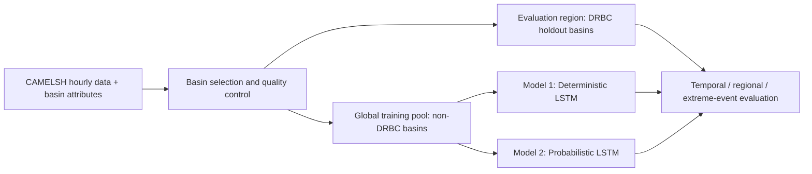
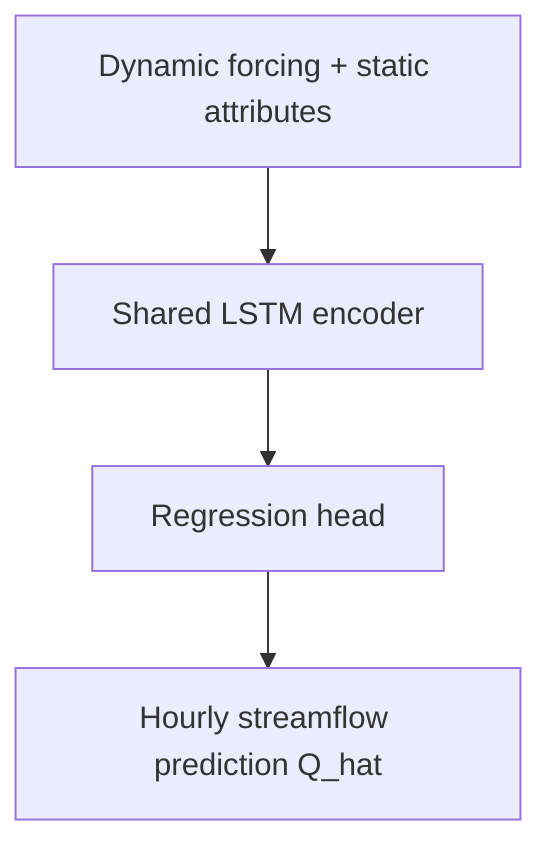
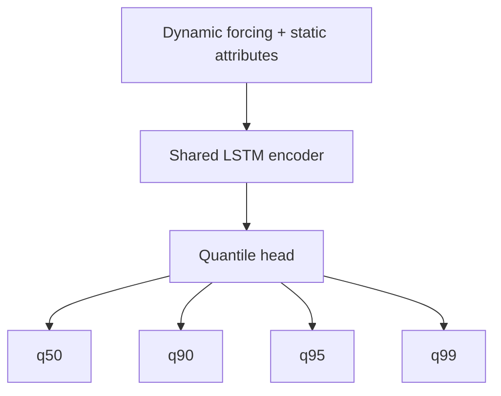
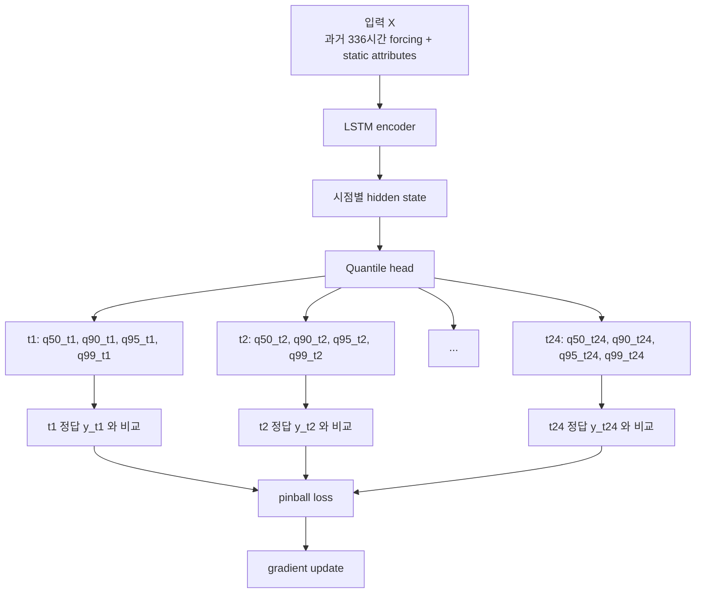
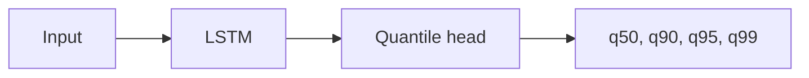

# 극한 홍수 첨두 과소추정 완화를 위한 Multi-Basin LSTM 확장 연구계획서

## 문서 목적

이 문서는 CAMELS 프로젝트의 연구계획서를 `비전공 검토자도 읽을 수 있는 수준`으로 정리한 참고 노트다. 공식 실험 규칙과 구현 source of truth는 [`../../research/design.md`](../../research/design.md), [`../../research/architecture.md`](../../research/architecture.md), [`../../research/experiment_protocol.md`](../../research/experiment_protocol.md)에 두고, 이 문서는 그 내용을 계획서 문체와 설명 중심 구조로 다시 풀어 적는다.

이 문서의 핵심 질문은 하나다. `왜 기존 deterministic multi-basin LSTM은 극한 홍수에서 첨두 유량을 낮게 예측하는가, 그리고 그 문제를 probabilistic head가 얼마나 줄일 수 있는가`이다. physics-guided conceptual core는 현재 논문 범위 밖의 future work로 둔다.

---

## 1. 연구 배경

홍수 예측 연구에서 deep learning, 특히 LSTM은 이미 강한 baseline으로 자리 잡았다. 대표적으로 Kratzert et al. (2018)은 rainfall-runoff 문제에서 LSTM이 전통적인 single-basin 설정보다 더 넓은 자료를 활용하는 regional 학습에서 강한 성능을 보일 수 있음을 보여줬다. 이어 Kratzert et al. (2019)은 여러 basin을 동시에 학습하는 `multi-basin` 또는 `regional/global` LSTM이 basin 간에 공유되는 수문학적 패턴을 배울 수 있음을 보여줬고, static attributes를 basin identity의 요약 표현으로 활용하는 방향을 정교화했다.

하지만 기존 연구의 다수는 `평균적인 시계열 적합도`를 주요 성능 기준으로 삼았다. 이때 자주 쓰이는 NSE, KGE 같은 지표는 전반적인 예측 품질을 평가하는 데는 유용하지만, 홍수 대응에서 가장 중요한 `큰 첨두 유량을 얼마나 잘 재현하는가`를 직접적으로 묻지는 않는다. 실제로 수문 시계열은 평상시나 중간 유량이 대부분이고, 아주 큰 peak는 드물다. 이런 데이터 분포에서는 point prediction 모델이 손실을 평균적으로 줄이는 방향으로 학습되면서, 드물고 큰 peak를 다소 눌러 예측하는 `peak underestimation` 경향이 생길 수 있다.

Probabilistic hydrology 연구는 이 문제에 다른 각도에서 접근했다. Klotz et al. (2022)은 uncertainty estimation이 hydrologic prediction에서 단지 부가 기능이 아니라, calibrated prediction을 위해 필수적이라고 정리했다. 하지만 이 계열 연구는 대체로 `확률 예측이 잘 calibration되었는가`에 더 초점을 두었고, `hourly flood peak underestimation` 자체를 중심 문제로 세우지는 않았다.

Physics-guided 또는 hybrid hydrology 연구도 중요한 흐름이다. MC-LSTM (Hoedt et al., 2021)은 mass conservation을 구조 안에 집어넣는 시도를 보여줬고, differentiable hydrologic model, interpretable LSTM, hybrid runoff model 연구들은 physics를 neural sequence model 안에 어떻게 넣을지를 다양하게 실험했다. 다만 최근 비판 연구들은 `physics를 넣는다고 자동으로 좋아지지 않는다`는 점도 보여줬다. 특히 `To bucket or not to bucket?` (2024), `When physics gets in the way` (2026) 같은 논의는 naive dynamic-parameter hybrid가 해석성과 성능을 동시에 보장하지 않는다는 점을 강조한다.

결국 현재 비어 있는 질문은 다음과 같다.

첫째, `같은 LSTM backbone 위에서 output head만 probabilistic하게 바꿔도 peak underestimation이 줄어드는가`.

둘째, `이 개선이 같은 basin의 다른 시기뿐 아니라, 처음 보는 basin과 훈련에서 거의 보지 못한 extreme event에서도 유지되는가`.

셋째, `probabilistic head만으로 남는 한계는 무엇이며, future work에서 어떤 conceptual core가 필요한가`.

이 연구는 바로 이 세 질문에 답하려는 계획이다.

---

## 2. 연구 목표와 핵심 가설

이 연구의 직접적인 목표는 극한 홍수 첨두 과소추정을 줄이는 것이다. 더 구체적으로는 `deterministic -> probabilistic`의 두 모델을 같은 backbone과 같은 split 위에서 비교하여, `tail-aware output`의 효과를 분리해 설명하는 것이 목적이다.

핵심 가설은 세 가지다.

1. Deterministic LSTM의 peak underestimation 상당 부분은 backbone 자체보다 `output design`의 문제일 수 있다. 즉 point prediction 하나만 내는 구조가 upper tail을 충분히 열지 못할 수 있다.
2. 같은 backbone에 probabilistic quantile head를 추가하면, 평균 회귀만 하던 모델보다 큰 첨두 유량을 더 직접적으로 학습할 수 있어 peak magnitude bias가 완화될 수 있다.
3. physics-guided conceptual core는 후속 연구에서 peak timing과 basin generalization을 보완할 가능성이 있다. 다만 이때 구조는 naive dynamic-parameter shell이 아니라 `state/flux-constrained` 형태여야 한다.

---

## 3. 연구 질문

이 연구는 아래 세 질문을 중심으로 설계된다.

1. `Deterministic multi-basin LSTM`이 보이는 extreme flood peak underestimation이 `probabilistic head`만으로 얼마나 줄어드는가?
2. 이 개선은 `temporal split`, `regional basin holdout`, `extreme-event holdout`에서 모두 유지되는가?
3. probabilistic head 이후에도 남는 timing과 routing 한계는 무엇인가?

---

## 4. 연구의 전체 구조

이 연구는 새로운 backbone 경쟁을 하는 논문이 아니다. backbone은 첫 단계에서 `multi-basin LSTM`으로 고정하고, output과 physics 구조만 단계적으로 바꾼다. 그래야 성능 차이를 해석할 수 있기 때문이다.



위 구조도는 Markdown에서 `Mermaid`로 그린 것이다. Mermaid를 지원하는 뷰어에서는 바로 그림처럼 보이고, 지원하지 않는 뷰어에서는 코드 블록으로 보일 수 있다. 그래서 실제 문서에서는 구조도 바로 아래에 텍스트 설명도 함께 적는 것이 안전하다.

이 구조를 텍스트로 풀면 이렇다. 먼저 CAMELSH hourly와 basin attributes를 준비하고, DRBC와 non-DRBC를 공간적으로 분리한 뒤 품질 게이트를 적용한다. 그다음 non-DRBC basin으로 global multi-basin model을 학습하고, DRBC basin을 holdout evaluation region으로 사용한다. 마지막으로 두 모델을 같은 평가 환경에서 비교한다.

---

## 5. 데이터셋과 연구권역

### 5.1 기본 데이터셋

이 연구의 기본 데이터셋은 `CAMELSH hourly`다. CAMELS 계열 데이터셋은 large-sample hydrology 연구를 위해 만들어진 표준 자료군이며, CAMELSH는 hourly forcing과 hourly streamflow를 제공한다는 점에서 flood peak 연구에 적합하다.

기존 CAMELS-US daily는 일 단위 응답을 보는 데는 유용하지만, 본 연구의 주제인 `홍수 첨두 크기와 시점`은 hourly 자료에서 더 직접적으로 관찰된다. 그래서 본 연구의 주 데이터셋은 CAMELSH hourly로 고정한다.

### 5.2 연구권역과 학습권역의 분리

본 연구의 평가권역은 Delaware River Basin Commission의 공식 경계로 정의한 `DRBC Delaware River Basin`이다. 다만 이 권역은 학습용이 아니라 `regional holdout evaluation region`이다.

학습은 outlet가 DRBC 밖에 있고 polygon overlap이 $0.1$ 이하인 tolerant non-DRBC CAMELSH basin에서 수행한다. 현재 quality-pass non-DRBC training basin 수는 1,923개다.

평가용 DRBC basin은 outlet가 DRBC polygon 내부에 있고 basin polygon overlap ratio가 $0.9$ 이상인 basin으로 정의하며, 현재 선택된 basin은 154개다. 이 중 $obs\_years\_usable \ge 10$, $FLOW\_PCT\_EST\_VALUES \le 15$, $BASIN\_BOUNDARY\_CONFIDENCE \ge 7$ 조건을 통과한 quality-pass basin은 38개다.

즉 이 연구는 Delaware 전용 regional model을 훈련하는 것이 아니라, `global multi-basin model을 non-DRBC에서 학습한 뒤 DRBC에서 일반화 성능을 보는 구조`다.

---

## 6. 유량과 event의 정확한 의미

이 연구에서 target variable은 `Streamflow`이며, 이는 basin outlet gauge에서 측정된 `hourly discharge time series`다. 중요한 점은 이 값이 water level(stage)이 아니라 discharge라는 점이다. 즉 하천 단면을 단위 시간 동안 통과하는 물의 양이며, 일반적으로 `m³/s` 스케일의 유량으로 해석한다.

또한 아래 용어들은 서로 구분해서 써야 한다.

| 용어 | 의미 | 해석 |
| --- | --- | --- |
| `Streamflow` | 시각별 outlet discharge | 모델이 직접 예측하는 기본 target |
| `peak_discharge` | 한 event 안에서 가장 큰 hourly discharge | 홍수 첨두 크기 |
| `annual peak` | 한 해의 최대 discharge | flood frequency 관점의 연최대치 |
| `unit_area_peak` | `peak_discharge / basin area` | basin 크기를 보정한 specific discharge |
| `$Q_{0.99}$ threshold` | basin별 관측 유량의 99번째 분위수 | extreme high-flow event 정의 기준 |

이 연구에서 관심 있는 `peak flow underestimation`은, 실제 홍수 event의 `peak_discharge`를 모델이 체계적으로 낮게 예측하는 현상을 뜻한다.

---

## 7. 입력 변수의 상세 정의

### 7.1 Dynamic forcing

현재 broad config 기준으로 dynamic forcing은 아래 11개다. GenericDataset 표준화 파일의 variable attrs는 비어 있으므로, 여기서는 CAMELSH와 NLDAS 계열 forcing 정의를 기준으로 변수의 물리적 의미를 적는다.

| 입력 변수 | 정확한 의미 | 일반적 단위 | 왜 필요한가 |
| --- | --- | --- | --- |
| `Rainf` | 총 강수량 또는 강수 플럭스 | 실무적으로 mm/h에 대응하는 시간당 강수량으로 해석 가능 | basin에 유입되는 직접적인 물 공급이다. flood peak 생성의 가장 핵심적인 forcing이다. |
| `Tair` | 2m air temperature | K 또는 °C 변환 가능 | 강수가 비인지 눈인지, snowmelt가 가능한지, evapotranspiration 환경이 어떤지를 가늠하게 해준다. |
| `PotEvap` | potential evaporation | mm/h 또는 kg m⁻² h⁻¹ 성격 | 실제 ET가 아니라 대기 조건상 가능한 증발 demand를 나타낸다. basin 건조도와 antecedent depletion을 간접 반영한다. |
| `SWdown` | downward shortwave radiation | W/m² | 태양복사 입력이다. snowmelt와 surface energy balance에 간접적으로 영향을 준다. |
| `Qair` | specific humidity at near-surface level | kg/kg | 대기 수증기 상태를 반영한다. ET demand와 storm moisture 환경을 함께 설명한다. |
| `PSurf` | surface pressure | Pa | 대기 상태의 배경 변수다. 단독으로 해석하기보다 다른 기상변수와 함께 작용한다. |
| `Wind_E` | east-west wind component | m/s | 바람장은 energy exchange와 storm condition의 일부를 나타낸다. |
| `Wind_N` | north-south wind component | m/s | 위와 동일하며, 두 성분을 함께 보면 풍속과 방향 정보를 복원할 수 있다. |
| `LWdown` | downward longwave radiation | W/m² | 장파복사는 지표와 대기 사이의 에너지 교환에 관여한다. snow 및 soil energy 상태와 관련이 있다. |
| `CAPE` | Convective Available Potential Energy | J/kg | 대기 불안정도의 proxy다. convective storm 성격의 강수를 간접적으로 시사한다. |
| `CRainf_frac` | convective rainfall fraction | 0~1 | 전체 강수 중 convective precipitation 비율이다. 짧고 강한 국지성 강수 특성을 반영할 수 있다. |

여기서 `Rainf`는 `얼마나 많이 왔는가`를, `CRainf_frac`는 `어떤 형태의 강수였는가`를 보여준다고 이해하면 된다. `Tair`, `SWdown`, `LWdown`은 snowmelt나 에너지 조건을 간접적으로 반영한다.

### 7.2 Static attributes

현재 프로젝트에서 static attributes는 아래 8개다. 이 값들은 basin마다 변하지 않는 구조적 특성을 요약한다.

| 입력 변수 | 원본 컬럼 | 의미 | 단위/스케일 | 해석 포인트 |
| --- | --- | --- | --- | --- |
| `area` | `DRAIN_SQKM` | 배수면적 | km² | basin 규모의 기본 reference다. 같은 peak라도 작은 basin과 큰 basin의 의미가 다르다. |
| `slope` | `SLOPE_PCT` | 평균 basin slope | % | 클수록 물이 빠르게 모이기 쉬워 flashy flood response 가능성이 커진다. |
| `aridity` | `aridity_index` | 장기 건조도 지수 | 무차원 | 일반적으로 강수와 잠재증발산의 상대 관계를 요약하는 지수다. basin이 건조형인지 습윤형인지 보여준다. |
| `snow_fraction` | `frac_snow` | 강수 중 snow 비율 | 0~1 | snowmelt, rain-on-snow가 중요한 basin인지 보여주는 정적 proxy다. |
| `soil_depth` | `ROCKDEPAVE` | 암반까지의 평균 깊이 | 깊이 지표 | 깊을수록 저장 공간이 커지고 quick runoff가 완화될 가능성이 있다. |
| `permeability` | `PERMAVE` | 평균 투수성 지표 | index 성격 | 침투 가능성의 proxy다. 높을수록 direct runoff가 줄 수 있다. |
| `forest_fraction` | `FORESTNLCD06 / 100` | 산림 피복 비율 | 0~1 | interception과 저장, 완충 효과를 간접 반영한다. |
| `baseflow_index` | `BFI_AVE` | baseflow index | 무차원 | 장기 유출 중 baseflow 비중이다. 높을수록 지하수성 완충이 큰 basin으로 해석한다. |

Static attribute를 왜 넣는지는 선행연구가 잘 보여준다. Kratzert et al. (2019)은 static attributes가 basin identity를 요약하고, basin 간 공유 가능한 hydrologic representation을 학습하는 데 중요하다고 봤다. 쉽게 말하면, 같은 강수라도 `급경사 산지 basin`과 `완만하고 저장성이 큰 basin`은 반응이 다르기 때문에, basin의 구조를 나타내는 정적 정보가 필요하다는 뜻이다.

---

## 8. 모델 구조

### 8.1 공통 backbone

현재 논문의 공식 비교축은 `multi-basin LSTM backbone`을 공유하는 두 모델이다. 현재 구현 기준 backbone은 `cudalstm`이며, single-layer LSTM hidden state를 기반으로 서로 다른 head가 붙는다.

현재 기본 입력-출력 시간 구조는 다음과 같다.

- `$seq\_length = 336$`
- `$predict\_last\_n = 24$`

즉 모델은 최근 336시간, 다시 말해 약 14일의 forcing과 basin attributes를 읽고, 그중 마지막 24시간에 대한 streamflow sequence를 supervision과 evaluation에 사용한다. 이 길이를 쓰는 이유는 홍수 반응이 직전 몇 시간의 비만으로 결정되지 않고 antecedent wetness, soil memory, snow memory, routing memory를 함께 반영하기 때문이다.

### 8.2 Model 1: Deterministic multi-basin LSTM

Model 1은 가장 기본적인 baseline이다.



이 모델은 각 시간 스텝마다 유량 하나 `Q_hat`만 예측한다. 평균적인 수문곡선을 맞추는 데는 강할 수 있지만, 드물고 큰 peak를 특별히 열어 주는 구조는 아니다.

### 8.3 Model 2: Probabilistic multi-basin LSTM

Model 2는 backbone은 그대로 두고 head만 바꾼다.



여기서 각 quantile의 의미는 다음과 같다.

- `$q_{0.50}$`: 중심선 역할의 중앙값 예측
- `$q_{0.90}$`: 조건부 상위 90% 분위수
- `$q_{0.95}$`: 조건부 상위 95% 분위수
- `$q_{0.99}$`: 조건부 상위 99% 분위수

중요한 점은 $q_{0.99}$가 “99년 빈도 홍수”를 뜻하는 것이 아니라는 점이다. 이 값은 flood frequency analysis의 return period가 아니라, 현재 입력 조건 아래에서 모델이 예측한 상위 tail 위치다.

현재 설계에서는 `quantile crossing`을 피하기 위해 상위 quantile을 `positive increment` 구조로 만드는 방향을 사용한다. 직관적으로는 $q_{0.50}$을 기준선으로 두고, $q_{0.90}$, $q_{0.95}$, $q_{0.99}$를 그 위에 양의 증가량으로 차곡차곡 쌓는 구조다. 이렇게 하면

$$
q_{0.50,t} \le q_{0.90,t} \le q_{0.95,t} \le q_{0.99,t}
$$

가 자동으로 보장된다.

### 8.3A Quantile output이 실제로 어떻게 학습되는가

Quantile model을 이해할 때 가장 헷갈리기 쉬운 지점은 `$q_{0.99,t}$가 과거 336시간의 큰 값 99%를 참고하는가`라는 질문이다. 답은 아니다. $q_{0.99,t}$는 과거 관측 유량의 99번째 분위수를 직접 뽑는 값이 아니라, 입력 $X$가 주어졌을 때 예측 대상 시점 $t$의 Streamflow가 가질 조건부 99% quantile이다.

현재 학습 샘플 하나는 336시간 입력과 마지막 24시간의 정답 유량 시계열로 이루어진다. 모델은 먼저 입력 $X$만 보고 hidden state를 만들고, 그 hidden state로부터 각 시점의 $q_{0.50}$, $q_{0.90}$, $q_{0.95}$, $q_{0.99}$를 생성한다. 이 단계에서는 정답 $y$를 보지 않는다. 정답 $y$는 그다음 loss를 계산할 때만 들어온다.



중요한 점은 대응 관계가 시점별 1대1이라는 것이다. 예를 들어 $q_{0.99,t_1}$은 $y_{t_1}$과 비교되고, $q_{0.99,t_2}$는 $y_{t_2}$와 비교된다. 즉 $q_{0.99,t_1}$의 오차함수 안에는 $y_{t_2}$, $y_{t_3}$ 같은 다른 시점의 값이 직접 들어가지 않는다. 이때 $y_{t_1}$은 $t_1$ 시점의 실제 관측 유량 한 값이며, 과거 구간의 99번째 분위수나 최대값이 아니다.

이 구조를 더 단순하게 쓰면 아래와 같다.

| 예측 시점 | 모델 출력 | loss에서 비교되는 정답 |
| --- | --- | --- |
| `t1` | `q50_t1, q90_t1, q95_t1, q99_t1` | `y_t1` |
| `t2` | `q50_t2, q90_t2, q95_t2, q99_t2` | `y_t2` |
| `...` | `...` | `...` |
| `t24` | `q50_t24, q90_t24, q95_t24, q99_t24` | `y_t24` |

따라서 저유량 구간에서는 $q_{0.99}$도 낮게 나오는 것이 자연스럽다. 입력 $X$가 건조한 상태, 작은 강수, 낮은 antecedent wetness를 반복해서 보여주면, 그에 대응하는 실제 $y_t$들도 대부분 낮다. 그러면 모델은 학습 과정에서 이런 입력 조건에서는 상위 quantile도 낮아야 한다고 배우게 된다. 반대로 폭우 직후나 flood-prone 상태가 반복되면 같은 구조 안에서 $q_{0.99}$가 더 크게 벌어지도록 학습된다.

수식으로 보면 $\tau = 0.99$ quantile의 pinball loss는 아래처럼 정의된다.

$$
L_{0.99}(y_t, q_{0.99,t}) =
\begin{cases}
0.99 \, (y_t - q_{0.99,t}), & y_t > q_{0.99,t} \\
0.01 \, (q_{0.99,t} - y_t), & y_t \le q_{0.99,t}
\end{cases}
$$

이 식의 의미는 $q_{0.99}$를 너무 낮게 잡았을 때 큰 벌점을 주고, 너무 높게 잡았을 때는 작은 벌점을 주는 것이다. 그래서 모델은 큰 peak를 지나치게 눌러 예측하지 않도록 upper tail을 더 직접적으로 배우게 된다. 하지만 그렇다고 항상 큰 값을 내는 것은 아니다. 같은 입력 패턴에서 낮은 유량이 반복적으로 관측되면, 그 조건부 분포 자체가 낮게 학습되기 때문에 $q_{0.99}$도 낮게 유지된다.

즉 Model 2는 `과거 시계열에서 통계량을 직접 뽑아오는 모델`이 아니라, `입력 조건 X가 주어졌을 때 미래 각 시점 유량의 조건부 quantile function을 학습하는 모델`이라고 이해하는 것이 가장 정확하다.

### 8.4 Future work 메모: Physics-guided conceptual core

Physics-guided conceptual core는 현재 논문의 공식 비교축이 아니다. 다만 Model 2 이후에도 timing, routing, basin generalization 한계가 남는다면, 후속 연구에서는 `bounded flux/coefficient head + conceptual core + residual quantile head` 방향을 검토할 수 있다.

핵심은 LSTM이 conceptual model의 모든 파라미터를 시점별로 마음대로 바꾸는 것이 아니라, `melt`, `infiltration`, `percolation`, `routing coefficient` 같은 제한된 flux 또는 bounded coefficient만 제안하게 하는 것이다. 이 설계는 naive hybrid에 대한 최근 비판을 피하기 위한 future-work 방향이다.

---

## 9. 실험 split 설계

### 9.1 Temporal split

Temporal split은 같은 basin을 두고 시간만 나누는 기본 실험이다. 현재 broad config 초안은 다음과 같다.

- train: `2000-01-01` ~ `2010-12-31`
- validation: `2011-01-01` ~ `2013-12-31`
- test: `2014-01-01` ~ `2016-12-31`

이 실험은 `same-basin / different-time` 일반화를 보는 기준선이다.

### 9.2 Regional basin holdout

Regional holdout은 이 연구의 핵심 split 중 하나다. 학습은 non-DRBC basin에서 하고, 평가는 DRBC basin에서 한다. broad 원본 split은 `train 1722 / validation 201 / DRBC quality-pass test 38`이고, 현재 broad prepared split은 `minimum quality gate` 이후 `split-level usability gate`를 적용한 결과로 `train 1705 / validation 198 / test 38`이다. 즉 공식 실행 기준은 prepared split과 basin master checklist다.

이 split은 PUB/PUR 계열의 regionalization 문제와 연결된다. 즉 처음 보는 유역 혹은 region에 대한 일반화 성능을 보는 실험이다.

### 9.3 Extreme-event holdout

Extreme-event holdout은 `아주 큰 홍수 이벤트를 일부러 학습에서 빼고`, 나중에 테스트에서만 보여 주는 실험이다. 목적은 모델이 평소에 자주 본 보통 수준의 유량만 잘 맞추는지, 아니면 `훈련 때 거의 보지 못한 큰 첨두`가 나와도 어느 정도 버티는지를 확인하는 데 있다. 즉 이 실험은 단순한 시간 분할이 아니라, `드문 extreme event에 대한 외삽 성능`을 보는 절차다.

쉽게 말하면 이런 생각이다. 모델이 평소 홍수는 잘 맞추더라도, 아주 큰 홍수는 학습에서 거의 본 적이 없으면 peak를 다시 눌러서 예측할 수 있다. Extreme-event holdout은 바로 그 약점을 일부러 드러내기 위한 시험이다.

Event 정의는 [`../../workflow/event_response_spec.md`](../../workflow/event_response_spec.md)를 따른다. 핵심 규칙은 아래와 같다.

1. 각 basin에서 먼저 유난히 큰 유량을 고르기 위해 기본 threshold를 hourly discharge의 $Q_{0.99}$로 둔다. 이는 해당 basin의 전체 시간 중 상위 1% 정도에 해당하는 높은 유량만 우선 보겠다는 뜻이다.
2. 어떤 basin은 $Q_{0.99}$를 넘는 event가 너무 적을 수 있다. 이 경우 표본이 부족해지므로 $Q_{0.98}$, 그래도 부족하면 $Q_{0.95}$까지 완화해서 최소한 분석 가능한 event 수를 확보한다.
3. peak candidate 사이 간격이 $\Delta t_{\mathrm{sep}} = 72\,\mathrm{h}$ 미만이면 이를 서로 다른 홍수 두 개로 세지 않고, 하나의 event cluster로 묶는다. 이는 한 번의 긴 홍수 동안 생긴 여러 작은 봉우리를 중복 계산하지 않기 위한 규칙이다.
4. 최종 대표 peak가 정해지면, 그 peak를 기준으로 유량이 threshold 아래로 내려간 직전과 직후 시점을 event start와 event end로 잡는다. 이렇게 하면 event의 시작, 첨두, 종료를 일관된 규칙으로 자를 수 있다.

예를 들어 어떤 basin에서 3월 10일에 매우 큰 peak가 나타났고, 그 전후로 하루 정도 간격의 작은 peak가 몇 번 더 있었다고 하자. 이때 peak 간 간격이 $72\,\mathrm{h}$보다 짧으면 이것들을 여러 개의 홍수로 세지 않고 하나의 큰 홍수 event로 묶는다. 그리고 그 event에서 가장 큰 peak만 대표 peak로 삼아 평가한다.

따라서 이 split의 핵심은 `테스트 시기를 뒤로 미루는 것`이 아니다. 핵심은 `학습에서 거의 보지 못한 큰 첨두를 따로 떼어 두고`, 그 상황에서 모델이 peak 크기와 timing을 얼마나 유지하는지를 보는 데 있다.

---

## 10. 손실 함수와 학습 목표

### 10.1 Model 1

Model 1의 기본 loss는 `NSE-style deterministic loss`다. 현재 구현 기준으로는 `loss: nse`를 사용한다.

NSE는 관측 평균을 예측하는 것보다 모델이 얼마나 더 잘하는지를 보는 지표다. basin마다 유량 scale 차이가 크기 때문에, 첫 baseline에서는 단순 MSE보다 NSE가 더 자연스럽다.

### 10.2 Model 2

Model 2는 `pinball loss`를 사용한다. Quantile set은 아래처럼 둔다.

```yaml
quantiles: [0.5, 0.9, 0.95, 0.99]
quantile_loss_weights: [1.0, 1.0, 1.0, 1.0]
```

Pinball loss의 직관은 간단하다. `q90`은 실제값의 약 90%가 그 아래에 오도록 학습되어야 하므로, 실제 peak보다 너무 낮게 예측했을 때 더 큰 벌을 주게 된다. 이 특성 때문에 upper tail을 직접 학습시키는 데 유리하다.

동일 가중치를 쓰는 이유는 첫 비교 실험에서 `head 구조의 순수 효과`를 보고 싶기 때문이다. tail quantile에만 더 큰 가중치를 주면, 그 효과가 head 변화 때문인지 loss weighting 때문인지 분리하기 어려워진다.

### 10.3 Future work 메모

Physics-guided conceptual core를 후속 연구로 확장할 경우에는 Model 2의 probabilistic loss 위에 physics regularization을 추가하는 방향을 생각할 수 있다.

$$
L_{\mathrm{total}}=L_{\mathrm{prob}}+ \lambda_{\mathrm{mass}} L_{\mathrm{mass\_balance}}+ \lambda_{\mathrm{nonneg}} L_{\mathrm{nonnegativity}}+ \lambda_{\mathrm{bound}} L_{\mathrm{storage\_bounds}}
$$

현재 단계에서는 exact 값보다, 어떤 물리 제약을 어떤 목적으로 넣을지가 더 중요하다.

---

## 11. 평가 지표와 그 의미

### 11.1 전체 성능 지표

| 지표 | 의미 | 왜 필요한가 |
| --- | --- | --- |
| `NSE` | 관측 평균 대비 시계열 오차 감소 정도 | 전반적인 hydrograph 적합도의 기준선이다. |
| `KGE` | 상관, 평균 bias, 변동성을 함께 보는 효율 지표 | “모양이 맞는가, 평균이 맞는가, 변동폭이 맞는가”를 같이 본다. |
| `NSElog` | log-transformed flow에서의 NSE | 저유량과 중저유량 영역을 놓치지 않는지 확인한다. |

### 11.2 Flood-specific 지표

| 지표 | 의미 | 해석 |
| --- | --- | --- |
| `FHV` | flow duration curve 상위 일부 구간의 peak flow bias | 큰 유량 구간을 체계적으로 낮게 또는 높게 예측하는지를 본다. NeuralHydrology built-in은 상위 2% 흐름을 사용한다. |
| `Peak Relative Error` | `(예측 peak - 관측 peak) / 관측 peak` | 첨두 크기를 signed하게 과소/과대예측했는지를 본다. |
| `Peak-MAPE` | peak relative error의 절댓값 평균 | peak 크기 오차의 절대 규모를 본다. |
| `Peak Timing Error` | 관측 peak와 예측 peak 사이의 시간 차 | peak 시점을 몇 시간 앞당기거나 늦췄는지를 본다. |
| `top 1% flow recall` | 관측 상위 1% 유량 시간대를 예측이 얼마나 회복했는지 | 극한 high-flow 탐지 성능을 본다. |
| `event-level RMSE` | event window 전체 hydrograph의 오차 | peak 하나만이 아니라 event shape 전체를 본다. |

### 11.3 Probabilistic 지표

| 지표 | 의미 | 해석 |
| --- | --- | --- |
| `pinball loss` | quantile 예측 자체의 오차 | probabilistic head가 목표 quantile을 얼마나 잘 학습했는지 보여준다. |
| `coverage` | 예를 들어 q90 아래에 실제 관측이 약 90% 들어가는지 | uncertainty band가 과도하게 좁거나 넓지 않은지를 본다. |
| `calibration` | 예측 quantile과 실제 빈도의 일치 정도 | “90%라고 예측한 것이 실제로도 90%인가”를 묻는다. |

이 연구에서 가장 중요한 해석 포인트는 `point metric`과 `flood-specific metric`을 분리해서 보는 것이다. NSE가 좋아도 peak를 누르면 홍수 연구 관점에서는 충분하지 않다. 반대로 peak만 맞추고 전체 hydrograph가 무너지면 operational value가 떨어질 수 있다.

---

## 12. 현재 broad config 기준 하이퍼파라미터

현재 broad config에서 Model 1과 Model 2는 아래 설정을 공유한다.

| 항목 | 현재 값 | 의미 |
| --- | --- | --- |
| `model` | `cudalstm` | CUDA 기반 LSTM backbone |
| `seq_length` | 336 | 입력 문맥 길이, 약 14일 |
| `predict_last_n` | 24 | supervision 및 evaluation에 쓰는 마지막 24시간 |
| `seed` | 111 | 현재 기본 seed |
| `optimizer` | Adam | 학습 optimizer |
| `clip_gradient_norm` | 1 | gradient explosion 완화 |
| `target_variables` | `Streamflow` | 예측 target |

Model 1 broad config의 주요값은 아래와 같다.

| 항목 | 값 |
| --- | --- |
| `head` | `regression` |
| `loss` | `nse` |
| `hidden_size` | 128 |
| `initial_forget_bias` | 3 |
| `output_dropout` | 0.3 |
| `batch_size` | 256 |
| `epochs` | 30 |

Model 2 broad config의 주요값은 아래와 같다.

| 항목 | 값 |
| --- | --- |
| `head` | `quantile` |
| `loss` | `pinball` |
| `quantiles` | `[0.5, 0.9, 0.95, 0.99]` |
| `quantile_loss_weights` | `[1.0, 1.0, 1.0, 1.0]` |
| `hidden_size` | 128 |
| `initial_forget_bias` | 3 |
| `output_dropout` | 0.3 |
| `batch_size` | 256 |
| `epochs` | 30 |

여기서 `initial_forget_bias = 3`은 LSTM이 과거 정보를 너무 빨리 잊지 않도록 초기 메모리 유지 성향을 높여 주는 설정으로 이해하면 된다.

---

## 13. Basin screening과 event table의 역할

이 연구는 모델 논문이지만, 평가 대상 basin과 event를 어떻게 정의하는지도 중요하다. 현재 workflow는 아래 순서를 따른다.

1. DRBC 공간 기준으로 basin을 선택한다.
2. usable year, estimated-flow fraction, boundary confidence로 품질 필터를 적용한다.
3. event response table을 만들고 observed high-flow relevance를 계산한다.
4. broad cohort와 natural cohort를 분리해 sensitivity를 본다.

Event table은 [`../../workflow/event_response_spec.md`](../../workflow/event_response_spec.md)를 따른다. 여기서 계산하는 주요 변수는 아래와 같다.

| 변수 | 의미 |
| --- | --- |
| `event_start`, `event_peak`, `event_end` | event 시간 경계 |
| `peak_discharge` | event 최대 유량 |
| `unit_area_peak` | 면적 보정 첨두 유량 |
| `rising_time_hours` | event 시작부터 peak까지의 시간 |
| `event_duration_hours` | event 전체 지속시간 |
| `recession_time_hours` | peak 이후 감쇠 시간 |
| `recent_rain_6h`, `24h`, `72h` | peak 직전 최근 강수 누적 |
| `antecedent_rain_7d`, `30d` | peak 이전 선행 강수 누적 |
| `event_mean_temp`, `peak_temp` | event 동안의 온도 상태 |

이 변수들은 단순한 basin 설명이 아니라, `어떤 basin이 정말 flood-like response를 자주 보이는가`를 정량화하는 데 쓰인다.

---

## 14. 예상 결과와 해석 전략

만약 Model 1 대비 Model 2에서 `FHV`, `Peak Relative Error`, `top 1% flow recall`이 개선된다면, 그 결과는 `output design만 바꿔도 tail suppression을 줄일 수 있다`는 해석으로 이어질 수 있다. 즉 peak underestimation의 중요한 원인이 평균 회귀와 point prediction 구조였다는 뜻이다.

현재 논문에서는 Model 1 대비 Model 2에서 `FHV`, `Peak Relative Error`, `top 1% flow recall`, `coverage`, `calibration`이 어떻게 바뀌는지를 가장 중요하게 해석한다. 만약 이 비교 뒤에도 timing이나 basin holdout에서 구조적 한계가 남는다면, 그때 physics-guided conceptual core를 future work로 제안하는 것이 자연스럽다.

이 해석이 중요한 이유는, 많은 hybrid 연구가 여러 요소를 한꺼번에 바꿔서 무엇이 개선의 원인인지 명확하게 말하기 어려웠기 때문이다. 본 연구는 우선 그 원인을 `output design` 관점에서 분리해 설명하는 데 초점을 둔다.

---

## 15. 연구 일정 초안

연구 일정은 아래처럼 잡는 것이 현실적이다.

### 단계 1. Basin/evaluation cohort 확정

- DRBC holdout subset 재확인
- quality gate 고정
- event_response_table 생성
- flood-relevant basin cohort 확정

### 단계 2. Model 1 baseline 재현

- broad split 기준 deterministic LSTM 재학습
- multi-seed protocol 확정
- summary metrics, event metrics 산출

### 단계 3. Model 2 실험

- quantile head 실험 실행
- pinball loss, coverage, calibration 계산
- Model 1과 직접 비교

### 단계 4. 종합 비교와 문서화

- temporal, regional, extreme-event 결과 통합
- basin subgroup 해석
- 논문 본문용 figure/table 작성

---

## 16. 필요한 컴퓨터 사양

본 연구는 시간 단위 multi-basin LSTM과 probabilistic head를 사용하므로 GPU가 사실상 필수다. 로컬 macOS `mps` 환경은 개발 및 안전 실행에는 유용하지만, 논문용 반복 실험에는 CUDA 환경이 더 적합하다.

| 용도 | 최소 사양 | 권장 사양 |
| --- | --- | --- |
| 데이터 전처리 / event table 생성 | 8코어 CPU, RAM 32GB, SSD 1TB | 16코어 CPU, RAM 64GB, NVMe 2TB |
| Model 1 / Model 2 단일 학습 | NVIDIA CUDA GPU 16GB, RAM 64GB | RTX 4090 24GB 또는 동급, RAM 128GB |
| multi-seed, sensitivity, post-processing | CUDA GPU 24GB 이상 | 2x24GB GPU 또는 A100 40GB 이상, RAM 128GB 이상 |

권장 환경은 `GPU 24GB 1장 + RAM 128GB + NVMe 2TB`다. 이유는 hourly sequence 길이와 basin 수가 커서 메모리 요구량이 높고, post-processing과 event-level metric 계산도 함께 수행해야 하기 때문이다.

---

## 17. 선행연구 요약 메모

아래 문헌들은 본 연구계획서의 직접적인 배경이다.

| 문헌 | 핵심 내용 | 우리 연구에 주는 의미 |
| --- | --- | --- |
| Kratzert et al. (2018), *Rainfall-runoff modelling using LSTM networks* | LSTM이 rainfall-runoff에서 strong baseline임을 제시 | Model 1 baseline의 직접 출발점 |
| Kratzert et al. (2019), *Towards learning universal, regional, and local hydrological behaviors* | static attributes와 multi-basin 학습의 정당화 | basin identity를 요약하는 정적 입력 선택 근거 |
| Klotz et al. (2022), *Uncertainty estimation with deep learning for rainfall-runoff modeling* | uncertainty와 calibration을 체계적으로 benchmark | Model 2에서 probabilistic metric을 꼭 같이 봐야 하는 근거 |
| Frame et al. (2022), *Deep learning rainfall-runoff predictions of extreme events* | extreme-event 중심 평가의 필요성 제시 | extreme-event holdout 설계의 직접 배경 |
| Hoedt et al. (2021), *MC-LSTM* | mass-conserving sequence model 가능성 제시 | future-work conceptual core 설계 방향에 영감 제공 |
| Liu et al. (2024), *A national-scale hybrid model for enhanced streamflow estimation* | hybrid model의 장점과 한계를 대규모로 비교 | probabilistic output 이후에도 남는 한계를 future work로 논의할 근거가 된다 |
| Kratzert et al. (2024), *Never train an LSTM on a single basin* | multi-basin large-sample 학습의 중요성 강조 | single-basin이 아니라 global multi-basin strategy를 택해야 하는 근거 |

---

## 18. Markdown에서 구조도를 잘 보이게 쓰는 방법

구조도는 Markdown에서 `Mermaid fenced code block`으로 작성하는 것이 가장 간단하다. 예를 들면 아래 형식이다.

````markdown

````

Mermaid 구조도를 Markdown에 넣을 때는 아래 원칙을 지키는 것이 좋다.

1. node label은 짧고 단순하게 쓴다. 너무 긴 문장을 한 노드에 몰아넣으면 줄바꿈이 이상해지고 가독성이 떨어진다.
2. 괄호, 쉼표, 퍼센트 같은 문자가 많으면 label을 큰따옴표로 감싼다. 예: `A["Peak Timing Error (hours)"]`
3. 구조도 바로 아래에 `텍스트 설명`을 한두 문단 붙인다. Mermaid를 지원하지 않는 뷰어에서는 코드 블록으로만 보일 수 있기 때문이다.
4. 복잡한 구조는 한 장에 다 넣지 말고 `전체 실험 구조`, `모델 구조`, `평가 흐름`처럼 쪼개는 편이 더 잘 보인다.
5. 제출처가 Mermaid를 지원하지 않을 가능성이 있으면, 같은 내용의 간단한 ASCII block이나 표를 추가해 두는 것이 안전하다.

아래처럼 아주 간단한 ASCII fallback을 같이 둘 수도 있다.

```text
CAMELSH hourly + attributes
  -> LSTM backbone
  -> Model 1: regression head
  -> Model 2: quantile head
  -> temporal / regional / extreme-event evaluation
```

즉 가장 안전한 방법은 `Mermaid 구조도 + 바로 아래 텍스트 요약` 조합이다.

---

## 19. 이 문서의 위치와 역할

이 문서는 `research/`의 공식 설계 문서를 대체하지 않는다. 대신 교수님 검토용 연구계획서 초안, 발표용 설명 자료, 제안서 본문 초안의 재료로 사용하기 위한 참고 문서다.

공식 기준 문서는 아래를 우선한다.

- [`../../research/design.md`](../../research/design.md)
- [`../../research/architecture.md`](../../research/architecture.md)
- [`../../research/experiment_protocol.md`](../../research/experiment_protocol.md)
- [`../../workflow/event_response_spec.md`](../../workflow/event_response_spec.md)
