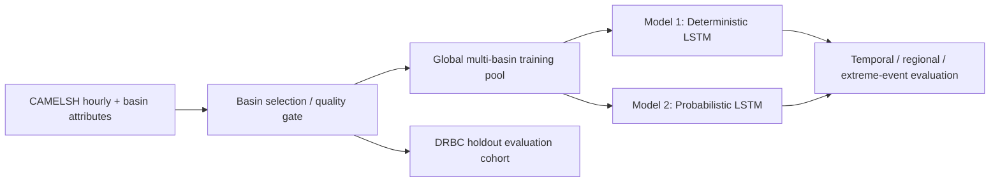
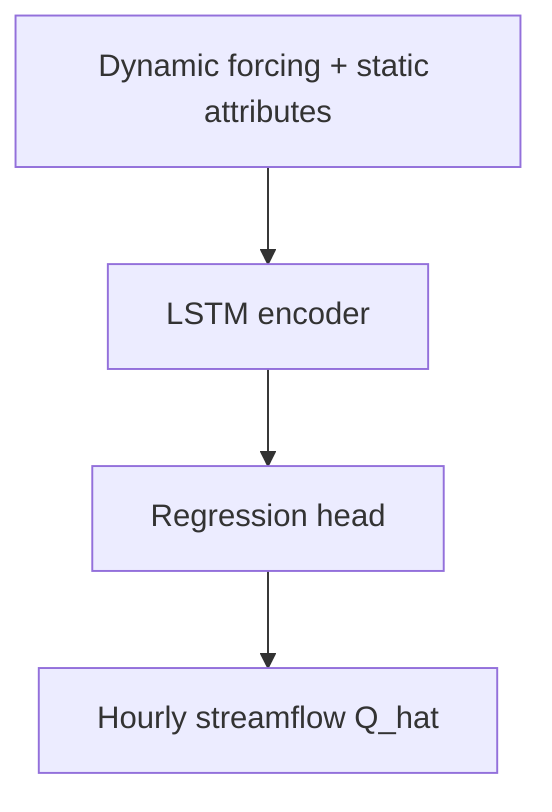
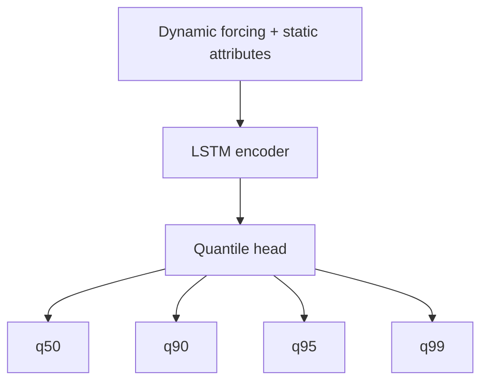

# 제출용 연구계획서 초안

## 문서 목적

이 문서는 현재 CAMELS 프로젝트의 연구 아이디어를 `제출용 연구계획서 문체`로 정리한 초안이다. 설명형 참고 노트인 [`research-plan-extreme-flood-underestimation.md`](research-plan-extreme-flood-underestimation.md)를 바탕으로, 표지, 목차, 연구배경, 선행연구, 연구내용 및 방법, 기대효과, 연구일정, 필요 장비까지 포함하는 형식으로 다시 구성한다.

이 문서는 공식 실험 규칙의 source of truth가 아니다. 실험 규칙과 구현 기준은 [`../../experiment/method/model/design.md`](../../experiment/method/model/design.md), [`../../experiment/method/model/architecture.md`](../../experiment/method/model/architecture.md), [`../../experiment/method/model/experiment_protocol.md`](../../experiment/method/model/experiment_protocol.md)를 우선한다.

## 다루는 범위

- 제출용 연구계획서 형식의 본문 초안
- 표지와 목차를 포함한 Markdown 구조
- 비전공 검토자를 고려한 배경 설명과 formal tone
- 현재 프로젝트 문서와 정합적인 모델, 변수, split, metric 설명

## 다루지 않는 범위

- 실제 제출 기관의 서식에 맞춘 최종 typography
- 예산안, 윤리심의, 개인정보 처리계획 같은 행정 서류
- future-work conceptual core 구현 세부값의 최종 확정

## 상세 서술

---

## 표지

**연구계획서**

**연구과제명**

Reducing Extreme Flood Underestimation with Probabilistic Extensions of Multi-Basin LSTM Models

**국문 제목**

Probabilistic Head 확장을 통한 Multi-Basin LSTM의 극한 홍수 첨두 과소추정 완화

**연구 구분**

수문 예측 모델링 / AI 기반 rainfall-runoff modeling / extreme flood prediction

**연구 데이터셋**

CAMELSH hourly dataset

**연구 기간**

작성 시점 기준 후속 세부 일정 확정 예정

**작성자**

- 소속:
- 성명:
- 지도교수:
- 작성일:

---

## 목차

1. 연구 개요
2. 연구 배경 및 필요성
3. 선행연구 검토
4. 연구 목표와 가설
5. 연구 내용 및 방법
6. 모델 구조와 실험 설계
7. 평가 지표와 분석 방법
8. 기대효과 및 학술적 기여
9. 연구 추진 일정
10. 연구 수행 환경 및 필요 장비
11. 참고문헌

---

## 1. 연구 개요

본 연구는 multi-basin LSTM 기반 수문 예측에서 자주 나타나는 `극한 홍수 첨두 유량의 과소추정` 문제를 줄이는 것을 목표로 한다. 기존 deterministic streamflow prediction 모델은 전반적인 hydrograph 적합도에서는 경쟁력이 있으나, 드물고 큰 홍수 event에서 peak flow를 실제보다 낮게 예측하는 경향이 있다. 이러한 한계는 홍수 예측과 위험 평가에서 실질적인 제약이 된다.

본 연구는 이 문제를 `두 모델 비교 구조`로 접근한다. 첫 번째 단계는 deterministic multi-basin LSTM baseline이다. 두 번째 단계는 backbone은 그대로 두고 output head만 probabilistic quantile head로 바꾼 모델이다.

이와 같은 비교 구조를 채택하는 이유는 성능 향상의 원인을 가장 먼저 `output design`으로 분리하기 위해서다. 따라서 본 연구는 단순 성능 비교를 넘어서, 극한 홍수 첨두 과소추정이 왜 발생하며 probabilistic head가 그 문제를 얼마나 줄일 수 있는지를 설명하는 연구다. physics-guided conceptual core는 future work로 둔다.

---

## 2. 연구 배경 및 필요성

최근 hydrology 분야에서는 deep learning, 특히 LSTM 기반 rainfall-runoff 모델이 강력한 baseline으로 자리 잡았다. CAMELS 계열 large-sample hydrology 데이터셋이 정착하면서, 여러 유역을 함께 학습하는 multi-basin 또는 regional/global model이 단일 유역 중심의 전통적 접근보다 더 강한 일반화 능력을 가질 수 있다는 점이 반복적으로 보고되었다.

그러나 기존 연구의 주요 성능 지표는 대체로 전체 시계열 적합도 중심이었다. 대표적인 NSE와 KGE는 전체적인 수문곡선 재현 성능을 평가하는 데 유용하지만, 실제 재난 대응에서 중요한 것은 `큰 홍수 event에서 첨두 크기와 시점을 얼마나 정확히 맞추는가`이다. 평상시 자료가 압도적으로 많은 수문 시계열의 특성상, point prediction 모델은 평균적인 오차를 줄이는 방향으로 학습되기 쉽고, 그 결과 rare extreme peak를 체계적으로 낮게 예측할 가능성이 있다.

이러한 underestimation은 단순한 평균 오차 문제가 아니다. 홍수 시에는 peak magnitude의 작은 차이도 피해 규모 예측, 경보 기준 초과 여부, 대응 시간 확보에 큰 영향을 줄 수 있다. 따라서 본 연구는 전체 skill뿐 아니라 flood-specific skill을 분리해 평가하는 구조가 필요하다고 본다.

또한, 실제 수문 적용에서는 `처음 보는 유역`과 `훈련에서 거의 보지 못한 큰 event`에 대한 일반화가 중요하다. 따라서 같은 basin의 다른 시기만 평가하는 temporal split만으로는 충분하지 않다. 본 연구는 DRBC Delaware River Basin을 regional holdout evaluation region으로 두고, extreme-event holdout까지 포함하여 보다 엄격한 실험 구조를 설계한다.

---

## 3. 선행연구 검토

### 3.1 Large-sample hydrology와 multi-basin 학습

Addor et al. (2017)의 CAMELS 데이터셋은 basin attributes와 meteorological forcing을 표준화하여 large-sample hydrology 연구의 기반을 마련하였다. 이후 Kratzert et al. (2018)은 LSTM이 rainfall-runoff 문제에서 경쟁력 있는 baseline임을 보여주었고, Kratzert et al. (2019)은 여러 basin을 함께 학습하는 multi-basin LSTM이 basin 간 공유 가능한 hydrologic regularity를 학습할 수 있음을 제시하였다. 이러한 연구는 basin별로 따로 모델을 만드는 대신, 큰 basin pool에서 공통 표현을 학습하는 전략이 유효함을 보여준다.

Kratzert et al. (2024)의 의견 논문은 이러한 흐름을 더 강하게 정리한다. 해당 연구는 LSTM의 강점이 단순 sequence model 자체보다 `large-sample learning`에서 나온다고 보며, single-basin 학습을 기본값으로 두는 접근을 비판한다. 본 연구가 non-DRBC basin을 넓게 모아 global multi-basin model을 학습하는 이유도 이 문헌적 배경과 직접 연결된다.

### 3.2 Ungauged basin generalization과 holdout 평가

Ungauged basin prediction과 regionalization 연구는 `처음 보는 basin에 대한 일반화`가 hydrologic AI 모델에서 핵심 문제임을 보여준다. Arsenault et al. (2023)과 관련 regionalization 연구들은 LSTM이 전통적 regional transfer보다 더 강한 generalization을 보일 수 있음을 보고하였다. 이는 temporal split만으로 성능을 판단하는 것이 부족하며, basin holdout이나 regional holdout을 반드시 포함해야 함을 시사한다.

본 연구는 이러한 관점을 DRBC holdout 구조에 적용한다. 즉 Delaware basin 자체를 훈련에 포함하지 않고, 다른 basin에서 학습한 global model이 DRBC에서 어떤 성능을 보이는지를 본다. 이 접근은 단지 내부 validation이 아니라, 명시적인 `regional generalization` 검증이라는 점에서 의의가 있다.

### 3.3 Probabilistic hydrology와 uncertainty estimation

Klotz et al. (2022)은 hydrologic deep learning에서 uncertainty estimation의 필요성을 체계적으로 정리하고, probabilistic benchmark를 제시하였다. 이 연구는 calibrated uncertainty가 실용적인 hydrologic prediction에 중요하다는 점을 보여주었으며, `uncertainty를 함께 평가해야 한다`는 논의를 넓혔다.

다만 이 계열 연구는 주로 uncertainty representation과 calibration 자체에 관심을 두었다. 반면 본 연구는 probabilistic output의 목적을 더 구체적으로 `extreme flood peak underestimation 완화`에 둔다. 다시 말해, 본 연구는 uncertainty를 단순 부가 정보로 보는 것이 아니라, `tail-aware output design`이 홍수 peak bias를 얼마나 줄일 수 있는가를 실험적으로 검증하려는 것이다.

### 3.4 Physics-guided 및 hybrid hydrology

MC-LSTM (Hoedt et al., 2021), differentiable hydrologic model, interpretable LSTM hydrology 연구는 physics와 neural sequence model을 결합하려는 다양한 시도를 보여주었다. 이 연구들은 mass conservation, storage interpretation, routing structure 등을 neural model에 직접 반영하려는 방향을 제안하였다.

그러나 최근 hybrid critique 문헌은 모든 physics-guided 구조가 자동으로 유리한 것은 아니라는 점을 지적한다. `To bucket or not to bucket?`와 `When physics gets in the way` 계열 논의는, naive dynamic-parameter hybrid가 오히려 해석 가능성과 예측 성능을 동시에 흐릴 수 있음을 보여준다. 따라서 physics-guided 구조는 넣는 것 자체보다 `어떻게 넣는가`가 중요하다.

본 연구는 이 비판을 수용하되, physics-guided conceptual core는 현재 논문의 메인 비교축에 넣지 않는다. 대신 future work에서는 `dynamic-parameter shell`이 아닌 `state/flux-constrained conceptual core` 방향을 검토한다.

### 3.5 본 연구의 차별성

기존 연구들이 각각 baseline, probabilistic prediction, hybrid modeling, generalization 평가를 다루기는 했지만, 동일한 backbone과 동일한 split 위에서 `deterministic output -> probabilistic output`을 직접 비교하여 peak underestimation 원인을 분해한 연구는 드물다.

본 연구의 차별성은 크게 세 가지다. 첫째, CAMELSH hourly를 사용하여 flood peak magnitude와 timing을 직접 평가한다. 둘째, DRBC regional holdout과 extreme-event holdout을 함께 둔다. 셋째, Model 1 대비 Model 2의 차이를 `output design 효과`로 해석할 수 있게 비교축을 설계한다.

---

## 4. 연구 목표와 가설

본 연구의 최종 목표는 multi-basin LSTM 기반 수문 예측에서 extreme flood peak underestimation을 줄이는 것이다. 이를 위해 아래 세 가지 세부 목표를 둔다.

첫째, deterministic multi-basin LSTM baseline을 hourly CAMELSH와 DRBC holdout 환경에서 재현 가능한 형태로 확립한다.

둘째, 같은 backbone 위에 probabilistic quantile head를 추가하여, output design 변화만으로 peak underestimation이 얼마나 줄어드는지 정량화한다.

셋째, probabilistic baseline 이후에도 남는 한계를 future work 질문으로 정리한다.

본 연구의 핵심 가설은 다음과 같다.

1. Deterministic LSTM의 extreme flood peak underestimation은 상당 부분 `output design 문제`다.
2. Probabilistic quantile head는 upper-tail quantile을 직접 학습함으로써 peak bias를 완화할 수 있다.
3. physics-guided conceptual core는 특히 routing, storage memory, snow- or groundwater-influenced basin에서 후속 확장 가능성을 가진다.

---

## 5. 연구 내용 및 방법

### 5.1 데이터셋과 basin 구성

본 연구의 기본 데이터셋은 `CAMELSH hourly dataset`이다. 이 자료는 hourly forcing과 hourly streamflow, basin attributes를 함께 제공하여, large-sample hydrology와 flood event 연구에 적합하다.

학습용 basin pool은 DRBC 바깥의 CAMELSH basin으로 구성한다. 현재 프로젝트 기준으로는 outlet가 DRBC 밖에 있고 polygon overlap이 $0.1$ 이하인 tolerant non-DRBC basin을 후보로 두며, 이후 usable year, estimated-flow fraction, boundary confidence를 적용한 quality gate를 거쳐 최종 training basin pool을 만든다. 현재 quality-pass training basin 수는 1,923개다.

평가용 basin은 DRBC Delaware River Basin에 속한 basin으로 구성한다. 공간 선택 기준은 `outlet_in_drbc == True`와 $overlap\_ratio\_of\_basin \ge 0.9$이며, 현재 선택된 basin은 154개다. 이 중 $obs\_years\_usable \ge 10$, $FLOW\_PCT\_EST\_VALUES \le 15$, $BASIN\_BOUNDARY\_CONFIDENCE \ge 7$를 동시에 만족하는 quality-pass basin은 38개다.

### 5.2 입력 변수

본 연구는 `dynamic forcing + static attributes`를 공통 입력으로 사용한다.

Dynamic forcing은 현재 broad config 기준으로 아래 11개다.

- `Rainf`
- `Tair`
- `PotEvap`
- `SWdown`
- `Qair`
- `PSurf`
- `Wind_E`
- `Wind_N`
- `LWdown`
- `CAPE`
- `CRainf_frac`

이 변수들은 강수량, 기온, 잠재증발산, 복사, 습도, 기압, 바람, 대기 불안정도, convective 강수 비율을 함께 반영한다. 강수와 온도는 직접적인 runoff generation과 snow/rain 구분에 중요하며, 복사와 잠재증발산은 energy balance와 수분 수지 환경을 간접적으로 나타낸다.

Static attributes는 basin 구조와 장기 반응 특성을 요약하는 변수로 아래 8개를 사용한다.

- `area`
- `slope`
- `aridity`
- `snow_fraction`
- `soil_depth`
- `permeability`
- `forest_fraction`
- `baseflow_index`

이 변수들은 basin 규모, 지형 경사, 장기 건조도, snow 영향, 토양 및 지질 저장 특성, 식생 완충 효과, 지하수성 완충 정도를 요약한다. 선행연구는 이러한 static attributes가 basin identity를 표현하는 데 중요한 역할을 한다고 본다.

### 5.3 출력 변수

본 연구의 target variable은 `Streamflow`, 즉 basin outlet gauge에서 측정된 `hourly discharge`다. 모델 내부에서는 normalized target을 학습하지만, validation과 test 보고는 inverse scaling을 거친 실제 streamflow scale에서 수행한다.

Deterministic Model 1의 출력은 각 시간 스텝의 point estimate $\hat{Q}_t$다. Probabilistic Model 2의 출력은 $q_{0.50}$, $q_{0.90}$, $q_{0.95}$, $q_{0.99}$의 quantile streamflow sequence다. 이때 point metric 계산에는 $q_{0.50}$을 중심 예측선으로 사용한다.

### 5.4 예측 시간 구조

현재 기본 실험 구조는 $seq\_length = 336$, $predict\_last\_n = 24$다. 즉 모델은 최근 336시간의 입력을 읽고 마지막 24시간의 streamflow sequence를 예측한다. 이 설계는 antecedent wetness, soil/snow memory, routing memory를 반영하기 위한 것이다.

### 5.5 실험 split

본 연구는 세 종류의 split을 공식 평가축으로 둔다.

첫째, `temporal split`이다. 같은 basin을 유지한 채 학습 기간과 평가 기간을 나누어 same-basin / different-time 일반화를 평가한다.

둘째, `regional basin holdout split`이다. non-DRBC basin으로 학습한 global model을 DRBC basin에서 평가하여 regional generalization을 측정한다.

셋째, `extreme-event holdout split`이다. basin별 extreme event 일부를 학습에서 제외하고 테스트에서만 평가하여, 훈련 분포 바깥의 홍수 peak에 대한 외삽 성능을 본다.

### 5.6 event 정의와 flood relevance 평가

Extreme-event holdout과 flood-specific metric 계산에는 event 정의가 중요하다. 본 연구에서는 streamflow peak 중심의 event 정의를 사용한다. basin별 기본 threshold는 hourly discharge의 $Q_{0.99}$이며, event 수가 부족하면 $Q_{0.98}$, 그래도 부족하면 $Q_{0.95}$로 완화한다. 독립 event 간격은 $\Delta t_{\mathrm{sep}} = 72\,\mathrm{h}$로 둔다.

이 규칙을 통해 event별 `peak_discharge`, `unit_area_peak`, `rising_time_hours`, `event_duration_hours`, `recent_rain_24h`, `antecedent_rain_7d` 같은 descriptor를 계산할 수 있으며, 이는 flood-specific metric과 post-hoc basin interpretation에 함께 사용된다.

---

## 6. 모델 구조와 실험 설계

### 6.1 전체 구조

본 연구의 전체 실험 구조는 아래와 같다.

이 구조의 목적은 backbone을 고정한 채 output design의 효과를 직접 비교하는 데 있다. physics-guided conceptual core는 현재 논문 범위 밖의 future work 메모로 둔다.

### 6.2 Model 1: Deterministic multi-basin LSTM

Model 1은 baseline 역할을 하는 deterministic model이다.

이 모델은 매 시점 유량 하나만 예측한다. 평균적인 hydrograph 적합도 평가의 기준선으로 사용한다.

### 6.3 Model 2: Probabilistic multi-basin LSTM

Model 2는 backbone은 유지하고 output head만 quantile structure로 바꾼다.

핵심은 point estimate 대신 upper-tail quantile을 직접 예측하는 것이다. 이 단계의 주 질문은 `physics guidance 없이 output design만으로도 peak underestimation이 줄어드는가`이다.

### 6.4 Future work 메모: Physics-guided conceptual core

Physics-guided conceptual core는 현재 논문의 공식 비교축이 아니다. 다만 probabilistic Model 2 이후에도 timing, routing, basin generalization 한계가 남는다면, 후속 연구에서는 `bounded flux/coefficient head + conceptual core + residual quantile head` 방향을 검토할 수 있다.

### 6.5 손실 함수

Model 1은 `nse` 기반 deterministic loss를 사용한다.

Model 2는 `pinball loss`를 사용하며, 기본 quantile set은 $[0.5, 0.9, 0.95, 0.99]$로 둔다. 현재 기본 `quantile_loss_weights`는 모두 동일하다.

Physics-guided conceptual core를 future work로 확장할 경우에는 probabilistic loss 위에 physics regularization을 추가하는 방향을 생각할 수 있다.

---

## 7. 평가 지표와 분석 방법

본 연구는 전체 성능, flood-specific 성능, probabilistic 성능을 분리해서 평가한다.

### 7.1 전체 성능

- `NSE`
- `KGE`
- `NSElog`

이 지표들은 전반적인 hydrograph 적합도를 평가한다. `NSElog`는 저유량과 중저유량 영역을 더 민감하게 본다.

### 7.2 Flood-specific 성능

- `FHV`
- `Peak Relative Error`
- `Peak Timing Error`
- `top 1% flow recall`
- `event-level RMSE`

`FHV`는 큰 유량 상위 구간에서의 편향을 본다. `Peak Relative Error`는 첨두 크기를 얼마나 과소 또는 과대예측했는지를 본다. `Peak Timing Error`는 첨두 시점을 몇 시간 앞당기거나 늦췄는지를 평가한다. `top 1% flow recall`은 극한 high-flow 구간을 얼마나 놓치지 않는지를 보여주며, `event-level RMSE`는 event window 전체 hydrograph shape 재현성을 평가한다.

### 7.3 Probabilistic 성능

- `pinball loss`
- `coverage`
- `calibration`

Probabilistic model에서는 단순히 quantile을 출력하는 것만으로 충분하지 않다. 출력한 quantile이 실제 빈도와 얼마나 잘 맞는지, 즉 uncertainty가 신뢰할 만한지도 함께 평가해야 한다.

### 7.4 결과 해석 전략

Model 1 대비 Model 2의 차이는 `tail-aware output design의 효과`로 해석한다. 만약 peak bias가 크게 줄어든다면, deterministic point prediction의 평균 회귀 성향이 중요한 병목이었다고 볼 수 있다.

현재 논문에서는 Model 1 대비 Model 2의 차이를 명확히 보여주는 것이 핵심이다. 만약 이 비교 뒤에도 timing과 basin holdout에서 구조적 한계가 남는다면, 그때 physics-guided conceptual core를 future work로 제안하는 해석이 자연스럽다.

---

## 8. 기대효과 및 학술적 기여

본 연구의 첫 번째 기대효과는 `홍수 첨두 과소추정 문제를 output design 관점에서 구조적으로 설명할 수 있다`는 점이다. 많은 기존 연구는 uncertainty나 hybrid 구조를 제안하면서도, deterministic point prediction에서 probabilistic tail-aware output으로 바꾸는 효과를 같은 backbone 위에서 직접 분리해 보여주지 못했다. 본 연구는 두 모델 비교 구조를 통해 그 원인을 더 명확하게 해석할 수 있다.

두 번째 기대효과는 `hourly CAMELSH와 DRBC holdout을 결합한 flood-focused benchmark`를 제공한다는 점이다. 이는 단지 한 모델의 성능 보고가 아니라, regional holdout과 extreme-event holdout을 함께 포함한 엄격한 비교 구조를 제시한다는 의의가 있다.

세 번째 기대효과는 `후속 physics-guided 확장의 필요 조건을 더 분명히 만든다`는 점이다. 만약 probabilistic head만으로 큰 개선이 가능하다면, 복잡한 hybrid를 먼저 설계하기보다 output design을 먼저 점검하는 것이 더 합리적이라는 결론이 가능하다.

---

## 9. 연구 추진 일정

본 연구는 다음과 같은 단계로 진행한다.

### 1단계. Basin cohort 및 event table 확정

- DRBC holdout basin subset 재검토
- quality gate 확정
- event_response_table 생성
- observed-flow 기반 flood relevance 점검

### 2단계. Model 1 baseline 재현

- broad split 기준 deterministic baseline 학습
- multi-seed protocol 확정
- built-in metric과 custom flood metric 산출

### 3단계. Model 2 실험

- quantile head 및 pinball loss 적용
- coverage, calibration 포함 probabilistic diagnostic 수행
- Model 1과 직접 비교

### 4단계. 종합 분석 및 논문화

- temporal, regional, extreme-event 결과 통합
- basin subgroup별 해석
- figure, table, methods section 정리

---

## 10. 연구 수행 환경 및 필요 장비

본 연구는 hourly multi-basin LSTM 학습과 probabilistic output, event-level post-processing을 포함하므로 GPU 기반 환경이 필요하다. 로컬 macOS `mps` 환경은 안전한 baseline 개발과 소규모 검증에는 유용하지만, 논문용 반복 실험에는 CUDA 환경이 더 적합하다.

권장 사양은 아래와 같다.

| 구분 | 최소 사양 | 권장 사양 |
| --- | --- | --- |
| CPU | 8코어 이상 | 16코어 이상 |
| RAM | 64GB | 128GB |
| GPU | NVIDIA CUDA GPU 16GB | RTX 4090 24GB 또는 동급 24GB 이상 |
| 저장장치 | SSD 1TB | NVMe SSD 2TB 이상 |
| 운영체제 | Linux | Ubuntu 22.04 계열 |

Model 1과 Model 2의 multi-seed sensitivity, post-processing까지 함께 고려하면 `24GB급 GPU 1장 + RAM 128GB + NVMe 2TB` 수준이 가장 실용적이다. 더 큰 규모의 실험을 위해서는 A100 40GB 이상의 서버 환경이 유리할 수 있다.

---

## 11. 참고문헌

- Addor, N., Newman, A. J., Mizukami, N., and Clark, M. P. (2017). The CAMELS data set: catchment attributes and meteorology for large-sample studies.
- Kratzert, F. et al. (2018). Rainfall-runoff modelling using Long Short-Term Memory (LSTM) networks.
- Kratzert, F. et al. (2019). Towards learning universal, regional, and local hydrological behaviors via machine learning applied to large-sample datasets.
- Klotz, D. et al. (2022). Uncertainty estimation with deep learning for rainfall-runoff modeling.
- Hoedt, P.-J. et al. (2021). MC-LSTM: Mass-Conserving LSTM.
- Frame, J. et al. (2022). Deep learning rainfall-runoff predictions of extreme events.
- Liu, Y. et al. (2024). A national-scale hybrid model for enhanced streamflow estimation.
- Kratzert, F. et al. (2024). Never train a Long Short-Term Memory network on a single basin.

## 문서 정리

이 문서는 설명형 참고 노트를 제출용 계획서 형식으로 다시 정리한 초안이다. 표지, 목차, 배경, 선행연구, 방법, 실험 구조, 평가, 기대효과, 일정, 장비를 한 문서 안에서 읽히도록 구성하였다.

현재 단계에서 가장 중요한 점은 backbone을 고정한 상태에서 `deterministic -> probabilistic` 비교를 수행한다는 실험 철학이다. 이는 peak underestimation 완화의 원인을 output design 관점에서 구조적으로 분해해 설명하기 위한 설계다.

## 관련 문서

- [`research-plan-extreme-flood-underestimation.md`](research-plan-extreme-flood-underestimation.md): 설명형 상세 연구계획서 초안
- [`../../experiment/method/model/design.md`](../../experiment/method/model/design.md): 공식 연구 질문과 비교축
- [`../../experiment/method/model/architecture.md`](../../experiment/method/model/architecture.md): 현재 논문 범위의 두 모델 구조와 future-work 메모
- [`../../experiment/method/model/experiment_protocol.md`](../../experiment/method/model/experiment_protocol.md): split, loss, metric의 공식 규칙
