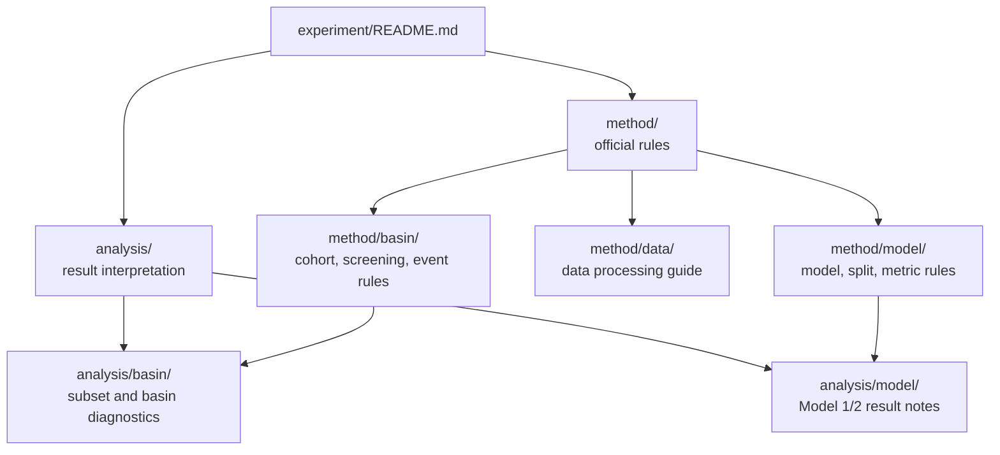

# Experiment Docs

이 폴더는 현재 CAMELSH Model 1/2 연구의 공식 방법과 분석 문서를 둔다. 논문 문장이나 방어용 답변은 [`../paper/`](../paper/)에 두고, 외부 문헌 메모는 [`../references/`](../references/)에 둔다.

## Structure

## Recommended Order

1. [`method/model/design.md`](method/model/design.md)
2. [`method/model/architecture.md`](method/model/architecture.md)
3. [`method/model/experiment_protocol.md`](method/model/experiment_protocol.md)
4. [`method/model/result_analysis_protocol.md`](method/model/result_analysis_protocol.md)
5. [`method/basin/basin_cohort_definition.md`](method/basin/basin_cohort_definition.md)
6. [`method/basin/event_response_spec.md`](method/basin/event_response_spec.md)
7. [`analysis/model/README.md`](analysis/model/README.md)

## Key Documents

| Path | Role |
| --- | --- |
| [`method/model/experiment_protocol.md`](method/model/experiment_protocol.md) | split, loss, metric, checkpoint, artifact 규칙 |
| [`method/model/result_analysis_protocol.md`](method/model/result_analysis_protocol.md) | 결과 비교 순서와 paired-delta 해석 규칙 |
| [`method/model/camelsh_model12_analysis_methodology_plan.md`](method/model/camelsh_model12_analysis_methodology_plan.md) | subset300 Model 1/2 분석 실행 순서 |
| [`method/basin/basin_cohort_definition.md`](method/basin/basin_cohort_definition.md) | DRBC holdout과 non-DRBC training pool 기준 |
| [`method/basin/event_response_spec.md`](method/basin/event_response_spec.md) | observed high-flow event candidate 생성 규칙 |
| [`method/data/data_processing_analysis_guide.md`](method/data/data_processing_analysis_guide.md) | 원자료부터 분석 산출물까지의 end-to-end 흐름 |
| [`analysis/basin/subset300_representativeness_report.md`](analysis/basin/subset300_representativeness_report.md) | fixed `scaling_300` subset 대표성 해석 |
| [`analysis/model/subset300_hydrograph_interpretation_report.md`](analysis/model/subset300_hydrograph_interpretation_report.md) | hydrograph/quantile 결과 해석 |
