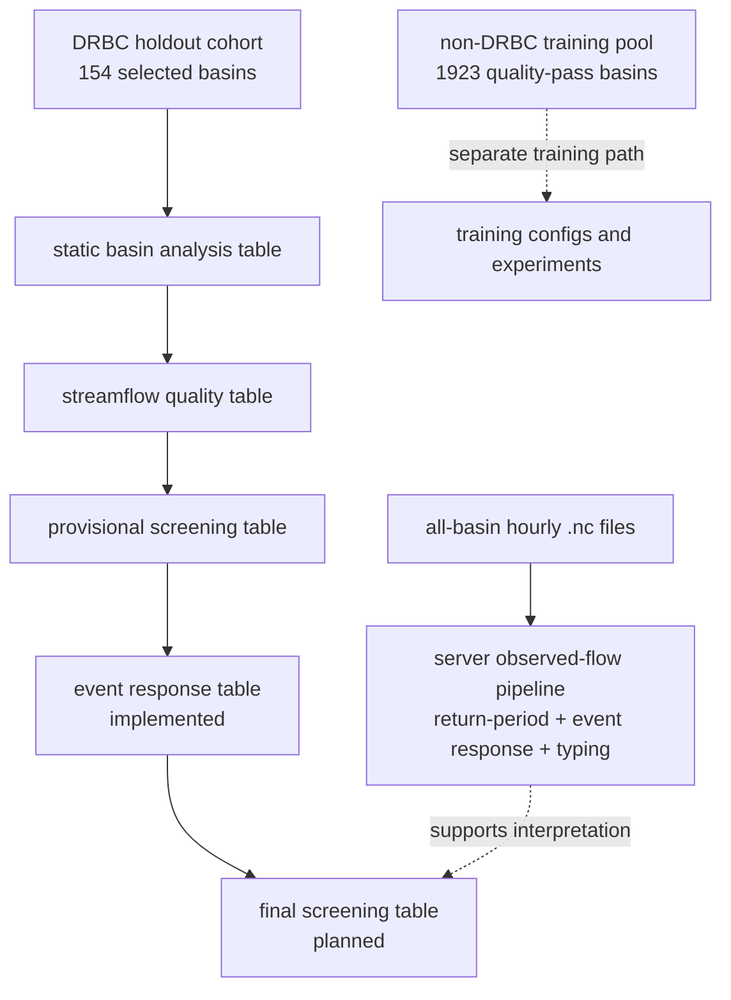
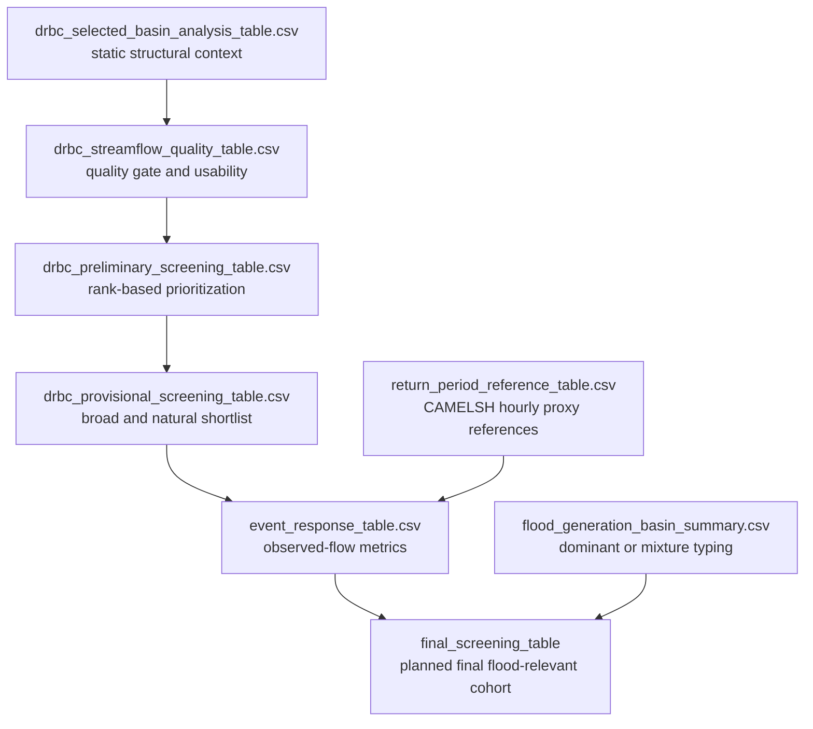

# Basin Analysis — Flood-Relevant Screening Workflow

## 서술 목적

이 문서는 DRBC 기준으로 선택된 CAMELSH holdout basin 위에서 `현재 어떤 산출물이 만들어졌고 workflow가 어디까지 왔는가`를 기록한다. 핵심은 `정적 basin analysis`, `품질 게이트`, `provisional screening`, `최종 observed-flow screening`을 서로 다른 단계로 분리해 현재 상태를 명확히 남기는 것이다.

## 다루는 범위

- basin analysis와 screening workflow의 현재 단계
- 이미 생성된 정적 테이블, 품질 테이블, provisional screening 산출물
- DRBC 및 all-basin observed-flow 산출물 진입점 메모

## 다루지 않는 범위

- 논문 본문용 공식 screening 수식과 규범
- source CSV의 상세 컬럼 사전
- event extraction 규칙 자체

## 상세 서술

## 1. 현재 workflow를 어떻게 이해해야 하는가

현재 workflow는 `global training pool`과 `DRBC holdout analysis`를 분리한다. 이 문서는 그중 DRBC holdout analysis 쪽만 다룬다.



DRBC 바깥의 학습용 basin pool은 `camelsh_non_drbc_training_selected.csv`에 따로 정리되어 있고, 현재 quality-pass basin 수는 1923개다. 이 training pool은 outlet 기준으로는 DRBC 밖이고, polygon overlap은 source mismatch에 따른 small-overlap tolerance로 `0.1` 이하까지 허용한다.

DRBC holdout 쪽 workflow는 세 장의 테이블을 순서대로 쌓는 구조다.

첫 번째는 `static basin analysis table`이다. 여기에는 land use, climate, precipitation summary, topography, soils, geology, hydro summary가 들어간다. 이 테이블은 basin의 구조적 배경을 설명해 주지만, 실제 observed high-flow event candidate가 자주 나타나는지를 직접 보여주지는 않는다.

두 번째는 `streamflow quality table`이다. 여기서는 basin이 연구용으로 쓸 만한지 판단한다. usable year 수, annual coverage, estimated flow 비율, basin boundary confidence, hydromodification risk 같은 정보가 들어간다.

세 번째는 `provisional screening table`이다. quality gate를 통과한 basin만 대상으로 정적 특성을 rank 기반 점수로 묶어 1차 flood-relevant 우선순위를 만든다. 이 테이블은 basin shortlist를 만들기 위한 것이고, 최종 flood-relevant 확정표는 아니다.

즉 지금까지는 `basin 설명`, `연구 가능 basin 선별`, `event-level 분석 전 우선순위 부여`까지 진행됐고, observed-flow event response를 만들 수 있는 실행 진입점도 준비된 상태다. DRBC 전용 산출물은 `output/basin/drbc/screening/` 아래에 두고, 전 유역 서버 산출물은 `output/basin/all/analysis/` 아래에 둔다.

## 2. Static Basin Analysis Table

현재 정적 분석 테이블은 [`drbc_selected_basin_analysis_table.csv`](../../../../output/basin/drbc/analysis/basin_attributes/tables/drbc_selected_basin_analysis_table.csv)다. 이 테이블은 154개 basin에 대해 다음과 같은 정보를 모은다.

land use 쪽에서는 `forest_pct`, `developed_pct`, `crops_pct`, `wetland_pct`, `dom_land_cover` 같은 변수를 본다. 이 변수들은 basin의 표면 상태와 완충 가능성을 설명한다.

climate 쪽에서는 `p_mean`, `p_seasonality`, `frac_snow`, `aridity`, `high_prec_freq`, `high_prec_dur`를 본다. 이 변수들은 basin이 큰 비를 자주 받는지, snow 영향을 많이 받는지, 계절성이 큰지를 설명한다.

topography 쪽에서는 `drain_sqkm_attr`, `elev_mean_m`, `slope_pct`, `stream_density_km_per_sqkm`를 본다. 이 변수들은 물이 얼마나 빨리 모이고 channel network가 얼마나 발달했는지를 보여준다.

soil과 geology 쪽에서는 `soil_available_water_capacity`, `soil_permeability_index`, `soil_water_table_depth_m`, `soil_rock_depth_cm`, `geology_dom_desc`, `geology_dom_pct`를 본다. 이 변수들은 basin의 저장 특성과 침투 가능성을 설명한다.

hydrologic summary 쪽에서는 `baseflow_index_pct`, `RUNAVE7100` 같은 요약값을 본다. 이 변수들은 basin이 평소에 얼마나 완충되는지, 직접유출보다 baseflow 비중이 큰지를 간접적으로 보여준다.

이 테이블은 “왜 이 basin이 flood-like response를 낼 가능성이 있는가”를 설명한다. 이것만으로 최종 flood-relevant evaluation basin을 확정하지는 않는다.

## 3. Streamflow Quality Table

품질 테이블은 [`drbc_streamflow_quality_table.csv`](../../../../output/basin/drbc/screening/drbc_streamflow_quality_table.csv)다. 여기서는 데이터 신뢰성과 basin 경계 품질을 먼저 본다.

중요한 점은 `observed year`를 느슨하게 세지 않는다는 것이다. 연도에 1시간만 값이 있어도 1년으로 세지 않고, 연간 관측 coverage가 0.8 이상인 해만 `usable year`로 인정한다.

현재 quality gate는 다음 조건을 동시에 만족하는 basin만 통과시킨다.

- `obs_years_usable >= 10`
- `FLOW_PCT_EST_VALUES <= 15`
- `BASIN_BOUNDARY_CONFIDENCE >= 7`

여기서 `BASIN_BOUNDARY_CONFIDENCE`를 쓰는 이유는 basin polygon이 있다고 해서 항상 그 경계가 실제 drainage area를 잘 대표하는 것은 아니기 때문이다. 우리는 “경계가 있는 basin”이 아니라 “경계 품질이 충분한 basin”만 남기려는 것이다.

현재 이 gate를 통과한 basin은 154개 중 38개다.

## 4. Provisional Screening Table

현재 provisional screening 결과는 [`drbc_preliminary_screening_table.csv`](../../../../output/basin/drbc/screening/drbc_preliminary_screening_table.csv)와 [`drbc_provisional_screening_table.csv`](../../../../output/basin/drbc/screening/drbc_provisional_screening_table.csv)에 정리되어 있다.

이 단계에서는 quality gate를 통과한 basin만 대상으로, `high_prec_freq`, `high_prec_dur`, `slope_pct`, `stream_density_km_per_sqkm`, `baseflow_index_pct`, `forest_pct`, `soil_available_water_capacity`를 percentile rank로 바꿔 가중합한 `preliminary_flood_prone_score`를 계산한다.

이 점수는 basin의 물리적 flood susceptibility를 반영한 custom heuristic이다. 논문에서 이 점수를 쓸 때는 published canonical formula처럼 쓰면 안 되고, `preliminary prioritization index`로 설명해야 한다. 더 정확히는 이 점수는 공식 screening method가 아니라, 내부적으로 basin shortlist를 빠르게 보는 exploratory 도구다.

현재 provisional screening은 두 개의 cohort를 만든다. `broad cohort`는 quality-pass basin 중 상위 15개이고, `natural cohort`는 hydromodification risk가 없는 basin 중 상위 8개다. 이 둘은 basin shortlist를 만드는 데는 충분히 유용하지만, 공식 논문용 cohort 정의는 아니다. 최종 flood-relevant evaluation cohort는 observed-flow 기반 screening으로 다시 확정해야 한다.

## 5. 왜 여기서 멈추면 안 되는가

정적 특성과 품질 정보만으로는 “large observed streamflow response가 실제로 자주 나타나는 basin”을 최종적으로 말하기 어렵다. 예를 들어 slope가 크고 storage가 작아도, 실제 annual peaks가 작거나 extreme high-flow event candidate가 드물 수 있다.

그래서 논문용으로는 final screening에서 observed-flow 지표가 중심이 되어야 한다. 지금의 provisional score는 observed-flow 분석을 시작하기 전에 어떤 basin을 우선 볼지 정하는 prior로 해석하는 것이 맞다.

## 6. Observed-Flow 분석 진입점

final screening은 static score가 아니라 observed hydrograph response를 중심으로 basin을 다시 정렬해야 한다. 이때 DRBC holdout만 보는 경로와, 전 유역 `.nc`를 서버에서 한 번에 분석하는 경로를 구분한다.

여기서 기억할 점은 두 가지다. 첫째, 공식 metric 정의와 수식은 [`basin_screening_method.md`](basin_screening_method.md)를 기준으로 본다. 둘째, 이 문서에서는 `어떤 산출물이 다음에 추가될지`만 관리한다.

핵심 observed-flow 산출물은 아래와 같다.

- `unit-area annual peak`
- `Q99-level event frequency`
- `Richards–Baker Flashiness Index`
- `event runoff coefficient`
- `recurrence-period reference descriptors`: duration별 `prec_ari2/5/10/25/50/100` 강수량과 `flood_ari2/5/10/25/50/100` 홍수량

재현기간별 강수량과 홍수량은 최종 screening score의 핵심 항목이라기보다, basin과 event의 상대적 극한 규모를 설명하는 참고지표다. 현재 서버 구현은 CAMELSH hourly record의 water-year annual maxima에 Gumbel 분포를 맞춘 proxy를 기본값으로 쓴다. 이 값은 공식 NOAA/USGS frequency product가 아니므로 `flood_ari_source`, `prec_ari_source`, `return_period_confidence_flag`와 함께 해석한다.

event response table의 한 행도 official flood occurrence가 아니라 observed high-flow event candidate다. 따라서 final screening table에는 `selected_threshold_quantile`, `flood_relevance_tier`, `return_period_confidence_flag`를 같이 남겨 Q99-only candidate, Q98/Q95 fallback candidate, return-period proxy 신뢰도를 구분한다.

전 유역 서버 분석은 아래 runner가 담당한다.

```bash
bash scripts/official/run_camelsh_flood_analysis.sh
```

이 runner는 `return_period_reference_table.csv`, `event_response_table.csv`, `event_response_basin_summary.csv`, `flood_generation_event_types.csv`, `flood_generation_basin_summary.csv`를 만든다. 서버 기본 worker 수는 `WORKERS=4`이고, return-period 단계와 event-response 단계에는 progress bar가 출력된다. 이미 return-period reference가 만들어져 있으면 `RUN_RETURN_PERIOD=0`으로 두고 event response와 `degree_day_v2` rule-based QA/baseline typing만 다시 갱신할 수 있다.

모델 결과 해석 단계의 주 stratification은 별도 ML-based event-regime 결과를 사용한다. 현재 채택한 분석은 `hydromet_only_7 + KMeans(k=3)`이고, 산출물은 `output/basin/all/archive/event_regime_variants/` 아래에 둔다. rule-based summary는 이 ML regime 해석이 물리적으로 무리하지 않은지 확인하는 기준선으로 같이 본다.

## 7. 최종 산출물 구조



## 문서 정리

현재 완료된 것은 `static analysis`, `quality gate`, `provisional screening`, 그리고 event response를 만들 수 있는 실행 진입점 준비까지다. 즉 basin shortlist는 이미 만들 수 있지만, “observed high-flow response가 충분한 flood-relevant evaluation basin”을 최종 확정한 상태는 아니다. 현재 커스텀 정적 점수는 내부 shortlist용으로만 유지하고, 논문 본문의 공식 basin screening은 observed-flow 지표를 반영한 final screening table로 설명하는 것이 맞다.

다음 단계는 [`event_response_spec.md`](event_response_spec.md)에 정의한 규칙으로 생성된 observed-flow 산출물을 quality/static table과 결합해 final screening table을 닫는 것이다. 그 단계가 끝나야 논문에서 “이 basin들은 observed high-flow response가 충분한 flood-relevant evaluation cohort로 최종 선정되었다”고 더 안전하게 주장할 수 있다.

## 관련 문서

- basin subset과 공간 기준은 [`basin_cohort_definition.md`](basin_cohort_definition.md)에서 고정한다.
- source CSV와 컬럼 의미는 [`basin_source_csv_guide.md`](basin_source_csv_guide.md)에서 정리한다.
- 공식 screening 수식과 cohort 규칙은 [`basin_screening_method.md`](basin_screening_method.md)에서 다룬다.
- observed-flow event table 규칙은 [`event_response_spec.md`](event_response_spec.md)에서 다룬다.
