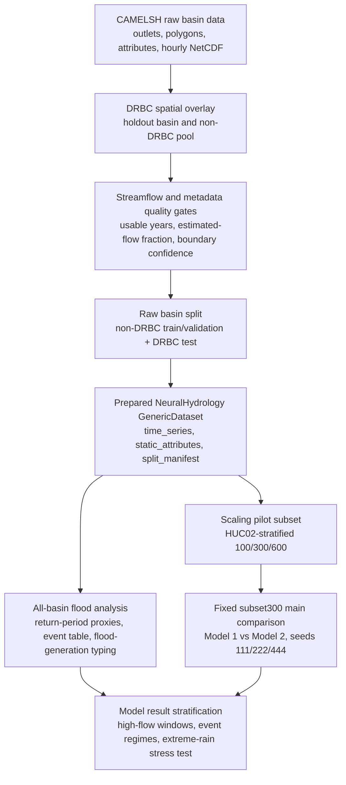
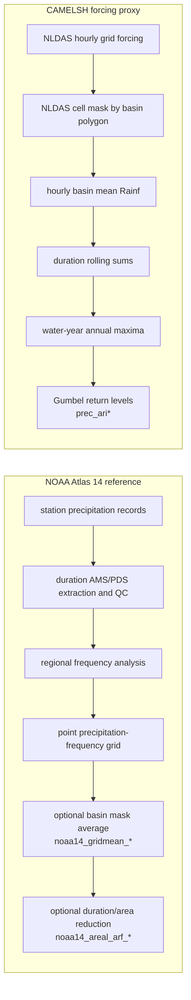

# 데이터 처리와 분석 가이드

## 이 문서의 목적

이 문서는 CAMELS 프로젝트에서 내가 데이터를 어떻게 다루고, 어떤 기준으로 버리고 남기며, 어떤 분석용 파생 변수를 만들고, 그 결과를 모델 실험에서 어떻게 해석하는지를 한 번에 설명하는 안내서다.

기존 문서는 `basin_cohort_definition.md`, `event_response_spec.md`, `experiment_protocol.md`처럼 주제별 기준을 나누어 적고 있다. 이 문서는 그 기준들을 처음 보는 사람이 전체 흐름으로 이해할 수 있게 연결한다. 따라서 세부 구현의 source of truth는 각 스크립트와 canonical 문서에 두되, 여기서는 “왜 이런 처리를 하는가”와 “결과를 어디까지 믿어야 하는가”를 중심으로 설명한다.

가장 중요한 원칙은 하나다. 이 프로젝트는 단순히 CAMELSH 자료를 모델에 넣는 작업이 아니라, `DRBC holdout generalization`과 `extreme peak underestimation`이라는 질문에 맞게 데이터셋을 다시 조직하는 작업이다. 그래서 같은 원자료라도 공간 분리, 품질 필터, 시간 split, event extraction, return-period proxy, model-output 후처리를 거치면서 여러 층의 분석용 테이블로 바뀐다.

## 전체 구조

아래 구조도는 원자료가 실험과 해석 산출물로 바뀌는 큰 흐름이다.



이 흐름에서 `output/`, `runs/`, `tmp/` 아래 산출물은 대부분 gitignored다. 논문 기준을 결정하는 설정 파일과 문서는 git에 남기고, 큰 CSV나 모델 출력은 재생성 가능한 산출물로 둔다.

## 1. 원자료를 어떻게 보는가

기본 데이터셋은 CAMELSH hourly다. CAMELS-US local dataset은 현재 공식 실험에서는 쓰지 않는다. 우리가 쓰는 핵심 파일 계층은 아래처럼 나뉜다.

```text
basins/CAMELSH_data/
  attributes/                 # CAMELSH / GAGES-II 계열 정적 속성
  hourly_observed/info.csv     # hourly streamflow availability 정보

data/CAMELSH_generic/drbc_holdout_broad/
  time_series/*.nc             # NeuralHydrology generic dataset용 basin별 hourly NetCDF
  attributes/static_attributes.csv
  splits/train.txt
  splits/validation.txt
  splits/test.txt
  splits/split_manifest.csv
```

`time_series/*.nc` 안에서 모델이 직접 쓰는 target은 `Streamflow`다. 이것은 수위가 아니라 outlet gauge의 hourly discharge로 해석한다. Dynamic forcing은 `Rainf`, `Tair`, `PotEvap`, `SWdown`, `Qair`, `PSurf`, `Wind_E`, `Wind_N`, `LWdown`, `CAPE`, `CRainf_frac`를 사용한다. Static attributes는 `area`, `slope`, `aridity`, `snow_fraction`, `soil_depth`, `permeability`, `forest_fraction`, `baseflow_index`를 사용한다.

여기서 중요한 선택은 `lagged Q`를 넣지 않는 것이다. 직전 관측 유량을 입력에 넣으면 short-horizon 예측은 강해질 수 있지만, 이 연구가 묻는 “같은 backbone에서 output head를 바꾸면 extreme peak underestimation이 줄어드는가”를 분리해서 보기 어려워진다. 그래서 Model 1과 Model 2 모두 forcing + static attributes만 쓰고, lagged discharge는 후속 ablation으로 남긴다.

## 2. 왜 DRBC를 따로 떼어 놓는가

현재 실험의 test region은 Delaware River Basin Commission 기준 Delaware River Basin이다. 경계 파일은 `basins/drbc_boundary/drb_bnd_polygon.shp`이고, 이 경계는 공간 holdout을 정의하는 기준이다.

DRBC basin을 test로 두는 이유는 random split보다 더 엄격한 regional generalization을 보기 위해서다. Random basin split은 가까운 basin이 train과 test에 섞일 수 있고, 수문학적 유사성이 leakage처럼 작동할 수 있다. 반면 DRBC 전체를 holdout region으로 잡으면, non-DRBC basin에서 학습한 global multi-basin model이 하나의 낯선 지역에 얼마나 일반화되는지 볼 수 있다.

DRBC holdout basin은 `outlet_in_drbc == True`이고 `overlap_ratio_of_basin >= 0.9`인 basin으로 잡는다. 문서 기준 현재 selected set은 `154개`다. outlet만 기준으로는 `192개`지만, polygon overlap 기준을 함께 써서 DRBC 내부 basin으로 보기 어려운 후보를 줄인다.

학습 pool은 반대로 outlet가 DRBC 밖에 있어야 한다. 다만 CAMELSH polygon과 DRBC 공식 경계의 source가 다르기 때문에, 작은 시각적 overlap을 모두 leakage로 보면 과도하게 제외될 수 있다. 그래서 training pool에서는 `outlet_in_drbc == False`이고 `overlap_ratio_of_basin <= 0.1`인 basin까지 허용한다. 이 tolerance로 실제 추가되는 quality-pass basin은 아주 적고, 경계 source mismatch를 흡수하는 역할에 가깝다.

## 3. 품질 gate는 무엇을 막는가

공간적으로 train/test를 나누는 것만으로는 충분하지 않다. 모델이 학습하거나 평가할 basin에는 관측 유량이 충분히 있어야 하고, basin boundary나 유량 자료가 너무 불확실하면 안 된다.

`build_camelsh_non_drbc_training_pool.py`는 non-DRBC training 후보에 대해 quality gate를 적용한다. 핵심 기준은 아래와 같다.

| 기준 | 의미 | 쓰는 이유 |
| --- | --- | --- |
| `obs_years_usable >= 10` | annual coverage가 0.8 이상인 usable year가 최소 10년 | 너무 짧은 유량 기록은 학습과 event 분석 모두 불안정하다. |
| `FLOW_PCT_EST_VALUES <= 15` | estimated flow 비율이 15% 이하 | 추정값이 너무 많은 streamflow record는 실제 관측 기반 해석이 약해진다. |
| `BASIN_BOUNDARY_CONFIDENCE >= 7` | basin 경계 신뢰도 기준 | forcing/attribute와 outlet 유량의 공간 대응이 너무 불확실한 basin을 줄인다. |
| hydromodification flags | dam, canal, power, NPDES 등 영향 | broad pool에서는 바로 제외하지 않고, 별도 natural pool을 만들 때 사용한다. |

이 gate를 통과한 broad non-DRBC training basin은 문서 기준 `1923개`다. hydromodification risk가 없는 natural subset은 `248개`다. 현재 main comparison은 natural-only가 아니라 broad pool에서 출발한다. 이유는 compute-constrained 상황에서도 national-scale multi-basin diversity를 유지하려는 목적이 크기 때문이다. Natural-only는 해석상 깨끗하지만 basin 수와 지역 다양성이 크게 줄어든다.

DRBC 쪽도 별도 streamflow quality gate를 통과한 basin만 test에 들어간다. 현재 raw broad split 기준 DRBC quality-pass test는 `38개`다.

## 4. Raw split과 prepared split은 왜 다르게 보나

프로젝트에는 split이 여러 층 있다. 이 구분을 놓치면 숫자가 헷갈린다.

첫 번째는 raw basin membership split이다. `build_drbc_holdout_split_files.py`가 non-DRBC selected pool을 HUC02 기준으로 train/validation에 나누고, DRBC quality-pass basin을 test로 둔다. 현재 raw broad split은 `train 1722 / validation 201 / test 38`이다.

두 번째는 prepared split이다. `prepare_camelsh_generic_dataset.py`가 raw split을 NeuralHydrology `generic` dataset 구조로 바꾸면서 실제 split 기간 안에 target `Streamflow`가 충분히 있는지 다시 확인한다. 여기서 train은 최소 `720` valid target hours, validation/test는 최소 `168` valid target hours를 요구한다. 이 기준을 통과한 prepared broad split은 `train 1705 / validation 198 / test 38`이다.

세 번째는 subset300 main comparison split이다. broad prepared split 전체를 그대로 학습하면 비용이 크기 때문에, deterministic scaling pilot을 통해 non-DRBC train/validation basin 수를 `300`으로 줄였다. 현재 실제 main comparison이 직접 쓰는 split은 `configs/pilot/basin_splits/scaling_300/`이고, 구성은 `train 269 / validation 31 / test 38`이다.

정리하면 아래처럼 읽는다.

| 층 | 역할 | 현재 숫자 |
| --- | --- | --- |
| raw broad split | 공간/품질 기준으로 만든 원본 membership | `1722 / 201 / 38` |
| prepared broad split | 실제 NeuralHydrology dataset에서 실행 가능한 basin | `1705 / 198 / 38` |
| subset300 split | 현재 compute-constrained main comparison의 직접 실행 split | `269 / 31 / 38` |

논문에서 “현재 본 실험”을 말할 때는 subset300을 기준으로 한다. broad prepared split은 source pool과 reference context다.

## 5. Scaling pilot은 모델 성능 튜닝이 아니다

Scaling pilot은 basin 수를 줄이기 위한 운영 결정용 실험이었다. 여기서 중요한 점은 DRBC test metric으로 subset size를 고르지 않았다는 것이다. DRBC test를 보고 basin 수를 선택하면 test leakage에 가까운 의사결정이 된다.

Pilot은 deterministic Model 1만 사용해 `100 / 300 / 600` subset을 비교했다. subset은 prepared non-DRBC executable pool에서 HUC02-stratified 방식으로 만든다. HUC02 stratification을 쓰는 이유는 전국 basin을 줄일 때 특정 대권역이 과도하게 사라지는 것을 막기 위해서다.

Subset300을 채택한 근거는 여러 축을 함께 본 결과다.

1. non-DRBC validation 성능이 너무 무너지지 않았다.
2. static attribute distribution이 prepared pool과 크게 다르지 않았다.
3. observed-flow event-response distribution이 prepared pool과 잘 맞았다.
4. 같은 크기의 random subset benchmark와 비교해 event-response validation mismatch가 좋은 편이었다.
5. GPU 비용과 저장공간 측면에서 main comparison을 반복 실행할 수 있었다.

Static attribute diagnostics는 `area`, `slope`, `aridity`, `snow_fraction`, `soil_depth`, `permeability`, `forest_fraction`, `baseflow_index`의 standardized mean difference를 본다. Event-response diagnostics는 annual peak specific discharge, Q99 event frequency, RBI, event peak/shape 요약을 본다. 즉 “정적인 basin 모양”뿐 아니라 “실제 유량 response의 분포”까지 확인한 것이다.

현재 seed `111`에서 사용한 `scaling_300` subset을 고정하고, Model 1 / Model 2 seed `111 / 222 / 444`가 같은 basin file을 재사용한다. 이것은 모델 간 공정성을 위해 중요하다. 모델마다 subset이 달라지면 결과 차이가 model head 때문인지 basin sample 때문인지 분리할 수 없다.

## 6. 시간 split은 왜 2000-2016인가

CAMELSH hourly 자료 자체는 더 긴 기간을 포함한다. 그러나 모든 basin이 1980년대부터 균일하게 관측되는 것은 아니다. 너무 이른 기간부터 쓰면 오래된 관측소 몇 개에 맞춰 basin pool이 크게 줄어든다.

현재 공식 비교는 아래 시간 경계를 쓴다.

| split | 기간 | 역할 |
| --- | --- | --- |
| train | `2000-01-01` to `2010-12-31` | 모델 학습 |
| validation | `2011-01-01` to `2013-12-31` | checkpoint 선택과 tuning |
| test | `2014-01-01` to `2016-12-31` | DRBC holdout 최종 평가 |

이 경계는 수문학적으로 유일한 정답이라기보다, basin pool 보존, 충분한 학습 길이, validation/test 분리, benchmark 재현성을 함께 만족시키는 운영 기준이다.

LSTM 입력은 `seq_length = 336`이고, supervision은 `predict_last_n = 24`다. 즉 모델은 최근 336시간, 약 14일의 forcing과 static attributes를 읽고, 마지막 24시간의 streamflow sequence를 학습/평가한다. 이 길이는 홍수 peak가 직전 몇 시간의 강수만으로 결정되지 않고 antecedent wetness, snow memory, routing memory의 영향을 받기 때문에 둔 것이다.

## 7. Model 1과 Model 2에서 데이터는 어떻게 들어가는가

Model 1과 Model 2는 같은 basin, 같은 시간, 같은 dynamic input, 같은 static attributes를 사용한다. 달라지는 것은 output head와 loss다.

| 항목 | Model 1 | Model 2 |
| --- | --- | --- |
| backbone | `cudalstm` | `cudalstm` |
| head | `regression` | `quantile` |
| loss | `nse` | `pinball` |
| output | `y_hat` | `q50`, `q90`, `q95`, `q99` |
| point prediction 해석 | deterministic estimate | `q50`만 median estimate로 사용 |

Model 2의 `q90/q95/q99`는 deterministic prediction이 아니다. 특정 시점의 조건부 upper quantile output이다. 따라서 `q99`를 “99년 홍수”나 “ARI99”처럼 해석하면 안 된다. Return period와 quantile head는 완전히 다른 개념이다.

현재 vendored NeuralHydrology quantile head는 quantile crossing을 구조적으로 줄이기 위해 `q50` 이후 quantile을 positive increment로 쌓는 구조를 사용한다. 그래서 `q50 <= q90 <= q95 <= q99`가 되도록 설계되어 있다.

학습은 paired seed `111 / 222 / 444`로 비교한다. Model 2 seed `333`은 NaN loss로 중단되었고, paired comparison 공정성을 위해 완료된 Model 1 seed `333`도 final aggregate에서 제외한다.

Primary checkpoint는 test를 보기 전에 validation median NSE로 고정한다.

| model | seed | primary epoch |
| --- | ---: | ---: |
| Model 1 | 111 | 25 |
| Model 1 | 222 | 10 |
| Model 1 | 444 | 15 |
| Model 2 | 111 | 5 |
| Model 2 | 222 | 10 |
| Model 2 | 444 | 10 |

Validation checkpoint grid `005 / 010 / 015 / 020 / 025 / 030` 전체 test는 sensitivity 진단이다. Test 결과를 보고 checkpoint를 다시 고르는 용도가 아니다.

## 8. 평가 지표는 어떤 층으로 나뉘나

모델 평가는 하나의 숫자로 끝내지 않는다. 전체 hydrograph 성능과 peak/event 성능이 다르기 때문이다.

기본 basin-level metric은 NeuralHydrology config에 들어간 `NSE`, `KGE`, `FHV`, `Peak-Timing`, `Peak-MAPE`다. 이 값은 basin별 전체 test period에서 모델이 전반적으로 얼마나 잘 맞는지 본다.

그 다음 후처리 분석에서는 high-flow stratum과 event window를 따로 본다. 예를 들어 basin별 observed flow의 top `10%`, `5%`, `1%`, `0.1%` 시간대에서 coverage, underestimation fraction, relative bias, under-deficit, quantile gap을 계산한다. 이 분석은 전체 NSE가 좋아도 peak를 낮게 예측하는 문제가 남아 있는지 보기 위한 것이다.

Event-level 분석은 observed high-flow candidate window 단위로 peak at observed peak hour, predicted window peak, timing error, event RMSE, threshold recall을 계산한다. 여기서 threshold recall은 상위 유량 시간대에서 predictor가 flood-like threshold를 얼마나 따라잡는지 보는 지표다.

현재 해석의 핵심은 `q50`이 좋아졌다는 말이 아니다. 실제 subset300 분석에서 Model 2 `q50`은 high-flow peak에서는 Model 1보다 더 보수적으로 낮을 수 있다. 대신 `q90/q95/q99`가 underestimation deficit을 줄인다. 그래서 결론은 “probabilistic head가 median hydrograph를 개선했다”가 아니라, “같은 LSTM backbone에서 upper-tail quantile output이 extreme peak underestimation을 완화한다”로 써야 한다.

## 9. Return-period reference는 왜 만들었나

Observed high-flow event를 Q99로 뽑으면 event 수는 확보되지만, Q99가 반드시 flood-like scale이라는 뜻은 아니다. 어떤 basin에서는 Q99가 2-year flood보다 낮을 수 있고, 어떤 basin에서는 실제로 큰 홍수에 가까울 수 있다. 그래서 event의 상대적 강도를 해석하기 위해 basin별 return-period reference를 만든다.

현재 `build_camelsh_return_period_references.py`는 hourly `.nc`에서 `Streamflow`와 `Rainf`를 읽고, water-year annual maxima를 만든 뒤 return level을 계산한다.

### 9.1 Flood proxy

Flood 쪽은 hourly `Streamflow`에서 water year별 최대값을 뽑는다.

$$
M_{i,y}^{Q} = \max_{t \in y} Q_{i,t}
$$

그 annual maximum series에 기본값으로 Gumbel 분포를 맞추고, return period \(T\)에 대해 아래 exceedance probability의 quantile을 계산한다.

$$
p_T = 1 - \frac{1}{T}
$$

산출 컬럼은 `flood_ari2`, `flood_ari5`, `flood_ari10`, `flood_ari25`, `flood_ari50`, `flood_ari100`이다.

이 값은 공식 USGS flood frequency가 아니다. CAMELSH hourly `Streamflow`에서 만든 annual-maxima Gumbel proxy다. Hourly 값은 instantaneous annual peak보다 낮게 잡힐 수 있고, record length가 짧으면 100-year extrapolation이 매우 불안정하다. 현재 flood record는 강수보다 짧은 basin이 많아서 `flood_ari100`은 특히 조심해서 해석해야 한다.

### 9.2 Precipitation proxy

Precipitation 쪽은 hourly `Rainf`에서 duration별 rolling sum을 만든다.

| duration | 의미 |
| --- | --- |
| `1h` | maximum hourly rain intensity proxy |
| `6h` | short storm accumulation |
| `24h` | 하루 규모 rainfall accumulation |
| `72h` | multi-day storm accumulation |

각 duration마다 water-year annual maximum을 만들고 Gumbel을 맞춘다. 산출 컬럼은 `prec_ari25_1h`, `prec_ari100_24h` 같은 형식이다. 현재 return period는 `2/5/10/25/50/100`이고, extreme-rain stress test에서는 주로 `25/50/100`을 사용한다.

이 값도 NOAA Atlas 14/PFDS 공식 설계강우가 아니다. CAMELSH forcing 내부에서 만든 proxy다. 이 점은 단순한 source label 차이가 아니라, 강수 자료가 만들어지는 전처리 순서 자체가 NOAA와 다르다는 뜻이다.

CAMELSH 원본 생성 코드는 NLDAS-2 hourly forcing을 내려받은 뒤, `CAMELSH_shapefile.shp`의 basin polygon마다 NLDAS 1/8도 grid center가 polygon 안에 들어가는 cell들을 mask로 잡는다. polygon 안에 cell center가 없으면 가장 가까운 NLDAS grid cell 하나로 fallback한다. 이후 `basins/CAMELSH/functions/readNLDAS.m`은 각 시간마다 `Data_1D(mask{i},:)`를 평균해 basin별 `Dat_sta`를 만들고, `basins/CAMELSH/functions/datatransform.m`은 `Rainf`를 별도 배율 변환 없이 그대로 둔다. 주석상 `Rainf`는 `kg m-2`에서 `mm/h`로 해석되며, hourly accumulated water equivalent에서는 `1 kg m-2 = 1 mm`이므로 단위 차이 때문에 NOAA와 크게 벌어진 것은 아니다. `ConvertCSVtoNC.py`와 우리 `prepare_camelsh_generic_dataset.py`도 `Rainf` 값을 다시 스케일링하지 않는다.

따라서 `prec_ari*_*h`의 실제 의미는 아래와 같다.

$$
P^{\mathrm{CAMELSH}}_{i,t}
=
\frac{1}{|M_i|}
\sum_{c \in M_i}
P^{\mathrm{NLDAS}}_{c,t}
$$

$$
\mathrm{prec\_ari}_{i,T,d}
=
\mathrm{RL}_T
\left(
\max_{y}
\mathrm{rollsum}_{d}
\left(P^{\mathrm{CAMELSH}}_{i,t}\right)
\right)
$$

여기서 \(M_i\)는 basin \(i\)의 NLDAS mask cell 집합, \(d\)는 duration, \(T\)는 return period다. 즉 CAMELSH proxy는 먼저 시간별 강수장을 basin 평균으로 낮춘 다음, 그 basin-average 시계열에서 annual maximum과 Gumbel return level을 계산한다.

### 9.3 왜 Gumbel을 기본값으로 썼나

Gumbel은 annual maxima block에 자주 쓰는 2-parameter extreme-value 모델이다. GEV보다 덜 유연하지만, all-basin batch에서 안정적이다. GEV는 shape parameter까지 추정하므로 tail을 더 유연하게 표현할 수 있지만, basin별 annual maxima 표본이 짧으면 100-year tail이 크게 흔들릴 수 있다.

현재 CLI는 `--distribution gumbel`, `--distribution gev`, `--distribution empirical`을 모두 지원한다. 하지만 공식 기본 산출물은 Gumbel이다. 따라서 논문에서는 “Gumbel이 진짜 tail을 정확히 맞춘다”가 아니라, “CAMELSH 내부 severity proxy를 안정적으로 만들기 위한 기본 annual-maxima frequency estimate”라고 설명해야 한다. GEV는 본문 기준 변경보다 sensitivity로 쓰는 것이 안전하다.

### 9.4 USGS StreamStats reference

Flood 쪽은 USGS StreamStats/GageStats `Peak-Flow Statistics`도 따로 가져온다. `fetch_usgs_streamstats_peak_flow_references.py`는 `PK50AEP`, `PK20AEP`, `PK10AEP`, `PK4AEP`, `PK2AEP`, `PK1AEP`를 각각 `2/5/10/25/50/100년` peak flow로 매핑하고, 원 단위 `ft^3/s`를 `m3/s`로 변환해 `usgs_flood_ari*` 컬럼으로 붙인다.

이 값은 CAMELSH proxy를 자동으로 대체하지 않고 side-by-side reference로 둔다. 이유는 모든 gauge에 USGS peak-flow statistics가 있는 것이 아니고, citation/source provenance를 함께 보아야 하기 때문이다. 다만 flood severity 해석에서는 가능하면 `usgs_flood_ari*`를 우선 reference로 쓰고, 없는 basin에 CAMELSH `flood_ari*`를 fallback으로 쓰는 방향이 더 방어 가능하다.

### 9.5 NOAA Atlas 14 precipitation reference

강수 쪽 공식 point 참고값은 `fetch_noaa_atlas14_precip_references.py`로 NOAA Atlas 14/PFDS point precipitation-frequency estimate를 가져온다. 좌표는 CAMELSH `attributes_gageii_BasinID.csv`의 `LAT_GAGE`, `LNG_GAGE`를 사용하므로, 기존 CAMELSH forcing proxy를 만든 gauge/outlet 위치와 같은 지점 기준이다.

스크립트는 NOAA PFDS mean precipitation depth를 `mm` 단위로 가져오고, 기존 duration과 맞추기 위해 `60-min`, `6-hr`, `24-hr`, `3-day`를 각각 `1h`, `6h`, `24h`, `72h`에 매핑한다. `AMS`는 기존 CAMELSH annual-maxima proxy와 같은 basis라 primary comparison으로 읽고, `PDS`는 실무 설계강우에 가까운 supplementary reference로 읽는다. 산출 컬럼은 `noaa14_ams_prec_ari100_24h`, `noaa14_pds_prec_ari100_24h` 같은 형식이며, `prec_ari*` 원본 proxy를 자동 대체하지 않는다.

CAMELSH `Rainf`는 gauge point 강수가 아니라 basin mask 안 NLDAS grid cell 평균이므로, 직접 비교에는 `fetch_noaa_precip_gridmean_references.py`가 만든 `noaa14_gridmean_*`를 함께 본다. 이 script는 CAMELSH shapefile에서 NLDAS 1/8도 basin mask cell을 재구성하고, NOAA Atlas 14 GIS precipitation-frequency grid를 각 cell 좌표에서 샘플링한 뒤 평균한다. 따라서 `noaa14_*`는 공식 point reference, `noaa14_gridmean_*`는 CAMELSH/NLDAS spatial support에 맞춘 NOAA-derived reference로 분리해서 해석한다.

NOAA Atlas 14 PFDS가 project area 밖으로 응답하는 Oregon/Washington HUC02=17 basin은 `outside_atlas14_project_area`로 기록한다. 이 basin들은 NOAA Atlas 2 GIS grid에서 제공되는 `2/100-year 6/24h` 조합만 `noaa2_gridmean_*` 컬럼으로 저장하고, Atlas 2에 없는 `1h`, `72h`, `5/10/25/50-year` 조합은 채우지 않는다.

`apply_noaa_areal_reduction_references.py`는 이 gridmean table에 basin 면적과 duration별 areal reduction factor를 곱해 `noaa14_areal_arf_*`와 `noaa2_areal_arf_*`를 추가한다. 근거는 HEC-HMS가 설명하는 TP-40/TP-49 depth-area reduction 개념이다. NOAA Atlas 14/PFDS depth는 기본적으로 point precipitation-frequency estimate이므로, 일정 면적 위의 평균 storm depth로 읽으려면 duration과 basin area에 따라 낮아진다. 다만 이 script의 ARF curve는 HEC-HMS 문서의 curve를 근사 digitization한 보조 계산이고, NOAA가 직접 배포한 공식 Atlas 14 산출물이 아니다. 그래서 `noaa14_areal_arf_*`는 CAMELSH `prec_ari*`를 대체하는 값이 아니라, point/gridmean NOAA reference보다 basin-average 강수 기준에 더 가까운 supplementary comparison으로만 사용한다.

### 9.6 NOAA reference와 CAMELSH proxy가 크게 다를 수밖에 없는 이유

NOAA와 CAMELSH의 가장 큰 차이는 “어떤 강수 시계열에 frequency analysis를 하느냐”다. NOAA Atlas 14는 관측소 precipitation record에서 duration별 `AMS` 또는 `PDS`를 추출하고, 품질관리와 regional frequency analysis를 거쳐 point precipitation-frequency estimate surface를 만든다. 반면 CAMELSH `Rainf`는 NLDAS hourly grid를 basin mask 안에서 평균한 forcing이다. 그래서 CAMELSH `prec_ari*`는 공식 관측 기반 설계강우가 아니라 모델 입력 forcing의 내부 severity scale이다.

이 차이는 gridmean NOAA reference를 붙여도 완전히 사라지지 않는다. `noaa14_gridmean_*`는 NOAA Atlas 14 GIS grid의 각 cell 위치에서 이미 계산된 precipitation-frequency depth를 샘플링한 뒤 평균한 값이다. 반면 CAMELSH `prec_ari*`는 시간별 NLDAS 강수량을 먼저 basin 평균하고, 그 평균 시계열의 annual maxima에 Gumbel을 맞춘 값이다. 즉 둘은 아래 두 계산 순서의 차이다.



수식으로는 `noaa14_gridmean_*`가 대략 \(\mathrm{mean}_x(\mathrm{RL}_T(P_x))\)에 가까운 반면, CAMELSH `prec_ari*`는 \(\mathrm{RL}_T(\mathrm{mean}_x(P_{t,x}))\)에 가깝다. 평균과 극값/return-level 계산은 교환 가능하지 않다. 특히 1시간 강수나 큰 유역에서는 국지성 호우 peak가 basin 전체에서 동시에 발생하지 않기 때문에, 먼저 공간 평균을 하면 annual maximum tail이 크게 낮아진다. 그래서 `ari2 1h`처럼 낮은 return period에서도 NOAA point/grid reference보다 CAMELSH proxy가 작게 나올 수 있다.

`noaa14_areal_arf_*`는 이 문제의 일부를 줄이려는 보조 조정이다. NOAA gridmean처럼 `mean_x(RL_T(P_x))`만 평균하면 각 위치의 point-frequency depth가 여전히 storm area 전체에 동시에 온 것처럼 남아 있을 수 있으므로, duration과 basin area에 따른 areal reduction factor를 곱해 basin-average storm depth 쪽으로 낮춘다. 하지만 이것도 `RL_T(mean_x(P_{t,x}))`를 직접 재현하는 것은 아니다. 원래의 시간동시성 있는 NOAA storm field를 다시 만든 것이 아니고, NLDAS forcing의 bias correction, spatial smoothing, hourly temporal allocation, CAMELSH basin mask 처리와 같은 전처리 차이도 그대로 남기 때문이다.

또 하나의 차이는 원자료의 목적이다. NOAA Atlas 14는 precipitation-frequency product라서 extreme precipitation 관측과 regional consistency를 중심으로 만든다. NLDAS forcing은 수문/지표모델 입력용 gridded forcing이므로, 장기 시간연속성과 공간장 일관성이 중요하다. 이 과정에서 짧은 시간의 국지 극값은 관측소 point series보다 완만해질 수 있다. 따라서 NOAA 값이 “정확하니 CAMELSH threshold를 대체한다”라기보다, NOAA는 공식 설계강우 reference, CAMELSH `prec_ari*`는 모델이 실제로 본 forcing-space threshold로 분리해서 써야 한다.

실험 해석 기준은 다음처럼 고정한다. Extreme-rain stress test에서 event를 고르거나 `recent_rain_*_to_prec_ari*` ratio를 계산할 때는 CAMELSH `prec_ari*`를 유지한다. 이것이 Model 1/2가 입력으로 받은 `Rainf`와 같은 공간/전처리 기준이기 때문이다. 반대로 논문에서 “공식 강수 빈도값과 비교하면 어느 정도인가”를 말할 때는 `noaa14_ams_*`, `noaa14_pds_*`, `noaa14_gridmean_*`, `noaa14_areal_arf_*`, 그리고 Oregon/Washington의 `noaa2_gridmean_*`와 `noaa2_areal_arf_*`를 별도 reference로 제시한다. 이 중 `noaa14_areal_arf_*`는 basin-average 설계강우 쪽으로 조정한 sensitivity reference로 두고, 공식 NOAA point estimate는 `noaa14_ams_*`와 `noaa14_pds_*`로 따로 보존한다.

## 10. Observed high-flow event table은 어떻게 만드는가

`build_camelsh_event_response_table.py`는 streamflow에서 event candidate를 만든다. 여기서 event는 official flood inventory가 아니라 observed high-flow candidate다.

기본 threshold는 basin별 hourly `Streamflow`의 Q99다. Q99로 event가 너무 적으면 Q98, 그래도 부족하면 Q95로 완화한다. threshold를 완화하는 이유는 모든 basin에서 충분한 event sample을 얻기 위해서다. 다만 완화된 event는 flood-like severity가 약할 수 있으므로 `selected_threshold_quantile`을 반드시 남긴다.

Event candidate는 threshold를 넘는 구간에서 peak를 찾고, 72시간 안의 candidate peak는 같은 event cluster로 묶는다. Event boundary는 peak 전후로 threshold 아래로 내려가는 지점을 찾아 정한다. 한 event row에는 아래 정보가 붙는다.

| 정보 | 예시 컬럼 | 역할 |
| --- | --- | --- |
| timing | `event_start`, `event_peak`, `event_end` | event window 정의 |
| streamflow response | `peak_discharge`, `unit_area_peak`, `rising_time_hours`, `rising_rate` | 유량 반응의 크기와 빠르기 |
| rainfall descriptors | `recent_rain_6h`, `recent_rain_24h`, `recent_rain_72h` | peak 직전 강수량 |
| antecedent descriptors | `antecedent_rain_7d`, `antecedent_rain_30d` | 선행 습윤 조건 proxy |
| temperature/snow proxy | `event_mean_temp`, `degree_day_*`, `rain_on_snow_proxy` | snowmelt/rain-on-snow 가능성 |
| recurrence ratios | `peak_to_flood_ari*`, `recent_rain_*_to_prec_ari*` | event severity 해석 |

`flood_relevance_tier`는 event peak가 `flood_ari*` proxy에 비해 어느 정도인지 요약한다. 예를 들어 2-year proxy 이상이면 `flood_like_ge_2yr_proxy`, 25-year proxy 이상이면 `flood_like_ge_25yr_proxy` 같은 식이다. 2-year proxy도 못 넘으면 `high_flow_below_2yr_proxy`다.

이 tier는 공식 홍수 판정이 아니다. 같은 CAMELSH record에서 reference와 event ratio를 모두 만들기 때문에 independent validation도 아니다. 그래서 항상 `flood_ari_source`, `prec_ari_source`, `return_period_confidence_flag`와 함께 읽어야 한다.

## 11. Flood-generation typing은 무엇을 하는가

Event table을 만든 뒤에는 event가 어떤 hydrometeorological driver와 연결되는지 해석하기 위한 label을 붙인다. 이 단계는 causal proof가 아니라 stratified evaluation을 위한 설명 층이다.

Rule-based typing은 `degree_day_v2`를 쓴다. 먼저 temperature와 precipitation으로 간단한 degree-day snow routine을 만들어 snow accumulation과 snowmelt water input을 추정한다. 기본값은 `Tcrit = 1°C`, degree-day factor `2.0 mm/day/°C`다. Snowmelt/rain-on-snow signal이 충분하면 `snowmelt_or_rain_on_snow` 후보가 된다.

Snow branch가 아니면 recent precipitation과 antecedent precipitation을 본다. `recent_rain_24h` 또는 `recent_rain_72h`가 basin별 positive rainfall rolling-window p90 이상이면 `recent_precipitation` 후보가 된다. `antecedent_rain_7d` 또는 `antecedent_rain_30d`가 basin별 p90 이상이면 `antecedent_precipitation` 후보가 된다. 둘이 동시에 강하면 strength를 비교하고, 차이가 작으면 low-confidence flag를 남긴다.

현재 논문 분석의 주 stratification은 rule label이 아니라 `hydromet_only_7 + KMeans(k=3)` ML event-regime이다. Rule label은 QA/baseline과 sensitivity로 유지한다. ML regime도 “진짜 원인”이 아니라 descriptor-space grouping이다. 예를 들어 low-signal cluster를 snow-dominant class처럼 강하게 해석하면 안 된다.

## 12. Extreme-rain stress test는 왜 따로 있나

Observed high-flow event table은 streamflow에서 출발한다. 즉 유량이 실제로 오른 event를 중심으로 본다. 그런데 연구 질문에는 또 다른 질문이 있다. 모델이 극한호우 forcing을 학습 중에 본 적이 있는가, 그리고 DRBC historical extreme-rain event에서 관측 유량 response가 있을 때 peak를 따라가는가다.

이를 위해 `scripts/official/build_subset300_extreme_rain_event_catalog.py`는 hourly `Rainf` rolling sum에서 직접 rain-event catalog를 만든다. 기준은 `prec_ari25/50/100`과 near-ARI100이다. Active rain hour 사이 gap이 `72h` 이하면 같은 storm으로 병합한다.

이 catalog는 네 split을 본다.

| split | basin | 기간 | 목적 |
| --- | --- | --- | --- |
| `train` | subset300 train basin | `2000-2010` | 극한호우 forcing exposure 확인 |
| `validation` | subset300 validation basin | `2011-2013` | validation exposure 확인 |
| `official_test` | DRBC test basin | `2014-2016` | primary test 기간 내 극한호우 확인 |
| `drbc_historical_stress` | DRBC test basin | `1980-2024` | historical stress response 진단 |

Response window는 `[rain_start - 24h, rain_end + 168h]`다. LSTM inference block은 warmup을 위해 `[rain_start - 21d, rain_end + 8d]`로 넓게 잡는다.

분석은 positive response와 negative control을 나눈다. 극한호우가 왔어도 streamflow가 flood-like하게 오르지 않을 수 있기 때문이다. Positive response에서는 peak magnitude와 timing을 본다. Negative control에서는 Model 2 upper quantile이 불필요하게 flood threshold를 넘는 false-positive risk를 본다.

이 stress test는 primary DRBC `2014-2016` test를 대체하지 않는다. `drbc_historical_stress`는 train/validation 기간과 겹칠 수 있으므로 temporal independence claim에는 쓰지 않는다. basin holdout 조건은 유지되지만, 시간 독립성은 primary test보다 약하다.

## 13. 결과 해석에서 지켜야 할 표현

이 프로젝트에서는 비슷해 보이는 용어가 많다. 아래 표현을 섞으면 해석이 과장된다.

| 피해야 할 표현 | 더 안전한 표현 | 이유 |
| --- | --- | --- |
| `100-year storm` | `CAMELSH annual-maxima proxy 기준 ARI100-scale rainfall` | 현재 `prec_ari*`는 NOAA Atlas 14 공식값이 아니다. |
| `100-year flood` | `CAMELSH hourly annual-maxima proxy 기준 flood_ari100 scale` 또는 `USGS StreamStats 1% AEP peak-flow reference` | source에 따라 의미가 다르다. |
| `q99 is 99-year flood` | `q99 is a conditional upper quantile prediction` | Model 2 quantile과 return period는 다르다. |
| `flood event` | `observed high-flow event candidate` | Q99/POT candidate는 official flood inventory가 아니다. |
| `snowmelt flood confirmed` | `snowmelt/rain-on-snow proxy class` | SWE 관측이나 process model로 확정한 것이 아니다. |
| `test로 checkpoint 선택` | `validation-best primary checkpoint, test sweep as sensitivity` | test leakage를 피해야 한다. |

현재 가장 안전한 논문 메시지는 아래와 같다.

`The deterministic LSTM underestimates extreme observed peaks in DRBC holdout basins. Replacing the deterministic regression head with a quantile head does not necessarily improve the median hydrograph, but upper quantile outputs reduce peak underestimation deficits under the same backbone, split, and paired-seed design.`

한국어로는 “확률 head가 중앙 예측선 자체를 항상 개선한 것은 아니지만, 같은 backbone과 같은 split에서 upper quantile output이 극한 첨두 과소추정을 완화한다” 정도로 쓰는 것이 좋다.

## 14. 재현 실행 순서

전체를 처음부터 다시 만들 때의 개념적 순서는 아래와 같다. 실제 환경에서는 이미 생성된 산출물을 재사용할 수 있으므로 모든 단계를 매번 돌릴 필요는 없다.

```bash
# DRBC spatial mapping and basin tables
uv run scripts/build_drbc_camelsh_tables.py
uv run scripts/build_drbc_basin_analysis_table.py

# Non-DRBC training pool and raw split
uv run scripts/build_camelsh_non_drbc_training_pool.py
uv run scripts/build_drbc_holdout_split_files.py

# NeuralHydrology generic dataset
uv run scripts/prepare_camelsh_generic_dataset.py --profile broad

# Scaling pilot split and diagnostics
uv run scripts/pilot/build_scaling_pilot_splits.py
uv run scripts/pilot/build_scaling_pilot_attribute_diagnostics.py
uv run scripts/pilot/build_scaling_pilot_event_response_diagnostics.py
uv run scripts/pilot/build_scaling_pilot_random_subset_benchmark.py

# All-basin flood analysis after hourly .nc files are available
bash scripts/official/run_camelsh_flood_analysis.sh
uv run scripts/fetch_usgs_streamstats_peak_flow_references.py --workers 8

# Main Model 1 / Model 2 subset300 comparison
bash scripts/official/run_subset300_multiseed.sh

# Model result analysis
uv run scripts/official/analyze_subset300_epoch_results.py
uv run scripts/official/plot_subset300_hydrographs.py --epochs all --output-dir output/model_analysis/quantile_analysis
uv run scripts/official/analyze_subset300_hydrograph_outputs.py
uv run scripts/official/analyze_subset300_event_regime_errors.py

# Extreme-rain exposure and stress test
uv run scripts/official/build_subset300_extreme_rain_event_catalog.py
uv run scripts/official/infer_subset300_extreme_rain_windows.py --device cuda:0
uv run scripts/official/analyze_subset300_extreme_rain_stress_test.py
uv run scripts/official/plot_subset300_extreme_rain_events.py
```

원격 Ubuntu GPU 서버에서는 Homebrew PATH를 추가하지 않는다. 로컬 macOS에서 `uv`, `python`, `brew`를 쓸 때만 `export PATH="/opt/homebrew/bin:$PATH"`를 먼저 적용한다.

## 15. 내가 데이터를 "주무른다"는 말의 정확한 의미

이 프로젝트에서 데이터 처리는 모델 성능을 좋게 보이게 하기 위한 임의 조작이 아니다. 각 처리는 연구 질문을 명확히 만들기 위한 통제다.

공간적으로는 DRBC를 학습에서 빼서 regional holdout을 만든다. 시간적으로는 train/validation/test를 분리해 checkpoint 선택과 final evaluation을 나눈다. 품질 측면에서는 관측 유량과 basin boundary가 불안정한 basin을 줄인다. Compute 측면에서는 broad pool 전체 대신 subset300을 쓰되, 그 subset이 prepared pool의 static/event-response 분포를 크게 훼손하지 않는지 진단한다. Event 분석에서는 Q99/POT candidate, return-period proxy, rain-event stress test를 분리해 “유량이 실제로 오른 event”와 “강수 forcing이 극단적이었던 event”를 따로 본다.

그래서 이 데이터 파이프라인의 핵심은 아래 네 문장으로 요약된다.

1. DRBC는 학습 지역이 아니라 holdout evaluation region이다.
2. subset300은 임의 축소가 아니라 representativeness diagnostics와 compute cost를 함께 보고 고정한 main comparison cohort다.
3. `prec_ari*`와 `flood_ari*`는 공식 NOAA/USGS 빈도값이 아니라 CAMELSH hourly annual-maxima proxy이며, USGS peak-flow reference와 NOAA point/gridmean/areal-ARF precipitation reference는 별도로 side-by-side로 붙인다.
4. Model 2의 `q90/q95/q99`는 return period가 아니라 조건부 upper quantile output이므로, calibration과 false-positive risk를 함께 보아야 한다.

이 네 가지를 지키면 현재 분석 결과를 과장하지 않으면서도, 왜 데이터 처리 과정이 복잡한지 설명할 수 있다.
