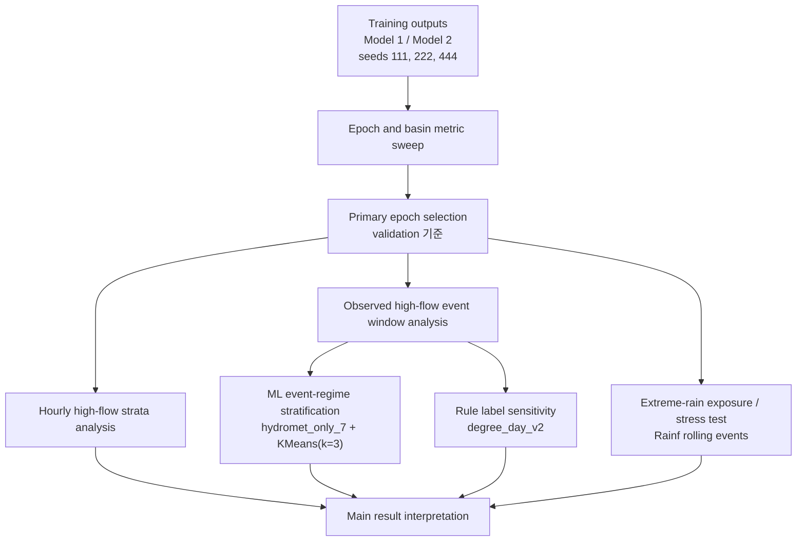

# CAMELSH Model 1/2 실험 분석 Methodology Plan

## 목적

이 문서는 `subset300` 기반 CAMELSH Model 1 / Model 2 비교 결과를 어떤 순서로 분석하고, 어떤 표현으로 논문에 반영할지 고정한다. 핵심 질문은 flood typology를 새로 만드는 것이 아니라, 같은 multi-basin LSTM backbone에서 deterministic output과 probabilistic quantile output이 extreme flood peak underestimation을 어떻게 다르게 만드는지 확인하는 것이다.

공식 비교는 `Model 1 deterministic LSTM`과 `Model 2 probabilistic quantile LSTM`이다. Model 2의 `q50`은 deterministic baseline과 비교되는 중앙 예측이고, `q90/q95/q99`는 calibrated full predictive interval이 아니라 upper-tail decision output으로 해석한다.

## 분석 흐름



분석은 네 층으로 나눈다. 첫째, basin-level metric sweep으로 epoch와 seed별 전체 성능을 확인한다. 둘째, hourly high-flow stratum에서 `q50/q90/q95/q99`가 underestimation을 얼마나 줄이는지 본다. 셋째, observed high-flow event candidate window를 기준으로 event-level error를 만들고, 이를 ML event-regime과 rule label로 나누어 해석한다. 넷째, streamflow Q99 event table에서 출발하지 않고 hourly `Rainf` rolling sum으로 극한호우 event를 직접 뽑아 train/validation exposure와 DRBC historical stress response를 별도로 점검한다.

## Results 비교 순서

논문 결과는 아래 순서로 정리한다. 자세한 metric 정의와 문헌 근거는 [`result_analysis_protocol.md`](result_analysis_protocol.md)의 `선행연구에서 가져온 평가 원칙`과 `이번 논문의 5개 비교축`을 따른다.

| 순서 | 결과 블록 | 핵심 질문 | 공식성 |
| ---: | --- | --- | --- |
| 1 | Primary 전체 성능 | validation으로 고른 primary checkpoint에서 `Model 2(q50)`가 전체 hydrograph 성능을 얼마나 유지하는가 | main |
| 2 | Primary extreme/high-flow 성능 | 같은 primary checkpoint에서 `q90/q95/q99`가 peak underestimation을 줄이는가 | main |
| 3 | Flood type / event-regime 분석 | upper-tail 이득이 `Recent rainfall`, `Antecedent / multi-day rain`, `Weak / low-signal hydromet regime` 사이에서 어떻게 다른가 | heterogeneity |
| 4 | Broad vs Natural 비교 | hydromodification risk가 적은 cleaner subset에서도 paired delta 방향이 유지되는가 | robustness |
| 5 | Primary vs All-validation-epoch sweep | 결론이 validation-best primary checkpoint 하나에만 의존하지 않는가 | sensitivity |

`Primary vs All`은 primary 선택을 test 결과로 다시 검증하거나 바꾸는 절차가 아니다. Primary epoch는 test를 보기 전에 validation median NSE로 잠그고, all-validation-epoch 결과는 같은 결론이 epoch grid 전반에서 얼마나 안정적인지 보는 diagnostic으로만 쓴다.

결과 해석의 층위는 `primary independent test`, `stratified event analysis`, `historical extreme-rain stress`로 분리한다. Primary independent test는 DRBC holdout `2014-2016` 결과이고 본문 headline에 둔다. Stratified event analysis는 같은 primary test 안에서 event-regime과 severity별 이질성을 보는 분석이다. Historical extreme-rain stress는 같은 DRBC basin을 쓰더라도 `1980-2024` 기간을 포함하므로 temporal independence claim 없이 robustness/stress 결과로만 보고한다.

## 공식 실행 순서

1. Epoch sweep은 아래 스크립트로 집계한다. 이 단계는 validation/test metric, FHV, Peak-MAPE, Peak-Timing을 basin 단위로 확인하는 역할이다.

```bash
uv run scripts/official/analyze_subset300_epoch_results.py
```

2. Hourly high-flow stratum 분석은 아래 스크립트로 수행한다. 이 단계는 basin top 1%, top 0.1%, observed peak hour에서 Model 1과 Model 2 quantile output을 비교한다.

```bash
uv run scripts/official/analyze_subset300_hydrograph_outputs.py
```

3. Event-regime model-error 분석은 아래 스크립트로 수행한다. 이 단계는 event window 안에서 observed peak, predictor peak, event RMSE, threshold exceedance recall을 계산한 뒤 ML event-regime을 주 stratification으로 사용한다.

```bash
uv run scripts/official/analyze_subset300_event_regime_errors.py
```

기본 출력 위치는 아래다.

```text
output/model_analysis/quantile_analysis/event_regime_analysis/
```

4. 극한호우 exposure와 historical stress test는 아래 순서로 수행한다. Catalog 단계는 train/validation에 ARI25/50/100급 rain forcing이 있었는지 답하고, inference/analyze 단계는 DRBC holdout basin의 historical extreme-rain response에서 기존 Model 1/2 checkpoint가 peak를 따라가는지 평가한다. 기본 실행은 validation 기준 primary checkpoint를 사용하고, 별도 sensitivity 실행에서는 validation checkpoint grid `005 / 010 / 015 / 020 / 025 / 030` 전체를 같은 epoch 번호의 Model 1/2 쌍으로 평가한다.

```bash
uv run scripts/official/build_subset300_extreme_rain_event_catalog.py
uv run scripts/official/infer_subset300_extreme_rain_windows.py --device cuda:0
uv run scripts/official/analyze_subset300_extreme_rain_stress_test.py
```

원격 A100 서버에서는 `tmux` 안에서 아래 wrapper를 실행한다. 이 wrapper는 catalog, inference, analysis 로그를 각각 `logs/extreme_rain_catalog.log`, `logs/extreme_rain_inference.log`, `logs/extreme_rain_analysis.log`에 남긴다.

```bash
DEVICE=cuda:0 bash scripts/official/run_subset300_extreme_rain_stress_test.sh
```

Primary checkpoint stress test의 기본 출력 위치는 아래다.

```text
output/model_analysis/extreme_rain/primary/
```

모든 validation checkpoint를 대상으로 한 sensitivity run은 catalog를 재사용하고 output root를 분리한다.

```bash
OUTPUT_ROOT=output/model_analysis/extreme_rain/all \
RUN_CATALOG=0 \
EPOCH_MODE=validation \
VALIDATION_EPOCHS="5 10 15 20 25 30" \
BLOCKS_CSV=output/model_analysis/extreme_rain/primary/exposure/inference_blocks.csv \
COHORT_CSV=output/model_analysis/extreme_rain/primary/exposure/drbc_historical_stress_cohort.csv \
DEVICE=cuda:0 \
bash scripts/official/run_subset300_extreme_rain_stress_test.sh
```

이 sensitivity 출력 위치는 아래다.

```text
output/model_analysis/extreme_rain/all/
```

## Event-Regime 분석 기준

본문의 주 stratification은 `hydromet_only_7 + KMeans(k=3)`로 만든 descriptor-based event regime이다. 사용하는 feature는 `recent_1d_ratio`, `recent_3d_ratio`, `antecedent_7d_ratio`, `antecedent_30d_ratio`, `snowmelt_ratio`, `snowmelt_fraction`, `event_mean_temp`로 고정한다.

Regime 이름은 세 가지로 둔다.

| Regime | 해석 |
| --- | --- |
| `Recent rainfall` | peak 직전 강수 signal이 강한 event regime |
| `Antecedent / multi-day rain` | 7일 또는 30일 antecedent rainfall signal이 상대적으로 큰 event regime |
| `Weak / low-signal hydromet regime` | 강수와 snowmelt proxy signal이 모두 약하거나 혼합된 event regime |

`Weak / low-signal hydromet regime`은 snow-dominant event가 아니다. 저위도 snow sanity check에서도 이 cluster에는 낮은 snow_fraction basin이 섞이므로, snowmelt mechanism으로 강하게 해석하지 않는다.

Rule-based `degree_day_v2` label은 본문 주 분석이 아니라 sensitivity와 QA로 사용한다. `snowmelt_or_rain_on_snow`는 SWE 관측 기반 확정 label이 아니라 temperature와 precipitation으로 만든 degree-day proxy class다. 논문에서는 `snowmelt/rain-on-snow proxy class`라고 표현한다.

## Event-Level 지표

새 event-regime 분석 스크립트는 각 event window에 대해 아래 지표를 만든다.

| 지표 | 의미 |
| --- | --- |
| `obs_peak_rel_error_pct` | observed peak hour에서 prediction이 관측 peak를 얼마나 과소/과대추정했는지 |
| `obs_peak_under_deficit_pct` | observed peak hour에서 과소추정 부족분만 본 상대 deficit |
| `window_peak_rel_error_pct` | event window 안 predictor 최대값과 observed peak의 상대 차이 |
| `abs_peak_timing_error_hours` | predictor peak time과 observed peak time의 절대 시간 차 |
| `event_rmse` | event window 전체 RMSE |
| `threshold_exceedance_recall` | observed threshold-exceedance hour 중 predictor도 threshold를 넘긴 비율 |
| `top_flow_hit_rate` | observed high-flow hour에서 predictor가 해당 시점 관측값 이상이었던 비율 |

주 비교는 Model 1 대비 Model 2 `q50`과 upper quantile의 paired delta다. `q50`이 나빠져도 `q95/q99`가 under-deficit과 threshold recall을 개선할 수 있으므로, 중앙 예측과 upper-tail output을 구분해서 해석한다.

## 현재 산출물 해석 기준

현재 event-regime 분석은 DRBC test basin 38개, observed high-flow event candidate 570개, paired seed `111 / 222 / 444`를 사용한다. 모든 seed에서 같은 event set을 사용하므로 paired comparison이 가능하다.

이 570개 event는 모두 `Q99` observed high-flow candidate지만, return-period proxy 기준으로는 대부분이 `high_flow_below_2yr_proxy`다. 따라서 event-regime 결과를 “공식 flood inventory에 대한 결과”나 “재현기간이 큰 flood event 전체에 대한 결과”로 쓰면 안 된다. `flood_relevance_tier_predictor_aggregate.csv`와 `ml_event_regime_by_flood_tier_predictor_aggregate.csv`는 이 민감도를 확인하기 위한 보조 산출물이다.

핵심 해석은 다음과 같이 둔다.

첫째, `q50`은 대부분의 regime에서 Model 1보다 observed peak underestimation을 줄이지 못한다. 따라서 “probabilistic head가 median prediction을 개선했다”고 쓰지 않는다.

둘째, `q90/q95/q99`는 대체로 Model 1 대비 observed-peak under-deficit을 줄이고 threshold exceedance recall을 높인다. 특히 `q95/q99`에서 이 효과가 더 뚜렷하다. 다만 raw `event_rmse`는 basin 규모와 event magnitude의 영향을 받으므로 regime 간 성능 비교에는 normalized RMSE 또는 paired delta를 우선 사용한다. `q99`는 일부 regime에서 normalized event RMSE를 악화시킬 수 있으므로, “정확한 peak magnitude prediction”이 아니라 “upper-tail underestimation mitigation”으로 표현한다.

셋째, rule label sensitivity에서도 큰 방향은 비슷하지만, rule label은 causal flood mechanism 확정이 아니다. ML event-regime 결과와 rule sensitivity 결과가 다른 경우에는 ML 결과를 descriptor-space grouping 결과로만 해석하고, 물리적 원인 claim은 피한다.

## Extreme-Rain Exposure / Stress Test 기준

이 보조 분석은 두 질문을 분리한다. 첫째, subset300의 train/validation split에 극한호우 forcing이 있었는지 확인해 모델이 그런 입력 분포를 배울 기회가 있었는지 본다. 둘째, DRBC holdout basin의 historical extreme-rain event 중 실제 streamflow response가 있는 event에서 기존 Model 1/2 checkpoint가 peak magnitude와 timing을 얼마나 따라가는지 본다.

Rain-event catalog는 `event_response_table.csv`가 아니라 hourly `.nc`의 `Rainf` rolling sum에서 직접 만든다. Duration은 `1h / 6h / 24h / 72h`, threshold는 CAMELSH annual-maxima proxy인 `prec_ari25/50/100_{duration}h`로 고정한다. Active rain hour 사이 gap이 `72h` 이하면 같은 storm으로 병합하고, response window는 `[rain_start - 24h, rain_end + 168h]`, inference block은 LSTM warmup을 위해 `[rain_start - 21d, rain_end + 8d]`로 둔다.

Split은 네 개로 고정한다. `train`은 subset300 train basin `269개`와 `2000-2010`, `validation`은 `31개`와 `2011-2013`, `official_test`는 DRBC `38개`와 `2014-2016`, `drbc_historical_stress`는 같은 DRBC `38개`와 `1980-2024`다. Primary rain cohort는 `max_prec_ari100_ratio >= 1.0`이고, sensitivity는 `ARI50`, `ARI25`, 그리고 `0.8 <= ARI100 ratio < 1.0` near miss로 둔다.

Quality gate는 event-level로 기록한다. Detection period의 `Rainf` finite coverage가 `95%` 미만이면 rain-event detection에서 제외하고, response window의 `Streamflow` finite coverage가 `90%` 미만이면 response metric에서 제외한다. 제외된 basin/event는 `coverage_failure_report.csv`와 event catalog의 `skipped_reason`에 남긴다.

Response class는 `flood_response_ge25`, `flood_response_ge2_to_lt25`, `high_flow_non_flood_q99_only`, `low_response_below_q99`로 둔다. 앞의 두 class는 positive-response stress test이고, 뒤의 두 class는 false-positive negative control이다. 극한호우였지만 observed streamflow가 flood-like response를 보이지 않은 event는 모델 실패가 아니라 negative control로 해석한다.

Inference는 재학습 없이 paired seed `111 / 222 / 444`의 checkpoint를 사용한다. Primary epoch mapping은 `Model 1 seed111 epoch25 / seed222 epoch10 / seed444 epoch15`, `Model 2 seed111 epoch5 / seed222 epoch10 / seed444 epoch10`으로 고정하고, 본문 기준 결과는 이 primary mapping을 우선 읽는다. 별도 sensitivity run은 validation이 저장된 epoch `005 / 010 / 015 / 020 / 025 / 030` 전체를 `Model 1 epoch N`과 `Model 2 epoch N`의 same-epoch pair로 돌린다. 이 결과는 checkpoint 선택을 다시 하기 위한 것이 아니라, extreme-rain stress conclusion이 primary checkpoint 하나에만 의존하는지 확인하는 diagnostic이다. Model 1은 deterministic prediction, Model 2는 `q50/q90/q95/q99`를 산출하며, positive-response group은 peak tracking과 under-deficit을, negative-control group은 upper quantile이 불필요하게 flood threshold를 넘는지 본다.

`infer_subset300_extreme_rain_windows.py`는 `--epoch-mode primary`와 `--epoch-mode validation`을 지원한다. `analyze_subset300_extreme_rain_stress_test.py`는 `inference_manifest.csv`를 읽어 seed/epoch pair별 required-series를 모두 집계하고, epoch 축이 있는 `paired_delta_epoch_aggregate.csv`를 추가로 만든다. Aggregate를 읽을 때는 primary 결과와 all-validation-epoch 결과를 섞지 않고 output root로 구분한다.

이 분석은 primary `2014-2016` DRBC test를 대체하지 않는다. DRBC basin이 train에 없으므로 basin-holdout 조건은 유지되지만, historical stress period에는 train/validation 연도와 겹치는 event가 포함될 수 있으므로 temporal independence claim은 하지 않는다.

## 보고 규칙

본문 표는 `ml_event_regime_predictor_aggregate.csv`와 `paired_delta_aggregate.csv`의 ML event-regime 부분을 우선 사용한다. Supplementary에는 `rule_label_predictor_aggregate.csv`와 rule-label paired delta를 둔다.

표현은 아래처럼 제한한다.

| 피할 표현 | 사용할 표현 |
| --- | --- |
| flood type을 확정 분류했다 | observed high-flow event를 descriptor-based regime으로 나누었다 |
| ML cluster가 causal mechanism이다 | ML cluster는 hydrometeorological descriptor-space event regime이다 |
| snowmelt flood를 확인했다 | snowmelt/rain-on-snow proxy class를 sensitivity로 확인했다 |
| q99가 calibrated 99% interval이다 | q99는 upper-tail decision output이다 |

## Acceptance Checks

최종 결과를 쓰기 전에 아래를 확인한다.

- paired seed `111 / 222 / 444`만 사용했는지 확인한다.
- primary epoch가 validation 기준 선택인지 확인하고, test 결과로 epoch를 고른 것처럼 쓰지 않는다.
- 극한호우 stress test의 all-validation-epoch 결과는 checkpoint sensitivity로만 해석하고, primary epoch를 test/stress 결과로 재선택하지 않는다.
- Model 2 probabilistic 평가는 quantile별 `AQS/pinball loss`, one-sided coverage, calibration error, upper-tail spread를 구분해서 보고, lower quantile 없이 `interval score`나 central PI width를 공식 지표로 쓰지 않는다.
- event table을 official flood inventory가 아니라 observed high-flow event candidate table로 표현한다.
- `analysis_summary.json`에서는 unique event count와 seed-replicated row count를 구분해 읽는다.
- ML event-regime cluster count가 지나치게 불균형하지 않은지 확인한다.
- flood relevance tier sensitivity를 확인하고, 대부분의 event가 `high_flow_below_2yr_proxy`라는 점을 본문 해석에 반영한다.
- `Weak / low-signal hydromet regime`의 snow_fraction과 snowmelt_fraction sanity check를 확인한다.
- `degree_day_v2` rule label 결과를 sensitivity로 함께 보고, 결론이 classification choice 하나에만 의존하지 않는지 확인한다.
