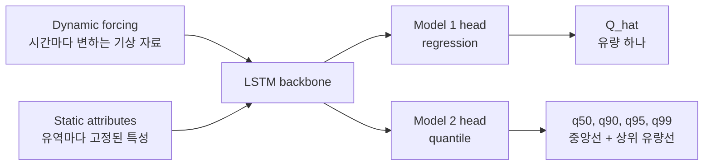

# 02. 모델 구조

현재 논문의 공식 비교는 Model 1과 Model 2만 다룬다. 두 모델은 입력 자료와 LSTM backbone은 같고, 마지막 출력층인 head만 다르다. 이렇게 해야 성능 차이가 모델 전체를 바꾼 효과인지, 아니면 출력 방식만 바꾼 효과인지 구분할 수 있다.



## 공통 부분: LSTM backbone

LSTM은 시간 순서가 있는 자료를 읽는 neural network다. 이 연구에서는 최근 336시간, 즉 약 14일 동안의 기상 조건과 유역 정보를 보고 마지막 24시간의 하천 유량을 맞히도록 학습한다.

여기서 LSTM backbone은 입력 자료를 읽고 내부 상태를 만든다. 쉽게 말하면 "최근 비가 얼마나 왔는지, 기온은 어땠는지, 이 유역은 물이 빨리 모이는 곳인지" 같은 정보를 한데 모아 다음 출력층이 쓸 수 있는 형태로 바꾸는 부분이다.

## Model 1: deterministic LSTM

Model 1은 가장 기본적인 기준 모델이다. 매 시점마다 유량 하나를 예측한다.

```text
inputs -> LSTM -> regression head -> Q_hat
```

`Q_hat`은 모델이 생각하는 그 시점의 대표 유량이다. 이 방식은 구조가 단순하고 기존 성능 지표와 바로 비교하기 쉽다. 하지만 큰 홍수처럼 드문 값을 예측할 때는 안전하게 평균 쪽으로 끌리는 경향이 생길 수 있다.

## Model 2: probabilistic quantile LSTM

Model 2는 LSTM backbone은 그대로 두고, 출력층만 바꾼다.

```text
inputs -> LSTM -> quantile head -> q50, q90, q95, q99
```

`q50`은 중앙선에 가깝다. 기존 모델의 대표 예측값처럼 읽을 수 있다. `q90`, `q95`, `q99`는 점점 더 높은 쪽의 유량 가능성을 나타낸다. 이 값들은 "99년 빈도 홍수" 같은 재현기간이 아니라, 해당 시간과 조건에서 모델이 예상하는 상위 quantile이다.

이 구조의 장점은 큰 홍수 첨두를 하나의 평균 예측값으로만 처리하지 않는다는 점이다. 모델은 중심선뿐 아니라 "실제 유량이 더 높을 수도 있는 범위"를 함께 배운다.

## 왜 q50, q90, q95, q99를 쓰는가

이 연구의 관심은 아래쪽 오차보다 큰 유량 쪽의 오차다. 그래서 lower quantile인 `q10`, `q05`보다 upper quantile인 `q90`, `q95`, `q99`가 중요하다.

`q50`은 Model 1과 직접 비교할 대표 중앙선이고, `q90`, `q95`, `q99`는 홍수 첨두를 충분히 감싸는지 확인하기 위한 상위선이다. 특히 `q95`와 `q99`가 실제 첨두를 잘 덮는다면, Model 2가 홍수 쪽 위험을 더 잘 표현한다고 볼 수 있다.

## quantile crossing을 막는 이유

quantile model에서는 `q95`가 `q90`보다 낮게 나오는 일이 생기면 안 된다. 상위 95% 선이 상위 90% 선보다 낮다면 의미가 뒤집히기 때문이다. 이런 문제를 quantile crossing이라고 한다.

현재 구현은 상위 quantile을 차례로 더하는 방식으로 이 문제를 막는다. 먼저 `q50`을 만들고, 그 위에 양수 값을 더해 `q90`, 다시 양수 값을 더해 `q95`, 다시 더해 `q99`를 만든다. 그래서 구조적으로 `q50 <= q90 <= q95 <= q99`가 유지된다.

## loss의 차이

Model 1은 기본적으로 NSE loss를 사용한다. 수문 자료에서는 유역마다 유량 크기가 크게 다르기 때문에, 단순 MSE보다 NSE 계열 기준이 더 자연스럽다.

Model 2는 pinball loss를 사용한다. pinball loss는 quantile을 학습할 때 쓰는 손실이다. 예를 들어 `q95`는 실제값의 약 95%가 그 아래에 오도록 배워야 하므로, 실제 큰 값이 `q95`보다 위에 있는데 모델이 낮게 잡으면 더 강하게 벌을 준다.

## 현재 논문에서 다루지 않는 모델

physics-guided hybrid는 현재 논문의 공식 비교 대상이 아니다. 이 아이디어는 물의 저장, 흐름, 이동 같은 물리 과정을 모델 구조 안에 더 직접적으로 넣으려는 후속 확장이다.

현재 논문에서는 먼저 Model 1과 Model 2를 비교한다. 그래야 "출력 방식만 바꿔도 홍수 첨두 과소추정이 줄어드는가"라는 질문에 집중할 수 있다.
