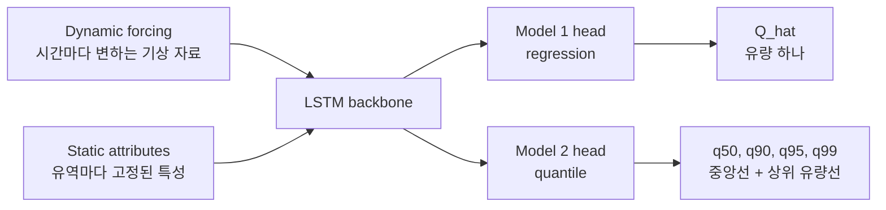
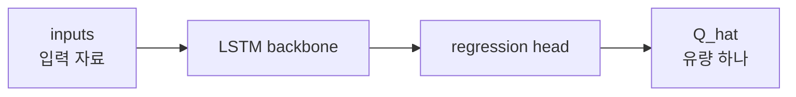
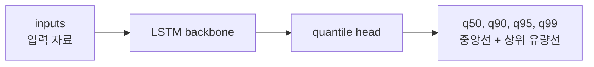

# 02. 모델 구조

현재 논문의 공식 비교는 Model 1과 Model 2만 다룬다. 두 모델은 입력 자료와 LSTM backbone은 같고, 마지막 출력층인 head만 다르다. 이렇게 해야 성능 차이가 모델 전체를 바꾼 효과인지, 출력 방식만 바꾼 효과인지 구분할 수 있다.


```mermaid
flowchart LR
    A["Dynamic forcing<br/>시간마다 변하는 기상 자료"] --> C["LSTM backbone"]
    B["Static attributes<br/>유역마다 고정된 특성"] --> C
    C --> D["Model 1 head<br/>regression"]
    C --> E["Model 2 head<br/>quantile"]
    D --> F["Q_hat<br/>유량 하나"]
    E --> G["q50, q90, q95, q99<br/>중앙선 + 상위 유량선"]
```

## 공통 LSTM backbone

LSTM은 시간 순서가 있는 자료를 읽는 neural network다. 이 연구에서는 최근 336시간, 즉 약 14일간의 기상 조건과 유역 정보를 보고 마지막 24시간의 하천 유량을 맞히도록 학습한다.

여기서 LSTM backbone은 입력 자료를 읽어 내부 상태를 만든다. 곧 "최근 강수량, 기온, 이 유역의 물 집중 속도" 같은 정보를 한데 모아 다음 출력층이 쓸 수 있는 형태로 바꾸는 부분이다.

이 구조는 글로만 정해 둔 것이 아니라 모델 설정 파일에 그대로 적혀 있다. 입력으로 보는 과거 길이와 한 번에 예측하는 미래 길이는 Model 2 설정 파일[^cfg-m2]에서 정하는데, 과거 길이(설정 항목 `seq_length`)가 336시간, 미래 길이(설정 항목 `predict_last_n`)가 24시간이다. LSTM이 내부에 들고 있는 기억의 크기(설정 항목 `hidden_size`)는 128로 두고, 사용하는 LSTM 종류(설정 항목 `model`)는 GPU에 최적화된 `cudalstm`이다. Model 1과 Model 2는 이 backbone 설정을 똑같이 쓰고, 뒤에서 설명할 출력층(설정 항목 `head`)만 다르게 둔다.

## Model 1: deterministic LSTM

Model 1은 가장 기본적인 기준 모델이다. 매 시점마다 유량 하나를 예측한다.


```mermaid
flowchart LR
    A["inputs<br/>입력 자료"] --> B["LSTM backbone"]
    B --> C["regression head"]
    C --> D["Q_hat<br/>유량 하나"]
```

출력은 그 시점의 대표 유량 한 값(변수명 `y_hat`)이다. 이 방식은 구조가 단순하고 기존 성능 지표와 바로 비교하기 쉽다. 다만 큰 홍수처럼 드문 값을 예측할 때는 안전하게 평균 쪽으로 끌리는 경향이 생길 수 있다.

Model 1이 이 단순한 출력을 쓰도록 만드는 설정은 Model 1 설정 파일[^cfg-m1]에 있다. 출력층(설정 항목 `head`)을 일반 회귀 방식인 `regression`으로, 학습 기준(설정 항목 `loss`)을 `nse`로 둔다.

## Model 2: probabilistic quantile LSTM

Model 2는 LSTM backbone은 그대로 두고, 출력층만 바꾼다.


```mermaid
flowchart LR
    A["inputs<br/>입력 자료"] --> B["LSTM backbone"]
    B --> C["quantile head"]
    C --> D["q50, q90, q95, q99<br/>중앙선 + 상위 유량선"]
```

`q50`은 중앙선에 가까워 기존 모델의 대표 예측값처럼 읽을 수 있다. `q90`, `q95`, `q99`는 점점 더 높은 쪽의 유량 가능성을 나타낸다. 이 값들은 "99년 빈도 홍수" 같은 재현기간이 아니라, 해당 시간과 조건에서 모델이 예상하는 상위 quantile이다.

이 구조의 장점은 큰 홍수 첨두를 하나의 평균 예측값으로만 처리하지 않는다는 점이다. 모델은 중심선뿐 아니라 "실제 유량이 더 높을 수도 있는 범위"를 함께 배운다.

## 상위 quantile 선택

이 연구의 관심은 아래쪽 오차보다 큰 유량 쪽 오차다. 그래서 lower quantile인 `q10`, `q05`보다 upper quantile인 `q90`, `q95`, `q99`가 중요하다.

`q50`은 Model 1과 직접 비교할 대표 중앙선, `q90`, `q95`, `q99`는 홍수 첨두를 충분히 감싸는지 확인할 상위선이다. 특히 `q95`와 `q99`가 실제 첨두를 잘 덮는다면, Model 2가 홍수 쪽 위험을 더 잘 표현한다고 볼 수 있다.

## quantile crossing 방지 방법

quantile model에서는 `q95`가 `q90`보다 낮게 나오면 안 된다. 상위 95% 선이 상위 90% 선보다 낮으면 의미가 뒤집히기 때문이다. 이런 문제를 quantile crossing이라고 한다.

이 단조 순서는 글로 적은 약속이 아니라 출력층 코드에 직접 구현돼 있다. 먼저 중앙선을 기준값으로 두고, 그 위에 `softplus`를 거친 증분을 누적합으로 더한다. `softplus`는 어떤 입력이든 0보다 큰 값으로 바꾸므로 더해지는 양이 음수가 될 수 없고, 따라서 위로 갈수록 값이 작아지는 일이 구조적으로 불가능하다. 결과적으로 `q50 ≤ q90 ≤ q95 ≤ q99` 순서가 항상 지켜진다.

```python
# vendor/neuralhydrology/neuralhydrology/modelzoo/head.py: Quantile.forward
base = raw[..., :1]
if self._n_quantiles > 1:
    positive_increments = self._softplus(raw[..., 1:])
    quantiles = torch.cat([base, base + torch.cumsum(positive_increments, dim=-1)], dim=-1)
```

어떤 quantile을 낼지와 학습 방식은 Model 2 설정 파일[^cfg-m2]에서 정한다. 출력층(`head`)을 `quantile`로, 학습 기준(`loss`)을 `pinball`로 두고, 내보낼 quantile 목록(`quantiles`)에 0.5, 0.9, 0.95, 0.99를 적어 둔다.

## loss 비교

손실(loss)이란 모델이 "얼마나 틀렸는지"를 점수로 매겨, 그 점수가 작아지는 방향으로 모델을 고쳐 나가게 하는 기준이다. 두 모델은 이 기준이 다르다.

Model 1은 NSE loss를 사용한다. 제곱오차를 유역별 관측 표준편차로 나눠 정규화한 형태로, 유역마다 유량 크기가 크게 다른 수문 자료에서 큰 유역이 손실을 독점하지 않게 한다. 설정 항목은 `loss: nse`다.

$$
L_{\mathrm{NSE}} = \frac{1}{T}\sum_{t=1}^{T} \frac{\big(Q_{\text{sim},t}-Q_{\text{obs},t}\big)^2}{\big(\sigma_{\text{basin}}+\varepsilon\big)^2}
$$

여기서 $\sigma_{\text{basin}}$은 해당 유역 관측 유량의 표준편차, $\varepsilon$은 수치 안정용 작은 상수다.

Model 2는 pinball loss를 사용한다. 분위 $\tau$의 비대칭 손실로, 실제 큰 값이 예측선 위에 있는데 낮게 잡으면 $\tau$에 비례해 더 강하게 벌을 준다. 그래서 `q95`처럼 높은 분위는 과소추정을 더 무겁게 다룬다. 설정 항목은 `loss: pinball`이고, 각 분위 가중치 $w_{\tau}$를 모두 1.0으로 둔다. 04 문서와 같은 정의다.

$$
L_{\tau}\big(Q_{\text{obs},t},\,Q_{\text{sim},\tau,t}\big) = \max\!\Big(\tau\,(Q_{\text{obs},t}-Q_{\text{sim},\tau,t}),\ (\tau-1)\,(Q_{\text{obs},t}-Q_{\text{sim},\tau,t})\Big)
$$

$$
L_{\mathrm{pinball}} = \frac{1}{T}\sum_{t=1}^{T}\sum_{\tau \in \mathcal{Q}} w_{\tau}\,L_{\tau}\big(Q_{\text{obs},t},\,Q_{\text{sim},\tau,t}\big)
$$

[^cfg-m1]: `configs/camelsh_hourly_model1_drbc_holdout_broad.yml`
[^cfg-m2]: `configs/camelsh_hourly_model2_drbc_holdout_broad.yml`
