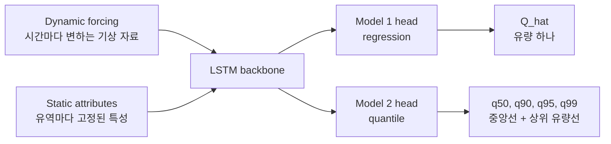

# 02. 모델 구조

현재 논문의 공식 비교는 Model 1과 Model 2만 다룬다. 두 모델은 입력 자료와 LSTM backbone은 같고, 마지막 출력층인 head만 다르다. 이렇게 해야 성능 차이가 모델 전체를 바꾼 효과인지, 아니면 출력 방식만 바꾼 효과인지 구분할 수 있다.


```mermaid
flowchart LR
    A["Dynamic forcing<br/>시간마다 변하는 기상 자료"] --> C["LSTM backbone"]
    B["Static attributes<br/>유역마다 고정된 특성"] --> C
    C --> D["Model 1 head<br/>regression"]
    C --> E["Model 2 head<br/>quantile"]
    D --> F["Q_hat<br/>유량 하나"]
    E --> G["q50, q90, q95, q99<br/>중앙선 + 상위 유량선"]
```

## 공통 부분: LSTM backbone

LSTM은 시간 순서가 있는 자료를 읽는 neural network다. 이 연구에서는 최근 336시간, 즉 약 14일 동안의 기상 조건과 유역 정보를 보고 마지막 24시간의 하천 유량을 맞히도록 학습한다.

여기서 LSTM backbone은 입력 자료를 읽고 내부 상태를 만든다. 쉽게 말하면 "최근 비가 얼마나 왔는지, 기온은 어땠는지, 이 유역은 물이 빨리 모이는 곳인지" 같은 정보를 한데 모아 다음 출력층이 쓸 수 있는 형태로 바꾸는 부분이다.

이 구조는 글로만 정해 둔 것이 아니라 모델 설정 파일에 그대로 적혀 있다. 입력으로 보는 과거 길이와 한 번에 예측하는 미래 길이는 설정 파일 `configs/camelsh_hourly_model2_drbc_holdout_broad.yml`에서 정하는데, 과거를 보는 길이(설정 항목 `seq_length`)가 336시간, 한 번에 예측하는 미래 길이(설정 항목 `predict_last_n`)가 24시간이다. LSTM이 내부에 들고 있는 기억의 크기(설정 항목 `hidden_size`)는 128로 두고, 사용하는 LSTM 종류(설정 항목 `model`)는 GPU에 최적화된 `cudalstm`이다. Model 1과 Model 2는 이 backbone 설정을 똑같이 쓰고, 뒤에서 설명할 출력층(설정 항목 `head`)만 다르게 둔다.

## Model 1: deterministic LSTM

Model 1은 가장 기본적인 기준 모델이다. 매 시점마다 유량 하나를 예측한다.

```text
inputs -> LSTM -> regression head -> Q_hat
```

출력은 그 시점의 대표 유량 한 값(변수명 `y_hat`)이다. 이 방식은 구조가 단순하고 기존 성능 지표와 바로 비교하기 쉽다. 하지만 큰 홍수처럼 드문 값을 예측할 때는 안전하게 평균 쪽으로 끌리는 경향이 생길 수 있다.

Model 1이 이 단순한 출력을 쓰도록 만드는 설정은 설정 파일 `configs/camelsh_hourly_model1_drbc_holdout_broad.yml`에 있다. 출력층(설정 항목 `head`)을 일반 회귀 방식인 `regression`으로 두고, 학습 기준(설정 항목 `loss`)을 `nse`로 둔다.

## Model 2: probabilistic quantile LSTM

Model 2는 LSTM backbone은 그대로 두고, 출력층만 바꾼다.

```text
inputs -> LSTM -> quantile head -> q50, q90, q95, q99
```

`q50`은 중앙선에 가깝다. 기존 모델의 대표 예측값처럼 읽을 수 있다. `q90`, `q95`, `q99`는 점점 더 높은 쪽의 유량 가능성을 나타낸다. 이 값들은 "99년 빈도 홍수" 같은 재현기간이 아니라, 해당 시간과 조건에서 모델이 예상하는 상위 quantile이다.

이 구조의 장점은 큰 홍수 첨두를 하나의 평균 예측값으로만 처리하지 않는다는 점이다. 모델은 중심선뿐 아니라 "실제 유량이 더 높을 수도 있는 범위"를 함께 배운다.

## 왜 q50, q90, q95, q99를 쓰는가

이 연구의 관심은 아래쪽 오차보다 큰 유량 쪽의 오차다. 그래서 lower quantile인 `q10`, `q05`보다 upper quantile인 `q90`, `q95`, `q99`가 중요하다.

`q50`은 Model 1과 직접 비교할 대표 중앙선이고, `q90`, `q95`, `q99`는 홍수 첨두를 충분히 감싸는지 확인하기 위한 상위선이다. 특히 `q95`와 `q99`가 실제 첨두를 잘 덮는다면, Model 2가 홍수 쪽 위험을 더 잘 표현한다고 볼 수 있다.

## quantile crossing을 막는 이유

quantile model에서는 `q95`가 `q90`보다 낮게 나오는 일이 생기면 안 된다. 상위 95% 선이 상위 90% 선보다 낮다면 의미가 뒤집히기 때문이다. 이런 문제를 quantile crossing이라고 한다.

이 단조 순서는 글로 적은 약속이 아니라 출력층 코드에 직접 구현돼 있다. 해당 출력층은 이 프로젝트가 가져다 쓰는 NeuralHydrology 코드 안 `vendor/neuralhydrology/neuralhydrology/modelzoo/head.py`에 "Monotonic quantile head"(단조 quantile 출력층)라는 이름으로 들어 있다. 동작은 이렇다. 먼저 중앙선 `q50`을 만들고(변수명 `base`), 그 위에 `softplus`라는 함수를 거친 증분들을 누적해서 더한다(구현식 `base + cumsum(softplus(increments))`). `softplus`는 어떤 입력이든 0보다 큰 값으로 바꿔 주는 함수라, 위로 더해지는 양이 음수가 될 수 없다. 그래서 위로 갈수록 값이 작아지는 일이 구조적으로 불가능하고, `q50 ≤ q90 ≤ q95 ≤ q99` 순서가 항상 지켜진다.

어떤 quantile들을 낼지, 그리고 그것을 어떻게 학습할지는 설정 파일 `configs/camelsh_hourly_model2_drbc_holdout_broad.yml`에서 정한다. 출력층(설정 항목 `head`)을 `quantile`로, 학습 기준(설정 항목 `loss`)을 `pinball`로 두고, 실제로 내보낼 quantile 목록(설정 항목 `quantiles`)에 0.5, 0.9, 0.95, 0.99를 적어 둔다.

## loss의 차이

학습 기준(loss)이란 모델이 "얼마나 틀렸는지"를 점수로 매겨, 그 점수가 작아지는 방향으로 모델을 고쳐 나가게 하는 기준이다. 두 모델은 이 기준이 다르다.

Model 1은 NSE loss를 쓴다. 수문 자료에서는 유역마다 유량 크기가 크게 다르기 때문에, 단순 제곱오차보다 NSE 계열 기준이 더 자연스럽다. 설정으로는 앞서 본 `configs/camelsh_hourly_model1_drbc_holdout_broad.yml`의 `loss: nse`이고, 실제 계산은 `vendor/neuralhydrology/neuralhydrology/training/loss.py`의 `MaskedNSELoss`가 맡는다.

Model 2는 pinball loss를 쓴다. pinball loss는 quantile을 학습할 때 쓰는 손실로, 예를 들어 `q95`는 실제값의 약 95%가 그 아래에 오도록 배워야 하므로, 실제 큰 값이 `q95`보다 위에 있는데 모델이 낮게 잡으면 더 강하게 벌을 준다. 설정으로는 `configs/camelsh_hourly_model2_drbc_holdout_broad.yml`의 `loss: pinball`이고, 각 quantile에 똑같은 중요도를 주도록 가중치(설정 항목 `quantile_loss_weights`)를 모두 1.0으로 둔다. 실제 계산은 같은 `loss.py`의 `MaskedQuantileLoss`(주석에 "Weighted pinball loss for quantile regression"으로 적혀 있다)가 맡는다.

## 현재 논문에서 다루지 않는 모델

physics-guided hybrid는 현재 논문의 공식 비교 대상이 아니다. 이 아이디어는 물의 저장, 흐름, 이동 같은 물리 과정을 모델 구조 안에 더 직접적으로 넣으려는 후속 확장이다.

현재 논문에서는 먼저 Model 1과 Model 2를 비교한다. 그래야 "출력 방식만 바꿔도 홍수 첨두 과소추정이 줄어드는가"라는 질문에 집중할 수 있다.
