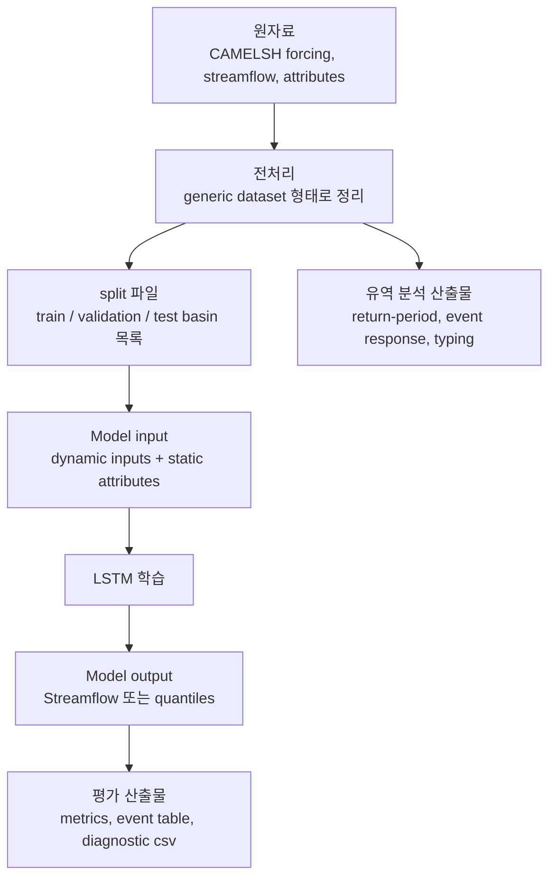

# 03. 데이터 입출력 방식

이 연구의 기본 자료는 CAMELSH hourly dataset이다. hourly라는 말은 시간 간격이 1시간이라는 뜻이다. 모델은 시간마다 변하는 기상 자료와 유역마다 거의 고정된 지형·토양·토지피복 정보를 함께 받아서, 시간별 하천 유량을 예측한다.

## 입력 1: dynamic forcing

Dynamic forcing은 시간마다 바뀌는 외부 조건이다. 이 연구에서는 주로 기상 자료가 여기에 해당한다.

현재 config에서 쓰는 주요 dynamic input은 `Rainf`, `Tair`, `PotEvap`, `SWdown`, `Qair`, `PSurf`, `Wind_E`, `Wind_N`, `LWdown`, `CAPE`, `CRainf_frac`다. 기존 연구 설계 문서에서는 이를 더 일반적인 이름으로 `prcp`, `tmax`, `tmin`, `srad`, `vp`, `PET`처럼 설명하기도 한다.

가장 직관적인 변수는 강수, 기온, 증발산 관련 변수다. 홍수는 결국 물 공급과 유역 반응이 함께 만든 결과이므로, 모델은 최근 며칠 동안 비가 얼마나 왔고 기상 조건이 어땠는지를 봐야 한다.

## 입력 2: static attributes

Static attributes는 시간마다 바뀌지 않거나, 적어도 모델 학습 기간 안에서는 고정된 유역 특성이다. 예를 들어 유역 면적, 평균 경사, 산림 비율, 토양 깊이, 투수성, snow fraction, baseflow index가 있다.

이 값들은 "같은 비가 와도 왜 어떤 유역은 빠르게 불어나고 어떤 유역은 천천히 반응하는가"를 설명한다. 예를 들어 경사가 크고 하천망이 촘촘한 유역은 물이 빨리 모일 수 있고, 토양 저장 능력이 큰 유역은 첨두가 완충될 수 있다.

## 출력: Streamflow

모델이 맞히려는 target은 `Streamflow`다. 하천의 시간별 유량을 뜻한다. 물리적으로 유량은 음수가 될 수 없으므로, 현재 설정에서는 target을 0 아래로 내려가지 않게 처리한다.

Model 1은 매 시간 하나의 `Streamflow` 예측값을 낸다. Model 2는 같은 시간에 대해 `q50`, `q90`, `q95`, `q99`를 낸다. Model 2의 `q50`은 Model 1의 단일 예측값과 비교할 대표 중앙선으로 사용한다.

## 시간 구간

현재 기준 시간 분할은 다음과 같다.

| 구간 | 기간 | 역할 |
| --- | --- | --- |
| train | 2000-01-01 ~ 2010-12-31 | 모델이 학습하는 기간 |
| validation | 2011-01-01 ~ 2013-12-31 | epoch 선택과 중간 점검에 쓰는 기간 |
| test | 2014-01-01 ~ 2016-12-31 | 최종 성능을 보고하는 기간 |

이 기간은 가장 오래된 자료를 모두 쓰기 위해 정한 것이 아니라, 많은 basin이 공통으로 비교 가능한 현대 구간을 확보하기 위해 정한 것이다.

## 유역 split

이 연구에서는 train, validation, test를 단순히 시간으로만 나누지 않는다. 유역 자체도 나누어 생각한다.

학습은 DRBC 밖의 non-DRBC basin에서 한다. DRBC 내부 basin은 holdout test region으로 둔다. 현재 compute 제약을 반영한 main comparison에서는 `configs/pilot/basin_splits/scaling_300/`의 basin file을 사용한다. 직접 실행 split은 train 269개, validation 31개, test 38개 구조다.

여기서 test 38개는 DRBC quality-pass basin이다. 즉 모델은 DRBC를 학습 중에 보지 않고, 최종적으로 DRBC에서 얼마나 잘 일반화되는지 평가받는다.

## prepared dataset의 형태

모델이 바로 읽을 수 있도록 전처리된 자료는 `data/CAMELSH_generic/drbc_holdout_broad/` 아래에 놓인다. 이 안에는 시간별 자료, static attributes, split 파일, manifest가 들어간다.

실험 결과는 `runs/` 아래에 저장된다. 보통 확인해야 하는 파일은 `config.yml`, `output.log`, validation metric, test metric, 그리고 예측 결과 파일이다.

## 결측이 있으면 어떻게 쓰는가

시계열 자료에는 가끔 값이 비어 있다. 이 연구에서 가장 자주 문제가 되는 것은 target인 `Streamflow` 결측이다. 강수나 기온 같은 dynamic forcing이 비어 있으면 모델이 그 시간의 입력을 제대로 읽을 수 없고, 관측 유량인 `Streamflow`가 비어 있으면 정답을 모르는 시간이 된다.

현재 subset300 실험에서 확인한 결과, 모델 입력으로 쓰는 dynamic forcing 11개와 static attributes에는 train/validation/test 구간 안에서 결측이 없었다. 따라서 이번 실험에서 실제로 문제가 되는 결측은 거의 `Streamflow` 쪽이다.

학습할 때는 모델이 최근 `336시간`을 입력으로 보고 마지막 `24시간`의 유량을 맞히도록 sample을 만든다. 이 336시간 입력 안에 dynamic forcing 결측이 하나라도 있으면 그 sample은 학습에 쓰지 않는다. 반대로 `Streamflow`는 24시간 정답 구간이 전부 비어 있으면 sample을 버리지만, 일부 시간만 비어 있으면 나머지 유효한 시간만 loss 계산에 쓴다.

validation과 test에서도 `Streamflow`가 비어 있는 시간은 metric 계산에서 빠진다. 그래서 test 기간이 `2014-2016`이라고 해서 그 안의 모든 시간이 성능 계산에 들어가는 것은 아니다. 성능표는 관측값과 예측값이 둘 다 유효한 시간 위에서 계산된 결과로 읽어야 한다.

## 분석 산출물

모델 학습 전후로 여러 CSV 산출물이 만들어진다. 유역 선택과 품질 분석은 주로 `output/basin/` 아래에 저장되고, scaling pilot 관련 진단은 `configs/pilot/diagnostics/` 아래에 저장된다.

서버에서 `.nc` 파일이 모두 준비되면 `scripts/official/run_camelsh_flood_analysis.sh`로 전 유역 observed-flow 분석을 돌릴 수 있다. 이 runner는 `output/basin/all/analysis/` 아래에 재현기간 reference, event response table, flood generation typing 결과를 만든다. 이 산출물은 모델 학습 결과가 아니라, basin과 event를 해석하기 위한 배경 자료다.

분석할 때는 raw artifact를 그대로 논문 표에 넣기보다, 후처리 script로 `summary_metrics.csv`, `event_metrics.csv`, `quantile_diagnostics.csv`처럼 정돈된 표로 바꾼 뒤 비교하는 것이 원칙이다.
