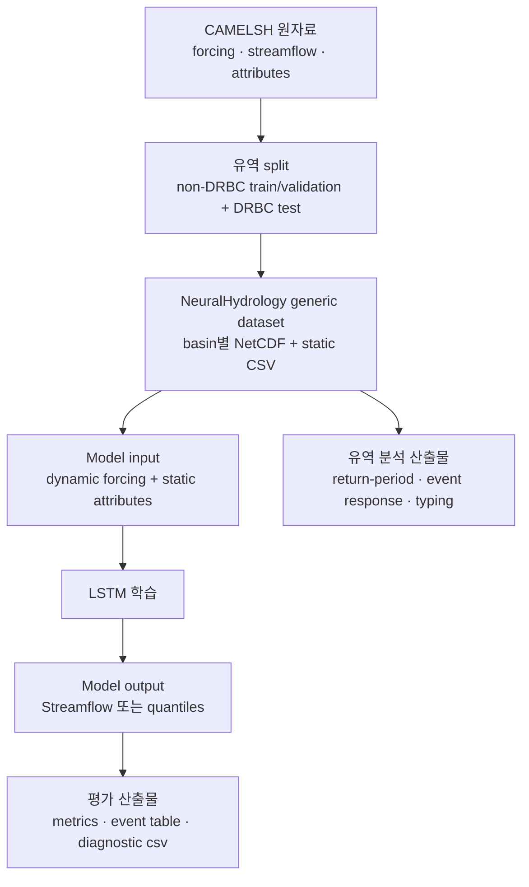

# 03. 데이터 입출력 방식

이 연구의 기본 자료는 CAMELSH hourly dataset이다. hourly는 시간 간격이 1시간이라는 뜻으로, 하루 24개·한 해 약 8,760개의 값이 변수마다 쌓인 시계열이다. 모델은 시간마다 변하는 기상 자료(dynamic forcing)와 유역마다 거의 고정된 지형·토양·토지피복 정보(static attributes)를 함께 받아 시간별 하천 유량(`Streamflow`)을 예측한다.

이 문서는 처리 단계를 순서대로 따라가는 대신, 데이터 자체를 구성 축으로 설명한다. 즉 데이터셋이 무엇이고 원자료가 어디서 왔는지, 어떤 종류의 자료가 섞여 있는지, 모델이 읽는 입력과 내놓는 출력은 무엇인지, 그리고 유역을 어떤 기준으로 train·validation·test로 나누었는지를 차례로 정리한다. 실제 처리를 수행하는 스크립트·설정 파일·데이터 위치는 본문 산문에 끼워 넣지 않고, 각 절 끝의 표로 따로 모은다.

```mermaid
flowchart TD
    A["CAMELSH 원자료<br/>forcing · streamflow · attributes"] --> B["유역 split<br/>non-DRBC train/validation + DRBC test"]
    B --> C["NeuralHydrology generic dataset<br/>basin별 NetCDF + static CSV"]
    C --> D["Model input<br/>dynamic forcing + static attributes"]
    D --> E["LSTM 학습"]
    E --> F["Model output<br/>Streamflow 또는 quantiles"]
    F --> G["평가 산출물<br/>metrics · event table · diagnostic csv"]
    C --> H["유역 분석 산출물<br/>return-period · event response · typing"]
```

여기서 NeuralHydrology(이하 NH)는 이 프로젝트가 가져다 쓰는 LSTM 학습 라이브러리이고, 그 라이브러리가 곧바로 읽을 수 있는 표준 자료 형식을 generic dataset이라고 부른다. 전처리의 목표 중 하나는 제각각인 CAMELSH 원자료를 이 generic 형식에 맞추는 것이다.

## 1. 데이터셋과 원자료 출처

CAMELSH는 미국 전역 규모의 다중 유역(multi-basin) 수문 데이터셋으로, 유역마다 시간별 기상 forcing·관측 유량과 정적 속성을 함께 제공한다. 이 연구는 그중 시간 해상도가 1시간인 hourly 자료를 사용하며, CAMELS-US local dataset은 현재 공식 실험에서 쓰지 않는다.

자료는 성격이 다른 여러 원본 아카이브에서 모인다. 핵심 원본은 다음과 같다.

| 원본 아카이브 | 담는 것 | 관측 유량(`Streamflow`) 포함 여부 |
| --- | --- | --- |
| `timeseries.7z` | 시간별 기상 forcing + 관측 유량 | 포함 |
| `timeseries_nonobs.7z` | 시간별 기상 forcing만 | 미포함 |
| `Hourly2.zip` | 시간별 관측 유량만 | 관측 유량만 |

정적 속성(`area`, `slope` 등)은 CAMELSH 및 GAGES-II 계열 attribute 자료에서 가져오고, 유역 경계 신뢰도 같은 메타데이터는 GAGES-II의 boundary QA 자료(`attributes_gageii_Bound_QA.csv`)에서 가져온다. 평가 지역 경계는 DRBC(Delaware River Basin Commission) 공식 boundary shapefile을 쓴다.

이 세 종류로 자료가 나뉘어 있다는 점이 뒤의 split·test 확장 설계에 직접 영향을 준다. 어떤 유역은 forcing과 관측 유량이 한 아카이브(`timeseries.7z`)에 같이 들어 있지만, 어떤 유역은 forcing(`timeseries_nonobs.7z`)과 관측 유량(`Hourly2.zip`)이 서로 다른 원본에 흩어져 있어 둘을 따로 가져와 짝지어야 한다.

## 2. 모델이 읽는 형태로의 변환

원자료를 NH generic dataset 형식으로 바꾸면, 유역별 시계열은 시간 축 이름이 `date`로 통일된 NetCDF(`.nc`) 파일이 되고, 유역마다 거의 고정된 특성값은 한 줄에 한 유역씩 들어가는 static-attributes CSV가 된다. NetCDF는 여러 변수를 시간 축과 함께 묶어 담는 과학용 자료 형식이다. 변환과 동시에, 각 split 기간 안에 정답으로 쓸 관측 유량이 충분한지 다시 확인해 split 목록을 기록한다.

이렇게 준비된 자료의 위치와 구조는 다음과 같다.

| 항목 | 위치 |
| --- | --- |
| 유역별 시계열 | `data/CAMELSH_generic/drbc_holdout_broad/time_series/*.nc` |
| 유역별 정적 속성 | `data/CAMELSH_generic/drbc_holdout_broad/attributes/static_attributes.csv` |
| split 목록 | `data/CAMELSH_generic/drbc_holdout_broad/splits/{train,validation,test}.txt` |
| split 기록(누가 왜 빠졌는지) | `.../splits/split_manifest.csv` |

## 3. 입력 1: dynamic forcing

dynamic forcing은 시간에 따라 변하며 유역을 외부에서 구동하는 입력 조건으로, 이 연구에서는 기상 변수가 이에 해당한다. 모델은 현재 11개 forcing 변수를 입력으로 받는다. 홍수 첨두는 유역으로 들어오는 물의 양과 유역이 그 물에 반응하는 방식이 함께 결정하므로, forcing 변수는 강수 자체뿐 아니라 강수의 성격과 강수 전후의 에너지·수분 조건까지 포괄한다.

아래 표의 "지표" 열은 일상적으로 부르는 이름, "변수명" 열은 자료와 코드에서 쓰는 정확한 식별자다. 단위·범위는 원자료와 전처리에 따라 표현이 달라질 수 있으므로 물리적 의미 중심으로 읽는다.

| 지표 | 변수명 | 뜻 | 단위/범위 감 |
| --- | --- | --- | --- |
| 강수량 | `Rainf` | 시간별 강수 flux | 0 이상, mm/h 수준 |
| 기온 | `Tair` | 지표 근처 대기 온도 | 음수~양수 가능 |
| 잠재증발산 | `PotEvap` | 대기가 증발시킬 수 있는 양 | 0 이상 |
| 하향 단파복사 | `SWdown` | 지표에 도달하는 태양복사 | 0 이상 |
| 비습 | `Qair` | 공기 중 수증기량 | 0 이상, 소수 |
| 지표 기압 | `PSurf` | 지표면 기압 | 양수 |
| 동서 바람 성분 | `Wind_E` | 바람의 동서 방향 성분 | 음수~양수(방향) |
| 남북 바람 성분 | `Wind_N` | 바람의 남북 방향 성분 | 음수~양수(방향) |
| 하향 장파복사 | `LWdown` | 대기에서 지표로 향하는 열복사 | 0 이상 |
| 대기 불안정도 | `CAPE` | 대류 가용 잠재 에너지 | 0 이상 |
| 대류성 강수 비율 | `CRainf_frac` | 전체 강수 중 대류성 강수 비율 | 0~1 |

이 변수들이 모델에서 갖는 역할은 세 묶음으로 정리된다.

첫째, 강수의 절대량은 `Rainf`가 담는다. 유역으로 들어오는 직접적인 물 공급이며, 짧은 시간에 솟구치는 유량의 꼭대기인 홍수 첨두를 만드는 가장 핵심적인 forcing이다.

둘째, 강수의 성격은 `CAPE`와 `CRainf_frac`가 구분한다. `CAPE`(Convective Available Potential Energy, 대류 가용 잠재 에너지)는 대기 불안정도를 나타내 짧고 강한 대류성 호우 가능성과 연관되고, `CRainf_frac`(convective rainfall fraction)는 전체 강수 중 국지적·강한 대류성 비의 비율로, 같은 강수량이라도 비의 유형을 구분하는 신호가 된다.

셋째, 강수 전후의 에너지·수분 배경 조건은 나머지 변수들이 설명한다. `Tair`는 강수의 상(비/눈)과 융설·증발 조건을 가르고, `PotEvap`은 실제 증발량보다 대기의 증발 수요에 가까워 선행 건조도와 토양 수분 감소를 간접적으로 반영한다. `SWdown`과 `LWdown`은 각각 단파·장파 복사로 주야 지표 에너지 상태, 융설, 증발 조건과 연관된다. `Qair`(비습)는 공기 중 수증기량으로 강수 환경과 증발 수요를 함께 나타내고, `PSurf`(지표 기압)는 단독 홍수 설명보다 폭풍 상황을 구성하는 배경 변수에 가깝다. `Wind_E`와 `Wind_N`은 바람의 동서·남북 성분으로, 합치면 풍속과 풍향이 되어 열·수증기 교환과 폭풍 이동 조건을 표현한다.

> forcing 변수 목록의 정의 위치: 설정 파일 `configs/camelsh_hourly_model2_drbc_holdout_broad.yml`의 `dynamic_inputs` 항목.

## 4. 입력 2: static attributes

static attributes는 시간에 따라 변하지 않거나 적어도 학습 기간 안에서는 고정으로 두는 유역 특성으로, 유역별로 한 줄씩 정리된다. 같은 강수가 들어와도 어떤 유역은 빠르게 불어나고 어떤 유역은 완만하게 반응하는 차이를 설명하는 정보다. 예컨대 경사가 크고 하천망이 촘촘하면 물이 빨리 모이고, 토양 저장 능력이 크면 첨두가 완충된다. 모델은 현재 8개 정적 속성을 입력으로 받는다.

| 지표 | 변수명 | 뜻 | 단위/범위 감 |
| --- | --- | --- | --- |
| 유역 면적 | `area` | 유역의 배수 면적 | 양수(km² 규모) |
| 평균 경사 | `slope` | 유역 평균 지표 경사 | 0 이상 |
| 건조도 지수 | `aridity` | 장기 건조도(클수록 건조) | 0 이상 |
| 강설 비율 | `snow_fraction` | 강수 중 눈 비율에 가까운 지표 | 0~1 |
| 토양 깊이 | `soil_depth` | 토양·암반까지 깊이 관련 저장성 | 0 이상 |
| 투수성 | `permeability` | 토양·지질의 투수성 | 0 이상 |
| 산림 비율 | `forest_fraction` | 산림 피복 비율 | 0~1 |
| 기저유출 지수 | `baseflow_index` | 전체 유출 중 기저유출(baseflow) 비중 | 0~1 |

각 특성이 홍수 반응에 갖는 의미는 다음과 같다. `area`는 유역 규모로, 같은 유량이라도 유역 크기에 따라 의미가 달라지므로 기본 크기 정보가 된다. `slope`가 클수록 물이 빠르게 모여 첨두 형성과 반응 속도에 직접 관련된다. `aridity`는 강수와 잠재증발산의 상대 관계를 요약해 평소 건조한 유역인지 습윤한 유역인지 구분한다. `snow_fraction`은 융설과 rain-on-snow(눈 위 강우) 영향이 큰 유역인지 나타낸다. `soil_depth`가 크면 저장 공간이 커서 첨두를 완충하는 성격을 갖는다. `permeability`는 물이 땅속으로 스며드는 정도로 직접 유출과 기저유출 성격을 가른다. `forest_fraction`은 차단·침투·증발산과 관련되어 강수 반응을 완만하게 만들 수 있다. `baseflow_index`는 지하수 기여와 유역 완충성을 나타내며, 값이 높으면 짧은 강수에 대한 즉각적 반응이 상대적으로 약할 수 있다.

이 8개 특성은 scaling pilot(아래 "7. 유역 split" 참조) 단계의 대표성 진단에서도 비교 대상으로 쓰인다. 줄여 뽑은 유역 집합이 전체 pool과 비슷한 특성 분포를 갖는지 확인할 때 이 변수들의 분포를 본다.

> 정적 속성 목록의 정의 위치: 설정 파일 `configs/camelsh_hourly_model2_drbc_holdout_broad.yml`의 `static_attributes` 항목.

## 5. 출력: Streamflow

모델이 맞히려는 정답(target)은 하천의 시간별 유량인 `Streamflow` 하나다. 물리적으로 유량은 음수가 될 수 없으므로, target을 0 아래로 내려가지 않게 잘라(clip) 처리한다.

Model 1은 매 시간 하나의 `Streamflow` 예측값을 낸다. Model 2는 같은 시간에 대해 `q50`, `q90`, `q95`, `q99`를 낸다. 여기서 `q`는 quantile(분위수)을 뜻하고, 예컨대 `q95`는 "이 값보다 관측 유량이 낮을 가능성을 95%로 보는 선"이다. Model 2의 `q50`(중앙선)은 Model 1의 단일 예측값과 비교할 대표선으로 사용한다.

> target 정의 위치: 설정 파일의 `target_variables` 항목에 `Streamflow`, 음수 차단은 `clip_targets_to_zero` 항목에서 처리한다.

출력 변수는 다음처럼 구분한다.

| 변수명 | 뜻 | 해석할 때 주의할 점 |
| --- | --- | --- |
| `Streamflow` | outlet에서의 시간별 유량(discharge) | 수위가 아니라 단위 시간에 하천 단면을 통과하는 물의 양. 평가 때는 정규화를 되돌린(inverse scaling) 실제 유량 스케일에서 지표를 계산 |
| `q50` | Model 2의 조건부 중앙선 유량 | Model 1의 단일 예측과 가장 직접 비교할 수 있는 출력 |
| `q90` | Model 2가 예측한 90% 조건부 분위수 | 관측이 이 값보다 낮을 가능성을 90%로 본 상위선. 검증된 예측 구간과 같다고 바로 단정 금지 |
| `q95` | Model 2가 예측한 95% 조건부 분위수 | 높은 유량 과소추정을 줄일 수 있는 상위선. 실제 coverage가 95%에 가까운지는 별도 calibration 진단 필요 |
| `q99` | Model 2가 예측한 99% 조건부 분위수 | 극단 상위 반응을 보는 출력. 99년 빈도 홍수나 관측 유량의 `Q99` threshold와 같은 뜻이 아님 |

여기서 coverage는 "관측값이 예측 quantile 아래에 들어오는 비율", calibration은 "예측한 분위수가 실제로 그 비율만큼 관측을 덮는지 점검하는 일"이다.

즉 Model 2의 `q90/q95/q99`는 "앞 336시간의 입력 조건을 봤을 때, 해당 정답 시점의 유량이 어느 정도까지 커질 수 있는가"를 표현한다. 과거 336시간 유량의 분위수를 계산한 값이 아니라, 모델이 각 정답 시점마다 직접 예측하는 출력이다.

## 6. 시간 구간

같은 자료를 학습·검증·평가로 나누는 시간 경계는 설정 파일의 날짜 항목으로 정한다. 모델 학습·평가에 쓰는 공식 구간과, 일부 후속 분석이 기준선을 잡을 때 참조하는 더 넓은 구간을 함께 정리하면 다음과 같다.

| 구간 | 기간 | 역할 |
| --- | --- | --- |
| train | 2000-01-01 ~ 2010-12-31 | 모델 학습 기간 |
| validation | 2011-01-01 ~ 2013-12-31 | epoch 선택과 중간 점검에 쓰는 기간 |
| test | 2014-01-01 ~ 2016-12-31 | 전체 성능 평가 기간 |
| 후속 분석 기준 구간 | 분석별로 학습 구간(2000–2010) 등 더 넓은 관측 구간 참조 | 큰 물 기준선(대문자 Q99) 같은 유역별 임계값을 안정적으로 잡기 위해 참조 |

epoch란 학습 자료 전체를 한 번 훑는 한 바퀴를 말한다. validation은 여러 epoch 중 어느 시점의 모델을 쓸지 고르는 데 쓴다.

이 기간은 가장 오래된 자료를 모두 쓰기 위해 정한 것이 아니라, 많은 유역이 공통으로 비교 가능한 현대 구간을 확보하기 위해 정한 것이다. 너무 이른 기간부터 쓰면 오래된 관측소 몇 곳에만 맞춰 유역 pool이 크게 줄기 때문이다.

마지막 행의 "후속 분석 기준 구간"은 모델을 추가로 학습하는 구간이 아니라, 일부 분석이 유역별 임계값을 잡을 때만 참조하는 더 넓은 관측 구간이다. 예를 들어 `q99_analysis`에서 유역별 큰 물 기준선(대문자 Q99)은 test 구간이 아니라 학습 기간(2000–2010) 관측 유량의 상위 1% 분위수로 한 번 고정한다. test 기간 관측이 기준선을 정하는 데 끼어들지 않게 하려는 설계로, 정확한 참조 구간은 분석마다 다르므로 각 분석 문서(예: `docs/explain/10_q99_analysis.md`)와 공용 설정(`scripts/_lib/expanded_drbc.py`)에서 확인한다.

## 7. 유역 split

이 연구는 train·validation·test를 시간으로만 나누지 않고 유역 자체도 공간적으로 분리한다. 학습과 검증은 DRBC 밖 유역(non-DRBC)에서 하고, 평가 대상 지역인 DRBC(Delaware River Basin Commission이 관리하는 Delaware River Basin) 안의 유역은 holdout으로 둔다. holdout은 학습에 전혀 쓰지 않고 끝까지 숨겨 두었다가 최종 평가에만 쓰는 지역을 말한다. 지역을 통째로 떼어 두면, 학습에서 한 번도 본 적 없는 낯선 지역에 모델이 얼마나 일반화되는지 더 엄격하게 볼 수 있다.

전체 학습 pool을 그대로 학습하면 계산 비용이 매우 크기 때문에, scaling pilot(유역 수를 100/300/600으로 바꿔 가며 적정 규모를 찾는 운영용 사전 실험)을 거쳐 학습·검증 유역 수를 300으로 고정했다. 현재 compute 제약을 반영한 공식 비교 실험(main comparison)이 직접 쓰는 split의 구성은 다음과 같다.

- train: 269개 (non-DRBC 학습 유역)
- validation: 31개 (non-DRBC 검증 유역)
- test: 85개 (관측이 확보된 DRBC holdout 유역)

이 split이 여러 층으로 나뉘는 자세한 사정과 각 층의 정확한 숫자는 `docs/experiment/method/data/data_processing_analysis_guide.md`에 정리되어 있다.

### test 유역을 확장해 재분석한 경위

train·validation split은 학습이 모두 끝난 뒤에 다시 손대지 않는 것이 원칙이다. 그래서 이 연구도 train 269개 / validation 31개 split은 처음 고정한 그대로 유지한다. 다만 평가 단계에서, DRBC 안에서 실제로 관측 유량이 확보되는 test 유역을 더 넓게 모을 수 있다는 점을 학습이 끝난 뒤에 알게 되었다. 그래서 모델을 다시 학습하지 않고 test 유역만 확장해 재평가했다.

확장의 열쇠는 위 "1. 데이터셋과 원자료 출처"에서 설명한 세 종류의 원본 자료 조합이다.

- 어떤 유역은 forcing과 관측 유량이 `timeseries.7z` 한 곳에 같이 들어 있다. 이 경우 그대로 forcing·target을 가져온다.
- 어떤 유역은 forcing이 `timeseries_nonobs.7z`(관측 유량 없음)에만 있고, 관측 유량은 `Hourly2.zip`(관측 유량만)에 따로 있다. 이때는 두 원본을 유역 단위로 짝지어, forcing은 `timeseries_nonobs`에서, target 관측 유량은 `Hourly2`에서 가져온다.

이 조합 덕분에, forcing만 있어 정답이 없는 것처럼 보였던 DRBC 유역도 별도 관측 유량 원본과 짝지으면 test에 쓸 수 있게 된다. DRBC holdout 후보 154개에 metadata 품질 기준과 2014–2016 target coverage 기준을 적용해 추린 결과가 현재 공식 test 85개다. 이 85개 중 forcing을 `timeseries`에서 가져온 유역이 36개, `timeseries_nonobs`+`Hourly2` 조합으로 복원한 유역이 49개다. 즉 확장은 새 유역을 임의로 더한 것이 아니라, 이미 holdout 후보였던 유역의 관측 유량을 다른 원본에서 되살려 평가 가능 범위를 넓힌 것이다.

## prepared dataset과 산출물 위치

전처리된 자료와 실험 결과의 위치는 다음과 같다. 본문에서 반복 설명하지 않고 여기 한곳에 모은다.

| 항목 | 위치 | 내용 |
| --- | --- | --- |
| prepared dataset | `data/CAMELSH_generic/drbc_holdout_broad/` | 유역별 시계열·정적 속성·split 목록 |
| 확장 test split | `configs/basin_splits/drbc_expanded_observed_test/` | test 85개 정의, manifest, target coverage |
| 학습 run 산출물 | `runs/` | `config.yml`, `output.log`, validation/test metric, 예측 결과 |

## 결측값 처리 방식

시계열 자료에는 가끔 값이 비어 있다(결측). 이 연구에서 가장 자주 문제가 되는 것은 정답인 `Streamflow` 결측이다. 강수나 기온 같은 dynamic forcing이 비어 있으면 모델이 그 시간의 입력을 제대로 읽을 수 없고, 관측 유량인 `Streamflow`가 비어 있으면 정답을 모르는 시간이 된다.

현재 subset300 실험에서 확인한 결과, 모델 입력으로 쓰는 dynamic forcing 11개와 static attributes에는 train/validation/test 구간 안에서 결측이 없었다. 따라서 이번 실험에서 실제로 문제가 되는 결측은 거의 `Streamflow` 쪽이다.

학습할 때는 모델이 최근 `336시간`(설정 항목 `seq_length`)을 입력으로 보고 마지막 `24시간`(설정 항목 `predict_last_n`)의 유량을 맞히도록 sample을 만든다. 이 336시간 입력 안에 dynamic forcing 결측이 하나라도 있으면 그 sample은 학습에 쓰지 않는다. 반대로 `Streamflow`는 24시간 정답 구간이 전부 비어 있으면 sample을 버리지만, 일부 시간만 비어 있으면 나머지 유효한 시간만 loss(틀린 정도 점수) 계산에 쓴다.

validation과 test에서도 `Streamflow`가 비어 있는 시간은 metric 계산에서 빠진다. 그래서 test 기간이 `2014-2016`이라고 해서 그 안의 모든 시간이 성능 계산에 들어가는 것은 아니다. 성능표는 관측값과 예측값이 둘 다 유효한 시간 위에서 계산된 결과로 읽어야 한다.

## 분석 산출물

모델 학습 전후로 여러 CSV 산출물이 만들어진다. 원칙적으로 raw 산출물을 그대로 논문 표에 넣지 않고, 후처리 스크립트로 정돈한 요약 표를 비교에 쓴다. 주요 산출물의 이름·위치·내용은 다음과 같다.

| 산출물 | 위치 | 내용 |
| --- | --- | --- |
| 유역 선택·품질 분석 | `output/basin/` | 유역 screening, 품질 gate 통과 여부 등 |
| scaling pilot 진단 | `configs/pilot/diagnostics/` | subset 대표성·규모 진단 |
| 전 유역 관측 유량 분석 | `output/basin/all/analysis/` | 재현기간 reference, event response table, flood generation typing |
| `summary_metrics.csv` | 후처리 산출물 | 모델 비교용 정돈된 요약 지표 |
| `event_metrics.csv` | 후처리 산출물 | event(유량이 크게 오른 사건)별 지표 |
| `quantile_diagnostics.csv` | 후처리 산출물 | Model 2 quantile 출력 진단 |

`output/basin/all/analysis/` 산출물은 모델 학습 결과가 아니라, 유역과 event를 해석하기 위한 배경 자료다. 서버에서 `.nc` 파일이 모두 준비되면 `scripts/runs/official/run_camelsh_flood_analysis.sh`로 전 유역 관측 유량 분석을 돌려 생성한다.
