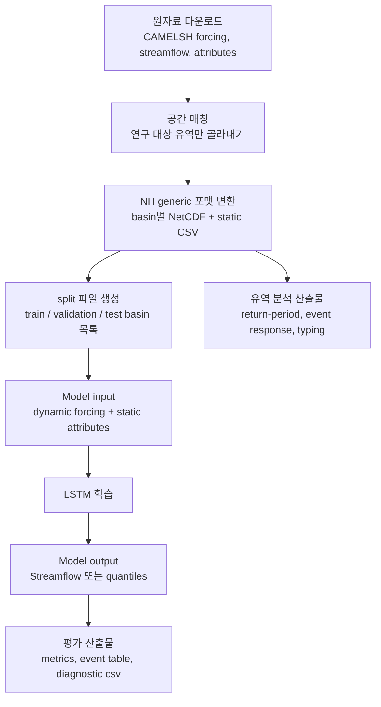

# 03. 데이터 입출력 방식

이 연구의 기본 자료는 CAMELSH hourly dataset이다. hourly라는 말은 시간 간격이 1시간이라는 뜻이다. 즉 하루 24개, 한 해 약 8,760개의 값이 변수마다 쌓여 있는 시계열이다. 모델은 시간마다 변하는 기상 자료(아래에서 설명하는 dynamic forcing)와 유역마다 거의 고정된 지형·토양·토지피복 정보(static attributes)를 함께 받아서, 시간별 하천 유량(`Streamflow`)을 예측한다.

이 문서는 "그 자료가 어디서 와서, 어떤 처리를 거쳐, 모델이 바로 읽을 수 있는 형태가 되는지"를 차례대로 설명한다. 단순히 변수 이름만 나열하지 않고, 각 단계가 어떤 스크립트(코드 파일)에서 일어나는지도 함께 적는다. 그래야 나중에 "이 숫자는 어느 코드에서 만들어졌나"를 직접 따라갈 수 있다.

```mermaid
flowchart TD
    A["원자료 다운로드<br/>CAMELSH forcing, streamflow, attributes"] --> B["공간 매칭<br/>연구 대상 유역만 골라내기"]
    B --> C["NH generic 포맷 변환<br/>basin별 NetCDF + static CSV"]
    C --> D["split 파일 생성<br/>train / validation / test basin 목록"]
    D --> E["Model input<br/>dynamic forcing + static attributes"]
    E --> F["LSTM 학습"]
    F --> G["Model output<br/>Streamflow 또는 quantiles"]
    G --> H["평가 산출물<br/>metrics, event table, diagnostic csv"]
    C --> I["유역 분석 산출물<br/>return-period, event response, typing"]
```

여기서 NH는 NeuralHydrology를 줄인 말이다. 이 프로젝트가 가져다 쓰는 LSTM 학습 라이브러리이며, 그 라이브러리가 곧바로 읽을 수 있는 표준 자료 형식을 "generic dataset"이라고 부른다. 우리가 하는 전처리의 목표 중 하나는, 원래 제각각이던 CAMELSH 자료를 이 generic 형식에 맞추는 것이다.

## 자료의 출처와 준비 과정

이 절은 4원칙 중 첫 번째, "데이터가 어디서 어떻게 준비되는지"를 다운로드부터 split까지 차례대로 서술한다. 단계마다 실제로 그 일을 하는 스크립트 경로와 핵심 함수·설정값을 함께 적되, 직접 확인하지 못한 수치는 정성적으로만 설명한다.

### 1단계: 원자료 다운로드

CAMELSH 원자료는 Zenodo라는 공개 자료 저장소에 올라가 있다. 이 프로젝트에서 다운로드를 담당하는 스크립트는 `scripts/data/` 폴더 아래에 두 개 있다.

첫 번째는 `scripts/data/download_camelsh_core.py`다. 이 스크립트의 설명문에는 "지역 선별(region screening)에 필요한 최소한의 CAMELSH core 파일을 내려받는다"라고 적혀 있다. 즉 모든 유역의 무거운 시계열을 한꺼번에 받는 것이 아니라, 어떤 유역이 연구 대상에 들어오는지를 먼저 판단하는 데 필요한 가벼운 자료(유역 경계 shapefile, 메타데이터 등)만 받는 단계다. 내려받을 곳은 Zenodo의 한 공개 기록(record)이고, 받은 자료는 기본적으로 임시 작업 폴더(`tmp/camelsh`)에 풀린다.

두 번째는 `scripts/data/download_camelsh_hourly_selected.py`다. 설명문에는 "CAMELSH hourly observed 자료를 내려받되, 선택된 유역의 파일만 추출한다"라고 적혀 있다. 여기서 핵심은 "선택된 유역만"이다. 어떤 유역을 받을지는 미리 만들어 둔 ID 목록 파일(스크립트 기본값으로는 DRBC 선별 ID 목록)을 읽어서 정하고, 거기에 해당하는 유역의 시간별 관측 유량 파일만 골라 `basins/CAMELSH_data/hourly_observed` 아래에 저장한다. 시간별 자료는 매우 크기 때문에, 연구에 쓰지 않을 유역까지 전부 받지 않으려는 설계다.

정리하면, 다운로드는 "먼저 가벼운 core 자료로 대상 유역을 추린 뒤, 그 유역의 무거운 hourly 자료만 받는다"는 2단계 구조다.

### 2단계: 연구 대상 유역만 공간적으로 골라내기

내려받은 자료에는 전국 규모의 많은 유역이 들어 있다. 이 중 연구가 정의한 지역에 들어오는 유역만 추려야 한다. 이 일을 하는 스크립트는 `scripts/data/export_camelsh_matches_from_defined_region.py`다.

이 스크립트는 미리 정의한 대상 지역 경계(geojson)와 CAMELSH 유역 경계(shapefile)를 공간적으로 겹쳐 본다. 그리고 유역이 그 지역과 충분히 겹칠 때만 남긴다. 얼마나 겹쳐야 "충분한가"는 설정 항목 `--min-overlap-ratio`로 정하고, 기본값은 `0.9`다. 즉 유역 면적의 90% 이상이 대상 지역 안에 들어와야 그 유역을 매칭된 유역으로 본다. 유역 경계와 outlet(유역의 물이 빠져나가는 출구 지점) 위치를 함께 비교해, 경계만 겹치고 출구는 엉뚱한 곳에 있는 후보를 거른다.

이 공간 매칭 기준(outlet 위치와 overlap ratio)이 곧 뒤에 나오는 DRBC holdout과 training pool을 나누는 토대가 된다. 그 자세한 기준은 아래 "유역 split" 절에서 다시 설명한다.

### 3단계: NH generic 포맷으로 변환

대상 유역을 정했으면, 그 유역들의 시계열을 LSTM 라이브러리가 바로 읽을 수 있는 형태로 바꿔야 한다. 이 변환의 중심 스크립트가 `scripts/data/prepare_camelsh_generic_dataset.py`다. 이 스크립트는 "원본 timeseries 아카이브에서 generic dataset을 만들고, 정돈된 static-attributes CSV를 함께 만든다"는 설명을 달고 있다. 이 한 번의 실행이 변환과 split을 모두 처리한다.

이 스크립트가 하는 핵심 일은 크게 세 가지다.

첫째, 각 유역의 시계열 파일을 표준 형식으로 정리한다. 담당 함수는 `standardize_netcdf`다. 원본 파일마다 시간 축의 이름이 `DateTime`, `time` 등으로 제각각인데, 이 함수는 시간 축 이름을 모두 `date`로 통일한다. NH generic dataset이 시간 좌표를 `date`라는 이름으로 기대하기 때문이다. 만약 어떤 시간 축 이름도 찾지 못하면 오류를 내고 멈춘다. 변환된 유역별 파일은 prepared dataset 폴더 안 `time_series/` 아래에 NetCDF(`.nc`) 형식으로 저장된다. NetCDF는 여러 변수를 시간 축과 함께 묶어 담는 과학용 자료 형식이다.

둘째, 유역마다 거의 고정된 특성값을 모아 하나의 표로 만든다. 담당 함수는 `build_static_attributes`다. 결과는 `attributes/static_attributes.csv`로 저장되며, 한 줄이 한 유역, 한 열이 하나의 특성(아래 "입력 2"에서 설명하는 면적·경사 등)이다.

셋째, 각 시간 구간(train/validation/test)에서 그 유역이 실제로 쓸 만한지 검사하고 split 목록 파일을 쓴다. 이 부분이 곧 4단계다.

### 4단계: split 파일 생성과 검증

split이란 어떤 유역을 학습(train)에, 검증(validation)에, 평가(test)에 쓸지를 적어 둔 목록이다. `prepare_camelsh_generic_dataset.py` 안에서 이 목록을 쓰는 함수는 `write_filtered_splits`다.

이 함수는 단순히 후보 유역을 그대로 베끼지 않는다. 각 유역이 자기 split 기간 안에 정답으로 쓸 관측 유량을 충분히 가지고 있는지 다시 확인한다. 유효한 관측 유량 시간 수를 세는 일은 `count_valid_target_values` 함수가 맡는다. 요구하는 최소 유효 시간 수는 split마다 다르고, 스크립트 기본값은 train이 `720`시간, validation과 test가 각각 `168`시간이다. 이 기준을 못 채운 유역은 해당 split에서 빠진다.

이렇게 만들어진 목록은 prepared dataset 폴더 안 `splits/` 아래에 `train.txt`, `validation.txt`, `test.txt`로 저장된다. 함께 `split_manifest.csv`도 남기는데, 여기에는 어떤 유역이 왜 빠졌는지(예: 유효 유량 시간 부족)와 각 기준값이 기록되어 검증·재현에 쓰인다.

결국 모델 학습에 들어가기 직전 자료의 모습은 이렇다. 유역별 시계열은 `time_series/*.nc`, 유역별 고정 특성은 `attributes/static_attributes.csv`, 어떤 유역을 어느 단계에 쓸지는 `splits/`의 텍스트 목록과 `split_manifest.csv`로 정리되어 있다.

## 입력 1: dynamic forcing

dynamic forcing은 시간마다 바뀌는 외부 조건이다. 이 연구에서는 주로 기상 자료가 여기에 해당한다. "dynamic"은 "시간에 따라 변한다"는 뜻이고, "forcing"은 "유역을 바깥에서 밀어붙이는 입력 조건"이라는 뜻이다.

어떤 변수명을 입력으로 쓸지는 설정 파일 `configs/camelsh_hourly_model2_drbc_holdout_broad.yml`의 설정 항목 `dynamic_inputs`에 그대로 적혀 있다. 현재 11개이며 `Rainf`, `Tair`, `PotEvap`, `SWdown`, `Qair`, `PSurf`, `Wind_E`, `Wind_N`, `LWdown`, `CAPE`, `CRainf_frac`다. 기존 연구 설계 문서에서는 이를 더 일반적인 이름으로 `prcp`(강수), `tmax`/`tmin`(최고·최저 기온), `srad`(일사), `vp`(수증기압), `PET`(잠재증발산)처럼 설명하기도 한다.

가장 직관적인 변수는 강수, 기온, 증발산 관련 변수다. 홍수는 결국 들어오는 물의 양과 유역이 그 물에 반응하는 방식이 함께 만든 결과이므로, 모델은 최근 며칠 동안 비가 얼마나 왔고 기상 조건이 어땠는지를 봐야 한다.

아래 표는 각 변수명의 뜻과 단위·범위 감만 간단히 적은 것이다. 단위는 원자료와 전처리 과정에 따라 표현이 달라질 수 있으므로, 물리적 의미 중심으로 읽는 것이 좋다. 표 다음 문단에서 "왜 그 변수가 모델에 중요한가"를 묶어서 설명한다.

| 변수명 | 뜻 | 단위/범위 감 |
| --- | --- | --- |
| `Rainf` | 시간별 강수량(강수 flux) | 0 이상, mm/h 수준 |
| `Tair` | 지표 근처 기온 | 음수~양수 가능 |
| `PotEvap` | 잠재증발산(대기가 증발시킬 수 있는 양) | 0 이상 |
| `SWdown` | 하향 단파복사(태양복사) | 0 이상 |
| `Qair` | 비습(공기 중 수증기량) | 0 이상, 소수 |
| `PSurf` | 지표 기압 | 양수 |
| `Wind_E` | 동서 방향 바람 성분 | 음수~양수(방향) |
| `Wind_N` | 남북 방향 바람 성분 | 음수~양수(방향) |
| `LWdown` | 하향 장파복사(대기→지표) | 0 이상 |
| `CAPE` | 대기 불안정도 지표 | 0 이상 |
| `CRainf_frac` | 전체 강수 중 대류성 강수 비율 | 0~1 |

이 변수들이 모델에서 하는 역할은 세 묶음으로 이해하면 쉽다.

첫째, "얼마나 비가 왔는가"는 `Rainf`가 알려준다. 유역에 들어오는 직접적인 물 공급이며, 홍수 첨두(짧은 시간에 솟구치는 유량의 꼭대기)를 만드는 가장 핵심적인 forcing이다.

둘째, "어떤 성격의 비였는가"는 `CAPE`와 `CRainf_frac`가 알려준다. `CAPE`(Convective Available Potential Energy, 대류 가용 잠재 에너지)는 대기가 얼마나 불안정한지를 나타내, 짧고 강한 대류성 호우 가능성을 설명한다. `CRainf_frac`(convective rainfall fraction)는 전체 강수 중 국지적이고 강한 대류성 비의 비율로, 같은 강수량이라도 비의 성격을 구분하는 신호가 된다.

셋째, "그 비가 들어오기 전후의 에너지·수분 조건은 어땠는가"는 나머지 변수들이 설명한다. `Tair`는 강수가 비인지 눈인지, 눈이 녹을 수 있는지, 증발 조건이 어떤지를 가른다. `PotEvap`은 실제 증발량이라기보다 대기가 물을 얼마나 증발시킬 수 있는지에 가까워, 선행 건조도와 토양 수분 감소를 간접적으로 반영한다. `SWdown`(하향 단파복사)과 `LWdown`(하향 장파복사)은 각각 낮·밤의 지표 에너지 상태, 눈 녹음, 증발 조건과 관련된다. `Qair`(비습)는 공기 중 수증기량으로 강수 환경과 증발 수요를 함께 설명한다. `PSurf`(지표 기압)는 단독으로 홍수를 설명한다기보다 폭풍 상황을 구성하는 배경 기상 변수다. `Wind_E`와 `Wind_N`은 각각 동서·남북 바람 성분으로, 둘을 합치면 풍속과 풍향이 되어 열·수증기 교환과 폭풍 이동 조건을 표현한다.

## 입력 2: static attributes

static attributes는 시간마다 바뀌지 않거나, 적어도 모델 학습 기간 안에서는 고정으로 두는 유역 특성이다. "static"은 "시간에 따라 변하지 않는다"는 뜻이다. 이 값들은 위에서 설명한 `attributes/static_attributes.csv`에 유역별로 한 줄씩 들어 있다.

이 값들은 "같은 비가 와도 왜 어떤 유역은 빠르게 불어나고 어떤 유역은 천천히 반응하는가"를 설명한다. 예를 들어 경사가 크고 하천망이 촘촘한 유역은 물이 빨리 모이고, 토양 저장 능력이 큰 유역은 첨두가 완충된다.

어떤 특성을 입력으로 쓸지는 설정 파일 `configs/camelsh_hourly_model2_drbc_holdout_broad.yml`의 설정 항목 `static_attributes`에 적혀 있고, 현재 8개다.

| 변수명 | 뜻 | 단위/범위 감 |
| --- | --- | --- |
| `area` | 유역 면적 | 양수(km² 규모) |
| `slope` | 평균 유역 경사 | 0 이상 |
| `aridity` | 장기 건조도 지수 | 0 이상(클수록 건조) |
| `snow_fraction` | 강수 중 눈 비율에 가까운 지표 | 0~1 |
| `soil_depth` | 토양·암반까지 깊이 관련 저장성 지표 | 0 이상 |
| `permeability` | 토양·지질의 투수성 지표 | 0 이상 |
| `forest_fraction` | 산림 피복 비율 | 0~1 |
| `baseflow_index` | 전체 유출 중 기저유출(baseflow) 비중 | 0~1 |

각 특성이 홍수 반응에 갖는 의미는 다음과 같다. `area`는 유역 규모를 알려준다. 같은 유량이라도 작은 유역과 큰 유역에서 의미가 다르므로 기본 크기 정보가 된다. `slope`(경사)가 클수록 물이 빠르게 모여 첨두 형성과 반응 속도에 직접 관련된다. `aridity`(건조도)는 강수와 잠재증발산의 상대 관계를 요약해, 평소 건조한 유역인지 습윤한 유역인지 구분한다. `snow_fraction`은 눈 쌓임, 눈 녹음, 눈 위에 비가 오는 상황(rain-on-snow)의 영향이 큰 유역인지 알려준다. `soil_depth`가 크면 물을 저장할 공간이 커서 첨두를 완충하는 성격을 설명한다. `permeability`(투수성)는 물이 땅속으로 얼마나 잘 스며드는지를 나타내, 직접 유출과 기저유출 성격을 가른다. `forest_fraction`(산림 비율)은 차단·침투·증발산과 관련되어 강수에 대한 반응을 완만하게 만들 수 있다. `baseflow_index`(기저유출 지수)는 지하수 기여와 유역의 완충성을 나타내며, 값이 높으면 짧은 강수에 대한 즉각적 반응이 상대적으로 약할 수 있다.

이 8개 특성은 scaling pilot(아래 "유역 split"에서 설명) 단계의 대표성 진단에서도 그대로 비교 대상으로 쓰인다. 즉 줄여 뽑은 유역 집합이 전체 pool과 비슷한 유역 특성 분포를 갖는지 확인할 때 이 변수들의 분포를 본다.

## 출력: Streamflow

모델이 맞히려는 정답(target)은 `Streamflow`다. 설정 파일의 설정 항목 `target_variables`에 `Streamflow` 하나만 적혀 있다. 하천의 시간별 유량을 뜻한다. 물리적으로 유량은 음수가 될 수 없으므로, 같은 설정 파일의 설정 항목 `clip_targets_to_zero`에 `Streamflow`를 넣어 target을 0 아래로 내려가지 않게 처리한다.

Model 1은 매 시간 하나의 `Streamflow` 예측값을 낸다. Model 2는 같은 시간에 대해 `q50`, `q90`, `q95`, `q99`를 낸다. 여기서 `q`는 quantile(분위수)을 뜻하고, 예컨대 `q95`는 "이 값보다 관측 유량이 낮을 가능성을 95%로 보는 선"이다. Model 2의 `q50`(중앙선)은 Model 1의 단일 예측값과 비교할 대표선으로 사용한다.

출력 변수는 다음처럼 구분한다.

| 변수명 | 뜻 | 해석할 때 주의할 점 |
| --- | --- | --- |
| `Streamflow` | outlet에서의 시간별 유량(discharge) | 수위가 아니라 단위 시간에 하천 단면을 통과하는 물의 양. 평가 때는 정규화를 되돌린(inverse scaling) 실제 유량 스케일에서 지표를 계산 |
| `q50` | Model 2의 조건부 중앙선 유량 | Model 1의 단일 예측과 가장 직접 비교할 수 있는 출력 |
| `q90` | Model 2가 예측한 90% 조건부 분위수 | 관측이 이 값보다 낮을 가능성을 90%로 본 상위선. 검증된 예측 구간과 같다고 바로 단정 금지 |
| `q95` | Model 2가 예측한 95% 조건부 분위수 | 높은 유량 과소추정을 줄일 수 있는 상위선. 실제 coverage가 95%에 가까운지는 별도 calibration 진단 필요 |
| `q99` | Model 2가 예측한 99% 조건부 분위수 | 극단 상위 반응을 보는 출력. 99년 빈도 홍수나 관측 유량의 `Q99` threshold와 같은 뜻이 아님 |

여기서 coverage는 "관측값이 예측 quantile 아래에 들어오는 비율", calibration은 "예측한 분위수가 실제로 그 비율만큼 관측을 덮는지 점검하는 일"이다.

즉 Model 2의 `q90/q95/q99`는 "앞 336시간의 입력 조건을 봤을 때, 해당 정답 시점의 유량이 어느 정도까지 커질 수 있는가"를 표현한다. 과거 336시간 유량의 분위수를 계산한 값이 아니라, 모델이 각 정답 시점마다 직접 예측하는 출력이다.

## 시간 구간

같은 자료를 학습·검증·평가로 나누는 시간 경계는 설정 파일의 날짜 항목으로 정한다. 현재 기준은 다음과 같다.

| 구간 | 기간 | 역할 |
| --- | --- | --- |
| train | 2000-01-01 ~ 2010-12-31 | 모델이 학습하는 기간 |
| validation | 2011-01-01 ~ 2013-12-31 | epoch 선택과 중간 점검에 쓰는 기간 |
| test | 2014-01-01 ~ 2016-12-31 | 최종 성능을 보고하는 기간 |

epoch란 학습 자료 전체를 한 번 훑는 한 바퀴를 말한다. validation은 여러 epoch 중 어느 시점의 모델을 쓸지 고르는 데 쓴다.

이 기간은 가장 오래된 자료를 모두 쓰기 위해 정한 것이 아니라, 많은 유역이 공통으로 비교 가능한 현대 구간을 확보하기 위해 정한 것이다. 너무 이른 기간부터 쓰면 오래된 관측소 몇 곳에만 맞춰 유역 pool이 크게 줄기 때문이다.

## 유역 split

이 연구에서는 train, validation, test를 단순히 시간으로만 나누지 않는다. 유역 자체도 나누어 생각한다.

학습은 DRBC 밖의 유역(non-DRBC basin)에서 한다. DRBC는 Delaware River Basin Commission이 관리하는 Delaware River Basin을 가리키며, 이 연구의 평가 대상 지역이다. DRBC 안의 유역은 holdout, 즉 "학습에 쓰지 않고 끝까지 숨겨 두었다가 마지막에만 평가에 쓰는" 평가 지역으로 둔다.

DRBC를 평가 지역으로 떼어 두는 기준은 위 2단계의 공간 매칭 결과를 쓴다. DRBC holdout 유역은 outlet이 DRBC 안에 있고(`outlet_in_drbc == True`) 유역 면적의 90% 이상이 DRBC와 겹치는(`overlap_ratio_of_basin >= 0.9`) 유역으로 잡으며, 문서 기준 154개다. 반대로 학습 pool은 outlet이 DRBC 밖에 있고(`outlet_in_drbc == False`) 겹침이 거의 없는(`overlap_ratio_of_basin <= 0.1`) 유역으로 두며, 품질 기준을 통과한 결과 1923개다. 이렇게 지역을 통째로 떼어 두면, 학습에서 한 번도 본 적 없는 낯선 지역에 모델이 얼마나 일반화되는지 더 엄격하게 볼 수 있다.

다만 전체 학습 pool을 그대로 학습하면 계산 비용이 매우 크다. 그래서 scaling pilot(유역 수를 100/300/600으로 바꿔 가며 적정 규모를 찾는 운영용 사전 실험)을 거쳐 학습·검증 유역 수를 300으로 고정했다. 현재 compute 제약을 반영한 main comparison(공식 비교 실험)이 직접 쓰는 split은 `configs/pilot/basin_splits/scaling_300/`의 basin 목록이고, 직접 실행 구조는 train 269개 / validation 31개 / test 85개다.

여기서 test 85개는 관측이 확보된 DRBC 유역이다. 즉 모델은 DRBC를 학습 중에 보지 않고, 최종적으로 DRBC에서 얼마나 잘 일반화되는지 평가받는다.

(이 split이 여러 층으로 나뉘는 자세한 사정과 각 층의 정확한 숫자는 `docs/experiment/method/data/data_processing_analysis_guide.md`에 정리되어 있다.)

## prepared dataset의 형태

모델이 바로 읽을 수 있도록 전처리된 자료는 `data/CAMELSH_generic/drbc_holdout_broad/` 아래에 놓인다. 이 안에는 위 3~4단계에서 만든 `time_series/*.nc`(유역별 시계열), `attributes/static_attributes.csv`(유역별 고정 특성), `splits/`의 split 텍스트 목록과 `split_manifest.csv`(어떤 유역을 어느 단계에 쓰고 무엇을 왜 뺐는지 기록)가 들어간다.

실험 결과는 `runs/` 아래에 저장된다. 보통 확인해야 하는 파일은 `config.yml`, `output.log`, validation metric, test metric, 그리고 예측 결과 파일이다.

## 결측값 처리 방식

시계열 자료에는 가끔 값이 비어 있다(결측). 이 연구에서 가장 자주 문제가 되는 것은 정답인 `Streamflow` 결측이다. 강수나 기온 같은 dynamic forcing이 비어 있으면 모델이 그 시간의 입력을 제대로 읽을 수 없고, 관측 유량인 `Streamflow`가 비어 있으면 정답을 모르는 시간이 된다.

현재 subset300 실험에서 확인한 결과, 모델 입력으로 쓰는 dynamic forcing 11개와 static attributes에는 train/validation/test 구간 안에서 결측이 없었다. 따라서 이번 실험에서 실제로 문제가 되는 결측은 거의 `Streamflow` 쪽이다.

학습할 때는 모델이 최근 `336시간`(설정 항목 `seq_length`)을 입력으로 보고 마지막 `24시간`(설정 항목 `predict_last_n`)의 유량을 맞히도록 sample을 만든다. 이 336시간 입력 안에 dynamic forcing 결측이 하나라도 있으면 그 sample은 학습에 쓰지 않는다. 반대로 `Streamflow`는 24시간 정답 구간이 전부 비어 있으면 sample을 버리지만, 일부 시간만 비어 있으면 나머지 유효한 시간만 loss(틀린 정도 점수) 계산에 쓴다.

validation과 test에서도 `Streamflow`가 비어 있는 시간은 metric 계산에서 빠진다. 그래서 test 기간이 `2014-2016`이라고 해서 그 안의 모든 시간이 성능 계산에 들어가는 것은 아니다. 성능표는 관측값과 예측값이 둘 다 유효한 시간 위에서 계산된 결과로 읽어야 한다.

## 분석 산출물

모델 학습 전후로 여러 CSV 산출물이 만들어진다. 유역 선택과 품질 분석은 주로 `output/basin/` 아래에 저장되고, scaling pilot 관련 진단은 `configs/pilot/diagnostics/` 아래에 저장된다.

서버에서 `.nc` 파일이 모두 준비되면 `scripts/runs/official/run_camelsh_flood_analysis.sh`로 전 유역 관측 유량 분석을 돌릴 수 있다. 이 runner는 `output/basin/all/analysis/` 아래에 재현기간 reference, event response table, flood generation typing 결과를 만든다. 이 산출물은 모델 학습 결과가 아니라, 유역과 event(유량이 크게 오른 사건)를 해석하기 위한 배경 자료다.

분석할 때는 raw 산출물을 그대로 논문 표에 넣기보다, 후처리 script로 `summary_metrics.csv`, `event_metrics.csv`, `quantile_diagnostics.csv`처럼 정돈된 표로 바꾼 뒤 비교하는 것이 원칙이다.
