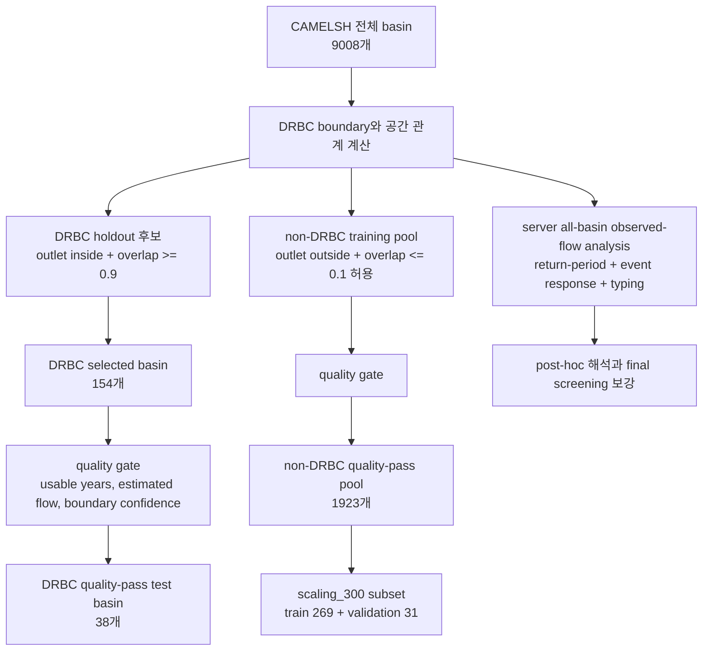
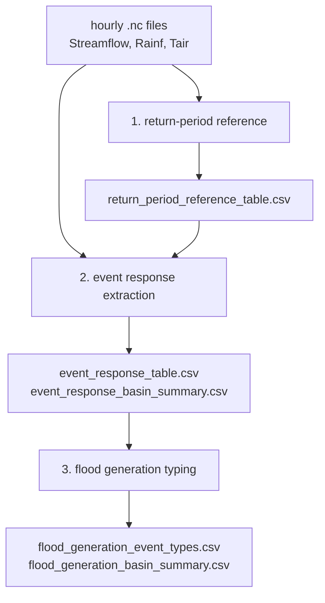

# 05. 유역 분석 방법

이 연구의 유역 분석은 두 질문을 분리해서 다룬다. 첫째, 모델을 어디에서 학습할 것인가. 둘째, 모델을 어디에서 평가할 것인가. 현재 기준에서는 DRBC 밖의 non-DRBC basin으로 모델을 학습하고, DRBC 내부 basin에서 holdout 평가를 한다.



## DRBC holdout basin을 고르는 방법

DRBC는 Delaware River Basin Commission의 공식 경계를 기준으로 한다. 기준 파일은 `basins/drbc_boundary/drb_bnd_polygon.shp`다.

CAMELSH basin이 DRBC 평가 후보가 되려면 두 조건을 만족해야 한다. 첫째, 관측소 outlet이 DRBC 경계 안에 있어야 한다. 둘째, basin polygon의 대부분이 DRBC와 겹쳐야 한다. 현재 overlap 기준은 0.9 이상이다.

이 두 조건을 함께 쓰는 이유는 간단하다. outlet만 보면 유역 면적의 큰 부분이 DRBC 밖으로 나갈 수 있고, polygon overlap만 보면 실제 관측소가 DRBC 밖에 있는 basin이 들어올 수 있다. 그래서 outlet을 중심 anchor로 두고, overlap을 quality control로 함께 사용한다.

현재 이 기준으로 선택된 DRBC basin은 154개다. outlet만 기준으로 보면 192개지만, overlap 기준까지 적용하면 154개로 줄어든다.

## 학습용 non-DRBC basin을 고르는 방법

모델 학습에는 DRBC와 겹치지 않는 basin을 사용한다. 현재 training pool의 기본 조건은 outlet이 DRBC 밖에 있고, basin polygon overlap이 0.1 이하이거나 아예 겹치지 않는 것이다.

overlap 0.1 이하를 허용하는 이유는 CAMELSH polygon과 DRBC 공식 경계가 서로 다른 source에서 온 자료라서, 실제로는 다른 유역인데 지도상 아주 조금 겹쳐 보이는 경우가 있기 때문이다. 이런 작은 mismatch까지 모두 제거하면 학습 pool이 불필요하게 줄어들 수 있다.

이 조건을 통과한 뒤 품질 필터까지 적용하면 현재 non-DRBC quality-pass training basin은 1923개다.

## quality gate

유역이 연구에 들어오려면 단순히 위치만 맞으면 안 된다. 관측 자료가 충분하고, 추정값 비율이 너무 높지 않으며, 유역 경계도 믿을 만해야 한다.

DRBC holdout 쪽 quality gate는 다음 조건을 본다.

| 조건                         | 의미                                                               |
| ---------------------------- | ------------------------------------------------------------------ |
| usable year 10년 이상        | 연간 관측 coverage가 충분한 해가 10년 이상 있어야 한다.            |
| estimated flow 비율 15% 이하 | 실제 관측이 아니라 추정으로 채운 유량 비율이 너무 높으면 제외한다. |
| boundary confidence 7 이상   | 유역 경계와 관측소 위치가 충분히 믿을 만해야 한다.                 |

이 gate를 통과한 DRBC basin은 현재 38개다. 이 38개가 현재 DRBC quality-pass test basin으로 쓰인다.

## static basin analysis

Static basin analysis는 유역의 구조적 배경을 설명하는 단계다. 여기서는 land cover, climate, topography, soils, geology, hydro summary 같은 정보를 모은다.

예를 들어 큰 강수가 자주 오는지, 경사가 큰지, 하천망이 촘촘한지, 토양이 물을 잘 저장하는지, 산림이나 습지가 많은지를 본다. 이 정보는 "왜 이 유역이 빠르게 반응할 가능성이 있는가"를 설명하는 데 도움을 준다.

하지만 정적 특성만으로 "실제로 홍수가 자주 발생한다"고 단정하면 안 된다. 그래서 static analysis는 설명과 후보 우선순위 부여에 쓰고, 최종 flood-prone 판단은 observed-flow 지표로 확인해야 한다.

## provisional screening과 final screening

현재까지는 static analysis, streamflow quality table, provisional screening이 준비되어 있다. provisional screening은 정적 특성을 percentile rank로 바꿔 내부 shortlist를 만드는 단계다. 이 점수는 논문 본문에서 공식 flood-prone score처럼 쓰기보다, 탐색용 우선순위 지표로 읽어야 한다.

최종 screening은 observed-flow 중심이어야 한다. 실제 시간별 유량에서 annual peak, Q99 event frequency, RBI, event runoff coefficient 같은 지표를 계산해 유역이 실제로 flood-like response를 보이는지 확인해야 한다. 이 계산은 이제 DRBC 전용 스크립트뿐 아니라, 서버에서 전 유역 `.nc`를 대상으로 돌리는 all-basin 분석 runner로도 수행할 수 있다.

## 재현기간별 강수량과 홍수량

유역 분석에는 재현기간별 강수량과 홍수량도 참고지표로 넣는 것이 좋다. 다만 `P100`, `Q100`이라고 쓰면 `Q99`와 Model `q99`가 섞여 보일 수 있으므로, 이 프로젝트에서는 `prec_ari100_24h`, `flood_ari100` 같은 이름을 권장한다.

강수량은 duration별로 따로 봐야 한다. 1시간 강한 비와 24시간 누적 비는 유역 반응이 다르기 때문이다. 그래서 `prec_ari100_1h`, `prec_ari100_6h`, `prec_ari100_24h`, `prec_ari100_72h`처럼 나누어 기록한다. `24h`는 대표 예시일 뿐이고, 실제로는 event response table의 `recent_rain_6h`, `recent_rain_24h`, `recent_rain_72h`와 맞춰 `6h/24h/72h`를 같이 둔다. `1h`는 peak intensity proxy와 연결된다.

현재 서버 구현은 CAMELSH hourly record 자체에서 재현기간 reference를 먼저 만든다. 강수는 duration별 rolling precipitation의 water-year annual maximum series를 쓰고, 홍수량은 water year별 최대 hourly streamflow를 쓴다. 그 annual maxima에 기본적으로 Gumbel 분포를 맞춰 `2 / 5 / 10 / 25 / 50 / 100년` reference를 계산한다. 이 값은 공식 NOAA Atlas 14 / PFDS나 USGS Bulletin 17C 값이 아니라 `CAMELSH hourly record 기반 proxy`다.

그래서 산출물에는 `flood_ari_source`, `prec_ari_source`, `return_period_confidence_flag`를 같이 남긴다. record가 짧은 basin에서 100년 값을 추정하면 외삽이 크기 때문에, 그 값은 "공식 100년 빈도"라기보다 event 규모를 비교하기 위한 내부 참고선으로 읽어야 한다. 나중에 공식 NOAA/USGS frequency product를 붙이면 같은 컬럼 구조 안에서 source를 바꾸거나 비교할 수 있다.

이 값들은 모델 성능 지표가 아니라 유역과 event를 설명하는 배경값이다. 예를 들어 어떤 event의 peak가 `flood_ari100`에 얼마나 가까운지, event 직전 24시간 강수량이 `prec_ari100_24h` 대비 어느 정도인지 보면, 그 event가 해당 유역에서 얼마나 극단적인 상황이었는지 더 잘 설명할 수 있다.

## event response table

event response table은 시간별 유량에서 독립적인 high-flow event candidate를 찾아 만든다. 기본 threshold는 Q99이고, event 수가 너무 적으면 Q98, 그래도 부족하면 Q95로 완화한다. 서로 너무 가까운 peak는 하나의 event로 합치며, 기본 separation은 72시간이다.

여기서 중요한 점은 Q99 event가 곧바로 공식 flood라는 뜻은 아니라는 것이다. Q99는 비 기준이 아니라 관측 유량 기준이므로, 비가 많이 왔지만 유량이 오르지 않은 경우는 잡히지 않는다. 하지만 유량 상위 1%라고 해서 반드시 침수 피해나 official flood stage 초과를 뜻하지도 않는다. 그래서 이 프로젝트에서는 먼저 `observed high-flow event candidate`로 잡고, 나중에 `unit_area_peak`, `peak_to_flood_ari*`, `rising_rate` 같은 값으로 flood-like severity를 따로 해석한다.

각 event에서는 peak discharge, unit-area peak, rising time, event duration, recent rainfall, antecedent rainfall, temperature 같은 값을 계산한다. 이 표는 최종 basin screening과 flood generation typing의 공통 입력이 된다.

재현기간 참고값이 준비되면 event response table에 `peak_to_flood_ari100`, `recent_rain_24h_to_prec_ari100_24h` 같은 비율을 붙일 수 있다. 현재 서버 구현은 `100년`뿐 아니라 configured return period 전체에 대해 `peak_to_flood_ari{period}`와 `recent_rain_{duration}h_to_prec_ari{period}_{duration}h` 형식의 ratio를 붙인다. 이렇게 하면 event 자체의 크기뿐 아니라, 그 basin의 참고 극한 규모에 비해 event가 어느 정도였는지도 같이 볼 수 있다.

서버에서 전 유역 분석을 실행할 때는 `.nc` rsync가 끝난 뒤 아래 runner를 사용한다.

```bash
bash scripts/official/run_camelsh_flood_analysis.sh
```

이 runner는 `return_period_reference_table.csv`, `event_response_table.csv`, `event_response_basin_summary.csv`, `flood_generation_event_types.csv`, `flood_generation_basin_summary.csv`를 `output/basin/all/analysis/` 아래에 만든다. 현재 서버에서는 모델 학습도 병행하므로 기본 `WORKERS=2`로 보수적으로 둔다.

## Python 알고리즘 전체 흐름

서버 runner는 하나의 큰 Python 프로그램처럼 보이지만, 실제로는 세 개의 분석 단계를 순서대로 실행한다. 첫 번째는 basin마다 재현기간 참고값을 만들고, 두 번째는 시간별 유량에서 high-flow event candidate를 잘라 event table을 만들고, 세 번째는 그 event를 생성 메커니즘별로 분류한다.



이 구조에서 중요한 점은 `모델 예측값`을 쓰지 않는다는 것이다. 여기서 분석하는 것은 관측된 Streamflow와 forcing이다. 따라서 이 단계의 결과는 Model 1 / Model 2 중 누가 더 좋은지를 직접 말하는 표가 아니라, 나중에 모델 결과를 해석하기 위한 배경 지도에 가깝다.

## 1단계: return-period reference 알고리즘

첫 번째 Python script는 `build_camelsh_return_period_references.py`다. 이 script의 목표는 basin마다 "이 유역에서 어느 정도면 큰 강수인가", "어느 정도면 큰 홍수량인가"를 비교할 기준선을 만드는 것이다.

Python은 먼저 `time_series` 폴더에서 `.nc` 파일 이름을 읽어 basin 목록을 만든다. 예를 들어 `01042500.nc`가 있으면 gauge ID를 `01042500`으로 본다. 그다음 CAMELSH metadata와 static attributes를 붙여서 basin 이름, 주, 면적, snow fraction 같은 정보를 함께 들고 간다.

각 basin에 대해 Python이 하는 일은 다음과 같다.

1. `.nc` 파일에서 `Streamflow`와 `Rainf`를 읽는다.
2. 시간을 water year 기준으로 묶는다. 미국 수문학에서는 10월부터 다음 해 9월까지를 한 water year로 본다.
3. 각 water year에서 유량의 최댓값을 하나 뽑는다. 이것이 annual maximum streamflow series다.
4. 강수는 먼저 `1h`, `6h`, `24h`, `72h` rolling sum을 만든다. 그런 뒤 각 duration마다 water year별 최댓값을 뽑는다.
5. 관측 coverage가 너무 낮은 해는 빼고, 남은 annual maxima에 Gumbel 분포를 맞춘다.
6. 맞춘 분포에서 `2 / 5 / 10 / 25 / 50 / 100년` return level을 계산한다.

쉽게 말하면, Python은 basin마다 "매년 가장 컸던 값들만 모은 짧은 리스트"를 만들고, 그 리스트의 꼬리를 부드러운 곡선으로 이어서 100년 수준까지 추정한다. 그래서 이 값은 공식 NOAA/USGS 값이 아니라 proxy다. 특히 record가 10년밖에 없는데 100년 값을 계산하면 꽤 멀리 외삽하는 것이므로, `return_period_confidence_flag`를 꼭 같이 봐야 한다.

이 단계의 해석은 조심해야 한다. `flood_ari100`이 크다고 해서 그 basin이 무조건 위험하다는 뜻은 아니다. 큰 basin은 원래 유량 규모가 클 수 있기 때문이다. 그래서 면적당 peak, event frequency, flashiness 같은 다른 지표와 같이 읽어야 한다.

## 2단계: event response table 알고리즘

두 번째 Python script는 `build_camelsh_event_response_table.py`다. 이 script의 목표는 긴 시간별 유량 시계열에서 observed high-flow event candidate를 골라내고, event마다 "얼마나 컸고, 얼마나 빨리 올랐고, 직전에 비가 얼마나 왔는지"를 숫자로 정리하는 것이다.

가장 먼저 Python은 basin마다 high-flow threshold를 고른다. 기본은 그 basin의 hourly Streamflow `Q99`다. 여기서 `Q99`는 전체 시간 중 상위 1%에 해당하는 유량 기준값이다. 그런데 어떤 basin은 Q99를 넘는 독립 event가 너무 적을 수 있다. 그래서 Python은 다음 순서로 fallback한다.

```text
Q99로 독립 event가 5개 이상이면 Q99 사용
아니면 Q98 검사
그래도 5개 미만이면 Q95 사용
```

이렇게 하는 이유는 extreme event를 보고 싶지만, event가 1개나 2개뿐이면 basin을 요약하기 어렵기 때문이다. 즉 threshold를 너무 낮추지는 않되, 최소한 해석 가능한 event 수를 확보하려는 타협이다. 다만 이 단계의 결과는 `홍수 확정 목록`이 아니라 `관측 유량이 크게 반응한 후보 목록`으로 읽어야 한다.

threshold가 정해지면 Python은 유량이 threshold를 넘는 연속 구간을 찾는다. 한 구간 안에서 가장 높은 시점을 peak candidate로 둔다. 그런데 홍수 hydrograph는 하루 이틀 사이에 여러 번 출렁일 수 있어서, 가까운 peak를 모두 별도 event로 세면 event 수가 과장된다. 그래서 peak 사이가 72시간보다 짧으면 하나의 event cluster로 합치고, 그 안에서 가장 큰 peak만 대표 peak로 남긴다.

대표 peak가 정해지면 event start와 end를 정한다. start는 peak 전으로 거슬러 올라가며 유량이 threshold 아래로 마지막으로 내려간 시점이다. end는 peak 뒤로 가면서 다시 threshold 아래로 내려간 첫 시점이다. 이렇게 하면 event boundary가 강수 기준이 아니라 유량 반응 기준으로 잡힌다. 이 연구의 관심이 flood peak underestimation이기 때문에, peak-centered event definition이 더 자연스럽다.

각 event에 대해 Python은 다음 값을 계산한다.

| 계산값                                         | 쉬운 의미                                           | 비고: 왜 필요한가 |
| ---------------------------------------------- | --------------------------------------------------- | ----------------- |
| `peak_discharge`                               | event에서 가장 큰 유량                              | 이 연구의 핵심 관심인 flood peak 자체다. 모델이 홍수 첨두를 얼마나 과소추정하는지 비교할 때 기준값으로 쓴다. |
| `unit_area_peak`                               | peak discharge를 유역 면적으로 나눈 값              | 유역 크기가 다르면 큰 유역일수록 유량이 커 보일 수 있다. 면적으로 나누면 작은 유역과 큰 유역의 flood response를 더 공정하게 비교할 수 있다. |
| `rising_time_hours`                            | event 시작부터 peak까지 걸린 시간                   | 유량이 천천히 오르는 basin인지, 짧은 시간에 급격히 오르는 basin인지 구분할 수 있다. 급상승 event는 LSTM이 timing과 peak를 놓치기 쉬운지 확인하는 데 중요하다. |
| `event_duration_hours`                         | event 전체가 지속된 시간                            | 짧고 날카로운 홍수인지, 오래 지속되는 홍수인지 구분한다. 같은 peak라도 duration이 다르면 발생 메커니즘과 모델 난이도가 달라진다. |
| `rising_rate`                                  | 유량이 얼마나 빠르게 올라갔는지                     | flashiness를 직접 보여주는 값이다. rising rate가 크면 홍수 반응이 급해서 deterministic model의 peak underestimation이 더 심한지 해석할 수 있다. |
| `recent_rain_6h/24h/72h`                       | peak 직전 짧은 기간에 내린 비                       | 직전 강수가 peak를 만든 직접 원인인지 확인하는 값이다. short-duration rainfall-driven flood를 찾고, 강한 비에 대한 모델 반응을 따로 평가할 수 있다. |
| `antecedent_rain_7d/30d`                       | event 전에 유역이 얼마나 젖어 있었는지 보는 누적 비 | 같은 비가 와도 이미 젖어 있는 유역은 더 큰 홍수가 날 수 있다. soil moisture proxy로 사용해 antecedent-condition-driven flood를 해석한다. |
| `event_mean_temp`, `antecedent_mean_temp_7d`    | snowmelt나 rain-on-snow 가능성을 해석하기 위한 온도 | 겨울철 또는 저온 조건에서 발생한 flood가 단순 강수만이 아니라 snowmelt와 관련될 수 있는지 보는 보조 정보다. snow 영향 basin에서 모델 성능 차이를 해석할 때 필요하다. |

return-period reference가 이미 있으면 Python은 event마다 ratio도 붙인다. 예를 들어 `peak_to_flood_ari100 = event peak / flood_ari100`이다. 이 값이 0.8이면, 그 event peak가 이 basin의 100년 홍수 proxy의 80% 정도였다는 뜻이다. `recent_rain_24h_to_prec_ari100_24h`도 비슷하게, event 직전 24시간 강수가 100년 24시간 강수 proxy에 얼마나 가까웠는지 보여준다.

이 ratio가 있으면 Python은 `flood_relevance_tier`도 붙인다. 예를 들어 return-period proxy를 계산할 수 없으면 `high_flow_candidate_unrated`, 2년 홍수 proxy보다 작으면 `high_flow_below_2yr_proxy`, 2년 이상이면 `flood_like_ge_2yr_proxy`처럼 표시한다. 이 label도 공식 flood 인증은 아니고, Q99 후보 중 어떤 event가 더 flood-like한지 해석하기 위한 보조표지다.

그래서 최종 분석에서는 event를 한 묶음으로만 보지 않는다. `Q99-only` event만 봤을 때도 결론이 유지되는지, Q98/Q95 fallback까지 포함해도 결론이 유지되는지, 그리고 `return_period_confidence_flag`가 낮은 basin을 제외해도 방향이 비슷한지 확인한다. 이 checks의 목적은 "이 event들이 모두 진짜 홍수다"를 증명하는 것이 아니라, threshold 선택 때문에 Model 1과 Model 2 비교 결론이 흔들리지 않는지 확인하는 것이다.

## 3단계: basin summary 알고리즘

event table은 한 행이 event 하나라서, basin 하나에 event가 수십 개씩 들어갈 수 있다. 그래서 Python은 basin별 요약표도 만든다. 이것이 `event_response_basin_summary.csv`다.

이 요약표에서는 event count, annual peak years, Q99 event frequency, RBI, median unit-area peak, median rising time, median event duration 같은 값을 계산한다. 예를 들어 `q99_event_frequency`가 높으면 그 basin은 상위 1% 수준의 high-flow event가 비교적 자주 나타난다는 뜻이다. `rbi`가 높으면 유량이 급하게 오르내리는 경향이 강하다는 뜻이다.

여기서 해석은 한 가지 지표만 보면 안 된다. annual peak가 크지만 event frequency가 낮은 basin은 드물게 큰 홍수가 오는 곳일 수 있다. 반대로 event frequency와 RBI가 모두 높으면 자주 빠르게 반응하는 basin일 가능성이 크다. 그래서 final screening에서는 여러 observed-flow 지표를 같이 본다.

## flood generation typing

Flood generation typing은 먼저 event를 분류하고, 그 결과를 basin 수준으로 모으는 방식이다. 같은 basin에서도 어떤 event는 짧고 강한 비 때문에 생기고, 어떤 event는 며칠 동안 누적된 비나 snowmelt 때문에 생길 수 있기 때문이다.

현재 event type은 `recent_precipitation`, `antecedent_precipitation`, `snowmelt_or_rain_on_snow`, `uncertain_high_flow_candidate`다. 이 분류는 학습 전에 basin을 제외하는 용도가 아니라, 모델 결과를 나중에 해석할 때 "어떤 홍수 메커니즘에서 Model 2가 더 도움이 되는가"를 보기 위한 층이다. 구현은 1°C degree-day snowmelt proxy와 basin별 rainfall p90 rule을 쓰며, event별 label을 만든 뒤 basin별 dominant type 또는 mixture basin으로 요약한다.

Python script 이름은 `build_camelsh_flood_generation_typing.py`다. 이 script는 event response table을 다시 읽고, 먼저 snow-related 조건을 평가한 뒤 recent precipitation과 antecedent precipitation 조건을 평가한다.

`snowmelt_or_rain_on_snow`는 유량 모양만 보고 찍지 않는다. hourly `Rainf`와 `Tair`를 daily로 바꾸고, `Tair <= 1°C`이면 눈으로 저장하고, `Tair > 1°C`이면 `2.0 mm/day/°C` degree-day factor로 snowmelt를 계산한다. 그다음 event peak date를 포함한 7일 동안의 rain과 snowmelt 비율을 본다.

`rain_snowmelt_proxy`는 7일 water input이 있고, snowmelt가 최소 1 mm 이상이며, snowmelt 비율과 rain 비율이 각각 1/3 이상일 때 붙는다. 즉 비와 눈녹음이 둘 다 의미 있게 들어온 event를 잡으려는 조건이다.

`snowmelt_proxy`는 세 조건을 모두 만족해야 한다. `degree_day_snowmelt_7d`가 그 basin의 snowmelt 7일 rolling window p90 이상이고, 동시에 최소 1 mm 이상이며, 그 p90을 계산할 valid melt window가 10개 이상 있어야 한다. 이렇게 AND 조건으로 둔 이유는 작은 수치 noise나 눈이 거의 없는 basin을 snowmelt event로 잘못 분류하지 않기 위해서다.

snow branch 전체는 OR이다. `rain_snowmelt_proxy`이거나 `snowmelt_proxy`이면 event type은 `snowmelt_or_rain_on_snow`가 된다. 단, 이것은 SWE 관측으로 snowmelt를 확정한 것이 아니라 temperature와 precipitation으로 만든 `degree-day snowmelt proxy`다.

snow branch에 걸리지 않으면 rain branch를 본다. `recent_rain_24h`나 `recent_rain_72h`가 basin별 positive rainfall p90 이상이면 `recent_precipitation` 후보가 된다. `antecedent_rain_7d`나 `antecedent_rain_30d`가 basin별 p90 이상이면 `antecedent_precipitation` 후보가 된다.

recent와 antecedent가 동시에 조건을 만족하면, 각 rainfall이 자기 p90에 비해 얼마나 큰지 ratio를 비교해 더 큰 쪽을 고른다. 차이가 10% 미만이면 `low_confidence_type_flag=True`를 남긴다.

```text
snow 조건을 만족하면 snowmelt_or_rain_on_snow
아니면 recent rainfall 조건을 만족하면 recent_precipitation
아니면 antecedent rainfall 조건을 만족하면 antecedent_precipitation
아무 조건도 방어 가능하게 만족하지 않으면 uncertain_high_flow_candidate
```

여기서 `uncertain_high_flow_candidate`는 event가 중요하지 않다는 뜻이 아니다. observed high-flow event candidate는 맞지만, 지금 가진 CAMELSH precipitation/temperature proxy만으로 생성 메커니즘을 안전하게 특정하지 못했다는 뜻이다.

마지막으로 basin별 요약을 만든다. 어떤 basin에서 recent precipitation event가 70%라면 그 basin은 recent precipitation dominant basin으로 볼 수 있다. 현재 기준은 특정 type 비율이 0.6 이상이면 dominant, 아니면 mixture다. 예를 들어 가장 많은 type이 54%라면 1등 type은 기록하지만 basin label은 mixture로 둔다. 하나의 basin에서도 여러 방식의 high-flow event가 생길 수 있기 때문이다.

## Python 결과를 어떻게 해석해야 하는가

이 알고리즘의 결과는 "정답 라벨"이라기보다 "일관된 규칙으로 만든 해석용 라벨"이다. 특히 flood generation typing은 사람이 납득할 수 있는 rule-based score로 시작한 것이지, 모든 event의 실제 물리 메커니즘을 완벽하게 판정한다는 뜻은 아니다.

따라서 해석할 때는 아래처럼 읽는 것이 안전하다.

| 산출물                                 | 해석 방법                                                                                                                       |
| -------------------------------------- | ------------------------------------------------------------------------------------------------------------------------------- |
| `return_period_reference_table.csv`  | basin별 극한 강수와 홍수 규모를 비교하기 위한 참고선이다. 공식 frequency product가 아니라 source와 confidence flag를 같이 본다. |
| `event_response_table.csv`           | observed high-flow event candidate 단위로 peak, rainfall, duration, temperature를 보는 표다. 공식 flood inventory가 아니라 모델 평가의 event 기준과 연결하기 좋은 후보 표다. |
| `event_response_basin_summary.csv`   | basin별 observed-flow 성격을 요약한다. final screening에서 static score보다 더 중요한 근거가 된다.                              |
| `flood_generation_event_types.csv`   | event별 생성 메커니즘 proxy label이다. 현재 기본값은 1°C degree-day snowmelt proxy 기반 v2이므로, snow type은 confirmed snowmelt가 아니라 proxy class로 읽는다. |
| `flood_generation_basin_summary.csv` | basin이 특정 type에 치우치는지, 아니면 mixture인지 보여준다. stratified evaluation에 쓴다.                                      |

예를 들어 어떤 basin이 `recent_precipitation` dominant이고, Model 2가 그 basin의 peak underestimation을 Model 1보다 크게 줄였다면, 우리는 "probabilistic head가 짧고 강한 강수로 생기는 빠른 첨두에서 특히 도움이 될 수 있다"고 해석할 수 있다. 반대로 `snowmelt_or_rain_on_snow` event에서 개선이 작다면, 단순 output head보다 snow storage나 timing을 더 직접적으로 다루는 후속 모델이 필요하다는 근거가 될 수 있다.

이렇게 Python 알고리즘은 유역을 고르는 도구이면서, 나중에 모델 결과를 설명하는 해석 도구이기도 하다. 중요한 것은 단일 숫자 하나로 basin을 판단하지 않고, spatial rule, quality gate, observed-flow response, return-period proxy, generation typing을 층층이 쌓아서 해석한다는 점이다.
