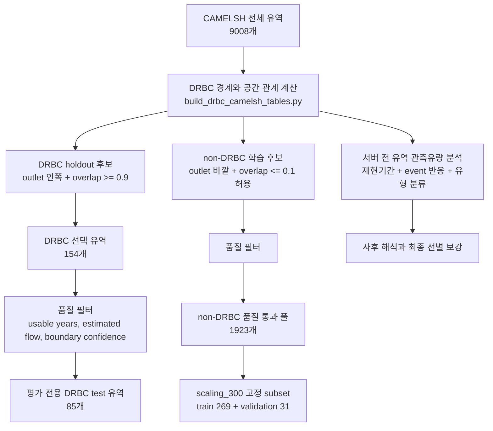
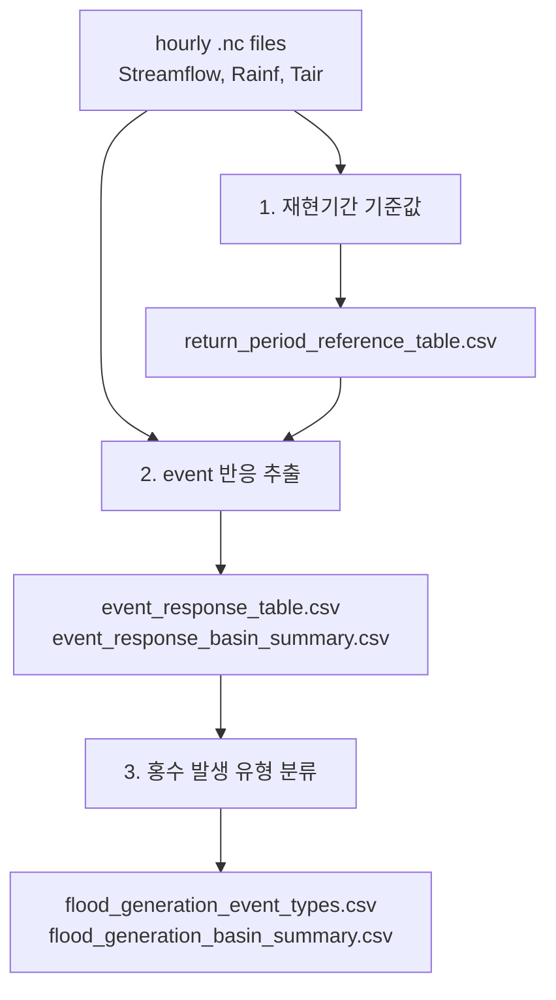
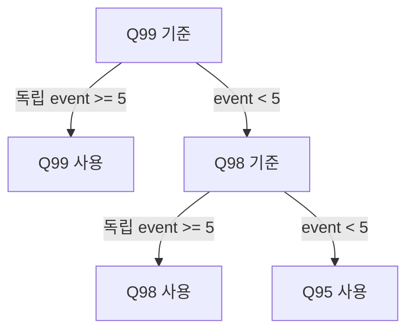
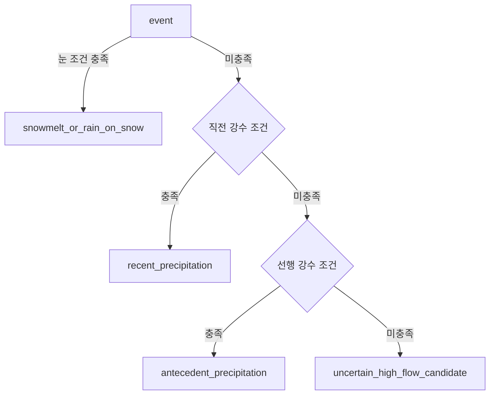

# 05. 유역 분석 방법

유역 분석은 두 질문을 분리한다. 학습 유역을 어디에 둘 것인가, 평가 유역을 어디에 둘 것인가. 현재 기준은 DRBC(Delaware River Basin Commission) 경계 **밖** 유역으로 학습하고, DRBC 경계 **안** 유역에서 평가한다. 학습에 쓰지 않고 채점 전용으로 떼어둔 유역이 holdout(평가 전용 유역)이다.

이 문서는 어떤 유역을 어떤 역할로 쓰는가, 그 기준이 어디에서 정해지는가, 기준값은 무엇인가를 다룬다. 모든 수치와 기준값은 저장소 설정 파일과 산출물에서 확인한 값이다.


```mermaid
flowchart TD
    A["CAMELSH 전체 유역<br/>9008개"] --> B["DRBC 경계와 공간 관계 계산<br/>build_drbc_camelsh_tables.py"]
    B --> C["DRBC holdout 후보<br/>outlet 안쪽 + overlap >= 0.9"]
    B --> D["non-DRBC 학습 후보<br/>outlet 바깥 + overlap <= 0.1 허용"]
    C --> E["DRBC 선택 유역<br/>154개"]
    E --> F["품질 필터<br/>usable years, estimated flow, boundary confidence"]
    F --> G["평가 전용 DRBC test 유역<br/>85개"]
    D --> H["품질 필터"]
    H --> I["non-DRBC 품질 통과 풀<br/>1923개"]
    I --> J["scaling_300 고정 subset<br/>train 269 + validation 31"]
    B --> K["서버 전 유역 관측유량 분석<br/>재현기간 + event 반응 + 유형 분류"]
    K --> L["사후 해석과 최종 선별 보강"]
```

## 구현 위치

위 흐름의 각 단계가 저장소 어디에서 정해지는지 정리한다. 기준값과 의미는 이어지는 절에서 다룬다.

- 공식 study region(연구권역) 경계 파일: `basins/drbc_boundary/drb_bnd_polygon.shp`
- 전체 유역 ↔ DRBC 공간 관계 매핑표: `output/basin/drbc/basin_define/camelsh_drbc_mapping.csv` (생성 스크립트 `scripts/basin/drbc/build_drbc_camelsh_tables.py`)
- non-DRBC 학습 풀 구성: `scripts/basin/all/build_camelsh_non_drbc_training_pool.py`
- 평가 전용 DRBC test 85개 구성: `scripts/basin/drbc/build_drbc_expanded_observed_test_split.py`, 산출 폴더 `configs/basin_splits/drbc_expanded_observed_test/`
- 고정 학습 subset(scaling_300) 구성: `scripts/scaling/build_scaling_pilot_splits.py`, 산출 폴더 `configs/pilot/basin_splits/scaling_300/`

## 기준값 표

유역을 고르고 거르는 임계값. 각 기준의 뜻은 표 아래 상세 절에서 다룬다.

| 심볼/기준 | 변수명 | 범위/값 | 방향/의미 |
| --- | --- | --- | --- |
| outlet 포함 여부 | `outlet_in_drbc` | True / False | True여야 DRBC 후보 |
| 유역면적 겹침 비율 | `overlap_ratio_of_basin` | DRBC 후보 >= 0.9, 학습 풀 <= 0.1 | 클수록 DRBC와 더 많이 겹침 |
| 연 관측 충분 기준 | (연 coverage 임계) | 0.8 | 한 해 관측 시간 비율이 이 이상이어야 "쓸 만한 해" |
| 쓸 만한 관측 연수 | usable years | >= 10년 | 길수록 통계가 안정적 |
| 추정유량 비율 상한 | `FLOW_PCT_EST_VALUES` | <= 15% | 낮을수록 실제 관측이 많음 |
| 유역경계 신뢰도 | `BASIN_BOUNDARY_CONFIDENCE` | >= 7 | 높을수록 경계가 믿을 만함 |
| test 구간 관측 충실도 | (target coverage) | >= 0.8 (80%) | 2014–2016 채점 구간에서 관측이 충분해야 함 |
| event 임계 분위 | Q99 → Q98 → Q95 | 상위 1% → 2% → 5% | event가 적으면 단계적으로 완화 |

### outlet 포함 여부와 겹침 비율 (`outlet_in_drbc`, `overlap_ratio_of_basin`)

`outlet_in_drbc`는 유역의 출구(하천 관측소가 있는 지점, outlet)가 DRBC 경계 안에 있는지를 True/False로 나타낸다. `overlap_ratio_of_basin`은 그 유역의 전체 polygon(평면 도형) 중 DRBC와 겹치는 면적 비율이다. 0이면 전혀 겹치지 않고 1이면 완전히 안에 들어 있다. DRBC 평가 후보는 출구가 안에 있으면서(`outlet_in_drbc == True`) 겹침이 0.9 이상이어야 하고, 학습 후보는 반대로 출구가 밖에 있으면서 겹침이 0.1 이하여야 한다.

### 연 관측 충분 기준과 쓸 만한 관측 연수 (usable years)

한 해 관측 시간 비율(그 해 실제 관측 시간 수 ÷ 그 해 전체 시간 수)이 0.8 이상인 해만 "쓸 만한 해"로 센다. 1시간만 관측돼도 1년으로 세면 품질이 부풀려지기 때문이다. 이렇게 센 해가 10년 이상이어야 통계적으로 믿을 만하다.

### 추정유량 비율 상한 (`FLOW_PCT_EST_VALUES`)

`FLOW_PCT_EST_VALUES`는 측정이 아니라 추정으로 채운 유량의 비율이다. 비율이 높으면 관측 target(모델이 맞혀야 하는 정답값)이 사람이 보정한 값에 가까워져, 모델 성능 차이를 자연 현상으로 해석하기 어렵다. 15%를 넘으면 제외한다.

### 유역경계 신뢰도 (`BASIN_BOUNDARY_CONFIDENCE`)

`BASIN_BOUNDARY_CONFIDENCE`는 GAGES-II가 제공하는 유역 경계 품질 점수다. 유역 polygon이 실제로 그 출구 관측소로 물을 보내는 면적을 잘 대표하는지를 본다. 면적이 공식 drainage area(집수 면적)와 얼마나 맞는지, HUC10(미국 표준 소유역 코드) 경계와 대체로 정합적인지, 관측소 위치가 경계·하천망과 비추어 말이 되는지를 종합한 정성 점수다. 7 이상만 통과시킨다. 원자료는 GAGES-II boundary QA 속성표[^src-boundqa]에 있다.

### test 구간 관측 충실도 (target coverage)

평가 전용 유역은 채점 기간인 2014–2016년에 관측 유량이 충분해야 한다. 이 3년 구간에서 관측 충실도(coverage)가 80% 이상인 유역만 남긴다. 채점 구간에 관측이 듬성듬성하면 점수를 믿기 어렵기 때문이다.

### event 임계 분위 (Q99 → Q98 → Q95)

큰 유량 event를 잡을 때는 그 유역 전체 시간 중 상위 1% 유량(Q99)을 기본 기준선으로 쓴다. 그런데 어떤 유역은 Q99를 넘는 독립 event가 너무 적을 수 있어서, event 수가 부족하면 Q98(상위 2%), 그래도 부족하면 Q95(상위 5%)로 한 단계씩 완화한다.

## 평가 유역 확장: 38개에서 85개

모델 성능을 채점하는 곳은 DRBC 경계 안 유역이다. 처음에는 평가 전용 유역을 적은 수만 썼고, 이후 같은 경계 안에서 조건에 맞는 유역을 더 찾아 최종 **85개**로 늘렸다.

초기 수는 `configs/basin_splits/drbc_expanded_observed_test/summary.json`에 기록돼 있다. 이전 품질 기준 평가 유역 수(`old_quality_test_count`)가 **38개**, 새로 확장한 선택 수(`selected_count`)가 **85개**다. 두 집합은 겹치는 36개를 공유하고, 새 기준에서 49개가 추가됐다(`overlap_with_old_quality_test_count: 36`, `new_vs_old_quality_test_count: 49`).

확장 이유는 표본 안정성이다. 평가 유역이 적으면 모델 우위 결론이 우연히 뽑힌 몇 개 유역에 좌우될 수 있다. 평가 대상을 늘리면 결과가 특정 유역에 휘둘리지 않고 더 다양한 유역에서 모델을 시험한다.

늘어난 유역은 새 데이터가 아니라 원래 DRBC 경계 안에 있으면서 빠져 있던 유역이다. 구성 스크립트의 머리말에도 "기존 subset300 Model 1/2 실행을 위한 test 전용 확장이고, 학습 split은 바꾸지 않는다"고 명시돼 있다. 절차는 DRBC holdout 후보 154개에서 시작해, 메타데이터 품질 기준(추정유량 비율 상한, 유역경계 신뢰도)과 2014–2016 채점 구간 관측 충실도 기준을 함께 적용한다. 두 기준과 위치 조건을 모두 통과한 유역을 시간별 유량 시계열 데이터셋(CAMELSH hourly)과 묶어 최종 평가 세트 85개를 완성한다.

제외 사유도 같은 `summary.json`에 기록돼 있다(`exclusion_reason_counts`). 154개 후보 중 통과 85개, 채점 구간 관측 충실도 80% 미달 제외 55개, 추정유량 비율 15% 초과 제외 9개, 유역경계 신뢰도 7 미만 제외 5개다. 가장 큰 제외 사유는 채점 기간 관측 부족이다.

85개는 DRBC 안 전체 유역이 아니라 자료 품질을 믿을 만한 유역만 추린 결과다. 따라서 결론은 DRBC 전체가 아니라 이 85개 유역에서 확인된 것으로 읽는다.

구현:

- 구성 스크립트: `scripts/basin/drbc/build_drbc_expanded_observed_test_split.py`
- 산출 폴더: `configs/basin_splits/drbc_expanded_observed_test/`

## 학습·검증 유역을 300개로 고정한 근거

학습(train)과 검증(validation)에는 가용 유역 전부를 쓰지 않는다. 조건과 품질 기준을 통과한 학습용 유역 풀(training pool)은 약 **1923개**지만, 실제 학습·검증에는 고정된 **300개**만 쓴다. 이 고정 묶음이 `scaling_300`이며, 학습용 269개와 검증용 31개로 나뉜다(`configs/pilot/basin_splits/scaling_300/train.txt` 269줄, `validation.txt` 31줄, `summary.json`의 `train_count: 269`, `validation_count: 31`과 일치).

300개는 임의 추출이 아니라 전국 범위를 대표하도록 미국 표준 권역 코드(HUC02)별 비율을 맞춰 뽑는다(`summary.json`의 `stratify_col: camelsh_huc02`). `summary.json`에는 권역(`01`, `02`, … `18`)마다 train/validation 유역 수가 적혀 있다.

일부만 쓰는 이유는 두 가지다.

1. 계산 자원과 시간 한계. 1923개 전부로 여러 모델을 학습하면 GPU 계산량과 시간이 과도하다. 감당 가능한 규모로 줄여야 했다.
2. 공정한 비교를 위한 표본 고정. 이 연구는 Model 1(결정론적 LSTM)과 Model 2(확률적 quantile LSTM)를 여러 seed(난수 초기값) `111 / 222 / 444`로 반복 학습해 비교한다. 실험마다 학습 유역이 달라지면 성능 차이가 모델 탓인지 유역 구성 탓인지 구분할 수 없다. 같은 300개 유역으로 모든 실험을 돌려야 차이가 모델 구조에서만 온다.

300개의 전국 대표성은 별도 진단으로 확인했다. 관측유량 event 기준으로 전체 풀과 비교한 표준화 평균차(두 집단 평균이 표준편차 단위로 얼마나 벌어졌는지)가 0.10보다 한참 작았고, 같은 크기 무작위 표본과 비교해도 검증셋 어긋남이 대부분의 무작위 표본보다 작았다. 이 진단을 근거로 300개를 고정 subset으로 채택했다.

이 한계는 결과 해석에 반영해야 한다. 1923개 전부로 학습했다면 모델이 더 다양한 유역을 학습해 결과가 달라졌을 수 있다. 따라서 결론은 전국 모든 유역이 아니라 고정 300개 유역으로 학습한 모델에서 나온 것이며, 일반화 범위(다른 유역에도 그대로 적용된다는 보장)는 그만큼 제한적이다.

구현:

- 구성 스크립트: `scripts/scaling/build_scaling_pilot_splits.py`
- 산출 폴더: `configs/pilot/basin_splits/scaling_300/`

## DRBC holdout 유역 선정

DRBC는 Delaware River Basin Commission의 공식 경계를 기준으로 한다. 기준 파일은 `drb_bnd_polygon.shp`[^src-drbcshp]다. 이 경계와 CAMELSH 전체 9008개 유역의 공간 관계를 계산하는 스크립트가 `build_drbc_camelsh_tables.py`[^src-mapscript]이고, 그 결과 매핑표가 `camelsh_drbc_mapping.csv`[^src-mappingcsv]에 저장된다. 최종 후보만 추린 표는 같은 폴더의 `camelsh_drbc_selected.csv`다.

CAMELSH 유역이 DRBC 평가 후보가 되려면 두 조건을 동시에 만족해야 한다. 첫째, 관측소 출구(outlet)가 DRBC 경계 안에 있어야 한다(`outlet_in_drbc == True`). 둘째, 유역 polygon의 대부분이 DRBC와 겹쳐야 한다(`overlap_ratio_of_basin >= 0.9`).

이 두 조건을 함께 쓰는 이유는 간단하다. 출구만 보면 유역 면적의 큰 부분이 DRBC 밖으로 나갈 수 있고, 겹침 비율만 보면 실제 관측소가 DRBC 밖에 있는 유역이 들어올 수 있다. 그래서 출구를 중심 기준점(공간 anchor, 계산 기준 지점)으로 두고, 겹침 비율을 보조 품질 기준으로 함께 쓴다.

현재 이 기준으로 선택된 DRBC 유역은 154개다. 출구만 기준으로 보면 192개지만, 겹침 기준까지 적용하면 154개로 줄어든다. polygon은 겹치지만 출구가 밖인 경계 사례(edge case)는 61개이며, `camelsh_drbc_intersect_only.csv`에 따로 정리한다.

## 학습용 non-DRBC 유역 선정

모델 학습에는 DRBC와 겹치지 않는 유역을 사용한다. 구성 스크립트는 `build_camelsh_non_drbc_training_pool.py`[^src-poolscript]이고, 산출 목록은 `camelsh_non_drbc_training_selected.csv`[^src-poolcsv], 요약은 같은 폴더의 `camelsh_non_drbc_training_summary.json`이다.

학습 후보의 기본 조건은 출구가 DRBC 밖에 있고(`outlet_in_drbc == False`), 유역 polygon 겹침이 0.1 이하이거나(`overlap_ratio_of_basin <= 0.1`) 아예 겹치지 않는 것이다.

겹침 0.1 이하를 허용하는 이유는 CAMELSH polygon과 DRBC 공식 경계가 서로 다른 출처(source)에서 온 자료라서, 실제로는 다른 유역인데 지도상 아주 조금 겹쳐 보이는 경우가 있기 때문이다. 이런 작은 불일치까지 모두 제거하면 학습 풀이 불필요하게 줄어들 수 있다.

이 위치 조건을 통과한 유역은 약 8800개이고(`tolerant outside`), 여기에 뒤에서 설명할 품질 필터까지 적용하면 품질 통과 학습 유역은 1923개다. 그중 인위적 하천 개조 위험(hydromodification risk, 댐·취수 같은 인공 영향)이 없는 자연 상태 유역만 따로 뽑으면 248개다.

## 품질 필터 (quality gate)

유역이 연구에 들어오려면 단순히 위치만 맞으면 안 된다. 관측 자료가 충분하고, 추정값 비율이 너무 높지 않으며, 유역 경계도 믿을 만해야 한다. 이 세 조건을 모두 통과해야 품질 통과 유역으로 본다.

| 조건 | 변수명 | 기준 | 의미 |
| --- | --- | --- | --- |
| 쓸 만한 관측 연수 | usable years | >= 10년 | 연 관측 충실도 0.8 이상인 해가 10년 이상 |
| 추정유량 비율 | `FLOW_PCT_EST_VALUES` | <= 15% | 추정으로 채운 유량이 너무 많지 않아야 함 |
| 유역경계 신뢰도 | `BASIN_BOUNDARY_CONFIDENCE` | >= 7 | 유역 경계와 관측소 위치가 충분히 믿을 만해야 함 |

세 조건을 모두 만족해야 한다는 점이 중요하다. 하나라도 미달이면 제외된다. 각 변수명의 자세한 뜻은 위 "기준값 한눈 표" 아래 상세 절에서 이미 설명했다.

현재 공식 DRBC test는 평가 전용 기준으로 85개다. 이 85개는 위 메타데이터 품질 필터(추정유량 비율, 유역경계 신뢰도)와 2014–2016 채점 구간 관측 충실도 80% 기준을 함께 통과한 유역이다.

## 정적 유역 특성 분석 (static basin analysis)

정적 유역 특성 분석은 유역의 구조적 배경을 설명하는 단계다. 토지 피복(land cover), 기후(climate), 지형(topography), 토양(soils), 지질(geology), 수문 요약(hydro summary) 같은 정보를 모은다.

예를 들어 큰 강수가 자주 오는지, 경사가 큰지, 하천망이 촘촘한지, 토양이 물을 잘 저장하는지, 산림이나 습지가 많은지를 본다. 이 정보는 "왜 이 유역이 빠르게 반응할 가능성이 있는가"를 설명하는 데 도움을 준다.

하지만 정적 특성만으로 "실제로 홍수가 자주 발생한다"고 단정하면 안 된다. 그래서 정적 분석은 설명과 후보 우선순위 부여에 쓰고, 최종 홍수 취약 유역(flood-prone) 판단은 관측 유량(observed flow) 지표로 확인해야 한다.

## 임시 선별과 최종 선별

현재까지 정적 분석, 유량 품질표(streamflow quality table), 임시 선별(provisional screening)이 준비되어 있다. 임시 선별은 정적 특성을 백분위 순위(percentile rank, 전체 유역 중 몇 % 위치인지)로 바꿔 내부 후보 목록을 만드는 단계다. 이 점수는 논문 본문에서 공식 홍수 취약 점수처럼 쓰기보다, 탐색용 우선순위 지표로 읽어야 한다.

최종 선별은 관측 유량 중심이어야 한다. 실제 시간별 유량에서 연 최대 유량(annual peak), 상위 1% event 빈도(Q99 event frequency), 유량 변동 급격함 지수(RBI, Richards–Baker Flashiness Index), event 유출 계수(event runoff coefficient) 같은 지표를 계산해 유역이 실제로 홍수형 반응(flood-like response)을 보이는지 확인한다. 이 계산은 DRBC 전용 스크립트뿐 아니라, 서버에서 전 유역 `.nc`를 대상으로 돌리는 전 유역 분석 runner로도 수행할 수 있다.

## 재현기간별 강수량과 홍수량

유역 분석에는 재현기간별(return period, 평균적으로 몇 년에 한 번 나타나는 규모인지) 강수량과 홍수량도 참고지표로 넣는 것이 좋다. 다만 `P100`, `Q100`이라고 쓰면 `Q99`와 Model `q99`가 섞여 보일 수 있으므로, 이 프로젝트에서는 `prec_ari100_24h`, `flood_ari100` 같은 이름을 권장한다.

강수량은 지속시간(duration)별로 따로 봐야 한다. 1시간 강한 비와 24시간 누적 비는 유역 반응이 다르기 때문이다. 그래서 `prec_ari100_1h`, `prec_ari100_6h`, `prec_ari100_24h`, `prec_ari100_72h`처럼 나누어 기록한다. `24h`는 대표 예시일 뿐이고, 실제로는 event 반응표(event response table)의 `recent_rain_6h`, `recent_rain_24h`, `recent_rain_72h`와 맞춰 `6h/24h/72h`를 같이 둔다. `1h`는 최대 강우 강도 대용값(peak intensity proxy)과 연결된다.

현재 서버 구현은 CAMELSH hourly record 자체에서 재현기간 기준선을 먼저 만든다. 강수는 지속시간별 누적강수의 water year(수문 연도, 미국에서는 10월~다음 해 9월) 연 최댓값 계열을 쓰고, 홍수량은 water year별 최대 시간 유량을 쓴다. 그 연 최댓값에 기본적으로 Gumbel 분포를 맞춰 `2 / 5 / 10 / 25 / 50 / 100년` 기준선을 계산한다. 이 값은 공식 NOAA Atlas 14 / PFDS나 USGS Bulletin 17C 값이 아니라 `CAMELSH hourly record 기반 근사값(proxy)`이다.

그래서 산출물에는 `flood_ari_source`, `prec_ari_source`, `return_period_confidence_flag`를 같이 남긴다. record가 짧은 유역에서 100년 값을 추정하면 외삽(observed 범위 밖으로 곡선을 늘려 추정)이 크기 때문에, 그 값은 "공식 100년 빈도"라기보다 event 규모를 비교하기 위한 내부 참고선으로 읽어야 한다. 공식 기준값과의 비교가 필요할 때는 reference 비교 폴더[^src-refcomp] 아래의 USGS peak-flow 기준값과 NOAA precipitation 기준값을 CAMELSH 근사값 옆에 두고 읽는다.

이 값들은 모델 성능 지표가 아니라 유역과 event를 설명하는 배경값이다. 예를 들어 어떤 event의 첨두(peak)가 `flood_ari100`에 얼마나 가까운지, event 직전 24시간 강수량이 `prec_ari100_24h` 대비 어느 정도인지 보면, 그 event가 해당 유역에서 얼마나 극단적인 상황이었는지 더 잘 설명할 수 있다.

## event 반응표 (event response table)

event 반응표는 시간별 유량에서 독립적인 큰 유량 event 후보(high-flow event candidate)를 찾아 만든다. 기본 임계는 Q99이고, event 수가 너무 적으면 Q98, 그래도 부족하면 Q95로 완화한다. 서로 너무 가까운 첨두는 하나의 event로 합치며, 기본 분리 간격은 72시간이다.

여기서 중요한 점은 Q99 event가 곧바로 공식 홍수라는 뜻은 아니라는 것이다. Q99는 비 기준이 아니라 관측 유량 기준이므로, 비가 많이 왔지만 유량이 오르지 않은 경우는 잡히지 않는다. 하지만 유량 상위 1%라고 해서 반드시 침수 피해나 공식 홍수 단계(official flood stage) 초과를 뜻하지도 않는다. 그래서 이 프로젝트에서는 먼저 관측 큰 유량 event 후보로 잡고, 나중에 `unit_area_peak`, `peak_to_flood_ari*`, `rising_rate` 같은 값으로 홍수형 심각도를 따로 해석한다.

각 event에서는 첨두 유량(peak discharge), 면적당 첨두(unit-area peak), 상승 시간(rising time), event 지속시간(event duration), 직전 강수(recent rainfall), 선행 강수(antecedent rainfall), 온도(temperature) 같은 값을 계산한다. 이 표는 최종 유역 선별과 홍수 발생 유형 분류(flood generation typing)의 공통 입력이 된다.

재현기간 참고값이 준비되면 event 반응표에 `peak_to_flood_ari100`, `recent_rain_24h_to_prec_ari100_24h` 같은 비율을 붙일 수 있다. 현재 서버 구현은 `100년`뿐 아니라 설정된 재현기간 전체에 대해 `peak_to_flood_ari{period}`와 `recent_rain_{duration}h_to_prec_ari{period}_{duration}h` 형식의 비율을 붙인다. 이렇게 하면 event 자체의 크기뿐 아니라, 그 유역의 참고 극한 규모에 비해 event가 어느 정도였는지도 같이 볼 수 있다.

서버에서 전 유역 분석을 실행할 때는 `.nc` rsync가 끝난 뒤 아래 runner를 사용한다.

```bash
bash scripts/runs/official/run_camelsh_flood_analysis.sh
```

이 runner는 `return_period/`, `event_response/`, `flood_generation/` 하위 폴더를 만들고, 각 단계의 표와 메타데이터를 all-basin 분석 폴더[^src-analysis] 아래에 나누어 저장한다. 기본 worker 수는 `WORKERS=4`이고, 모델 학습과 동시에 돌릴 때만 서버 자원 상황에 맞춰 줄이면 된다.

## Python 알고리즘 전체 흐름

서버 runner는 하나의 큰 Python 프로그램처럼 보이지만, 실제로는 세 개의 분석 단계를 순서대로 실행한다. 첫 번째는 유역마다 재현기간 참고값을 만들고, 두 번째는 시간별 유량에서 큰 유량 event 후보를 잘라 event 표를 만들고, 세 번째는 그 event를 발생 메커니즘별로 분류한다.


```mermaid
flowchart TD
    A["hourly .nc files<br/>Streamflow, Rainf, Tair"] --> B["1. 재현기간 기준값"]
    B --> C["return_period_reference_table.csv"]
    A --> D["2. event 반응 추출"]
    C --> D
    D --> E["event_response_table.csv<br/>event_response_basin_summary.csv"]
    E --> F["3. 홍수 발생 유형 분류"]
    F --> G["flood_generation_event_types.csv<br/>flood_generation_basin_summary.csv"]
```

이 구조에서 중요한 점은 모델 예측값을 쓰지 않는다는 것이다. 여기서 분석하는 것은 관측된 Streamflow와 forcing(모델 입력 기상 자료)이다. 따라서 이 단계의 결과는 Model 1 / Model 2 중 누가 더 좋은지를 직접 말하는 표가 아니라, 나중에 모델 결과를 해석하기 위한 배경 지도에 가깝다.

## 1단계: 재현기간 기준값 알고리즘

첫 번째 Python script는 `build_camelsh_return_period_references.py`다(`scripts/basin/all/` 폴더). 이 script의 목표는 유역마다 "이 유역에서 어느 정도면 큰 강수인가", "어느 정도면 큰 홍수량인가"를 비교할 기준선을 만드는 것이다.

Python은 먼저 `time_series` 폴더에서 `.nc` 파일 이름을 읽어 유역 목록을 만든다. 예를 들어 `01042500.nc`가 있으면 관측소 ID를 `01042500`으로 본다. 그다음 CAMELSH 메타데이터와 정적 속성을 붙여서 유역 이름, 주, 면적, 적설 비율(snow fraction) 같은 정보를 함께 들고 간다.

각 유역에 대해 Python이 하는 일은 다음과 같다.

1. `.nc` 파일에서 `Streamflow`와 `Rainf`를 읽는다.
2. 시간을 water year 기준으로 묶는다. 미국 수문학에서는 10월부터 다음 해 9월까지를 한 water year로 본다.
3. 각 water year에서 유량의 최댓값을 하나 뽑는다. 이것이 연 최대 유량 계열이다.
4. 강수는 먼저 `1h`, `6h`, `24h`, `72h` 누적합을 만든다. 그런 뒤 각 지속시간마다 water year별 최댓값을 뽑는다.
5. 관측 충실도가 너무 낮은 해는 빼고, 남은 연 최댓값에 Gumbel 분포를 맞춘다.
6. 맞춘 분포에서 `2 / 5 / 10 / 25 / 50 / 100년` 재현 수준을 계산한다.

쉽게 말하면, Python은 유역마다 "매년 가장 컸던 값들만 모은 짧은 리스트"를 만들고, 그 리스트의 꼬리를 부드러운 곡선으로 이어서 100년 수준까지 추정한다. 그래서 이 값은 공식 NOAA/USGS 값이 아니라 근사값이다. 특히 record가 10년밖에 없는데 100년 값을 계산하면 꽤 멀리 외삽하는 것이므로, `return_period_confidence_flag`를 꼭 같이 봐야 한다.

이 단계의 해석은 조심해야 한다. `flood_ari100`이 크다고 해서 그 유역이 무조건 위험하다는 뜻은 아니다. 큰 유역은 원래 유량 규모가 클 수 있기 때문이다. 그래서 면적당 첨두, event 빈도, 변동 급격함 같은 다른 지표와 같이 읽어야 한다.

## 2단계: event 반응표 알고리즘

두 번째 Python script는 `build_camelsh_event_response_table.py`다(`scripts/basin/all/` 폴더). 이 script의 목표는 긴 시간별 유량 시계열에서 큰 유량 event 후보를 골라내고, event마다 "얼마나 컸고, 얼마나 빨리 올랐고, 직전에 비가 얼마나 왔는지"를 숫자로 정리하는 것이다.

가장 먼저 Python은 유역마다 큰 유량 임계값을 고른다. 기본은 그 유역의 hourly Streamflow `Q99`다. 여기서 `Q99`는 전체 시간 중 상위 1%에 해당하는 유량 기준값이다. 그런데 어떤 유역은 Q99를 넘는 독립 event가 너무 적을 수 있다. 그래서 Python은 다음 순서로 완화한다.


```mermaid
flowchart TD
    A["Q99 기준"] -->|독립 event >= 5| B["Q99 사용"]
    A -->|event < 5| C["Q98 기준"]
    C -->|독립 event >= 5| D["Q98 사용"]
    C -->|event < 5| E["Q95 사용"]
```

이렇게 하는 이유는 극한 event를 보고 싶지만, event가 1개나 2개뿐이면 유역을 요약하기 어렵기 때문이다. 즉 임계를 너무 낮추지는 않되, 최소한 해석 가능한 event 수를 확보하려는 타협이다. 다만 이 단계의 결과는 홍수 확정 목록이 아니라 관측 유량이 크게 반응한 후보 목록으로 읽어야 한다.

임계가 정해지면 Python은 유량이 임계를 넘는 연속 구간을 찾는다. 한 구간 안에서 가장 높은 시점을 첨두 후보로 둔다. 그런데 홍수 수문곡선(hydrograph)은 하루 이틀 사이에 여러 번 출렁일 수 있어서, 가까운 첨두를 모두 별도 event로 세면 event 수가 과장된다. 그래서 첨두 사이가 72시간보다 짧으면 하나의 event 묶음(cluster)으로 합치고, 그 안에서 가장 큰 첨두만 대표 첨두로 남긴다.

대표 첨두가 정해지면 event 시작과 끝을 정한다. 시작은 첨두 전으로 거슬러 올라가며 유량이 임계 아래로 마지막으로 내려간 시점이다. 끝은 첨두 뒤로 가면서 다시 임계 아래로 내려간 첫 시점이다. 이렇게 하면 event 경계가 강수 기준이 아니라 유량 반응 기준으로 잡힌다. 이 연구의 관심이 홍수 첨두 과소추정(flood peak underestimation)이기 때문에, 첨두 중심 event 정의가 더 자연스럽다.

각 event에 대해 Python은 다음 값을 계산한다.

| 계산값 | 의미 | 비고: 왜 필요한가 |
| --- | --- | --- |
| `peak_discharge` | event에서 가장 큰 유량 | 이 연구의 핵심 관심인 홍수 첨두 자체다. 모델이 홍수 첨두를 얼마나 과소추정하는지 비교할 때 기준값으로 쓴다. |
| `unit_area_peak` | 첨두 유량을 유역 면적으로 나눈 값 | 유역 크기가 다르면 큰 유역일수록 유량이 커 보일 수 있다. 면적으로 나누면 작은 유역과 큰 유역의 홍수 반응을 더 공정하게 비교할 수 있다. |
| `rising_time_hours` | event 시작부터 첨두까지 걸린 시간 | 유량이 천천히 오르는 유역인지, 짧은 시간에 급격히 오르는 유역인지 구분할 수 있다. 급상승 event는 LSTM이 timing과 첨두를 놓치기 쉬운지 확인하는 데 중요하다. |
| `event_duration_hours` | event 전체가 지속된 시간 | 짧고 날카로운 홍수인지, 오래 지속되는 홍수인지 구분한다. 같은 첨두라도 지속시간이 다르면 발생 메커니즘과 모델 난이도가 달라진다. |
| `rising_rate` | 유량이 얼마나 빠르게 올라갔는지 | 변동 급격함을 직접 보여주는 값이다. 상승률이 크면 홍수 반응이 급해서 결정론적 모델의 첨두 과소추정이 더 심한지 해석할 수 있다. |
| `recent_rain_6h/24h/72h` | 첨두 직전 짧은 기간에 내린 비 | 직전 강수가 첨두를 만든 직접 원인인지 확인하는 값이다. 짧은 시간 강우로 생긴 홍수를 찾고, 강한 비에 대한 모델 반응을 따로 평가할 수 있다. |
| `antecedent_rain_7d/30d` | event 전에 유역이 얼마나 젖어 있었는지 보는 누적 비 | 같은 비가 와도 이미 젖어 있는 유역은 더 큰 홍수가 날 수 있다. 토양 수분 대용값으로 사용해 선행 조건이 만든 홍수를 해석한다. |
| `event_mean_temp`, `antecedent_mean_temp_7d` | 눈 녹음이나 비-위-눈(rain-on-snow) 가능성을 해석하기 위한 온도 | 겨울철 또는 저온 조건에서 발생한 홍수가 단순 강수만이 아니라 눈 녹음과 관련될 수 있는지 보는 보조 정보다. 눈 영향 유역에서 모델 성능 차이를 해석할 때 필요하다. |

재현기간 참고값이 이미 있으면 Python은 event마다 비율도 붙인다. 예를 들어 `peak_to_flood_ari100 = event 첨두 / flood_ari100`이다. 이 값이 0.8이면, 그 event 첨두가 이 유역의 100년 홍수 근사값의 80% 정도였다는 뜻이다. `recent_rain_24h_to_prec_ari100_24h`도 비슷하게, event 직전 24시간 강수가 100년 24시간 강수 근사값에 얼마나 가까웠는지 보여준다.

이 비율이 있으면 Python은 `flood_relevance_tier`(홍수 관련 단계)도 붙인다. 예를 들어 재현기간 근사값을 계산할 수 없으면 `high_flow_candidate_unrated`, 2년 홍수 근사값보다 작으면 `high_flow_below_2yr_proxy`, 2년 이상이면 `flood_like_ge_2yr_proxy`처럼 표시한다. 이 라벨도 공식 홍수 인증은 아니고, Q99 후보 중 어떤 event가 더 홍수형인지 해석하기 위한 보조 표지다.

그래서 최종 분석에서는 event를 한 묶음으로만 보지 않는다. `Q99-only` event만 봤을 때도 결론이 유지되는지, Q98/Q95 완화까지 포함해도 결론이 유지되는지, 그리고 `return_period_confidence_flag`가 낮은 유역을 제외해도 방향이 비슷한지 확인한다. 이 확인의 목적은 "이 event들이 모두 진짜 홍수다"를 증명하는 것이 아니라, 임계 선택 때문에 Model 1과 Model 2 비교 결론이 흔들리지 않는지 확인하는 것이다.

## 3단계: 유역 요약 알고리즘

event 표는 한 행이 event 하나라서, 유역 하나에 event가 수십 개씩 들어갈 수 있다. 그래서 Python은 유역별 요약표도 만든다. 이것이 `event_response_basin_summary.csv`다.

이 요약표에서는 event 수, 연 최대 유량 발생 연도, Q99 event 빈도, RBI, 면적당 첨두 중앙값, 상승 시간 중앙값, event 지속시간 중앙값 같은 값을 계산한다. 예를 들어 `q99_event_frequency`가 높으면 그 유역은 상위 1% 수준의 큰 유량 event가 비교적 자주 나타난다는 뜻이다. `rbi`가 높으면 유량이 급하게 오르내리는 경향이 강하다는 뜻이다.

여기서 해석은 한 가지 지표만 보면 안 된다. 연 최대 유량이 크지만 event 빈도가 낮은 유역은 드물게 큰 홍수가 오는 곳일 수 있다. 반대로 event 빈도와 RBI가 모두 높으면 자주 빠르게 반응하는 유역일 가능성이 크다. 그래서 최종 선별에서는 여러 관측 유량 지표를 같이 본다.

## 홍수 발생 유형 분류 (flood generation typing)

홍수 발생 유형 분류는 먼저 event를 분류하고, 그 결과를 유역 수준으로 모으는 방식이다. 같은 유역에서도 어떤 event는 짧고 강한 비 때문에 생기고, 어떤 event는 며칠 동안 누적된 비나 눈 녹음 때문에 생길 수 있기 때문이다.

현재 event 유형은 `recent_precipitation`(직전 강수), `antecedent_precipitation`(선행 강수), `snowmelt_or_rain_on_snow`(눈 녹음 또는 비-위-눈), `uncertain_high_flow_candidate`(메커니즘 불확실)다. 이 분류는 학습 전에 유역을 제외하는 용도가 아니라, 모델 결과를 나중에 해석할 때 "어떤 홍수 메커니즘에서 Model 2가 더 도움이 되는가"를 보기 위한 층이다. 구현은 1°C 일도(degree-day) 눈 녹음 근사와 유역별 강수 p90(상위 10% 경계) 규칙을 쓰며, event별 라벨을 만든 뒤 유역별 우세 유형(dominant type) 또는 혼합 유역(mixture basin)으로 요약한다.

Python script 이름은 `build_camelsh_flood_generation_typing.py`다(`scripts/basin/all/` 폴더). 이 script는 event 반응표를 다시 읽고, 먼저 눈 관련 조건을 평가한 뒤 직전 강수와 선행 강수 조건을 평가한다.

`snowmelt_or_rain_on_snow`는 유량 모양만 보고 찍지 않는다. hourly `Rainf`와 `Tair`를 daily로 바꾸고, `Tair <= 1°C`이면 눈으로 저장하고, `Tair > 1°C`이면 `2.0 mm/day/°C` 일도 계수로 눈 녹음을 계산한다. 그다음 event 첨두 날짜를 포함한 7일 동안의 비와 눈 녹음 비율을 본다.

`rain_snowmelt_proxy`는 7일 물 입력이 있고, 눈 녹음이 최소 1 mm 이상이며, 눈 녹음 비율과 비 비율이 각각 1/3 이상일 때 붙는다. 즉 비와 눈 녹음이 둘 다 의미 있게 들어온 event를 잡으려는 조건이다.

`snowmelt_proxy`는 세 조건을 모두 만족해야 한다. `degree_day_snowmelt_7d`가 그 유역의 눈 녹음 7일 이동창 p90 이상이고, 동시에 최소 1 mm 이상이며, 그 p90을 계산할 유효 melt window가 10개 이상 있어야 한다. 이렇게 AND 조건으로 둔 이유는 작은 수치 잡음이나 눈이 거의 없는 유역을 눈 녹음 event로 잘못 분류하지 않기 위해서다.

눈 분기 전체는 OR이다. `rain_snowmelt_proxy`이거나 `snowmelt_proxy`이면 event 유형은 `snowmelt_or_rain_on_snow`가 된다. 단, 이것은 적설 관측(SWE)으로 눈 녹음을 확정한 것이 아니라 온도와 강수로 만든 일도 눈 녹음 근사값이다.

눈 분기에 걸리지 않으면 비 분기를 본다. `recent_rain_24h`나 `recent_rain_72h`가 유역별 양의 강수 p90 이상이면 `recent_precipitation` 후보가 된다. `antecedent_rain_7d`나 `antecedent_rain_30d`가 유역별 p90 이상이면 `antecedent_precipitation` 후보가 된다.

직전과 선행이 동시에 조건을 만족하면, 각 강수가 자기 p90에 비해 얼마나 큰지 비율을 비교해 더 큰 쪽을 고른다. 차이가 10% 미만이면 `low_confidence_type_flag=True`를 남긴다.


```mermaid
flowchart TD
    A["event"] -->|눈 조건 충족| B["snowmelt_or_rain_on_snow"]
    A -->|미충족| C{"직전 강수 조건"}
    C -->|충족| D["recent_precipitation"]
    C -->|미충족| E{"선행 강수 조건"}
    E -->|충족| F["antecedent_precipitation"]
    E -->|미충족| G["uncertain_high_flow_candidate"]
```

여기서 `uncertain_high_flow_candidate`는 event가 중요하지 않다는 뜻이 아니다. 관측 큰 유량 event 후보는 맞지만, 지금 가진 CAMELSH 강수/온도 근사값만으로 발생 메커니즘을 안전하게 특정하지 못했다는 뜻이다.

마지막으로 유역별 요약을 만든다. 어떤 유역에서 직전 강수 event가 70%라면 그 유역은 직전 강수 우세 유역으로 볼 수 있다. 현재 기준은 특정 유형 비율이 0.6 이상이면 우세, 아니면 혼합이다. 예를 들어 가장 많은 유형이 54%라면 1등 유형은 기록하지만 유역 라벨은 혼합으로 둔다. 하나의 유역에서도 여러 방식의 큰 유량 event가 생길 수 있기 때문이다.

## Python 결과 해석

이 알고리즘의 결과는 정답 라벨이 아니라 일관된 규칙으로 만든 해석용 라벨이다. 특히 홍수 발생 유형 분류는 사람이 납득할 수 있는 규칙 기반 점수로 시작한 것이지, 모든 event의 실제 물리 메커니즘을 완벽하게 판정한다는 뜻은 아니다.

따라서 해석할 때는 아래처럼 읽는 것이 안전하다.

| 산출물 | 해석 방법 |
| --- | --- |
| `return_period_reference_table.csv` | 유역별 극한 강수와 홍수 규모를 비교하기 위한 참고선이다. 공식 빈도 자료가 아니라 출처(source)와 신뢰도 표시(confidence flag)를 같이 본다. |
| `event_response_table.csv` | 관측 큰 유량 event 후보 단위로 첨두, 강수, 지속시간, 온도를 보는 표다. 공식 홍수 목록이 아니라 모델 평가의 event 기준과 연결하기 좋은 후보 표다. |
| `event_response_basin_summary.csv` | 유역별 관측 유량 성격을 요약한다. 최종 선별에서 정적 점수보다 더 중요한 근거가 된다. |
| `flood_generation_event_types.csv` | event별 발생 메커니즘 근사 라벨이다. 현재 기본값은 1°C 일도 눈 녹음 근사 기반이므로, 눈 유형은 확정 눈 녹음이 아니라 근사 분류로 읽는다. |
| `flood_generation_basin_summary.csv` | 유역이 특정 유형에 치우치는지, 아니면 혼합인지 보여준다. 유형별 구분 평가에 쓴다. |

예를 들어 어떤 유역이 `recent_precipitation` 우세이고, Model 2가 그 유역의 첨두 과소추정을 Model 1보다 크게 줄였다면, 우리는 "확률적 출력층이 짧고 강한 강수로 생기는 빠른 첨두에서 특히 도움이 될 수 있다"고 해석할 수 있다. 반대로 `snowmelt_or_rain_on_snow` event에서 개선이 작다면, 단순 출력층보다 눈 저장이나 timing을 더 직접적으로 다루는 후속 모델이 필요하다는 근거가 될 수 있다.

이렇게 Python 알고리즘은 유역을 고르는 도구이면서, 나중에 모델 결과를 설명하는 해석 도구이기도 하다. 중요한 것은 단일 숫자 하나로 유역을 판단하지 않고, 공간 규칙, 품질 필터, 관측 유량 반응, 재현기간 근사값, 발생 유형 분류를 층층이 쌓아서 해석한다는 점이다.

[^src-boundqa]: `basins/CAMELSH_data/attributes/attributes_gageii_Bound_QA.csv`
[^src-drbcshp]: `basins/drbc_boundary/drb_bnd_polygon.shp`
[^src-mapscript]: `scripts/basin/drbc/build_drbc_camelsh_tables.py`
[^src-mappingcsv]: `output/basin/drbc/basin_define/camelsh_drbc_mapping.csv`
[^src-poolscript]: `scripts/basin/all/build_camelsh_non_drbc_training_pool.py`
[^src-poolcsv]: `output/basin/all/screening/training_non_drbc/camelsh_non_drbc_training_selected.csv`
[^src-refcomp]: `output/basin/all/reference_comparison/`
[^src-analysis]: `output/basin/all/analysis/`
