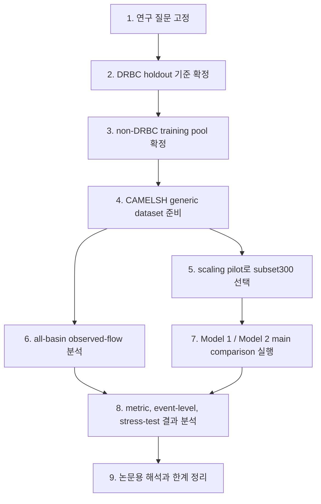

# 06. 연구 과정

이 연구는 모델부터 바로 돌리는 방식이 아니라, 유역과 데이터의 기준을 먼저 고정한 뒤 모델 비교로 들어간다. 수문 모델 연구에서는 어떤 유역을 학습에 넣고 어떤 유역을 평가에 둘지에 따라 결과 해석이 크게 달라지기 때문이다.

## 1단계: 연구 질문 고정

가장 먼저 고정한 질문은 "deterministic LSTM의 extreme flood underestimation이 probabilistic quantile output만으로 얼마나 줄어드는가"다.

이 질문을 깨끗하게 보려면 모델을 많이 바꾸면 안 된다. 그래서 backbone은 LSTM으로 고정하고, Model 1과 Model 2 사이에서 바꾸는 것은 head와 loss 중심으로 제한한다.

## 2단계: DRBC holdout 기준 확정

DRBC는 학습 지역이 아니라 holdout 평가 지역이다. DRBC 공식 경계와 CAMELSH outlet, basin polygon overlap을 이용해 평가 후보를 고른다.

현재 DRBC selected basin은 154개이고, 품질 gate를 통과한 test basin은 38개다. 이 구조 덕분에 모델이 학습 중 보지 않은 지역에서 얼마나 잘 작동하는지 확인할 수 있다.

## 3단계: non-DRBC training pool 확정

학습용 basin은 DRBC 밖에서 고른다. outlet가 DRBC 밖에 있고, polygon overlap이 0.1 이하이거나 겹치지 않는 basin을 후보로 둔다. 여기에 관측 품질과 경계 신뢰도 기준을 적용해 quality-pass training pool을 만든다.

현재 raw non-DRBC broad pool은 1923개다. 다만 실제 학습에는 compute 제약이 있으므로, 이 전체 pool을 바로 쓰기보다 scaling pilot을 거쳐 main comparison용 non-DRBC train/validation basin 수를 300개 subset, 즉 `scaling_300`으로 정했다.

## 4단계: CAMELSH generic dataset 준비

모델이 읽을 수 있도록 CAMELSH 자료를 NeuralHydrology generic dataset 형태로 정리한다. 이 단계에서 dynamic forcing, static attributes, target Streamflow, split 파일이 맞물려야 한다.

준비된 dataset은 `data/CAMELSH_generic/drbc_holdout_broad/` 아래에 둔다. 생성 산출물과 학습 결과는 `output/`, `runs/`, `tmp/`처럼 gitignored 디렉토리에 둔다.

이 dataset의 hourly `.nc` 파일은 모델 학습에도 쓰이고, 유역 분석에도 쓰인다. 따라서 rsync가 끝난 뒤 같은 `.nc`를 이용해 재현기간 reference, event response table, flood generation typing을 만들 수 있다.

## 5단계: scaling pilot

Scaling pilot은 본 실험이 아니라 운영 결정용 실험이다. basin 수를 100, 300, 600으로 줄여 deterministic Model 1을 돌려 보고, 계산 비용과 대표성을 함께 판단했다.

현재 채택된 main comparison subset은 `scaling_300`이다. 이 선택은 DRBC test 성능으로 고른 것이 아니라, non-DRBC validation 성능, static attribute 분포, observed-flow event-response 분포, random same-size subset benchmark, compute cost를 함께 보고 정했다.

중요한 원칙은 한 번 선택한 subset을 seed와 모델마다 다시 바꾸지 않는 것이다. 현재 final comparison은 Model 1과 Model 2 모두 seed `111`, `222`, `444`가 같은 `scaling_300` basin file을 재사용한다. Model 2 seed `333`은 NaN loss로 중단되었고, 공정한 paired-seed 비교를 위해 완료된 Model 1 seed `333`도 final aggregate에서 제외한다.

## 6단계: all-basin observed-flow 분석

모델 학습과 별개로, 전 유역 hourly 시계열에서 observed-flow 분석을 수행한다. 이 단계는 모델이 만든 예측이 아니라 실제 관측 유량과 forcing으로 basin의 홍수 반응을 설명하는 과정이다.

현재 서버 실행 진입점은 `scripts/runs/official/run_camelsh_flood_analysis.sh`다. 이 runner는 먼저 CAMELSH hourly record 기반 Gumbel annual-maxima proxy로 `return_period_reference_table.csv`를 만들고, 그다음 POT 방식의 `event_response_table.csv`를 만든 뒤, 마지막으로 flood generation typing을 수행한다. 기본 worker 수는 `4`이고, 모델 학습과 동시에 돌릴 때는 서버 자원 상황에 맞춰 줄일 수 있다.

이 단계의 산출물은 `output/basin/all/analysis/` 아래에 저장된다. 긴 실행이므로 return-period 단계와 event-response 단계에는 progress bar가 출력된다.

## 7단계: Model 1과 Model 2 실행

공식 비교는 Model 1과 Model 2를 같은 조건에서 실행한다. 입력 변수, 시간 구간, LSTM 크기, optimizer, batch size, epoch 수, train/validation/test basin file을 맞춘다.

같게 맞춘 조건은 아래처럼 정리할 수 있다.

| 맞춘 항목 | 공통 설정 | 왜 맞추는가 |
| --- | --- | --- |
| 데이터셋 | CAMELSH hourly generic dataset | 두 모델이 같은 자료를 보고 배워야 output head 차이만 비교할 수 있다. |
| basin split | `scaling_300` train/validation basin file과 DRBC test basin file | Model 1과 Model 2가 서로 다른 유역에서 평가되면 비교가 흔들리기 때문이다. |
| 시간 구간 | train 2000-2010, validation 2011-2013, test 2014-2016 | 같은 기간의 기후와 event 조건에서 비교하기 위해서다. |
| 입력 변수 | 같은 dynamic forcing과 static attributes, lagged Q 미사용 | 한 모델만 더 강한 입력을 받지 않게 하기 위해서다. |
| 예측 대상 | `Streamflow` | 두 모델 모두 같은 하천 유량을 맞히는 문제를 풀어야 한다. |
| LSTM backbone | `cudalstm`, `hidden_size=128`, `seq_length=336`, `predict_last_n=24` | 모델 용량과 기억 길이가 같아야 head 효과를 분리할 수 있다. |
| 학습 설정 | `Adam`, 같은 learning rate schedule, subset300 actual run 기준 `batch_size=384`, `epochs=30` | 학습 방법 차이가 결과 차이로 섞이지 않게 하기 위해서다. |
| 반복 실행 | Model 1 / Model 2 모두 seed `111`, `222`, `444` | seed 하나의 우연한 결과가 결론이 되지 않게 하기 위해서다. Model 2 seed `333`은 NaN loss로 실패했고, Model 1 seed `333`도 paired-seed fairness를 위해 final aggregate에서 제외한다. |
| 평가 방식 | 같은 validation/test 기준과 같은 metric set | 성능을 재는 잣대가 같아야 공정한 비교가 된다. |

두 모델 사이에서 핵심적으로 달라지는 것은 다음이다.

| 항목 | Model 1 | Model 2 |
| --- | --- | --- |
| head | regression | quantile |
| loss | nse | pinball |
| output | `Q_hat` | `q50`, `q90`, `q95`, `q99` |

이렇게 해야 결과 차이를 "출력 설계의 차이"로 해석할 수 있다.

## 8단계: 결과 분석

결과 분석은 전체 성능과 홍수 성능을 분리해서 본다. 전체 성능은 NSE, KGE, NSElog를 보고, 홍수 성능은 FHV, Peak Relative Error, Peak Timing Error, top 1% flow recall, event-level RMSE를 본다.

Model 2는 probabilistic model이므로 coverage, calibration, pinball loss도 추가로 본다. 지금은 one-sided coverage와 `q95-q50`, `q99-q50` 같은 upper-tail gap은 계산되어 있고, quantile별 pinball/AQS와 formal calibration table은 별도 예정 분석으로 남아 있다.

현재는 여기에 두 가지 보조 분석이 더 붙었다. 하나는 DRBC test 전체 기간의 hydrograph를 모든 validation checkpoint에서 다시 보는 분석이고, 다른 하나는 hourly `Rainf`에서 극한호우 event를 직접 뽑아 historical stress test를 하는 분석이다. 첫 번째는 "큰 유량 시간대에서 q95/q99가 도움이 되는가"를 보고, 두 번째는 "100년급에 가까운 비가 실제로 왔을 때 모델이 유량 첨두를 따라가는가"를 본다.

극한호우 stress test는 primary 결과와 all-validation-epoch sensitivity 결과를 나누어 저장한다. Primary 결과는 `output/model_analysis/extreme_rain/primary/`이고, validation checkpoint grid 전체 결과는 `output/model_analysis/extreme_rain/all/`다. 두 번째 결과는 대표 epoch를 다시 고르기 위한 것이 아니라, 결론이 특정 checkpoint에만 의존하는지 확인하기 위한 것이다.

## 9단계: 해석과 후속 연구

Model 2가 peak underestimation을 줄이면서 전체 성능을 유지한다면, 첫 번째 결론은 output design이 중요한 병목이었다는 것이다.

반대로 첨두 높이는 나아졌지만 timing error가 남거나, 특정 basin type에서 여전히 약하다면 그 지점이 후속 연구의 출발점이 된다. 이때 physics-guided core는 future work로 자연스럽게 이어진다.

## 현재 진행 상태 요약

문서 기준으로 연구 설계, basin 기준, Model 1/2 config, subset300 main comparison runner는 준비되어 있다. paired seed `111 / 222 / 444` 기준 hydrograph 분석, event-regime 분석, primary extreme-rain stress test, all-validation-epoch sensitivity 산출물도 생성되어 있다.

남은 큰 일은 all-validation-epoch stress-test 결과를 논문용 compact figure로 정리하고, representative event plot을 고른 뒤, formal calibration/pinball 진단과 Natural subset robustness를 예정 분석으로 닫는 것이다.
