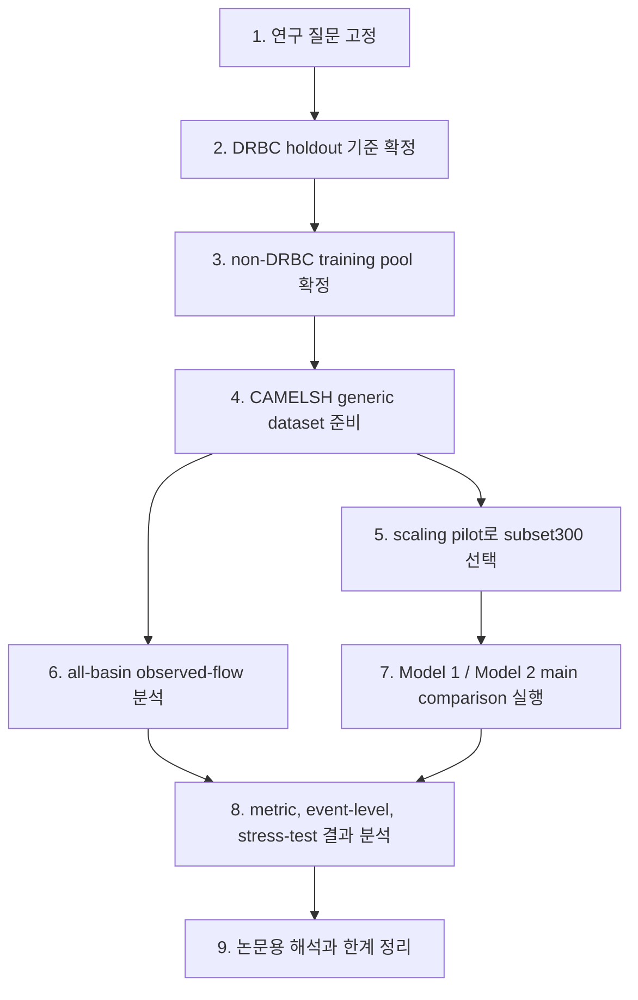

# 06. 연구 과정

이 연구는 모델부터 돌리지 않는다. 학습 유역과 평가 유역, 그리고 자료 형태를 모두 고정한 뒤에 모델 비교로 들어간다. 평가 유역 구성이 조금만 흔들려도 결과 해석이 크게 달라지기 때문이다. 같은 모델이라도 평가에 쉬운 유역만 넣으면 성능이 좋아 보이고 어려운 유역만 넣으면 나빠 보인다. 비교의 잣대를 먼저 고정하는 일이 모델 실행보다 앞선다.

전체 흐름은 두 갈래다. 모델을 학습하고 비교하는 갈래, 그리고 모델과 무관하게 관측 유량으로 유역 홍수 반응을 설명하는 갈래. 두 갈래는 마지막 결과 분석에서 다시 만난다.

```mermaid
flowchart TD
    A["1. 연구 질문 고정"] --> B["2. DRBC holdout 기준 확정"]
    B --> C["3. non-DRBC training pool 확정"]
    C --> D["4. CAMELSH generic dataset 준비"]
    D --> E["5. scaling pilot로 subset300 선택"]
    D --> F["6. all-basin observed-flow 분석"]
    E --> G["7. Model 1 / Model 2 main comparison 실행"]
    F --> H["8. metric, event-level, stress-test 결과 분석"]
    G --> H
    H --> I["9. 논문용 해석과 한계 정리"]
```

용어 두 개를 먼저 정리한다. **DRBC**는 Delaware River Basin Commission이 관리하는 강 유역 영역으로, 모델이 학습 중 보지 않는 평가 전용 지역이다. **holdout**은 학습에 쓰지 않고 평가용으로만 남겨 두는 자료다. DRBC 유역은 모델에게 처음 보는 시험 문제다.

## 1단계: 연구 질문 고정

가장 먼저 고정한 질문은 "단일 예측값을 내는 LSTM(시간 순서가 있는 자료를 읽는 신경망)이 큰 홍수의 첨두 유량을 자꾸 낮게 잡는 문제(극한 홍수 첨두 과소추정)를, 출력 방식만 확률형으로 바꾸면 얼마나 줄일 수 있는가"다.

이 질문을 깨끗하게 보려면 모델에서 동시에 여러 가지를 바꾸면 안 된다. 한 번에 여러 곳을 바꾸면, 성능이 달라졌을 때 그 차이가 어느 변경 때문인지 알 수 없게 된다. 그래서 모델의 몸통(backbone)은 LSTM으로 똑같이 두고, Model 1과 Model 2 사이에서 바꾸는 부분을 **마지막 출력층(head)과 학습 기준(loss) 중심으로만** 제한한다. Model 1은 유량을 하나로 내는 회귀형, Model 2는 여러 높이의 유량선을 함께 내는 확률형이다. 이렇게 차이를 한 곳에 몰아 두어야, 나중에 생기는 성능 차이를 "출력 설계의 차이"로 해석할 수 있다.

## 2단계: DRBC holdout 기준 확정

DRBC는 학습 지역이 아니라 평가 전용(holdout) 지역이다. 어떤 유역을 평가에 넣을지는 사람 손으로 임의로 고르지 않고, 공식 경계 자료와 유역 자료를 겹쳐 보는 규칙으로 정한다.

판단 기준은 두 가지다. 하나는 유역의 출구(outlet, 그 유역의 물이 최종적으로 빠져나가는 하천 지점)가 DRBC 공식 경계 안에 있는지이고, 다른 하나는 유역 면적이 DRBC 경계와 얼마나 겹치는지(overlap, 겹침 비율)다. 출구가 DRBC 안에 있고 겹침 비율이 0.9 이상인 유역을 DRBC holdout 후보로 본다.

이 기준으로 만든 DRBC holdout 유역은 현재 154개이고, 그중 관측 유량 품질까지 통과해 실제 평가에 쓰는 유역은 85개다. 두 단계(겹침 기준 → 관측 품질 기준)를 거치는 이유는 위치만 맞는 유역이 아니라 관측값이 믿을 만한 유역에서만 모델을 채점하기 위해서다.

구현:

- DRBC 분할 생성: `scripts/basin/drbc/build_drbc_holdout_split_files.py`
- 평가 유역 확정: `scripts/basin/drbc/build_drbc_expanded_observed_test_split.py`
- 확정 평가 유역 목록: `configs/basin_splits/drbc_expanded_observed_test/test.txt`

## 3단계: non-DRBC training pool 확정

학습용 유역은 DRBC 바깥(non-DRBC)에서 고른다. 평가 지역과 학습 지역이 섞이면 모델이 시험 문제를 미리 외워 버리는 셈이 되므로, 둘을 철저히 분리하는 것이 핵심이다.

학습 후보는 유역 출구가 DRBC 경계 밖에 있고, 면적 겹침이 0.1 이하이거나 아예 겹치지 않는 유역으로 둔다. 여기에 관측 유량의 품질과 경계의 신뢰도 기준을 추가로 적용해, 품질을 통과한 유역만 모은 학습 후보 묶음(training pool)을 만든다. 이렇게 만든 넓은(broad) non-DRBC 후보 묶음은 현재 1923개다.

다만 1923개를 전부 학습에 쓰지는 않는다. 유역 수가 많을수록 계산 시간과 GPU 비용이 늘기 때문이다. 다음 5단계의 scaling pilot(규모 결정용 사전 실험)을 거쳐 공식 비교용 학습/검증 유역 수를 **300개 묶음**으로 정했다. 이 묶음이 `scaling_300`이며 공식 비교의 학습 데이터 기준이다.

구현:

- DRBC 사전 선별: `scripts/basin/drbc/build_drbc_preliminary_screening_table.py`
- 관측 유량 품질: `scripts/basin/drbc/build_drbc_streamflow_quality_table.py`

## 4단계: CAMELSH generic dataset 준비

모델이 자료를 읽으려면, 흩어져 있는 원자료를 모델이 이해하는 한 가지 표준 형식으로 정리해야 한다. 이 연구에서는 CAMELSH(대규모 다유역 수문 자료 모음)를 NeuralHydrology(이 연구가 쓰는 수문 모델 라이브러리)의 표준 형식으로 변환한다.

이 단계에서는 네 가지가 서로 맞물려야 한다. 첫째는 시간마다 변하는 기상 입력(dynamic forcing, 강수·기온 같은 시계열 자료)이고, 둘째는 유역마다 고정된 특성(static attributes, 면적·경사·토양 같은 변하지 않는 값)이며, 셋째는 모델이 맞혀야 할 정답인 하천 유량(target, 변수명 `Streamflow`)이고, 넷째는 어떤 유역을 학습/검증/평가에 쓸지 적은 분할 파일이다. 이 네 가지가 같은 시간 축과 같은 유역 식별자 위에서 정렬되어야 모델이 정상적으로 학습한다.

변환과 학습 산출물은 용량이 크므로 버전 관리에서 제외되는(gitignored) 디렉토리에 둔다. 데이터 준비 스크립트는 `--profile broad` 옵션으로 넓은 non-DRBC 묶음 기준의 자료를 만든다.

구현:

- 데이터 준비: `scripts/data/prepare_camelsh_generic_dataset.py --profile broad`
- 준비된 자료: `data/CAMELSH_generic/drbc_holdout_broad/`
- gitignored 산출 위치: `output/`(분석 산출물), `runs/`(학습 체크포인트), `tmp/`(임시 작업물)

시간 단위(hourly) 자료 파일은 한 번 만들면 두 곳에 쓰인다. 7단계 모델 학습과 6단계 관측 유량 분석이다. 서버로 옮기는 복사(rsync)가 끝나면 같은 파일로 재현기간 기준표, event(특정 강수·유량 사건) 반응표, 홍수 발생 유형 분류를 만든다.

## 5단계: scaling pilot

scaling pilot은 논문에 실을 본 실험이 아니라, "학습 유역을 몇 개로 정할까"를 결정하기 위한 운영 판단용 사전 실험이다.

방법은 이렇다. 학습 유역 수를 100개, 300개, 600개로 줄여 가며 단일 예측형 모델인 Model 1만 돌려 본다. 그러고 나서 계산 비용(시간·GPU)과 대표성(이 유역 묶음이 전체 유역의 특성을 잘 대변하는가)을 함께 따져 본다. 적은 유역으로도 충분히 대표성이 있고, 더 늘려도 성능이 크게 좋아지지 않는 지점을 찾는 것이 목적이다.

현재 채택한 공식 비교 묶음은 `scaling_300`(학습/검증 300개)이다. 이 선택은 DRBC 평가 성능으로 고르지 않았다. 평가 성능으로 학습 묶음을 고르면 시험 문제에 자신을 맞추는 셈이 되어 결과가 부풀려진다. 대신 네 가지를 함께 보고 정했다. 첫째 non-DRBC 검증 성능, 둘째 유역 고정 특성 분포가 전체와 비슷한지, 셋째 관측 유량 event 반응 분포가 비슷한지, 넷째 같은 크기 무작위 묶음과 비교해 떨어지지 않는지. 여기에 계산 비용을 더해 종합 판단했다.

구현:

- 분할 생성: `scripts/scaling/build_scaling_pilot_splits.py`
- 고정 특성 진단: `scripts/scaling/build_scaling_pilot_attribute_diagnostics.py`
- event 반응 진단: `scripts/scaling/build_scaling_pilot_event_response_diagnostics.py`
- 무작위 묶음 비교: `scripts/scaling/build_scaling_pilot_random_subset_benchmark.py`

또 하나 지켜야 할 원칙은, 한 번 고른 학습 묶음을 seed(난수 초기값, 학습 시작점을 결정하는 숫자)나 모델마다 다시 바꾸지 않는 것이다. 같은 묶음을 모두가 재사용해야 비교가 공정하다. 현재 공식 비교에서는 Model 1과 Model 2가 모두 seed `111`, `222`, `444`에서 똑같은 `scaling_300` 유역 파일을 다시 쓴다. 한편 Model 2의 seed `333`은 학습 중 손실값이 계산 불능(NaN, 숫자가 아님)이 되어 중단되었고, 공정한 짝 맞춤(같은 seed끼리 비교) 원칙을 지키기 위해 학습을 끝낸 Model 1의 seed `333`도 최종 집계에서는 뺀다.

## 6단계: all-basin observed-flow 분석

이 단계는 모델과 무관하다. 모델이 만든 예측이 아니라, 실제 관측 유량과 실제 기상 입력만 가지고 전 유역의 홍수 반응을 설명하는 작업이다. 모델 성능을 채점하기 전에, "이 유역들이 실제로 어떻게 홍수에 반응하는가"라는 바탕을 먼저 깔아 두는 것이다.

서버 실행 진입점은 전 유역 홍수 분석 러너다. 이 러너는 세 단계를 순서대로 돌린다. 먼저 시간 단위 관측 기록에서 연 최대 유량을 뽑아 통계 분포(Gumbel 분포, 극값을 다루는 확률 분포)로 재현기간 기준표(`return_period_reference_table.csv`, 어느 정도 유량이 몇 년에 한 번 오는지 정리한 표)를 만든다. 다음으로 일정 기준을 넘는 사건만 골라내는 방식(POT, peaks-over-threshold)으로 event 반응표(`event_response_table.csv`)를 만든다. 마지막으로 그 사건들을 발생 방식에 따라 유형으로 나눈다(홍수 발생 유형 분류). 기본 동시 작업 수(worker)는 4개이며, 모델 학습과 동시에 돌릴 때는 서버 자원에 맞춰 줄일 수 있다. 실행 시간이 길어 재현기간 단계와 event 반응 단계에서는 진행 막대가 출력된다. 산출물은 모두 all-basin 분석 폴더[^src-analysis] 아래에 저장된다.

구현:

- 서버 실행 진입점: `scripts/runs/official/run_camelsh_flood_analysis.sh`
- 재현기간 기준표: `scripts/basin/all/build_camelsh_return_period_references.py`
- event 반응표: `scripts/basin/all/build_camelsh_event_response_table.py`
- 홍수 발생 유형 분류: `scripts/basin/all/build_camelsh_flood_generation_typing.py`

## 7단계: Model 1과 Model 2 실행

공식 비교는 Model 1과 Model 2를 가능한 한 똑같은 조건에서 돌린다. 입력 변수, 시간 구간, LSTM 크기, 최적화 방법, 한 번에 학습하는 묶음 크기(batch size), 학습 반복 횟수(epoch), 학습/검증/평가 유역 파일을 모두 맞춘다. 다중 seed 학습 러너가 두 모델을 같은 seed들로 함께 돌리는 진입점이고, 그 안에서 공통 학습 러너를 모델·seed별로 반복 호출한다. 실제 학습은 NeuralHydrology 학습 명령으로 수행되며, 같은 러너가 끊긴 실행을 마지막 저장 지점부터 이어 돌리는 재개(resume) 처리도 맡는다.

구현:

- 다중 seed 학습 러너: `scripts/runs/official/run_subset300_multiseed.sh`
- 공통 학습 러너: `scripts/runs/dev/run_subset_model_comparison.sh`
- 학습 명령: `python -m neuralhydrology.nh_run train`

같게 맞춘 조건은 아래처럼 정리할 수 있다.

| 맞춘 항목 | 공통 설정 | 왜 맞추는가 |
| --- | --- | --- |
| 데이터셋 | CAMELSH 시간 단위 표준 자료 | 두 모델이 같은 자료를 보고 배워야 출력층 차이만 비교할 수 있다. |
| 유역 분할 | `scaling_300` 학습/검증 유역 파일과 DRBC 평가 유역 파일 | Model 1과 Model 2가 서로 다른 유역에서 평가되면 비교가 흔들리기 때문이다. |
| 시간 구간 | 학습 2000-2010, 검증 2011-2013, 평가 2014-2016 | 같은 기간의 기후와 사건 조건에서 비교하기 위해서다. |
| 입력 변수 | 같은 기상 입력과 같은 유역 고정 특성, 과거 유량 입력 미사용 | 한 모델만 더 강한 입력을 받지 않게 하기 위해서다. |
| 예측 대상 | 하천 유량(변수명 `Streamflow`) | 두 모델 모두 같은 하천 유량을 맞히는 문제를 풀어야 한다. |
| LSTM 몸통 | GPU용 LSTM(설정 항목 `model`은 `cudalstm`), 기억 크기 128(`hidden_size`), 입력 길이 336시간(`seq_length`), 예측 길이 24시간(`predict_last_n`) | 모델 용량과 기억 길이가 같아야 출력층 효과를 분리할 수 있다. |
| 학습 설정 | 최적화 방법 `Adam`, 같은 학습률 일정, 한 번에 학습하는 묶음 크기 384(`batch_size`), 반복 횟수 30(`epochs`) | 학습 방법 차이가 결과 차이로 섞이지 않게 하기 위해서다. |
| 반복 실행 | Model 1·Model 2 모두 seed `111`, `222`, `444` | seed 하나의 우연한 결과가 결론이 되지 않게 하기 위해서다. Model 2 seed `333`은 손실값 계산 불능(NaN)으로 실패했고, Model 1 seed `333`도 짝 맞춤 공정성을 위해 최종 집계에서 뺀다. |
| 평가 방식 | 같은 검증/평가 기준과 같은 지표 묶음 | 성능을 재는 잣대가 같아야 공정한 비교가 된다. |

두 모델 사이에서 핵심적으로 달라지는 것은 다음 세 가지뿐이다.

| 항목 | Model 1 | Model 2 |
| --- | --- | --- |
| 출력층(head) | 회귀형(regression) | 확률형(quantile) |
| 학습 기준(loss) | NSE 기준 | pinball 기준 |
| 출력값 | 유량 한 값(변수명 `y_hat`) | 여러 높이의 유량선 `q50`, `q90`, `q95`, `q99` |

이렇게 차이를 세 곳에만 몰아 두어야, 나중에 나오는 성능 차이를 "출력 설계의 차이"로 깔끔하게 해석할 수 있다.

## 8단계: 결과 분석

결과 분석은 전체 성능과 홍수 성능을 분리해서 본다. 둘을 섞으면 안 되는 이유는, 평소 흐름을 잘 맞히는 것과 드문 큰 홍수를 잘 맞히는 것이 서로 다른 능력이기 때문이다. 평소 성능이 좋아도 홍수 첨두를 놓치면 이 연구의 목적에는 못 미친다.

전체 성능에 쓰는 지표는 다음과 같다.

### 전체 성능 지표

| 평가지표 | 범위 | 최적화 방향 |
| --- | --- | --- |
| NSE | (−∞, 1] | 클수록 좋음 |
| KGE | (−∞, 1] | 클수록 좋음 |
| NSElog | (−∞, 1] | 클수록 좋음 |

NSE는 예측이 관측을 전반적으로 얼마나 잘 따라가는지를 보는 기본 지표이고, KGE는 상관·편향·변동성을 함께 균형 있게 보는 지표이며, NSElog는 로그 변환으로 작은 유량 구간을 더 자세히 보는 지표다. 세 가지 모두 1에 가까울수록 좋다.

홍수 성능에 쓰는 지표는 다음과 같다.

### 홍수 성능 지표

| 심볼 | 변수명 | 범위 | 최적화 방향 |
| --- | --- | --- | --- |
| FHV | 상위 유량 편향 | (−∞, +∞)%, 0 기준 | 0에 가까울수록 좋음 |
| - | 첨두 상대 오차 | (−∞, +∞)% | 0에 가까울수록 좋음 |
| - | 첨두 시각 오차 | (−∞, +∞) 시간 | 0에 가까울수록 좋음 |
| - | 상위 1% 유량 적중률 | [0, 1] | 클수록 좋음 |
| RMSE | 사건 단위 오차 | [0, +∞) | 작을수록 좋음 |

FHV(상위 유량 구간의 평균적인 높/낮음 편향)는 큰 유량을 통째로 낮게 잡는지 높게 잡는지 보는 지표로, 첨두 과소추정을 정면으로 드러낸다. 첨두 상대 오차는 한 사건의 최고 유량을 몇 % 빗나갔는지, 첨두 시각 오차는 최고점이 몇 시간 어긋났는지, 상위 1% 유량 적중률은 가장 큰 유량들을 얼마나 잡아냈는지, 사건 단위 RMSE는 한 사건 동안의 평균 제곱오차를 본다.

Model 2는 확률형 모델이므로 위 지표에 더해 확률 예측 전용 지표를 추가로 본다. 관측값이 예측 유량선 아래에 들어오는 비율(coverage, 포함률)이 의도한 비율과 맞는지(보정, calibration)를 보고, pinball 기준 손실도 함께 본다. 현재는 한쪽 방향 포함률과 상위선 간격(`q95-q50`, `q99-q50` 같은 상위 꼬리 간격)이 계산되어 있고, quantile별 pinball 점수와 격식 있는 보정표는 별도 예정 분석으로 남아 있다.

여기에 두 가지 보조 분석이 더 붙는다. 하나는 DRBC 평가 전 기간의 유량 시계열(hydrograph, 시간에 따른 유량 곡선)을 모든 검증 저장 지점(checkpoint, 학습 도중 저장한 모델 상태)에서 다시 보는 분석이고, 다른 하나는 시간 단위 강수(변수명 `Rainf`)에서 극한 호우 사건을 직접 뽑아 과거 사례로 부하 시험(stress test, 극한 조건 시험)을 하는 분석이다. 첫 번째는 "큰 유량 시간대에서 `q95`/`q99` 같은 상위선이 도움이 되는가"를 보고, 두 번째는 "100년에 한 번 수준에 가까운 비가 실제로 왔을 때 모델이 유량 첨두를 따라가는가"를 본다.

극한 호우 부하 시험 러너는 새로 학습하지 않고 기존 `scaling_300` 저장 모델을 재사용해 사건 목록 생성 → 예측 → 분석의 세 단계를 수행한다. 결과는 두 갈래로 저장한다. 대표 결과(`primary`)와 모든 검증 저장 지점에 걸친 민감도 결과를 분리하며, 두 번째 결과의 목적은 대표 시점 재선정이 아니라 결론이 특정 저장 지점 하나에만 의존하지 않는지 확인하는 것이다.

구현:

- 서버 실행 진입점: `scripts/runs/official/run_expanded_drbc_extreme_rain_stress_test.sh`

## 9단계: 해석과 후속 연구

Model 2가 첨두 과소추정을 줄이면서 전체 성능도 유지한다면, 첫 번째 결론은 "출력 설계가 중요한 병목이었다"는 것이다. 즉 모델 몸통을 더 크게 바꾸지 않고 출력 방식만 확률형으로 바꿔도 홍수 첨두 문제를 상당히 개선할 수 있다는 뜻이 된다.

반대로 첨두 높이는 나아졌지만 첨두 시각 오차가 남거나, 특정 유역 유형에서 여전히 약하다면, 바로 그 지점이 후속 연구의 출발점이 된다. 이때 물의 저장·흐름·이동 같은 물리 과정을 모델 구조 안에 더 직접 넣는 물리 기반 확장(physics-guided core)이 자연스러운 다음 단계로 이어진다. 다만 이 확장은 현재 논문의 공식 비교 범위 밖이며 후속 작업으로 남겨 둔다.

## 현재 진행 상태 요약

문서 기준으로 연구 설계, 유역 기준, Model 1·Model 2 설정, `scaling_300` 공식 비교 러너는 준비되어 있다. 짝 맞춤 seed `111 / 222 / 444` 기준의 유량 시계열 분석, 사건 유형 분석, 대표 극한 호우 부하 시험, 모든 검증 저장 지점에 걸친 민감도 산출물도 생성되어 있다.

남은 큰 일은 세 가지다. 첫째 모든 검증 저장 지점 부하 시험 결과를 논문용 간결 그림으로 정리하는 것, 둘째 대표로 보여 줄 사건 그림을 고르는 것, 셋째 격식 있는 보정·pinball 진단과 자연 묶음 안정성(natural subset robustness) 분석을 예정 분석으로 닫는 것이다.

[^src-analysis]: `output/basin/all/analysis/`
