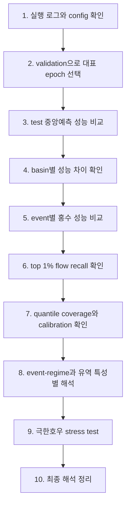

# 07. 분석 과정

모델 학습이 끝나면 바로 "Model 2가 더 좋다"라고 말하면 안 된다. 먼저 실행이 공정했는지 확인하고, validation으로 대표 epoch를 고른 뒤, test 결과를 여러 층으로 나누어 읽어야 한다.

## 1단계: 실행이 공정했는지 확인

먼저 각 run의 `config.yml`과 `output.log`를 본다. Model 1과 Model 2가 같은 basin file, 같은 날짜 구간, 같은 입력 변수, 같은 LSTM 설정, 같은 seed protocol로 돌았는지 확인해야 한다.

이 단계가 중요한 이유는 head와 loss 외에 다른 조건이 바뀌면 결과 차이를 probabilistic head의 효과라고 말하기 어렵기 때문이다.

## 2단계: 대표 epoch 선택

대표 checkpoint는 test가 아니라 validation을 보고 고른다. test 결과를 보고 epoch를 고르면 최종 평가 자료에 맞춰 모델을 고른 셈이 되어 비교가 불공정해진다.

현재 가장 자연스러운 규칙은 validation median NSE가 가장 좋은 epoch를 대표로 고르는 것이다. 이 규칙은 Model 1과 Model 2에 똑같이 적용해야 한다.

다만 대표 epoch 하나만 보면 결과가 우연히 그 checkpoint에만 좋게 나온 것인지 알기 어렵다. 그래서 validation 결과가 저장된 epoch `005 / 010 / 015 / 020 / 025 / 030` 전체도 따로 돌려 checkpoint sensitivity를 본다. 이 all-epoch sweep은 대표 epoch를 다시 고르기 위한 것이 아니라, 결론이 checkpoint 선택에 얼마나 민감한지 확인하는 보조 분석이다.

## 3단계: 중앙예측 성능 비교

Model 1은 유량 하나를 내고, Model 2는 여러 quantile을 낸다. 둘을 직접 비교할 때는 Model 2의 `q50`을 대표 중앙선으로 둔다.

이 표에서는 NSE, KGE, NSElog 같은 전체 성능과 FHV, Peak Relative Error, Peak Timing Error 같은 홍수 성능을 함께 본다. 핵심은 Model 2의 `q50`이 홍수 첨두를 덜 낮게 잡으면서도 전체 성능을 크게 해치지 않는지 확인하는 것이다.

각 지표의 계산식은 [`04_variable_terms.md`](04_variable_terms.md)의 "식으로 보는 평가지표" 섹션에 정리해 두었다. 분석할 때는 같은 식을 Model 1의 `Q_hat`과 Model 2의 `q50`에 똑같이 적용해야 비교가 공정하다.

## 4단계: basin별 비교

전체 평균만 보면 일부 basin의 큰 개선이 전체를 끌어올렸는지, 많은 basin에서 고르게 개선됐는지 알기 어렵다. 그래서 basin별로 `Model 2 - Model 1` 차이를 계산한다.

여기서는 개선된 basin 수, basin별 차이의 median, IQR, 분포 그림을 함께 본다. 단순히 "몇 개 basin에서 이겼다"보다, 개선 크기가 전반적으로 어느 방향으로 움직였는지가 더 중요하다.

## 5단계: event별 비교

이 연구의 중심은 홍수 첨두다. 그래서 basin 전체 시계열 평균뿐 아니라 event 단위 분석이 필요하다.

각 observed high-flow event candidate에서 실제 peak, 예측 peak, peak timing, event-level RMSE를 계산한다. 여기서 event candidate는 official flood inventory가 아니라, 관측 유량이 basin 내부 기준에서 크게 오른 구간이다.

만약 Model 2의 장점이 큰 event 또는 flood-like event로 갈수록 더 뚜렷해진다면, probabilistic head가 연구 질문에 잘 맞는 개선이라고 해석할 수 있다. 단, event table이 대부분 2년 홍수 proxy보다 작은 high-flow candidate일 수 있으므로, `flood_relevance_tier`를 같이 보고 해석해야 한다.

## 6단계: top 1% flow recall

`top 1% flow recall`은 실제로 가장 큰 유량 시점들을 모델이 얼마나 놓치지 않았는지 보는 지표다. 평균 오차가 좋아도 이 값이 낮으면 극한 홍수 예측이라는 연구 목적에는 부족하다.

Model 1, Model 2의 `q50`, 그리고 가능하면 `q95`, `q99`를 함께 비교한다. `q95`나 `q99`가 실제 큰 유량을 더 잘 포착한다면 Model 2의 upper-tail output이 실질적으로 도움이 된다고 볼 수 있다.

## 7단계: coverage와 calibration

Model 2는 단순히 `q50` 하나만 보는 모델이 아니다. `q90`, `q95`, `q99`가 실제로 믿을 만한지도 확인해야 한다.

Coverage는 예를 들어 `q95` 아래에 실제 관측값이 약 95% 들어오는지 보는 값이다. Calibration은 `q90`, `q95`, `q99`처럼 모델이 말한 확률 수준과 실제 빈도가 잘 맞는지 확인하는 과정이다.

Coverage가 높다고 무조건 좋은 것은 아니다. 예측 구간을 너무 넓게 잡으면 웬만한 값이 다 들어가기 때문이다. 그래서 coverage, calibration, quantile interval width를 함께 보는 것이 좋다.

이 단계에서는 `coverage`와 `calibration error`만 보지 말고, `q95-q50`, `q99-q50` 같은 interval width도 함께 봐야 한다. 그래야 Model 2가 실제로 잘 맞는 상위 범위를 만든 것인지, 단순히 너무 넓게 열어 둔 것인지 구분할 수 있다.

## 8단계: event-regime과 유역 특성별 해석

평균 결과만으로는 어떤 조건에서 모델이 강한지 알기 어렵다. 그래서 basin을 특성별로 나누어 본다.

예를 들어 snow fraction이 큰 basin, slope가 큰 basin, baseflow index가 낮은 basin, recent precipitation event가 많은 basin에서 Model 2의 개선이 더 뚜렷한지 확인할 수 있다. 이런 stratified evaluation은 모델 구조의 장점과 한계를 설명하는 데 중요하다.

현재 event-regime 분석은 `recent rainfall`, `antecedent / multi-day rain`, `weak / low-signal hydromet regime`처럼 event의 forcing 모양을 보고 나눈다. 이것은 causal mechanism을 확정한 이름이 아니라, 모델 결과를 읽기 쉽게 나눈 descriptor-based group이다.

## 9단계: 극한호우 stress test

Q99 streamflow event에서 출발하면 이미 유량이 오른 사례만 보게 된다. 그래서 별도로 hourly `Rainf`에서 ARI25/50/100급 rolling precipitation event를 직접 찾는다. 이 질문은 두 가지다.

첫째, train/validation 기간에 그런 극한호우 forcing이 실제로 있었는가. 이것은 모델이 학습 중 극한호우 입력을 볼 기회가 있었는지 확인하는 질문이다.

둘째, DRBC holdout basin의 historical extreme-rain event에서 실제 유량이 flood-like하게 올랐을 때 모델이 peak를 따라가는가. 이때 비는 컸지만 유량이 오르지 않은 event는 실패가 아니라 negative control이다. 그런 event에서 모델이 괜히 큰 홍수를 예측하면 false positive가 된다.

이 stress test도 primary checkpoint 결과와 all-validation-epoch sensitivity 결과를 나누어 읽는다. Primary 결과는 논문 메시지의 중심이고, all-validation-epoch 결과는 `q90/q95/q99`의 장점과 false-positive 위험이 epoch에 따라 얼마나 달라지는지 보는 보조 진단이다.

## 10단계: 최종 해석

최종 해석은 세 가지 질문에 답해야 한다.

첫째, Model 2가 Model 1보다 홍수 첨두 과소추정을 줄였는가. 둘째, 그 개선이 전체 성능을 크게 망치지 않았는가. 셋째, Model 2의 upper quantile이 실제 홍수 첨두를 믿을 만하게 감싸는가.

이 세 질문에 모두 긍정적으로 답할 수 있다면, 논문의 핵심 주장은 "큰 홍수 첨두 과소추정의 중요한 원인 중 하나는 output design이며, probabilistic quantile extension은 그 문제를 줄이는 실용적인 첫 단계다"가 된다.

## 주의할 점

`q99`는 99년 빈도 홍수가 아니다. 이 값은 특정 시점의 조건에서 모델이 예측한 상위 quantile이다.

Model 2의 `q50`만 보고 Model 2 전체를 평가하면 안 된다. `q50`은 중앙예측 비교에 쓰고, `q90`, `q95`, `q99`는 홍수와 uncertainty 해석에 따로 써야 한다.

Test 결과는 최종 보고에만 써야 한다. 모델 선택, threshold 조정, epoch 선택을 test를 보고 하면 성능을 과대평가할 위험이 있다.
