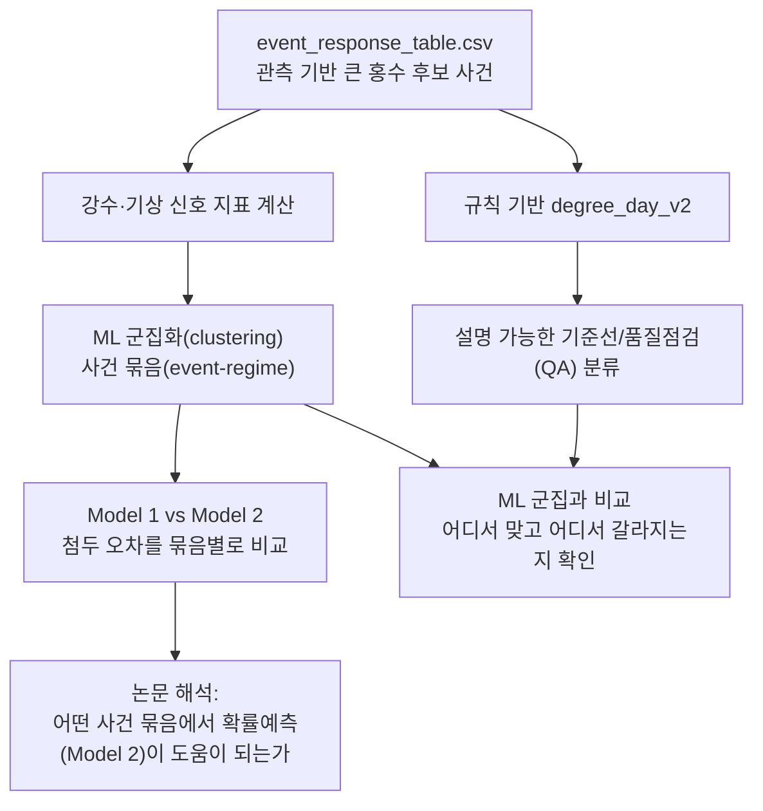
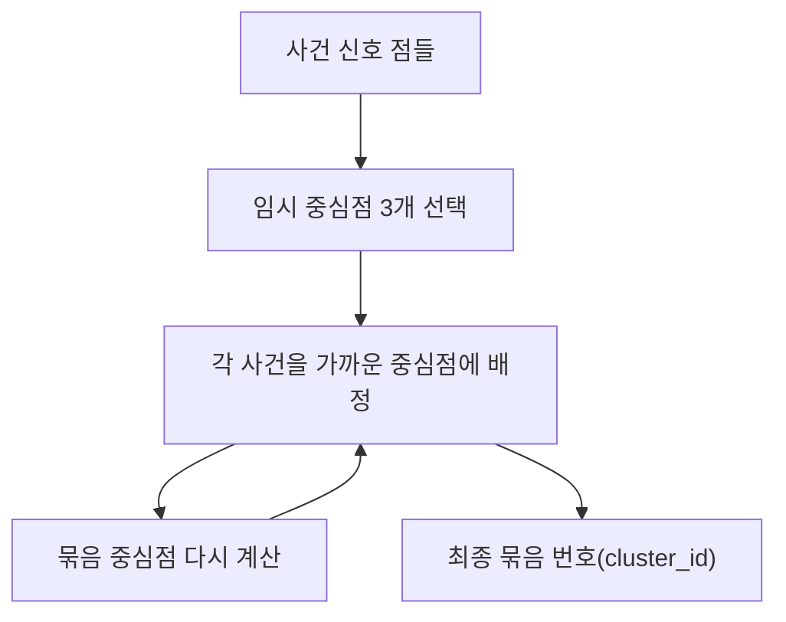
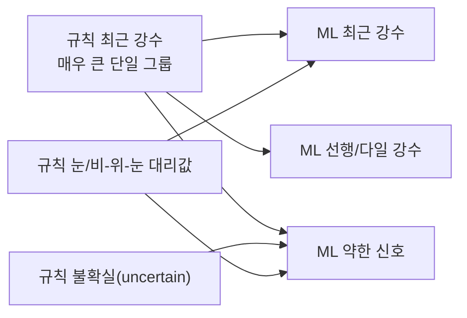

# 07. 머신러닝 기반 큰 홍수 사건 묶음

이 문서는 머신러닝(machine learning, 이하 ML)을 거의 모르는 독자를 가정한다. CAMELSH 시간별(hourly) 자료에서 잡아낸 큰 홍수 후보 사건을 ML 군집화(clustering)로 묶고, 그 결과를 모델 비교 분석에 쓰는 절차를 설명한다. 각 계산의 구현 스크립트·함수·변수명도 함께 짚는다. 비전공 독자가 "이 계산이 코드 어디에 있는가"를 곧바로 찾아갈 수 있게 하는 것이 목표다.

핵심 결론은 다음 한 문장이다.

> 규칙으로 만든 분류표(`degree_day_v2`)는 사람이 설명하고 방어하기 쉬운 기준선으로 남기고, 모델 오차를 나누어 볼 때는 데이터가 스스로 묶어 준 ML 군집(`hydromet_only_7` 신호 7개 + KMeans k=3)을 주된 분류로 쓴다.

두 분류의 성격은 다음과 같다.

- 규칙 기반 `degree_day_v2`: "최근 강수 / 선행 강수 / 눈녹음" 명명 근거를 설명하기 쉬운 기준표. `degree_day_v2`는 기온의 일별 누적(degree-day) 방식으로 눈녹음을 추정하는 규칙의 두 번째 판본.
- ML 기반 사건 묶음(event-regime clustering): 사건들이 신호 지표 공간에서 실제로 어떻게 모이는지 데이터로 본 묶음.

논문에서는 ML 군집을 "홍수 발생 원인의 정답표"로 쓰지 않는다. "모델 오차를 나누어 보기 위한 강수·기상 기반 사건 묶음(hydrometeorological event-regime stratification)"으로만 쓴다. ML은 사건을 더 잘게 나누지만 원인을 증명하지는 않는다.



용어 약속. "큰 홍수 후보 사건"은 관측 유량이 그 유역(basin) 기준 상위 1% 같은 높은 선을 넘긴 사건이다. 공식 인증 홍수가 아니라 데이터에서 1차로 잡아낸 후보(high-flow event candidate)다. 한 "사건(event)"은 유량 첨두(peak) 하나를 중심으로 시작·끝을 붙인 한 덩어리다.

---

## 1. "사건 묶음" 명명의 근거

"홍수 발생 유형(flood generation type)"이라는 표현은 사건의 실제 원인을 확정한 것처럼 들린다. "눈녹음 홍수(snowmelt flood)"라고 쓰면 적설량(SWE)이나 눈 깊이를 확인해 원인을 증명한 인상을 준다.

데이터에는 그런 정답표가 없다. CAMELSH 시간별 자료에는 "사람이 검증한 눈녹음 홍수" 같은 공식 정답표(label)가 없다. `degree_day_v2`도 관측 정답이 아니라 기온(temperature)과 강수(precipitation)만으로 만든 대리 규칙(proxy rule)이다.

ML 군집화도 같은 한계를 갖는다. ML은 사건 주변의 비, 선행 강수, 기온, 눈녹음 대리값 같은 숫자만 보고 비슷한 사건을 묶는다. 이 묶음은 신호 공간에서의 유사성이지 원인의 증명이 아니다.

ML 결과의 안전한 표현과 조심할 표현은 다음과 같다.

```text
안전한 표현:
  사건 묶음(event-regime cluster)
  강수·기상 기반 묶음(hydrometeorological regime)
  데이터 기반 사건 그룹(data-driven event grouping)
  모델 오차 분류 그룹(model-error stratification group)

조심해야 하는 표현:
  실제 홍수 메커니즘(true flood mechanism)
  확정된 눈녹음 홍수(confirmed snowmelt flood)
  인과적 홍수 유형(causal flood type)
```

---

## 2. 규칙 기반과 ML 기반의 역할 분담

두 분류는 택일 대상이 아니라 서로 다른 역할을 맡는다.

| 구분 | 규칙 기반 `degree_day_v2` | ML 기반 사건 묶음 |
| --- | --- | --- |
| 주된 역할 | 해석 가능한 기준선/품질점검 분류 | 모델 오차 분석용 주된 분류 |
| 강점 | 판정 규칙이 있어 방어하기 쉽다 | 사건·유역 구조를 더 균형 있게 나눈다 |
| 약점 | 최근 강수 후보가 너무 커져 많은 사건을 한 덩어리로 접는다 | 묶음 이름은 사후 해석이라 원인 주장은 약하다 |
| 논문에서 쓰는 방식 | ML 군집과 비교하는 기준선, 메커니즘 해석 보조 | Model 1/Model 2 첨두 오차를 나누어 보는 주된 분류 |
| 조심할 점 | 대리 규칙이지 정답표가 아니다 | "발생 유형"이 아니라 "사건 묶음"으로 표현한다 |

ML 기반을 분류에 더 적극적으로 쓰는 이유는 규칙 기반이 너무 많은 사건을 "최근 강수(recent_precipitation)" 하나로 보냈기 때문이다. 전체 사건에서 규칙상 최근 강수 비중이 약 71%[^ratio-source]여서, 그 안에 며칠에 걸친 비 사건이나 약한 신호 사건이 섞여 있어도 모델 오차 분석에서는 한 덩어리로 보인다.

선택된 ML 군집은 사건을 더 균형 있게 나눈다.

```text
선택된 ML 변형(variant):
  kmeans__hydromet_only_7__k3

사건 비율:
  최근 강수(Recent rainfall)                약 40.9%
  약한 신호(Weak / low-signal hydromet)      약 31.6%
  선행/다일 강수(Antecedent / multi-day rain) 약 27.5%
```

이렇게 나뉘면 Model 2(확률예측)가 단순한 최근 강수 사건에서 좋은지, 며칠 젖어 있던 사건에서 좋은지, 약한 신호 사건에서 불안정한지를 더 또렷하게 볼 수 있다.

[^ratio-source]: 71%·40.9%·31.6%·27.5%·95%·51.6%·87.3% 등 본문의 비율 수치는 모두 비교 스크립트가 생성하는 출력 표(`output/basin/all/archive/event_regime_variants/tables/`의 `variant_basin_composition.csv`, `variant_cluster_profiles.csv`, `variant_rule_crosstab_long.csv`)에서 나온다. 이 표는 `output/` 아래라 git에는 포함되지 않으므로 재현 명령(15절)으로 다시 생성한다. silhouette `0.215`, 1위 비율 `51.6%` 등의 변형 선택 지표는 method 문서 [`flood_generation_typing.md`](../experiment/method/basin/flood_generation_typing.md)에 고정돼 있다.

---

## 3. 지도학습을 먼저 쓰지 않는 이유

ML에는 크게 두 가지 방식이 있다.

첫째는 지도학습(supervised learning)이다. 이미 정답표가 있고, ML이 그 정답을 맞히도록 배우는 방식이다. 사진이 고양이인지 개인지 맞히는 모델은 사람이 붙인 정답표가 있다.

둘째는 비지도학습(unsupervised learning)이다. 정답표 없이, 데이터가 스스로 어떤 모양으로 뭉치는지 보는 방식이다. 군집화(clustering)가 여기에 속한다.

이 문제에는 공식 정답표가 없다. `degree_day_v2`를 정답처럼 두고 지도학습 분류기를 학습하면, ML은 새로운 홍수 메커니즘이 아니라 규칙을 흉내 낼 가능성이 크다. 묻고 싶은 질문은 다음이다.

> 규칙 정답을 외우지 않고 사건 주변의 강수·기상 신호만 보았을 때, 사건들이 어떤 묶음으로 자연스럽게 모이는가?

이 질문에는 군집화가 적합하다.

---

## 4. 분석 단위는 유역이 아니라 사건

ML에 넣는 표(feature table)의 한 행은 유역 하나가 아니라 사건 하나다. 같은 유역에서도 사건마다 성격이 다르기 때문이다.

한 유역에서도 여름의 짧고 강한 비, 한 달간 누적된 비로 이미 젖은 상태, 겨울·봄의 기온·눈녹음 대리값처럼 사건 성격이 갈린다.

따라서 유역 하나를 한 유형으로 고정하는 것은 거칠다. 먼저 사건을 나눈 뒤 유역별로 각 묶음의 비율을 계산한다.

```text
사건 단위:
  event_001 -> 최근 강수
  event_002 -> 선행/다일 강수
  event_003 -> 약한 신호

유역 단위:
  최근 강수 비율             0.45
  선행/다일 강수 비율        0.35
  약한 신호 비율             0.20
```

이렇게 하면 유역을 한 단어로 설명하지 않고 어떤 묶음이 얼마나 섞여 있는지 볼 수 있다.

---

## 5. ML 입력 신호 지표 목록

여러 신호 묶음을 비교한 결과 가장 적절한 후보는 `hydromet_only_7`이다. 강수·기상 신호 중심의 7개 지표를 쓴다. 아래 표는 요약이며, 자세한 의미는 소항목에서 이어 설명한다. ("변수명"은 코드와 산출물 CSV의 열 이름이다. "범위"의 0~ 표기는 0 이상.)

| 신호 이름 | 변수명 | 범위 | 의미·방향 |
| --- | --- | --- | --- |
| 직전 1일 강수비 | `recent_1d_ratio` | 0~ | 직전 24시간 비가 그 유역 평소 큰 비 대비 얼마나 컸는지, 클수록 강함 |
| 직전 3일 강수비 | `recent_3d_ratio` | 0~ | 직전 72시간 비 강도, 클수록 강함 |
| 7일 선행 강수비 | `antecedent_7d_ratio` | 0~ | 직전 7일 누적 비, 클수록 더 젖어 있었음 |
| 30일 선행 강수비 | `antecedent_30d_ratio` | 0~ | 직전 30일 누적 비, 클수록 장기 습윤 |
| 눈녹음비 | `snowmelt_ratio` | 0~ | 7일 눈녹음 대리값이 유역 평소 대비 얼마나 큰지, 클수록 눈녹음 영향 큼 |
| 눈녹음 분율 | `snowmelt_fraction` | 0~1 | 7일 물 유입 중 눈녹음이 차지한 비율, 1에 가까울수록 눈녹음 위주 |
| 사건 평균 기온 | `event_mean_temp` | 실수(°C) | 사건 기간 평균 기온, 눈녹음·계절성 해석 보조 |

### 5.1 직전 강수비 `recent_1d_ratio`, `recent_3d_ratio`

"직전 1일 강수비"는 첨두 직전 24시간 누적 비가 그 유역의 평소 큰 비 기준 대비 얼마나 컸는지를 나타낸다. 핵심은 "비가 몇 mm였나"만 보는 게 아니라 "그 유역 기준으로 큰 비였나"를 본다는 점이다. 그래서 비가 흔한 지역과 건조한 지역을 더 공정하게 비교할 수 있다. "직전 3일 강수비"는 같은 생각을 72시간으로 늘린 것으로, 하루를 넘겨 이어진 비를 잡는다.

### 5.2 선행 강수비 `antecedent_7d_ratio`, `antecedent_30d_ratio`

"선행(antecedent)"은 첨두가 오기 전에 이미 와 있던 비를 뜻한다. 7일 선행 강수비는 최근 일주일이 평소보다 얼마나 젖어 있었는지, 30일 선행 강수비는 한 달 단위의 긴 습윤 상태를 본다. 이 값이 크면, 비 자체보다 "이미 젖어 있던 땅"이 첨두를 키운 사건일 가능성이 높다.

### 5.3 눈녹음 신호 `snowmelt_ratio`, `snowmelt_fraction`

"눈녹음비"는 7일 눈녹음 대리값이 그 유역 기준으로 큰 편인지 본다. "눈녹음 분율"은 같은 7일 동안 들어온 물(비 + 눈녹음) 중 눈녹음이 차지한 비율로, 0~1 사이다. 둘을 같이 보면 "비만 온 사건인지, 눈녹음이 섞인 사건인지"를 구분할 수 있다. 단, 이 값들은 실제 적설을 잰 게 아니라 기온·강수로 추정한 대리값이라는 점을 기억해야 한다.

### 5.4 사건 평균 기온 `event_mean_temp`

사건 기간 동안의 평균 기온이다. 눈녹음 신호를 해석할 때(추운 시기였는지)와 계절성을 읽을 때 도움이 된다.

### 5.5 강수비 계산 구현

이 신호들의 구현 위치는 다음과 같다.

- 스크립트: `scripts/basin/event_regime/compare_camelsh_flood_generation_ml_variants.py`
- 함수: `build_feature_table`
- 핵심 helper: `safe_ratio` — 분자를 분모로 나누되 분모가 0이거나 결과가 무한대면 빈 값으로 처리

분자·분모 짝은 아래와 같다.

- `recent_1d_ratio` = `recent_rain_24h` / `basin_rain_1d_p90`
- `recent_3d_ratio` = `recent_rain_72h` / `basin_rain_3d_p90`
- `antecedent_7d_ratio` = `antecedent_rain_7d` / `basin_rain_7d_p90`
- `antecedent_30d_ratio` = `antecedent_rain_30d` / `basin_rain_30d_p90`
- `snowmelt_ratio` = `degree_day_snowmelt_7d` / `basin_snowmelt_7d_p90`

분모 `basin_*_p90`은 그 유역의 "평소 큰 비"에 해당하는 90백분위(상위 10% 선) 값이다. 분자(이번 사건의 비)를 분모(유역 평소 큰 비)로 나눠 상대 강도를 구한다. 이 분모 값과 비·기온 원자료는 앞단계 산출물 `event_response_table.csv`에 들어 있으며, 계산 규칙은 method 문서 [`event_response_spec.md`](../experiment/method/basin/event_response_spec.md)에 고정돼 있다.

눈녹음비에는 추가 안전장치가 있다. `build_feature_table`는 `basin_snowmelt_valid_window_count`(눈녹음 대리값이 충분히 관측된 횟수)가 공용 helper 기준값 `SNOWMELT_MIN_VALID_WINDOW_COUNT`보다 적은 유역에서 `snowmelt_ratio`를 0으로 두고, 그 신뢰 여부를 보조 변수 `snow_proxy_available`로 기록한다. 눈녹음 관측이 빈약한 유역에서 잡음이 신호로 보이는 것을 막는 장치다.

---

## 6. 신호를 7개로 제한한 이유

신호를 더 많이 넣을 수도 있다. 같은 스크립트의 `FEATURE_SETS`에는 13개를 모두 쓰는 `current_all_13`을 포함해 여러 후보가 정의돼 있다. 신호가 많다고 항상 좋지는 않다. 정보가 없는 신호나 서로 거의 같은 신호가 들어가면 군집이 좋아지는 대신 해석이 흐려진다. 이번 점검 결과는 다음과 같다.

- `event_runoff_coefficient`(사건 유출 계수)는 현재 산출물에서 사실상 전부 비어 있어, 최종 신호로 쓰면 전부 0이 된다. 정보가 없는 신호다.
- 비 분율(rain fraction)과 눈녹음 분율(`snowmelt_fraction`)은 서로 거의 반대 정보다. 둘을 같이 넣으면 같은 정보를 두 번 넣는 셈이다.
- `snow_proxy_available`은 거의 항상 1이라 구분력이 약하다(그래서 보조 기록용으로만 둔다).
- 상승 시간(`rising_time_hours`), 사건 지속(`event_duration_hours`) 같은 수문곡선 모양 신호는 유용할 수 있지만, 사건을 자르는 과정의 잔재나 극단값 꼬리에 민감하다. 같은 스크립트는 이런 모양 신호를 `SHAPE_FEATURES`로 따로 묶어, 군집에 넣을 때 상위 분위수에서 잘라내는(winsorize) 전처리를 별도로 적용한다. 이번 선택에서는 메커니즘에 가까운 묶음을 먼저 보기 위해 모양 신호를 빼고 강수·기상 신호 중심으로 둔다.

따라서 `hydromet_only_7`은 신호를 더 적게 쓰지만 현재 목적에는 더 깨끗하다.

---

## 7. 입력 전처리

군집화는 신호 크기에 민감하다. 어떤 신호는 0~1 사이이고 어떤 신호는 수십·수백까지 간다. 그대로 넣으면 큰 값을 가진 신호가 지나치게 중요해진다. 따라서 아래 전처리를 거친다.


`NaN`은 값이 비어 있다는 뜻이고, `inf`는 0으로 나누는 경우처럼 값이 무한대로 튀었다는 뜻이다. 이런 값은 ML에 그대로 넣으면 안 된다.

`log1p`는 큰 값을 완화하는 변환이다. `log1p(x)`는 `log(1+x)`라서 x가 0이어도 안전하다. 강수비처럼 일부 사건에서 매우 큰 값이 나올 수 있는 신호에 유용하다.

`RobustScaler`는 중앙값(median)과 사분위 간격(IQR)을 이용해 신호 크기를 맞춘다. 평균·표준편차보다 극단값에 덜 민감해서, 꼬리가 큰 수문 자료에 더 안정적이다.

구현 위치는 다음과 같다.

- 함수: 같은 스크립트의 `transformed_matrix`
- `log1p` 적용 신호: `LOG1P_FEATURES` 집합(강수비·눈녹음비 등)
- 모양 신호: `SHAPE_FEATURES`로 별도 처리
- 최종 입력: `RobustScaler().fit_transform(...)`을 거친 행렬

---

## 8. KMeans 작동 원리

이번 선택은 `KMeans(k=3)`이다. `k=3`은 묶음을 3개 만든다는 뜻이다. KMeans는 다음 순서로 작동한다.

1. 먼저 중심점 3개를 아무 곳에 둔다.
2. 각 사건을 가장 가까운 중심점에 붙인다.
3. 각 묶음의 평균 위치로 중심점을 옮긴다.
4. 사건을 다시 가까운 중심점에 붙인다.
5. 더 이상 크게 바뀌지 않을 때까지 반복한다.



KMeans의 장점은 단순성과 재현성이다. 단점은 묶음 수 `k`를 사람이 정해야 하고, 애매한 사건도 반드시 한 묶음에 넣는다는 점이다. 따라서 묶음 해석은 "이 사건의 진짜 원인"이 아니라 "이 사건이 가장 가까운 신호 묶음"으로 표현한다.

구현 위치는 다음과 같다.

- 함수: 같은 스크립트의 `fit_kmeans` → 내부에서 `KMeans(n_clusters=k, n_init=20, random_state=...)` 호출
- `n_init=20`: 시작 중심점을 20번 다르게 시도해 가장 좋은 결과 선택
- `random_state`: 같은 결과 재현용 난수 고정값
- 비교용 대안: 가우시안 혼합모형 `fit_gmm`(`GaussianMixture(..., covariance_type="diag")`)

---

## 9. k=3 선택 근거

여러 변형을 비교했다. 비교 범위는 스크립트 상단의 `K_VALUES = (3, 4)`와 `RANDOM_STATES = (111, 222, 444)`가 정한다. 묶음 수 3·4, 난수 고정값 `111/222/444`, `FEATURE_SETS`의 여러 신호 묶음, KMeans·가우시안 혼합 두 방식을 교차로 돌린다.

선택된 변형은 다음이다.

```text
kmeans__hydromet_only_7__k3
```

내부 분리도 기준에서 이 변형의 균형이 가장 좋았다.

```text
ML hydromet_only_7 k=3:
  silhouette            0.215
  Davies-Bouldin        1.401
  seed ARI mean         0.983
  basin top2 >= 0.8     0.873
```

각 지표의 의미는 아래와 같다.

| 지표 이름 | 변수명 | 좋은 방향 | 의미 |
| --- | --- | --- | --- |
| 실루엣 | `silhouette_sample` | 클수록 좋음 | 같은 묶음 안은 가깝고 다른 묶음과는 먼가 |
| 데이비스-볼딘 | `davies_bouldin_sample` | 작을수록 좋음 | 묶음들이 서로 겹치지 않고 떨어지는가 |
| 시드 ARI | `seed_ari_mean` | 클수록 좋음 | 난수 시드를 바꿔도 비슷한 묶음이 나오는가 |
| 상위2 비율 | `basin_top2_ge_0_8_share` | 클수록 해석 쉬움 | 유역을 두 주요 묶음 조합으로 설명할 수 있는가 |

지표별 계산 위치는 다음과 같다.

- `sampled_metrics`: 실루엣·데이비스-볼딘·칼린스키-하라바츠
- `label_stability`: 시드 ARI
- `basin_composition`: 상위2 비율

최종 선택은 `main` 함수 끝부분의 순위 계산에서 이뤄진다. 각 지표를 백분위 순위로 바꿔 더한 `score` 열을 만들고, 너무 작은 묶음이 생기면 `tiny_cluster_penalty`로 감점한 뒤, 점수 내림차순으로 정렬해 `variant_ranking.csv`로 저장한다.

규칙 기반 분류를 같은 신호 공간에서 보면 실루엣이 더 낮다(11절). 신호의 기하 구조만 놓고 보면 ML 군집이 사건 구조를 더 자연스럽게 나눈다. 이것이 ML 기반을 모델 오차 분류에 쓰는 핵심 근거다.

---

## 10. 선택된 묶음 이름

선택된 KMeans 묶음은 숫자로 `0`, `1`, `2`다. 숫자 자체에는 의미가 없으므로 묶음별 신호 중앙값(median)을 보고 이름을 붙인다. 중앙값 표는 `cluster_profiles` 함수가 만든다. 권장 해석은 아래와 같다.

| 묶음 번호 | 권장 이름 | 해석 |
| --- | --- | --- |
| 0 | 선행/다일 강수 (`Antecedent / multi-day rain`) | 3일 강수와 7일/30일 선행 강수비가 높은 사건 |
| 1 | 약한 신호 (`Weak / low-signal hydromet regime`) | 강한 최근/선행 신호가 약하고, 일부 눈·추운 시기 꼬리가 섞인 사건 |
| 2 | 최근 강수 (`Recent rainfall`) | 직전 1일 강수비가 뚜렷하게 높은 사건 |

주의점이 있다. 과거 그림이나 임시 산출물에서는 묶음 1을 "약한 신호/눈 영향(`Weak-driver / snow-influenced`)"으로 불렀다. 그림 생성 스크립트 `scripts/basin/event_regime/plot_camelsh_flood_generation_ml_variant.py`의 묶음 이름 매핑(`CLUSTER_NAMES`)에는 여전히 묶음 1이 옛 이름으로 남아 있다. 그러나 저위도 유역을 추가 확인한 결과 이 묶음 전체를 눈 위주로 해석하면 안 된다. 저위도 "약한 신호/눈 영향" 유역 중 상당수는 눈 분율(`snow_fraction`)이 거의 0이다. 따라서 더 안전한 이름은 "약한 신호(`Weak / low-signal hydromet regime`)"다. 눈녹음은 이 묶음 일부 사건의 꼬리 설명일 뿐 묶음 전체 이름이 될 수 없다. 그림 스크립트의 옛 이름 매핑은 공식 파이프라인 승격 시 정리 대상이다.

---

## 11. 규칙 기반과 ML 기반의 차이

ML 군집과 규칙 분류를 비교하면 패턴이 드러난다. 비교는 `compare_camelsh_flood_generation_ml_variants.py`의 `rule_agreement` 함수가 맡는다. 두 분류의 중첩도를 ARI(`rule_adjusted_rand_index`)와 정규화 상호정보량(`rule_normalized_mutual_info`)으로 재고, 규칙 분류와 묶음의 대응을 교차표(`variant_rule_crosstab_long.csv`)로 남긴다.

ML의 "최근 강수" 묶음은 규칙의 "최근 강수(recent_precipitation)"와 잘 맞는다. 이 묶음 안에서 규칙상 최근 강수 비중이 약 95%[^ratio-source]여서 해석이 깔끔하다.

ML의 "선행/다일 강수" 묶음에는 규칙상 최근 강수가 많이 섞여 있다. 규칙이 "최근 강수"로 찍은 사건 일부가 신호 공간에서는 다일 강수·선행 강수 성격으로 모인다는 뜻이다.

ML의 "약한 신호" 묶음은 더 조심해야 한다. 규칙상 최근 강수, 불확실(uncertain), 눈/비-위-눈 대리값이 섞인다. 이 묶음은 명확한 홍수 메커니즘이라기보다 현재 신호로 강한 최근/선행 신호가 잡히지 않는 사건 묶음으로 해석하는 편이 안전하다.



ML은 규칙을 부정하지 않는다. 규칙이 크게 묶은 최근 강수 사건의 내부 구조를 더 잘게 드러낸다.

규칙 분류의 구현 위치와 판정 흐름은 다음과 같다.

- 스크립트: `scripts/basin/all/build_camelsh_flood_generation_typing.py`
- 함수: `classify_events_degree_day`
- 판정 순서:
  1. 눈 관련 조건(`snowmelt_proxy` 또는 `rain_snowmelt_proxy`)을 먼저 확인
  2. 해당 없으면 최근/선행 강수 강도(`recent_precipitation_strength`, `antecedent_precipitation_strength`) 비교
  3. 두 강도의 상대 차이가 작으면 `low_confidence_type_flag` 설정
  4. 어느 조건도 충족하지 않으면 "불확실 후보(`uncertain_high_flow_candidate`)"로 분류
- 출력 열: `flood_generation_type`

이 강도 비교의 임계값도 신호 계산과 같은 유역 기준 90백분위 값(`basin_rain_1d_p90` 등)이라 ML 신호와 일관된다.

---

## 12. 유역 단위 상위 2개 구성

사건 묶음을 유역별로 집계하면 각 유역의 묶음 비율을 얻는다. 집계는 `compare_camelsh_flood_generation_ml_variants.py`의 `basin_composition` 함수가 맡고, 각 유역의 최대 비율(`top1_share`)과 상위 두 개 합(`top2_share`)을 함께 남긴다. 다음 유역을 예로 든다.

```text
최근 강수             0.46
선행/다일 강수        0.38
약한 신호             0.16
```

이 유역은 1위만 보면 최근 강수 유역이지만 선행/다일 사건도 적지 않다. 단일 이름으로만 설명하면 정보가 사라진다.

이번 결과에서 ML 1위 비율이 0.6 이상인 유역은 약 51.6%, 상위 2개 합이 0.8 이상인 유역은 약 87.3%다[^ratio-source]. 많은 유역이 한 묶음으로 완전히 설명되기보다 두 주요 묶음의 혼합으로 설명된다. 따라서 논문에서는 유역 단일 이름 대신 사건 단위 분류와 유역 단위 구성(top-1·top-2)을 함께 제시한다. 1위 비율 0.6 기준은 `--dominance-threshold` 인자로 정하며 기본값은 0.6이다.

---

## 13. 논문 적용 방식

최종 원칙은 아래와 같다.

```text
모델 오차 분류의 주축:
  ML 기반 강수·기상 사건 묶음(event-regime cluster)

기준선/품질점검 메커니즘 분류:
  규칙 기반 degree_day_v2 분류
```

Model 1과 Model 2의 첨두 과소추정을 나누어 볼 때 ML 군집을 주된 분류로 쓴다. "최근 강수", "선행/다일 강수", "약한 신호"별로 첨두 오차, 상위 1% 재현율, FHV(상위 유량 구간 편의), 시점 오차를 비교한다. 이어 규칙 기반 결과를 함께 제시해 ML 군집이 물리 대리 규칙과 어느 정도 맞는지 확인한다. 이때 `rule_vs_ml_cluster_heatmap.png`가 유용하다.

논문 문장으로는 아래처럼 쓰면 안전하다.

```text
We use data-driven hydrometeorological event-regime clusters as the primary
stratification for model-error analysis, while retaining the rule-based
degree-day typing as an interpretable QA reference for hydrologic mechanism
interpretation.
```

한국어 번역은 다음과 같다.

> 모델 오차를 나누어 보는 기준으로는 데이터 기반 사건 묶음을 사용한다. 다만 이 묶음을 실제 원인 분류로 과장하지 않기 위해, 규칙 기반 degree-day 분류를 해석 가능한 품질점검 기준으로 함께 유지한다.

---

## 14. 참고 그림

선택된 변형의 그림은 `plot_camelsh_flood_generation_ml_variant.py`와 `plot_camelsh_basin_group_maps.py`가 만든다. 산출 폴더는 `output/basin/all/archive/event_regime_variants/figures/`다.

| 그림 | 보여 주는 것 |
| --- | --- |
| `event_descriptor_pca_by_ml_cluster.png` | ML 묶음이 신호 공간에서 어떻게 나뉘는지 |
| `event_descriptor_pca_by_rule_type.png` | 같은 공간에서 규칙 분류가 얼마나 섞이는지 |
| `rule_vs_ml_cluster_heatmap.png` | ML 묶음 안에 규칙 분류가 어떤 비율로 들어 있는지 |
| `basin_cluster_composition_triangle.png` | 유역을 단일 이름보다 상위 2개 구성으로 설명하는 편이 낫다는 점 |
| `monthly_ml_cluster_composition.png` | 월별로 묶음 구성이 어떻게 달라지는지 |
| `us_map_*` 계열 | 미국 전역에서 묶음이 지리적으로 어떻게 분포하는지 |

<!-- 그림 삽입 보류: 위 그림 산출 폴더는 `output/` 아래라 git에 포함되지 않는다(현재 작업 트리에 파일 부재). 15절 재현 명령으로 그림을 생성한 뒤 각 그림을 언급 지점(예: `rule_vs_ml_cluster_heatmap.png`는 13절, `basin_cluster_composition_triangle.png`는 12절)에 삽입한다. 산출 전에는 깨진 링크를 만들지 않도록 표만 유지한다. -->

이 그림들은 ML이 규칙을 대체해 "새 정답"을 만들었다는 증거가 아니다. ML이 모델 오차 분석에 더 풍부한 분류를 제공한다는 증거다.

---

## 15. 산출물과 실행 스크립트

규칙 기반 분류 산출물은 `scripts/basin/all/build_camelsh_flood_generation_typing.py`가 만든다. 기본 위치는 아래다.

```text
output/basin/all/analysis/flood_generation/tables/
  flood_generation_event_types.csv      # 사건별 규칙 분류
  flood_generation_basin_summary.csv     # 유역별 dominant/mixture 요약
```

ML 변형 비교 산출물은 `scripts/basin/event_regime/`의 비교·그림 스크립트가 만든다. 기본 위치는 아래다.

```text
output/basin/all/archive/event_regime_variants/
  변형 비교/순위:
    variant_metrics.csv, variant_ranking.csv,
    variant_cluster_profiles.csv, variant_basin_composition.csv,
    variant_rule_crosstab_long.csv
  선택된 변형:
    selected_variant_event_labels.csv,
    selected_variant_basin_cluster_composition.csv,
    selected_variant_cluster_feature_medians.csv,
    selected_variant_visual_summary.json
```

재현 명령은 아래 세 개의 dev 스크립트다. 14절 그림도 이 명령으로 생성한다.

```bash
uv run scripts/basin/event_regime/compare_camelsh_flood_generation_ml_variants.py
uv run scripts/basin/event_regime/plot_camelsh_flood_generation_ml_variant.py
uv run scripts/basin/event_regime/plot_camelsh_basin_group_maps.py
```

주의점은 둘이다.

- `scripts/basin/all/build_camelsh_flood_generation_ml_clusters.py`는 이전의 선택적 KMeans 민감도 점검 스크립트다. 현재 논문 분석용으로 채택한 변형은 위 dev 스크립트가 만든 `hydromet_only_7 + KMeans(k=3)`이다.
- 위 산출 경로와 그림 폴더는 모두 `archive/event_regime_variants/` 아래 dev 단계 결과다. 공식 파이프라인 승격 시에는 변형 선택값(`kmeans__hydromet_only_7__k3`)과 묶음 이름을 고정한 공식 스크립트로 승격하고, 그림 스크립트의 옛 묶음 이름 매핑을 정리한 뒤 README를 정돈한다.

---

## 16. Python 흐름 요약

아래 코드는 실제 구현 전체가 아니라 흐름 이해용 의사코드다. 실제 구현은 `safe_ratio`, `build_feature_table`, `transformed_matrix`, `fit_kmeans` 등으로 더 세분돼 있고, 눈녹음 신뢰 게이트와 모양 신호 전처리가 추가된다.

```python
import numpy as np
import pandas as pd
from sklearn.cluster import KMeans
from sklearn.preprocessing import RobustScaler

events = pd.read_csv(
    "output/basin/all/analysis/event_response/tables/event_response_table.csv"
)

# safe_ratio: 분모가 0이거나 결과가 무한대면 빈 값으로 둔다
features = pd.DataFrame({
    "recent_1d_ratio": events["recent_rain_24h"] / events["basin_rain_1d_p90"],
    "recent_3d_ratio": events["recent_rain_72h"] / events["basin_rain_3d_p90"],
    "antecedent_7d_ratio": events["antecedent_rain_7d"] / events["basin_rain_7d_p90"],
    "antecedent_30d_ratio": events["antecedent_rain_30d"] / events["basin_rain_30d_p90"],
    "snowmelt_ratio": events["degree_day_snowmelt_7d"] / events["basin_snowmelt_7d_p90"],
    "snowmelt_fraction": events["degree_day_snowmelt_fraction_7d"],
    "event_mean_temp": events["event_mean_temp"],
})

features = features.replace([np.inf, -np.inf], np.nan).fillna(0.0)

# LOG1P_FEATURES에 해당하는 강수·눈녹음비만 log1p로 완화
for col in [
    "recent_1d_ratio", "recent_3d_ratio",
    "antecedent_7d_ratio", "antecedent_30d_ratio",
    "snowmelt_ratio",
]:
    features[col] = np.log1p(features[col].clip(lower=0))

X = RobustScaler().fit_transform(features)

model = KMeans(n_clusters=3, n_init=20, random_state=111)
events["event_regime_cluster"] = model.fit_predict(X)

cluster_profile = events.groupby("event_regime_cluster")[features.columns].median()
```

핵심은 마지막 `cluster_profile`이다. 묶음 번호 생성으로 끝나지 않는다. 묶음별 신호 중앙값을 보고 사람이 이름을 붙이고, 그 이름이 과장되지 않았는지 규칙 기반 분류와 비교한다.

---

## 17. 핵심 요약

ML은 정답표를 맞히는 도구가 아니라 사건 신호 구조를 더 잘 나누는 도구다.

현재 결론은 ML 기반 사건 묶음을 모델 오차 분류의 주축으로 쓰고, 규칙 기반 `degree_day_v2`를 해석 가능한 기준선/품질점검 분류로 유지한다는 것이다.

ML 묶음 이름은 조심해서 붙인다. 예전의 "약한 신호/눈 영향(`Weak-driver / snow-influenced`)"은 저위도 눈 분율 점검 결과 눈 위주 묶음으로 보기 어렵다. 논문에서는 "약한 신호(`Weak / low-signal hydromet regime`)"처럼 더 넓고 안전한 이름을 쓴다.

이로써 ML의 정보량을 활용하면서 홍수 메커니즘 주장을 과장하지 않는다.

---

## 관련 문서

- 사건 추출과 신호 계산 규칙: [`event_response_spec.md`](../experiment/method/basin/event_response_spec.md)
- 사건 묶음/규칙 분류의 method 기준: [`flood_generation_typing.md`](../experiment/method/basin/flood_generation_typing.md)
- 모델 구조 설명(같은 explain 시리즈): [`02_model_structure.md`](02_model_structure.md)
