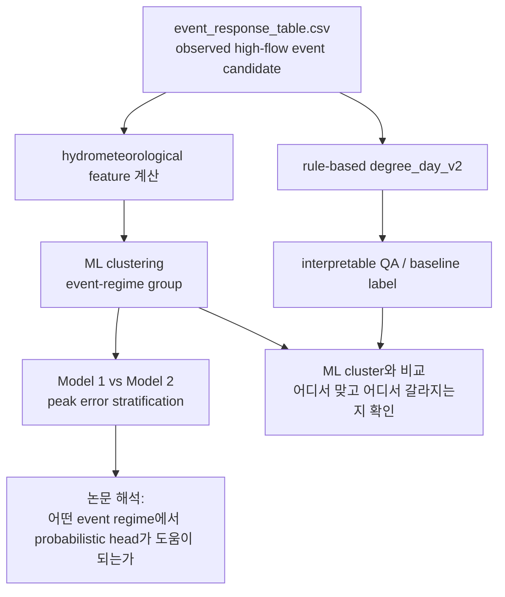
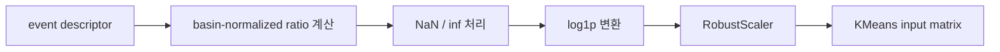
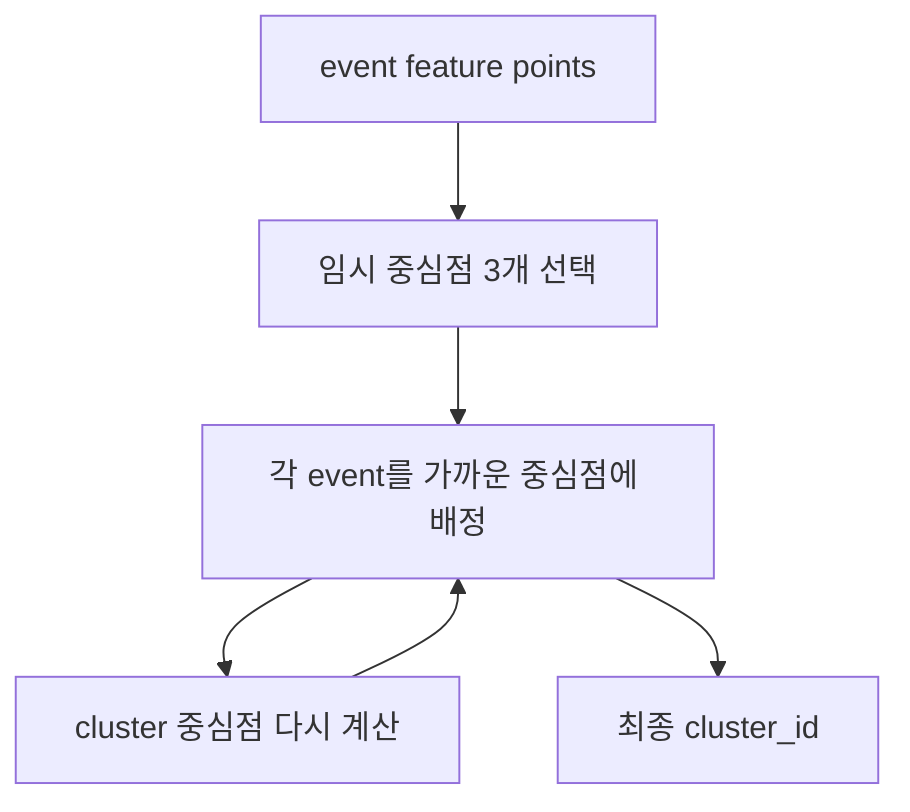
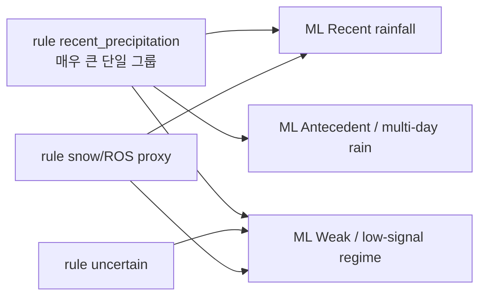

# 08. ML로 high-flow event regime을 나누는 방법

이 문서는 ML을 거의 모르는 상태를 가정하고, CAMELSH hourly high-flow event를 ML로 어떻게 나누고 해석할지 설명한다. 여기서 중요한 결론은 하나다.

우리 논문에서는 `rule-based degree_day_v2`를 완전히 버리지 않는다. 대신 역할을 나눈다. `rule-based`는 물리적으로 설명 가능한 QA/baseline label로 남기고, 모델 오차나 peak underestimation을 더 잘 나누어 보기 위한 stratification에는 `ML-based event-regime clustering`을 쓴다.

조금 더 쉽게 말하면 이렇다.

```text
rule-based degree_day_v2
  = 왜 recent / antecedent / snowmelt라고 불렀는지 설명하기 쉬운 기준표

ML-based event-regime clustering
  = event들이 실제 descriptor 공간에서 어떻게 비슷하게 모이는지 보는 데이터 기반 grouping
```

그래서 논문에서는 ML cluster를 `flood-generation mechanism의 정답 label`처럼 쓰지 않는다. 대신 `model-error analysis를 위한 hydrometeorological event-regime stratification`으로 쓴다. 이 표현이 중요하다. ML은 event들을 더 잘 나누지만, 그 자체가 원인 증명은 아니기 때문이다.



## 1. 왜 이름을 flood generation type이 아니라 event regime이라고 부르는가

`flood generation type`이라고 하면 이 event의 실제 원인을 확정한 것처럼 들릴 수 있다. 예를 들어 `snowmelt flood`라고 쓰면, 실제 SWE나 snow depth를 확인해서 눈녹음이 원인이라고 증명한 느낌을 준다.

하지만 우리 데이터에는 그런 정답표가 없다. CAMELSH hourly에는 "이 event는 사람이 검증한 snowmelt flood다" 같은 official label이 들어 있지 않다. 우리가 만든 `degree_day_v2`도 관측 정답이 아니라 `temperature + precipitation`으로 만든 proxy rule이다.

ML clustering도 마찬가지다. ML은 event 주변의 비, 선행강수, 기온, snowmelt proxy 같은 숫자를 보고 비슷한 event끼리 묶는다. 이 묶음은 데이터 공간에서 비슷하다는 뜻이지, 실제 원인을 100% 증명한다는 뜻은 아니다.

그래서 ML 결과는 아래처럼 부르는 것이 안전하다.

```text
좋은 표현:
  event-regime cluster
  hydrometeorological regime
  data-driven event grouping
  model-error stratification group

조심해야 하는 표현:
  true flood mechanism
  confirmed snowmelt flood
  causal flood type
```

## 2. rule-based와 ML-based의 역할 차이

현재 결론은 "둘 중 하나만 고르자"가 아니다. 둘은 서로 다른 역할을 한다.

| 구분 | rule-based `degree_day_v2` | ML-based event-regime clustering |
| --- | --- | --- |
| 주된 역할 | 해석 가능한 QA/baseline label | 모델 오차 분석용 primary stratification |
| 강점 | decision rule이 있어서 방어하기 쉽다 | event/basin 구조를 더 균형 있게 나눈다 |
| 약점 | `recent_precipitation`이 너무 커져 많은 event를 한 덩어리로 접는다 | cluster 이름은 사후 해석이므로 causal claim은 약하다 |
| 논문에서 쓰는 방식 | ML cluster와 비교하는 기준선, mechanism 해석 보조 | Model 1/Model 2 peak error를 나누어 보는 주요 grouping |
| 조심할 점 | proxy rule이지 정답 label은 아니다 | `flood generation type`이 아니라 `event regime`으로 표현한다 |

왜 ML-based를 stratification에 더 적극적으로 쓰는가? 이유는 rule-based가 너무 많은 event를 `recent_precipitation`으로 보냈기 때문이다. 전체 event에서 rule recent가 약 71%라, 이 안에 multi-day rain event나 weak-driver event가 섞여 있어도 모델 오차 분석에서는 한 덩어리로 보인다.

반면 선택된 ML variant는 event를 더 균형 있게 나눈다.

```text
Selected ML variant:
  kmeans__hydromet_only_7__k3

Event share:
  Recent rainfall                  약 40.9%
  Weak / low-signal hydromet       약 31.6%
  Antecedent / multi-day rain      약 27.5%
```

이렇게 나뉘면 Model 2가 단순 recent rainfall event에서 좋은지, multi-day wet event에서 좋은지, weak-signal event에서 불안정한지를 더 잘 볼 수 있다.

## 3. supervised learning을 먼저 하지 않는 이유

ML에는 크게 두 가지 방식이 있다.

첫째는 supervised learning이다. 이미 정답 label이 있고, ML이 그 정답을 맞히도록 배우는 방식이다. 예를 들어 사진이 고양이인지 개인지 맞히는 모델은 사람이 붙인 정답 label이 있다.

둘째는 unsupervised learning이다. 정답 label 없이, 데이터가 스스로 어떤 모양으로 뭉치는지 보는 방식이다. Clustering이 여기에 속한다.

우리 문제에는 official 정답 label이 없다. 그래서 `degree_day_v2`를 정답처럼 두고 supervised classifier를 학습하면, ML은 새로운 flood mechanism을 배우는 것이 아니라 rule을 흉내 낼 가능성이 크다.

우리가 묻고 싶은 질문은 이쪽이다.

> rule label을 정답으로 외우지 않고, event 주변의 hydrometeorological descriptor만 보았을 때 event들이 어떤 regime으로 자연스럽게 묶이는가?

이 질문에는 clustering이 더 맞다.

## 4. ML에서 한 행은 basin이 아니라 event다

ML feature table의 한 행은 basin 하나가 아니라 event 하나다. 이유는 같은 basin에서도 event마다 성격이 다를 수 있기 때문이다.

예를 들어 어떤 basin에서는 여름에 짧고 강한 비가 와서 peak가 생길 수 있다. 같은 basin의 다른 해에는 한 달 동안 비가 많이 와서 이미 젖은 상태에서 peak가 생길 수 있다. 겨울이나 봄에는 온도와 눈녹음 proxy가 같이 관여할 수도 있다.

그래서 처음부터 basin을 하나의 type으로 고정하면 너무 거칠다. 우리는 먼저 event를 나눈 뒤, basin별로 각 event-regime의 비율을 계산한다.

```text
event-level:
  event_001 -> Recent rainfall
  event_002 -> Antecedent / multi-day rain
  event_003 -> Weak / low-signal hydromet

basin-level:
  Recent rainfall share             0.45
  Antecedent / multi-day rain share 0.35
  Weak / low-signal share           0.20
```

이렇게 하면 basin을 하나의 단어로만 설명하지 않고, 어떤 event regime이 얼마나 섞여 있는지 볼 수 있다.

## 5. 이번에 선택한 ML feature set

여러 feature set을 비교한 결과, 현재 가장 적절한 후보는 `hydromet_only_7`이다. 이름 그대로 hydrometeorological signal 중심의 7개 feature를 쓴다.

| feature | 쉬운 뜻 | 왜 필요한가 |
| --- | --- | --- |
| `recent_1d_ratio` | 직전 24시간 비가 그 basin 기준으로 얼마나 컸는지 | 짧고 직접적인 rainfall response를 잡는다 |
| `recent_3d_ratio` | 직전 3일 비가 컸는지 | 조금 긴 storm response를 잡는다 |
| `antecedent_7d_ratio` | 직전 7일 누적 비가 컸는지 | 최근 며칠간 젖어 있었는지 본다 |
| `antecedent_30d_ratio` | 직전 한 달 누적 비가 컸는지 | 장기 wet spell을 본다 |
| `snowmelt_ratio` | 7일 snowmelt proxy가 basin 기준으로 컸는지 | snowmelt proxy tail을 잡는다 |
| `snowmelt_fraction` | 7일 water input 중 snowmelt 비율 | rain-only인지 snowmelt가 섞였는지 본다 |
| `event_mean_temp` | event 기간 평균 기온 | snowmelt proxy 해석과 계절성 해석에 도움된다 |

여기서 `ratio`라는 말이 반복된다. 예를 들어 `recent_1d_ratio`는 아래처럼 계산한다.

```text
recent_1d_ratio = recent_rain_24h / basin_rain_1d_p90
```

즉 24시간 비가 몇 mm였는지만 보는 것이 아니라, 그 basin의 평소 큰 비 기준과 비교한다. 이렇게 해야 비가 많은 지역과 건조한 지역을 조금 더 공정하게 비교할 수 있다.

## 6. 왜 기존 feature를 다 쓰지 않았는가

처음에는 더 많은 feature를 넣을 수 있다. 하지만 feature가 많다고 항상 좋은 것은 아니다. 죽은 feature나 서로 거의 같은 feature가 들어가면 clustering이 더 좋아지는 것이 아니라 오히려 해석이 흐려진다.

이번 점검에서 중요한 사실이 몇 가지 있었다.

`event_runoff_coefficient`는 현재 산출물에서 사실상 전부 결측이라, 최종 feature에서는 전부 0이 된다. 정보가 없는 feature다.

`rain_fraction`과 `snowmelt_fraction`은 서로 거의 반대 정보다. 둘을 같이 넣으면 같은 정보를 반복해서 넣는 문제가 생긴다.

`snow_proxy_available`은 거의 항상 1이라 구분력이 약하다.

`rising_time_hours`, `event_duration_hours` 같은 hydrograph shape feature는 유용할 수 있지만, segmentation artifact나 극단값 tail에 민감하다. 이번 선택에서는 mechanism-like regime을 먼저 보기 위해 hydrometeorological feature 중심으로 둔다.

그래서 `hydromet_only_7`은 더 적은 feature를 쓰지만, 현재 목적에는 더 깨끗하다.

## 7. 전처리: ML에 넣기 전에 숫자를 정리하는 단계

Clustering은 숫자의 크기에 민감하다. 어떤 feature는 0과 1 사이이고, 어떤 feature는 수십 또는 수백까지 갈 수 있다. 그대로 넣으면 큰 숫자를 가진 feature가 지나치게 중요해질 수 있다.

그래서 아래 전처리를 한다.



`NaN`은 값이 비어 있다는 뜻이다. `inf`는 0으로 나누는 경우처럼 값이 무한대로 튀었다는 뜻이다. 이런 값은 ML에 그대로 넣으면 안 된다.

`log1p`는 큰 값을 완화하는 변환이다. `log1p(x)`는 `log(1+x)`라서 x가 0이어도 안전하다. 강수 ratio처럼 일부 event에서 매우 큰 값이 나올 수 있는 feature에 유용하다.

`RobustScaler`는 median과 IQR을 이용해 feature scale을 맞춘다. 평균과 표준편차보다 극단값에 덜 민감해서 hydrology event처럼 tail이 큰 데이터에 더 안정적이다.

## 8. KMeans를 쉽게 이해하기

이번 선택은 `KMeans(k=3)`이다. `k=3`은 cluster를 3개 만들겠다는 뜻이다.

KMeans는 대략 아래처럼 작동한다.

1. 먼저 중심점 3개를 아무 곳에 둔다.
2. 각 event를 가장 가까운 중심점에 붙인다.
3. 각 cluster의 평균 위치로 중심점을 옮긴다.
4. event를 다시 가까운 중심점에 붙인다.
5. 더 이상 크게 바뀌지 않을 때까지 반복한다.



KMeans의 장점은 단순하고 재현하기 쉽다는 것이다. 단점은 cluster 수 `k`를 사람이 정해야 하고, 애매한 event도 반드시 어느 한 cluster에 넣는다는 점이다.

그래서 cluster를 해석할 때는 "이 event의 진짜 원인은 이것이다"라고 말하지 않는다. "이 event는 이 descriptor regime에 가장 가깝다"라고 말한다.

## 9. 왜 k=3을 골랐는가

우리는 여러 variant를 비교했다. 핵심 비교 대상은 `k=3`과 `k=4`, feature set 여러 개, KMeans와 GMM이었다.

선택된 variant는 아래다.

```text
kmeans__hydromet_only_7__k3
```

내부 분리도 기준에서 이 variant가 가장 균형이 좋았다.

```text
ML hydromet_only_7 k=3:
  silhouette            0.215
  Davies-Bouldin        1.401
  seed ARI mean         0.983
  basin top2 >= 0.8     0.873
```

이 지표들을 쉽게 풀면 이렇다.

| 지표 | 쉬운 뜻 | 좋다는 방향 |
| --- | --- | --- |
| `silhouette` | 같은 cluster 안은 가깝고 다른 cluster와는 먼가 | 클수록 좋다 |
| `Davies-Bouldin` | cluster들이 서로 겹치지 않고 분리되는가 | 작을수록 좋다 |
| `seed ARI` | random seed를 바꿔도 비슷한 cluster가 나오는가 | 클수록 좋다 |
| `basin top2 share` | basin을 두 주요 regime 조합으로 설명할 수 있는가 | 클수록 해석하기 좋다 |

Rule-based label을 같은 feature 공간에서 보면 silhouette이 더 낮았다. 즉 feature geometry만 놓고 보면 ML cluster가 event 구조를 더 자연스럽게 나눈다. 이것이 ML-based를 model-error stratification에 쓰는 핵심 이유다.

## 10. 선택된 cluster 이름

선택된 KMeans cluster는 숫자로는 `0`, `1`, `2`다. 숫자 자체에는 의미가 없어서, cluster별 feature median을 보고 이름을 붙인다.

현재 해석은 아래처럼 둔다.

| cluster | 권장 이름 | 해석 |
| --- | --- | --- |
| 0 | `Antecedent / multi-day rain` | 3일 강수와 7일/30일 선행강수 ratio가 높은 event |
| 1 | `Weak / low-signal hydromet regime` | 강한 recent/antecedent signal이 약하고, 일부 snow/cold-season tail이 섞인 event |
| 2 | `Recent rainfall` | 직전 1일 강수 ratio가 뚜렷하게 높은 event |

중요한 수정점이 있다. 과거 figure나 임시 산출물에서는 cluster 1을 `Weak-driver / snow-influenced`라고 부른 적이 있다. 하지만 저위도 유역을 추가로 확인해 보니, 이 cluster 전체를 snow-dominant로 해석하면 안 된다.

저위도 `Weak-driver / snow-influenced` basin 중 상당수는 `snow_fraction`이 거의 0에 가깝다. 따라서 더 안전한 이름은 `Weak / low-signal hydromet regime`이다. Snowmelt는 이 cluster 일부 event의 tail 설명이지, cluster 전체 이름이 되면 안 된다.

## 11. rule-based와 ML-based가 어떻게 다른가

ML cluster와 rule label을 비교하면 중요한 패턴이 보인다.

ML의 `Recent rainfall` cluster는 rule의 `recent_precipitation`과 매우 잘 맞는다. 이 cluster 안에서 rule recent 비중이 약 95%다. 그래서 이 cluster는 해석이 깔끔하다.

반면 ML의 `Antecedent / multi-day rain` cluster에는 rule recent가 많이 들어 있다. 이 말은 rule이 `recent_precipitation`으로 찍은 event 중 일부가 feature 공간에서는 multi-day rain 또는 antecedent-like event로 모인다는 뜻이다.

ML의 `Weak / low-signal hydromet regime`은 더 조심해야 한다. 여기에는 rule recent, uncertain, snow/ROS proxy가 섞인다. 그래서 이 cluster는 하나의 명확한 flood mechanism이라기보다, 현재 feature로 강한 recent/antecedent signal이 잘 보이지 않는 event regime으로 해석하는 편이 안전하다.



즉 ML은 rule을 부정하는 것이 아니라, rule이 크게 묶어 둔 recent event 내부 구조를 더 잘게 보여준다.

## 12. basin-level에서는 top-1보다 top-2가 중요하다

Event cluster를 basin별로 집계하면 각 basin의 cluster share를 얻는다.

예를 들어 어떤 basin이 아래와 같다고 하자.

```text
Recent rainfall                  0.46
Antecedent / multi-day rain      0.38
Weak / low-signal hydromet       0.16
```

이 basin은 top-1만 보면 recent basin이다. 하지만 사실 antecedent / multi-day event도 꽤 많다. 이런 basin을 단일 label 하나로만 설명하면 정보가 많이 사라진다.

이번 결과에서 ML top-1 share가 0.6 이상인 basin은 약 51.6%다. 반면 top-2 share가 0.8 이상인 basin은 약 87.3%다. 이 말은 많은 basin이 하나의 regime으로 완전히 설명되기보다는 두 주요 regime의 혼합으로 설명된다는 뜻이다.

그래서 논문에서는 basin hard label만 쓰지 말고, event-level stratification과 basin-level composition을 같이 보여주는 것이 좋다.

## 13. 논문에서 실제로 어떻게 쓰는가

최종 원칙은 아래와 같다.

```text
Primary for model-error stratification:
  ML-based hydrometeorological event-regime clusters

QA / baseline mechanism label:
  rule-based degree_day_v2 typing
```

즉 Model 1과 Model 2의 peak underestimation을 나눠 볼 때는 ML cluster를 주요 stratification으로 쓴다. 예를 들어 `Recent rainfall`, `Antecedent / multi-day rain`, `Weak / low-signal hydromet regime`별로 peak error, top 1% recall, FHV, timing error를 비교한다.

그다음 rule-based 결과를 함께 제시해, ML cluster가 물리 proxy rule과 어느 정도 맞는지 확인한다. 이때 `rule_vs_ml_cluster_heatmap.png` 같은 그림이 유용하다.

논문 문장으로는 아래처럼 쓰면 안전하다.

```text
We use data-driven hydrometeorological event-regime clusters as the primary stratification for model-error analysis, while retaining the rule-based degree-day typing as an interpretable QA reference for hydrologic mechanism interpretation.
```

한국어로 풀면 이렇다.

> 모델 오차를 나눠 보는 기준으로는 데이터 기반 event-regime cluster를 사용한다. 다만 이 cluster를 실제 원인 label로 과장하지 않기 위해, rule-based degree-day typing을 해석 가능한 QA 기준으로 함께 유지한다.

## 14. 어떤 그림을 보면 좋은가

현재 산출물에서 중요한 그림은 아래다.

```text
output/basin/all/analysis/event_regime/figures/
```

| 그림 | 보여주는 것 |
| --- | --- |
| `event_descriptor_pca_by_ml_cluster.png` | ML cluster가 feature 공간에서 어떻게 나뉘는지 보여준다 |
| `event_descriptor_pca_by_rule_type.png` | 같은 공간에서 rule label이 얼마나 섞이는지 보여준다 |
| `rule_vs_ml_cluster_heatmap.png` | ML cluster 안에 rule label이 어떤 비율로 들어 있는지 보여준다 |
| `basin_top1_top2_share_histogram.png` | basin은 단일 type보다 top-2 composition으로 설명하는 것이 좋다는 점을 보여준다 |
| `us_map_improved_ml_dominant_basins.png` | 미국 전역에서 ML dominant regime이 어떻게 분포하는지 보여준다 |
| `us_map_ml_vs_rule_side_by_side.png` | ML과 rule 구분의 지리적 차이를 보여준다 |

이 그림들은 ML이 rule을 대체해서 "새 정답"을 만들었다는 증거가 아니다. 대신 ML이 모델 오차 분석에 더 풍부한 stratification을 제공한다는 증거다.

## 15. 현재 산출물과 실행 스크립트

Rule-based 산출물은 아래에 있다.

```text
output/basin/all/analysis/
  flood_generation_event_types.csv
  flood_generation_basin_summary.csv
  flood_generation_typing_summary.json
```

Improved ML comparison 산출물은 아래에 있다.

```text
output/basin/all/archive/event_regime_variants/
  variant_ranking.csv
  variant_metrics.csv
  selected_variant_event_labels.csv
  selected_variant_basin_cluster_composition.csv
  selected_variant_basin_map_labels.csv
  selected_variant_visual_summary.json
```

현재 선택된 variant 비교와 그림은 dev script로 재현한다.

```bash
uv run scripts/dev/compare_camelsh_flood_generation_ml_variants.py
uv run scripts/dev/plot_camelsh_flood_generation_ml_variant.py
uv run scripts/dev/plot_camelsh_basin_group_maps.py
```

주의할 점은 `scripts/build_camelsh_flood_generation_ml_clusters.py`는 이전 optional KMeans sensitivity script라는 것이다. 현재 논문 분석용으로 채택한 improved variant는 `hydromet_only_7 + KMeans(k=3)`이고, 이 선택 근거는 `output/basin/all/archive/event_regime_variants/`와 `output/basin/all/analysis/event_regime/tables/` 아래에 남긴다. 나중에 이 분석을 완전히 official pipeline으로 올리려면 dev script를 canonical script로 승격하고 README를 다시 정리하면 된다.

## 16. 아주 간단한 Python 흐름

아래 코드는 실제 구현 전체가 아니라 흐름을 이해하기 위한 의사코드다.

```python
import numpy as np
import pandas as pd
from sklearn.cluster import KMeans
from sklearn.preprocessing import RobustScaler

events = pd.read_csv("output/basin/all/analysis/event_response/tables/event_response_table.csv")

features = pd.DataFrame({
    "recent_1d_ratio": events["recent_rain_24h"] / events["basin_rain_1d_p90"],
    "recent_3d_ratio": events["recent_rain_72h"] / events["basin_rain_3d_p90"],
    "antecedent_7d_ratio": events["antecedent_rain_7d"] / events["basin_rain_7d_p90"],
    "antecedent_30d_ratio": events["antecedent_rain_30d"] / events["basin_rain_30d_p90"],
    "snowmelt_ratio": events["degree_day_snowmelt_7d"] / events["basin_snowmelt_7d_p90"],
    "snowmelt_fraction": events["degree_day_snowmelt_fraction_7d"],
    "event_mean_temp": events["event_mean_temp"],
})

features = features.replace([np.inf, -np.inf], np.nan).fillna(0.0)

for col in [
    "recent_1d_ratio",
    "recent_3d_ratio",
    "antecedent_7d_ratio",
    "antecedent_30d_ratio",
    "snowmelt_ratio",
]:
    features[col] = np.log1p(features[col].clip(lower=0))

X = RobustScaler().fit_transform(features)

model = KMeans(n_clusters=3, n_init=20, random_state=111)
events["event_regime_cluster"] = model.fit_predict(X)

cluster_profile = events.groupby("event_regime_cluster")[features.columns].median()
```

핵심은 마지막 `cluster_profile`이다. ML이 cluster 번호를 만들었다고 끝나는 것이 아니다. cluster별 feature median을 보고 사람이 이름을 붙이고, 그 이름이 과장되지 않았는지 rule-based label과 비교해야 한다.

## 17. 핵심 요약

ML은 정답 label을 맞히는 도구가 아니라 event descriptor 구조를 더 잘 나눠 보는 도구다.

현재 결론은 `ML-based event-regime cluster를 model-error stratification의 primary grouping으로 쓰고`, `rule-based degree_day_v2를 interpretable QA/baseline label로 유지한다`는 것이다.

ML cluster 이름은 조심해서 붙인다. 특히 예전의 `Weak-driver / snow-influenced`는 저위도 snow fraction 점검 결과 snow-dominant cluster로 보기 어렵다. 따라서 논문에서는 `Weak / low-signal hydromet regime`처럼 더 넓고 안전한 이름을 쓰는 것이 좋다.

이렇게 하면 ML의 정보량을 활용하면서도, hydrologic mechanism claim을 과장하지 않을 수 있다.
