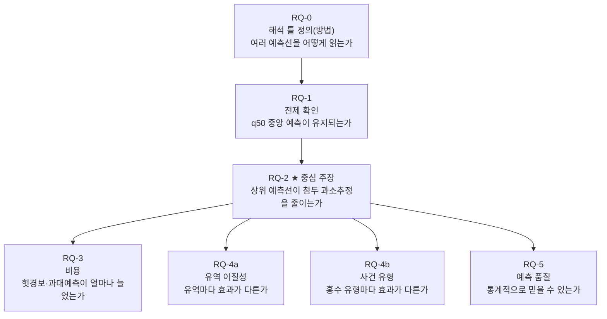
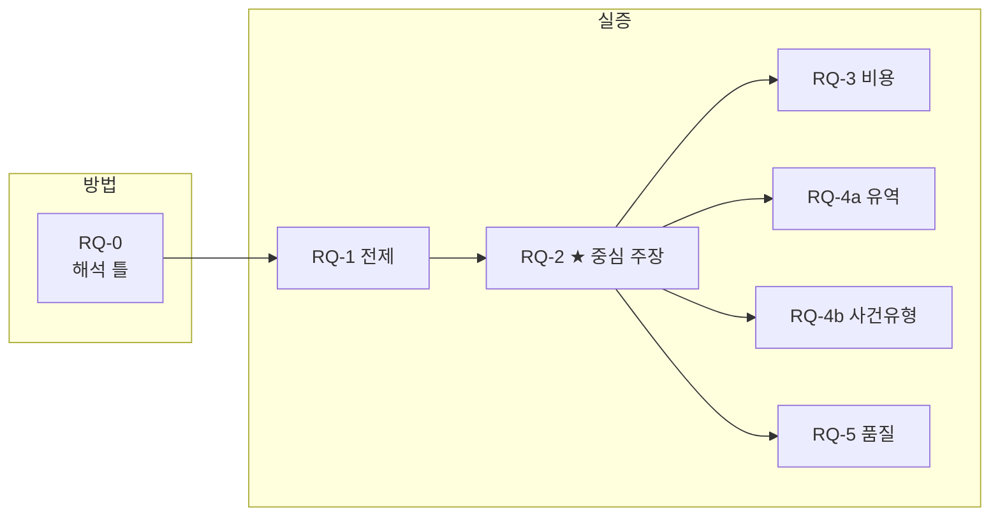

# 08. 분석 지도: 7개 연구 질문(RQ-0~5)

이 글은 "이 연구가 무엇을 어떤 순서로 따지는가"를 한 장의 지도로 보여 준다. 결과 수치를 외우는 것이 목적이 아니다. 뒤에 이어지는 결과 문서들이 각각 어떤 질문에 답하는지 미리 길을 깔아 두는 글이다. 이 지도를 먼저 읽으면 결과 숫자가 나왔을 때 "이게 왜 중요한 숫자인지"를 더 쉽게 이해할 수 있다.

---

## 왜 큰 질문 하나를 여러 작은 질문으로 쪼개는가

연구가 던지는 큰 질문은 하나다.

> **LSTM(Long Short-Term Memory, 시계열 학습 신경망) 모델이 큰 홍수의 꼭대기 값을 너무 낮게 예측하는 문제, 즉 첨두 과소추정(peak underestimation)을 줄일 수 있는가?**

그런데 이 질문을 그대로 들고 분석하면 "어디서부터 확인해야 하는지"가 불분명하다. 예를 들어 "Model 2가 더 낫다"는 결론이 나왔을 때, 그게 전체 성능이 좋아진 건지, 홍수 꼭대기만 좋아진 건지, 특정 유역에서만 그런 건지, 아니면 통계적으로 믿을 수 없는 결과인지를 구분해서 봐야 한다. 그래서 큰 질문을 **7개의 작은 연구 질문(Research Question, 줄여서 RQ)**으로 나눈다.

비유하자면, "이 사람이 건강한가?"라는 큰 질문을 "혈압은 정상인가", "혈당은 정상인가", "콜레스테롤은 어떤가"처럼 항목별로 나눠 검사하는 것과 같다. 각 RQ는 "이것만 따로 확인하자"는 작은 검사 항목이고, 각 RQ마다 그 질문에 답하는 분석 문서가 정확히 하나씩 붙어 있다.

이 지도의 수치·구조 기준은 `docs/experiment/analysis/model/00_research_question_analysis_map.md`와 같은 폴더의 `README.md`다. 이 글은 그 두 문서를 배경지식이 없는 독자가 읽을 수 있게 풀어 쓴 것이다.

---

## 두 모델이 어떻게 다른가 — 출력 설계의 차이

RQ를 이해하려면 두 모델의 차이를 먼저 파악해야 한다.

**Model 1**은 한 시점에 유량 값 하나를 낸다. "지금 이 강의 유량은 Xm³/s다"라고 하나만 말하는 방식이다. 이것을 deterministic(결정형) 예측이라 부른다.

**Model 2**는 한 시점에 네 개의 예측선을 동시에 낸다. "유량이 A 이하일 가능성 50% / 유량이 B 이하일 가능성 90% / 유량이 C 이하일 가능성 95% / 유량이 D 이하일 가능성 99%"처럼 여러 단계를 한꺼번에 제시한다. 이것을 probabilistic quantile(확률 분위) 예측이라 부른다.

이때 각 예측선을 quantile(분위)이라고 부르며, Model 2가 내는 네 줄은 각각 `q50`, `q90`, `q95`, `q99`다.

| 예측선 | 의미 | 비유 |
| --- | --- | --- |
| `q50` | 중앙 예측선. 실제 유량이 이 값 아래에 있을 가능성이 50% | 기상 예보에서 "중간값 예측" |
| `q90` | 좀 더 보수적인 예측선. 실제 유량이 이 값 아래에 있을 가능성이 90% | "90% 안쪽을 노리는 예측" |
| `q95` | 더 보수적인 예측선 | — |
| `q99` | 가장 보수적인 예측선. 거의 최악의 경우를 포함하려고 높게 잡은 선 | "안전마진을 크게 잡은 예측" |

`q50`에서 `q99`로 갈수록 예측선이 위쪽에 그려진다. 즉 `q99`는 "실제 홍수가 이보다 더 크게 오는 경우는 거의 없다"는 보수적 예측선이다.

두 모델 사이에서 **핵심적으로 바뀐 것은 출력 방식 하나**다. 학습 데이터, 유역 조건, LSTM 구조, 학습 기간은 모두 동일하다. 이 때문에 결과 차이를 "출력 설계의 차이"로 해석할 수 있다.

| 항목 | Model 1 | Model 2 |
| --- | --- | --- |
| 출력 | 유량 값 하나 (`Q_hat`) | 분위 예측 네 줄 (`q50`, `q90`, `q95`, `q99`) |
| 손실 함수 | NSE (평균 오차 기반) | pinball loss (분위 오차 기반) |
| 비유 | "예상 기온은 15도" | "기온이 10도 이하일 확률 50%, 18도 이하일 확률 95%" |

---

## 모든 RQ에 공통으로 깔린 고정 조건

RQ를 보기 전에, 모든 분석이 똑같이 깔고 가는 실험 조건을 확인한다. 이 조건이 흔들리면 "Model 2가 더 낫다"는 비교 자체가 공정하지 않기 때문이다.

| 고정 조건 | 내용 | 왜 고정하는가 |
| --- | --- | --- |
| 평가 유역 | expanded DRBC observed test **85개 유역** | 모델이 학습 중 본 적 없는 지역에서 평가해야 진짜 일반화 능력이 보인다 |
| 반복 실행 | seed `111 / 222 / 444` 세 번 짝지어 비교 | 한 번의 우연한 결과가 결론이 되지 않게 한다. seed란 모델 초기값을 결정하는 숫자다 |
| 평가 기간 | test `2014-2016` | 학습(2000-2010)·검증(2011-2013)과 겹치지 않는 기간에서만 성능을 잰다 |
| 큰 유량 기준 | 유역별 Q99 단일 기준 | 유역마다 강 크기가 달라서, 각 유역 안에서 "상위 1% 유량"을 따로 정의한다 |

**Q99란 무엇인가.** 학습 기간(2000-2010) 동안 그 유역에서 관측된 시간별 유량 전체를 크기 순서로 세웠을 때 상위 1%에 해당하는 값이다. 비유하자면 반에서 100명이 시험을 봤을 때 1등부터 99등까지는 Q99 아래이고, 1등(가장 높은 유량)만 Q99를 넘는다. 유역마다 이 기준이 다르기 때문에 "작은 강에서 큰 홍수", "큰 강에서 큰 홍수"를 같은 기준으로 비교할 수 있다.

**85개 유역이란 어디인가.** DRBC(Delaware River Basin Commission, 델라웨어 강 유역 관리 위원회)가 관할하는 지역에 속하면서, 관측 자료가 충분해 평가에 쓸 수 있다고 판정된 유역들이다. 학습에는 이 유역들을 전혀 쓰지 않았다.

---

## 이 연구가 내놓는 두 가지 결과물

연구의 결과물은 두 종류다. 이 구분이 RQ를 0번과 1~5번으로 가르는 기준이다.

**첫 번째 결과물 (방법)**: `q50/q90/q95/q99`처럼 여러 예측선을 동시에 어떻게 읽을지 규칙을 정한 해석 틀(framework). 이것이 **RQ-0**이다.

**두 번째 결과물 (실증)**: 그 해석 틀 위에서, Model 2가 실제로 Model 1보다 첨두 과소추정을 줄이는지 데이터로 확인한 결과. 이것이 **RQ-1부터 RQ-5까지**이다.

RQ-0은 "어떻게 읽을지 약속"이고, RQ-1~5는 "그 약속대로 읽었을 때 정말 그런지 확인"이다. 이 두 결과물을 논문이 동시에 제시하기 때문에 "이중 deliverable(결과물)"이라고 부른다.

---

## 7개 RQ 한눈에 보기



| RQ | 한 문장 질문 | 역할 | 분석 문서 |
| --- | --- | --- | --- |
| RQ-0 | 여러 예측선을 동시에 어떻게 읽을 것인가 | 방법(틀) | `quantile_output_interpretation.md` |
| RQ-1 | `q50`이 중앙 예측 성능을 유지하는가 | 전제 | `01_q50_central.md` |
| RQ-2 | 상위 예측선이 첨두 과소추정을 줄이는가 | **중심 주장** | `02_upper_quantile_peak_under.md` |
| RQ-3 | 그 대가(헛경보·과대예측)는 얼마인가 | 비용 | `03_cost.md` |
| RQ-4a | 유역마다 효과가 어떻게 다른가 | 일반화(유역) | `04a_basin_cohort.md` |
| RQ-4b | 홍수 유형마다 효과가 어떻게 다른가 | 일반화(사건) | `04b_event_type.md` |
| RQ-5 | quantile 예측이 통계적으로 믿을 만한가 | 예측 품질 | `05_calibration_sharpness.md` |

분석 문서는 모두 `docs/experiment/analysis/model/` 안에 있다. `quantile_output_interpretation.md`만 `docs/experiment/method/model/`에 있다.

---

## RQ별 깊이 읽기

### RQ-0. 여러 예측선을 동시에 어떻게 읽을 것인가 (방법)

#### 무엇을 묻는가

Model 2는 매 시점에 `q50/q90/q95/q99` 네 줄을 동시에 내놓는다. 이 네 줄을 "어떤 의미로 읽어야 하고, 어떤 해석은 잘못된 것인가"를 사전에 정해 두는 질문이다.

#### 왜 이 질문이 필요한가

해석 규칙을 먼저 못 박지 않으면 같은 그래프를 보면서도 사람마다 다른 결론을 낼 수 있다. 특히 다음 두 가지 오해가 흔히 발생한다.

- **오해 1**: "`q99`는 99년에 한 번 오는 홍수 수준이다." 이것은 틀렸다. `q99`는 "지금 이 시점의 조건에서 모델이 예측한 상위 분위선"이지, 재현 기간(return period)과는 다른 개념이다.
- **오해 2**: "`q50`부터 `q99`까지를 예측 구간(prediction interval)으로 보면 된다." 이것도 틀렸다. 이 연구의 Model 2는 하위 분위선(`q1`, `q5` 등)을 내지 않기 때문에 양방향으로 대칭적인 예측 구간을 만들 수 없다.

#### 어떤 분석으로 답하는가

방법론 문서(`docs/experiment/method/model/quantile_output_interpretation.md`)가 이 해석 규칙의 공식 기준이다. 여기서는 네 줄을 네 개의 해석 층(layer)으로 읽는 방법, 짝지어 읽는 방법(pairwise reading), 순서대로 위로 올라가며 읽는 방법(sequence reading), 그리고 금지된 해석 목록 여섯 가지를 정한다.

#### 결과를 어떻게 읽는가

이 RQ는 수치 결과가 아니라 "규칙"이다. 뒤에 나오는 모든 RQ에서 쓰는 용어와 해석 방식이 여기서 나온다. RQ-0이 흔들리면 RQ-1~5의 결과 해석도 흔들린다.

> **핵심 요약**: RQ-0은 "네 줄을 읽는 언어"를 정하는 약속이다. 이 약속이 없으면 나머지 분석이 제각각이 된다.

---

### RQ-1. 중앙 예측선이 성능을 유지하는가 (전제)

#### 무엇을 묻는가

Model 2의 `q50`이 Model 1의 단일 예측만큼, 또는 그에 비슷하게 평상시 유량을 잘 맞히는지를 묻는다. 여기서 "중앙 예측"이란 `q50`을 Model 1의 단일 예측과 같은 자리에 놓고 비교한다는 뜻이다.

#### 왜 이 질문이 필요한가

이 질문이 없으면 다음과 같은 반박이 가능하다. "Model 2의 `q99`가 홍수 꼭대기를 잘 잡는 건, 모델이 전체적으로 예측을 높게 잡도록 학습됐기 때문이 아닌가? 평상시 예측은 망가진 거 아닌가?" RQ-1은 이 반박을 미리 차단하는 전제 확인이다.

비유하자면, 새로 사온 온도계가 "35도 이상의 고열은 더 정확하게 잰다"고 광고한다면, "그 온도계가 정상 체온(36~37도)도 제대로 재는가"부터 확인해야 한다는 것과 같다.

#### 어떤 분석으로 답하는가

분석 문서 `01_q50_central.md`가 이 질문을 담당한다. 85개 유역 각각에서 Model 1과 Model 2 `q50`의 성능 지표를 계산하고 짝지어 비교(paired comparison)한다.

사용하는 지표는 세 가지다.

| 지표 | 한국어 풀이 | 방향 | 직관적 의미 |
| --- | --- | --- | --- |
| NSE | Nash-Sutcliffe Efficiency, 적합도 지표 | 클수록 좋음 (최대 1) | 1이면 완벽, 0이면 평균만큼, 음수면 평균보다 나쁨 |
| RMSE | Root Mean Square Error, 평균 제곱근 오차 | 작을수록 좋음 | 예측이 관측에서 평균적으로 얼마나 벗어나는지 |
| MAE | Mean Absolute Error, 평균 절대 오차 | 작을수록 좋음 | 예측 오차의 절댓값 평균 |

NSE를 좀 더 풀어서 설명하면, 모든 시점에서 "그냥 전체 평균을 예측했을 때의 오차"를 기준 1로 놓고, 모델이 그것보다 얼마나 나은지를 0~1 사이 점수로 나타낸 것이다. NSE가 0.7이면 "그냥 평균 예측보다 70% 오차를 줄인 것", NSE가 0.9면 "90% 줄인 것"이다.

#### 결과를 어떻게 읽는가

분석 문서는 85개 유역 중앙값 기준으로 Model 2 `q50`이 Model 1보다 NSE +0.149, RMSE −0.273, MAE −0.197을 기록했다고 보고한다. 양수(+)인 NSE는 더 좋아졌다는 뜻이고, 음수(−)인 RMSE·MAE는 오차가 줄었다는 뜻이다.

즉 중앙 예측이 Model 1보다 나빠지기는커녕 오히려 약간 나아졌다. 이것으로 RQ-2의 전제가 성립한다.

> **이 값이 중요한 이유**: Model 2가 홍수 첨두를 더 잘 잡는다는 주장은 "평상시를 희생하지 않고" 그렇게 한다는 조건이 붙어야 설득력이 있다. RQ-1은 그 조건이 충족됨을 확인한다.

---

### RQ-2. 상위 예측선이 첨두 과소추정을 줄이는가 (중심 주장)

#### 무엇을 묻는가

이 연구 전체의 핵심 주장이 여기서 시험된다. 실제로 유량이 크게 치솟은 사건(이벤트)에서 `q90/q95/q99`가 그 꼭대기를 얼마나 따라잡는지를 묻는다.

사건은 두 종류로 나눠 본다.

1. **Q99 초과 사건**: 관측 유량이 그 유역의 Q99(학습 기간 상위 1% 기준)를 넘어선 시간 구간.
2. **NOAA 확인 홍수 사건**: NOAA(National Oceanic and Atmospheric Administration, 미국 해양대기청)가 공식 홍수로 기록한 실제 사건.

두 종류를 모두 보는 이유는 Q99 초과가 모든 홍수를 포함하지 않을 수 있고, 반대로 모든 NOAA 홍수가 Q99를 넘지 않을 수도 있기 때문이다. (실제로 분석하면 NOAA 공식 홍수의 100%가 Q99 초과 구간 안에 들어오지만, Q99 초과 구간의 16.7%만 NOAA 공식 홍수에 해당한다. 즉 Q99 기준이 더 넓다.)

#### 왜 이 질문이 필요한가

논문이 증명하려는 바로 그 주장이기 때문이다. "probabilistic quantile 예측으로 바꾸면 첨두 과소추정을 줄일 수 있다"는 주장이 데이터로 지지되는지가 여기서 판가름 난다.

#### 어떤 분석으로 답하는가

분석 문서 `02_upper_quantile_peak_under.md`가 담당한다. 세 가지 지표(α, β, δ)로 답한다. 이 세 가지를 묶어 "지표 세트(metric triplet)"라 부른다.

**α (알파): 사건별 첨두 부족분**

각 사건에서 "예측 꼭대기가 실제 꼭대기보다 얼마나 낮은가"를 비율로 잰다.

```
α = (실제 꼭대기 − 예측 꼭대기) / 실제 꼭대기
```

α가 0이면 예측이 실제 꼭대기를 정확히 맞혔다는 뜻이다. α가 0.5면 예측이 실제 꼭대기의 절반 높이밖에 안 됐다는 뜻이다. α가 클수록 과소추정이 심하고, 작을수록 꼭대기를 잘 따라잡은 것이다.

비유하자면, 실제 홍수 수위가 10m까지 올랐는데 모델이 7m라고 예측했다면 α = 0.3이다. 모델이 9.8m라고 예측했다면 α = 0.02다.

**β (베타): 꼭대기 시점 전후 포착 여부**

실제 꼭대기가 발생한 시점 앞뒤 ±6시간 안에서, 예측이 실제 꼭대기 높이에 도달했는지를 유무(0 또는 1)로 잰다.

α는 "얼마나 낮게 잡았냐"를 보고, β는 "그 시간대 근처에서 한 번이라도 높게 잡았냐"를 본다. α가 낮아도(잘 맞아도) β가 1이고, α가 다소 높아도(좀 낮아도) β가 0일 수 있다.

**δ (델타): 전체 Q99 초과 시점 회수율**

Q99를 넘는 모든 시점을 모았을 때, 예측도 Q99를 넘은 시점의 비율이다. "기준선 위를 예측이 얼마나 따라잡는가"의 전체 회수율(recall)이다.

```
δ = (예측도 Q99를 넘은 시점 수) / (실제로 Q99를 넘은 시점 수)
```

δ가 1.0이면 실제로 Q99를 넘은 모든 시점에서 예측도 Q99를 넘었다는 뜻이다. δ가 0.5면 절반만 잡아냈다는 뜻이다.

#### 결과를 어떻게 읽는가

분석 문서는 `q99`에서 아래 결과를 보고한다.

| 지표 | Q99 사건 기준 | NOAA 사건 기준 | 의미 |
| --- | --- | --- | --- |
| α 중앙값 | 0.018 | 0.172 | Q99 초과 사건에서는 첨두 부족이 거의 없고, NOAA 공식 홍수에서는 17% 부족이 남는다 |
| δ 중앙값 | 0.583 | — | Q99 초과 시점의 58%를 포착 |

`q50` → `q90` → `q95` → `q99`로 갈수록 α 중앙값이 줄어드는 패턴, 즉 "상위 예측선으로 갈수록 첨두를 더 잘 따라잡는" 경향이 관찰되는지가 이 RQ의 핵심 확인 사항이다.

> **주의**: NOAA 사건에서 `q99` α = 0.172는 Q99 기준(0.018)보다 크다. NOAA 공식 홍수는 Q99 초과로 정의되는 것이 아니라 사회적 피해 기준으로 지정되기 때문에, Q99를 훨씬 크게 초과하는 극단적 사건을 포함할 수 있다. 따라서 두 기준의 결과가 다른 것은 자연스럽다.

---

### RQ-3. 그 대가는 얼마인가 (비용)

#### 무엇을 묻는가

RQ-2에서 "상위 예측선으로 갈수록 첨두 과소추정이 줄어든다"는 것을 확인했다면, 그다음 질문은 "그 대신 무엇을 잃는가"이다. 예측선을 위로 올리면 큰 홍수를 잘 잡는 대신, 실제로는 홍수가 아닌데 홍수라고 경보하는 헛경보(false alarm)가 늘어날 수 있다.

#### 왜 이 질문이 필요한가

이득만 보고하고 비용을 숨기면 균형 잡힌 평가가 아니다. 홍수 예보 맥락에서 헛경보는 실제 비용이 있다. 주민이 불필요하게 대피하거나, 경보를 반복해서 잘못 울리면 나중에 진짜 경보를 무시하는 문제("양치기 소년 효과")가 생길 수 있다.

비유하자면, 암 검진에서 위양성(실제로 암이 아닌데 암이라고 나오는 결과)을 줄이려면 판정 기준을 느슨하게 잡아야 하는데, 그러면 암 환자를 더 많이 잡는 대신 불필요한 정밀 검사도 늘어난다. 이 연구도 마찬가지다.

#### 어떤 분석으로 답하는가

분석 문서 `03_cost.md`가 담당한다. 두 가지 지표로 비용을 잰다.

**FAR (False Alarm Ratio, 헛경보 비율)**

실제로는 유량이 Q99 아래였는데 예측이 Q99를 넘었다고 알린 비율이다.

```
FAR = (예측은 Q99 초과인데 실제는 Q99 미만인 시점 수) / (예측이 Q99를 초과한 전체 시점 수)
```

FAR가 0이면 헛경보가 없다는 뜻이다. FAR가 0.3이면 경보를 울린 10번 중 3번이 헛경보라는 뜻이다.

**과대예측 크기 (over-prediction magnitude)**

예측이 실제 관측보다 클 때, 그 초과분의 평균이다. 예측이 얼마나 크게 과장됐는지를 잰다.

#### 결과를 어떻게 읽는가

분석 문서는 `q99` 기준으로 FAR 중앙값 0.016, 과대예측 크기 중앙값 3.44를 보고한다. 그리고 Q99 기준 δ 회수율 이득이 약 8배 증가할 때 FAR는 약 23배 증가한다는 비대칭을 짚는다.

이것을 어떻게 해석해야 하는가.

- **FAR 0.016**: 경보를 울린 100번 중 약 1.6번이 헛경보라는 뜻이다. 절대 수치만 보면 낮다.
- **회수율 대비 비대칭**: 실제 홍수를 더 많이 잡는 이득(8배 증가)보다 헛경보가 늘어나는 비용(23배 증가)이 훨씬 가파르다는 점은 주의가 필요하다.

이 결과는 "q99를 쓰면 무조건 좋다"가 아니라 "이득과 비용을 함께 놓고 판단해야 한다"는 결론으로 이어진다.

> **이 값이 크면/작으면 어떤 뜻인가**
> - FAR가 크면: 헛경보가 많아 경보 신뢰성이 낮다.
> - FAR가 작으면: 경보를 울릴 때 대부분 실제 홍수다.
> - 과대예측 크기가 크면: 예측이 관측보다 크게 부풀려져 있다.

---

### RQ-4a. 유역마다 효과가 다른가 (일반화: 유역 이질성)

#### 무엇을 묻는가

RQ-2의 결과는 85개 유역의 평균적 경향이다. "특정 유역에서만 개선됐고 나머지는 큰 차이가 없다"면, 그 평균은 오해를 부를 수 있다. RQ-4a는 유역을 종류별로 나눠 개선 효과가 고르게 나타나는지, 아니면 어떤 유역에 집중되는지를 묻는다.

나누는 기준은 **Model 1의 NSE 성능을 기준으로 상·중·하 세 단계(tier)로 나누기**이다.

| 단계 | 의미 |
| --- | --- |
| 상위 단계 (top tier) | Model 1이 원래 잘 맞히던 유역 |
| 중간 단계 (mid tier) | 보통 수준 |
| 하위 단계 (bottom tier) | Model 1이 원래 잘 못 맞히던 유역 |

#### 왜 이 질문이 필요한가

개선이 특정 조건에서만 나타난다면, 그 조건을 이해해야 결과를 더 넓은 곳에 적용(일반화)할 수 있다. 반대로 개선이 모든 단계에서 고르게 나타난다면 더 일반적인 주장을 할 수 있다.

#### 어떤 분석으로 답하는가

분석 문서 `04a_basin_cohort.md`가 담당한다. 각 단계별로 α, FAR 같은 핵심 지표를 나눠 비교한다.

#### 결과를 어떻게 읽는가

분석 문서는 하위 단계 유역(bottom tier, Model 1이 원래 성능이 낮은 유역)에서 `q99`의 α가 거의 0에 가까워 첨두를 거의 완전히 회복한다고 보고한다. 즉 개선이 가장 큰 곳은 원래 모델이 가장 약했던 유역이다. 단, 이 단계에서 FAR가 약 0.06으로 다른 단계보다 다소 높다.

직관적으로 해석하면, "기존 모델이 잘 못 따라가던 유역일수록 상위 예측선의 도움이 크다. 하지만 그 대가로 헛경보도 함께 늘어난다."

> **이 결과가 의미하는 바**: 개선이 고르지 않고 약한 유역에 집중된다면, 이 방법이 특히 어려운 유역에서 더 유용하다는 해석이 가능하다. 반대로 애초에 잘 되던 유역에서는 굳이 `q99`를 쓸 이유가 줄어든다.

---

### RQ-4b. 홍수 유형마다 효과가 다른가 (일반화: 사건 유형)

#### 무엇을 묻는가

RQ-4a가 유역의 특성(얼마나 예측이 잘 됐는가)으로 나눴다면, RQ-4b는 **홍수 사건 자체의 유형**으로 나눈다. NOAA가 기록한 공식 홍수를 유형별로 분류해서, 모델이 어떤 종류의 홍수에서 더 잘 맞히는지 본다.

유형은 주로 두 가지로 나뉜다.

| 유형 | 설명 |
| --- | --- |
| Flash Flood (돌발홍수) | 짧은 시간에 갑자기 수위가 치솟는 홍수. 소규모 유역, 산지, 도시에서 자주 발생. |
| Flood (일반홍수) | 천천히 수위가 오르는 전통적 홍수. 넓은 유역, 큰 강에서 발생. |

#### 왜 이 질문이 필요한가

돌발홍수는 발생과 동시에 수위가 급격히 오르기 때문에 예측하기 훨씬 어렵다. 모델은 주로 수 시간~수십 시간에 걸친 강수와 토양 조건을 학습하는데, 몇 시간 만에 결과가 나타나는 돌발홍수는 그 패턴이 매우 다르다. 따라서 유형별로 모델 성능이 다를 것을 예상할 수 있고, 이를 확인하는 것이 RQ-4b다.

#### 어떤 분석으로 답하는가

분석 문서 `04b_event_type.md`가 담당한다. NOAA 공식 홍수 사건에 유형 레이블을 붙이고, 유형별로 α 등 핵심 지표를 비교한다.

#### 결과를 어떻게 읽는가

분석 문서는 아래 패턴을 보고한다.

| 유형 | `q99` α 결과 | 해석 |
| --- | --- | --- |
| 돌발홍수 (Flash Flood) | 0.42 잔존 | 여전히 꼭대기를 42% 정도 낮게 잡는다. 가장 어려운 유형. |
| 일반홍수 (Flood) | 0.06 | 꼭대기를 거의 회복한다. |

돌발홍수에서 α = 0.42는, 실제 꼭대기의 42%만큼을 여전히 낮게 잡는다는 뜻이다. 이것은 `q99`를 써도 돌발홍수의 극단적 꼭대기는 완전히 따라잡기 어렵다는 사실을 보여 준다.

> **이 결과가 의미하는 바**: 이 연구의 방법이 일반홍수 예측에는 효과적이지만, 돌발홍수처럼 시간이 매우 짧고 극단적인 사건에는 한계가 남는다. 이것은 논문의 한계이자, 후속 연구의 출발점이 된다.

---

### RQ-5. quantile 예측이 통계적으로 믿을 만한가 (예측 품질)

#### 무엇을 묻는가

RQ-2와 RQ-3이 "운영상 도움이 되는가"(실용적 관점)를 봤다면, RQ-5는 "통계적으로 올바른 예측인가"(통계적 관점)를 본다. 두 가지를 확인한다.

- **보정(calibration)**: 모델이 "90% 확률로 이 값 이하"라고 했을 때 실제로도 90% 가까이 그 아래에 있는가?
- **날카로움(sharpness)**: 예측선이 불필요하게 넓게 잡히지 않고 충분히 좁게 날카로운가?

#### 왜 이 질문이 필요한가

아무리 운영상 도움이 돼도, 통계적으로 잘못 보정된 예측이라면 신뢰성이 낮다. 예를 들어 `q99`가 항상 실제 관측보다 훨씬 높게 잡혀 있다면, 이 선은 "보수적인 예측"이 아니라 "의미 없이 높은 선"이 될 수 있다. 반대로 `q99`가 낮게 잡혀 있다면, 모델이 예측한 "99% 이하"가 실제로는 80%밖에 안 들어오는 상황이 된다.

비유하자면, 일기예보에서 "내일 비 올 확률 80%"라고 100번 예보했을 때, 실제로 80번 비가 왔다면 잘 보정된 예보다. 만약 50번만 비가 왔다면 "80%라고 말했지만 실제로는 50% 수준"인 것이다.

#### 어떤 분석으로 답하는가

분석 문서 `05_calibration_sharpness.md`가 담당한다. 아래 지표들을 확인한다.

**실제 포함 비율 (empirical coverage)**

관측값이 실제로 그 예측선 아래에 들어온 비율이다. 예를 들어 `q99`에 대한 실제 포함 비율이 0.99라면, 관측값의 99%가 `q99` 아래에 들어온다는 뜻이다. 이것이 명목 확률과 일치할수록 잘 보정된 것이다.

**pinball loss (분위 예측 오차 지표)**

각 예측선이 실제 관측에서 얼마나 벗어나는지를 분위 기준으로 잰 오차다. 이름이 "핀볼"인 이유는 한쪽 방향(과소추정)과 다른 방향(과대추정)에 서로 다른 패널티를 주는 비대칭 함수를 쓰기 때문이다. 작을수록 좋다.

**꼬리 구간 적중률 (tail hit-rate)**

Q99를 넘는 매우 극단적인 시점에서 `q99` 예측선이 그 값을 포함했는지의 비율이다.

#### 결과를 어떻게 읽는가

분석 문서는 `q99`에 대해 아래를 보고한다.

| 지표 | 값 | 명목 기대값 | 해석 |
| --- | --- | --- | --- |
| 실제 포함 비율 | 0.787 | 0.99 | 과소포함(undercoverage). 관측값이 `q99` 아래에 들어오는 비율이 기대보다 낮다 |
| pinball loss 평균 | 1.638 | — | 네 예측선(`q50/q90/q95/q99`) 중 가장 낮음 |
| Q99 꼬리 적중률 | 0.563 | — | Q99를 넘는 시점의 56%를 `q99` 예측선이 포함 |

실제 포함 비율 0.787은 `q99`가 "거의 최악의 경우를 포함"하도록 설계됐지만, 실제로는 관측값의 21%가 `q99`를 초과한다는 뜻이다. 이것은 모델이 충분히 보수적이지 않다는 신호다. 그러나 동시에 pinball loss가 가장 낮다는 것은 `q99`가 오차의 방향을 맞게 잡고 있다는 신호다.

> **두 신호를 어떻게 함께 읽는가**: 포함 비율은 낮지만 pinball loss는 좋다는 것은, 모델이 "완벽한 97%·99% 보정"은 아니지만 극단값 방향으로 예측을 더 올려 잡는 경향은 학습했다는 해석이 가능하다. RQ-2에서 α가 줄어드는 것과 연결되는 신호다.

---

## 보조 확인: Q99 사건과 NOAA 사건의 겹침

RQ-2에서 두 종류의 사건(Q99 초과 / NOAA 공식 홍수)을 모두 쓴다고 했는데, 이 두 종류가 얼마나 겹치는지를 따로 확인하는 보조 분석이 있다.

결과는 아래와 같다.

- NOAA 공식 홍수 65건 전부가 Q99 초과 구간 안에 들어온다 (100% 포함).
- 반대로 Q99 초과 구간의 16.7%만 NOAA 공식 홍수에 해당한다.

즉 Q99 기준이 더 넓고, NOAA 공식 홍수는 Q99 초과 구간의 일부분이다. 이 확인은 두 사건 정의가 서로 다른 크기의 원이지만 NOAA 원이 Q99 원 안에 들어 있는 구조임을 보여 준다.

---

## RQ들이 이어지는 논리 — 다시 보기

각 RQ가 단독으로 서 있는 것이 아니라 서로 의존하고 보완한다는 점이 중요하다.

| 역할 | RQ | 이 RQ가 없으면 생기는 문제 |
| --- | --- | --- |
| 해석 약속 | RQ-0 | 같은 결과를 보고도 사람마다 다른 결론을 낸다 |
| 전제 확인 | RQ-1 | "평상시를 희생한 게 아니냐"는 반박을 막을 수 없다 |
| 중심 주장 | RQ-2 | 연구 핵심 질문 자체가 답이 없다 |
| 비용 공개 | RQ-3 | 이득만 보고하는 편향된 연구가 된다 |
| 유역 일반화 | RQ-4a | "특정 유역에서만 통하는 것"인지 모른다 |
| 사건 일반화 | RQ-4b | "어떤 홍수에서만 통하는 것"인지 모른다 |
| 통계 근거 | RQ-5 | 운영 결과가 통계적으로 탄탄한 근거 위에 있는지 알 수 없다 |



흐름을 이야기로 읽으면 이렇다.

1. RQ-0이 "네 예측선을 이렇게 읽겠다"는 언어를 정한다.
2. RQ-1이 "평상시 예측이 무너지지 않았다"는 전제를 세운다.
3. RQ-2가 "그 언어로 읽었을 때, 상위 예측선이 실제로 홍수 꼭대기 과소추정을 줄인다"는 핵심 주장을 증명한다.
4. RQ-3이 "하지만 헛경보라는 비용도 같이 딸려 온다"고 공개한다.
5. RQ-4a·4b가 "이 개선이 어디서 더 크고 어디서 한계가 있는지"를 구체화한다.
6. RQ-5가 "이 결과가 통계적으로 탄탄한 기반 위에 있는지"를 확인한다.

---

## 이 분석에서 다루지 않는 것

이 RQ 목록이 이 연구의 전부라고 생각하면 안 된다. 아래 분석들은 현재 논문의 공식 범위 밖이다.

- 사건 유형을 ML 군집(clustering)으로 자동 분류하는 실험
- SHAP(기계학습 기여도 분석)을 이용한 기상 입력 변수 중요도 분석
- 극한호우 stress test (hourly 강수 자료에서 ARI 25/50/100년급 사건을 뽑아 테스트)
- Checkpoint sensitivity 진단 (여러 학습 단계에서 성능이 얼마나 달라지는지)

이 분석들은 탐색적으로 수행됐고, `docs/archive/analysis_legacy/`에 보존되어 있지만 공식 결론으로 인용하지 않는다.

---

## 다음 글로 가는 길

이 지도에서 7개 RQ의 구조를 파악했다면, 이제 각 RQ의 실제 결과를 보러 갈 수 있다.

- **09 핵심 결과**: RQ-1과 RQ-2를 중심으로 Model 2가 첨두 과소추정을 실제로 줄였는지, α·β·δ 지표의 구체적인 수치를 본다.
- **10 q99 분석**: 상위 예측선 `q99`가 큰 유량 구간에서 어떻게 동작하는지, Q99 초과 사건과 NOAA 사건을 나눠 더 깊게 본다.
- **11 이질성·품질**: RQ-4a·RQ-4b·RQ-5에 해당하는 유역 단계별 차이, 홍수 유형별 차이, 그리고 보정·날카로움 품질을 본다.
- **12 관측 위치 구간 신호**: 실제 첨두가 예측 밴드(`q50`~`q99`) 안에서 어디에 위치하는지와, 그 위치를 예측하는 신호(상승 기울기 등)를 본다.
- **13 결과 종합**: 7개 RQ의 답을 모아 연구의 최종 결론과 한계를 정리한다.
