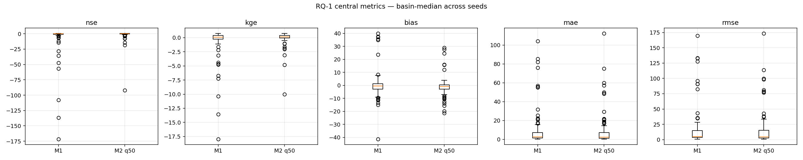
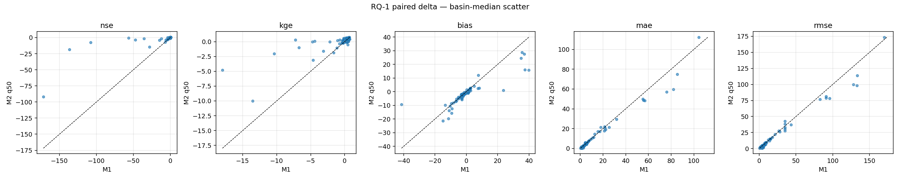
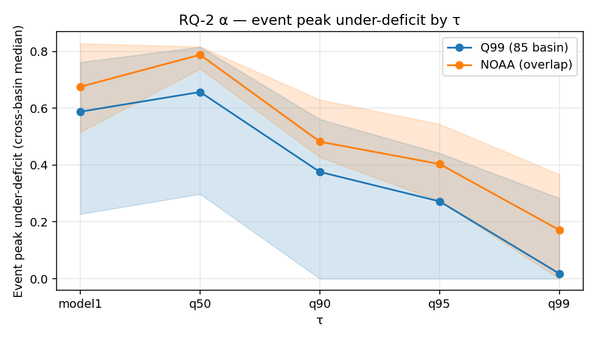
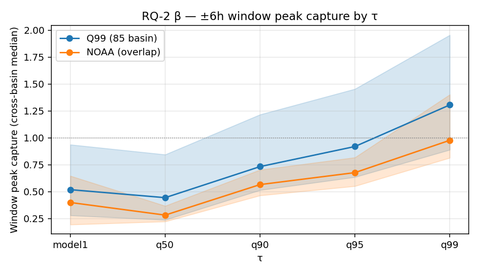
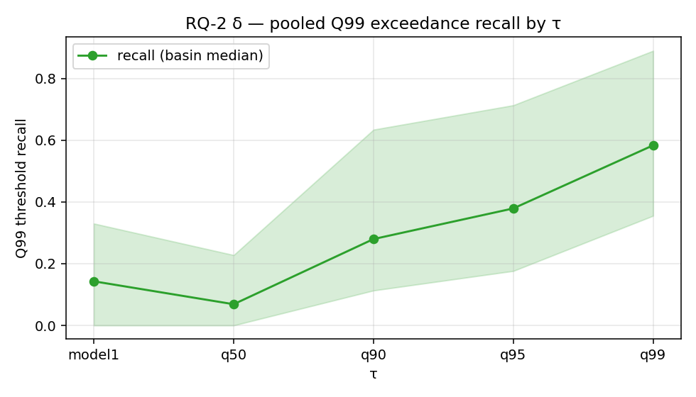
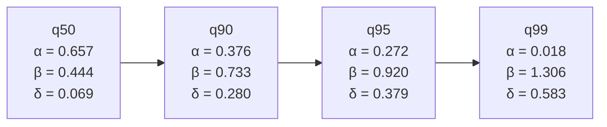
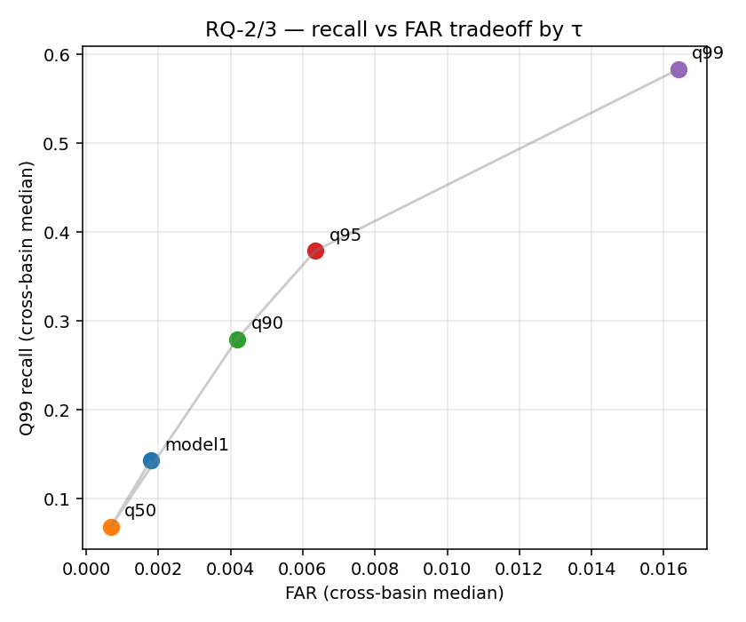
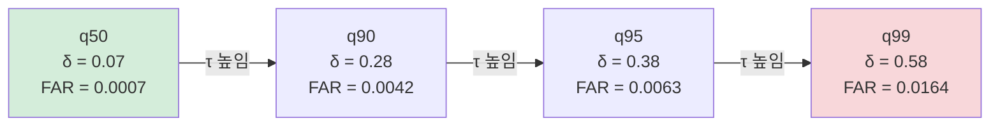

# 09. 핵심 결과: 중앙 예측 유지·상위 quantile 첨두 및 그 비용

이 문서는 이 연구의 핵심 결과를 비전공 대학생이 한 흐름으로 따라 읽도록 정리한다. 수문학이나 기계학습 배경이 전혀 없어도 따라올 수 있게, 개념을 일상어로 먼저 풀고 나서 숫자를 붙인다. 모든 수치는 실제 분석 산출물에서만 가져왔고, 각 수치를 만든 계산이 코드의 어느 함수에서 어떻게 나오는지를 본문에 코드 인용으로 함께 둔다. 어디서 나온 숫자인지 추적할 수 있어야 비전공자도 결과를 믿고 읽을 수 있기 때문이다.

이 글은 입문용 설명이며 공식 기준 문서가 아니다. 수치·구조의 공식 근거는 분석 문서 폴더[^src-analysis-dir]의 세 분석 문서(`01_q50_central.md`, `02_upper_quantile_peak_under.md`, `03_cost.md`)가 보관한다. 연구 질문 전체 지도(RQ-0~5, RQ-4가 4a·4b로 갈려 질문 7개)는 [`08_rq_analysis_map.md`](08_rq_analysis_map.md)에 있다.

---

## 이 문서의 큰 그림

전체 결과는 세 질문(RQ-1, RQ-2, RQ-3)으로 나뉜다. 셋은 다음 한 줄 이야기로 차례로 이어진다.

```text
(RQ-1 / 전제)
  중앙 예측은 손해 없이 유지되는가?
          ↓  "그렇다" → 그렇다면 위쪽 위험선을 더 쓸 수 있다
(RQ-2 / 중심 주장)
  더 높게 잡는 예측선이 큰 물의 첨두를 덜 놓치는가?
          ↓  "그렇다" → 하지만 이건 공짜가 아니다
(RQ-3 / 그 대가)
  높이 잡으면 위경보와 과대예측은 얼마나 늘어나는가?
```

이 세 질문이 **차례로** 이어진다는 점이 중요하다. RQ-1이 충족되지 않으면 RQ-2의 주장은 힘을 잃는다. 따라서 RQ-1은 단순한 확인 절차가 아니라 전체 논리 구조의 토대다. 각 질문을 순서대로 따라가면 "왜 이런 연구를 했는가 → 무엇을 발견했는가 → 그 한계는 무엇인가"가 자연스럽게 펼쳐진다.

세 질문의 수치는 모두 같은 입력 파일과 같은 폴더 구조에서 계산된다. 계산 스크립트와 산출 위치는 다음과 같다.

- 계산 스크립트: `scripts/model/expanded_drbc/`
  - RQ-1: `compute_rq1_central_metrics.py`
  - RQ-2: `compute_rq2_alpha_peak_deficit.py`, `compute_rq2_beta_window_capture.py`, `compute_rq2_delta_threshold_recall.py`
  - RQ-3: `compute_rq3_cost.py`
- 공통 입력: `output/model_analysis/primary/metrics/data/required_series/seed{111,222,444}/required_series.csv`
- 산출물: `output/model_analysis/primary/metrics/` 아래 `tables/`(수치 표)와 `figures/`(그림)

공통 입력 파일 `required_series.csv`에는 seed별로 다음 열이 시각(`datetime`)·유역(`basin`)별로 들어 있다.

| 열 이름 | 담는 값 |
| --- | --- |
| `obs` | 실제 관측 유량 |
| `model1` | Model 1의 단일 예측 |
| `q50` `q90` `q95` `q99` | Model 2의 네 예측선 |

---

## 먼저 알아야 할 개념들

### 강의 유량 예측의 의미

이 연구의 목표는 강의 유량(streamflow, 단위 시간에 특정 지점을 지나는 물의 양)을 시간 단위로 예측하는 것이다. 비가 얼마나 왔는지, 기온이 어땠는지, 앞 시각 유량이 얼마였는지 같은 정보를 넣으면, 모델이 다음 시각 유량을 예측한다.

홍수 예보에서 이 예측이 중요한 이유는, 실제 강물이 얼마나 높이 올라올지를 미리 알아야 대피와 차단 여부를 결정할 수 있기 때문이다. 예측이 너무 낮으면 위험한 홍수를 안전하다고 오판하고, 너무 높으면 불필요한 대피령으로 신뢰를 잃는다.

### LSTM — 시간 흐름을 기억하는 인공신경망

**LSTM**(Long Short-Term Memory, 시계열 학습 신경망)은 시간 순서가 있는 자료를 학습하도록 설계된 인공신경망의 한 종류다. 강의 유량은 어제 비가 얼마나 왔는지, 지난 며칠간 토양이 얼마나 포화됐는지에 따라 달라진다. 그래서 단순히 "지금 이 순간"의 정보만 보는 것이 아니라, 과거 수십~수백 시간의 흐름을 기억하면서 예측하는 구조가 필요하다. LSTM이 이 역할을 한다.

### 두 모델의 차이

이 연구는 같은 LSTM 구조를 두 방식으로 학습한 결과를 비교한다.

| 구분 | Model 1 | Model 2 |
| --- | --- | --- |
| 정식 이름 | Deterministic LSTM (결정형) | Probabilistic Quantile LSTM (확률 분위) |
| 한 번에 내놓는 예측 | **값 하나** | **여러 높이의 예측선 동시에** |
| 비유 | "이 시각 유량은 정확히 5.2mm/hr" | "5mm 이하일 수도, 8mm 이상일 수도 있어. 각각 몇 %인지 보여줄게" |
| 학습 목표 | 예측값과 관측값의 차이 최소화 (평균 기반) | 각 높이의 예측선이 관측을 정해진 비율로 넘도록 (분위 기반) |

Model 1은 단 하나의 답을 준다. Model 2는 여러 높이의 답을 동시에 준다. 이 "여러 높이"가 quantile(분위)이다.

### Quantile(분위)의 의미

Quantile은 "전체를 줄세웠을 때 어느 위치인가"를 나타내는 개념이다. 예를 들어 전국 수능 점수에서 q50(50번째 분위)은 중앙값, 즉 딱 절반이 이 값보다 위에 있고 절반이 아래에 있는 점수다. q90은 "상위 10%가 이 값보다 위에 있는 점수"다.

유량 예측에서 q50은 "실제 유량이 이 값보다 높을 확률과 낮을 확률이 각각 50%"인 예측선이다. q90은 "실제 유량이 이 값을 넘어설 확률을 10%로 본 선", q99는 "실제 유량이 이 값을 넘어설 확률을 1%로 본 선"이다. 즉 위로 갈수록 더 보수적으로, 더 높게 잡는다.

```text
유량
  ↑
  |  ........... q99  (가장 높게, 보수적으로 잡는 선)
  |  .......... q95
  |  ......... q90
  |  ....... q50   (중앙 예측선)
  |
  +--> 시간
```

쉽게 말해 q50은 "평소 기대값", q90/q95/q99는 "혹시 이만큼 클 수도 있다는 위쪽 위험선"이다. Model 2의 결과를 하나의 정답 예측으로 보기보다, q50부터 q99까지 이어지는 **예측 밴드(띠)** 로 보는 편이 이 결과를 읽기 편하다.

### Q99 — 유역별 "큰 물" 기준선

각 결과는 "큰 물"을 같은 기준으로 정의해야 비교가 공정하다. 그 기준이 Q99다. Q99는 한 유역의 학습 기간(2000~2010년) 관측 유량을 크기 순서로 줄세웠을 때 상위 1%에 드는 높이다. 이 선을 넘어야 "큰 물 사건"으로 친다. 유역마다 강의 크기가 달라 절대 유량으로는 큰 강과 작은 강을 비교할 수 없는데, 각 유역의 상위 1% 기준을 쓰면 "작은 강에서 큰 홍수"와 "큰 강에서 큰 홍수"를 같은 잣대로 견줄 수 있다.

이 기준선은 매번 새로 정하지 않고 한 번 계산해 둔 표 `tables/rq2_q99_per_basin_thresholds.csv`(열 이름 `q99_train_value`)를 모든 RQ가 공유한다. 평가 기간(2014~2016년)이 아니라 학습 기간으로 기준선을 잡는 이유는, 모델이 평가 기간을 "미리 엿보고" 기준을 맞추는 일을 막기 위해서다.

### 분석 설정 — 어떤 유역·기간을 봤나

| 항목 | 값 |
| --- | --- |
| 평가 유역 | DRBC(Delaware River Basin Commission, 델라웨어 강 유역 관리 위원회) 관측 검증 유역 **85개** (학습에서 완전히 빼 둔 유역) |
| 학습 반복 seed | `111 / 222 / 444` (같은 모델을 무작위 출발점만 달리해 세 번 학습) |
| 평가 기간 | 2014~2016년 (학습·검증에 쓰지 않은 기간) |
| 요약 방식 | 유역별로 먼저 seed 세 개의 중앙값 → 85개 유역의 중앙값 (basin median) |

"DRBC 관측 검증 유역"이란, 이 모델들이 학습 중 한 번도 본 적 없는 유역들이다. 모르는 유역에서도 잘 작동하는지(일반화 성능)를 보기 위해 학습에서 미리 빼 두었다.

요약 방식의 "두 번 중앙값" 절차는 모든 스크립트가 똑같이 따른다(코드 주석에 "C0 canonical"이라 적혀 있다). 먼저 한 유역 안에서 seed 세 개의 값을 중앙값으로 묶고, 그렇게 얻은 85개 유역 값을 다시 중앙값으로 묶는다. 이렇게 두 단계로 묶으면 운 좋은(혹은 나쁜) seed 하나, 혹은 유난히 튀는 유역 하나가 전체 결론을 흔드는 일을 줄일 수 있다. 또 모든 스크립트는 관측값이 비어 있는(NaN) 시각을 같은 공용 helper로 먼저 걸러 내고 계산을 시작한다.

```python
# scripts/model/expanded_drbc/compute_rq1_central_metrics.py: load_seed_csv()
df = pd.read_csv(path, usecols=list(REQUIRED_COLS), dtype={"basin": str})
df["basin"] = df["basin"].map(normalize_basin_id)
df = filter_valid_rows(df, obs_col="obs")   # obs가 NaN인 시각 제거
```

여기서 `filter_valid_rows`는 모든 RQ 스크립트가 공유하는 `expanded_drbc.py`[^src-lib]의 함수다. 같은 필터를 한 곳에서 불러 쓰기 때문에, RQ마다 "어떤 시각을 버릴지"가 다르게 갈리지 않는다.

---

## RQ-1: 중앙 예측선(q50)의 손해 없는 유지 (전제)

### 질문 내용

Model 2는 여러 높이의 예측선을 동시에 내놓도록 더 복잡하게 학습된 모델이다. 그 가운데 중앙 예측선인 q50이, Model 1의 단일 예측과 견줘 **평소 성능을 깎아먹지는 않는지** 확인하는 것이 RQ-1이다.

### 질문 이유

이 논리를 일상 비유로 풀어 보자.

> 어떤 의사가 "이 환자의 혈당은 아마 100mg/dL 정도일 것"(Model 1식 단일 예측) 대신, "60~180mg/dL 사이일 가능성을 모두 보여 주고, 특히 위험한 고혈당 구간은 더 주의해서 표시해 줄게"(Model 2식 범위 예측)로 바꾸었다고 하자. 이 새 방식이 유용하려면, 먼저 중앙 추정값(100mg/dL 쪽)이 예전보다 크게 나빠지지 않아야 한다. 중앙이 무너지면 범위 예측 전체가 쓸모없어진다.

같은 논리가 이 연구에 적용된다. Model 2가 q90/q95/q99 같은 위쪽 위험선을 제공하는 것이 이 연구의 핵심 기여인데, 만약 "위쪽 위험선을 얻기 위해 중앙 예측이 크게 나빠졌다"면 그 위험선의 신뢰도가 의심받는다. 반대로 "중앙 예측은 손해 없이 유지되면서도 위쪽 위험선이 큰 물을 잘 잡는다"면 "기본도 되고 홍수도 잡는다"는 이중 효과를 주장할 수 있다. 따라서 RQ-1의 답이 "그렇다(유지된다)"일 때 비로소 RQ-2의 주장이 힘을 얻는다.

### 분석 목적

RQ-1은 `compute_rq1_central_metrics.py`가 담당한다. 이 스크립트는 입력 파일에서 관측(`obs`), Model 1 예측(`model1`), Model 2 중앙선(`q50`)만 꺼내, 유역별·seed별로 여섯 지표를 한꺼번에 계산한다. 이 글에서는 비전공 독자가 직관적으로 읽을 수 있는 세 가지(NSE·RMSE·MAE)만 추려 본다. 여섯 지표의 전체 목록은 다음과 같다.

| 변수명 | 지표 |
| --- | --- |
| `nse` | NSE 적합도 |
| `kge` | KGE 종합 적합도 |
| `bias` | 편향 = 평균(예측 − 관측) |
| `mae` | 평균 절대 오차 |
| `rmse` | 평균 제곱근 오차 |
| `fhv` | 고유량 편향 (상위 2% 부피 편차, %) |

여섯 지표는 한 함수에서 계산된다. 핵심 정의는 코드에 그대로 박혀 있다.

```python
# scripts/model/expanded_drbc/compute_rq1_central_metrics.py: compute_metrics()
residual = pred - obs
nse = 1.0 - ((residual ** 2).sum() / denom) if denom > 0 else float("nan")
bias = float(residual.mean())
mae = float(np.abs(residual).mean())
rmse = float(np.sqrt((residual ** 2).mean()))
```

이 글에서 다루는 표준 평가지표 세 가지의 참조 카드는 다음과 같다.

| 평가지표 | 범위 | 최적화 방향 |
| --- | --- | --- |
| NSE | 1이 최선 (음수도 가능) | 클수록 좋음 ↑ |
| RMSE | 0 이상 (0이 최선) | 작을수록 좋음 ↓ |
| MAE | 0 이상 (0이 최선) | 작을수록 좋음 ↓ |

아래 수식에서 $Q$는 유량(streamflow)을 뜻하고, 아래첨자 $\text{sim}$은 모델 예측, $\text{obs}$는 실제 관측을 가리킨다. $t$는 시점을 나타낸다. 이 표기는 이 문서의 모든 수식에서 같으며, 본문 산문에서는 "예측", "관측"으로 풀어 쓴다.

#### NSE — 적합도 지표 (Nash-Sutcliffe Efficiency)

$$
\text{NSE} = 1 - \frac{\sum_t (Q_{\text{sim},t} - Q_{\text{obs},t})^2}{\sum_t (Q_{\text{obs},t} - \overline{Q_{\text{obs}}})^2}
$$

분자는 모델이 낸 오차의 제곱 합, 분모는 "그냥 관측 전체 평균($\overline{Q_{\text{obs}}}$)을 예측값으로 썼을 때"의 오차 제곱 합이다. NSE가 1이면 오차가 0인 완벽한 예측, 0이면 그냥 평균을 찍은 것과 같고, 음수면 평균을 찍는 것보다도 나쁘다. NSE 0.7은 "평균 예측보다 오차를 70% 줄였다"로 읽는다. 수문 모델에서 가장 표준적으로 쓰는 점수다.

#### RMSE — 평균 제곱근 오차 (Root Mean Square Error)

$$
\text{RMSE} = \sqrt{\frac{1}{N}\sum_t (Q_{\text{sim},t} - Q_{\text{obs},t})^2}
$$

각 시점의 예측-관측 차이를 제곱해 평균한 뒤 다시 제곱근을 씌운 값이다. 제곱근을 씌우기 때문에 유량과 같은 단위로 읽힌다. 차이를 제곱하는 과정에서 큰 오차가 훨씬 무겁게 반영되므로, 가끔씩 크게 빗나가는 예측에 민감하다. 작을수록 좋다.

#### MAE — 평균 절대 오차 (Mean Absolute Error)

$$
\text{MAE} = \frac{1}{N}\sum_t \lvert Q_{\text{sim},t} - Q_{\text{obs},t} \rvert
$$

예측-관측 차이의 절댓값을 단순 평균한 값이다. 제곱하지 않으므로 RMSE와 달리 큰 오차에 특별히 더 벌점을 주지 않아, "평소에 얼마나 빗나가는가"를 더 고르게 보여 준다. 작을수록 좋다.

#### 두 모델을 짝지어 비교하는 방식

두 모델을 견주는 차이값은 같은 유역·같은 seed 안에서 먼저 구한 뒤 seed 중앙값으로 묶는다. 코드는 Model 2(q50)에서 Model 1을 뺀 값을 차이로 정의한다.

```python
# scripts/_lib/expanded_drbc.py: paired_delta_per_seed()
delta = (right - left).rename("delta").reset_index()   # right=Model 2, left=Model 1
```

이렇게 같은 자리에서 짝지어 빼면, 유역마다 강의 크기가 달라 생기는 절대 유량 차이가 상쇄돼 "두 모델 중 어느 쪽이 더 나은가"만 깨끗하게 남는다. 검산도 코드에 들어 있는데, 새로 계산한 NSE·KGE를 따로 저장돼 있던 원자료 지표 파일과 맞춰 보아 소수점 6자리(1e-6) 안에서 일치함을 확인했다.

### 결과 해석 방식

85개 유역의 유역별 중앙값(basin median) 기준으로, q50과 Model 1을 비교한 결과는 다음과 같다.

| 지표 | Model 1 | Model 2 q50 | 차이 (q50 − Model 1) | 해석 |
| --- | ---: | ---: | ---: | --- |
| NSE | −0.031 | 0.225 | **+0.149** | q50이 더 좋음 |
| KGE | 0.082 | 0.158 | +0.041 | q50이 더 좋음 |
| RMSE | 4.850 | 4.393 | −0.273 | q50이 더 좋음 (작을수록 좋음) |
| MAE | 2.584 | 2.509 | −0.197 | q50이 더 좋음 (작을수록 좋음) |
| Bias (편향) | −0.459 | −0.948 | −0.437 | q50이 더 낮게 치우침 |
| FHV (%) | −12.3 | −36.1 | **−8.5** | q50이 고유량 구간에서 더 낮게 처짐 |

여섯 지표를 한눈에 비교한 상자그림과, 두 모델을 유역별로 짝지어 흩뿌린 산점도는 아래와 같다.





**좋은 소식**: NSE는 +0.149만큼 올라갔고(높을수록 좋음), RMSE·MAE는 줄었다(작을수록 좋음). q50은 중앙 성능을 **손해 없이, 오히려 전반적으로 약간 개선하며** 유지했다. 전제는 충족된다.

**예외 방향**: 편향(bias)과 고유량 편향(FHV)을 보면 q50이 Model 1보다 관측을 더 **낮게** 예측하는 경향이 있다. 여기서 FHV(Flow High Volume bias, 유량 상위 2% 구간의 부피 편차)는 가장 큰 유량 구간을 얼마나 낮게/높게 잡았는지를 백분율로 나타내며, 음수면 과소추정이다. 이 값을 만드는 계산은 별도 함수에 있다.

```python
# scripts/model/expanded_drbc/compute_rq1_central_metrics.py: _compute_fhv()
n = max(1, round(_FHV_H * len(obs_sorted)))   # _FHV_H = 0.02 → 상위 2%
return float((pred_top.sum() - denom) / denom * 100)   # denom = 관측 상위 2% 합
```

왜 q50이 더 낮게 처질까? 두 모델이 다른 목표로 학습되기 때문이다. Model 1은 예측과 관측의 차이를 제곱해 줄이도록 학습돼 통계적으로 **평균**에 수렴한다. Model 2 q50은 실제 관측이 q50 아래에 오는 비율이 정확히 50%가 되도록 학습돼 통계적으로 **중앙값**에 수렴한다. 강의 유량은 평소에는 낮고 홍수 때만 가끔 매우 높은 "오른쪽 꼬리가 긴" 분포라, 이런 분포에서는 평균이 중앙값보다 높다. 그래서 큰 물 시각에 q50이 Model 1보다 더 아래로 처진다. 이것은 모델의 결함이라기보다 학습 방식의 본질적 차이에서 오는 현상이며, 이 처짐이 바로 다음 질문의 출발점이 된다.

> **q50이 큰 물에서 더 처지는데, 그러면 위쪽 위험선(q90/q95/q99)이 그 부족분을 메워 주는가?** → 이것이 RQ-2다.

---

## RQ-2: 상위 quantile의 첨두 과소추정 완화 (중심 주장)

### 질문 내용

이 연구의 핵심 질문이다. 위쪽 예측선 q90/q95/q99가 Model 1·q50에 견줘, 큰 물의 **첨두(peak, 유량이 가장 높이 솟는 순간)** 를 덜 놓치는지 본다.

첨두 과소추정(peak underestimation)이란, 모델이 실제로 가장 높아지는 순간을 낮게 예측하는 것이다. 비유로 설명하면, 파도의 최고 높이를 예보했는데 실제 파도가 훨씬 높았던 것과 같다. 홍수 관리에서 이 오판은 매우 위험하다.

### 질문 이유

논문이 증명하려는 바로 그 주장이기 때문이다. "probabilistic quantile 예측으로 바꾸면 첨두 과소추정을 줄일 수 있다"는 주장이 데이터로 지지되는지가 여기서 판가름 난다.

### 분석 목적

세 지표 α, β, δ로 잰다(이 세 지표를 묶어 "지표 세트"라 부른다). 모두 사건(event), 곧 "Q99 기준선을 관측 유량이 넘었던 한 번의 사례" 단위에서 출발한다(δ만 사건 단위가 아니라 모든 시각을 합쳐 계산한다). 세 지표가 의지하는 사건 목록은 미리 만들어 둔 표 `tables/rq2_q99_events_85basin.csv`(85개 평가 유역 중 큰 물 사건이 발생한 82개 유역에서 일어난 926건의 큰 물 사건)에 들어 있고, 사건마다 첨두 시각(`peak_time`)과 전후 창의 시작·끝(`window_start`, `window_end`)이 적혀 있다.

각 지표는 서로 다른 스크립트가 계산하고 산출물도 따로 나온다.

- `compute_rq2_alpha_peak_deficit.py` → α(첨두 부족분). 산출 그림 `figures/rq2_alpha_by_tau.png`.
- `compute_rq2_beta_window_capture.py` → β(꼭대기 포착 비율). 산출 그림 `figures/rq2_beta_by_tau.png`.
- `compute_rq2_delta_threshold_recall.py` → δ(Q99 초과 회수율). 산출 그림 `figures/rq2_delta_recall_by_tau.png`.

세 지표의 참조 카드는 다음과 같다.

| 평가지표 | 변수명 | 기호 | 범위 | 최적화 방향 |
| --- | --- | --- | --- | --- |
| 첨두 부족분 | `peak_under_deficit` | α | 0~1 (0이 최선) | 작을수록 좋음 ↓ |
| 꼭대기 포착 비율 | `window_capture` | β | 0 이상 (1=딱 맞음, >1=과대) | 1 근처/↑ |
| Q99 초과 회수율 | `recall` | δ | 0~1 | 클수록 좋음 ↑ |

수식에서 $Q_{\text{obs}}^{\text{peak}}$는 한 사건의 관측 첨두, $Q_{\text{sim}}^{\text{peak}}$는 같은 시각의 예측, $Q_{\text{sim},\tau}$는 분위 $\tau$(예: 0.99)의 예측선을 가리킨다.

#### α — 사건별 첨두 부족분 (per-event peak deficit)

각 사건에서 "예측 꼭대기가 실제 꼭대기보다 얼마나 낮은가"를 비율로 잰다.

$$
\alpha = \frac{\max\!\big(0,\ Q_{\text{obs}}^{\text{peak}} - Q_{\text{sim}}^{\text{peak}}\big)}{Q_{\text{obs}}^{\text{peak}}}
$$

분자의 $\max(0, \cdot)$ 때문에 예측이 실제보다 높게 잡힌 경우는 0으로 처리한다(이 지표는 "낮게 잡은 정도"만 본다). 이 정의는 코드에 한 줄로 들어 있다.

```python
# scripts/model/expanded_drbc/compute_rq2_alpha_peak_deficit.py: compute_alpha()
deficit = max(0.0, (obs - float(pred))) / obs   # obs=관측 첨두, pred=같은 시각 예측선
```

α가 0이면 예측이 실제 꼭대기를 정확히 맞혔거나 더 높게 잡았다는 뜻이고, α가 0.5면 예측이 실제 꼭대기의 절반 높이밖에 안 됐다는 뜻이다. α가 클수록 과소추정이 심하다. 비유하면, 달리기 선수의 실제 최고 속도가 초당 10m인데 코치가 7m/s로 예상했다면 α = 0.3(30% 못 따라감)이다.

#### β — 첨두 전후 ±6시간 창 포착 (window capture)

실제 꼭대기 발생 시점 앞뒤 ±6시간 창 안에서, "그 창 안 예측 최댓값이 그 창 안 실제 최댓값의 몇 배인가"를 비율로 잰다.

$$
\beta = \frac{\max\!\big(Q_{\text{sim}}^{\text{win}}\big)}{\max\!\big(Q_{\text{obs}}^{\text{win}}\big)}
$$

```python
# scripts/model/expanded_drbc/compute_rq2_beta_window_capture.py: compute_window_capture()
ratio = float(pred_max) / float(obs_max)   # 창 = [window_start, window_end] = 첨두 ±6h
```

첨두가 정확히 같은 시각에 일어나기를 기대하는 것은 너무 엄격하므로, 타이밍이 몇 시간 앞서거나 뒤로 빗나가도 잡을 수 있게 창을 연다. β가 1이면 그 시간대 어딘가에서 예측이 실제 꼭대기 높이에 딱 도달, 1보다 작으면 못 미친 것, 1보다 크면 오히려 더 높게 잡은 것이다. 실제 꼭대기가 0 이하인 사건(댐 조절 하천 등)은 비율을 잴 수 없어 빼고, 비율이 2배를 넘으면 따로 표시해 둔다(코드 상수 `CAPTURE_FLAG_THRESHOLD = 2.0`). α와 달리 β는 위로 잘라 내지 않으므로 1을 넘는 값이 나올 수 있다.

#### δ — Q99 초과 시점 회수율 (pooled threshold recall)

실제로 유량이 Q99를 넘은 모든 시점만 모은 다음, 그중 예측 분위 값이 실제 관측 이상으로 따라 올라간 시점의 비율이다.

$$
\delta = P\!\left(Q_{\text{sim},\tau} \geq Q_{\text{obs}} \ \middle|\ Q_{\text{obs}} \geq Q99\right)
$$

```python
# scripts/model/expanded_drbc/compute_rq2_delta_threshold_recall.py: compute_recall_for_seed()
high = merged[merged["obs"] >= merged["q99_train_value"]]   # 실제로 Q99 넘은 시점만
hits = int((sub[tau] >= sub["obs"]).sum())                  # 예측이 실제 높이를 덮은 시점
recall = hits / n_hours
```

즉 "실제로 큰 홍수였던 시점들 중에서, 예측선이 그 실제 높이까지 닿은 시점이 얼마나 되는가"의 회수율(recall)이다. δ가 1.0이면 큰 홍수 시점 전부에서 예측이 실제 높이를 덮었다는 뜻이고, 0.5면 절반만 덮었다는 뜻이다. 코드에는 분모(`n_q99_hours`)가 세 seed에서 똑같아야 한다는 검산도 들어 있다.

### 결과 해석 방식

85개 유역의 유역별 중앙값 기준 결과는 다음과 같다.

**α — 첨두 부족분 (0에 가까울수록 좋음)**

| 예측선 | α 중앙값 | 해석 |
| --- | ---: | --- |
| Model 1 | 0.588 | 첨두를 평균 59% 못 따라갔다 |
| q50 | 0.657 | 첨두를 평균 66% 못 따라갔다 (q50이 더 나쁨) |
| q90 | 0.376 | 첨두를 평균 38% 못 따라갔다 |
| q95 | 0.272 | 첨두를 평균 27% 못 따라갔다 |
| **q99** | **0.018** | 첨두를 평균 2% 못 따라갔다 — 사실상 거의 0 |

q50에서 q99로 가면 α가 0.657 → 0.018로 약 36배 개선이다. 이 단조 감소를 분위(τ)별로 눈으로 확인할 수 있다.



**β — 첨두 전후 6시간 창 포착 (1 전후가 이상적)**

| 예측선 | β 중앙값 | 해석 |
| --- | ---: | --- |
| Model 1 | 0.519 | 6h 창 안에서도 관측 첨두의 52%에 그쳤다 |
| q50 | 0.444 | 6h 창 안에서도 관측 첨두의 44%에 그쳤다 |
| q90 | 0.733 | 6h 창 안에서 관측 첨두의 73%까지 올라갔다 |
| q95 | 0.920 | 6h 창 안에서 관측 첨두의 92%까지 올라갔다 |
| **q99** | **1.306** | 6h 창 안에서 관측 첨두의 130%까지 올라갔다 |

q99에서 β = 1.306이라는 것은 예측선이 첨두 근방에서 관측 첨두를 넘어설 만큼 보수적으로 높게 잡았다는 뜻이다. 첨두를 "덮는" 수준에 도달했다고 볼 수 있다. 단, 1을 넘어서면 다른 곳에서도 과대예측이 늘어난다는 신호이기도 하다(이것이 RQ-3의 주제).



**δ — Q99 초과 회수율 (높을수록 좋음)**

| 예측선 | δ 회수율 중앙값 | 해석 |
| --- | ---: | --- |
| Model 1 | 0.143 | 큰 물 순간의 14%만 잡아냈다 |
| q50 | 0.069 | 큰 물 순간의 7%만 잡아냈다 |
| q90 | 0.280 | 큰 물 순간의 28%를 잡아냈다 |
| q95 | 0.379 | 큰 물 순간의 38%를 잡아냈다 |
| **q99** | **0.583** | 큰 물 순간의 58%를 잡아냈다 |

q50 대비 q99의 회수율은 0.069 → 0.583으로 약 8.4배 개선이다.



#### 방향성 정리



세 잣대 모두 같은 방향을 가리킨다. 예측선을 높일수록 α는 줄고(좋아지고), β는 올라가고(좋아지고), δ는 올라간다(좋아진다). 그리고 그 변화가 **단조적(monotone)** 이다 — 중간에 역전이 없다. 이 단조성은 우연이 아니라 세 스크립트 모두 마지막에 "q50 → q90 → q95 → q99 순서로 값이 한 방향으로만 움직이는지"를 검사해 강제한다. 만약 한 군데라도 역전이 생기면 계산이 멈춘다.

```python
# scripts/model/expanded_drbc/compute_rq2_alpha_peak_deficit.py: main()
assert ordered[i] >= ordered[i + 1] - 1e-9, (
    f"{scope} cross-basin median NOT non-increasing across q50→q99: ..."
)
```

실제로 유역별로 따로 봐도 이 순서를 어기는 비율은 0%였다고 α 스크립트에 기록돼 있다.

#### NOAA 확인 홍수 사건 점검

위의 결과는 "Q99 기준선을 넘은 사건" 전체를 대상으로 했다. 더 엄격한 점검으로, NOAA(National Oceanic and Atmospheric Administration, 미국 해양대기청)가 실제 홍수로 공식 확인한 사건만 모은 별도 집합(평가 기간에 겹치는 21개 유역, 65개 사건)으로도 같은 분석을 했다. 이 사건 목록은 `tables/rq2_noaa_events_expanded_overlap.csv`에서 읽어 오는데, α·β 스크립트가 이 표를 불러올 때 85개 평가 유역에 드는 사건(`in_expanded_85`)이면서 평가 기간(2014~2016년)에 일어난 사건만 남기도록 코드에서 추려 낸다.

| 예측선 | α (NOAA 사건) | β (NOAA 사건) |
| --- | ---: | ---: |
| q50 | 0.788 | 0.282 |
| q90 | 0.482 | 0.566 |
| q95 | 0.404 | 0.677 |
| **q99** | **0.172** | **0.977** |

방향이 일치한다. 실제 홍수 사건에서도 q99는 첨두 부족분을 17%까지 줄이고, 6시간 창 안에서 관측 첨두의 98%까지 올라갔다. 절댓값이 Q99 전체보다 나쁜 것은 NOAA 확인 사건이 더 극단적인 사건들을 포함하기 때문이다. 표본이 작아(21개 유역) 절댓값보다는 방향 일치에 의미를 둔다.

### 종합

중심 주장은 성립한다. **위쪽 예측선(q90/q95/q99)은 첨두 과소추정을 단계적이고 일관되게 줄이며, q99에서는 첨두 부족분이 거의 0에 가까워진다.** 단, 두 가지 단서가 있다.

- q99에서 β = 1.306이고 α ≈ 0이라는 것은 "q99가 관측 첨두를 넘어선다"는 뜻이기도 하다. 즉 q99는 홍수 첨두를 "예측하는" 선이라기보다, 첨두를 "덮는" 위쪽 덮개(upper envelope)에 가깝다.
- 이 "덮음"은 다른 시각에서도 실제보다 높게 잡는 경우를 늘린다. 이것이 위경보와 과대예측으로 이어진다 → RQ-3의 주제.

---

## RQ-3: 첨두 완화의 대가 (cost)

### 질문 내용

위쪽 예측선으로 첨두를 잘 잡는 이득의 **반대편 비용**을 본다. 두 가지다.

- **FAR(False Alarm Rate, 위경보 비율)**: 실제로는 Q99를 안 넘었는데 예측선이 넘는다고 잡은 비율.
- **과대예측 크기(over-prediction magnitude)**: 예측선이 관측보다 위로 갈 때, 평균적으로 얼마나 더 높게 잡았는지.

### 질문 이유

이득만 보고하고 비용을 숨기면 균형 잡힌 평가가 아니다. 홍수 예보 맥락에서 위경보는 실제 비용을 동반한다. 주민이 불필요하게 대피하거나, 경보를 반복해서 잘못 울리면 나중에 진짜 경보를 무시하는 "경보 피로"가 생긴다. 비유하자면 암 검진에서 위양성을 줄이려고 판정 기준을 느슨하게 잡으면, 암 환자를 더 많이 잡는 대신 불필요한 정밀 검사도 늘어나는 것과 같다.

### 분석 목적

두 비용은 모두 `compute_rq3_cost.py`의 한 함수에서 같이 계산해 각각 `tables/rq3_far_per_basin_seed.csv`와 `tables/rq3_over_prediction_magnitude_per_basin_seed.csv`로 저장한다. 두 비용 지표의 참조 카드는 다음과 같다.

| 평가지표 | 변수명 | 범위 | 최적화 방향 |
| --- | --- | --- | --- |
| FAR (위경보 비율) | `far` | 0~1 | 작을수록 좋음 ↓ |
| 과대예측 크기 | `over_pred_magnitude` | 0 이상 (관측 단위 mm/hr) | 작을수록 좋음 ↓ |

#### FAR — 위경보 비율 (False Alarm Ratio)

실제로는 유량이 Q99 아래였는데 예측이 Q99를 넘었다고 알린 비율이다.

$$
\text{FAR} = P\!\left(Q_{\text{sim},\tau} > Q99 \ \middle|\ Q_{\text{obs}} < Q99\right)
$$

```python
# scripts/model/expanded_drbc/compute_rq3_cost.py: compute_cost_for_seed()
below = sub[sub["obs"] < q99]                       # 실제로 Q99 아래였던 시점만
far = float((below[tau] > q99).sum()) / n_below     # 그중 예측이 Q99 넘긴 비율
```

FAR가 0이면 위경보가 없다는 뜻이고, 0.3이면 실제로 홍수가 아니었던 시점 중 30%에서 경보가 잘못 울렸다는 뜻이다. 비유하면 화재 경보기가 불이 안 난 날에도 울린 비율이다. 분모가 "Q99 미만인 시각 전체"라는 점을 기억하면, 대부분의 시간은 평소 수위라 FAR의 절댓값이 작게 보일 수 있다.

#### 과대예측 크기 (over-prediction magnitude)

예측이 실제 관측보다 클 때, 그 초과분의 평균이다.

$$
\text{과대예측 크기} = \operatorname{mean}\!\big(Q_{\text{sim},\tau} - Q_{\text{obs}} \ \big|\ Q_{\text{sim},\tau} > Q_{\text{obs}}\big)
$$

```python
# scripts/model/expanded_drbc/compute_rq3_cost.py: compute_cost_for_seed()
over_mask = sub[tau] > sub["obs"]                                          # 예측이 관측보다 큰 시점만
over_mag = float((sub.loc[over_mask, tau] - sub.loc[over_mask, "obs"]).mean())
```

예측이 실제보다 높게 나온 시점만 모아 그 차이를 평균하므로, "얼마나 자주 넘는가"가 아니라 "넘을 때 평균적으로 얼마나 크게 넘는가"를 유량 단위(mm/hr)로 잰다. 작을수록 좋다.

### 결과 해석 방식

85개 유역의 유역별 중앙값 기준 결과는 다음과 같다.

| 예측선 | FAR (위경보 비율) | 과대예측 크기 |
| --- | ---: | ---: |
| Model 1 | 0.0018 | 1.80 |
| q50 | 0.0007 | 1.47 |
| q90 | 0.0042 | 2.19 |
| q95 | 0.0063 | 2.29 |
| **q99** | **0.0164** | **3.44** |

예측선을 높일수록 FAR과 과대예측 크기가 함께 올라간다. q50 → q99로 가면 FAR은 약 23배, 과대예측 크기는 약 2.3배 증가했다. RQ-2와 마찬가지로 이 스크립트도 FAR이 q50 → q99에서 한 방향으로만 커지는지를 검사하므로, 단조 증가가 깨졌다면 계산이 멈췄을 것이다.

#### 이득과 대가를 나란히 놓으면

이것이 이 연구 결과의 핵심 그림이다. 회수율(이득)과 FAR(대가)을 같이 보자.

| 예측선 | δ 회수율 (이득: 클수록 좋음) | FAR (대가: 작을수록 좋음) | 회수율/FAR 비율 |
| --- | ---: | ---: | ---: |
| q50 | 0.07 | 0.0007 | 100× |
| q90 | 0.28 | 0.0042 | 67× |
| q95 | 0.38 | 0.0063 | 60× |
| q99 | 0.58 | 0.0164 | 35× |

q50에서 q99로 갈 때 회수율(이득)은 0.069 → 0.583으로 약 **8.4배** 증가하지만, FAR(대가)은 0.0007 → 0.0164로 약 **23배** 증가한다. 즉 **이득은 8.4배 늘었지만 대가는 23배 늘었다.** 이득과 대가가 같은 방향으로 움직이되 그 정도가 비대칭이라는 것이 이 연구의 솔직한 결론이다. 이 비대칭을 한 평면에 점으로 찍어 분위별로 비교한 그림은 다음과 같다.





예측선을 높이면 회수율(초록 방향)과 위경보(빨간 방향)가 함께 커진다. 어느 선을 경보 기준으로 쓸지는 "홍수를 놓치지 않는 것"과 "위경보를 줄이는 것" 사이에서 운영자가 상황에 맞게 선택하는 문제다. 이 연구가 제공하는 것은 그 선택지의 구체적인 숫자다.

#### FAR이 왜 절댓값으로는 작아 보이나

FAR의 절댓값(q99에서 0.0164, 즉 1.64%)이 작아 보일 수 있다. 이유는 분모에 있다. FAR의 분모는 "Q99를 안 넘은 모든 시각"인데, Q99는 학습 기간 전체에서 상위 1%에 해당하는 높이이므로 평가 기간에서 약 99%의 시각이 Q99 미만이다. 분모가 매우 크기 때문에 분자(위경보 수)가 꽤 있어도 비율은 작게 보인다. 다르게 말하면, q99 예측선이 경보를 낼 때 그 경보 중 상당 부분은 실제 큰 물이 오지 않은 날에도 울린다. "절댓값이 작다 = 문제없다"가 아니라, 이 비율이 늘어나는 방향성을 회수율과 함께 봐야 한다.

---

## 세 질문을 한 흐름으로

```text
[RQ-1] 중앙 예측(q50)은 Model 1 대비 NSE +0.149, RMSE -0.273으로
        전반적으로 개선됐다. 단 큰 물 구간 편향은 q50이 더 낮게 처진다.
                    ↓ 전제 충족
[RQ-2] 예측선을 q50 → q99로 높일수록
        α(첨두 부족분)   0.657 → 0.018  (36배 개선)
        β(6h 창 포착)    0.444 → 1.306  (첨두 덮음 수준)
        δ(큰 물 회수율)  0.069 → 0.583  (8.4배 개선)
        모두 단조적으로 개선. 중심 주장 성립.
                    ↓ 하지만 공짜가 아니다
[RQ-3] 같은 방향으로
        FAR(위경보)      0.0007 → 0.0164  (23배 증가)
        과대예측 크기    1.47   → 3.44    (2.3배 증가)
        회수율 8.4배 이득 vs 위경보 23배 대가 → 비대칭 맞교환
```

**이 연구가 전달하는 핵심 메시지 한 줄:**

> Model 2는 "중앙 예측을 더 잘하는 모델"이라기보다, **큰 물을 놓치지 않도록 위쪽 위험선(q90/q95/q99)을 함께 제공하고 그 맞교환을 수치로 제시하는 모델**이다.

---

## 주의할 해석 경계

이 결과를 읽을 때 넘지 말아야 할 선이 있다.

| 옳은 해석 | 피해야 할 과장 |
| --- | --- |
| "q99는 첨두 과소추정을 줄이는 위쪽 결정선에 가깝다" | "q99는 99% 확률 예측구간이다" (현재 단계에서 확률 보정 미완) |
| "위쪽 quantile로 갈수록 회수율이 단계적으로 오른다" | "q99를 쓰면 모든 홍수를 잡을 수 있다" (δ = 0.58이므로 42%는 여전히 놓침) |
| "회수율 이득과 FAR 비용이 비대칭적으로 함께 늘어난다" | "FAR이 작으니 위경보 문제는 없다" (분모 구조상 절댓값이 작게 보임) |
| "q50이 NSE/RMSE 기준으로 전반적으로 개선됐다" | "q50이 Model 1보다 항상 더 좋다" (고유량 편향·FHV는 q50이 더 나쁨) |

---

## 더 깊이 보려면

q99에서 첨두를 잘 잡으면서도 위경보가 왜·어디서 늘어나는지, 큰 비가 왔을 때 모델이 유량 첨두를 충분히 올리는지를 더 깊이 파고드는 분석은 [14 극한호우 stress test](14_extreme_rain_stress_test.md)로 이어진다. 유역별·홍수 유형별로 효과가 어떻게 갈리는지, quantile 예측이 통계적으로 믿을 만한지는 RQ-4·RQ-5를 다루는 [11 이질성·품질](11_heterogeneity_quality.md)에서 본다.

연관 문서:

- [08 분석 지도](08_rq_analysis_map.md) — RQ-0~5 전체 지도.
- [10 q99 분석](10_q99_analysis.md) — q99의 큰 유량 구간 동작.
- [13 결과 종합](13_results_reading.md) — RQ 전체 종합 결론·한계.

[^src-analysis-dir]: `docs/experiment/analysis/model/`
[^src-lib]: `scripts/_lib/expanded_drbc.py`
