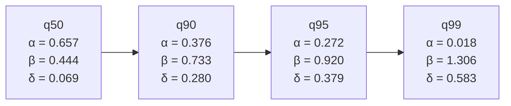
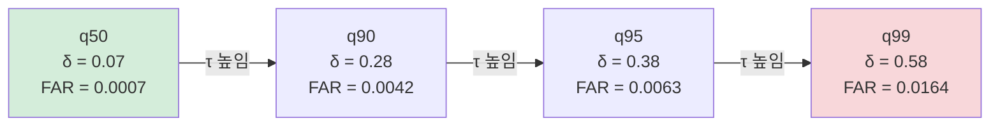

# 09. 핵심 결과 (q50 유지 → 상위 quantile 첨두 → 그 대가)

이 문서는 이 연구의 핵심 결과를 비전공 대학생이 한 흐름으로 읽도록 정리한다. 수문학이나 기계학습 배경이 전혀 없어도 따라올 수 있게, 개념을 일상어로 먼저 풀고 나서 숫자를 붙인다. 모든 수치는 실제 분석 결과에서만 가져왔다.

---

## 이 문서의 큰 그림

전체 결과는 세 질문(RQ-1, RQ-2, RQ-3)으로 나뉜다. 셋은 다음 한 줄 이야기로 이어진다.

```text
(RQ-1 / 전제)
  중앙 예측은 손해 없이 유지되는가?
          ↓  "그렇다" → 그렇다면 위쪽 위험선을 더 쓸 수 있다
(RQ-2 / 중심 주장)
  더 높게 잡는 예측선이 큰 물의 첨두를 덜 놓치는가?
          ↓  "그렇다" → 하지만 이건 공짜가 아니다
(RQ-3 / 그 대가)
  높이 잡으면 헛경보와 과대예측은 얼마나 늘어나는가?
```

이 세 질문이 **차례로** 이어진다는 점이 중요하다. RQ-1이 충족되지 않으면 RQ-2의 주장은 힘을 잃는다. 따라서 RQ-1은 단순한 확인 절차가 아니라 전체 논리 구조의 토대다. 각 질문을 순서대로 따라가면 "왜 이런 연구를 했는가 → 무엇을 발견했는가 → 그 한계는 무엇인가"가 자연스럽게 펼쳐진다.

---

## 1. 먼저 알아야 할 개념들

### 1-1. 강의 유량 예측이란

이 연구의 목표는 강의 유량(streamflow, 단위 시간에 특정 지점을 지나는 물의 양)을 시간 단위로 예측하는 것이다. 비가 얼마나 왔는지, 기온이 어땠는지, 앞 시각 유량이 얼마였는지 같은 정보를 넣으면, 모델이 다음 시각 유량을 예측한다.

홍수 예보에서 이 예측이 중요한 이유는, 실제 강물이 얼마나 높이 올라올지를 미리 알아야 대피와 차단 여부를 결정할 수 있기 때문이다. 예측이 너무 낮으면 위험한 홍수를 안전하다고 오판하고, 너무 높으면 불필요한 대피령으로 신뢰를 잃는다.

### 1-2. LSTM — 시간 흐름을 기억하는 인공신경망

**LSTM**(Long Short-Term Memory)은 시간 순서가 있는 자료를 학습하도록 설계된 인공신경망의 한 종류다. 강의 유량은 어제 비가 얼마나 왔는지, 지난 며칠간 토양이 얼마나 포화됐는지에 따라 달라진다. 그래서 단순히 "지금 이 순간"의 정보만 보는 것이 아니라, 과거 수십~수백 시간의 흐름을 기억하면서 예측하는 구조가 필요하다. LSTM이 이 역할을 한다.

### 1-3. 두 모델의 차이

이 연구는 같은 LSTM 구조를 두 방식으로 학습한 결과를 비교한다.

| 구분 | Model 1 | Model 2 |
| --- | --- | --- |
| 정식 이름 | Deterministic LSTM | Probabilistic Quantile LSTM |
| 한 번에 내놓는 예측 | **값 하나** | **여러 높이의 예측선 동시에** |
| 비유 | "이 시각 유량은 정확히 5.2mm/hr" | "5mm 이하일 수도, 8mm 이상일 수도 있어. 각각 몇 %인지 보여줄게" |
| 학습 목표 | 예측값과 관측값의 차이 최소화 (평균 기반) | 각 높이의 예측선이 관측을 정해진 비율로 넘도록 (분위 기반) |

Model 1은 단 하나의 답을 준다. Model 2는 여러 높이의 답을 동시에 준다. 이 "여러 높이"가 quantile(분위)이다.

### 1-4. Quantile(분위)이란

Quantile은 "전체를 줄세웠을 때 어느 위치인가"를 나타내는 개념이다. 예를 들어 전국 수능 점수에서 q50(50번째 분위)은 중앙값, 즉 딱 절반이 이 값보다 위에 있고 절반이 아래에 있는 점수다. q90은 "상위 10%가 이 값보다 위에 있는 점수"다.

유량 예측에서 q50은 "실제 유량이 이 값보다 높을 확률과 낮을 확률이 각각 50%"인 예측선이다. q90은 "실제 유량이 이 값을 넘어설 확률을 10%로 본 선", q99는 "실제 유량이 이 값을 넘어설 확률을 1%로 본 선"이다. 즉 위로 갈수록 더 보수적으로, 더 높게 잡는다.

```
유량
  ↑
  |  ........... q99  (가장 높게, 보수적으로 잡는 선)
  |  .......... q95
  |  ......... q90
  |  ....... q50   (중앙 예측선)
  |
  +--> 시간
```

쉽게 말해 q50은 "평소 기대값", q90/q95/q99는 "혹시 이만큼 클 수도 있다는 위쪽 위험선"이다. Model 2의 결과를 하나의 정답 예측으로 보기보다, q50부터 q99까지 이어지는 **예측 밴드(띠)** 로 보는 편이 이 결과를 읽기 편하다.

### 1-5. 성능 지표 미리 풀기

결과 표를 읽기 전에 지표 뜻을 먼저 정리한다.

| 약어 | 한국어 풀이 | 좋은 방향 |
| --- | --- | --- |
| **NSE** | Nash-Sutcliffe 효율. 예측이 관측을 얼마나 잘 따라가는지 0~1 사이 점수. 0이면 관측 평균을 그냥 쓰는 것과 같고, 1이면 완벽. | 클수록 좋음 |
| **KGE** | Kling-Gupta 효율. NSE와 비슷하나 세 요소(상관, 변동, 편향)를 종합. 1이 완벽. | 클수록 좋음 |
| **RMSE** | 제곱 오차의 평균 제곱근. 예측과 관측의 차이를 제곱해 평균한 뒤 제곱근. 단위가 원본과 같아 해석하기 쉽다. | 작을수록 좋음 |
| **MAE** | 평균 절대 오차. 예측과 관측 차이의 절댓값 평균. RMSE보다 큰 오차에 덜 민감. | 작을수록 좋음 |
| **Q99** | 한 유역에서 "큰 물"의 기준선. 학습 기간 관측 유량을 줄세웠을 때 상위 1%에 드는 높이. 이 선을 넘어야 "큰 물 사건"으로 친다. | — |

### 1-6. 분석 설정 — 어떤 유역·기간을 봤나

| 항목 | 값 |
| --- | --- |
| 평가 유역 | DRBC 관측 검증 유역 **85개** (학습에서 완전히 빼 둔 유역) |
| 학습 반복 seed | `111 / 222 / 444` (같은 모델을 무작위 출발점만 달리해 세 번 학습) |
| 평가 기간 | 2014~2016년 (학습·검증에 쓰지 않은 기간) |
| 요약 방식 | 유역별로 먼저 seed 세 개의 중앙값 → 85개 유역의 중앙값 (basin median) |

"DRBC 관측 검증 유역"이란, 이 모델들이 학습 중 한 번도 본 적 없는 유역들이다. 모르는 유역에서도 잘 작동하는지(일반화 성능)를 보기 위해 학습에서 미리 빼 두었다.

---

## 2. RQ-1 — 중앙 예측선(q50)은 손해 없이 유지되는가 (전제)

### 2-1. 무엇을 묻는 질문인가

Model 2는 여러 높이의 예측선을 동시에 내놓도록 더 복잡하게 학습된 모델이다. 그 가운데 중앙 예측선인 q50이, Model 1의 단일 예측과 견줘 **평소 성능을 깎아먹지는 않는지** 확인하는 것이 RQ-1이다.

### 2-2. 왜 이것이 뒤따르는 주장의 전제인가

이 논리를 일상 비유로 풀어 보자.

> 어떤 의사가 "이 환자의 혈당은 아마 100mg/dL 정도일 것"(Model 1식 단일 예측) 대신, "60~180mg/dL 사이일 가능성을 모두 보여주고, 특히 위험한 고혈당 구간은 더 주의해서 표시해 줄게"(Model 2식 범위 예측)로 바꾸었다고 하자. 이 새 방식이 유용하려면, 먼저 중앙 추정값(100mg/dL 쪽)이 예전보다 크게 나빠지지 않아야 한다. 중앙이 무너지면 범위 예측 전체가 쓸모없어진다.

같은 논리가 이 연구에 적용된다.

- Model 2가 q90/q95/q99 같은 위쪽 위험선을 제공하는 것이 이 연구의 핵심 기여다.
- 그런데 만약 "위쪽 위험선을 얻기 위해 중앙 예측이 크게 나빠졌다"면, 그 위험선이 신뢰할 수 있는 기준인지 의심받는다. 기본기가 무너진 모델이 내놓는 위험선은 의미가 약해진다.
- 반대로 "중앙 예측은 손해 없이 유지되면서도 위쪽 위험선이 큰 물을 잘 잡는다"면, "기본도 되고 홍수도 잡는다"는 이중 효과를 주장할 수 있다.

따라서 RQ-1의 답이 "그렇다(유지된다)"일 때 비로소 RQ-2의 주장이 힘을 얻는다. RQ-1이 "아니다(망가진다)"로 나왔다면 이 연구의 핵심 논리가 흔들렸을 것이다.

### 2-3. 결과

85개 유역의 유역별 중앙값(basin median) 기준으로, q50과 Model 1을 비교했다.

| 지표 | Model 1 | Model 2 q50 | 차이 (q50 − Model 1) | 해석 |
| --- | ---: | ---: | ---: | --- |
| NSE | −0.031 | 0.225 | **+0.149** | q50이 더 좋음 |
| KGE | 0.082 | 0.158 | +0.041 | q50이 더 좋음 |
| RMSE | 4.850 | 4.393 | −0.273 | q50이 더 좋음 (작을수록 좋음) |
| MAE | 2.584 | 2.509 | −0.197 | q50이 더 좋음 (작을수록 좋음) |
| Bias (편향) | −0.459 | −0.948 | −0.437 | q50이 더 낮게 치우침 |
| FHV (%) | −12.3 | −36.1 | **−8.5** | q50이 고유량 구간에서 더 낮게 처짐 |

> **FHV(고유량 편향)** 란 상위 2% 극값 구간에서의 과소추정 정도다. 두 모델 모두 음수(과소추정)이며 q50이 더 심하다.

### 2-4. 어떻게 해석하나

**좋은 소식**: NSE는 +0.149만큼 올라갔고(높을수록 좋음), RMSE·MAE는 줄었다(작을수록 좋음). q50은 중앙 성능을 **손해 없이, 오히려 전반적으로 약간 개선하며** 유지했다. 전제는 충족된다.

**예외 방향**: 편향(bias)과 고유량 편향(FHV)을 보면 q50이 Model 1보다 관측을 더 **낮게** 예측하는 경향이 있다.

왜 이런 일이 일어날까? 두 모델이 다른 목표로 학습되기 때문이다.

- **Model 1**: 예측과 관측의 차이를 제곱해 줄이도록 학습된다. 제곱 오차를 최소화하면 통계적으로 **평균**에 수렴한다.
- **Model 2 q50**: 실제 관측이 q50 아래에 오는 비율이 정확히 50%가 되도록 학습된다. 이렇게 최적화하면 통계적으로 **중앙값**에 수렴한다.

강의 유량 분포는 평소에는 낮고, 홍수 때만 가끔 매우 높은 "한쪽으로 치우친(오른쪽 꼬리가 긴)" 분포다. 이런 분포에서는 평균이 중앙값보다 높다. 즉 Model 1이 따라가는 평균이, q50이 따라가는 중앙값보다 높다. 그래서 큰 물 시각에 q50이 Model 1보다 더 아래로 처진다.

이것은 모델의 결함이라기보다 학습 방식의 본질적 차이에서 오는 현상이다. 그리고 이 처짐이 바로 다음 질문의 출발점이 된다.

> **q50이 큰 물에서 더 처지는데, 그러면 위쪽 위험선(q90/q95/q99)이 그 부족분을 메워 주는가?** → 이것이 RQ-2다.

---

## 3. RQ-2 — 상위 quantile이 첨두 과소추정을 줄이는가 (중심 주장)

### 3-1. 무엇을 묻는 질문인가

이 연구의 핵심 질문이다. 위쪽 예측선 q90/q95/q99가 Model 1·q50에 견줘, 큰 물의 **첨두(peak, 유량이 가장 높이 솟는 순간)** 를 덜 놓치는지 본다.

첨두 과소추정(peak underestimation)이란, 모델이 실제로 가장 높아지는 순간을 낮게 예측하는 것이다. 비유로 설명하면, 파도의 최고 높이를 예보했는데 실제 파도가 훨씬 높았던 것과 같다. 홍수 관리에서 이 오판은 매우 위험하다.

### 3-2. 세 가지 잣대: α, β, δ

세 지표로 잰다. 모두 사건(event), 즉 "큰 물 기준선(Q99)을 관측 유량이 넘었던 한 번의 사례" 단위로 계산한다.

---

#### α — 사건별 첨두 부족분 (per-event peak deficit)

**일상 비유.** 달리기 선수의 실제 최고 속도가 초당 10m인데, 코치가 "최고 속도를 7m/s로 예상한다"고 했다면 부족분은 3/10 = 0.3(30%)이다. α가 0.3이면 "첨두를 30% 못 따라갔다"는 뜻이다.

**수식으로 정리하면.** 한 사건에서 관측 첨두를 obs_peak, 예측 첨두를 pred_peak라 하면:

```
α = (obs_peak - pred_peak) / obs_peak   (단, pred_peak > obs_peak이면 0으로 처리)
```

- α = 0: 첨두를 정확히 잡았거나 넘어섰다.
- α = 0.2: 첨두를 20% 못 따라갔다. 실제 유량의 80%만 예측했다는 뜻.
- α = 0.6: 첨두를 60% 못 따라갔다. 실제 홍수 규모를 절반도 못 잡은 것.

**값이 크면**: 첨두를 크게 놓쳤다. 홍수를 과소평가했다.
**값이 작으면(0에 가까울수록)**: 첨두를 잘 따라갔다. 좋은 상황.

---

#### β — 첨두 전후 짧은 구간 포착 (±6시간 창 포착)

**일상 비유.** 산 정상에 몇 시에 올라가는지 예보했는데, 실제 정상 도달 시간과 최대 6시간 차이가 나도 된다고 하자. 그 6시간 창 안에서 예보 최고점이 실제 최고점과 얼마나 가까웠는지가 β다.

**왜 ±6시간 창을 쓰나.** 첨두가 정확히 같은 시각에 일어나기를 기대하기는 너무 엄격하다. 모델이 첨두 타이밍을 몇 시간 앞서거나 뒤로 예측하는 경우도 실무에서는 유용하다. 그래서 첨두 전후 6시간 창을 열어 두고, 그 안에서 예측선의 최댓값이 관측 최댓값의 몇 배인지를 잰다.

```
β = max(예측선 값, 첨두 ±6h 창 안) / max(관측 값, 첨두 ±6h 창 안)
```

- β = 1.0: 창 안에서 예측 최댓값이 관측 최댓값과 같다. 이상적인 상황.
- β = 0.5: 창 안에서도 예측이 관측 첨두의 절반 높이에 그쳤다. 많이 처졌다.
- β = 1.3: 예측이 관측 첨두의 1.3배까지 올라갔다. 첨두를 넘어서 예측했다.

**값이 1보다 많이 작으면**: 창 안에서도 첨두를 충분히 따라가지 못했다. 과소추정.
**값이 1에 가까우면**: 첨두를 잘 포착했다.
**값이 1보다 크면**: 예측이 관측 첨두를 넘어섰다. 이득이지만 동시에 과대예측의 전조이기도 하다.

---

#### δ — 큰 물 기준선 재현율 (Q99 threshold recall)

**일상 비유.** 내일 기온이 40도를 넘을 것 같은 시간대가 10시간 있었는데, 예보 모델이 그 중 6시간만 "40도 초과"로 잡아냈다면 재현율은 6/10 = 0.6(60%)이다. δ가 0.6이면 "큰 물 시간대의 60%를 잡아냈다"는 뜻이다.

**수식으로 정리하면.**

```
δ = (예측선이 Q99를 넘은 순간 수) / (관측이 Q99를 넘은 전체 순간 수)
```

이 계산은 사건(event) 단위가 아니라 모든 시각을 합쳐(pooled) 계산한다.

- δ = 0: 큰 물 순간을 하나도 잡지 못했다. 완전한 실패.
- δ = 0.1: 10%만 잡았다. 대부분 놓쳤다.
- δ = 0.58: 58%를 잡았다. 절반 이상은 경고를 냈다.
- δ = 1.0: 큰 물 순간을 전부 잡았다. 완벽한 재현.

**값이 크면**: 큰 물 순간을 더 많이 잡아낸다. 놓치는 위험이 줄어든다.
**값이 작으면**: 큰 물 순간을 많이 놓쳤다. 위험 상황을 예보하지 못하는 것.

---

### 3-3. 결과 (85개 유역, 유역별 중앙값)

**α — 첨두 부족분 (0에 가까울수록 좋음)**

| 예측선 | α 중앙값 | 해석 |
| --- | ---: | --- |
| Model 1 | 0.588 | 첨두를 평균 59% 못 따라갔다 |
| q50 | 0.657 | 첨두를 평균 66% 못 따라갔다 (q50이 더 나쁨) |
| q90 | 0.376 | 첨두를 평균 38% 못 따라갔다 |
| q95 | 0.272 | 첨두를 평균 27% 못 따라갔다 |
| **q99** | **0.018** | 첨두를 평균 2% 못 따라갔다 — 사실상 거의 0 |

q50에서 q99로 가면 α가 0.657 → 0.018로 줄었다. 약 36배 개선이다.

**β — 첨두 전후 6시간 창 포착 (1 전후가 이상적)**

| 예측선 | β 중앙값 | 해석 |
| --- | ---: | --- |
| Model 1 | 0.519 | 6h 창 안에서도 관측 첨두의 52%에 그쳤다 |
| q50 | 0.444 | 6h 창 안에서도 관측 첨두의 44%에 그쳤다 |
| q90 | 0.733 | 6h 창 안에서 관측 첨두의 73%까지 올라갔다 |
| q95 | 0.920 | 6h 창 안에서 관측 첨두의 92%까지 올라갔다 |
| **q99** | **1.306** | 6h 창 안에서 관측 첨두의 130%까지 올라갔다 |

q99에서 β = 1.306이라는 것은 예측선이 첨두 근방에서 관측 첨두를 넘어설 만큼 보수적으로 높게 잡았다는 뜻이다. 첨두를 "덮는" 수준에 도달했다고 볼 수 있다. 단, 1을 넘어서면 다른 곳에서도 과대예측이 늘어난다는 신호이기도 하다(이것이 RQ-3의 주제).

**δ — 큰 물 기준선 재현율 (높을수록 좋음)**

| 예측선 | δ 재현율 중앙값 | 해석 |
| --- | ---: | --- |
| Model 1 | 0.143 | 큰 물 순간의 14%만 잡아냈다 |
| q50 | 0.069 | 큰 물 순간의 7%만 잡아냈다 |
| q90 | 0.280 | 큰 물 순간의 28%를 잡아냈다 |
| q95 | 0.379 | 큰 물 순간의 38%를 잡아냈다 |
| **q99** | **0.583** | 큰 물 순간의 58%를 잡아냈다 |

q50 대비 q99의 재현율은 0.069 → 0.583으로 약 8.5배 개선이다.

### 3-4. 방향성 정리



세 잣대 모두 같은 방향을 가리킨다. 예측선을 높일수록, α는 줄고(좋아지고), β는 올라가고(좋아지고), δ는 올라간다(좋아진다). 그리고 그 변화가 **단조적(monotone)** 이다 — 중간에 역전이 없다.

### 3-5. 미국 기상청(NOAA) 확인 홍수 사건 점검

위의 결과는 "Q99 기준선을 넘은 사건" 전체를 대상으로 했다. 더 엄격한 점검으로, 미국 기상청(NOAA, National Oceanic and Atmospheric Administration)이 실제 홍수로 공식 확인한 사건만 모은 별도 집합(검증 기간에 겹치는 21개 유역, 65개 사건)으로도 같은 분석을 했다.

| 예측선 | α (NOAA scope) | β (NOAA scope) |
| --- | ---: | ---: |
| q50 | 0.788 | 0.282 |
| q90 | 0.482 | 0.566 |
| q95 | 0.404 | 0.677 |
| q99 | **0.172** | **0.977** |

방향이 일치한다. 실제 홍수 사건에서도 q99는 첨두 부족분을 17%까지 줄이고, 6시간 창 안에서 관측 첨두의 98%까지 올라갔다. 절댓값이 Q99 전체보다 나쁜 것은, NOAA 확인 사건이 더 극단적인 사건들을 포함하기 때문으로 해석된다. 중요한 것은 방향이 같다는 점이며, 표본이 작아(21개 유역) 절댓값보다는 방향 일치에 의미를 둔다.

### 3-6. 어떻게 해석하나

중심 주장은 성립한다. **위쪽 예측선(q90/q95/q99)은 첨두 과소추정을 단계적이고 일관되게 줄이며, q99에서는 첨두 부족분이 거의 0에 가까워진다.**

단, 이 결과를 읽을 때 중요한 단서가 있다.

- q99에서 β = 1.306이고 α ≈ 0이라는 것은, "q99가 관측 첨두를 넘어선다"는 뜻이기도 하다. 즉 q99는 홍수 첨두를 "예측하는" 선이라기보다, 첨두를 "덮는" 위쪽 덮개(upper envelope)에 가깝다.
- 이 "덮음"은 다른 시각에서도 실제보다 높게 잡는 경우를 늘린다. 이것이 헛경보와 과대예측으로 이어진다 → RQ-3의 주제.

---

## 4. RQ-3 — 그 대가는 얼마인가 (cost)

### 4-1. 무엇을 묻는 질문인가

위쪽 예측선으로 첨두를 잘 잡는 이득의 **반대편 비용**을 본다. 두 가지다.

- **FAR(false alarm rate, 헛경보 비율)**: 실제로는 큰 물 기준선(Q99)을 안 넘었는데, 예측선이 넘는다고 잡은 비율.
- **과대예측 크기(over-prediction magnitude)**: 예측선이 관측보다 위로 갈 때, 평균적으로 얼마나 더 높게 잡았는지.

### 4-2. FAR — 헛경보 비율

**일상 비유.** 화재 경보 시스템이 실제로 불이 나지 않은 날에도 경보를 울린 비율이다. 경보가 잦을수록 사람들은 "또 오작동이겠지"라고 반응하게 되어, 진짜 불이 났을 때도 무시하는 "경보 피로"가 생긴다.

**수식으로 정리하면.**

```
FAR = (예측선이 Q99를 넘었지만 실제 관측은 Q99 미만인 시각 수)
    / (관측이 Q99 미만인 전체 시각 수)
```

분모가 "Q99 미만인 시각 전체"라는 점을 기억하자. 대부분의 시간은 평소 수위라 FAR의 절댓값이 작게 보일 수 있다.

- FAR = 0: 헛경보가 전혀 없다. 예측선이 Q99를 넘은 모든 순간에 실제로도 Q99를 넘었다.
- FAR = 0.01: 1%의 시각에서 헛경보를 냈다. 큰 물이 없는 날도 자꾸 위험 신호를 보냈다는 뜻.
- FAR = 0.0164: 1.64%의 시각에서 헛경보.

**값이 크면**: 헛경보가 잦다. 경보 피로 위험.
**값이 작으면**: 예측선이 실제 큰 물이 날 때만 기준선을 넘는다. 정확한 경보.

### 4-3. 과대예측 크기 — 예측이 실제보다 얼마나 위로 갔는가

**일상 비유.** "오늘 주가가 100만 원 이상 오를 거야"라고 예보했는데 실제로는 50만 원 올랐다면, 과대예측 크기는 50만 원이다. 예측이 실제보다 위로 갔을 때 그 차이의 평균을 구한 것이다.

**수식으로 정리하면.**

```
과대예측 크기 = mean(예측선 값 - 관측 값 | 예측선 > 관측)
```

이 값은 예측이 관측을 넘는 경우(over-prediction이 일어난 시각)만 골라 평균한다. 즉 "얼마나 자주 넘는가"가 아니라 "넘을 때 평균적으로 얼마나 크게 넘는가"를 본다.

**값이 크면**: 예측이 관측보다 훨씬 높이 올라간다. 예측을 보고 대비하면 실제보다 과도한 자원을 투입할 수 있다.
**값이 작으면**: 예측이 관측을 넘더라도 크게 벗어나지 않는다.

### 4-4. 결과 (85개 유역, 유역별 중앙값)

| 예측선 | FAR (헛경보 비율) | 과대예측 크기 |
| --- | ---: | ---: |
| Model 1 | 0.0018 | 1.80 |
| q50 | 0.0007 | 1.47 |
| q90 | 0.0042 | 2.19 |
| q95 | 0.0063 | 2.29 |
| q99 | **0.0164** | **3.44** |

예측선을 높일수록 FAR과 과대예측 크기가 함께 올라간다. q50 → q99로 가면 FAR은 약 23배, 과대예측 크기는 약 2.3배 증가했다.

### 4-5. 이득과 대가를 나란히 놓으면

이것이 이 연구 결과의 핵심 그림이다. 재현율(이득)과 FAR(대가)을 같이 보자.

| 예측선 | δ 재현율 (이득: 클수록 좋음) | FAR (대가: 작을수록 좋음) | 재현율/FAR 비율 |
| --- | ---: | ---: | ---: |
| q50 | 0.07 | 0.0007 | 100× |
| q90 | 0.28 | 0.0042 | 67× |
| q95 | 0.38 | 0.0063 | 60× |
| q99 | 0.58 | 0.0164 | 35× |

q50에서 q99로 갈 때:
- 재현율(이득): 0.07 → 0.58, 약 **8배** 증가
- FAR(대가): 0.0007 → 0.0164, 약 **23배** 증가

즉 **이득은 8배 늘었지만 대가는 23배 늘었다.** 이득과 대가가 같은 방향으로 움직이되 그 정도가 비대칭이라는 것이 이 연구의 솔직한 결론이다.

이 트레이드오프(trade-off, 상충 관계)를 그림으로 표현하면 다음과 같다.



예측선을 높이면 재현율(초록 방향)과 헛경보(빨간 방향)가 함께 커진다. 어느 선을 경보 기준으로 쓸지는 "홍수를 놓치지 않는 것"과 "헛경보를 줄이는 것" 사이에서 운영자가 상황에 맞게 선택하는 문제다. 이 연구가 제공하는 것은 그 선택지의 구체적인 숫자다.

### 4-6. FAR이 왜 절댓값으로는 작아 보이나

FAR의 절댓값(q99에서 0.0164, 즉 1.64%)이 작아 보일 수 있다. 이유는 분모에 있다.

FAR의 분모는 "Q99를 안 넘은 모든 시각"이다. Q99는 학습 기간 전체에서 상위 1%에 해당하는 높이이므로, 평가 기간에서 약 99%의 시각은 Q99 미만이다. 즉 분모가 매우 크기 때문에 분자(헛경보 수)가 꽤 있어도 비율은 작게 보인다.

다르게 말하면: q99 예측선이 경보를 낼 때, 그 경보 중 상당 부분은 실제 큰 물이 오지 않은 날에도 울린다는 뜻이다. "절댓값이 작다 = 문제없다"가 아니라, 이 비율이 늘어나는 방향성을 재현율과 함께 봐야 한다.

---

## 5. 전체 정리 — 세 질문을 한 흐름으로

```
[RQ-1] 중앙 예측(q50)은 Model 1 대비 NSE +0.149, RMSE -0.273으로
        전반적으로 개선됐다. 단 큰 물 구간 편향은 q50이 더 낮게 처진다.
                    ↓ 전제 충족
[RQ-2] 예측선을 q50 → q99로 높일수록
        α(첨두 부족분)   0.657 → 0.018  (36배 개선)
        β(6h 창 포착)    0.444 → 1.306  (첨두 덮음 수준)
        δ(큰 물 재현율)  0.069 → 0.583  (8.5배 개선)
        모두 단조적으로 개선. 중심 주장 성립.
                    ↓ 하지만 공짜가 아니다
[RQ-3] 같은 방향으로
        FAR(헛경보)      0.0007 → 0.0164  (23배 증가)
        과대예측 크기    1.47   → 3.44    (2.3배 증가)
        재현율 8배 이득 vs 헛경보 23배 대가 → 비대칭 트레이드오프
```

**이 연구가 전달하는 핵심 메시지 한 줄:**

> Model 2는 "중앙 예측을 더 잘하는 모델"이라기보다, **큰 물을 놓치지 않도록 위쪽 위험선(q90/q95/q99)을 함께 제공하고 그 트레이드오프를 수치로 제시하는 모델**이다.

---

## 6. 주의할 해석 경계

이 결과를 읽을 때 넘지 말아야 할 선이 있다.

| 옳은 해석 | 피해야 할 과장 |
| --- | --- |
| "q99는 첨두 과소추정을 줄이는 위쪽 결정선에 가깝다" | "q99는 99% 확률 예측구간이다" (현재 단계에서 확률 보정 미완) |
| "위쪽 quantile로 갈수록 재현율이 단계적으로 오른다" | "q99를 쓰면 모든 홍수를 잡을 수 있다" (δ = 0.58이므로 42%는 여전히 놓침) |
| "재현율 이득과 FAR 비용이 비대칭적으로 함께 늘어난다" | "FAR이 작으니 헛경보 문제는 없다" (분모 구조상 절댓값이 작게 보임) |
| "q50이 NSE/RMSE 기준으로 전반적으로 개선됐다" | "q50이 Model 1보다 항상 더 좋다" (고유량 편향·FHV는 q50이 더 나쁨) |

---

## 7. 더 깊이 보려면

q99에서 첨두를 잘 잡으면서도 헛경보가 왜·어디서 늘어나는지, 큰 비가 왔을 때 모델이 유량 첨두를 충분히 올리는지를 더 깊이 파고드는 분석은 극한호우 stress test 문서로 이어진다.

- [극한호우 stress test를 어떻게 읽을까](./14_extreme_rain_stress_test.md)
