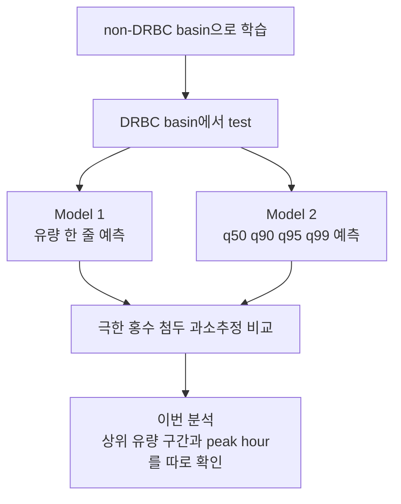

# 09. 이번 결과를 어떻게 읽을까

이 문서는 지금까지 만든 subset300 Model 1 / Model 2 결과를 학부생 기준으로 풀어 쓴 설명이다. 앞 장들이 연구의 배경과 분석 순서를 설명했다면, 이 장은 실제 결과가 무엇을 말하는지 정리한다.

## 지금까지 어디까지 왔나

우리는 CAMELSH hourly 자료로 두 모델을 비교했다.



현재 main comparison은 `subset300`이다. 학습에는 non-DRBC basin 중 고른 300개 subset을 쓰고, 평가는 DRBC holdout basin에서 한다. seed는 `111 / 222 / 444`를 공식 paired comparison으로 쓴다.

이번에 새로 만든 산출물은 아래 위치에 있다.

```text
output/model_analysis/quantile_analysis/
```

여기에는 모든 validation checkpoint `005 / 010 / 015 / 020 / 025 / 030`에 대한 hydrograph 그림과 `q50/q90/q95/q99` 시계열이 들어 있다.

## Model 1과 Model 2의 차이를 다시 보기

Model 1은 한 시점에 유량 하나를 예측한다.

```text
Model 1 -> Q_hat
```

Model 2는 한 시점에 여러 개의 선을 예측한다.

```text
Model 2 -> q50, q90, q95, q99
```

쉬운 말로 하면 `q50`은 가운데 예측선이고, `q90/q95/q99`는 더 큰 유량이 올 가능성에 대비해 위쪽으로 열어 둔 선이다.

여기서 중요한 점이 있다. `q99`는 99년 빈도 홍수가 아니다. 이 값은 어떤 시점의 조건에서 모델이 생각한 매우 높은 쪽 예측선이다.

## 왜 q50만 보면 안 되나

처음에는 Model 2의 대표값을 `q50`으로 보고 Model 1과 비교할 수 있다. 이건 공정한 중앙선 비교다.

하지만 Model 2의 진짜 목적은 `q50` 하나만 잘 맞추는 것이 아니다. 이 모델은 큰 홍수처럼 평소보다 훨씬 큰 값을 놓치지 않도록 `q90/q95/q99`를 함께 내는 구조다.

이번 결과도 이 점을 잘 보여준다. 큰 유량 구간에서 `q50`은 Model 1보다 항상 더 좋은 중앙선이 아니었다. 오히려 상위 1% 유량에서는 `q50`이 더 낮게 잡히는 경우가 많았다. 대신 `q95`와 `q99`가 실제 큰 유량을 더 많이 덮었다.

## 이번 분석에서 나눈 유량 구간

모든 시간을 한꺼번에 보면 홍수 신호가 묻힐 수 있다. 평소 유량 시간이 훨씬 많기 때문이다. 그래서 이번에는 관측 유량 `obs`를 기준으로 큰 유량 구간을 따로 봤다.

| 구간 | 뜻 |
| --- | --- |
| `all` | 모든 시간 |
| `basin_top10` | 각 basin에서 관측 유량이 큰 상위 10% 시간 |
| `basin_top5` | 각 basin에서 관측 유량이 큰 상위 5% 시간 |
| `basin_top1` | 각 basin에서 관측 유량이 큰 상위 1% 시간 |
| `basin_top0_1` | 각 basin에서 가장 극단적인 상위 0.1% 시간 |
| `observed_peak_hour` | 각 basin에서 관측 유량이 가장 컸던 한 시간 |

핵심은 `basin_top1`과 `observed_peak_hour`다. 이 둘이 홍수 첨두 과소추정 문제와 가장 직접적으로 연결된다.

## 우리가 계산한 값

가장 중요한 값은 세 가지다.

| 값 | 뜻 | 좋고 나쁨 |
| --- | --- | --- |
| `underestimation fraction` | 예측값이 관측값보다 낮았던 비율 | 낮을수록 peak를 덜 놓친다. |
| `relative bias` | 관측값 대비 예측이 얼마나 높거나 낮은지 | 0에 가까울수록 좋다. 음수면 과소추정이다. |
| `coverage fraction` | 관측값이 예측선 아래에 들어온 비율 | upper quantile에서는 높을수록 더 많이 덮는다. |

예를 들어 `q99 coverage fraction = 0.55`라면, 관측값의 55%가 `q99` 아래에 있었다는 뜻이다. 이것은 위쪽 선 하나가 관측값을 덮었는지 보는 one-sided hit-rate이지, 양쪽 구간이 관측값을 포함했다는 뜻은 아니다. 특히 top 1%처럼 이미 큰 유량만 골라 놓은 구간에서는 이 값을 “정확한 99% 확률”이라고 읽으면 안 된다. 여기서는 큰 홍수를 얼마나 덮었는지 보는 hit-rate에 가깝다.

## 핵심 결과

공식 primary epoch에서 각 basin의 상위 1% 유량 시간대를 보면, Model 1은 약 71.5%의 시간에서 관측 유량을 낮게 예측했다. 중앙선인 Model 2 `q50`은 더 좋지 않았다. `q50`은 약 85.8%를 과소추정했다.

하지만 upper quantile은 달랐다. `q95`는 과소추정 비율을 약 61.9%로 줄였고, `q99`는 약 44.9%까지 줄였다.

Observed peak hour에서도 같은 방향이었다. Model 1은 peak hour의 약 74.6%를 과소추정했고, `q99`는 이 비율을 50.0%까지 낮췄다.

따라서 지금 결과의 핵심은 아래 문장이다.

```text
Model 2의 장점은 q50 중앙선이 아니라 q95/q99 upper-tail 출력에서 나타난다.
```

## 그림은 어떻게 읽나

이번 분석은 chart 3개를 만들었다.

```text
output/model_analysis/quantile_analysis/analysis/charts/
```

`top1_underestimation_fraction_by_epoch.png`는 상위 1% 유량에서 모델이 얼마나 자주 낮게 예측했는지 보여준다. y축이 낮을수록 좋다. 이 그림에서 `q95/q99`가 Model 1보다 낮으면 upper quantile이 홍수 과소추정을 줄인다는 뜻이다.

`primary_peak_relative_bias_by_seed.png`는 공식 primary epoch에서 seed별 relative bias를 보여준다. 0에 가까우면 좋고, 음수면 낮게 예측했다는 뜻이다. `q99`가 양수로 올라가면 큰 홍수를 더 잘 덮지만, 너무 높게 잡는 경우도 생길 수 있다.

`top1_q99_q50_gap_pct_obs_by_epoch.png`는 `q99`와 `q50` 사이의 간격이 관측 유량에 비해 얼마나 큰지 보여준다. 이 간격이 크면 모델이 위쪽 위험선을 넓게 열어 둔 것이다.

## 중요한 주의점

첫째, `q99`가 항상 좋은 단일 예측값이라는 뜻은 아니다. `q99`는 중앙선이 아니라 상위 위험선이다. 일반적인 유량 예측값으로는 `q50`을 보고, 홍수 위험을 덜 놓치기 위해서는 `q95/q99`를 함께 본다.

둘째, 현재 `q99`는 이름처럼 정확히 99%를 덮지 못한다. 전체 시계열에서도 nominal 99%에 못 미치고, 큰 유량 구간에서는 더 많이 놓친다. 그래서 `q99`를 “잘 보정된 99% 신뢰구간”이라고 말하면 안 된다.

셋째, 이번 분석은 38개 DRBC hydrograph subset에 대한 결과다. 논문 결론으로 쓰려면 event-level 분석, 극한호우 stress test, basin별 실패 사례를 함께 붙이면 더 강해진다.

## 지금 단계의 연구 진도

지금까지의 진도를 정리하면 아래와 같다.

| 단계 | 상태 | 의미 |
| --- | --- | --- |
| Model 1 학습 | 완료 | deterministic baseline을 만들었다. |
| Model 2 학습 | 완료 | 같은 backbone에 probabilistic quantile head를 붙였다. |
| all validation epoch test | 완료 | seed 111/222/444, epoch 005-030 전체를 test했다. |
| hydrograph + quantile export | 완료 | `q50/q90/q95/q99` 시계열과 그림을 만들었다. |
| peak underestimation 분석 | 완료 | upper quantile이 과소추정을 줄인다는 신호를 확인했다. |
| calibration 해석 | 부분 완료 | one-sided coverage와 upper-tail gap은 확인했고, formal pinball/AQS와 calibration table은 아직 예정 분석이다. |
| event-level 분석 | 1차 완료 | observed high-flow event candidate와 event-regime별 차이를 정리했다. |
| extreme-rain stress test | 완료에 가까움 | primary checkpoint와 모든 validation checkpoint sensitivity 산출물이 생성되어 있고, 논문용 compact figure와 대표 event plot 선별이 남아 있다. |

## 이 결과를 한 문장으로 말하면

Deterministic LSTM은 큰 홍수 첨두를 낮게 예측하는 경향이 있고, 같은 LSTM backbone에 probabilistic upper quantile head를 붙이면 `q95/q99`를 통해 그 과소추정을 줄일 수 있다. 다만 현재 quantile은 아직 정확히 calibrated된 예측구간은 아니므로, 논문에서는 “잘 보정된 확률구간”보다 “홍수 첨두를 덜 놓치게 하는 upper-tail 출력”으로 설명하는 것이 맞다.

## 함께 읽을 보조 test

이 hydrograph 분석은 DRBC test 기간 전체에서 큰 유량 시간을 보는 방식이다. 함께 읽어야 할 보조 test는 반대로 강수에서 출발한다. 즉 hourly `Rainf`에서 ARI25/50/100급 비가 온 event를 먼저 찾고, 그 뒤 유량이 실제로 얼마나 올랐는지를 붙인다.

이렇게 해야 “모델이 큰 유량을 덜 놓치는가”뿐 아니라, “100년급에 가까운 비가 왔을 때 모델이 필요한 만큼 유량을 올리는가”도 볼 수 있다. 자세한 설명은 [`10_extreme_rain_stress_test.md`](10_extreme_rain_stress_test.md)에 정리한다.
