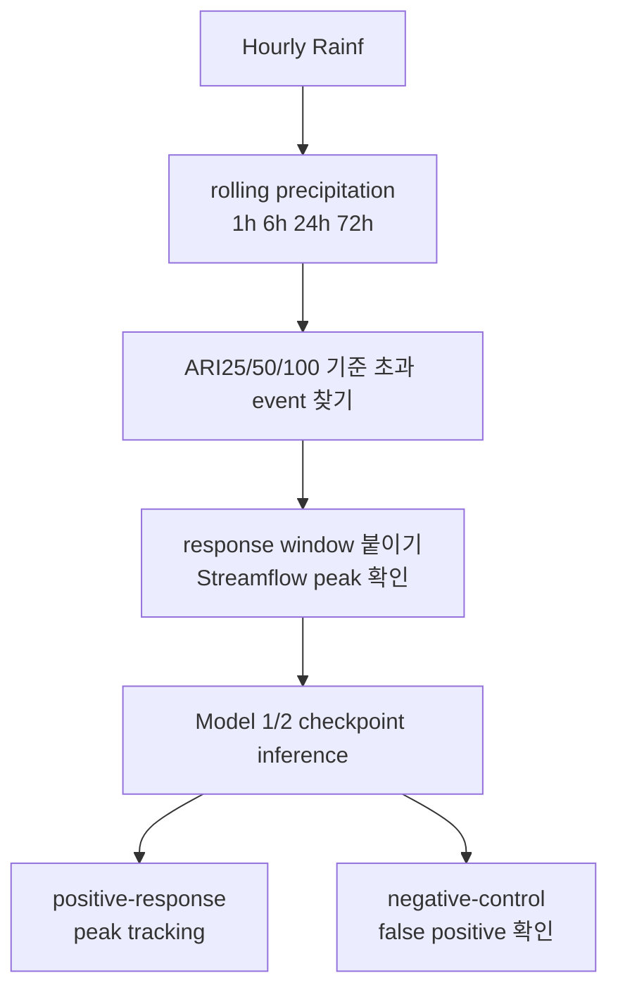

# 10. 극한호우 stress test를 어떻게 읽을까

이 문서는 `subset300` Model 1 / Model 2 결과에 새로 붙인 극한호우 stress test를 학부생 기준으로 설명한다. 앞 장의 hydrograph 분석이 "큰 유량 시간대에서 모델이 얼마나 낮게 예측하는가"를 본다면, 이 장의 stress test는 "큰 비가 왔을 때 모델이 유량을 충분히 올리는가"를 본다.

## 왜 이 test가 필요할까

기존 event 분석은 관측 유량이 큰 시점에서 출발했다. 예를 들어 streamflow가 Q99보다 높았던 event를 모으면, 이미 유량이 크게 오른 사례를 분석하기 쉽다.

하지만 사용자가 처음 제기한 질문은 조금 다르다.

```text
미국에 정말 100년급 비나 홍수가 없었나?
모델이 그런 극한호우 forcing을 배운 적이 있나?
그런 비가 왔을 때 모델도 유량 첨두를 올릴 수 있나?
```

이 질문에 답하려면 유량 event table만 보면 부족하다. 그래서 hourly `.nc` 안의 `Rainf`에서 직접 강수 event를 뽑고, 그 뒤에 streamflow response를 붙이는 구조로 보조 test를 만든다.

## 두 질문을 분리한다

극한호우 stress test는 두 질문을 분리한다.

첫 번째 질문은 exposure다. train과 validation 기간에 ARI25, ARI50, ARI100급 강수 forcing이 있었는지 확인한다. 이것은 모델이 학습 중 그런 입력 분포를 볼 기회가 있었는지를 묻는 질문이다.

두 번째 질문은 stress response다. DRBC holdout basin의 historical period에서 극한호우 event를 모은 뒤, 기존 checkpoint로 다시 inference해서 모델이 실제 streamflow peak를 따라가는지 본다.



## ARI100은 무슨 뜻일까

ARI는 Average Recurrence Interval의 약자다. ARI100은 보통 평균적으로 100년에 한 번 넘을 정도의 크기를 뜻한다. 여기서 주의할 점은, 이 프로젝트의 `prec_ari100_24h`나 `flood_ari100`은 공식 NOAA/USGS 값이 아니라 CAMELSH hourly record에서 만든 proxy라는 것이다.

그래서 논문에서는 "100년 홍수 확정"처럼 쓰면 안 된다. 더 정확한 표현은 "CAMELSH hourly annual-maxima proxy 기준 100-year-scale precipitation" 또는 "100년급에 가까운 강수 proxy"다.

## 왜 1h, 6h, 24h, 72h를 같이 볼까

홍수를 만드는 비는 한 가지 모양만 있는 것이 아니다. 한두 시간에 매우 강하게 쏟아지는 비도 있고, 하루나 며칠 동안 계속 내려 유역을 포화시키는 비도 있다.

그래서 rain severity는 `Rainf` rolling sum으로 계산한다.

| duration | 무엇을 잡는가 |
| --- | --- |
| `1h` | 짧고 강한 폭우 |
| `6h` | 반나절 안에 몰린 강수 |
| `24h` | 하루 단위 큰 비 |
| `72h` | 며칠 동안 이어진 누적 강수 |

각 시점에서 이 네 duration의 ARI ratio를 계산하고, 가장 큰 ratio를 event severity로 기록한다.

## event를 어떻게 고르나

Primary rain cohort는 `max_prec_ari100_ratio >= 1.0`이다. 쉬운 말로 하면, 어떤 duration이든 100년급 강수 proxy 이상으로 올라간 rain event다.

Sensitivity cohort도 같이 둔다.

| cohort | 뜻 |
| --- | --- |
| `prec_ge100` | ARI100 이상 |
| `prec_ge50` | ARI50 이상 |
| `prec_ge25` | ARI25 이상 |
| `near_prec100` | ARI100의 80% 이상이지만 100% 미만 |

비가 여러 시간 이어질 수 있으므로 active rain hour 사이 gap이 72시간 이하면 같은 storm으로 묶는다. 그리고 유량 반응은 rain 시작 24시간 전부터 rain 종료 168시간 뒤까지 본다.

## positive response와 negative control

극한호우가 왔다고 항상 큰 홍수가 나는 것은 아니다. 이미 유역이 말라 있었거나, 비가 유역 전체에 고르게 오지 않았거나, 저장과 지하수 조건 때문에 streamflow가 크게 오르지 않을 수 있다.

그래서 response class를 나눈다.

| class | 쉬운 의미 | 해석 |
| --- | --- | --- |
| `flood_response_ge25` | 강수 뒤 유량도 25년 홍수 proxy 이상으로 올랐다 | positive-response stress test |
| `flood_response_ge2_to_lt25` | 유량이 2년 이상 25년 미만 proxy까지 올랐다 | positive-response stress test |
| `high_flow_non_flood_q99_only` | Q99 이상 high-flow지만 2년 flood proxy 미만이다 | negative control |
| `low_response_below_q99` | 유량이 Q99에도 못 미쳤다 | negative control |

중요한 점은 negative control을 실패로 보면 안 된다는 것이다. 비는 컸지만 관측 유량이 안 올랐다면, 모델도 큰 홍수를 예측하지 않는 편이 맞다. 이때 Model 2의 `q99`가 자꾸 flood threshold를 넘으면 false positive risk가 있다는 뜻이다.

## 어떤 checkpoint를 돌리나

기본 결과는 validation 기준 primary checkpoint를 쓴다.

| model | seed111 | seed222 | seed444 |
| --- | ---: | ---: | ---: |
| Model 1 | epoch25 | epoch10 | epoch15 |
| Model 2 | epoch5 | epoch10 | epoch10 |

이 결과는 논문 본문에서 우선 읽는 기준이다. 하지만 primary checkpoint 하나만 보면 "그 epoch라서 우연히 좋아 보인 것 아닌가"라는 질문이 남는다.

그래서 같은 cohort에 대해 validation checkpoint grid도 돌린다.

```text
epoch005, epoch010, epoch015, epoch020, epoch025, epoch030
```

이 all-validation-epoch run은 Model 1 epoch N과 Model 2 epoch N을 같은 번호로 맞춘 same-epoch pair다. 목적은 primary epoch를 다시 고르는 것이 아니라, upper-tail effect와 false-positive tradeoff가 checkpoint 선택에 민감한지 확인하는 것이다.

## 출력 위치

Primary checkpoint 결과는 아래에 둔다.

```text
output/model_analysis/extreme_rain/primary/
```

모든 validation checkpoint sensitivity 결과는 아래에 둔다.

```text
output/model_analysis/extreme_rain/all/
```

둘을 섞어 읽으면 안 된다. Primary 결과는 대표 결과이고, all-validation 결과는 checkpoint sensitivity 진단이다.

## 현재 primary 결과를 쉬운 말로 읽기

Primary run 기준으로 train/validation exposure는 실제로 있었다. train split에는 ARI100급 rain event가 156개, validation split에는 8개가 잡혔다. 즉 모델이 학습과 checkpoint 선택 과정에서 극한호우 forcing을 전혀 못 본 것은 아니다.

반면 official DRBC test period인 2014-2016에는 ARI100 event가 없었고, ARI25급 event만 2개였다. 그래서 primary DRBC test만으로는 "100년급 비가 왔을 때 모델이 잘 반응하는가"를 충분히 말하기 어렵다.

DRBC historical stress period인 1980-2024에서는 response metric까지 가능한 stress event가 236개였고, 이 중 positive-response가 156개, negative-control이 80개였다. 이 event set으로 Model 1과 Model 2를 다시 비교했다.

큰 방향은 hydrograph 분석과 비슷하다. Model 2의 `q50`은 central prediction이라 Model 1보다 항상 낫지 않다. 하지만 `q90/q95/q99`는 positive-response event에서 peak underestimation을 줄이고 threshold recall을 올리는 경향을 보인다. 특히 `q99`는 peak를 더 자주 덮지만, negative-control에서도 flood threshold를 넘을 가능성이 커지므로 false-positive tradeoff를 같이 봐야 한다.

## 결론을 어떻게 써야 할까

학부생 기준으로 가장 중요한 결론은 이렇다.

```text
Model 2는 중앙예측(q50)을 더 좋게 만든 모델이라기보다,
큰 홍수를 놓치지 않도록 위쪽 위험선(q90/q95/q99)을 제공하는 모델이다.
```

따라서 논문에서 "q99가 정확한 99% 예측구간이다"라고 쓰면 안 된다. 지금은 "calibrated probability"보다 "extreme-tail underestimation을 줄이는 upper-tail decision output"에 가깝다.

또한 historical stress test는 primary DRBC test를 대체하지 않는다. DRBC basin은 학습에서 빠져 있으므로 basin holdout 조건은 유지되지만, historical period에는 train/validation 연도와 겹치는 event가 포함될 수 있다. 그래서 이 결과는 temporal independence가 강한 최종 test가 아니라, 극한호우 상황에서 모델 반응을 보는 보조 진단으로 읽어야 한다.
