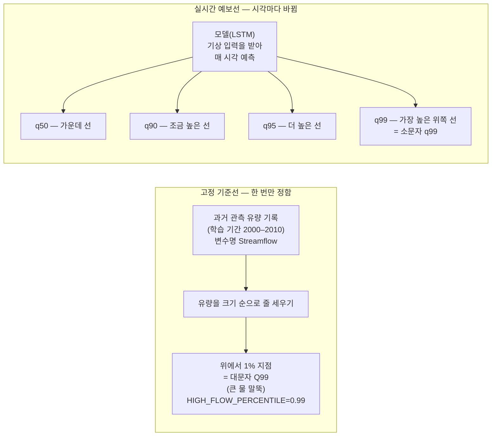
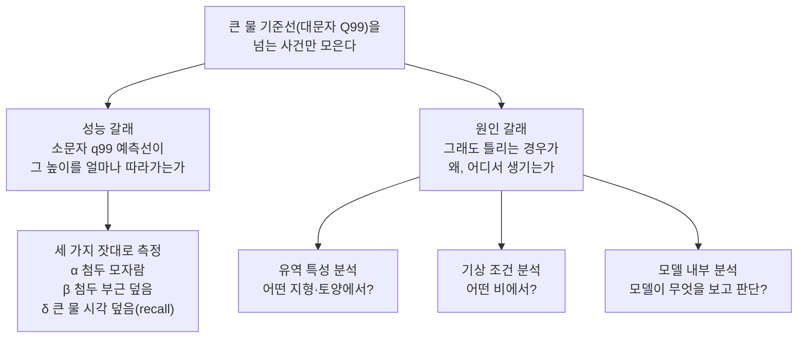
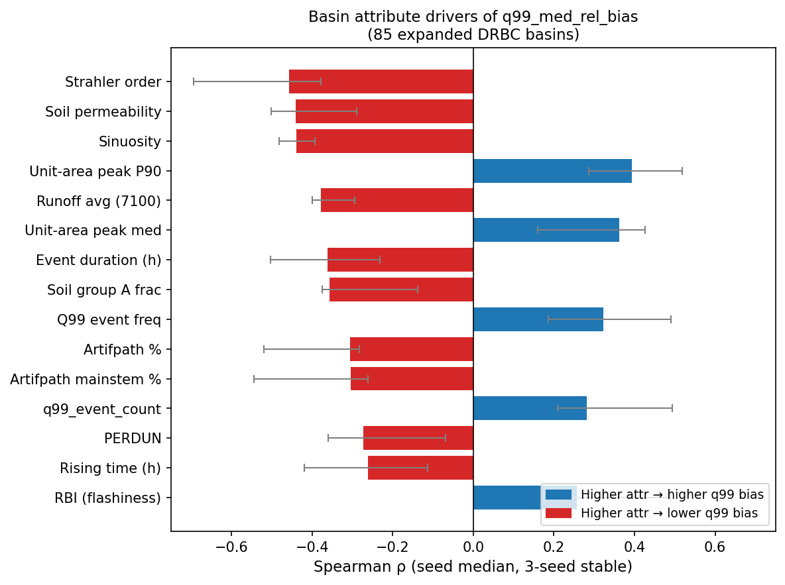
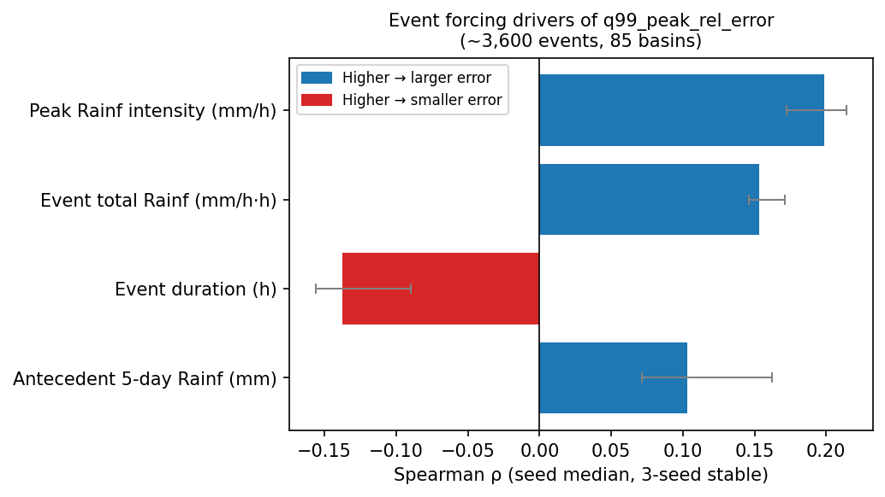
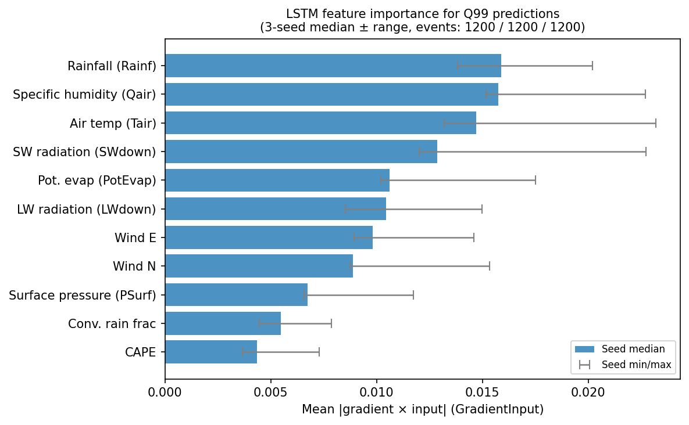
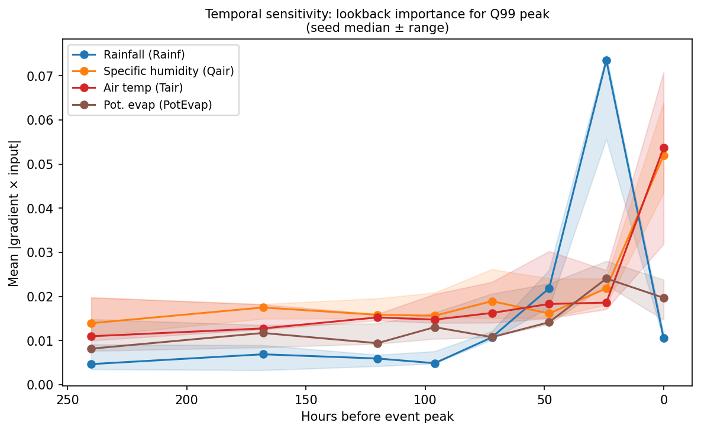
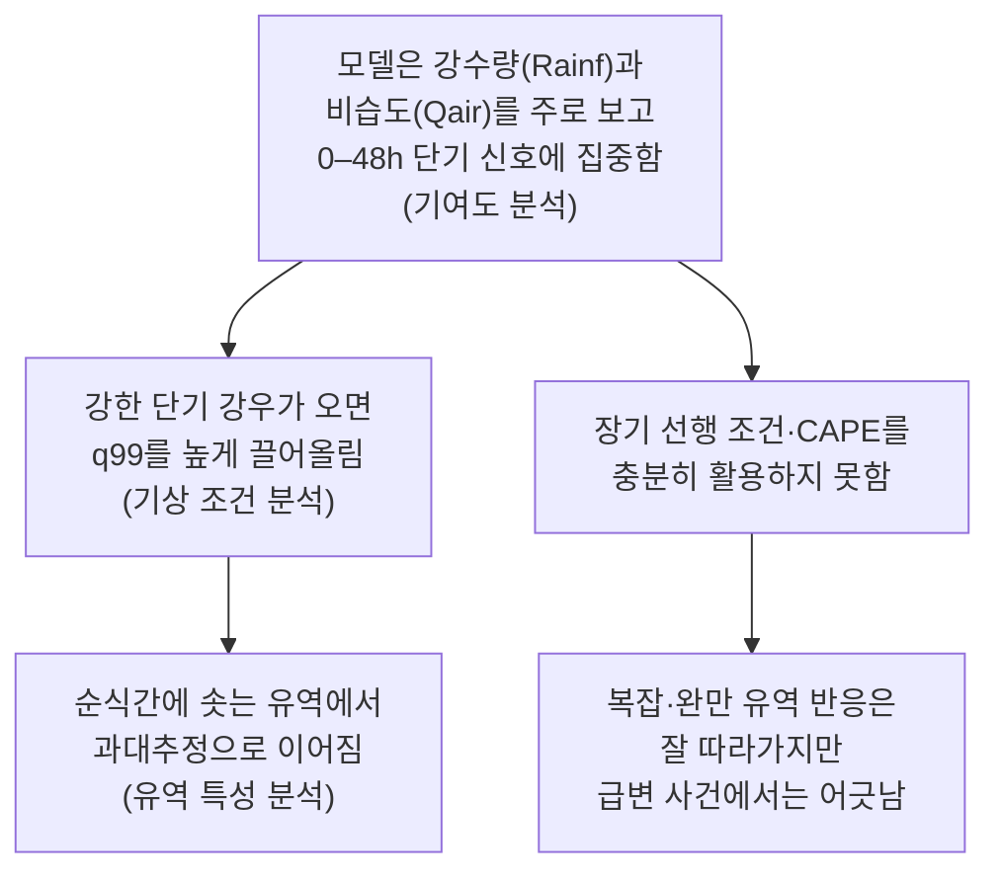

# 10. q99 분석 — 큰 물 기준선 성능과 첨두 과소추정 원인

이 문서는 "q99 분석"이 무엇인지 비전공 대학생 기준으로 처음부터 끝까지 풀어 쓴다. 수문학이나 기계학습 배경을 전혀 전제하지 않는다. 어려운 용어가 나올 때마다 바로 옆에서 쉽게 설명한다. 동시에 "이 수치가 코드 어디에서 어떻게 계산되는가"를 핵심 계산은 실제 코드를 인용해 보여 준다. 직접 코드를 들여다볼 사람을 위한 안내이자, "근거 없이 지어낸 숫자가 아니다"라는 증빙이기도 하다.

전체 구성은 다음 흐름을 따른다.

1. 핵심 용어 두 개를 정확히 구분한다 (대문자 Q99 vs 소문자 q99).
2. 이 분석이 왜 필요한지 맥락을 잡는다.
3. 모델이 큰 물을 실제로 얼마나 잘 잡아내는지 성능을 본다.
4. 그래도 틀리는 경우가 왜 생기는지 원인을 세 갈래로 파고든다.
5. 전체를 한 문장으로 정리한다.

분석 대상의 고정 조건은 다음과 같다. 이 세 가지는 분석 스크립트들이 공유하는 설정 파일에 상수로 박혀 있어, 모든 산출물이 같은 기간·같은 seed 위에서 계산됨이 보장된다.

- 평가 유역: DRBC(Delaware River Basin Commission, 델라웨어 강 유역 관리 위원회) 지역에서 관측 가능한 85개 유역.
- 학습 seed(난수 씨앗, 모델 초기화 값): `111 / 222 / 444` 세 벌.
- 기간: 학습 `2000-2010`, 검증 `2011-2013`, 테스트 `2014-2016`.

```python
# scripts/_lib/expanded_drbc.py
TRAIN_PERIOD = ("2000-01-01", "2010-12-31")
TEST_PERIOD  = ("2014-01-01", "2016-12-31")
HIGH_FLOW_PERCENTILE = 0.99      # 대문자 Q99의 정의 (상위 1%)
SEEDS = (111, 222, 444)          # 검증 기간은 2011-01-01~2013-12-31
```

분석 스크립트가 이 값을 일일이 새로 정하지 않고 한 파일에서 가져다 쓰기 때문에, 같은 조건 위에서 모든 결과가 나온다.

---

## 0. 대문자 Q99와 소문자 q99의 구분

이 문서 전체에서 가장 헷갈리기 쉬운 지점을 맨 앞에 꺼낸다. 알파벳 대·소문자 하나 차이인데 뜻이 전혀 다르다. 앞으로 본문 곳곳에서 이 구분을 반복해 각인시킬 것이다.

### 0-1. 한 줄 비교

| 표기 | 누가 만드나 | 무엇인가 | 한 번 정하면 바뀌나 |
| --- | --- | --- | --- |
| 대문자 **Q99** | 관측 자료 (사람이 측정한 실제 값) | 유역별 큰 물 **기준선** (말뚝) | 고정. 학습 기간 데이터로 한 번 정함 |
| 소문자 **q99** | 모델 (LSTM이 내놓는 예측 값) | 시각마다 달라지는 **위쪽 예보선** | 시각마다 변함. 기상 조건에 따라 오르내림 |

### 0-2. 강가의 눈금 말뚝과 일기예보 비유

강가에 커다란 눈금 말뚝이 박혀 있다고 상상해 보자. 과거 수십 년 동안 이 강이 얼마나 많이 불었는지 기록해 두고, 위에서부터 1%에 해당하는 높이에 빨간 선을 그어 둔 것이다. 이 빨간 선이 바로 **대문자 Q99**다. "이 선을 넘으면 큰 물"이라고 정해 둔 불변의 기준이다. 유역마다 강의 크기와 특성이 다르기 때문에 Q99 값도 유역마다 다르다.

이 빨간 선이 코드에서 실제로 어떻게 그어지는지가 분석의 첫 단추다. 큰 물 사건을 추려 내는 스크립트 안의 `basin_q99_from_netcdf` 함수가 한 유역의 한 숫자를 정한다.

```python
# scripts/model/expanded_drbc/build_q99_events.py: basin_q99_from_netcdf()
flow = ds["Streamflow"].sel(date=slice(*TRAIN_PERIOD)).values
valid = flow[~np.isnan(flow)]
return float(np.quantile(valid, HIGH_FLOW_PERCENTILE)), int(valid.size)
```

이 함수는 유역별 원자료에서 변수명 `Streamflow`(관측 유량)를 학습 기간(설정값 `TRAIN_PERIOD`, 즉 2000–2010)만큼 잘라 낸 뒤, 그 값들의 99분위수(설정값 `HIGH_FLOW_PERCENTILE = 0.99`)를 계산한다. 핵심은 이 계산에 **학습 기간 관측값만** 쓴다는 점이다. 테스트 기간(2014–2016)의 실제 유량은 기준선을 정하는 데 끼어들지 않으므로, "정답을 미리 엿보고 기준을 맞췄다"는 관측값 누수(테스트 정답이 분석에 새어 드는 일)가 생기지 않는다.

읽은 원자료와 결과가 어디에 있는지는 다음과 같다.

- 입력 원자료: `data/CAMELSH_generic/drbc_expanded_observed_test/time_series/<유역>.nc`
- 기준선 저장 표: `tables/rq2_q99_per_basin_thresholds.csv` (유역마다 한 줄)

이제 일기예보를 생각해 보자. 기상청이 오늘 오후의 예상 강수량을 여러 수준으로 내놓는다. "아마도 이 정도", "조금 더 올 수도 있다", "최악의 경우 이만큼"처럼 여러 선을 그려 준다면, 그 중 가장 높이 잡은 선이 **소문자 q99**에 해당한다. 매 시각 새로 계산되고, 비가 많이 올 것 같으면 올라가고 평온한 날씨라면 낮아진다.



### 0-3. 시험 커트라인과 점수 예측 비유

- **대문자 Q99** = 장학금 커트라인. 학교가 과거 성적 분포를 보고 "상위 1%면 여기"라고 정해 둔 기준점. 해마다 바뀔 수도 있지만 한 번 정해지면 그 시즌엔 고정이다.
- **소문자 q99** = 내가 이번 시험에서 "아무리 못해도 이 점수는 넘겠지"라고 잡은 낙관적 예측 상한선. 공부를 많이 했으면 높고, 준비가 덜 됐으면 낮다.

커트라인(Q99)을 **내가 내놓은 예측 상한선(q99)이 넘는지**를 보는 것이 이 분석의 핵심이다. 다시 한 번: 대문자 Q99는 시즌 내내 고정된 커트라인, 소문자 q99는 시험마다 달라지는 내 예측선이다.

### 0-4. quantile의 의미

소문자 q 뒤의 숫자가 무슨 뜻인지 한 번만 더 짚자. quantile(분위)은 데이터를 비율로 나누는 지점이다.

예를 들어 100명의 키를 줄 세우면, q50은 딱 가운데(50번째), q90은 아래에서 90번째, q99는 아래에서 99번째다. q99이면 거의 꼭대기에 해당한다.

모델이 q50 / q90 / q95 / q99를 동시에 내놓는다는 것은, "가운데 예측은 이 정도, 조금 보수적으로 잡으면 이 정도, 아주 높게 잡으면 이 정도"를 한꺼번에 제공한다는 뜻이다. q99가 높을수록 보수적(혹시 모를 큰 물을 더 많이 염두에 두는)이다.

흥미롭게도 대문자 Q99(관측 기준선)와 소문자 q99(모델 예측선)는 둘 다 "99분위"라는 같은 발상에서 나온다. 다만 대문자 Q99는 **한 유역의 과거 관측값을 줄 세운** 99분위(고정), 소문자 q99는 **모델이 매 시각 예상한 분포의** 99분위(변동)다. 같은 도구를 한쪽은 과거 데이터에, 한쪽은 미래 예측에 적용한 것이라 보면 된다.

---

## 1. 분석의 범위

### 1-1. 이 연구의 두 모델

이 연구는 두 종류의 LSTM(Long Short-Term Memory, 시계열 패턴을 학습하는 딥러닝 구조)을 비교한다.

| 모델 | 종류 | 출력 | 역할 |
| --- | --- | --- | --- |
| Model 1 | 결정론적 LSTM | 시각마다 값 **하나** | 비교 기준(baseline) |
| Model 2 | 확률적 quantile LSTM | 시각마다 **q50 / q90 / q95 / q99** 네 선 동시 출력 | 주 분석 대상 |

Model 1은 "내 예측은 이거야"라고 딱 하나만 내놓는다. Model 2는 "아마도 이 정도인데, 혹시 더 오면 이 선까지, 최대 위험은 저 선"처럼 여러 단계의 예측선을 함께 그린다. 이 문서에서 소문자 q99는 Model 2의 가장 높은 예측선을 가리킨다.

두 모델의 출력은 분석 스크립트가 읽는 공통 입력 파일에 나란히 담겨 있다. seed별로 한 파일씩 저장되며, 뒤에 나오는 모든 성능 수치는 결국 이 한 표의 관측값과 예측 열들을 비교해서 나온다.

- 입력 파일: `output/model_analysis/primary/metrics/data/required_series/seed{111,222,444}/required_series.csv`
- 한 행이 담는 것: 유역(`basin`), 시각(`datetime`), 관측 유량(`obs`), Model 1 예측(`model1`), Model 2의 네 예측선(`q50` `q90` `q95` `q99`).

### 1-2. 첨두 과소추정의 정의와 위험

**첨두(peak)**는 홍수 때 유량이 가장 높이 솟는 순간의 값이다. 하루 이틀 폭우가 쏟아지면 하천 유량이 보통 때의 수십 배까지 치솟는데, 그 꼭대기가 첨두다.

**과소추정**은 모델의 예측값이 실제 관측값보다 낮게 나오는 것을 말한다. 첨두 과소추정은 "모델이 실제로 유량이 저만큼 올라갔는데, 이만큼밖에 안 올라갈 거라고 낮게 잡은 것"이다.

이것이 왜 심각한 문제인가? 홍수 피해는 대부분 첨두 유량의 높이에 달려 있다. 첨두를 낮게 잡으면 홍수 경보가 너무 늦게 발령되거나, 댐 방류 시점을 잘못 잡거나, 대피 명령이 늦어질 수 있다. 평소 유량을 잘 맞히는 것보다 첨두를 얼마나 잘 맞히는지가 실제 활용 가능성을 좌우한다.

### 1-3. 두 갈래 질문

q99 분석은 다음 두 가지를 묻는다.



"큰 물 기준선을 넘는 사건만 모은다"는 첫 단계는 `find_events_for_basin` 함수가 담당한다. 테스트 기간 관측값 중 그 유역의 대문자 Q99를 넘는 시각만 골라낸 뒤, 시간상 가까이 붙은 시각들을 하나의 "사건"으로 묶는다.

```python
# scripts/model/expanded_drbc/build_q99_events.py: find_events_for_basin()
gap_h = (t - current[-1]).total_seconds() / 3600.0
if gap_h <= merge_gap_hours:   # merge_gap_hours = 12 (EVENT_MERGE_GAP_HOURS)
    current.append(t)          # 12시간 안이면 같은 사건으로 이어 붙임
```

끊어진 두 시각의 간격이 설정값 `EVENT_MERGE_GAP_HOURS`(12시간) 이내면 같은 사건으로, 그보다 멀면 별개 사건으로 본다. 한 사건의 첨두 시각은 그 묶음 안에서 관측 유량이 가장 높은 시점으로 정한다. 이렇게 만들어진 사건 목록이 성능 갈래(3절)의 분석 단위가 된다.

---

## 2. 분석의 필요성

### 2-1. 평범한 날 성능의 한계

하천 유량 데이터를 보면, 대부분의 시간은 평범하다. 하루 중 유량이 크게 변하지 않는 날이 훨씬 많다. 모델이 이런 평범한 날을 잘 맞히는 건 어렵지 않다. 그냥 "어제랑 비슷하겠지"라고 해도 틀리지 않는 경우가 많기 때문이다.

하지만 홍수는 드물게 온다. 1년에 몇 번 있을까 말까 한 큰 물 사건에서 모델이 어떻게 행동하는지가 진짜 시험이다. 큰 물 구간은 전체 시간의 1%에 불과하지만(대문자 Q99의 정의 자체가 "상위 1%"다), 실제 피해와 정책 결정에서 99%의 비중을 차지한다.

### 2-2. Model 1의 한계

Model 1은 한 번에 값을 하나만 내놓는다. 이 값이 실제 첨두보다 낮으면 그냥 틀린 것이다. 조정할 여지가 없다. 소스 문서에 따르면, Model 1은 큰 물 시각(대문자 Q99를 넘는 시점)에서 과소추정 비율이 약 84%(85개 유역 중앙값 기준)에 달했다. 큰 물 열 번 중 여덟 번 넘게 낮게 잡았다는 뜻이다.

### 2-3. Model 2의 시도

Model 2는 여러 높이의 예측선을 동시에 그린다. 가운데 선(q50) 위에 q90, q95, q99를 올려 둠으로써 "최소한 이 위쪽 선은 넘지 않겠지"라는 안전 여백을 제공한다. 이 위쪽 선이 실제 큰 물을 얼마나 잘 받쳐 주는지 확인하는 것이 q99 분석이다.

---

## 3. 성능 갈래 — 큰 물 포착 정도

큰 물 기준선(대문자 Q99)을 넘는 사건에서 성능을 세 가지 잣대로 잰다. 세 잣대는 그리스 문자 α(알파)·β(베타)·δ(델타)로 부르며, 각각 별도의 스크립트가 계산한다. 모든 수치는 85개 유역의 중앙값(가운데 유역의 값)이며, 출처 문서에 적힌 숫자만 인용한다.

세 잣대를 한눈에 보는 참조 카드부터 둔다. 상세 풀이는 카드 아래 각 하위 절에서 이어진다. 아래 수식에서 $Q$는 유량을 뜻하고, 아래첨자 $\text{obs}$는 실제 관측, $\text{sim}$은 모델 예측, $\text{sim},\tau$는 분위 $\tau$(예: 0.99)의 예측선을 가리킨다. 본문 산문에서는 "관측", "예측"으로 풀어 쓴다.

| 지표 | 변수명 | α/β/δ | 범위 | 최적화 방향 |
| --- | --- | --- | --- | --- |
| 첨두 모자람 | `rq2_alpha_event_peak_deficit` | α | 0~1 | 작을수록 좋음 ↓ |
| 첨두 부근 덮음 | `rq2_beta_window_capture` | β | 0~(1 초과 가능) | 1에 가까울수록 좋음, 너무 크면 과대 |
| 큰 물 시각 덮음(recall) | `rq2_delta_threshold_recall` | δ | 0~1 | 클수록 좋음 ↑ |

### 3-1. α 첨두 시각 모자람

**읽는 법:** 첨두가 가장 높이 솟은 바로 그 시각에, 예측값이 관측 첨두보다 얼마나 부족한지를 비율로 나타낸다.

$$
\alpha = \frac{\max\left(0,\ Q_{\text{obs}}^{\text{peak}} - Q_{\text{sim},\tau}^{\text{peak}}\right)}{Q_{\text{obs}}^{\text{peak}}}
$$

α = 0이면 예측이 관측 첨두를 정확히 맞혔거나 넘겼다는 뜻이다. α = 0.6이면 관측 첨두의 60%만큼 모자랐다는 뜻이다.

```python
# scripts/model/expanded_drbc/compute_rq2_alpha_peak_deficit.py: compute_alpha()
deficit = max(0.0, (obs - float(pred))) / obs
```

각 사건의 첨두 시각에서 관측 첨두값과 각 예측선의 값을 꺼내 위 식으로 모자란 비율을 구한다. 식 앞에 `max(0, …)`가 붙어 있어서, 예측이 관측보다 높게 잡힌 경우(넘겨 잡음)는 음수로 깎이지 않고 0으로 처리된다. 즉 α는 "모자란 쪽만" 센다.

| 예측선 | α 중앙값 (첨두에서 모자란 비율) | 한 줄 해석 |
| --- | --- | --- |
| Model 1 | 0.588 | 첨두의 59% 부족 — 절반 이상 놓침 |
| q50 (가운데 선) | 0.657 | 첨두의 66% 부족 — Model 1보다 더 낮음 |
| q90 | 0.376 | 첨두의 38% 부족 |
| q95 | 0.272 | 첨두의 27% 부족 |
| **q99** | **0.018** | **첨두의 2%만 부족 — 거의 맞힘** |

q50 → q99 방향으로 갈수록 α가 줄어드는 것이 단조롭게 확인됐다. q99에서 중앙값 α ≈ 0.018은 "85개 유역 가운데 유역에서, 첨두 시각의 예측이 관측을 거의 따라잡았다"는 뜻이다. q50(0.657)과 비교하면 약 36배 개선된 수치다.

**왜 q50이 Model 1보다 더 낮은가?** Model 2의 가운데 선(q50)은 Model 1의 단일 예측선과 목적이 다르다. Model 2는 분포 전체를 표현하도록 학습되었기 때문에 q50이 오히려 중간을 보수적으로 잡는 경향이 있다. 큰 물 시각에서 q50이 낮다는 것은 Model 2가 극단 구간을 q50이 아닌 위쪽 선(q90~q99)으로 담도록 설계됐음을 보여 준다.

### 3-2. β 첨두 부근 6시간 창 덮음

**읽는 법:** 첨두 앞뒤 약 6시간 창 안에서, 예측의 최댓값이 관측 최댓값을 어느 정도 비율로 덮는지 본다.

$$
\beta = \frac{\max\left(Q_{\text{sim},\tau}^{\text{win}}\right)}{\max\left(Q_{\text{obs}}^{\text{win}}\right)}
$$

β = 1이면 딱 맞게 덮은 것이고, β < 1이면 모자란 것, β > 1이면 오히려 넘겨 잡은 것이다.

```python
# scripts/model/expanded_drbc/compute_rq2_beta_window_capture.py: compute_window_capture()
pred_max = sub[tau].max(skipna=True)
ratio = float(pred_max) / float(obs_max)   # 창 = [첨두 − 6h, 첨두 + 6h]
```

여기서 "6시간 창"은 임의로 잡은 숫자가 아니라 설정값 `EVENT_WINDOW_HOURS`(6)에서 온다. 사건을 만든 `build_q99_events.py`가 첨두 시각을 중심으로 앞뒤 6시간씩 창을 잘라 두고(창이 테스트 기간 끝을 넘어가면 잘라 내며 표시), `compute_window_capture` 함수가 그 창 안에서 예측 최댓값과 관측 최댓값의 비율을 구한다. 관측 최댓값이 0 이하인 사건(규제 하천 등)은 비율을 잴 수 없어 계산에서 제외한다.

왜 6시간 창을 보는가? 홍수 첨두는 정확히 같은 시각에 찍히지 않아도 된다. 예보가 한두 시간 앞당겨지거나 늦춰져도 경보나 대피에는 활용 가능하다. 6시간 창은 "첨두 근방에서 모델이 충분히 높이 올라갔는가"를 유연하게 보는 방식이다.

| 예측선 | β 중앙값 (창 안 덮음 비율) | 한 줄 해석 |
| --- | --- | --- |
| Model 1 | 0.519 | 관측의 52%만 덮음 — 절반 수준 |
| q50 | 0.444 | 44% — Model 1보다도 낮음 |
| q90 | 0.733 | 73% |
| q95 | 0.920 | 92% — 거의 다 덮음 |
| **q99** | **1.306** | **130% — 관측보다 오히려 30% 더 높이** |

q99는 첨두 부근 6시간 창에서 관측의 약 1.3배까지 올라간다. 큰 물을 놓치지 않는다는 점에서는 긍정적이다. 그런데 동시에 "없는 큰 물을 만들어 내는" 방향으로도 기운다는 신호이기도 하다. 이 점은 5절에서 다시 논의한다.

### 3-3. δ 큰 물 시각 덮음(recall)

**읽는 법:** 관측 유량이 대문자 Q99를 넘는 모든 시각 중에서, 모델의 예측이 그 높이를 실제로 덮은 비율이다.

$$
\delta = P\left(Q_{\text{sim},\tau} \geq Q_{\text{obs}} \;\middle|\; Q_{\text{obs}} \geq Q99\right)
$$

recall(재현율)은 의학에서 "실제 환자 중 검사가 잡아낸 비율"과 같은 개념이다. 1에 가까울수록 큰 물 시각을 빠짐없이 잡아낸 것이다.

```python
# scripts/model/expanded_drbc/compute_rq2_delta_threshold_recall.py: compute_recall_for_seed()
high = merged[merged["obs"] >= merged["q99_train_value"]]   # 관측이 대문자 Q99 넘은 시각만
hits = int((sub[tau] >= sub["obs"]).sum())                  # 예측이 관측 높이를 덮은 시각
recall = hits / n_hours
```

이 함수는 먼저 관측값이 그 유역의 대문자 Q99를 넘는 시각만 추린 다음, 그중 예측선이 관측을 덮은 시각의 개수를 전체 큰 물 시각 수로 나눈다. α·β가 "사건 첨두 한 점"을 보는 것과 달리, δ는 Q99를 넘은 **모든 시각을 한데 모아(pooled)** 비율을 내므로, 사건 안 어느 시점이든 빠짐없이 따진다는 차이가 있다.

| 예측선 | δ 중앙값 (큰 물 시각 덮음 비율) | 한 줄 해석 |
| --- | --- | --- |
| Model 1 | 0.143 | 큰 물 시각의 14%만 덮음 |
| q50 | 0.069 | 7% — 열 번 중 한 번도 안 덮음 |
| q90 | 0.280 | 28% |
| q95 | 0.379 | 38% |
| **q99** | **0.583** | **큰 물 시각의 58% 덮음** |

q99는 q50 대비 약 8.5배, Model 1 대비 약 4배의 recall을 보인다. 큰 물 시각 열 번 중 다섯 번 넘게 예측이 관측을 받쳐 준다는 뜻이다.

그런데 왜 아직 58%에 그치는가? q99가 가장 위쪽 선이어도 절반 가량의 큰 물 시각을 덮지 못한다는 점이 남는다. 이것이 4절 원인 갈래의 출발점이다.

### 3-4. 세 잣대 종합 — 일관된 방향과 맞교환

예측선(q50→q99)에 따른 세 잣대의 변화 방향을 분위별 그림으로 확인할 수 있다.


같은 수치를 표로 병기하면 다음과 같다.

| 예측선 | α 첨두 모자람 | β 첨두 부근 덮음 | δ recall |
| --- | --- | --- | --- |
| Model 1 | 0.588 | 0.519 | 0.143 |
| q50 | 0.657 | 0.444 | 0.069 |
| q90 | 0.376 | 0.733 | 0.280 |
| q95 | 0.272 | 0.920 | 0.379 |
| q99 | 0.018 | 1.306 | 0.583 |

세 잣대는 q50 → q99로 갈수록 **단조롭게** 좋아진다(α는 감소, β와 δ는 증가). 이 단조 방향은 그냥 눈으로만 확인하는 것이 아니라, 세 스크립트가 각자 마지막에 "검증(acceptance)" 단계로 직접 단언(assert)한다. 예컨대 recall 스크립트는 q50→q90→q95→q99 순으로 값이 줄어들지 않는지(non-decreasing), 그리고 모든 recall 값이 0과 1 사이에 들어오는지를 코드로 검사해 통과시킨 결과만 산출물로 남긴다. 방향이 흔들리지 않고 일관된다는 것은 우연이 아님을 뜻한다.

하지만 맞교환(trade-off)이 있다. q99가 올라갈수록 덜 놓치는 동시에, β > 1이 보여 주듯 없는 큰 물도 만들어 낼 가능성이 함께 커진다.

### 3-5. NOAA 확정 홍수 사건 재확인

NOAA(National Oceanic and Atmospheric Administration, 미국 해양대기청, 공식 홍수 기록 기관)가 실제 홍수로 확정한 사건만 따로 모아 다시 확인했다. 테스트 기간(2014–2016)에 DRBC 85개 유역과 겹치는 21개 유역, 65개 사건이 대상이다. α·β 스크립트는 같은 코드로 사건 목록만 바꿔(대문자 Q99 초과 사건 대신 NOAA 확정 홍수 사건) 다시 돌린 것이라, 측정 방식 자체는 동일하다.

| 예측선 | α 중앙값 (첨두 모자람) | β 중앙값 (창 덮음) |
| --- | --- | --- |
| q50 | 0.788 | 0.282 |
| q90 | 0.482 | 0.566 |
| q95 | 0.404 | 0.677 |
| **q99** | **0.172** | **0.977** |

Q99 전체 범위(85개 유역)보다 수치가 다소 나빠 보이지만, 방향은 동일하게 유지된다. q99에서 첨두 모자람 약 17%, 첨두 부근 덮음 약 98%다. 유역 수가 적어(21개) 절댓값보다 방향성에 의미를 두어야 한다. "공식 홍수 사건"이라는 더 엄격한 조건에서도 q99 방향으로 갈수록 개선된다는 점이 이 추가 확인의 가치다.

### 3-6. 성능 갈래 핵심 요약

> q99 예측선은 큰 물 시각에서 **첨두를 거의 따라잡고(α ≈ 0.018), 큰 물 시각의 절반 이상을 덮는다(δ ≈ 0.583)**. 단, 이는 "딱 99% 확률의 정확한 예측구간"이 아니다. q99은 첨두 과소추정을 줄여 주는 **위쪽 위험선(upper safety envelope)**으로 읽어야 한다.

---

## 4. 원인 갈래 — 오차 발생 조건

이 절(4절)의 수치는 비-canonical 출처인 `docs/report/q99_causes/q99_analysis_report.md`에만 기록된 **탐색적 분석** 결과다. canonical 분석 문서(`docs/experiment/analysis/model/`)에서 재확인되지 않았으므로, 확정 결론이 아니라 방향 탐색으로 읽는다.

성능 갈래에서 q99가 큰 물을 잘 받쳐 주는 것을 확인했다. 그런데 85개 유역 중앙값이 그렇다는 것이지, 모든 유역과 모든 사건이 다 좋다는 뜻은 아니다. 소스 문서에 따르면, q99 예측선도 과소추정(낮게 잡음)과 과대추정(부풀려 잡음) 둘 다 발생한다.

원인 분석은 세 방향에서 파고든다. 출처 보고서는 이 셋을 각각 Analysis B(유역 특성), Analysis 3(기상 조건), Analysis A(모델 내부)로 부른다.

1. **어떤 유역에서** 어긋나는가 (유역 특성)
2. **어떤 비에서** 어긋나는가 (이벤트 기상 조건)
3. **모델이 무엇을 보고** q99를 정하는가 (모델 내부 기여도)

### 4-0. 두 방향의 어긋남과 세 가지 오차 지표

원인 분석에서 거듭 등장하는 측정값을 먼저 참조 카드로 정리한다. 상세는 카드 아래에서 이어진다.

| 지표 | 변수명 | 범위 | 최적화 방향 |
| --- | --- | --- | --- |
| 중앙 상대 편향 | `q99_med_rel_bias` | 음수~양수 | 0에 가까울수록 좋음, 음수=과소·양수=과대 |
| 과소추정 비율 | `q99_under_frac` | 0~1 | 작을수록 좋음 ↓ |
| 편향 차이 | `med_rel_bias_delta` | 음수~양수 | 양수일수록 q99가 Model 1보다 개선 |

#### 중앙 상대 편향

큰 물 시각에서 상대 편향을 모든 시각에 대해 구한 뒤 그 중앙값을 본 것이다.

$$
\text{중앙 상대 편향} = \operatorname{median}\left(\frac{Q_{\text{sim},\tau} - Q_{\text{obs}}}{Q_{\text{obs}}}\right) \quad \text{at}\ Q_{\text{obs}} \geq Q99
$$

양수면 평균적으로 부풀려 잡음(과대), 음수면 낮게 잡음(과소)이다. 소스 문서 기준 q99의 중앙값은 +0.115(과대 방향), Model 1은 −0.466(과소 방향)이다.

#### 과소추정 비율

큰 물 시각 중 예측이 관측보다 낮았던 시각의 비율이다. q99는 이 값을 약 84%(Model 1)에서 약 41%(중앙값 0.410)로 낮췄다. "덜 놓친다"는 q99의 강점이 여기서 수치로 드러난다.

#### 편향 차이

`Model 1 편향 − q99 편향`으로 정의한다. 양수면 그 유역에서 q99가 Model 1보다 개선된 것이다. 다만 중앙값은 −0.514로, 절반 이상의 유역에서는 q99가 오히려 편향을 키웠다(과대 방향으로). 즉 **덜 놓치는 대신 가끔 부풀린다**는 맞교환이 85개 유역 전체에서 관찰된다.

| 어긋남 종류 | 뜻 | 결과 |
| --- | --- | --- |
| 과소추정 | 예측이 관측보다 낮음 | 큰 물을 경고 못 함 |
| 과대추정 | 예측이 관측보다 높음 | 없는 큰 물을 부풀림 |

### 4-1. 유역 특성

유역마다 땅의 생김새, 토양, 하천망이 다르다. 이런 특성들이 q99 오차와 얼마나 관계가 있는지를 Spearman 상관(ρ)으로 분석했다. Spearman 상관은 두 값을 크기 순위로 바꾼 뒤 순위끼리 얼마나 함께 움직이는지를 −1~+1로 나타내는 척도다. |ρ| > 0.3이면 의미 있는 관계, > 0.5면 강한 관계로 본다. seed 세 벌(111/222/444) 모두에서 같은 방향이 나온 결과(보고서 용어로 "3-seed stable")만 신뢰도 높은 것으로 취급했다.

유역 속성별 상관을 한눈에 보면 아래 막대그림과 같다. 빨간 막대(음의 ρ)는 그 속성이 높을수록 q99 편향이 낮아지는 유역, 파란 막대(양의 ρ)는 그 속성이 높을수록 편향이 커지는 유역이다.



#### q99가 잘 맞는 유역

| 유역 속성 | Spearman ρ | 일상어 설명 |
| --- | --- | --- |
| 하천 차수(Strahler 차수) 높음 | −0.46 | 큰 본류가 여러 지류를 모아 천천히 흐르는 강 |
| 토양 투수성 높음 | −0.44 | 빗물이 땅속으로 잘 스며드는 유역 |
| 하천 사행도 높음 | −0.44 | 강이 꾸불꾸불 휘어 있는 유역 |
| 최고 투수성 토양 비율 높음(HGA) | −0.36 | 모래나 자갈처럼 물이 빨리 빠지는 토양 |
| 인공수로 비율 높음 | −0.31 | 사람이 정비한 직선 수로가 많은 유역 |

**왜 이런 유역에서 잘 맞는가?** 이 유역들의 공통점은 "빗물이 하천에 도달하는 경로가 느리고 규칙적"이라는 점이다.

- 토양에 투수성이 높으면 빗물이 땅속으로 스며들면서 속도가 느려진다. 순식간에 하천으로 모이지 않으니 첨두가 완만하게 오른다.
- 하천이 꾸불꾸불하거나 차수가 높을수록 물이 합류하는 데 시간이 걸린다. 홍수파가 여러 경로를 거쳐 퍼지면서 첨두가 분산된다.
- 인공수로는 흐름 패턴을 규칙적으로 만들어 준다. 모델이 학습하기 쉬운 패턴이 생긴다.

요약하면, 천천히 반응하고 규칙적인 유역 = 모델이 잘 배울 수 있는 유역이다.

#### q99가 어긋나는 유역

| 유역 속성 | Spearman ρ | 일상어 설명 |
| --- | --- | --- |
| 단위면적 첨두 P90 높음 | +0.39 | 비 오면 유량이 순식간에 치솟는 유역 |
| 단위면적 첨두 중앙값 높음 | +0.36 | 평균적으로도 첨두가 높은 유역 |
| Q99 이벤트 빈도 높음 | +0.32 | 큰 물 사건이 자주 일어나는 유역 |

**왜 이런 유역에서 어긋나는가?** 이 유역들의 공통점은 비가 오면 유량이 급격히 솟구친다는 것이다. 흔히 "flash flood(순간 홍수)" 특성이라고 부른다.

- 작은 유역이거나, 불투수성 표면(아스팔트, 암석)이 많으면 빗물이 그대로 하천으로 쏟아진다. 몇 시간 안에 유량이 수십 배 뛴다.
- 이런 급격한 패턴은 모델이 학습하기 어렵다. 과거 데이터에서 비슷한 사건이 많지 않고, 각 사건이 워낙 달라서 일반 패턴을 찾기 어렵다.
- 흥미로운 점은, 이런 유역에서 q99가 "과소추정"보다 "과대추정"으로 기우는 경향이 있다는 것이다. 강한 강우 신호가 오면 q99가 과민하게 높아지기 때문이다.

**큰 물이 잦다고 예측이 쉬워지지는 않는다.** Q99 이벤트 빈도가 높아도 오차가 커진다. 자주 일어나는 것과 규칙적인 것은 다른 문제다. 잦은 큰 물은 매번 양상이 달라서 오히려 패턴을 잡기 어려울 수 있다.

#### Model 1 대비 q99가 더 개선되는 유역

"Model 1보다 q99가 얼마나 나아졌는가"를 편향 차이(`med_rel_bias_delta`)로 보면, 하천 차수가 높은 유역에서 ρ = +0.61로 가장 강하게 개선됐다. 즉 q99 위쪽 선이 Model 1보다 훨씬 도움이 되는 곳은 큰 본류가 흐르는 복잡한 하천망 유역이다.

### 4-2. 이벤트 기상 조건

유역 특성이 "어떤 무대에서 틀리는가"라면, 기상 조건 분석은 "어떤 공연(사건)에서 틀리는가"다. seed 111 기준 1,222개 사건, 세 seed 합계 3,666개 사건을 분석했다. 참고로 이 원인 분석(Analysis 3)의 사건 정의는 성능 갈래(3절)와 약간 다르다. 성능 갈래는 사건 묶음 간격을 12시간으로 두지만, 이 기상 조건 분석은 출처 보고서 기준 72시간 간격을 기준으로 사건을 끊는다. 같은 "대문자 Q99 초과 사건"이라도 분석 목적에 따라 묶는 기준이 다르다는 점만 기억하면 된다.

첨두 오차와 기상 특성의 상관을 한눈에 보면 아래와 같다. 파란 막대(양의 ρ)는 그 특성이 강할수록 오차가 커지는 방향, 빨간 막대(음의 ρ)는 오차가 줄어드는 방향이다.



#### 첨두 오차를 키우는 기상 조건

| 기상 특성 | Spearman ρ | 뜻 | 방향 |
| --- | --- | --- | --- |
| 이벤트 첨두 강우 강도 | +0.20 | 비가 얼마나 세게 쏟아지는가 | 강할수록 오차 커짐 |
| 이벤트 총 강우량 | +0.15 | 전체 이벤트 동안 내린 비의 합 | 많을수록 오차 커짐 |
| 이벤트 지속 시간 | −0.14 | 비가 얼마나 오래 이어지는가 | 길수록 오차 줄어듦 |
| 선행 5일 강우 | +0.10 | 사건 5일 전부터 내린 누적 강우 | 많을수록 오차 커짐 |

**짧고 강한 비 = 오차 커짐. 왜 그런가?**

강한 강우가 단시간에 쏟아지면 모델이 강우 신호를 보고 q99를 과하게 끌어올린다. 그런데 실제 유역 반응(유량 상승)은 토양 상태, 선행 조건, 지형에 따라 달라진다. 강우가 세다고 유량이 반드시 그만큼 세지는 않는다. 결국 q99가 부풀려진 상태로 남는다.

**오래 이어지는 비 = 오차 줄어듦. 왜 그런가?**

층상형(stratiform, 오랜 시간 완만하게 내리는 형태) 강수는 패턴이 일관적이다. 서서히 강해지고 서서히 약해지는 흐름을 모델이 학습 데이터에서 여러 번 봤기 때문에 잘 따라간다. 급격한 충격이 없으니 과대 반응도 일어나지 않는다.

**땅이 이미 젖어 있으면 q99가 왜 높아지는가?**

선행 강우가 많아서 토양이 이미 포화 상태일 때, 새 비가 오면 빗물이 땅속으로 스며들지 못하고 바로 하천으로 흘러든다. 이런 상황에서 실제로 첨두가 높아지기도 하지만, 모델은 "강우 신호 + 선행 강우 모두 높다"는 것을 보고 q99를 더 높여 잡는다. 실제 반응보다 모델이 앞서 나가는 경우가 생긴다.

**CAPE는 왜 관계가 없는가?**

CAPE(Convective Available Potential Energy, 대기 중 잠재적 에너지 지수)는 대류 불안정도를 나타낸다. 뇌우나 국지성 집중호우가 얼마나 강할지 가늠하는 기상 지표다. 이것이 Q99 오차와 무관하게 나왔다(3-seed stable 조건을 통과하지 못했다). 즉 CAPE가 높다고 해서 모델이 더 잘 맞거나 더 못 맞는 것이 아니었다. 모델이 이 신호를 제대로 활용하지 못하기 때문일 가능성이 있다.

### 4-3. 모델 내부

#### 기여도 분석의 정의

모델이 q99 예측을 내놓을 때, 11개 기상 입력 변수 중 어느 변수에 더 의존했는지 역으로 추적하는 방법을 사용했다. 이를 기여도(attribution) 분석이라고 한다. 출처 보고서는 이 방법을 "GradientInput attribution"이라 부른다. 절차는 이렇다. 입력 자료(과거 336시간 × 11개 변수)에 미분 추적을 켜 두고(`requires_grad=True`), 모델이 q99를 예측하게 한 뒤, 그 예측을 거꾸로 미분해서 각 입력 지점의 기울기를 구한다. 그리고 `|기울기 × 입력값|`을 그 지점의 기여도로 삼는다. 직관적으로는 "이 변수값이 조금 바뀌면 q99 예측이 얼마나 바뀌는가"를 측정하는 것이고, 값이 클수록 그 변수가 예측에 더 큰 영향을 미쳤다는 뜻이다. 분석에 쓴 모델은 CudaLSTM, 기억 크기 128, 학습 5 epoch, seed 111/222/444다.

#### 입력 변수 의존도

11개 입력 변수별 기여도를 크기 순으로 정렬하면 아래 막대그림과 같다. 강수량과 비습도가 거의 동률로 맨 위, CAPE가 맨 아래다.



| 입력 변수 | 기여도 중앙값 | 한 줄 설명 |
| --- | --- | --- |
| **강수량 (Rainf)** | **0.0159** | 현재 시각의 강수량 |
| **비습도 (Qair)** | **0.0157** | 공기 중 수분 함유량 |
| 기온 (Tair) | 0.0147 | 대기 온도 |
| 일사량 (SWdown) | 0.0129 | 지표면에 도달하는 태양 복사 |
| 잠재 증발산 (PotEvap) | 0.0106 | 증발·증산에 쓰일 수 있는 에너지 |
| 장파 복사 (LWdown) | 0.0105 | 대기로부터의 열복사 |
| 동서 바람 (Wind_E) | 0.0098 | 수평 방향 바람 성분 |
| 남북 바람 (Wind_N) | 0.0089 | 남북(수평) 방향 바람 성분 |
| 기압 (PSurf) | 0.0067 | 지표 기압 |
| 대류 강수 비율 (CRainf_frac) | 0.0055 | 전체 강수 중 대류성 비율 |
| **CAPE** | **0.0043** | 대류 불안정 지수 — 가장 낮음 |

**놀라운 발견: 비습도가 강수량만큼 중요하다.**

직관적으로는 강수량이 q99 예측의 가장 중요한 변수일 것 같다. 실제로 강수량이 1위지만, 비습도(Qair)가 거의 같은 수준의 기여도를 보였다. 모델이 강수량뿐 아니라 "대기 자체가 얼마나 축축한가"를 함께 q99 판단의 핵심 근거로 삼는다는 것이다.

비습도가 높으면 공기 중에 물 분자가 많이 떠 있다는 뜻이고, 비가 오면 더 많이 쏟아질 가능성이 높다. 모델이 이 신호를 포착해서 q99를 높이는 것은 합리적이다. 다만 강한 강우 + 높은 비습도가 함께 오면 모델이 과하게 반응할 수 있다.

**CAPE는 왜 꼴찌인가?**

CAPE는 이론적으로 집중호우 강도를 예측하는 데 유용한 지표다. 그런데 기여도가 가장 낮다. 이것은 기상 조건 분석(4-2)에서 CAPE와 Q99 오차가 무관하게 나온 것과 일치한다. 모델이 CAPE 신호를 제대로 활용하지 못하고 있다는 방향으로 해석할 수 있다. 다만 이 원인이 학습 데이터 부족인지, 모델 구조의 한계인지, 아니면 CAPE 자체가 시간 해상도 문제(시간별 예측에 일별 기상 정보가 섞이는 등)를 갖는지는 추가 분석이 필요하다. 단정하지 않는다.

#### 시간대별 신호 의존도

기여도를 시간 축으로도 분해했다. 결과는 명확하다. **첨두 직전 0–48시간(약 1–2일)의 강우 신호에 기여도가 집중**된다. 수주 전 또는 한 달 전 조건은 기여도가 낮다. 아래 그림에서 가로축은 첨두로부터 거슬러 올라간 시간(오른쪽이 첨두 직전), 세로축은 기여도이며, 강수량(파란 선)이 첨두 직전 약 24시간 지점에서 급격히 치솟는다.



이것이 왜 문제가 될 수 있는가?

- 토양 수분, 눈 녹음(snowmelt), 지하수위 같은 **중장기 누적 조건**은 첨두 유량에 큰 영향을 미친다. 봄에 눈이 많이 쌓였다면 여름 폭우에 훨씬 더 크게 반응한다.
- 모델이 이런 몇 주 전 상태를 충분히 활용하지 못하고 "최근 1–2일 비"에 집중하면, 장기 포화 조건이 갖춰진 상황에서 오차가 커질 수 있다.

#### 과소추정 사건 vs 과대추정 사건

과소추정이 심한 사건과 과대추정이 심한 사건을 분리해서 기여도를 비교했더니, 두 그룹이 쓰는 변수 패턴의 차이가 크지 않았다. 즉 "어떤 변수를 보느냐"보다 "그 변수가 얼마나 강한 값을 갖느냐"가 오차 방향을 결정하는 데 더 결정적이라는 뜻이다.

#### 유역별 변수 의존 패턴과 오차의 연결

유역마다 모델이 특정 변수를 더 많이 활용하는 패턴이 다르다. 이것이 오차와도 연결된다.

- **잠재 증발산(PotEvap)에 많이 의존하는 유역**: 편향이 낮은 대신(ρ = −0.28), 과소추정 빈도가 다소 높다(ρ = +0.28). 보수적이지만 균형 잡힌 편이다.
- **바람(Wind)에 많이 의존하는 유역**: q99가 Model 1 대비 더 개선되는 경향이 있다(ρ ≈ +0.28~0.29). 바람 의존도가 높은 유역에서 위쪽 선의 효과가 크다는 신호다.

### 4-4. 세 갈래의 연결



세 갈래 분석이 하나의 이야기로 연결된다. 모델이 강한 강우 신호에 크게 의존하기 때문에, 강한 단기 폭우 → q99 과민 반응 → 특히 순식간에 솟는 유역에서 과대추정 발생이라는 경로가 나타난다. 반대로 천천히 반응하는 유역과 오래 이어진 비에서는 q99가 안정적으로 작동한다.

---

## 5. 모델의 남은 한계

소스 문서가 지적하는 세 가지 한계를 비전공자 언어로 정리한다.

### 5-1. CAPE 신호 미활용

CAPE는 대기 불안정 지수로, 국지성 집중호우나 뇌우가 얼마나 강렬할지 가늠하는 기상 변수다. 기여도 분석에서 가장 낮고(중앙값 0.0043), 기상 조건 분석에서도 Q99 오차와 무관하게 나왔다. 이 변수가 실질적으로 극한 강우 사건의 강도를 설명할 수 있는데도 모델이 제대로 쓰지 못하고 있다는 신호다. 이유까지는 확정할 수 없어 정성적으로만 언급한다.

### 5-2. 수주 전 선행 조건 무시

모델의 유효 기억(기여도가 의미 있게 나오는 시간 범위)은 대략 직전 48시간이다. 수주~수개월 전부터 쌓인 토양 수분, 지하수위, 눈 쌓임 같은 장기 조건은 실제 홍수 발생에 중요한데, 모델이 이를 충분히 담지 못한다.

### 5-3. 순간 홍수 사건의 특수성 미학습

학습 데이터에서 극단적인 순간 홍수 사건이 희귀하면, 모델은 그 패턴을 배울 기회가 적다. 또한 시간 단위 자료라도 "몇 분 안에 첨두가 형성되는" 극단 사건은 1시간 단위로 잘리면 특성이 뭉개진다. 이 두 가지 때문에 순간 홍수 유역에서 q99가 부풀려지는 경향이 생길 수 있다.

---

## 6. 전체 요약

**무엇인가.** 대문자 Q99는 관측 자료로 정한 유역별 큰 물 기준선(말뚝)이고, 소문자 q99는 모델이 매 시각 내놓는 가장 높은 위쪽 예보선이다. 둘은 완전히 다른 개념이다. 대문자 Q99는 학습 기간 관측 유량의 99분위로 한 번 정해 고정하고(`build_q99_events.py`의 `basin_q99_from_netcdf`), 소문자 q99는 매 시각 새로 계산된다.

**성능.** 큰 물 기준선을 넘는 사건에서 Model 2의 q99 예측선은 첨두를 거의 따라잡고(첨두 모자람 중앙값 0.018), 큰 물 시각의 58%를 덮는다(recall). 위쪽 선으로 올라갈수록 단조롭게 개선되며(각 스크립트가 단조성을 코드로 검증함), 방향은 공식 홍수 사건(NOAA)에서도 유지된다. 다만 q99는 덜 놓치는 대신 가끔 부풀리는 맞교환이 있다.

**원인.** 모델이 강수량과 비습도의 단기 신호에 크게 의존하기 때문에, 강한 단기 폭우가 올 때 q99가 과민하게 높아진다. 순식간에 솟는 유역에서 이 과민 반응이 과대추정으로 이어지고, 천천히 반응하는 유역에서는 안정적으로 작동한다. 장기 선행 조건 활용 부족과 CAPE 미활용은 남은 한계다.

---

## 부록 — 용어 모음

| 용어 | 쉬운 설명 |
| --- | --- |
| 대문자 Q99 | 한 유역에서 학습 기간 관측 유량 위에서 1% 지점. 큰 물 기준선. 고정값. |
| 소문자 q99 | 모델이 매 시각 출력하는 가장 높은 예측선. 시각마다 변함. |
| quantile (분위) | 데이터를 크기 순으로 줄 세울 때 비율로 자른 지점. q50=가운데, q99=거의 꼭대기. |
| LSTM | 시계열 패턴을 학습하는 딥러닝 구조. Long Short-Term Memory. |
| 첨두 (peak) | 홍수 동안 유량이 가장 높이 솟는 순간의 값. |
| 과소추정 | 예측이 관측보다 낮게 나오는 것. |
| 과대추정 | 예측이 관측보다 높게 나오는 것. |
| recall (재현율) | 실제로 큰 물인 시각 중 모델이 그 높이를 덮은 비율. |
| α (alpha) | 첨두 시각에서 모자란 정도. 작을수록 좋다. 변수명 `rq2_alpha_event_peak_deficit`. |
| β (beta) | 첨두 부근 6시간 창에서 덮은 비율. 1에 가까울수록 좋다. 변수명 `rq2_beta_window_capture`. |
| δ (delta, recall) | 큰 물 시각 덮음 비율. 클수록 좋다. 변수명 `rq2_delta_threshold_recall`. |
| Spearman ρ | 두 변수의 순위 관계 강도. \|ρ\| > 0.3 = 의미 있음, > 0.5 = 강함. |
| CAPE | 대기 불안정 지수. 대류성 집중호우 강도와 관련. |
| Rainf | 강수량. 모델 입력 변수. |
| Qair | 비습도 (공기 중 수분 함유량). 모델 입력 변수. |
| 기여도 (attribution) | 각 입력 변수가 모델 예측에 미친 영향의 크기. `|기울기 × 입력값|`로 계산. |
| 선행 강우 | 해당 사건 시작 전 며칠간 내린 누적 강우. |
| 사행도 | 강이 얼마나 꾸불꾸불한가의 정도. |
| 투수성 | 토양이 물을 통과시키는 능력. 높을수록 빗물이 잘 스며든다. |
| NOAA | 미국 해양대기청. 공식 홍수 사건 기록 기관. |
| DRBC | 델라웨어 강 유역 관리 위원회. 이 연구의 hold-out(학습 외 검증) 지역. |
| seed | 모델 초기화에 쓰이는 난수 씨앗. seed를 달리해도 결과가 비슷하면 신뢰도가 높다. |

---

> **수치 출처:** 성능 갈래(3절) 수치는 `docs/experiment/analysis/model/02_upper_quantile_peak_under.md`, 원인 갈래(4절) 수치는 `docs/report/q99_causes/q99_analysis_report.md`에 적힌 값만 인용했다. 계산 방식·설정값·함수명은 `scripts/_lib/expanded_drbc.py`와 `scripts/model/expanded_drbc/`의 `build_q99_events.py` · `compute_rq2_alpha_peak_deficit.py` · `compute_rq2_beta_window_capture.py` · `compute_rq2_delta_threshold_recall.py`를 직접 확인해 적었다. 인용한 그림은 `output/model_analysis/q99_analysis/causes/figures/`에서 가져왔다. 없는 부분은 정성적으로만 서술했으며, 확인되지 않은 인과를 단정하지 않았다.
