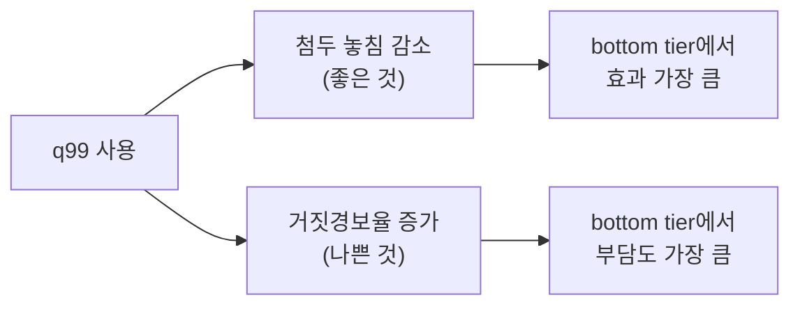
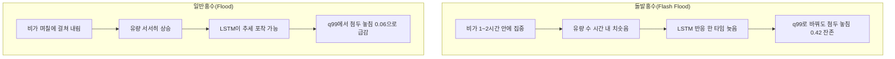
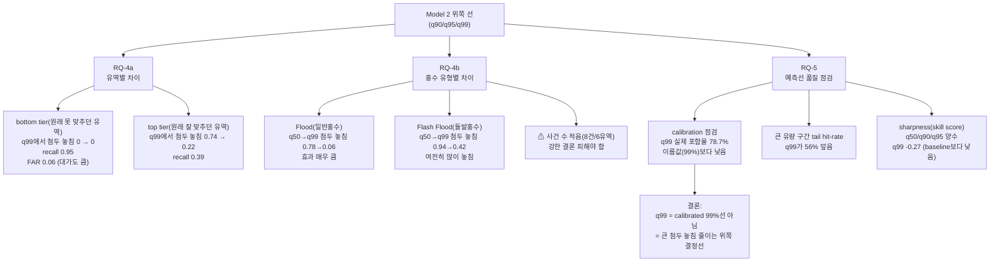

# 11. 이질성과 예측 품질 (유역별·홍수 유형별 차이 + calibration)

이 문서는 학부생 기준으로 세 가지 질문을 한 번에 풀어낸다.

- 같은 모델이라도 **유역(강이 모이는 땅 단위)마다** 개선 효과가 다른가? (RQ-4a)
- **홍수 유형마다** 개선 효과가 다른가? (RQ-4b)
- Model 2가 내놓는 여러 예측선이 **숫자로 봤을 때 믿을 만한가?** (RQ-5)

앞 장들에서 우리는 Model 2(여러 높이의 예측선을 동시에 내놓는 모델)가 큰 유량 첨두를 덜 놓친다는 것을 봤다. 여기서는 그 효과가 **어디서 크고 어디서 작은지**, 그리고 그 예측선들이 **얼마나 정직한 숫자인지**를 본다.

분석 전제: expanded DRBC observed test 85개 유역, seed `111 / 222 / 444`, test 기간 2014-2016.

---

## 이 문서를 읽기 전에: 핵심 개념 완전 풀이

수문학도 기계학습도 모른다고 가정하고 본문에서 자주 쓰는 말을 모두 풀어둔다. 이미 아는 용어는 건너뛰어도 된다.

### 유역이란

비가 내리면 물이 낮은 쪽으로 흘러 결국 강 하나로 모인다. 그 강으로 물이 모이는 땅 전체를 **유역**이라고 부른다. 서울의 한강 유역, 낙동강 유역처럼 구역이 정해진다. 이 연구에서는 미국 델라웨어강 유역(DRBC 지역) 안에 있는 85개 소유역을 대상으로 한다.

유역마다 특성이 다르다. 도시처럼 아스팔트가 많으면 비가 빨리 하천으로 흘러들어가고, 숲이 많으면 땅이 물을 오래 머금는다. 경사가 급하면 유량이 빠르게 치솟았다 빠지고, 완만하면 천천히 오르고 내린다. 이런 차이가 모델 예측 난이도를 결정한다.

### Model 1과 Model 2

- **Model 1**: LSTM(Long Short-Term Memory, 시간 순서를 기억하는 인공신경망) 기반 모델로, 매 시간마다 유량을 **하나의 값**으로 예측한다. "이 시각의 유량은 50 m³/s다"처럼 단일 예측선만 낸다.
- **Model 2**: 같은 LSTM 구조지만 학습 방식을 바꿔, 매 시간마다 **여러 높이의 예측선**을 동시에 낸다. "중앙 예측은 50, 보수적으로 보면 최대 300" 같은 식이다. 이 여러 선을 quantile(분위수)이라고 부른다.

### quantile(분위수) q50 / q90 / q95 / q99 란

quantile은 "분포에서 일정 비율 아래에 들어오는 값"이다. 일상적인 비유로 설명하면 이렇다.

> 100명이 시험을 봤을 때, 90점을 "90번째 백분위수"라고 하면 그 아래에 90명이 있다는 뜻이다.

유량 예측에서도 같다.

| 예측선 이름 | 이름이 주는 의미 | 쉬운 비유 |
| --- | --- | --- |
| q50 | 관측값의 50%가 이 선 아래로 들어올 것 | 중앙값, 가운데 예측선 |
| q90 | 관측값의 90%가 이 선 아래로 들어올 것 | 꽤 보수적인 선 |
| q95 | 관측값의 95%가 이 선 아래로 들어올 것 | 더 보수적 |
| q99 | 관측값의 99%가 이 선 아래로 들어올 것 | 거의 최상단 보수 선 |

단, 이름이 주는 의미와 실제가 다를 수 있다. 이걸 확인하는 게 RQ-5 calibration 분석이다.

### NSE란

NSE(Nash-Sutcliffe Efficiency)는 모델이 관측 유량을 얼마나 잘 재현하는지 재는 점수다. 점수 범위와 의미는 이렇다.

| NSE 값 | 의미 |
| --- | --- |
| 1.0 | 완벽하게 맞춤 |
| 0.7 이상 | 잘 맞춤 |
| 0 | 그냥 평균값을 항상 출력하는 수준과 같음 |
| 음수 | 평균값보다 못함 |

유역마다 지형·토지이용·강 규모가 달라서, 같은 모델이어도 NSE가 유역에 따라 0.2~0.9까지 크게 벌어진다.

### calibration(보정 정도)이란

calibration은 "예측이 실제 빈도와 얼마나 일치하는지"다. 일상적인 비유로 풀면 이렇다.

> 기상청이 "내일 비 올 확률 70%"를 100번 예보했다고 하자. 그 중 실제로 비가 온 날이 70일이면 calibration이 완벽하다. 50일밖에 안 됐으면 예보가 과하게 자신했다는 뜻이고, 90일이면 너무 낮게 말한 것이다.

유량 예측에서 `q99` 선은 "관측값의 99%가 이 선 아래로 들어온다"고 주장한다. 실제로 79%만 들어온다면 calibration이 어긋난 것이다. 이것을 **undercoverage(들어오는 비율 부족)** 라고 부른다.

### sharpness(예리함)이란

sharpness는 예측이 얼마나 단정적이고 좁은가다. 비유를 들면 이렇다.

> "내일 기온은 -100°C에서 100°C 사이"라고 예보하면 거의 틀릴 일이 없다. 하지만 이건 아무 정보도 없는 것이다. "내일 기온은 15~18°C" 예보가 맞으면 훨씬 유용하다.

예측이 좁을수록(단정적일수록) sharpness가 높다. 하지만 좁게 예보했다가 틀리면 calibration이 나빠진다. 그래서 둘을 **함께** 봐야 한다.

---

## RQ-4a. 유역마다 개선 효과가 다를까

### 무엇을 보는 분석인가

Model 2가 평균적으로 도움이 된다고 해서 모든 유역에서 똑같이 도움이 되지는 않는다. 우리는 원래부터 어려운 유역과 쉬운 유역을 분리해서, Model 2의 위쪽 선이 **어떤 곳에서 더 극적으로 작동하는지** 확인한다.

### 왜 이 분석이 필요한가

"Model 2가 좋다"는 결론만으로는 실제 활용에 부족하다. 예를 들어 홍수 경보 시스템에 Model 2를 붙인다면, 어느 유역에 위쪽 선을 적극 활용해야 하고 어느 유역은 덜 의존해도 되는지 알아야 한다. 또한 연구 결론이 특정 유역 편향에서 나온 것은 아닌지 점검해야 한다.

### NSE 성능 구간(NSE 3-tier cohort)이란

85개 유역을 **Model 1의 test 기간 NSE 점수 기준**으로 세 묶음(tier)으로 나눈다. 위에서 1/3, 중간 1/3, 아래 1/3이다.

| 묶음 이름 | 뜻 | 유역 수 |
| --- | --- | --- |
| top (잘 맞춤) | Model 1이 원래부터 잘 맞추던 유역 | 28 |
| mid (보통) | 중간 수준 | 28 |
| bottom (못 맞춤) | Model 1이 원래 어려워하던 유역 | 29 |

이 묶음은 **Model 1 NSE**라는 하나의 기준으로만 나눈다. Model 2의 성능이나 홍수 첨두 관련 지표는 여기에 쓰지 않는다.

### 왜 NSE로 나누고 다른 지표로 평가하나 — 순환논리 함정

이 설계에서 가장 중요한 원칙을 짚어야 한다.

**나쁜 설계 예시:** "Model 2로 첨두 놓침이 많이 줄어든 유역"을 bottom tier로, "첨두 놓침이 조금 줄어든 유역"을 top tier로 정의하면 어떻게 될까? bottom tier에서 Model 2 효과가 크다는 결론이 **정의 자체에서 나온다.** 이것이 순환논리(circular reasoning)다. 같은 숫자로 나누고 같은 숫자로 평가하면 결론이 저절로 만들어진다.

**이 연구의 설계:** 나누는 기준(Model 1 NSE)과 평가하는 지표(첨두 놓침·잡은 비율·거짓경보)는 **개념적으로 다른 측면**이다. NSE는 전체 기간 유량 곡선의 형태 유사도이고, 첨두 놓침은 극단 사건에서의 최댓값 과소추정이다. 이 둘은 연관이 약하므로 강한 순환은 아니다. 다만 완전히 독립적이지도 않으니, 아래 숫자는 "확정 인과"가 아닌 **패턴 경향**으로 읽는다.

### 측정 지표 풀이

소스 문서에서 쓰는 지표를 하나씩 풀어둔다.

| 지표 | 수식 개요 | 0에 가까울수록 | 1에 가까울수록 |
| --- | --- | --- | --- |
| **α (알파, 첨두 놓침)** | 예측 첨두 대비 관측 첨두가 얼마나 높은지 | 잘 잡음 | 크게 놓침 |
| **β (베타, 창 포착률)** | 첨두 주변 ±6시간에서 예측이 관측을 얼마나 덮는지 | 잘 못 덮음 | 잘 덮음 |
| **recall (재현율)** | 큰 유량 시각 중 예측선이 실제로 맞게 간 비율 | 거의 못 잡음 | 거의 다 잡음 |
| **FAR (거짓경보율)** | 실제로 크지 않은 시각에서 경보를 울린 비율 | 거짓경보 없음 | 거짓경보 많음 |

### 결과: Q99 event(관측 유량이 매우 컸던 시각) 기준

| 묶음 | 예측선 | α (첨두 놓침) | β (창 포착률) | recall (재현율) | FAR (거짓경보율) |
| --- | --- | --- | --- | --- | --- |
| top (잘 맞춤) | q50 | 0.74 | 0.31 | 0.02 | 0.0003 |
| top (잘 맞춤) | q99 | 0.22 | 0.92 | 0.39 | 0.0077 |
| mid (보통) | q50 | 0.68 | 0.39 | 0.07 | 0.0008 |
| mid (보통) | q99 | 0.00 | 1.37 | 0.62 | 0.0115 |
| bottom (못 맞춤) | q50 | 0.46 | 0.85 | 0.26 | 0.0077 |
| bottom (못 맞춤) | q99 | 0.00 | 2.15 | 0.95 | 0.0604 |

### 이 결과가 의미하는 것

**① bottom tier(원래 어려웠던 유역)에서 효과가 가장 극적이다**

`q50`(중앙 예측선)만 보면 이미 첨두 놓침이 0.46이나 된다. Model 1이 이런 유역에서 큰 홍수를 반 가까이 과소추정했다는 뜻이다. 그런데 `q99`(위쪽 선)로 바꾸면 첨두 놓침이 **0으로 떨어지고**, 큰 유량 시각의 **95%를 잡는다.** 수치만 보면 거의 완벽한 개선이다.

단, 대가가 있다. 거짓경보율(FAR)이 0.06까지 올라간다. 이는 실제로 큰 유량이 아닌 시각에서도 6%는 "크다"고 울린다는 뜻이다. 경보 시스템으로 쓴다면 허위 경보가 적지 않게 나온다는 의미다.

**왜 원래 어려운 유역에서 위쪽 선의 효과가 클까?**

직관은 이렇다. Model 1이 어려워하는 유역은 유량 변동이 크거나, 지형·토지이용이 복잡하거나, LSTM이 잘 파악하지 못한 특성이 있는 곳이다. 이런 곳에서 중앙 예측(q50)은 크게 낮게 잡히는 경우가 많다. 위쪽 선(q99)은 애초에 훨씬 높이 그어지므로, 관측 첨두가 그 아래로 들어올 여지가 크다. 반대로 Model 1이 이미 잘 맞추는 유역은 중앙 예측이 첨두 근방에 있으므로, 위쪽 선이 조금만 더 올라가도 이미 관측이 들어오는 상태다. 추가 이득의 폭이 작다.

**② top tier(원래 잘 맞추던 유역)에서는 여전히 22% 놓친다**

이미 잘 맞추는 유역에서 `q50`은 첨두 놓침이 0.74다. 즉 잘 맞춘다고 해도 큰 홍수 첨두는 여전히 크게 낮게 잡힌다. `q99`로 바꾸면 0.22로 줄어들지만, 완전히 없어지지는 않는다. recall도 0.39에 그친다. 큰 홍수를 잡는 능력은 여전히 제한적이다.

또한 over-pred(초과 예측 크기)가 top tier에서 가장 크다(소스 문서: top q99에서 7.83, bottom q99에서 3.71). 이는 top tier 유역이 대체로 유량 규모 자체가 커서, 위쪽 선이 관측보다 크게 그어지는 절댓값이 크다는 뜻이다. 유역 규모 효과이지, 모델이 특별히 나빠서가 아니다.

**③ 맞교환(trade-off)을 같이 봐야 한다**



이 두 효과는 같이 움직인다. 위쪽 선을 높이 그을수록 놓치는 홍수가 줄지만, 동시에 안 왔는데 경보가 울리는 경우도 늘어난다. 이 맞교환은 유역마다 다르게 나타나지만, 모든 묶음에서 동일하게 존재한다.

---

## RQ-4b. 홍수 유형마다 개선 효과가 다를까

### 무엇을 보는 분석인가

홍수가 모두 같은 생김새가 아니다. 뇌우 한 방에 두 시간 만에 강이 차오르는 홍수와, 며칠씩 비가 와서 강이 서서히 넘치는 홍수는 전혀 다른 패턴이다. Model 2의 위쪽 선이 유형별로 얼마나 다르게 작동하는지 본다.

### NOAA 홍수 유형이란

NOAA(National Oceanic and Atmospheric Administration, 미국 해양대기청)는 미국에서 실제로 발생한 홍수 사건을 **Storm Events Database**에 기록한다. 이 기록에는 홍수가 어떤 종류인지 분류가 붙어 있다.

| 유형 이름 | 한국어 풀이 | 특징 |
| --- | --- | --- |
| Flash Flood (돌발홍수) | 짧은 시간 안에 갑자기 불어나는 홍수 | 수 시간 내에 치솟고 내려감, 예측하기 어려움 |
| Flood (일반홍수) | 강이 서서히 넘치는 전형적 홍수 | 며칠에 걸쳐 수위가 오르고 내림 |
| Coastal Flood (해안홍수) | 조수·폭풍해일로 해안이 침수 | 바닷물이 내륙으로 밀려들어오는 형태 |

이 분류를 이용해 "어떤 종류의 홍수에서 Model 2가 더 잘(또는 덜) 작동하는가"를 비교한다.

### 중요한 단서: 이 분석은 일부 유역만 대상이다

85개 전체 유역이 NOAA 기록과 겹치지는 않는다. 구체적으로 이렇다.

- NOAA Storm Events Database에 기록된 홍수 중 expanded DRBC 85개 유역과 겹치는 유역: 46개
- test 기간(2014-2016)에 실제 홍수 사건이 확인된 유역: 약 21개
- test 기간 내 분석에 쓰인 사건 수: 65개

65개 사건은 Flash Flood 8개, Flood(일반) 32개, NOAA 기록 없는 NWS 기준 사건 25개로 나뉜다. Coastal Flood는 test 기간 기준 해당 사건이 너무 적어 표에서 제외했다.

이처럼 **사건 수가 적고 유역도 제한적**이다. 85개 전체에서 나온 결과와 직접 비교하면 안 된다. 이 결과는 통계적 확인(significance)보다 **사례 비교(case comparison)** 수준으로 읽는다.

### 측정 지표 풀이 (앞에서 나온 것과 같음)

- **α**: 첨두 놓침. 0에 가까울수록 잘 잡음.
- **β**: 첨두 주변 시간대 포착률. 1 이상이면 첨두 위아래 시간대를 충분히 덮음.

`q50 → q99`는 중앙 예측선에서 위쪽 보수선으로 바꿨을 때의 변화를 보여준다.

### 결과

| 홍수 유형 | 사건 수 | 유역 수 | α q50 | α q99 | β q50 | β q99 |
| --- | --- | --- | --- | --- | --- | --- |
| Flash Flood (돌발홍수) | 8 | 6 | 0.94 | 0.42 | 0.08 | 0.88 |
| Flood (일반홍수) | 32 | 15 | 0.78 | 0.06 | 0.29 | 1.09 |
| NoNOAA (NWS만 확인) | 25 | 9 | 0.78 | 0.00 | 0.28 | 1.20 |

※ NoNOAA: NWS(미국 국립기상청)가 홍수 기준선 초과를 확인했지만 NOAA Storm Events 기록이 없는 사건. 모델 동작 자체는 정상 분석되지만, 논문 핵심 지표로 쓸 때는 NOAA 미확인임을 명시해야 한다.

### 이 결과가 의미하는 것

**① 일반홍수(Flood)에서는 위쪽 선이 거의 완벽에 가까이 작동한다**

`q50`에서 0.78이던 첨두 놓침이 `q99`로 바꾸면 0.06으로 떨어진다. 거의 사라진다. 창 포착률(β)도 0.29에서 1.09로 올라가 첨두 주변을 충분히 덮는다.

**왜 일반홍수에서 잘 작동할까?**

일반홍수는 며칠에 걸쳐 천천히 수위가 오른다. LSTM은 이전 시각들의 유량과 강수 패턴을 기억하기 때문에, 상승 중인 강에서 "이 방향으로 계속 오를 것"을 어느 정도 잡아낼 수 있다. 또한 첨두까지 시간이 있으므로 위쪽 선이 충분히 높이 그어질 여유가 있다.

**② 돌발홍수(Flash Flood)에서는 위쪽 선을 써도 여전히 많이 놓친다**

`q50`에서 0.94이던 첨두 놓침이 `q99`로 바꿔도 0.42에 머문다. 절반 가까이 여전히 놓친다. 창 포착률(β)은 0.08에서 0.88로 상당히 올라가지만, 첨두 최댓값 자체는 잡기 어렵다.

**왜 돌발홍수에서 어려울까?**

돌발홍수는 수 시간 안에 유량이 급격히 치솟는다. 모델이 이전 시각 정보를 보고 다음 시각을 예측할 때, 갑자기 튀는 순간은 예측하기 매우 어렵다. 비유하자면, 어제까지의 날씨 패턴으로 내일을 예측할 수는 있지만 다음 5분 안에 갑자기 돌풍이 부는 순간은 맞히기 훨씬 어렵다. 모델 반응이 실제 유량 상승보다 한 타임 늦어지는 경향이 있다.

**③ 두 유형의 차이를 시각적으로 비교**



**④ 사건 수가 매우 적다는 점을 잊지 말자**

Flash Flood는 단 8개 사건, 6개 유역이다. 이 숫자로는 "통계적으로 유의미한 차이"라고 단정하기 어렵다. 만약 특이한 유역 하나가 포함되거나 빠지면 결과가 달라질 수 있다. 그래서 이 결과는 "방향을 보여주는 사례"로 읽고, 강한 일반화는 피한다.

---

## RQ-5. 예측선의 숫자가 믿을 만한가 (calibration과 sharpness)

### 무엇을 보는 분석인가

앞 두 분석은 "큰 홍수를 잘 잡느냐"에 집중했다. 여기서는 한 발 물러나 **Model 2의 예측선 자체가 통계적으로 정직한 숫자인지**를 점검한다. 쉽게 말해, `q99`라는 이름이 붙은 선이 **실제로 99% 역할을 하는가?**

이 분석은 Model 2가 완벽하다고 주장하기 위한 것이 아니다. 오히려 반대다. **위쪽 선 개선 효과를 말할 때 calibration의 한계를 정직하게 같이 밝히는 방어용 분석이다.** "q99가 홍수를 잘 잡는다"고 말하려면 동시에 "하지만 q99는 calibrated 99% 선이 아니다"도 같이 말해야 한다.

### calibration을 확인하는 방법

방법은 간단하다. test 기간 전체 시각(약 200만 시간·유역 조합)에서, 관측 유량이 각 예측선 아래로 들어온 비율을 직접 센다.

예시로 생각해보자.

> `q99` 선이 2,000,000시간 중에 그어졌다고 하자. 그 시각들에서 실제 관측 유량이 `q99` 아래에 있었던 시각이 몇 개인지 세면 된다. 1,980,000개라면 99%가 맞다. 1,574,000개라면 78.7%밖에 안 된다.

이렇게 실제 비율을 재는 것이 **empirical coverage(실제 포함율)** 확인이다.

### 결과: 전체 기간 calibration 점검

| 예측선 | 이름이 주는 비율(이론) | 실제로 관측이 그 아래 들어온 비율 | 차이 |
| --- | --- | --- | --- |
| q50 | 0.50 (50%) | **0.339 (33.9%)** | -0.16 |
| q90 | 0.90 (90%) | **0.506 (50.6%)** | -0.39 |
| q95 | 0.95 (95%) | **0.638 (63.8%)** | -0.31 |
| q99 | 0.99 (99%) | **0.787 (78.7%)** | -0.20 |

모든 선에서 실제 비율이 이름값보다 낮다. 이것을 **undercoverage(들어오는 비율 부족)** 라고 부른다.

가장 중요한 수치는 `q99`다. 이름은 "99% 선"이지만 실제로는 관측값의 **79%만** 그 아래에 들어온다. 즉 100시간 중 21시간은 관측값이 `q99` 위에 있다. 이것이 calibration 오차다.

### 왜 undercoverage가 생기는가

몇 가지 원인을 생각해볼 수 있다.

1. **큰 홍수를 중심으로 과소추정**: LSTM이 전체적으로 유량을 낮게 잡는 경향이 있다면, 위쪽 선도 관측 첨두보다 낮게 그어질 수 있다.
2. **LSTM의 구조적 한계**: LSTM은 과거 패턴에서 학습하므로, 훈련 중 보지 못한 극단 상황에서는 예측이 관측보다 낮게 나올 수 있다.
3. **예측 분포의 모양 문제**: quantile을 각각 따로 학습하는 방식이라 극단 꼬리(q99)에서 충분히 보수적으로 학습하지 못했을 수 있다.

소스 문서는 정확한 원인을 단정하지 않으므로, 여기서도 정성적으로만 언급한다.

### 큰 유량 시각만 따로 보기: tail hit-rate

전체 기간 calibration은 "모든 시각"을 대상으로 했다. 그런데 대부분의 시각은 유량이 평범하다. 우리가 정말 관심 있는 것은 **"관측 유량이 매우 컸던 시각에서 q99이 그걸 덮는가"** 이다.

이걸 재는 지표를 **tail hit-rate(꼬리 적중률)** 라고 부른다.

| 예측선 | 큰 유량 시각(Q99 초과)에서의 적중률 |
| --- | --- |
| q50 | 0.218 (21.8%) |
| q90 | 0.371 (37.1%) |
| q95 | 0.424 (42.4%) |
| q99 | **0.563 (56.3%)** |

`q99` 선은 관측 유량이 매우 컸던 시각의 **56%** 를 덮는다. 나머지 44%는 여전히 놓친다.

이 숫자를 어떻게 읽어야 할까? 두 가지 관점이 있다.

- **긍정적 관점**: 전체 기간 calibration(79%)보다 낮아 보이지만, 평범한 시각에서는 낮더라도 **정작 중요한 큰 유량 구간에서 절반 이상을 덮는다.** 이것은 의미 있는 신호다.
- **주의할 관점**: 큰 홍수의 44%는 여전히 `q99` 위에 있다. "q99 아래면 안전하다"는 식으로 쓰면 안 된다.

앞 장의 recall(재현율, 약 0.58)과 이 56%가 비슷하게 나오는 것은 두 지표가 같은 현상을 다른 각도에서 보기 때문이다. 일관된 신호다.

### 첨두 사건 포착률

test 기간의 홍수 첨두 시각에서 `q99`가 실제 첨두를 잡는 비율도 별도로 잰다.

- 첨두 시각 정확히: **52.2%**
- 첨두 시각 ± 6시간 창 기준: **64.3%**

즉 `q99`는 홍수 첨두 시각의 절반 남짓을 덮고, 앞뒤 6시간으로 조금 여유를 주면 약 2/3를 덮는다.

### sharpness: 예측선이 과거 평균보다 얼마나 나은가

calibration이 "정직한가"라면, sharpness는 "유용한가"다. 비교 기준은 **climatology(과거 기록 평균 분포)** 다. 이는 훈련 기간(2000-2010)의 해당 유역 유량 분포에서 단순히 quantile을 뽑은 것이다. 즉 "아무것도 안 하고 과거 평균만 쓴 것"이 baseline이다.

이 baseline보다 Model 2가 얼마나 나은지를 **skill score(기술 점수)** 로 잰다. 양수면 baseline보다 낫고, 음수면 baseline보다 못하다.

| 예측선 | skill score |
| --- | --- |
| q50 | +0.104 |
| q90 | **+0.217** |
| q95 | +0.132 |
| q99 | **-0.271** |

`q50 / q90 / q95`는 모두 양수다. Model 2가 단순 과거 평균보다 더 좋은 예측을 한다는 뜻이다. 그런데 `q99`는 -0.271이다. **과거 평균보다 오히려 나쁘다.**

### 왜 q99은 skill score가 음수인가

이것이 sharpness와 calibration의 맞교환이다. 직관적으로 설명하면 이렇다.

과거 평균으로 `q99`를 뽑으면, 10년 치 데이터에서 실제로 99%가 그 아래 있었던 값이 나온다. 이 값은 대체로 **보수적이고 높다.** 실제 관측이 그 아래에 잘 들어오므로 calibration 점수가 높다. 반면 Model 2의 `q99`는 매 시각마다 역동적으로 계산되지만, 극단 꼬리에서는 calibration이 무너지면서 오히려 baseline보다 못한 점수가 나온다.

비유로 설명하면 이렇다.

> "내일 기온이 -50~50°C 사이"라고 항상 예보하면 틀릴 일이 없다(calibration 완벽). 하지만 "내일 기온이 정확히 17°C"라고 예보하면 유용하지만 틀릴 수 있다(sharpness 높지만 calibration 손해).

Model 2의 `q99`는 역동적으로 예측하려다 극단 꼬리에서 calibration 손해를 보고, skill score까지 음수가 된 것이다.

### 위쪽 선의 폭

큰 유량 시각에서 `q99`가 `q50` 위로 얼마나 벌어지는지도 잰다.

- Q99 초과 시각에서 `q99 - q50`의 중앙값: **20.836 m³/s**
- 이는 해당 시각 관측값의 약 **74.6%** 에 해당하는 폭

즉 `q99`는 큰 유량 시각에서 중앙 예측보다 관측값의 3/4 폭만큼 더 보수적으로 위에 그어진다. 단 관측 첨두가 그 위를 뚫을 때는 여전히 놓친다.

### 통합해서 읽기: "q99를 어떻게 불러야 하는가"

이 분석 전체를 한 문단으로 정리하면 이렇다.

```text
Model 2의 q99는 이름값(99%)대로의 calibrated 예측구간이 아니다.
전체 기간으로 보면 실제 79%만 덮는다(undercoverage).
skill score도 과거 평균보다 낮다(-0.27).

하지만 정작 중요한 큰 유량 구간에서는 절반 이상(56%)을 덮는다.
앞 장에서 본 "첨두 놓침 감소" 효과와 일관된 신호다.

따라서 q99를 "calibrated 99% 예측구간"으로 부르면 틀리다.
"큰 홍수 첨두 놓침을 줄이는 위쪽 결정선"으로 부르는 것이 정확하다.
```

---

## 세 분석을 한눈에: 전체 구조



---

## 주의사항 모음: 비전공자가 흔히 오해하는 것

### 주의 1: "bottom tier에서 α=0이면 완벽한 것 아닌가?"

아니다. α=0은 Q99 event 기준 **첨두 놓침이 없다는** 뜻이다. 그런데 동시에 FAR(거짓경보율)이 0.06이나 된다. 큰 홍수가 아닌 시각에서도 6%는 경보를 울린다. 실용적으로 경보 시스템에 쓰려면 이 거짓경보 부담을 반드시 같이 본다.

또한 이 α=0에는 **sub-sample selection 효과**가 일부 포함될 수 있다(소스 문서 주의사항). bottom tier 유역이 특정 조건에서 뽑히는 과정에서 bias가 생길 수 있다. 완전히 독립적 결론으로 단정하지 않는다.

### 주의 2: "RQ-4b에서 Flash Flood가 어렵다고 단정할 수 있는가?"

단정하기 어렵다. Flash Flood는 8사건, 6유역이다. 이 정도 사건 수로는 통계적으로 "Flash Flood이면 항상 어렵다"는 주장을 지지하기 부족하다. 특정 유역 하나가 특이하게 어려웠을 수도 있다. 결론은 "이 사례들에서 그런 패턴이 보였다" 정도다.

### 주의 3: "q99 skill score가 음수니까 q99는 쓸모없는 것 아닌가?"

아니다. skill score는 **전체 기간, 평균 오차** 기준이다. 큰 홍수를 잡는 능력(tail hit-rate 56%, 첨두 놓침 감소)은 이 skill score에 제대로 반영되지 않는다. skill score는 "평균적으로 얼마나 나은가"이지, "큰 홍수 순간에 얼마나 유용한가"가 아니다. 두 지표는 다른 것을 잰다.

### 주의 4: "undercoverage가 있으면 q99가 잘못 학습된 것 아닌가?"

반드시 그런 것은 아니다. quantile 예측에서 undercoverage는 모델 학습 방식, 데이터 분포, 극단 사건의 희소성 등 여러 요인의 복합 결과다. 어느 하나의 원인으로 단정하기 어렵다. 소스 문서도 특정 원인을 단정하지 않는다.

### 주의 5: "calibration이 나쁘면 q99 결과 전체를 믿지 말아야 하는가?"

이 분석 자체의 목적이 "q99를 버려야 한다"가 아니라 **"어떤 맥락에서 어떻게 해석해야 한다"를 명확히 하는 것**이다. 큰 첨두 놓침 감소 효과는 calibration이 나빠도 **실제 관측 데이터에서 나온 값**이므로 독립적으로 의미가 있다. 단, "99% 확률로 이 아래다"처럼 확률 주장을 할 때는 calibration 오차를 반드시 함께 밝혀야 한다.

---

## 이 장 전체 결론: 학부생 언어로

이 장의 핵심을 한 문장씩 정리한다.

1. **유역마다 다르다**: 원래 어려운 유역에서 Model 2 위쪽 선의 도움이 가장 극적으로 크다. 하지만 거짓경보 부담도 함께 커진다. 원래 쉬운 유역에서는 이득이 작다.

2. **홍수 유형마다 다르다**: 천천히 넘치는 일반홍수에서는 위쪽 선이 거의 완전히 작동한다. 갑자기 치솟는 돌발홍수에서는 위쪽 선을 써도 여전히 40% 넘게 놓친다. 단, 사건 수가 적어 강한 결론은 피한다.

3. **q99는 이름값 그대로의 99% 선이 아니다**: 실제로는 전체 기간의 79%만 덮는다. 큰 유량 구간에서는 56%를 덮는다. "calibrated 99% 예측구간"이 아닌, "큰 첨두 놓침을 줄이는 위쪽 결정선"으로 불러야 한다.

4. **맞교환은 항상 존재한다**: 첨두를 잘 잡을수록 거짓경보가 늘고, 위쪽 선이 보수적일수록 sharpness가 나빠진다. 하나의 지표만 보고 "좋다/나쁘다"를 말하면 반쪽짜리 평가다. 항상 이득과 대가를 함께 봐야 한다.
