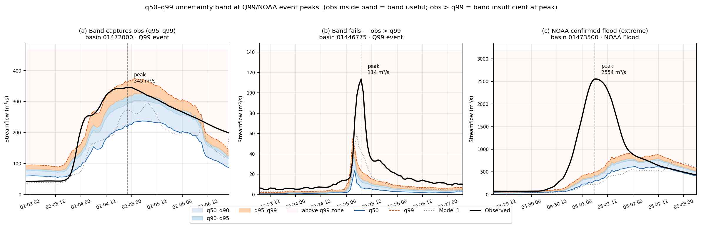
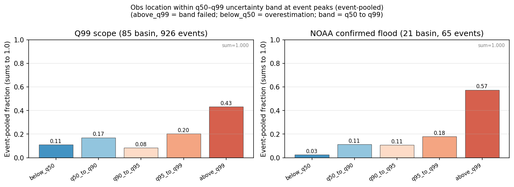
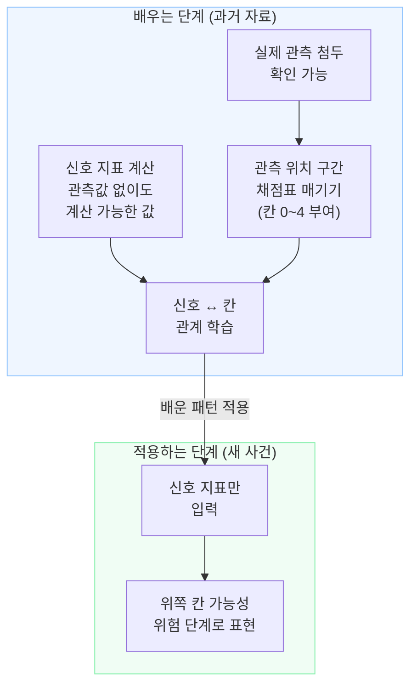
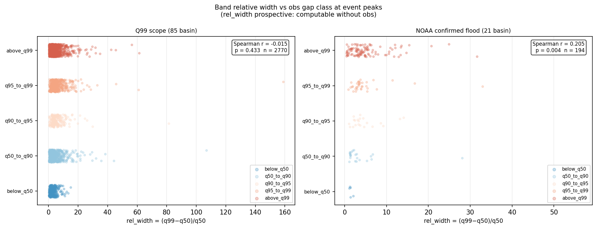
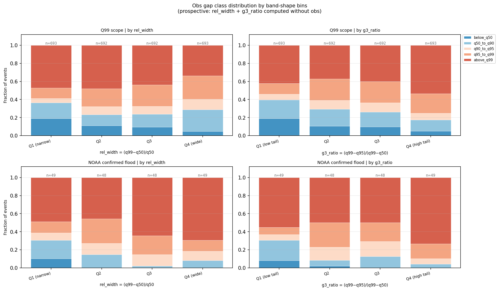
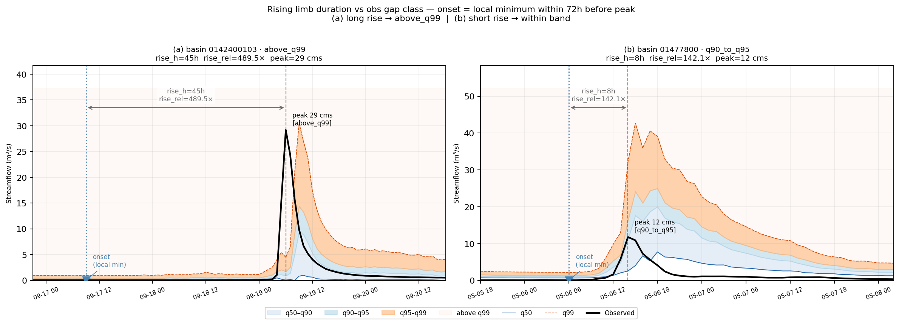
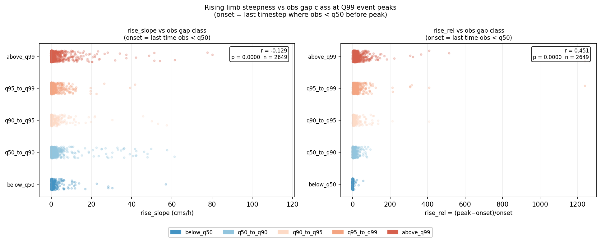
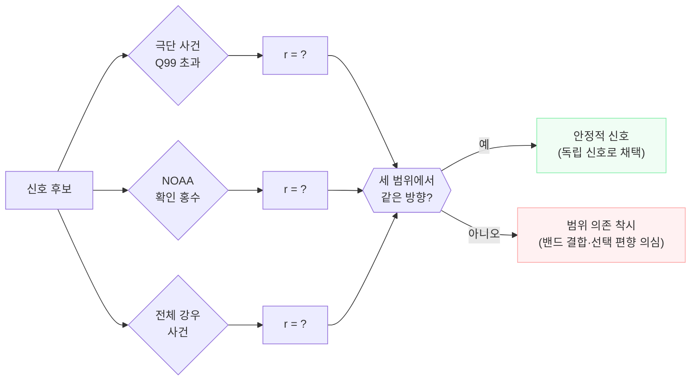
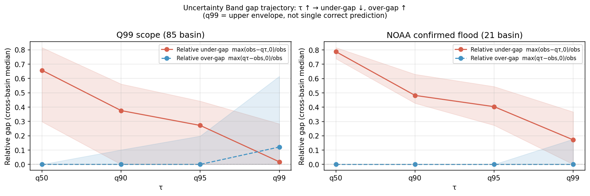
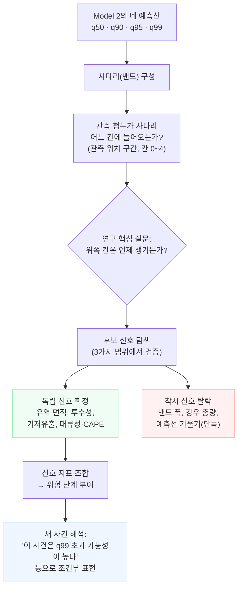

# 12. 관측 위치 구간 신호: 관측 첨두의 밴드 위치와 그 단서

이 문서는 우리 연구의 "관측 위치 구간 신호"(내부 코드명 `band_signal`)를 비전공 학부생 기준으로 설명한다. 앞 장들이 "모델이 첨두유량(홍수 때의 가장 큰 물 흐름)을 얼마나 낮게 잡는가"를 봤다면, 이 장은 한 걸음 더 들어가서 다음 두 질문을 동시에 다룬다.

1. **실제로 일어난 가장 큰 물 흐름이, 모델이 그어 둔 여러 예측선 중 어디쯤에 떨어지는가?**
2. **그 위치를 관측값 없이 미리 알려주는 단서(신호)가 있는가?**

전제는 다른 장과 같다. DRBC(Delaware River Basin Commission, 델라웨어 강 유역 관리 위원회) 지역에서 학습에 쓰지 않고 따로 떼어 둔(holdout) 관측 가능 유역 85개, seed(난수 씨앗) `111 / 222 / 444` 평균, test 기간 2014–2016, temporal split `train 2000–2010 / validation 2011–2013 / test 2014–2016`이다.

이 분석의 산출물과 그림은 모두 `output/model_analysis/band_signal/` 아래에 모여 있고, 계산을 담당하는 스크립트는 `scripts/model/expanded_drbc/` 폴더에 있다. 본문에서 각 수치가 어느 스크립트의 어느 부분에서 나오는지 그때그때 짚는다.

---

## 1장. 배경: 단일 예측의 한계와 네 예측선

### 단일 예측의 한계

날씨 예보를 생각해 보자. "내일 기온은 22도입니다"라는 한 줄짜리 예보는 편리하지만, 실제 기온이 18도가 될 수도 있고 26도가 될 수도 있다는 불확실성을 전혀 담지 못한다. 홍수 예측도 마찬가지다. 유역에 비가 얼마나 스며드는지, 앞선 며칠 동안 땅이 얼마나 차 있었는지, 강의 단면이 얼마나 넓은지 같은 요인들이 실제 유량에 영향을 주는데, 이 모든 불확실성을 하나의 숫자로 압축하면 정보를 잃는다.

우리 연구의 Model 2(확률형 quantile LSTM)는 이 불확실성을 여러 예측선으로 나타낸다. 같은 시각, 같은 유역에 대해 **동시에 네 개의 값**을 낸다.

### 네 개의 예측선

먼저 "quantile(분위수)"이 무슨 뜻인지부터 짚고 넘어간다.

> **quantile(분위수)란?** 어떤 값 x에 대해 "관측이 x보다 작을 확률이 몇 퍼센트인지"를 나타내는 눈금이다. 예를 들어 q90은 "관측이 이 값보다 낮을 확률이 90%"라는 뜻으로 모델이 그어 두는 선이다. 즉 q90 아래에 관측이 들어올 것을 90% 확률로 기대한다.

이 눈금을 네 곳에 찍으면 다음과 같다.

| 예측선 | 풀이 | 역할 |
| --- | --- | --- |
| **q50** | 관측이 이 아래일 확률 50% | 중앙 예측, 가장 "평균적"인 대표 유량 |
| **q90** | 관측이 이 아래일 확률 90% | 보통보다 높은 유량 구간의 시작 |
| **q95** | 관측이 이 아래일 확률 95% | 홍수에 가까운 고유량 구간 |
| **q99** | 관측이 이 아래일 확률 99% | 가장 위로 열어 둔 상단 보호선 |

이 네 선은 **서로 다른 정답 네 개가 아니다.** 하나의 예측을 중앙에서 극단 상단부까지 단계별로 펼쳐 보여 주는 **사다리(밴드)**다.

이 네 값은 모델이 매 시각 함께 내보내는 출력이고, 분석에서는 seed별 예측 시계열 파일(예측 결과를 시간순으로 적어 둔 표)에 다음 이름의 열로 저장된다. 같은 파일에 실제 관측 유량도 `obs` 열로 들어 있어, 한 시각에서 "관측이 네 예측선 중 어디에 들어왔는지"를 곧바로 따질 수 있다.

- 예측 시계열 파일: `output/model_analysis/primary/metrics/data/required_series/seed{111,222,444}/required_series.csv`
- 예측선 열 이름: `q50` · `q90` · `q95` · `q99`
- 관측 유량 열 이름: `obs`

---

## 2장. 사다리(밴드) 비유

### 사다리의 구조

아래 그림은 어느 한 홍수 사건에서 Model 2가 낸 네 개의 예측선을 시간축으로 그린 것이다 (실제 눈금 수치는 유역마다 다르므로 개념도다).

```
유량
(㎥/s)
  │
  │                         ◆ q99 (가장 위 — 상단 보호선)
  │                   ◆ q95
  │             ◆ q90
  │       ◆ q50 (중앙 예측)
  │  ◆
  │
  └──────────────────────────────────► 시간
     비 시작   비 최고조  첨두 예상 시점
```

시간이 지남에 따라 네 선이 모두 올라갔다가 내려온다. **비가 많이 올수록 네 선 모두 높아지고**, 비가 그치면 모두 낮아진다. 그런데 올라갈 때 네 선이 **서로 얼마나 벌어지는지**가 유역·강우 조건에 따라 달라진다. 어떤 사건에서는 q50과 q99가 거의 붙어 있고, 어떤 사건에서는 q99가 훨씬 위로 튀어 오른다.

실제 사건에서 이 사다리가 어떻게 펼쳐지는지를 아래 그림이 보여 준다. 왼쪽은 밴드가 관측 첨두를 잘 감싼 경우, 가운데는 좁은 밴드가 첨두를 놓친 경우, 오른쪽은 NOAA(National Oceanic and Atmospheric Administration, 미국 해양대기청)가 공식 확인한 극단 홍수다.



### 관측 첨두가 떨어지는 사다리 칸

홍수가 지나간 뒤 우리는 실제 관측 기록을 확인한다. 관측된 첨두유량(홍수 중 가장 큰 순간의 물 흐름)이 사다리의 어느 칸에 들어왔는지 확인하면, 모델이 얼마나 잘 "감쌌는지"를 알 수 있다. 관측 첨두 위치는 네 가지 상황으로 갈린다.

| 상황 | 관측 첨두 위치 | 의미 |
| --- | --- | --- |
| A (`below_q50`) | q50보다 낮음 | 중앙 예측조차 과대. 사다리 맨 아래 칸도 못 채움 |
| B (`q50_to_q90`) | q50~q90 사이 | 밴드가 관측을 무난하게 감쌈 |
| C (`q95_to_q99`) | q95~q99 사이 | q99가 겨우 덮음. 첨두를 상당히 낮게 잡은 신호 |
| D (`above_q99`) | q99도 넘어버림 | 사다리 전체가 너무 낮음. 본 연구가 가장 주목하는 첨두 과소추정 사건 |

---

## 3장. 다섯 칸으로 나눈 관측 위치 구간

### 칸 나누기 규칙

앞의 네 상황을 포함해, 관측 첨두가 사다리 어디에 들어왔는지를 다섯 칸으로 정리한다. 코드에서는 0(가장 낮음)부터 4(가장 높음)까지 번호를 매긴다.

이 칸 나누기는 글로만 정한 약속이 아니라 실제 코드에 그대로 구현돼 있다. 관측 유량을 네 예측선과 차례로 비교해 다섯 이름 중 하나를 붙인다. (아래 수식에서 $Q$는 유량을 뜻하고, 아래첨자 $\text{obs}$는 실제 관측, $\text{sim},\tau$는 분위 $\tau$의 모델 예측을 가리킨다. 본문 산문에서는 "관측", "예측"으로 풀어 쓴다.)

```python
# scripts/model/expanded_drbc/compute_ub_location_class.py: classify_obs()
if obs <= q50:
    return "below_q50"
if obs <= q90:
    return "q50_to_q90"
if obs <= q95:
    return "q90_to_q95"
if obs <= q99:
    return "q95_to_q99"
return "above_q99"
```

이 함수는 관측 유량(`obs`)을 q50→q90→q95→q99 순서로 비교해 다섯 이름 중 하나를 붙인다. 붙인 결과는 변수명 `obs_class`로 저장되고, 0~4 번호로 바꾼 값은 변수명 `obs_class_ordinal`로 같이 둔다.

- 분류 결과 변수: `obs_class`(이름) · `obs_class_ordinal`(0~4 번호)
- 산출 표: `output/model_analysis/band_signal/band_shape/tables/location_class_q99.csv`(극단 사건), 같은 폴더 `_noaa.csv`(NOAA 확인 홍수)

아래는 다섯 칸을 빠르게 참조하는 카드다. 각 칸의 구체적 의미는 표 아래 하위 절에서 풀어 쓴다.

| 번호 | 구간 이름(변수명) | 관측 첨두 위치 | 최적화 방향 |
| ---: | --- | --- | --- |
| 0 | `below_q50` | 관측 ≤ q50 | 적을수록 좋음(중앙 예측 과대) |
| 1 | `q50_to_q90` | q50 < 관측 ≤ q90 | 무난(밴드 하단부에서 감쌈) |
| 2 | `q90_to_q95` | q90 < 관측 ≤ q95 | 주의(밴드 중간 상단부) |
| 3 | `q95_to_q99` | q95 < 관측 ≤ q99 | 위험 신호(밴드 극단 상단부) |
| 4 | `above_q99` | 관측 > q99 | 적을수록 좋음(첨두 과소추정) |

번호가 **높을수록** 실제 첨두가 사다리 위쪽에 들어왔다는 뜻이고, 모델이 첨두를 **과소추정**했다는 신호다. 번호가 **낮을수록**(단, 0은 예외) 모델 밴드가 관측 첨두를 넉넉히 감쌌다는 뜻이다. 0번(`below_q50`)은 방향이 반대인 실패다. 위쪽으로 못 잡은 게 아니라 중앙선조차 실제보다 높게 잡은 과대 예측이기 때문이다.

극단 사건(Q99 초과)과 NOAA 확인 홍수에서 각 칸의 사건 비율은 아래 그림처럼 분포한다. 두 범위 모두 `above_q99`(맨 오른쪽 빨간 막대)가 가장 큰데, 이것이 우리 연구가 줄이려는 첨두 과소추정 사건이다.



### `below_q50` — 중앙 예측조차 과대

모델이 낸 가장 낮은 대표선(q50)보다도 실제 유량이 더 낮았던 경우다. 이 칸은 "모델이 첨두를 놓쳤다"가 아니라 반대로 "모델이 평소 유량을 너무 높게 잡았다"는 신호다. 다섯 칸 중에서 유일하게 과대 쪽 실패다.

### `q50_to_q90` — 밴드 하단부에서 감쌈

실제 유량이 중앙선보다는 높았지만 q90 안에 들어왔다. 밴드가 관측을 여유 있게 덮은, 가장 건강한 상태다.

### `q90_to_q95` — 밴드 중간 상단부

관측이 q90을 넘어 q95 안까지 올라왔다. 아직 사다리 안이지만 위쪽으로 다가서고 있어 주의가 필요한 구간이다.

### `q95_to_q99` — 밴드 극단 상단부

관측이 맨 위 두 칸 사이까지 올라와 q99가 겨우 덮은 상태다. 모델이 첨두를 상당히 낮게 잡았다는 위험 신호다.

### `above_q99` — 사다리 전체가 낮음

가장 위로 열어 둔 q99마저 관측이 넘어버린 경우다. 이 연구가 가장 주목하는 첨두 과소추정 사건이며, 좋은 모델일수록 이 칸의 비율이 작아야 한다. 칸별 사건 비율은 합이 1이 되도록 모으며(변수명 `pooled_fraction`), 이 `above_q99` 비율이 전체 유역에서 충분히 낮게 유지돼야 "밴드가 그래도 쓸 만하다"고 본다.

### 균등하게 나누지 않은 이유

q50에서 q99까지를 균등하게 5등분하면 될 것 같지만, 실제로는 q90 / q95 / q99라는 의미 있는 지점에서 잘랐다. 이유는 두 가지다.

첫째, 이 분위수 눈금들 자체가 모델의 출력 기준이다. 모델이 q90을 냈다는 것은 "이 값 아래에 관측이 들어올 가능성을 90%로 기대한다"는 명시적 약속이다. 그 약속이 지켜졌는지를 확인하려면 그 눈금에서 잘라야 한다. `classify_obs()`가 q50→q90→q95→q99 순서로 경계를 비교하는 것도 이 때문이다.

둘째, 홍수 위험은 비선형이다. 보통 유량과 홍수 경계 사이의 간격보다, q95와 q99 사이의 간격이 수문학적으로 훨씬 큰 의미를 갖는다.

---

## 4장. 분석의 목적

### 연구의 핵심 질문

Model 2(확률형)의 가장 큰 장점은 q50 외에 q90 / q95 / q99라는 위쪽 예측선을 함께 준다는 것이다. 그런데 큰 홍수 때 과연 이 위쪽 선들이 실제 첨두를 감싸고 있는가?

앞 장들은 "q50을 기준으로 얼마나 낮게 잡았는가"를 봤다. 이 장은 한 걸음 더 나아가 "q99조차 넘어버리는 사건이 언제, 어떤 조건에서 생기는가"를 본다.

### 실용적인 이유

만약 "이런 조건이면 q99도 부족할 가능성이 크다"는 단서를 미리 파악할 수 있다면, 홍수 예보 현장에서 "모델 예측에 추가 여유분을 더해야 하는 사건"을 사전에 골라낼 수 있다. 이것이 관측 위치 구간 신호 분석의 실용적 목적이다.

---

## 5장. 먼저 풀어야 할 두 가지 혼동

### 혼동 1: q99 포함과 정밀 예측 구분

q99가 관측을 덮으면 q99가 맞은 것이라는 해석은 틀렸다.

q99는 "99%의 사건에서 관측이 이 아래에 들어올 것"이라고 보장하는 정밀 보정된 확률구간이 아니다. 우리 연구에서 q99는 **큰 홍수를 덜 놓치려고 위쪽으로 열어 둔 한쪽 방향 상단 보호 출력**이다. 따라서 관측이 q99 아래에 들어왔더라도 두 가지를 함께 봐야 한다.

- **포함 여부**: q99가 관측 첨두를 덮었는가? (관측 ≤ q99)
- **과대 비용**: 덮었더라도 얼마나 넉넉하게(= 과도하게 높게) 덮었는가?

q99가 관측보다 훨씬 높게 잡혔다면, 그것은 "큰 홍수다"라는 신호를 과도하게 내는 것과 같다. 홍수 경보를 자주 지나치게 크게 내면 대피·대응 자원이 낭비된다. 신호 해석 기준을 만든 스크립트(`build_quantile_ladder_signal_explainer_html.py`)도 q99를 두 층으로 본다.

- 포함 여부 층(설명 문서 용어 inclusion guardrail): 관측을 덮었는가
- 거리·비용 층: 덮었더라도 얼마나 과도했는가

과대 비용은 다음처럼 정의한다.

$$
\text{과대 비용} = \frac{\max(Q_{\text{sim},0.99} - Q_{\text{obs}},\ 0)}{Q_{\text{obs}}}
$$

분자의 $\max(\cdot,0)$ 때문에 q99가 관측보다 낮았던 경우는 0으로 처리하고, q99가 관측보다 높았던 만큼만 관측 대비 비율로 잰다. 값이 클수록 q99가 관측보다 과도하게 높게 잡혔다는 뜻이다.

### 혼동 2: 관측 기반 신호의 미래 적용 불가

관측값으로 계산한 신호를 미래에도 쓸 수 있다는 해석은 틀렸다. 관측 첨두 시점이나 관측 첨두 크기를 사용해 계산한 신호는 미래 사건에는 쓸 수 없다. 미래 사건에는 아직 관측값이 없기 때문이다. 이것을 **관측값 누수**(내부 코드명 leakage)라고 부른다.

> 비유: 시험 정답지를 미리 보고 풀면 100점이 나온다. 하지만 그 100점은 "모르는 문제를 잘 푸는 능력"을 증명하지 않는다.

마찬가지로, 관측 첨두값으로 계산한 신호가 관측 위치 구간을 잘 예측한다고 해도, 그 신호는 사후 진단에서만 의미가 있고 미래 예측에는 쓸 수 없다.

---

## 6장. 관측값을 쓰는 단계와 쓰지 않는 단계

이것이 이 분석 전체에서 가장 중요한 구분이다.

| 단계 | 관측값 사용 여부 | 목적 |
| --- | --- | --- |
| **배우는 단계** (과거 자료로 패턴 확인) | 사용함 | 각 사건이 어느 칸에 들어갔는지 채점표 만들기 |
| **적용하는 단계** (새 사건에 패턴 적용) | 사용 안 함 | 관측값 없이 계산 가능한 신호로만 위치 추정 |

배우는 단계에서는 관측값을 써서 "이 사건은 칸 3(`q95_to_q99`)에 들어갔다"는 정답표를 만든다. 이 정답표가 바로 `compute_ub_location_class.py`가 만드는 `obs_class`다. 그리고 그 정답과 신호 지표(관측값 없이 계산 가능한 값들) 사이의 관계를 학습한다.

새 홍수가 왔을 때는 관측값 없이 계산한 신호 지표만 넣어서 "이 사건은 칸 3이나 4에 들어갈 가능성이 크다"고 추정한다.



---

## 7장. 신호 지표와 세 분류

신호 지표(내부 코드명 signal feature)는 **관측값 없이도 미리 계산할 수 있으면서, 관측 위치 구간과 연관된 값**이다. 좋은 신호 지표는 "이 사건은 첨두가 높은 칸에 들어갈 것"을 미리 알려준다.

신호를 찾기 전에 어떤 신호가 진짜 단서이고, 어떤 것이 착각인지 구분 기준을 먼저 정리한다.

| 종류 | 설명 | 미래 사건에 쓸 수 있나 |
| --- | --- | --- |
| **독립 신호** | 관측 위치 구간 정의에 끼어 있지 않은 외부 정보. 유역 면적, 강수 성격 등 | 쓸 수 있음 (진짜 단서) |
| **밴드 결합 신호** | 예측 밴드 폭 자체에서 파생된 값. 정의와 구조적으로 얽혀 있어 착시가 생김 | 주의 필요 |
| **관측값 누수 신호** | 관측 첨두 자체 또는 관측 기반으로 계산한 값 | 사후 진단에만 |

이 세 분류는 신호 탐색 스크립트의 머리말 주석에도 같은 뜻으로 적혀 있다. 코드는 독립 신호를 `I = 독립(누수 없음)`으로 표기하고, 유역 정적 특성을 변수 묶음 `ATTR_COLS`로 모은다.

```python
# scripts/model/expanded_drbc/signal_sweep_branchA_csv.py
ATTR_COLS = ["area", "slope", "aridity", "snow_fraction", "soil_depth",
             "permeability", "baseflow_index", "forest_fraction"]
```

`ATTR_COLS`에 든 유역 정적 특성은 다음과 같다.

| 변수명 | 한국어 의미 |
| --- | --- |
| `area` | 유역 면적 |
| `slope` | 평균 경사 |
| `aridity` | 건조도 |
| `snow_fraction` | 적설 비율 |
| `soil_depth` | 토양 깊이 |
| `permeability` | 투수성 |
| `baseflow_index` | 기저유출 지수 |
| `forest_fraction` | 산림 비율 |

---

## 8장. 독립 신호: 진짜로 쓸 수 있는 단서

### 측정 방식

신호 탐색 분석(`band_signal_sweep`)은 Q99 초과 사건 약 926개, NOAA 공식 확인 홍수 약 65개, 그리고 2014-2016 전체 강우 사건 약 16,639개에 대해 후보 신호와 관측 위치 구간 사이의 연관 강도를 측정했다. 극단 사건·NOAA 사건의 후보 신호는 `signal_sweep_branchA_csv.py`와 `signal_sweep_branchB_forcing.py`가, 전체 강우 사건은 `signal_sweep_branchB2_allrain.py`가 계산한다.

연관 강도는 **Spearman 순위상관(r)**으로 나타낸다. 이 값이 무엇인지 먼저 짚는다.

> **Spearman 순위상관(r)이란?** 두 값이 같은 순서로 움직이는 정도를 -1에서 +1 사이 숫자로 나타낸 것이다. r = +1이면 한 값이 커질 때 다른 값도 항상 커진다. r = 0이면 두 값이 서로 무관하다. r = -1이면 한 값이 커질 때 다른 값은 항상 작아진다. "Spearman"이라는 이름은 크기 자체가 아닌 순위(몇 번째로 큰지)를 기준으로 계산한다는 뜻이다.

여기서 각 신호의 r은 "신호 값"과 "관측 위치 구간 번호(`obs_class_ordinal`, 0~4)"가 같은 방향으로 움직이는 정도다. 즉 r이 클수록 그 신호가 클 때 관측이 사다리 위쪽 칸에 들어가는 경향이 강하다는 뜻이다.

### 결과 요약

아래 표는 후보 신호별 r을 간결히 모은 참조 카드다. 세 열은 측정 범위(극단·NOAA·전체)별 r이며, 각 신호의 의미와 해석은 표 아래 하위 절에서 풀어 쓴다.

| 신호 지표(변수명) | 극단 사건 r | NOAA 확인 홍수 r | 전체 강우 r |
| --- | ---: | ---: | ---: |
| 유역 면적 (`area`) | **+0.43** | **+0.43** | +0.27 |
| 투수성 (`permeability`) | +0.27 | +0.03 | +0.26 |
| 기저유출 지수 (`baseflow_index`) | +0.11 | **+0.41** | +0.20 |
| 대류성 강수비 (`crainf_frac`) | +0.07 | **+0.38** | +0.13 |
| CAPE (대류 잠재력) | +0.05 | +0.29 | +0.13 |

### 유역 면적(`area`): 가장 꾸준한 단서

유역 면적이 r = +0.43으로 가장 강하고, 극단 사건·NOAA 확인 홍수·전체 강우 사건 모두에서 양의 값을 유지한다. 이는 **큰 유역일수록 관측 첨두가 사다리의 위쪽 칸에 들어가는 경향**이 있다는 뜻이다.

왜 그럴까? 직관적으로 이렇게 이해할 수 있다.

- 큰 유역에서는 비가 내린 뒤 물이 강 본류에 도달하는 데 시간이 걸린다. 여러 지류에서 온 물이 비슷한 시점에 합쳐지면 예상보다 훨씬 큰 첨두가 생긴다.
- LSTM 모델은 시계열 패턴을 학습하는데, 큰 유역의 복잡한 지류 합류 패턴을 완벽히 학습하기 어렵다.
- 결과적으로 큰 유역에서는 모델 사다리가 상대적으로 낮게 그려지고, 관측 첨두가 사다리 위쪽으로 튀어 나가는 경우가 많아진다.

### 투수성(`permeability`)과 기저유출 지수(`baseflow_index`): 유역 반응성

투수성은 땅이 물을 얼마나 잘 빨아들이는가, 기저유출 지수는 평소 강이 지하수에 얼마나 의존하는가를 나타낸다. 둘 다 유역이 빠르게 반응하는 곳인지 천천히 저장하며 흘려보내는 곳인지를 구분하는 정적 특성이다. 투수성은 극단·전체 범위에서 양수를 유지하고(+0.27, +0.26), 기저유출 지수는 특히 NOAA 확인 홍수에서 r = +0.41로 강하다.

### 대류성 강수비(`crainf_frac`)와 CAPE: 모델이 구조적으로 못 잡는 비

대류성 강수비(소나기·뇌우 등)와 CAPE(Convective Available Potential Energy, 대류유효위치에너지)는 NOAA가 공식 확인한 홍수에서 각각 r = +0.38, r = +0.29로 뚜렷한 신호를 보인다.

대류성 비란 무엇인가? 무더운 여름날 오후에 좁은 지역에 갑자기 퍼붓는 소나기를 떠올리면 된다. 이런 비는 짧은 시간에 좁은 면적에 엄청난 양을 쏟아내며, 지형과 시간 분포가 매우 불규칙하다. LSTM 모델이 학습한 "일반적인 강우-유량 패턴"과 다르기 때문에, 대류성 폭우가 내렸을 때 모델이 첨두를 낮게 잡을 가능성이 크다.

CAPE는 대기 중에 저장된 에너지가 얼마나 폭발적으로 비를 만들 수 있는지를 나타내는 기상 지표다. CAPE가 높은 날은 대류성 폭우 가능성이 높고, 그만큼 모델이 못 잡는 상황이 올 가능성도 높다.

---

## 9장. 밴드 결합 신호: 강해 보이는 착시

### 얼핏 좋아 보이는 신호

예측 밴드 폭에서 파생된 신호들이 후보로 등장한다. 이 신호들은 관측값 없이 예측선만으로 구할 수 있어서 미래 사건에도 계산 가능한 것처럼 보인다.

```python
# scripts/model/expanded_drbc/compute_ub_band_shape.py: compute_band_shape()
out["rel_width"] = (q99_v - q50_v) / q50_v
out["g3_ratio"] = (q99_v - q95_v) / (q99_v - q50_v)
```

세 후보 신호의 정의와 직관은 다음과 같다.

| 신호(변수명) | 계산식 | 직관 |
| --- | --- | --- |
| 상대 벌어짐 (`rel_width`) | (q99 − q50) / q50 | 사다리가 위로 얼마나 열렸나 |
| q99/q50 비율 (`q99_q50_ratio`) | q99 / q50 | q99가 q50의 몇 배인가 |
| 꼬리 무게 (`g3_ratio`) | (q99 − q95) / (q99 − q50) | 사다리 위쪽이 얼마나 무거운가 |

이 값들은 "사다리가 위로 많이 벌어질수록 관측 첨두가 높은 칸에 들어올 것"이라는 직관과 연결된다. 그런데 실제 분석 결과는 반대다.

아래 그림은 상대 벌어짐(`rel_width`)을 가로축, 관측 위치 구간을 세로축에 놓고 사건들을 흩뿌린 것이다. 극단(Q99) 범위에서는 점들이 위쪽 칸(`above_q99`)에 몰려 있어 가로축과의 관계가 거의 사라진다(r = -0.015).



### 착시인 이유

극단 사건(Q99 초과)만 모아 보면 `rel_width`가 r = -0.25로 **음수**가 나왔다. "밴드가 넓을수록 관측이 위쪽 칸에 덜 들어간다"는 뜻이 되는데, 이게 직관과 정반대다.

이유가 뭘까? 함정이 있다.

| 사다리 모양 | q99 높이 | 관측 첨두 결과 |
| --- | --- | --- |
| 넓게 벌어짐 | 매우 높음 | 사다리 안에 들어옴 (위치 번호 낮음) |
| 좁게 그려짐 | 낮음 | 사다리를 넘어버림 (위치 번호 높음) |

사다리가 넓게 벌어질 때는 q99가 이미 충분히 높기 때문에 관측 첨두가 사다리 안에 잘 들어온다(위치 번호 낮아짐). 반대로 사다리가 좁게 그려질 때는 q99도 낮기 때문에 관측이 q99를 초과하기 쉽다(위치 번호 높아짐). 그러면 "밴드 넓음 → 위치 낮음"이라는 음의 관계처럼 보인다. 그런데 이것은 **정의 자체에서 생기는 구조적 결합**이지, 진짜 예측력이 아니다.

밴드 폭(`rel_width`)과 꼬리 무게(`g3_ratio`)를 4등분해 칸별 사건 비율을 쌓아 보면, 넓은 밴드(Q4)에서 오히려 `above_q99`(빨강) 비율이 줄지 않고 비슷하게 유지된다. 직관과 달리 밴드 폭이 위치를 깔끔히 가르지 못한다는 뜻이다.



결정적 증거: 전체 강우 사건(n ≈ 16,639)으로 범위를 넓히자 `rel_width`의 r이 -0.25에서 **+0.01로 무너졌다.** 즉 극단 사건에서만 보이던 그 관계는 **극단만 골라 본 데서 생긴 착시(선택 편향)**였다.

강우 총량(`rain_sum` 24h, 72h)도 마찬가지 함정이 있다.

- 극단 사건에서는 r = -0.29 (음수).
- 전체 강우 사건에서는 r ≈ -0.03 (거의 0).

이유: 비가 많이 오면 → 모델이 예측선을 높이 올린다 → q99가 높아진다 → 관측이 q99를 넘기 어렵다 → 위치 구간 번호가 낮아진다. 즉 강우량은 "모델 반응을 통해 간접적으로" 위치 구간과 연결되지, 직접 신호가 아니다.

> 핵심 교훈: 극단 집합만 보고 신호를 골라내면 착각하기 쉽다. 모든 신호는 **전체 강우 범위**에서 검증해야 한다.

---

## 10장. 상승부 기울기: 유망했지만 약했던 예측선 버전

### 상승부 기울기의 정의

홍수가 발생할 때 유량이 갑자기 치솟는 구간이 있다. 비가 시작되고 물이 강으로 몰려들면서 유량이 빠르게 오르는 이 구간을 **상승부**(rising limb)라고 부른다. 상승부 기울기란 이 구간에서 단위 시간당 유량이 얼마나 빠르게 오르는지를 나타낸다.

```
유량
  │            ●
  │          ●   (첨두)
  │        ●
  │      ●       ← 기울기가 가파를수록
  │    ●           단위 시간당 유량 증가가 큼
  │  ●
  │●
  └──────────────────────────────────► 시간
   비시작   상승부    첨두   하강부
```

직관적으로는 "상승부가 가파를수록 순식간에 큰 홍수가 온다" → "모델이 따라잡기 어려워 위쪽 칸에 들어갈 가능성이 높다"고 기대할 수 있다.

기울기를 재려면 먼저 "상승부가 언제 시작했는가"를 정해야 한다. 이 시작점(계산 기준 시점, 내부 용어 onset)부터 첨두까지 한 사건의 상승 구간이 어떻게 정해지는지를 아래 그림이 보여 준다. 왼쪽은 긴 상승 끝에 `above_q99`로 빠진 사건, 오른쪽은 짧은 상승으로 밴드 안에 들어온 사건이다.



### 분석 결과

`band_slope_signal` 분석은 813개의 깨끗한 홍수 상승 구간에서 이를 검증했다. 계산은 스크립트 `compute_quantile_rise_slope_signal.py`가 맡는다. 이 스크립트는 상승 구간 목록(상승부 사건을 정리한 표, 변수명상 manifest)을 읽어, 각 사건마다 시작점부터 첨두까지 예측선이 시간당 얼마나 올랐는지를 계산한 뒤, 그 값과 관측 위치 구간 번호의 Spearman r을 잰다.

```python
# scripts/model/expanded_drbc/compute_quantile_rise_slope_signal.py: extract_window_quantile_slopes()
# rise_slope = (end - start) / rising_hours
rise_slope = (end_val - start_val) / rising_hours
```

- 상승 구간 목록 파일(manifest): `output/model_analysis/band_signal/method_compare/data/rise_h_windows/rise_h_window_manifest.csv`
- 계산하는 기울기 변수: `q50_rise_slope` · `q90_rise_slope` · `q95_rise_slope` · `q99_rise_slope` · `fanning_slope`

아래는 결과를 간결히 모은 참조 카드다. 각 지표의 의미와 음수가 나오는 이유는 표 아래에서 설명한다.

| 지표(변수명) | 상관 r | 최적화 방향 |
| --- | ---: | --- |
| 관측 상승부 기울기 (`rise_slope_m4`, 참고용) | +0.498 | 강함, 단 누수라 사용 불가 |
| q99 예측선 상승부 기울기 (`q99_rise_slope`) | -0.143 | 약함 |
| q95 예측선 상승부 기울기 (`q95_rise_slope`) | -0.123 | 약함 |
| q90 예측선 상승부 기울기 (`q90_rise_slope`) | -0.114 | 약함 |
| q50 예측선 상승부 기울기 (`q50_rise_slope`) | -0.074 | 매우 약함 |
| 사다리 벌어짐 기울기 (`fanning_slope`, q99−q50 기울기) | -0.182 | 가장 강하나 여전히 약함 |

아래 그림은 관측 기반 상승 신호와 관측 위치 구간의 관계다. 왼쪽 절대 기울기는 약하지만(r = -0.129), 오른쪽 상대 상승폭(`rise_rel`)은 r = +0.451로 위쪽 칸과 뚜렷이 함께 움직인다. 다만 둘 다 관측값으로 계산하므로 미래 예측에는 쓸 수 없다.



### 관측 상승부 기울기(`rise_slope_m4`): 강하지만 쓸 수 없음

관측값으로 직접 잰 상승부 기울기는 관측 위치 구간과 r ≈ +0.50의 강한 양의 상관을 갖는다. "빠르게 차오를수록 위쪽 칸에 간다"는 직관이 옳다는 뜻이다. 하지만 이 값은 관측값으로 계산하므로 관측값 누수에 해당한다. 미래 예측에는 못 쓰고, 사후 진단에서만 의미가 있다.

### 예측선 기울기(`q50~q99_rise_slope`, `fanning_slope`): 음수이며 약한 이유

예측선 기울기가 음수로 나오는 것도 구조적 이유가 있다. 그중 가장 강한 것이 q99와 q50 기울기 차이로 정의한 사다리 벌어짐 기울기(`fanning_slope`)이지만 그래도 r = -0.182에 그친다.

관측 위치 구간은 "(관측 첨두) − (예측선)" 차이가 클수록 높은 번호다. 예측 quantile 기울기가 가파를수록 예측선 자체가 높아진다. 예측선이 높아지면 관측이 그것을 넘기 어려워진다. 결과적으로 예측 기울기가 크면 → 위치 구간 번호가 낮아지는 음의 관계가 생긴다. 진짜 신호라기보다 다시 정의상의 구조적 결합이다.

결론: 관측 상승부 기울기(r ≈ 0.50)가 보여주는 직관 — "빠르게 차오를수록 위쪽 칸에 간다" — 은 맞다. 하지만 그 직관을 관측값 없이 포착하는 예측선 버전 기울기는 단독으로는 약하다. 분석은 "다른 특성(밴드 폭, 누적 변화)과 결합해야 쓸 만하다"고 정리한다.

---

## 11장. 세 범위에서 확인한 신호의 안정성

### 세 범위 비교의 이유

신호를 극단 사건에서만 보면 착각하기 쉽다는 것을 앞서 지적했다. 그래서 분석은 세 가지 서로 다른 범위에서 같은 신호를 비교했다. 세 범위 비교는 스크립트 `signal_sweep_branchB2_allrain.py`와 `plot_signal_sweep_3scope.py`가 표(`tables/branchB2_spearman.csv`)와 그림(`figures/signal_sweep_3scope.png`)으로 만든다.

| 범위 | 사건 수(n) | 특징 |
| --- | ---: | --- |
| Q99 초과 사건 | ≈ 926 | 극단 집합. 관측이 이미 q99 근처 |
| NOAA 확인 홍수 | ≈ 65 | 실제 홍수로 공식 확인된 사건 |
| 전체 강우 사건 | ≈ 16,639 | 2014-2016 전체. 관측 위치 구간이 고르게 분포 |

좋은 신호는 세 범위에서 모두 같은 방향(양수 또는 음수)을 유지해야 한다. 한 범위에서만 강하게 나오는 신호는 그 범위의 특성 때문에 생긴 착각일 수 있다.

전체 강우 사건에서 관측 위치 구간 분포는 비교적 고르다. 칸 0이 26.7%, 칸 1이 21.7%, 칸 2가 11.2%, 칸 3이 17.8%, 칸 4가 22.5%다. 극단 집합과 달리 다섯 칸이 고르게 차 있어, 신호의 진짜 방향을 가려내기에 적합하다.



이 기준으로 보면:

- **유역 면적, 투수성, 기저유출 지수**: 세 범위 모두 양의 값 유지 → 안정적 독립 신호.
- **대류성 강수비, CAPE**: 세 범위 모두 양의 값 (특히 NOAA에서 강함) → 안정적 독립 신호.
- **상대 벌어짐(`rel_width`), q99/q50 비율**: 극단에서 -0.25, 전체 강우에서 +0.01로 붕괴 → 선택 편향 착시.
- **강우 총량**: 극단에서 -0.29, 전체 강우에서 거의 0 → 모델 반응을 통한 간접 결합.

---

## 12장. 강우의 두 얼굴: 총량과 성격

이 분석에서 가장 반직관적인 결과 중 하나가 강우 신호다.

많은 사람들이 "비가 많이 올수록 모델이 첨두를 놓칠 가능성이 크다"고 직관한다. 하지만 분석 결과는 다르다.

| 강우 관련 신호(변수명) | 극단 r | 전체 r | 결론 |
| --- | ---: | ---: | --- |
| 강우 총량 24시간 (`rain_sum`) | -0.29 | -0.03 | 전체 범위에서 신호 거의 없음 |
| 강우 최대 1시간 강도 (`rain_max_1h`) | -0.24 | +0.02 | 전체 범위에서 신호 없음 |
| 대류성 강수비 (`crainf_frac`) | +0.07 | +0.13 | 모든 범위에서 양수 유지 |
| CAPE | +0.05 | +0.13 | 모든 범위에서 양수 유지 |

왜 강우 총량은 신호가 없을까?

비가 많이 오면 → LSTM 모델도 "강우가 많구나"를 학습해서 → 예측선(q50~q99)을 높이 올린다 → q99도 함께 높아진다 → 관측이 높은 q99를 넘기 어려워진다 → 위치 구간 번호가 오히려 낮아지는 경향이 생긴다.

반면 대류성 비나 CAPE는 왜 신호가 있을까?

대류성 폭우는 모델이 학습한 일반적인 강우-유량 패턴과 다르게 생겼다. 모델이 "어? 이런 비는 잘 모르겠다"며 예측선을 충분히 올리지 못하는 상황이 생긴다. 그 틈에 실제 관측 첨두가 사다리 위를 뚫고 나간다.

요약하면 다음과 같다.

- 강우 총량 → 모델도 같이 반응 → 신호 역할 못 함
- 강우 성격(대류성, CAPE) → 모델이 구조적으로 못 잡음 → 진짜 신호

### 분위별 관측-예측 간격의 변화

위쪽 분위로 갈수록 관측과 예측 사이 간격이 어떻게 변하는지를 보면, q99가 왜 "한쪽 방향 상단 보호선"인지 분명해진다. 아래 그림은 분위 τ를 가로축에 놓고, 관측이 예측보다 높은 부족분(under-gap, 빨강)과 예측이 관측보다 높은 초과분(over-gap, 파랑)을 함께 그린 것이다. q50에서 q99로 갈수록 부족분은 줄고 초과분은 늘어난다.



부족분과 초과분은 다음처럼 정의한다.

$$
\text{부족분}_{\tau} = \frac{\max(Q_{\text{obs}} - Q_{\text{sim},\tau},\ 0)}{Q_{\text{obs}}}, \qquad
\text{초과분}_{\tau} = \frac{\max(Q_{\text{sim},\tau} - Q_{\text{obs}},\ 0)}{Q_{\text{obs}}}
$$

부족분은 관측이 예측선 위로 튀어나간 만큼(과소추정)을, 초과분은 예측선이 관측 위로 솟은 만큼(과대)을 관측 대비 비율로 잰다. q99에서 부족분이 0 근처로 내려오는 대신 초과분이 커진다는 것은, q99가 첨두를 놓치는 일은 줄이지만 그 대가로 과대 비용이 늘어난다는 뜻이다.

### 상승부 시작점 검출법 비교

상승부 기울기를 재려면 상승이 언제 시작했는지를 먼저 정해야 한다. 시작점을 너무 늦게 잡으면 상승 시간이 1~2시간으로 과소평가되고, 너무 일찍 잡으면 이전 사건의 물 빠짐 구간까지 끌어들여 유역 반응 특성이 왜곡된다. 스크립트 `compare_rising_limb_methods.py`는 한 DRBC 유역(`0142400103`)에서 세 가지 검출법을 비교했다.

- **방법 1 — 임계값 역추적**: 사건이 q99 임계값을 처음 넘기 직전, 유량이 q99보다 낮았던 마지막 시각을 시작점으로 잡는다(기존 함수 `find_last_below_threshold`). 빠르지만 실제 상승 시작을 놓치기 쉽다.
- **방법 2 — 이동평균과 변화율 부호 변화**: 6시간 이동평균을 씌운 뒤 유량 변화율(dQ/dt)이 음에서 양으로 바뀌는 마지막 골짜기를 시작점으로 잡는다.
- **방법 3 — Savitzky-Golay 필터**: 다항식을 이동하며 적합해 매끄럽게 만든 뒤 같은 변화율 부호 변화를 찾는다. 노이즈에 강하고 변화율을 직접 계산할 수 있다.

분석은 방법 3(Savitzky-Golay)을 공식 채택했다. 해당 유역 181개 사건 중 97.8%(177개)에서 직접 검출에 성공했고, 검출 실패 4건만 방법 1로 대체(fallback)했다. 채택된 검출법은 공용 helper `camelsh_flood_analysis_utils.py`에 `find_rising_limb_onset()`으로 통합하고 방법 1을 fallback으로 유지하는 방향으로 정리됐다.

---

## 13장. 최종 해석: 단정 대신 위험 단계

새 홍수가 닥쳤을 때, 관측값이 없으므로 "이 사건은 칸 3(`q95_to_q99`)에 있다"고 단정할 수 없다. 대신 신호 지표들을 종합해 "위쪽 칸에 들어갈 가능성이 어느 정도인지"를 **위험 단계**(내부 코드명 risk tier)로 표현한다. 위험 단계의 기준선(예: 검증 자료 안에서 상위 10%·5%·1% 경계)은 DRBC test를 보고 정하지 않고 검증 자료에서 먼저 정해 test에 그대로 적용한다. 이 기준 정의는 신호 해석 기준 문서를 만든 스크립트 `build_quantile_ladder_signal_explainer_html.py`에 담겨 있다.

### 위험 단계 구분표

| 위험 단계 | 특징적 조건 | 예상 관측 위치 구간 | 해석 문장(예시) |
| --- | --- | --- | --- |
| 중심부·낮은 단계 | q50 수준이 높고, 밴드 벌어짐 작음 | `below_q50` ~ `q50_to_q90` | 중앙 예측 근처에서 설명 가능한 사건 |
| 중간 상단부 단계 | q50 높음 또는 밴드 벌어짐 중간 이상 | `q90_to_q95` | 상단부 확인 필요, 대형 유역이면 주의 |
| 극단 상단부 단계 | 대형 유역 + 대류성 폭우 또는 극한 강우 | `q95_to_q99` | 극단 상단부 신호, q99를 기준으로 추가 여유 고려 |
| q99 초과 위험 단계 | 대형 유역 + 대류성 폭우 + 높은 CAPE 복합 | `above_q99` 가능성 증가 | q99도 부족할 수 있는 강한 사건 |

### 위험 단계의 유효성 조건

좋은 위험 단계 기준이라면, 위험 단계가 올라갈수록 실제 관측 위치 구간도 위쪽으로 함께 이동해야 한다. 이를 세 가지로 검증한다.

1. **구간별 분포 확인**: 높은 위험 단계에서 `q95_to_q99`, `above_q99` 비율이 늘어나는가.
2. **Spearman 순위상관**: 신호 지표와 관측 위치 구간 번호가 같은 방향으로 움직이는가.
3. **NOAA 확인 홍수 교차 확인**: NOAA가 실제 홍수로 공인한 사건에서도 방향이 뒤집히지 않는가.

위험 단계별 관측 위치 분포가 거의 같으면 기준이 실패한 것이다.

---

## 14장. 분석 전체 흐름



---

## 15장. 피해야 할 잘못된 해석

### 잘못된 해석 1: q99 포함=적중 오해

q99가 관측을 덮었다는 사실과 q99가 정밀하게 맞았다는 것은 다르다. q99가 관측보다 훨씬 높게 열려 있었다면 그것은 과대 경보에 가깝다. **포함 여부**와 **과대 비용**을 함께 봐야 한다.

### 잘못된 해석 2: 관측 상승부 기울기 신호 채택 오해

관측 상승부 기울기 r = 0.50을 근거로 이 신호를 쓰자는 결론은 틀렸다. 관측 기반 기울기가 강한 신호인 것은 맞다. 하지만 그것은 관측값 누수(leakage)이므로 미래 예측에 쓸 수 없다. 사후 진단(이미 홍수가 지나간 뒤 어떤 사건이었는지 분석)에서만 의미가 있다.

### 잘못된 해석 3: 밴드 폭=위험도 오해

극단 사건에서 밴드가 넓을수록 위험하다는 해석은 틀렸다. 밴드 결합 신호(`rel_width`, q99/q50 비율)는 극단 집합에서만 음의 상관처럼 보이며 전체 범위에서는 0으로 무너진다. 이 신호로 "밴드가 넓으니 안전하다 / 위험하다"고 단정하면 안 된다.

### 잘못된 해석 4: 강우 총량=첨두 놓침 오해

비가 많이 올수록 모델이 첨두를 놓친다는 해석은 틀렸다. 강우 총량은 전체 범위에서 관측 위치 구간과 거의 무관하다. 중요한 것은 비의 총량이 아니라 비의 성격(대류성 여부, CAPE)이다.

---

## 16장. 한눈에 보는 정리

### 분석 목적

Model 2 예측 밴드(q50~q99)에 대해 관측 첨두가 어느 칸에 들어오는지를 파악하고, 그 위치를 미리 알려주는 독립 신호를 찾는다.

### 핵심 설정

| 항목 | 값 |
| --- | --- |
| 대상 유역 | DRBC 관측 가능 holdout 85개 |
| seed | 111 / 222 / 444 |
| 검증 기간 | test 2014–2016 |
| 관측 위치 구간 | 칸 0(`below_q50`) ~ 칸 4(`above_q99`) |
| 산출물 위치 | `output/model_analysis/band_signal/` |
| 계산 스크립트 | `scripts/model/expanded_drbc/` |

### 핵심 결론

| 분류 | 신호 | 결론 |
| --- | --- | --- |
| 안정적 독립 신호 | 유역 면적 (r = +0.43) | 큰 유역일수록 위쪽 칸 경향 |
| 안정적 독립 신호 | 대류성 강수비, CAPE | NOAA 홍수에서 강한 신호 |
| 착시 (선택 편향) | 밴드 폭, 강우 총량 | 전체 범위에서 0으로 무너짐 |
| 사후 진단만 가능 | 관측 상승부 기울기 (r = +0.50) | 누수, 미래 예측 불가 |
| 단독으로 약함 | 예측선 상승부 기울기 (최대 r = -0.18) | 조합 필요 |

### 한 줄 정리

> 관측 위치 구간은 "실제 첨두가 모델 예측 사다리(q50~q99)의 어느 칸에 들어왔는가"이고, 위쪽 칸일수록 모델이 첨두를 놓친 것이다. 그 위치를 누수 없이 미리 알려주는 가장 견고한 단서는 **유역 면적 같은 유역 정적 특성**과 **대류성 폭우 성격(대류성 강수비, CAPE)**이며, 최종 해석은 위치를 단정하지 않고 신호를 모아 위험 단계로 표현한다.
