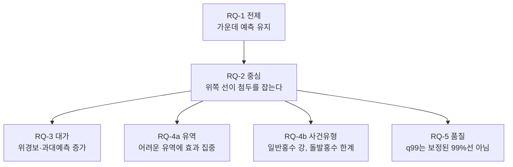

# 13. 결과 종합 읽기 (그래서 무엇을 말할 수 있나)

이 장은 앞의 다섯 장(08~12)을 한자리에 모아 "그래서 우리가 무엇을 말할 수 있나"를 정리하는 종합(synthesis)이다. 08장은 일곱 개 연구 질문을 펼친 지도였고, 09장은 핵심 결과의 본줄기, 10장은 큰 물 기준선에서의 성능과 첨두를 놓치는 원인, 11장은 유역·홍수 유형별 차이(RQ-4)와 예측선 품질·calibration(RQ-5)을 다뤘다. 12장은 실제 첨두가 예측 밴드(여러 예측선이 만든 사다리) 어디에 떨어지는가를 다뤘다.

여기서는 새 숫자를 만들지 않는다. 앞 장과 그 근거 분석 문서에 이미 나온 값만 엮어, 흩어진 결과를 하나의 결론으로 잇는다. 그래서 이 장은 "어느 코드가 어떤 파일에 무엇을 썼는가" 같은 구현 안내를 다시 늘어놓지 않는다. 그런 추적은 각 장에 이미 적혀 있다. 대신 결론끼리 어떻게 맞물리는지를 산문으로 풀어, 비전공 대학생이 처음부터 끝까지 따라오도록 천천히 쌓는다.

분석 전제는 모든 장에서 같다. 학습에 한 번도 쓰지 않은 DRBC(Delaware River Basin Commission, 델라웨어강 유역 관리 위원회) 지역 관측 유역 85개를, 무작위 출발점만 다르게 한 학습 세 번(seed `111 / 222 / 444`)으로, 학습(2000–2010)·검증(2011–2013)과 겹치지 않는 2014–2016 기간에서 평가했다. 이 조건이 무슨 뜻인지는 08~12장에서 자세히 다뤘으므로 여기서는 한 줄로만 다시 적는다.

---

## 1. 한눈 요약

이 연구가 던진 큰 질문은 하나였다.

> **LSTM(Long Short-Term Memory, 시간 흐름을 기억하는 인공신경망) 모델이 큰 홍수의 꼭대기 값을 너무 낮게 예측하는 문제, 즉 첨두 과소추정(peak underestimation)을 줄일 수 있는가?**

이 질문을 두 모델 비교로 풀었다. **Model 1**(Deterministic LSTM)은 한 시점에 유량 값 하나를 낸다. **Model 2**(Probabilistic quantile LSTM)는 같은 LSTM 구조에 출력 방식만 바꿔 한 시점에 네 예측선 `q50 / q90 / q95 / q99`를 동시에 낸다. 여기서 quantile(분위)은 "관측이 이 값 아래로 들어올 것으로 기대하는 비율"을 가리키는 눈금이며, `q50`은 가운데 예측선, `q90 / q95 / q99`는 위로 갈수록 더 보수적으로 높게 잡는 위쪽 예측선이다. Model 2의 결과는 정답 하나가 아니라 가운데에서 위쪽 끝까지 단계별로 펼쳐 둔 **예측 밴드(사다리)**로 읽어야 한다.

다섯 장의 결과를 한 문단으로 압축하면 이렇다.

> Model 2의 가운데 예측선(`q50`)은 Model 1의 단일 예측에 견줘 평상시 성능을 손해 없이 유지했고(오히려 약간 좋아졌고), 위쪽 예측선(`q90 → q95 → q99`)으로 올라갈수록 큰 홍수 첨두를 단계적·일관되게 더 잘 따라잡았다. 다만 그 이득은 공짜가 아니어서 위경보와 과대예측이 함께 늘었고, 늘어나는 정도가 이득보다 가팔랐다. 개선 효과는 모든 유역·모든 홍수에 고르게 퍼진 것이 아니라 **원래 예측이 어렵던 유역**과 **천천히 차오르는 일반홍수**에 집중됐다. 그리고 가장 중요한 단서로, `q99`는 이름값 그대로의 "잘 보정된 99% 신뢰구간"이 아니라 **첨두를 덜 놓치게 위로 열어 둔 상위 출력**이다.

이 압축 문장 하나하나가 어느 장에서 어떻게 확인됐는지를, 아래에서 차례로 풀어 간다.

---

## 2. 여섯 갈래 연구 질문을 결론 관점에서 엮기

08장은 연구 질문(Research Question, 줄여서 RQ)을 지도로 펼쳤다. 여기서는 그 지도를 따라가되, 각 질문을 "그래서 무엇이 확인됐나"의 결론으로 읽는다. 한 질문의 답이 다음 질문의 전제가 되도록 차례로 쌓는다.

아래 수식에서 $Q$는 유량(streamflow)을 뜻하고, 아래첨자 $\text{sim}$은 모델 예측, $\text{obs}$는 실제 관측을 가리킨다. 분위 예측은 $Q_{\text{sim},\tau}$로 적으며 $\tau$는 분위(예: 0.99)다. 산문에서는 "예측", "관측"으로 풀어 쓴다.

### 2-1. 가운데 예측이 유지됐다 (RQ-1, 전제)

먼저 막아 둬야 할 반박이 있다. "위쪽 선을 얻으려고 가운데 예측을 희생한 것 아니냐"는 것이다. Model 2가 홍수 꼭대기를 더 잡더라도, 그게 평상시 예측을 망가뜨린 대가라면 설득력이 약하다. 기본기가 무너진 모델의 위쪽 선은 믿기 어렵기 때문이다.

09장은 이 전제가 충족됨을 보였다. 85개 유역의 유역별 중앙값(basin median, 유역마다 먼저 seed 세 개를 중앙값으로 묶고 그 85개 값을 다시 중앙값으로 묶은 값) 기준으로 세 표준 평가지표를 비교했다.

| 평가지표 | 범위 | 최적화 방향 |
| --- | --- | --- |
| NSE | 1이 최선 (음수도 가능) | 클수록 좋음 ↑ |
| RMSE | 0 이상 (0이 최선) | 작을수록 좋음 ↓ |
| MAE | 0 이상 (0이 최선) | 작을수록 좋음 ↓ |

- **NSE**(Nash-Sutcliffe Efficiency, 적합도 점수): 예측이 관측을 얼마나 잘 따라가는지를 나타낸다. 1이면 완벽, 0이면 관측 평균을 찍은 것과 같고, 음수면 그보다도 못하다.
- **RMSE**(Root Mean Square Error, 평균 제곱근 오차): 예측과 관측 차이의 대표 크기. 큰 오차에 민감하다.
- **MAE**(Mean Absolute Error, 평균 절대 오차): 차이의 절댓값을 단순 평균한 값. 평소 얼마나 빗나가는지를 고르게 보여 준다.

Model 2의 `q50`은 Model 1보다 NSE가 +0.149 높았고, RMSE는 0.273, MAE는 0.197 줄었다. 가운데 예측이 나빠지기는커녕 전반적으로 약간 좋아졌다.

단, 한 방향에서는 `q50`이 Model 1보다 더 낮게 처졌다. 큰 물 구간의 편향(FHV, Flow High Volume bias, 상위 2% 극값 구간의 과소추정 정도)이 그렇다. 이것은 결함이 아니라 학습 방식의 차이에서 온다. Model 1은 평균을, `q50`은 중앙값을 좇는데, 강 유량은 평소 낮고 홍수 때만 치솟는 한쪽으로 치우친 분포라 평균이 중앙값보다 높다. 그래서 큰 물에서 `q50`이 Model 1보다 더 처진다. **바로 이 처짐을 위쪽 선이 메워 주는가가 다음 질문이다.**

### 2-2. 위쪽 선이 첨두를 따라잡는다 (RQ-2, 중심 주장)

연구의 핵심 주장이 여기서 시험됐다. 큰 물이 치솟은 사건에서 `q90 / q95 / q99`가 그 꼭대기를 얼마나 따라잡는지를 세 잣대로 쟀다. 아래는 세 잣대를 한눈에 보는 참조 카드이고, 각 지표의 정의는 표 아래에서 푼다.

| 지표 | 심볼 | 변수명 | 범위 | 최적화 방향 |
| --- | --- | --- | --- | --- |
| 첨두 부족분 | α | `peak_under_deficit` | 0~1 (0이 최선) | 작을수록 좋음 ↓ |
| 6시간 창 포착 | β | `window_capture` | 0 이상 (1=딱 맞음, >1=과대) | 1 근처/↑ |
| 큰 물 시각 재현율 | δ | `recall` | 0~1 | 클수록 좋음 ↑ |

#### α — 첨두 부족분

한 큰 물 사건에서 예측 꼭대기가 실제 꼭대기보다 얼마나 낮은지의 비율.

$$
\alpha = \frac{\max(0,\ Q_{\text{obs}}^{\text{peak}} - Q_{\text{sim}}^{\text{peak}})}{Q_{\text{obs}}^{\text{peak}}}
$$

분자에 $\max(0, \cdot)$이 붙어 있어 예측이 관측을 넘어선 경우는 0으로 처리한다(낮게 잡은 정도만 본다). α가 0이면 첨두를 정확히 잡았거나 넘어섰고, 클수록 많이 놓친 것이다. 달리기 선수의 실제 최고 속도가 초당 10m인데 예상을 7m/s로 했다면 α는 0.3, 즉 첨두를 30% 못 따라간 셈이다.

#### β — 첨두 부근 6시간 창 포착

첨두 앞뒤 6시간 안에서 예측선 최댓값이 관측 첨두 최댓값의 몇 배까지 올라갔는지.

$$
\beta = \frac{\max(Q_{\text{sim}}^{\text{win}})}{\max(Q_{\text{obs}}^{\text{win}})}
$$

첨두가 정확히 같은 시각에 찍히길 기대하면 너무 엄격하므로, 앞뒤 6시간 창을 열어 그 안에서 충분히 높이 올라갔는지를 본다. 1이면 딱 맞고, 1을 넘으면 관측 첨두를 덮어 버린 것이다.

#### δ — 큰 물 시각 재현율

관측이 큰 물 기준선(Q99, 학습 기간 관측 유량 상위 1% 높이)을 넘은 모든 시각 중 예측선도 그 높이를 따라잡은 시각의 비율.

$$
\delta = P(Q_{\text{sim},\tau} \geq Q_{\text{obs}} \mid Q_{\text{obs}} \geq Q99)
$$

사건 한 점만 보는 α·β와 달리 큰 물 시각 전체를 합쳐 계산한다. 클수록 더 많이 잡은 것이다. 이름이 재현율(recall)인 이유는, 놓치면 안 되는 큰 물 시각들을 예측이 얼마나 빠짐없이 건졌는지를 보기 때문이다.

09·10장이 보고한 결과를 모으면 방향이 한쪽으로 또렷하다.

| 예측선 | α (첨두 부족분, ↓ 좋음) | β (6시간 창, 1 근처 이상적) | δ (재현율, ↑ 좋음) |
| --- | ---: | ---: | ---: |
| `q50` | 0.657 | 0.444 | 0.069 |
| `q90` | 0.376 | 0.733 | 0.280 |
| `q95` | 0.272 | 0.920 | 0.379 |
| `q99` | **0.018** | **1.306** | **0.583** |

`q50`에서 `q99`로 올라갈수록 α는 줄고(약 36배 개선), β는 오르며, δ는 오른다(약 8.5배 개선). 중간에 방향이 뒤집히지 않고 **단조롭게(monotone)** 움직인다는 점이 핵심이다. 우연이 아니라 위쪽 선이 첨두를 일관되게 더 잡는다는 신호다. 이 단조 개선은 분위(τ)를 가로축에 두고 α가 위쪽 선으로 갈수록 떨어지는 그림에서 한눈에 보인다.

더 엄격한 점검으로, 미국 기상청(NOAA, National Oceanic and Atmospheric Administration)이 실제 홍수로 공식 확인한 사건(평가 기간과 겹치는 21개 유역, 65건)만 따로 봐도 방향이 유지됐다(`q99` α = 0.172, β = 0.977). 표본이 작아 절댓값보다는 방향 일치에 의미를 둔다.

다만 `q99`에서 β = 1.306이고 α ≈ 0이라는 것은 "예측이 관측 첨두를 넘어선다"는 뜻이기도 하다. 즉 `q99`는 첨두를 정밀하게 "예측하는" 선이라기보다, 첨두를 위에서 "덮는" 상단 보호선에 가깝다. 이 덮음이 다음 질문의 대가로 이어진다.

### 2-3. 그 대가가 함께 늘어난다 (RQ-3, 비용)

위쪽 선을 올리면 큰 홍수를 잘 잡는 대신, 실제로는 큰 물이 아닌데 경보를 울리는 위경보(false alarm)가 늘어난다. 두 가지로 쟀다.

| 지표 | 심볼 | 변수명 | 범위 | 최적화 방향 |
| --- | --- | --- | --- | --- |
| 위경보 비율 | FAR | `far` | 0~1 | 작을수록 좋음 ↓ |
| 과대예측 크기 | — | `over_pred_magnitude` | 0 이상 (관측 단위) | 작을수록 좋음 ↓ |

- **FAR**(False Alarm Ratio, 위경보 비율): 관측이 큰 물 기준선 아래였는데 예측선이 그 기준선을 넘은 시각의 비율, $P(Q_{\text{sim},\tau} > Q99 \mid Q_{\text{obs}} < Q99)$이다.
- **과대예측 크기**: 예측이 관측을 넘을 때 그 초과분의 평균. "얼마나 자주 넘는가"가 아니라 "넘을 때 평균 얼마나 크게 넘는가"를 본다.

09장 결과를 보면 예측선을 높일수록 두 비용이 함께 오른다(`q50` FAR 0.0007 → `q99` 0.0164, 과대예측 크기 1.47 → 3.44).

여기서 가장 정직하게 봐야 할 대목이 이득과 대가의 **비대칭**이다. `q50`에서 `q99`로 갈 때 재현율(이득)은 약 8배 늘지만 FAR(대가)은 약 23배 늘었다. 같은 방향으로 움직이되 대가 쪽이 훨씬 가파르다. 이 비대칭은 재현율과 FAR을 한 평면에 놓고 분위별로 점을 찍은 그림에서 분명하게 드러난다.

그래서 결론은 "`q99`를 쓰면 무조건 좋다"가 아니라 "이득과 비용을 함께 놓고, 어느 선을 경보 기준으로 쓸지는 상황에 맞게 골라야 한다"가 된다. 이 연구가 제공하는 것은 그 선택지의 구체적 숫자다.

`q99`의 FAR 절댓값(0.0164, 약 1.6%)이 작아 보이는 것은 분모가 "큰 물 기준선을 안 넘은 모든 시각"이라 매우 크기 때문이다. 평가 기간의 약 99%가 여기 들어간다. 절댓값이 작다고 문제가 없는 게 아니라 늘어나는 방향성을 재현율과 함께 봐야 한다.

### 2-4. 효과가 어디에 집중되는가 — 유역과 홍수 유형 (RQ-4a·4b)

위의 숫자는 85개 유역의 평균적 경향이다. 11장은 이 효과가 고르게 퍼졌는지 아니면 특정 조건에 쏠렸는지를 둘로 나눠 봤다.

**유역별로 보면(RQ-4a)** — 85개 유역을 Model 1의 NSE 성능 기준으로 상·중·하 세 단계(tier)로 나눴다. 나누는 기준(Model 1 NSE)과 평가 지표(첨두 부족분·재현율·위경보)를 일부러 다른 측면으로 잡아, 결론이 정의에서 저절로 나오는 순환논리(circular reasoning)를 피했다. 결과는 **원래 예측이 어렵던 하위 단계(bottom tier) 유역에서 효과가 가장 극적**이었다. `q99`에서 첨두 부족분이 0으로 떨어지고 큰 물 시각의 95%를 잡았다. 다만 그 대가로 위경보율이 0.06까지 올라 부담도 이 단계에서 가장 컸다. 원래 잘 맞히던 상위 단계(top tier) 유역에서는 `q99`로 바꿔도 첨두 부족분이 0.22 남아 이득의 폭이 작았다. 어려운 유역은 가운데 예측이 워낙 낮게 처져 위쪽 선이 메워 줄 여지가 컸던 반면, 잘 맞히던 유역은 이미 첨두 근방에 있어 추가 이득이 작았던 것으로 읽힌다.

**홍수 유형별로 보면(RQ-4b)** — NOAA가 분류한 홍수 유형으로 나눴다. 천천히 차오르는 **일반홍수(Flood)**에서는 `q99`의 첨두 부족분이 0.06으로 거의 사라졌지만, 몇 시간 만에 치솟는 **돌발홍수(Flash Flood)**에서는 0.42가 남았다. 위쪽 선을 써도 돌발홍수의 극단적 꼭대기는 절반 가까이 여전히 놓친다는 뜻이다. LSTM이 며칠에 걸쳐 차오르는 추세는 따라잡지만 몇 시간 만에 튀는 순간은 한 박자 늦게 반응하기 때문으로 보인다. 단, 돌발홍수 사건은 8건(6개 유역)으로 매우 적어, 이 결과는 "통계적으로 확정된 차이"가 아니라 "방향을 보여주는 사례"로 읽어야 한다.

두 분석이 함께 가리키는 결론은 같다. **이 방법은 모든 곳에서 똑같이 듣는 만능이 아니라, 기존 모델이 약했던 곳과 천천히 진행되는 사건에서 특히 도움이 된다.** 돌발홍수처럼 시간이 짧고 극단적인 사건은 한계로 남고, 이것이 후속 연구의 출발점이 된다.

### 2-5. q99는 보정된 99%선이 아니다 (RQ-5, 품질)

11장은 한 발 물러나 Model 2의 예측선 자체가 통계적으로 정직한 숫자인지를 점검했다. 핵심 질문은 단순하다. **`q99`라는 이름이 붙은 선이 실제로 99% 역할을 하는가?**

여기서 두 개념을 구분한다.

- **보정(calibration)**: 예측이 주장하는 비율과 실제 빈도가 맞는가. "비 올 확률 90%"라고 100번 예보해 90번 비가 오면 잘 보정된 것.
- **날카로움(sharpness)**: 예측이 불필요하게 넓지 않고 충분히 좁고 단정적인가. 둘은 맞교환 관계라 함께 봐야 한다.

평가 기간 전체 시각에서 관측이 각 예측선 아래로 들어온 비율(empirical coverage, 실제 포함율)을 직접 셌더니, `q99`는 이름값 0.99에 한참 못 미치는 0.787만 덮었다. 즉 100시간 중 약 21시간은 관측이 `q99` 위에 있다. 이런 들어옴 부족(undercoverage)이 있고, 단순 과거 평균 분포(climatology)와 비교한 기술 점수(skill score, 양수면 과거 평균보다 나음)도 `q99`에서는 음수(−0.271)였다. 가운데와 중간 선(`q50` +0.104, `q90` +0.217, `q95` +0.132)은 과거 평균보다 나았지만 가장 위쪽 선은 그렇지 못했다.

그럼에도 정작 중요한 큰 유량 구간에서는 `q99`가 절반 이상을 덮었다(꼬리 적중률 tail hit-rate 0.563). 즉 평범한 시각의 보정은 어긋나도 큰 물 순간에는 의미 있는 신호를 준다. **이 두 사실을 함께 말해야 정확하다.** "`q99`가 첨두를 잘 잡는다"는 주장과 "`q99`는 보정된 99%선이 아니다"라는 단서는 떼어 놓을 수 없다.

### 2-6. 관측 첨두는 예측 밴드 어디에 드는가 (관측 위치 구간 신호)

12장은 한 걸음 더 들어가, 실제 첨두가 네 예측선이 만든 밴드(사다리) 안 어디에 떨어지는지를 다섯 칸(`below_q50` ~ `above_q99`)으로 나눠 봤다. 위 칸일수록 모델이 첨두를 더 놓친 것이다.

핵심은 **그 위치를 관측값 없이 미리 알려주는 신호 지표**가 있느냐였다. 연관 강도는 Spearman 순위상관(두 값이 같은 순서로 움직이는 정도를 −1~+1로 나타낸 척도, 여기서는 신호 값과 위치 구간 번호 사이의 r)으로 쟀다. 가장 견고한 단서는 **유역 면적**(r = +0.43)으로, 극단 사건·NOAA 홍수·전체 강우 세 범위 모두에서 같은 방향을 유지했다. 큰 유역일수록 첨두가 밴드 위쪽으로 튀는 경향이 있다는 뜻이다. **대류성 폭우 성격**(대류성 강수비, CAPE)도 NOAA 홍수에서 뚜렷한 신호였다 — 소나기·뇌우처럼 모델이 학습한 일반 패턴과 다른 비에서 첨두를 놓치기 쉽다.

반대로 직관적으로 강해 보이던 신호들(밴드 폭, 강우 총량)은 극단 사건만 볼 때만 강해 보이다 전체 범위에서 0으로 무너졌다. 극단만 골라 본 데서 생긴 착시(선택 편향)였다. 이 분석의 교훈은 **첨두를 놓칠 위험을 미리 가늠하는 진짜 단서가 비의 총량이 아니라 유역의 정적 특성과 비의 성격**이라는 것이다.

---

## 3. 핵심 한 문장

이 연구 전체를 한 문장으로 줄이면 이렇다.

> **Model 2는 "가운데 예측을 더 잘하는 모델"이 아니라, 같은 LSTM에 위쪽 예측선(`q90 / q95 / q99`)을 함께 붙여 큰 홍수 첨두를 덜 놓치게 만들고, 그 대가(위경보·과대예측)와 한계(돌발홍수·보정 부족)까지 수치로 정직하게 드러내는 모델이다.**

---

## 4. 한계와 주의 — 넘지 말아야 할 선

결과를 강하게 말하고 싶을 때일수록 아래 선을 지켜야 한다. 옳은 해석과 피해야 할 과장을 나란히 둔다.

| 옳은 해석 | 피해야 할 과장 |
| --- | --- |
| `q99`는 첨두 과소추정을 줄이는 **위쪽 상단 보호선**이다 | "`q99`는 99% 확률 예측구간이다" |
| 위쪽 선으로 갈수록 재현율이 단계적으로 오른다 | "`q99`를 쓰면 모든 홍수를 잡는다" (δ = 0.583, 42%는 여전히 놓침) |
| 재현율 이득과 위경보 비용이 비대칭으로 함께 는다 | "FAR이 작으니 위경보 문제는 없다" (분모가 커서 작아 보일 뿐) |
| `q50`이 NSE·RMSE 기준 전반적으로 개선됐다 | "`q50`이 Model 1보다 항상 더 좋다" (큰 물 구간 편향은 `q50`이 더 나쁨) |
| 어려운 유역·일반홍수에서 효과가 컸다 | "모든 유역·모든 홍수에서 똑같이 효과적이다" (돌발홍수 한계, 사건 수 적음) |

특히 가장 자주 오해하는 지점을 한 번 더 강조한다.

> **`q99`는 "잘 보정된 99% 신뢰구간"이 아니다.** 11장 RQ-5가 직접 셌듯, 평가 기간 전체에서 관측의 78.7%만 `q99` 아래에 들어왔다(이름값은 99%). 즉 100시간 중 약 21시간은 관측이 `q99`를 넘는다. 이런 들어옴 부족(undercoverage)이 있고, 단순 과거 평균 분포와 비교한 기술 점수도 `q99`에서는 음수다. 그럼에도 정작 중요한 큰 유량 구간에서는 절반 이상(꼬리 적중률 0.563)을 덮는다. 따라서 `q99`는 **"확률 99%로 이 아래"라는 확률 주장**이 아니라, **"큰 홍수 첨두를 덜 놓치게 위로 열어 둔 상위 출력"**으로 불러야 정확하다. "`q99` 아래면 안전하다"는 식으로 쓰면 안 된다.

그 밖에 함께 기억할 한계:

- **돌발홍수는 여전히 어렵다.** 위쪽 선을 써도 첨두 부족분이 0.42 남는다.
- **사건 수가 적은 분석이 있다.** 홍수 유형별 비교(특히 돌발홍수 8건)는 강한 일반화가 아니라 사례 비교로 읽는다.
- **인과는 단정하지 않는다.** 10·12장의 원인·신호 분석은 상관(어떤 조건에서 오차가 큰지)을 보여줄 뿐 확정된 인과가 아니다. 모델이 CAPE를 잘 활용하지 못한다거나 장기 선행 조건을 덜 본다는 지적도 방향성일 뿐 원인을 못 박지 않는다.

---

## 5. 다음으로 읽을 것

이 장으로 핵심 비교(Model 1 vs Model 2)의 결론은 마무리된다. 더 깊이 보려면 아래로 이어진다.

- **앞 장 다시 보기**: 결론의 근거가 된 분석은 [08장 분석 지도](08_rq_analysis_map.md), [09장 핵심 결과](09_core_results.md), [10장 q99 분석](10_q99_analysis.md), [11장 이질성·품질](11_heterogeneity_quality.md), [12장 관측 위치 구간 신호](12_band_signal.md)에 각각 정리돼 있다.
- **보조 test**: 이 연구의 본 비교는 "큰 유량이 났을 때 모델이 잘 따라가는가"를 본다. 반대 방향에서, "극한 강수 proxy가 왔을 때 모델이 필요한 만큼 유량을 올리는가"를 보는 보조 stress test가 있다. 자세한 설명은 [14장 극한호우 stress test](14_extreme_rain_stress_test.md)에 있다. 이 보조 test는 논문의 공식 결론 범위 밖이며, 진단 목적의 보강 분석이다.
