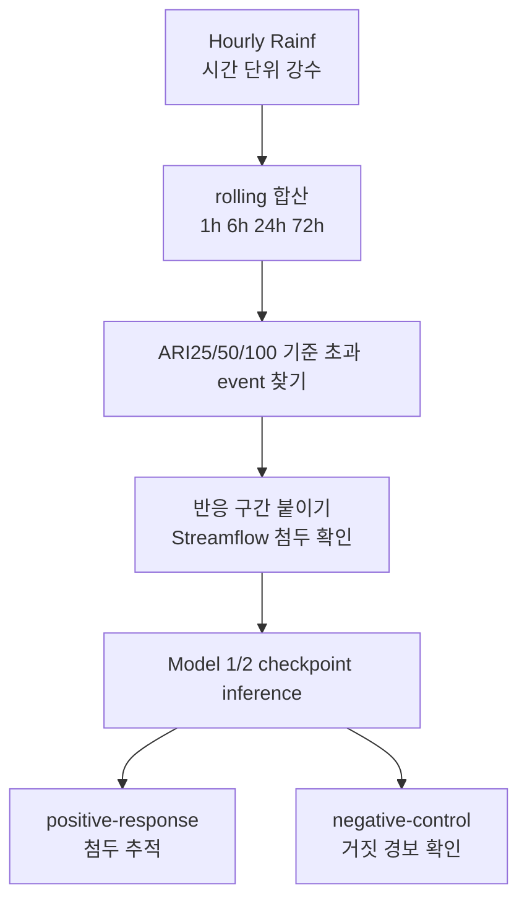

# 14. 극한호우 stress test를 어떻게 읽을까

이 문서는 `subset300` Model 1 / Model 2 결과에 새로 붙인 극한호우 stress test를 학부생 기준으로 설명한다. 앞 장의 hydrograph 분석이 "큰 유량 시간대에서 모델이 얼마나 낮게 예측하는가"를 본다면, 이 장의 stress test는 "큰 비가 왔을 때 모델이 유량을 충분히 올리는가"를 본다.

여기서 미리 못 박아 둘 점이 하나 있다. 이 stress test는 공식 결론을 내는 primary DRBC test(2014-2016년, 관측 기준 85개 basin)를 **대체하지 않는다**. 그 자리를 메우는 보조 진단이다. 왜 보조 진단으로만 읽어야 하는지는 마지막 절에서 다시 정리한다.

## 왜 이 test가 필요할까

기존 event 분석은 관측 유량이 큰 시점에서 출발했다. 예를 들어 streamflow(하천 유량)가 Q99(상위 1% 유량 기준선)보다 높았던 event를 모으면, 이미 유량이 크게 오른 사례를 분석하기 쉽다. 다시 말해 "유량이 컸던 순간"을 먼저 고르고, 그 순간 모델이 얼마나 잘 맞췄는지를 보는 방식이다.

하지만 사용자가 처음 제기한 질문은 출발점이 반대였다.

```text
미국에 정말 100년급 비나 홍수가 없었나?
모델이 그런 극한호우 forcing(입력 기상 자료)을 배운 적이 있나?
그런 비가 왔을 때 모델도 유량 첨두를 올릴 수 있나?
```

이 질문에 답하려면 유량 event table만 봐서는 부족하다. 유량 event table은 "비"가 아니라 "유량"에서 시작하기 때문이다. 그래서 비 자체를 출발점으로 삼는 보조 test가 필요하다. 구체적으로는 hourly(시간 단위) `.nc` 자료 안의 강수 변수명 `Rainf`에서 직접 강수 event를 뽑고, 그 뒤에 따라오는 streamflow 반응을 붙이는 구조로 짠다.

이 test 전체는 공식 실행 스크립트 `scripts/runs/official/run_expanded_drbc_extreme_rain_stress_test.sh` 하나로 돈다. 이 스크립트는 세 단계를 차례로 실행한다. 첫째로 강수 event 목록을 만드는 catalog 단계(스크립트 내부 변수 `RUN_CATALOG`), 둘째로 기존 checkpoint(학습 도중 저장된 모델 상태 파일)를 그대로 불러와 다시 예측을 돌리는 inference 단계(변수 `RUN_INFERENCE`), 셋째로 그 결과를 모아 표로 정리하는 analysis 단계(변수 `RUN_ANALYSIS`)다. 스크립트 첫머리 주석에도 "Reuses existing subset300 checkpoints — no retraining"이라고 적혀 있는데, 새로 학습하지 않고 이미 있는 모델을 그대로 다시 돌린다는 뜻이다.

## 두 질문을 분리한다

극한호우 stress test는 두 질문을 분리한다.

첫 번째 질문은 노출 여부(exposure)다. train(학습)과 validation(검증) 기간에 ARI25, ARI50, ARI100급 강수 forcing이 실제로 있었는지 확인한다. 이것은 "모델이 학습 도중 그렇게 큰 비라는 입력을 볼 기회 자체가 있었는가"를 묻는 질문이다. 본 적도 없는 입력을 못 맞췄다고 탓할 수는 없으므로, 이 확인이 먼저다.

두 번째 질문은 stress 반응(response)이다. DRBC holdout(학습에서 제외한 평가용) basin의 과거 전체 기간에서 극한호우 event를 모은 뒤, 기존 checkpoint로 다시 inference해서 모델이 실제 streamflow 첨두를 따라가는지 본다.



## ARI100은 무슨 뜻일까

ARI는 Average Recurrence Interval(평균 재현 간격)의 약자다. ARI100은 보통 평균적으로 100년에 한 번 넘을 정도의 크기를 뜻한다. ARI25, ARI50은 각각 25년, 50년에 한 번 수준이다. 숫자가 클수록 더 드물고 더 큰 사건이다.

여기서 매우 중요한 주의점이 하나 있다. 이 프로젝트의 강수 기준값(변수명 `prec_ari100_24h` 등)이나 유량 기준값(변수명 `flood_ari100` 등)은 공식 NOAA(미국 기상청)나 USGS(미국 지질조사국)가 발표한 값이 **아니다**. CAMELSH hourly 자료의 연 최대값(annual maxima) 기록에서 우리가 직접 추정한 proxy(근사 기준값)다. 실제로 catalog 단계는 이 값들을 외부 reference CSV(스크립트 변수 `RETURN_PERIOD_CSV`, 기본 경로 `output/basin/all/analysis/return_period/tables/return_period_reference_table_with_drbc_expanded85.csv`)에서 읽어 와 그대로 기준선으로 쓴다.

그래서 논문에서는 "100년 홍수 확정"처럼 쓰면 안 된다. 더 정확한 표현은 "CAMELSH hourly annual-maxima proxy 기준 100-year-scale 강수" 또는 "100년급에 가까운 강수 proxy"다.

## 왜 1h, 6h, 24h, 72h를 같이 볼까

홍수를 만드는 비는 한 가지 모양만 있는 것이 아니다. 한두 시간에 매우 강하게 쏟아지는 비도 있고, 하루나 며칠 동안 계속 내려 유역(물이 모이는 영역)을 포화시키는 비도 있다. 둘 다 홍수를 만들 수 있지만 모양이 다르다.

그래서 비의 세기는 한 시점의 강수량 하나로 재지 않고, `Rainf`를 여러 길이로 더한 rolling sum(이동 누적 합)으로 잰다. catalog 단계의 함수 `rolling_ratio_frame`이 1시간, 6시간, 24시간, 72시간 누적을 각각 계산해서, 같은 길이의 ARI 기준값으로 나눈 ratio(기준 대비 비율)를 만든다.

다음 표는 네 길이가 각각 무엇을 잡는지 짚는 참조용이다.

| 누적 길이 | 무엇을 잡는가 |
| --- | --- |
| `1h` | 짧고 강한 폭우 |
| `6h` | 반나절 안에 몰린 강수 |
| `24h` | 하루 단위 큰 비 |
| `72h` | 며칠 동안 이어진 누적 강수 |

각 시점에서 이 네 길이의 ARI ratio를 모두 계산하고, 그중 가장 큰 ratio를 그 시점의 비 세기로 기록한다(변수명 `max_prec_ari100_ratio` 등). 어떤 모양의 비든 가장 극단으로 드러나는 길이로 잡겠다는 뜻이다.

## event를 어떻게 고르나

먼저 어느 시점들을 "비가 큰 시점"으로 켤지(active) 정한다. catalog 단계는 25년급 기준을 넘었거나(`max_prec_ari25_ratio >= 1.0`), 100년급의 80% 이상까지 올라온(`max_prec_ari100_ratio >= near_ari100_ratio`, 기본값 0.80) 시점을 active로 본다. 비는 한 시점에 끝나지 않고 여러 시간 이어지므로, active 시점 사이의 빈틈(gap)이 72시간(변수명 `event_gap_hours`) 이하면 같은 storm(폭우 사건)으로 묶는다.

이렇게 묶인 storm마다 가장 큰 ARI ratio로 cohort(집단 분류)를 붙인다(함수 `rain_cohort`). 분류는 다음과 같다.

| cohort | 뜻 |
| --- | --- |
| `prec_ge100` | ARI100 이상 |
| `prec_ge50` | ARI50 이상 (ARI100 미만) |
| `prec_ge25` | ARI25 이상 (ARI50 미만) |
| `near_prec100` | ARI100의 80% 이상이지만 100% 미만 |

primary(핵심) 관심 집단은 `prec_ge100`, 즉 어떤 누적 길이로든 100년급 강수 proxy 이상까지 올라간 비다. 나머지 셋은 기준을 조금씩 풀어 본 sensitivity(민감도) 집단으로, 기준선을 어디에 두느냐에 따라 결론이 흔들리지 않는지 확인하는 용도다.

비 다음에 유량이 어떻게 움직였는지는 반응 구간(response window)을 붙여서 본다. catalog 단계의 기본 설정(`wet_footprint` 모드)에서는 비가 실제로 내린 시작 시점부터, 비 종료 168시간(변수명 `response_post_hours`, 즉 7일) 뒤까지를 본다. 그 안에서 관측 유량의 최고값을 그 event의 관측 첨두로 기록한다.

자료 품질도 거른다. catalog 단계는 강수 결측이 너무 많은 basin(강수 coverage가 `rain_coverage_min`=0.95 미만)이나, 반응 구간 안 유량 결측이 너무 많은 event(유량 coverage가 `streamflow_coverage_min`=0.90 미만)는 제외한다. 빠진 자료가 많으면 첨두를 잘못 읽기 때문이다.

## positive response와 negative control

극한호우가 왔다고 항상 큰 홍수가 나는 것은 아니다. 비가 오기 전에 이미 유역이 바싹 말라 있었거나, 비가 유역 전체에 고르게 오지 않았거나, 땅속 저장과 지하수 조건 때문에 streamflow가 크게 오르지 않을 수 있다. 그래서 "비는 컸지만 유량은 안 오른" 사례를 따로 떼어 둬야 한다.

catalog 단계의 함수 `response_class`는 관측 첨두를 유량 기준값과 비교해 네 부류로 나눈다.

| class | 쉬운 의미 | 해석 |
| --- | --- | --- |
| `flood_response_ge25` | 강수 뒤 유량도 25년 홍수 proxy 이상으로 올랐다 | positive-response (실제로 큰 홍수가 난 사례) |
| `flood_response_ge2_to_lt25` | 유량이 2년 이상 25년 미만 proxy까지 올랐다 | positive-response (중간 규모로 오른 사례) |
| `high_flow_non_flood_q99_only` | Q99 이상 high-flow지만 2년 홍수 proxy 미만이다 | negative control |
| `low_response_below_q99` | 유량이 Q99에도 못 미쳤다 | negative control |

여기서 핵심은 negative control을 모델의 실패로 보면 안 된다는 점이다. 비는 컸지만 관측 유량이 안 올랐다면, 모델도 큰 홍수를 예측하지 않는 편이 옳다. 오히려 이런 사례에서 Model 2의 `q99`가 자꾸 홍수 기준선을 넘어 버리면, 그것이 false positive(거짓 경보) 위험을 뜻한다. 그래서 negative control은 "안 오를 때 모델이 차분히 있는가"를 검증하는 대조군이다.

## 어떤 checkpoint를 돌리나

기본 결과는 validation 기준으로 고른 primary checkpoint를 쓴다. 실행 스크립트의 변수 `EPOCH_MODE`가 기본값 `primary`일 때, inference 단계(스크립트 `infer_subset300_extreme_rain_windows.py`)는 내부에 적힌 epoch 매핑(코드 안 `PRIMARY_EPOCHS`)을 그대로 따른다. 그 매핑은 아래 표와 정확히 같다.

| model | seed111 | seed222 | seed444 |
| --- | ---: | ---: | ---: |
| Model 1 | epoch25 | epoch10 | epoch15 |
| Model 2 | epoch5 | epoch10 | epoch10 |

이 결과는 논문 본문에서 우선 읽는 기준이다. 하지만 primary checkpoint 하나만 보면 "그 epoch라서 우연히 좋아 보인 것 아닌가"라는 의심이 남는다.

그래서 같은 event 집단에 대해 validation checkpoint를 여러 개 돌려 보는 grid 모드도 둔다. `EPOCH_MODE=validation`으로 실행하면 inference 단계가 epoch 격자(코드 안 `DEFAULT_VALIDATION_EPOCHS`)를 따라 돈다.

```text
epoch005, epoch010, epoch015, epoch020, epoch025, epoch030
```

이 all-validation-epoch run은 Model 1 epoch N과 Model 2 epoch N을 같은 번호로 짝지은 same-epoch pair다(코드에서 두 모델에 같은 epoch 번호를 넣는다). 목적은 primary epoch를 다시 고르는 것이 **아니다**. upper-tail(위쪽 큰 유량 쪽) 효과와 false-positive tradeoff가 checkpoint 선택에 얼마나 민감한지만 확인하는 보조 진단이다.

## 출력 위치

Wet-footprint primary checkpoint 결과는 아래에 둔다.

```text
output/model_analysis/legacy/extreme_rain/primary/
```

대표 event에서 실제 flow graph(유량 그래프)가 어떻게 생겼는지는 아래 diagnostic에서 본다. 같은 event 하나를 seed `111 / 222 / 444` 패널로 나누고, 관측 유량, Model 1, Model 2의 `q50/q95/q99`를 함께 그려 둔 것이다.

```text
output/model_analysis/legacy/extreme_rain/primary/flow_graph_diagnostic/
```

모든 validation checkpoint sensitivity 결과는 아래에 둔다.

```text
output/model_analysis/legacy/extreme_rain/all/
```

둘을 섞어 읽으면 안 된다. primary 결과는 대표 결과이고, all-validation 결과는 checkpoint sensitivity 진단이다.

## 표를 읽는 데 필요한 지표들

analysis 단계(스크립트 `analyze_subset300_extreme_rain_stress_test.py`)가 만드는 표에는 여러 지표가 나온다. 아래는 그 지표들을 한눈에 보는 참조 카드다. 각 지표가 무엇을 재는지는 카드 뒤에서 풀어 설명한다.

| 심볼 | 변수명 | 범위 | 최적화 방향 |
| --- | --- | --- | --- |
| 과소예측 비율 | `underestimation_fraction_at_observed_peak` | 0~1 | 작을수록 좋음 |
| 첨두 과소 결손율 | `median_obs_peak_under_deficit_pct` | 0% 이상 | 작을수록 좋음 |
| 기준선 초과 recall | `mean_threshold_exceedance_recall` | 0~1 | 클수록 좋음 |
| 첨두 분위 위치 | `Local Peak Quantile Bracket` | q50 이하 ~ q99 초과 | (해석용, 방향 없음) |

### 과소예측 비율 — `underestimation_fraction_at_observed_peak`

관측 첨두가 일어난 시점에서, 모델 예측선이 관측값보다 낮게 깔린 event가 전체 중 몇 분의 몇이었는지를 0~1로 나타낸다. 1에 가까울수록 거의 매번 첨두를 놓친다는 뜻이고, 0에 가까울수록 첨두를 잘 덮는다는 뜻이다. 작을수록 좋다.

### 첨두 과소 결손율 — `median_obs_peak_under_deficit_pct`

첨두를 놓쳤을 때, 얼마나 많이 모자랐는지를 퍼센트로 본다. 예측이 관측 첨두보다 낮으면 그 모자란 양을 관측 첨두 대비 비율로 재고, 그 값들의 중앙값(median)을 쓴다. 예측이 첨두를 이미 덮은 사례가 많으면 0%에 가까워진다. 작을수록 좋다.

### 기준선 초과 recall — `mean_threshold_exceedance_recall`

실제로 홍수 기준선을 넘은 event들 중에서, 모델 예측선도 그 기준선을 같이 넘은 비율이다. 일종의 "잡아내야 할 큰 사건을 실제로 잡아낸 비율"이다. 1에 가까울수록 놓치는 큰 사건이 적다. 클수록 좋다. 단, negative control에서 이 값이 높다면 그것은 거짓 경보 쪽 신호라 따로 해석해야 한다.

### 첨두 분위 위치 — `Local Peak Quantile Bracket`

관측 첨두 시점 앞뒤 6시간 안에서 Model 2의 각 quantile 최고값을 보고, 관측 첨두가 `q50 이하`, `q50~q90`, `q90~q95`, `q95~q99`, `q99 초과` 중 어디에 드는지 분류한다(analysis 단계의 bracket 정의, primary 창 폭 6시간). 관측 첨두가 위쪽 칸에 많이 들수록 모델 밴드가 첨두를 잘 감쌌다는 뜻이다. 다만 이 값은 보정된(calibrated) 확률 coverage가 아니다. 애초에 극한호우 event만 골라 모은 표본이라, "q99 초과가 65%니까 99% 예측이 잘 맞았다" 같은 식으로 읽으면 안 된다. 어디까지나 위치 진단이다.

## 현재 primary 결과를 쉬운 말로 읽기

primary run 기준으로 train/validation 노출은 실제로 있었다. train split에는 ARI100급 rain event가 156개, validation split에는 8개가 잡혔다. 즉 모델이 학습과 checkpoint 선택 과정에서 극한호우 forcing을 전혀 못 본 것은 아니다.

반면 공식 DRBC test 기간인 2014-2016년에는 ARI100 event가 없었고, ARI25급 event만 2개였다. 그래서 primary DRBC test만으로는 "100년급 비가 왔을 때 모델이 잘 반응하는가"를 충분히 말하기 어렵다. 이것이 별도 stress test를 둔 직접적인 이유다.

DRBC 과거 stress 기간에서는 반응 지표까지 계산 가능한 stress event가 236개였고, 이 중 positive-response가 156개, negative-control이 80개였다. 이 event 집합으로 Model 1과 Model 2를 다시 비교했다.

큰 방향은 hydrograph 분석과 비슷하다. Model 2의 `q50`은 중앙 예측이라 Model 1보다 항상 낫지는 않다. 하지만 `q90/q95/q99`는 positive-response event에서 첨두 과소예측을 줄이고 기준선 초과 recall을 올리는 경향을 보인다. 특히 `q99`는 첨두를 더 자주 덮지만, 그만큼 negative-control에서도 홍수 기준선을 넘을 가능성이 커진다. 그래서 `q99`의 이득은 항상 false-positive tradeoff와 함께 읽어야 한다.

대표 flow graph에서도 같은 패턴이 보인다. positive-response 사례에서는 `q50`이 첨두를 낮게 잡는 동안 `q95/q99`가 관측 첨두 쪽으로 올라가고, low-response negative-control 사례에서는 관측 유량이 낮은데도 `q99`가 홍수 proxy를 넘어 버리는 장면이 나온다. 그래서 이 그림은 "Model 2가 평균적으로 더 좋다"가 아니라 "위쪽 quantile은 놓치던 큰 첨두를 줄이지만, 경보처럼 쓰면 과대반응도 같이 생긴다"는 메시지를 보여주는 용도다.

all-validation-epoch sensitivity도 공식 관측 DRBC 85개 기준과 분리해서 보조 진단으로만 해석해야 한다. 이 결과는 primary checkpoint를 바꾸기 위한 근거가 아니라, upper-tail 효과와 false-positive tradeoff가 epoch `005 / 010 / 015 / 020 / 025 / 030` 전반에서 얼마나 유지되는지 보는 보조 확인이다.

## 결론을 어떻게 써야 할까

학부생 기준으로 가장 중요한 결론은 이렇다.

```text
Model 2는 중앙예측(q50)을 더 좋게 만든 모델이라기보다,
큰 홍수를 놓치지 않도록 위쪽 위험선(q90/q95/q99)을 제공하는 모델이다.
```

따라서 논문에서 "q99가 정확한 99% 예측구간이다"라고 쓰면 안 된다. 지금의 `q99`는 보정된 확률(calibrated probability)이라기보다, 극단 첨두 과소예측을 줄여 주는 위쪽 판단선(upper-tail decision output)에 가깝다.

또한 이 과거 stress test는 primary DRBC test를 대체하지 않는다. DRBC basin은 학습에서 빠져 있으므로 basin holdout 조건은 유지된다. 그러나 과거 전체 기간(1980-2024)을 보다 보면 train(2000-2010)이나 validation(2011-2013) 연도와 겹치는 event가 섞여 들어올 수 있다. 실제로 catalog 단계는 각 event가 어느 공식 기간과 겹치는지 표시까지 남긴다(변수명 `temporal_relation`). 그래서 이 결과는 시간 독립성(temporal independence)이 강한 최종 test가 아니라, 극한호우 상황에서 모델 반응을 보는 보조 진단으로 읽어야 한다. 최종 결론은 여전히 2014-2016년 관측 DRBC 85개 basin 기준 primary test가 맡는다.
