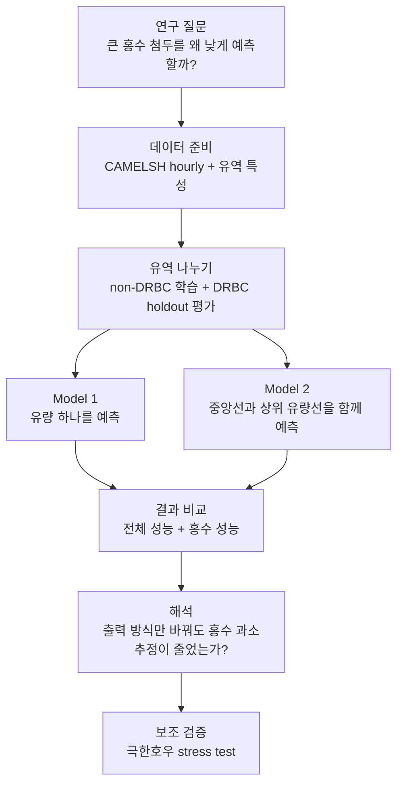

# 대학생을 위한 CAMELS 연구 설명서

이 디렉토리는 CAMELS 프로젝트를 처음 읽는 대학생이 연구의 큰 그림을 이해할 수 있도록 만든 설명서다. `docs/experiment/`, `docs/references/`, `docs/paper/` 문서는 연구자와 구현자를 위한 문서이고, 이 폴더는 그 내용을 더 쉬운 말로 다시 정리한 입문용 문서다.

이 문서 묶음의 핵심은 하나다. 우리는 여러 강 유역의 기상 자료와 유역 특성을 이용해 시간별 하천 유량을 예측하고, 특히 큰 홍수의 꼭대기 값이 너무 낮게 예측되는 문제를 줄이려 한다.

## 읽는 순서

처음 읽는다면 아래 순서를 권장한다.

1. [`01_research_topic_and_hypotheses.md`](01_research_topic_and_hypotheses.md): 연구 주제와 가설을 먼저 잡는다.
2. [`02_model_structure.md`](02_model_structure.md): Model 1과 Model 2가 어떻게 다른지 본다.
3. [`03_data_io.md`](03_data_io.md): 어떤 자료가 들어가고 어떤 결과가 나오는지 확인한다.
4. [`04_variable_terms.md`](04_variable_terms.md): 자주 나오는 변수와 지표의 뜻을 찾아본다.
5. [`05_basin_analysis_method.md`](05_basin_analysis_method.md): DRBC 유역을 어떻게 고르고, 전 유역 observed-flow 분석을 어떻게 붙이는지 이해한다.
6. [`06_research_process.md`](06_research_process.md): 연구와 서버 분석이 어떤 순서로 진행되는지 본다.
7. [`07_analysis_process.md`](07_analysis_process.md): 모델 결과를 어떤 순서로 해석하는지 확인한다.
8. [`08_ml_flood_generation_typing.md`](08_ml_flood_generation_typing.md): flood generation type을 ML로 다룰 때 왜 clustering 중심으로 접근하는지 이해한다.
9. [`09_subset300_hydrograph_results.md`](09_subset300_hydrograph_results.md): 실제 subset300 결과에서 q50, q95, q99가 어떤 의미를 갖고, 이번 결과가 연구 가설을 어떻게 지지하는지 읽는다.
10. [`10_extreme_rain_stress_test.md`](10_extreme_rain_stress_test.md): 100년급 강수 같은 극한호우 event를 따로 모아, 모델이 그런 상황에서 첨두를 따라가는지 보는 보조 test를 이해한다.

## 이 문서의 위치

이 폴더는 공식 실험 규칙을 바꾸는 문서가 아니다. 공식 기준은 여전히 아래 문서들이다.

- `docs/experiment/method/model/design.md`
- `docs/experiment/method/model/architecture.md`
- `docs/experiment/method/model/experiment_protocol.md`
- `docs/experiment/method/model/result_analysis_protocol.md`
- `docs/experiment/method/basin/basin_cohort_definition.md`
- `docs/experiment/method/basin/basin_screening_method.md`
- `docs/experiment/method/basin/event_response_spec.md`

결과 해석 상태와 산출물 위치는 `docs/experiment/analysis/model/README.md`와 그 하위 분석 문서를 먼저 확인한다.

이 폴더는 설명용 문서이지만 저장소에 함께 보관한다. 연구 기준을 바꿔야 할 때는 이 폴더만 고치지 말고, 위 canonical 문서를 먼저 확인해야 한다.
