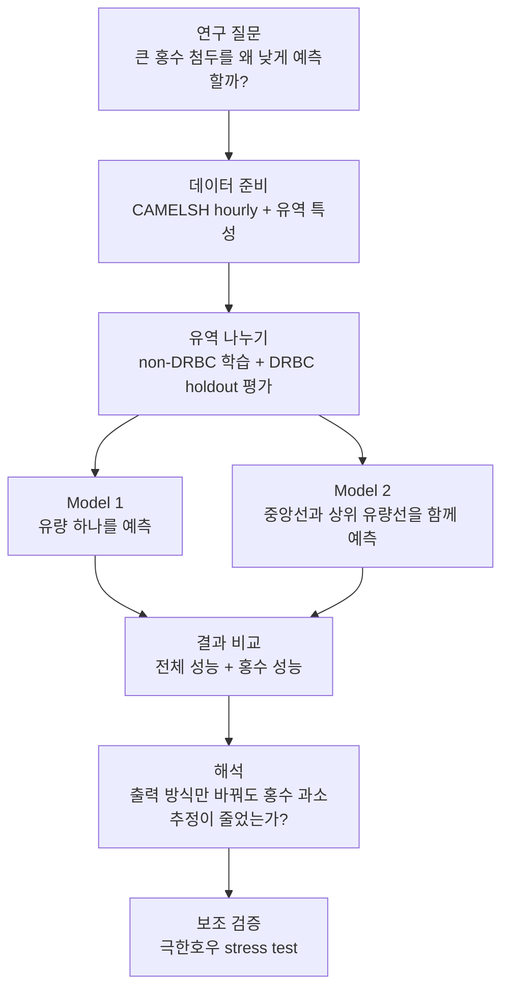

# 대학생을 위한 CAMELS 연구 설명서

이 디렉토리는 CAMELS 프로젝트를 처음 읽는 대학생이 연구의 큰 그림을 이해할 수 있도록 만든 설명서다. `docs/experiment/`, `docs/references/`, `draft/` 문서는 연구자와 구현자를 위한 문서이고, 이 폴더는 그 내용을 더 쉬운 말로 다시 정리한 입문용 문서다.

이 문서 묶음의 핵심은 하나다. 우리는 여러 강 유역의 기상 자료와 유역 특성을 이용해 시간별 하천 유량을 예측하고, 특히 큰 홍수의 꼭대기 값이 너무 낮게 예측되는 문제를 줄이려 한다.

```mermaid
flowchart TD
    A["연구 질문<br/>큰 홍수 첨두를 왜 낮게 예측할까?"] --> B["데이터 준비<br/>CAMELSH hourly + 유역 특성"]
    B --> C["유역 나누기<br/>non-DRBC 학습 + DRBC holdout 평가"]
    C --> D["Model 1<br/>유량 하나를 예측"]
    C --> E["Model 2<br/>중앙선과 상위 유량선을 함께 예측"]
    D --> F["결과 비교<br/>전체 성능 + 홍수 성능"]
    E --> F
    F --> G["해석<br/>출력 방식만 바꿔도 홍수 과소추정이 줄었는가?"]
    G --> H["보조 검증<br/>극한호우 stress test"]
```

## 읽는 순서

처음 읽는다면 아래 순서를 권장한다. 앞부분(01~07)은 연구의 배경·데이터·방법을 잡는 **기초**이고, 뒷부분(08~14)은 실제 결과를 읽는 **분석**이다.

**기초**

1. [`01_research_topic_and_hypotheses.md`](01_research_topic_and_hypotheses.md): 연구 주제와 가설, 그리고 이 연구가 내놓는 두 가지 결과물(방법·실증)을 먼저 잡는다.
2. [`02_model_structure.md`](02_model_structure.md): Model 1과 Model 2가 어떻게 다른지 본다.
3. [`03_data_io.md`](03_data_io.md): 어떤 자료가 들어가고 어떤 결과가 나오는지 확인한다.
4. [`04_variable_terms.md`](04_variable_terms.md): 자주 나오는 변수와 지표(α/β/δ, FAR, calibration, 관측 위치 구간 등)의 뜻을 찾아본다.
5. [`05_basin_analysis_method.md`](05_basin_analysis_method.md): 평가 유역을 어떻게 고르고 85개로 늘렸는지, 학습에는 왜 일부 유역만 썼는지 이해한다.
6. [`06_research_process.md`](06_research_process.md): 연구와 서버 분석이 어떤 순서로 진행되는지 본다.
7. [`07_ml_flood_generation_typing.md`](07_ml_flood_generation_typing.md): flood generation type을 ML로 다룰 때 왜 clustering 중심으로 접근하는지 이해한다.

**분석**

8. [`08_rq_analysis_map.md`](08_rq_analysis_map.md): 분석을 7개 연구 질문(RQ-0~5)으로 어떻게 나누는지 지도처럼 본다.
9. [`09_core_results.md`](09_core_results.md): 핵심 결과 — q50 중앙성능 유지 → 상위 quantile이 첨두 과소추정을 줄이는가(α·β·δ) → 그 대가(FAR).
10. [`10_q99_analysis.md`](10_q99_analysis.md): 큰 물 기준선(Q99)에서의 성능과, 첨두가 낮게 나오는 원인을 깊게 본다.
11. [`11_heterogeneity_quality.md`](11_heterogeneity_quality.md): 유역별·홍수 유형별 차이와 예측 분포의 calibration·sharpness를 본다.
12. [`12_band_signal.md`](12_band_signal.md): 관측 첨두가 예측 밴드(q50~q99) 어디에 드는지(관측 위치 구간)와 그 위치를 알려주는 신호를 본다.
13. [`13_results_reading.md`](13_results_reading.md): 위 결과들을 한데 모아 "그래서 무엇을 말할 수 있나"로 종합한다.
14. [`14_extreme_rain_stress_test.md`](14_extreme_rain_stress_test.md): 100년급 강수 같은 극한호우 event를 따로 모아, 모델이 그런 상황에서 첨두를 따라가는지 보는 보조 test를 이해한다.

## 보조 HTML 설명자료

`html/` 하위에 특정 분석을 그림과 함께 풀어 쓴 인터랙티브 설명 페이지를 둔다 (로컬 보조 자료).

- [`html/analysis_review_for_students.html`](html/analysis_review_for_students.html): 전체 분석 흐름 리뷰
- [`html/ub_analysis_review_for_students.html`](html/ub_analysis_review_for_students.html): 관측 위치 구간(상위 밴드) 분석 리뷰
- [`html/probabilistic_diagnostics_review_for_students.html`](html/probabilistic_diagnostics_review_for_students.html): 확률 예측 진단 리뷰
- [`html/rising_hours_distribution.html`](html/rising_hours_distribution.html): 상승부 지속시간 분포 설명
- [`html/spearman_explained_for_students.html`](html/spearman_explained_for_students.html): Spearman 상관 설명

## 이 문서의 위치

이 폴더는 공식 실험 규칙을 바꾸는 문서가 아니다. 공식 기준은 여전히 아래 문서들이다.

- `docs/experiment/method/model/design.md`
- `docs/experiment/method/model/architecture.md`
- `docs/experiment/method/model/experiment_protocol.md`
- `docs/experiment/method/model/result_analysis_protocol.md`
- `docs/experiment/method/basin/basin_cohort_definition.md`
- `docs/experiment/method/basin/basin_screening_method.md`
- `docs/experiment/method/basin/event_response_spec.md`

결과 해석 상태와 산출물 위치는 `docs/experiment/analysis/model/README.md`와 그 하위 분석 문서를 먼저 확인한다.

이 폴더는 설명용 문서이지만 저장소에 함께 보관한다. 연구 기준을 바꿔야 할 때는 이 폴더만 고치지 말고, 위 canonical 문서를 먼저 확인해야 한다.
