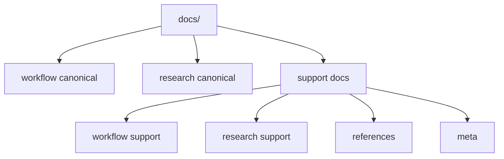

# Writing Guide

이 문서는 `docs/` 문서를 같은 기준으로 쓰기 위한 규칙을 정리한다. 공식 규칙은 짧고 분명하게 쓰고, 문서 간 역할은 겹치지 않게 나눈다.

## 문서 타입

- `workflow/`와 `research/`의 canonical 문서는 공식 기준을 고정한다.
- guide, playbook, study note, writing guide는 support 문서다.
- support 문서는 설명과 배경을 보강하지만 source of truth가 되지 않는다.

## 파일 이름 규칙

- 문서 파일명은 영어 `snake_case`를 쓴다.
- 폴더 인덱스만 `README.md`를 쓴다.
- agent context 파일은 루트 `AGENTS.md`만 쓴다.
- 삭제한 이름은 다시 쓰지 않는다. 예를 들면 `prob_head.md`, `basin_explain.md`, `literature-review.md` 같은 이름으로 되돌리지 않는다.

## 인트로 규칙

- 첫 문단에서 이 문서가 무엇을 고정하는지 먼저 말한다.
- 배경 설명으로 길게 시작하지 않는다.
- 필요하면 초반에 아래 세 가지를 짧게 적는다.
  - 이 문서의 역할
  - 다루는 범위
  - 다루지 않는 범위
- 문서가 짧다면 별도 섹션 대신 첫 두세 문장 안에서 처리해도 된다.

## 헤딩 규칙

- `#` 제목은 한 번만 쓴다.
- `##`는 역할, 구조, 규칙, 관련 문서처럼 큰 덩어리를 나눌 때 쓴다.
- `###`는 세부 규칙이 실제로 여러 개일 때만 쓴다.
- 표와 목록은 구조가 있을 때만 쓴다. 짧은 설명은 산문으로 끝내도 된다.
- 같은 문서 안에서 heading 깊이를 불필요하게 늘리지 않는다.

## 링크 규칙

- 저장소 내부 링크는 상대 경로를 쓴다.
- 사람용 문서는 `AGENTS.md`를 일반 onboarding 문서처럼 연결하지 않는다.
- 링크는 handoff가 필요한 지점에만 건다. 같은 링크를 한 문서 안에서 반복하지 않는다.
- canonical 문서를 가리킬 때는 왜 그 문서로 넘어가야 하는지 한 문장 안에서 분명히 적는다.

## 중복 방지 규칙

- 문서마다 `주 질문`을 하나만 둔다.
- 공식 기준은 canonical 문서 한 곳에서만 정의한다.
- support 문서에서는 규칙을 다시 정의하지 않고 설명만 덧붙인다.
- 이미 다른 문서에 있는 긴 배경 설명은 요약만 남기고 링크로 넘긴다.

## 용어 규칙

- 문서 전체에서 같은 대상을 같은 이름으로 부른다.
- 기술 용어는 영어를 유지해도 되지만, 역할과 이유는 한국어로 설명한다.
- 모델 이름은 `Model 1`, `Model 2`, `Model 3`로 고정한다.
- basin, holdout, quantile, event 같은 핵심 용어는 문서마다 다른 번역으로 흔들지 않는다.
- DRBC, CAMELSH처럼 이미 굳은 약어는 그대로 쓴다.

## Mermaid 사용 규칙

- 구조, 흐름, 의존 관계가 핵심일 때 Mermaid를 쓴다.
- 노드 문구는 짧게 쓴다. 긴 설명은 본문이나 표로 넘긴다.
- taxonomy, reading path, pipeline, comparison map에는 Mermaid가 잘 맞는다.
- 규칙 문장 자체를 Mermaid로 대신하지 않는다. threshold, 예외, 정의는 본문에 남긴다.

## 빠른 체크리스트

- 이 문서의 역할이 한 문장으로 보이는가
- canonical인지 support인지 분명한가
- 저장소 내부 링크가 상대 경로인가
- 다른 문서와 같은 규칙을 중복 정의하지 않았는가
- 구조 설명이 길다면 Mermaid나 표로 줄였는가
