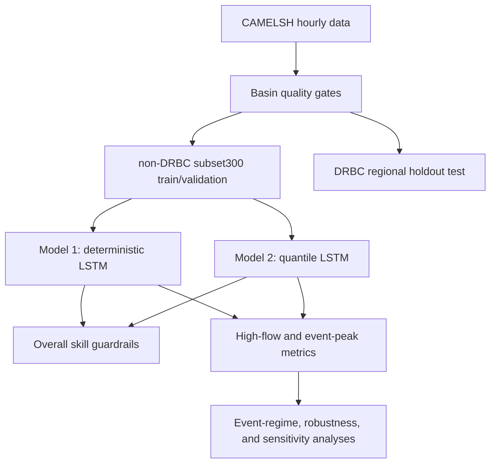

# IMRaD Paper Proposal

## Working Title

**Reducing Extreme Flood Underestimation with Probabilistic Extensions of Multi-Basin LSTM Models**

## Abstract

Multi-basin LSTM models are strong baselines for rainfall-runoff prediction, but point predictions can still miss rare flood peaks. This proposal tests whether part of that failure is an output-design limitation: a deterministic head is asked to return one central hydrograph, even when the operational question concerns the upper tail. The study therefore compares two models that share the same multi-basin LSTM backbone and differ primarily in their output head.

Model 1 is a deterministic multi-basin LSTM. Model 2 keeps the same backbone but predicts `q50`, `q90`, `q95`, and `q99` with a quantile head trained by pinball loss. The central comparison is not whether Model 2 is always a better median predictor. The sharper claim is that upper quantile outputs can reduce extreme flood peak underestimation while `q50` remains a central-skill guardrail.

The study uses hourly CAMELSH data. Models are trained on non-DRBC basins and evaluated on DRBC Delaware River Basin holdout basins, so the primary test is regional generalization rather than a random basin split. The compute-constrained official comparison uses the fixed `scaling_300` subset with paired seeds `111 / 222 / 444`. Model 2 seed `333` failed with NaN loss, so Model 1 seed `333` is excluded from final paired aggregates to keep the comparison balanced.

The Results section will separate overall hydrograph skill, high-flow and event-peak skill, probabilistic calibration, event-regime heterogeneity, Broad vs Natural robustness, and checkpoint sensitivity. This separation is essential because a model can look acceptable by NSE or KGE while still suppressing the flood peaks that matter most for risk.

## 1. Introduction

Flood prediction is not only a problem of reproducing the average hydrograph. For warning, infrastructure planning, and risk assessment, a critical failure mode is whether the model underestimates the magnitude or timing of rare high-flow peaks. Large-sample hydrology has shown that LSTM rainfall-runoff models can be strong regional or global baselines, especially when trained across many basins with meteorological forcings and static catchment attributes. However, common headline metrics such as NSE and KGE summarize broad time-series fit and can hide systematic errors in the upper tail.

The problem is structural in the data as well as in the model objective. Hourly streamflow records are dominated by low and moderate flows, while damaging flood peaks are rare. A deterministic model trained to minimize a point-prediction loss can reduce average error by learning a conservative central response. That behavior may be good for many hours, but it can suppress the largest peaks. In this setting, extreme flood underestimation may reflect not only a limitation of the LSTM memory or basin representation, but also a limitation of asking the model to output only one value.

Probabilistic forecasting changes that output design. Quantile regression allows the model to learn conditional upper-tail outputs such as `q90`, `q95`, and `q99`. For this study, those upper quantiles are treated as decision-relevant tail outputs, not as a complete uncertainty solution. The current quantile set has no lower quantiles such as `q05` or `q01`, so it does not define a two-sided prediction interval. It also does not estimate return periods. In particular, Model 2 `q99` is not a 99-year flood; it is the model's conditional 99th quantile for a given input sequence and target time.

The research gap is therefore specific and testable: under the same backbone, split, training subset, and paired-seed protocol, how much of deterministic LSTM flood-peak underestimation can be reduced by replacing the deterministic regression head with an upper-tail quantile head?

The study asks four research questions.

1. Does Model 2 `q50` preserve acceptable overall hydrograph skill relative to Model 1?
2. Do Model 2 `q90/q95/q99` reduce high-flow and event-peak underestimation relative to Model 1?
3. Are upper-tail gains concentrated in particular event regimes or severity classes?
4. Are the conclusions robust to Broad vs Natural cohort choice and checkpoint sensitivity?

The expected contribution is a controlled output-head comparison for extreme flood underestimation. Physics-guided hybrid modeling remains a future-work direction for timing, routing, and state-interpretability questions, but it is not part of the official Model 1 vs Model 2 comparison.

## 2. Methods

### 2.1 Study Design

The study is designed as a controlled two-model comparison. The backbone, input features, training subset, temporal split, and seed protocol are held fixed as much as possible. The main experimental change is the output head.



This design supports one main causal interpretation: if upper-tail errors differ systematically between the models, the most defensible explanation is the output design rather than a different hydrologic encoder.

### 2.2 Data, Region, and Cohorts

The primary dataset is CAMELSH hourly. The target variable is hourly `Streamflow`, interpreted as discharge at the basin outlet rather than water level. The main dynamic inputs follow the CAMELSH generic setup and include precipitation, temperature, potential evaporation, shortwave and longwave radiation, humidity, pressure, wind components, `CAPE`, and convective rainfall fraction. Static attributes summarize basin area, slope, aridity, snow fraction, soil depth, permeability, forest fraction, and baseflow index.

The evaluation region is defined by the Delaware River Basin Commission boundary. The model is not a Delaware-only regional model. It is trained on non-DRBC basins and evaluated on DRBC as a regional holdout. The broad non-DRBC quality-pass pool contains `1923` basins. Because the full pool is too expensive for the current main comparison, the official experiment uses the fixed `scaling_300` cohort:

| split role | basin count | role in the study |
| --- | ---: | --- |
| train | 269 | non-DRBC multi-basin training subset |
| validation | 31 | non-DRBC checkpoint selection |
| test | 38 | DRBC regional holdout evaluation |

The broader prepared split remains the source pool and reference context. The Natural cohort is treated as a robustness subset for lower hydromodification risk, not as a replacement for the Broad main result.

The temporal split is:

| period | dates | role |
| --- | --- | --- |
| train | `2000-01-01` to `2010-12-31` | model fitting |
| validation | `2011-01-01` to `2013-12-31` | checkpoint selection |
| test | `2014-01-01` to `2016-12-31` | primary DRBC evaluation |

Because some basins have uneven usable-year coverage, training membership is not interpreted as equal sample contribution. Low-support basins are reported as a data-support limitation and defense point rather than used to retrain the study, since the current compute budget does not allow a full rerun.

### 2.3 Models and Output Interpretation

Model 1 is the deterministic baseline. It uses a shared LSTM encoder and a regression head that produces one streamflow prediction for each target time step. It is the reference model for all paired comparisons.

Model 2 keeps the same backbone and predicts four quantiles: `q50`, `q90`, `q95`, and `q99`. The `q50` output is the conditional median and is the only Model 2 output that should be directly compared with Model 1 as a central point prediction. The upper quantiles are evaluated as tail outputs.

The model uses a monotone upper-quantile design, where the upper quantiles are represented as positive increments above the lower quantile:

```text
q50 = z50
q90 = q50 + softplus(d90)
q95 = q90 + softplus(d95)
q99 = q95 + softplus(d99)
```

This design reduces quantile crossing and enforces `q50 <= q90 <= q95 <= q99`.

The quantile outputs are learned at each target time step. They are not calculated by taking the 99th percentile of the previous 336 hours. For a target time `t`, Model 2 predicts `q50_t`, `q90_t`, `q95_t`, and `q99_t` from the input sequence, and each of those predictions is compared with the observed `Streamflow_t` through quantile loss. For quantile level `tau`, the pinball loss is:

```text
L_tau(y_t, q_tau,t) =
  tau * (y_t - q_tau,t),       if y_t > q_tau,t
  (1 - tau) * (q_tau,t - y_t), if y_t <= q_tau,t
```

For `q99`, underprediction is penalized much more strongly than overprediction. This is why the head can learn a higher tail response without changing the LSTM backbone. However, high nominal quantiles still require empirical coverage checks. A `q99` output is only a calibrated 99% upper bound if observed values fall below it at the expected frequency.

### 2.4 Training and Checkpoint Selection

The official paired seeds are `111 / 222 / 444`. Model 2 seed `333` failed with NaN loss, so Model 1 seed `333` is excluded from final paired results. This keeps the paired model comparison balanced.

Primary checkpoints are selected before looking at DRBC test results, using non-DRBC validation median NSE. The current primary epoch mapping is:

| model | seed | primary epoch |
| --- | ---: | ---: |
| Model 1 | 111 | 25 |
| Model 1 | 222 | 10 |
| Model 1 | 444 | 15 |
| Model 2 | 111 | 5 |
| Model 2 | 222 | 10 |
| Model 2 | 444 | 10 |

Validation checkpoint grid results for epochs `005 / 010 / 015 / 020 / 025 / 030` are used only for sensitivity diagnostics. They are not used to reselect the primary checkpoint after seeing test behavior.

### 2.5 Evaluation Metrics and Statistical Unit

The evaluation separates central hydrograph skill from flood-specific behavior.

| metric family | metrics | interpretation |
| --- | --- | --- |
| Overall skill | `NSE`, `KGE`, `NSElog` | central hydrograph guardrails |
| High-flow bias | `FHV`, high-flow relative bias, underestimation fraction | whether large flows are systematically low or high |
| Peak magnitude | peak relative error, `Peak-MAPE`, peak under-deficit | event or window peak-size accuracy |
| Peak timing | peak timing error in hours | whether the peak is early or late |
| Detection/recall | top 1% flow recall, threshold exceedance recall | whether observed high-flow times are recovered |
| Probabilistic diagnostics | pinball loss, one-sided coverage, calibration error, quantile gap | whether nominal quantiles behave like quantiles |

The main statistical unit is the basin-level paired delta. For each metric, the analysis computes the difference on the same basin and seed before aggregation. The main summaries are median delta, IQR, win rate, `n_basin`, and `n_seed`. Paired Wilcoxon signed-rank tests may be included as supplementary diagnostics, but the interpretation will prioritize direction, effect size, and seed consistency.

For event analyses, events are nested inside basins. To prevent event-rich basins from dominating the result, the preferred reporting path is `event -> basin/event-regime summary -> across-basin aggregate`.

### 2.6 High-Flow Events and Event Regimes

High-flow event analysis uses observed streamflow event candidates rather than an official flood inventory. The main threshold is basin-specific hourly `Streamflow` `Q99`. If a basin has too few events, the threshold can fall back to `Q98` and then `Q95`, with the selected threshold stored for interpretation.

This distinction matters. `Q99` in the event table is an observed-flow threshold used to identify high-flow candidates. Model 2 `q99` is a conditional model output. Neither should be described as a 99-year flood or an official flood occurrence.

Flood type is treated as event-regime stratification rather than confirmed causal classification. The primary grouping uses `hydromet_only_7 + KMeans(k=3)` and is interpreted as:

| regime | interpretation |
| --- | --- |
| Recent rainfall | events dominated by recent precipitation signal |
| Antecedent / multi-day rain | events with stronger antecedent or multi-day rainfall signal |
| Weak / low-signal hydromet regime | mixed or weak hydrometeorological signal |

Rule-based `degree_day_v2` labels are used as QA and sensitivity checks. They are not treated as definitive snowmelt or rain-on-snow causal labels.

### 2.7 Extreme-Rain Stress Test

The extreme-rain analysis is a supplementary stress test. It identifies extreme rainfall candidates from hourly `Rainf` rolling sums and evaluates whether fixed Model 1 and Model 2 checkpoints track DRBC historical stress responses.

The interpretation boundary is important. The primary DRBC `2014-2016` test is the independent regional holdout. The DRBC historical stress period spans `1980-2024`, so it can overlap temporally with training or validation years. Therefore, historical stress results are robustness evidence, not temporal independence evidence. Positive-response events are used to assess peak tracking and under-deficit. Low-response events are used as negative controls for upper-quantile false-positive risk.

## 3. Results Plan

The Results section will be ordered by claim strength, not by artifact generation order.

First, the paper will report central-skill guardrails. Model 1 and Model 2 `q50` will be compared using `NSE`, `KGE`, and `NSElog`, plus flood-related guardrails such as `FHV`, `Peak-MAPE`, and peak timing. This section answers whether the quantile head breaks the central hydrograph. It does not decide the flood-tail claim by itself.

Second, the paper will report high-flow stratum results. The key comparison will be Model 1 versus Model 2 `q50/q90/q95/q99` at observed high-flow hours, especially basin top `1%`, basin top `0.1%`, and observed peak hours. Strong evidence for the hypothesis would look like this: Model 2 `q95` or `q99` reduces underestimation fraction and under-deficit relative to Model 1 across basins and seeds, even if Model 2 `q50` is not uniformly better.

Third, the paper will report event-level peak behavior. Event windows will be summarized by peak relative error, peak under-deficit, timing error, event RMSE, and threshold recall. The preferred conclusion will be stated at the basin/event-regime aggregate level rather than at the raw event count level.

Fourth, the paper will report probabilistic diagnostics. One-sided empirical coverage will test whether `q90`, `q95`, and `q99` behave like their nominal quantiles. Quantile gaps will show whether the upper-tail spread expands meaningfully during high-flow periods. These diagnostics are necessary because a high `q99` can reduce underestimation while still being poorly calibrated or too prone to false positives.

Fifth, the paper will report event-regime heterogeneity. The question is whether upper-tail gains are shared across recent-rainfall, antecedent/multi-day rainfall, and weak-signal regimes, or whether the result is driven by one regime. This will be framed as model-error stratification, not causal flood-process attribution.

Sixth, the paper will report robustness and sensitivity. Broad vs Natural comparison will test whether hydromodification-risk filtering changes the direction of the paired deltas. Primary vs all-validation-epoch analysis will test whether the conclusion depends on one favorable checkpoint.

The planned main tables and figures are:

| item | content | purpose |
| --- | --- | --- |
| Table 1 | model, seed, primary epoch, split, and basin counts | reproducibility |
| Table 2 | primary overall metrics | central skill guardrail |
| Table 3 | high-flow stratum metrics by predictor | main tail-underestimation evidence |
| Table 4 | event-level peak and timing metrics | event-scale flood behavior |
| Table 5 | coverage, calibration, and quantile gaps | probabilistic validity |
| Figure 1 | basin-level paired-delta distributions | basin robustness |
| Figure 2 | high-flow stratum performance by `q50/q90/q95/q99` | tail behavior |
| Figure 3 | event-regime paired deltas | heterogeneity |
| Figure 4 | primary vs all-epoch sensitivity | checkpoint robustness |
| Figure 5 | selected hydrograph cases | qualitative peak behavior |

The current interpretation strategy is deliberately conservative. Model 2 `q50` should not be presented as a general improvement over Model 1 unless the metrics support that statement. The stronger and safer claim is: under the same LSTM backbone, split, and paired seeds, upper quantile outputs can expose and reduce deterministic peak underestimation, while calibration and false-positive behavior must be checked separately.

## 4. Discussion

The expected contribution is to clarify whether deterministic LSTM flood underestimation is partly an output-design problem. If Model 2 `q95/q99` reduces peak under-deficit while Model 2 `q50` remains similar to or slightly worse than Model 1, the result still supports the central thesis. It would show that the probabilistic head adds value by representing upper-tail risk rather than by improving every central hydrograph metric.

The study also has explicit limitations. First, the current quantile head only models the upper tail, so it does not provide a complete predictive distribution or central prediction interval. Second, the current DRBC quality-pass test set has 38 basins, so basin heterogeneity and uncertainty must remain visible in all conclusions. Third, observed high-flow candidates are not official flood inventory records. Fourth, the historical extreme-rain stress test is not an independent temporal test and cannot be used for checkpoint selection. Fifth, the existing training subset has uneven basin sample support; this is reported transparently rather than corrected by costly retraining.

These limitations shape the defensible final claim. The paper should not claim that quantile LSTM solves flood forecasting, nor that `q99` is a calibrated flood warning threshold by definition. It can claim, if supported by results, that deterministic point outputs suppress upper-tail flood peaks and that a quantile output head reduces this underestimation under a controlled multi-basin LSTM comparison.

Future work follows naturally from the remaining errors. Adding lower quantiles would allow proper interval evaluation. Post-hoc calibration could make upper quantiles more operationally interpretable. A physics-guided state or flux-constrained core could then target timing, routing, snowmelt, and groundwater-related generalization errors without confusing the current output-head comparison.

## References

- Addor, N., Newman, A. J., Mizukami, N., and Clark, M. P. (2017). The CAMELS dataset. <https://doi.org/10.5194/hess-21-5293-2017>
- Feng, D., Lawson, K., and Shen, C. (2021). Mitigating prediction error of deep learning streamflow models in large data-sparse regions with ensemble modeling and soft data. <https://doi.org/10.1029/2021GL092999>
- Frame, J. M., Kratzert, F., Klotz, D., et al. (2022). Deep learning rainfall-runoff predictions of extreme events. <https://hess.copernicus.org/articles/26/3377/2022/>
- Gneiting, T., and Raftery, A. E. (2007). Strictly Proper Scoring Rules, Prediction, and Estimation. <https://sites.stat.washington.edu/raftery/Research/PDF/Gneiting2007jasa.pdf>
- Hoedt, P. J., Kratzert, F., Klotz, D., et al. (2021). MC-LSTM: Mass-conserving LSTM.
- Jiang, S., Zheng, Y., and Solomatine, D. (2022). River flooding mechanisms and their changes in Europe revealed by explainable machine learning. <https://hess.copernicus.org/articles/26/6339/2022/hess-26-6339-2022.html>
- Klotz, D., Kratzert, F., Gauch, M., et al. (2022). Uncertainty estimation with deep learning for rainfall-runoff modeling.
- Knoben, W. J. M., Freer, J. E., and Woods, R. A. (2019). Inherent benchmark or not? Comparing Nash-Sutcliffe and Kling-Gupta efficiency scores. <https://hess.copernicus.org/articles/23/4323/2019/>
- Koenker, R., and Hallock, K. F. (2001). Quantile Regression. <https://www.aeaweb.org/articles?id=10.1257/jep.15.4.143>
- Kratzert, F., Klotz, D., Brenner, C., Schulz, K., and Herrnegger, M. (2018). Rainfall-runoff modelling using Long Short-Term Memory networks.
- Kratzert, F., Klotz, D., Shalev, G., et al. (2019). Toward Improved Predictions in Ungauged Basins. <https://doi.org/10.1029/2019WR026065>
- Mizukami, N., Rakovec, O., Newman, A. J., et al. (2019). On the choice of calibration metrics for high-flow estimation using hydrologic models. <https://hess.copernicus.org/articles/23/2601/2019/>
- Nearing, G. S., et al. (2024). Global prediction of extreme floods in ungauged watersheds. <https://www.nature.com/articles/s41586-024-07145-1>
- Papacharalampous, G., Tyralis, H., Langousis, A., et al. (2019). Probabilistic Hydrological Post-Processing at Scale. <https://www.mdpi.com/2073-4441/11/10/2126>
- Stein, L., Pianosi, F., and Woods, R. (2020). Event-based classification for identifying flood generating processes. <https://research-information.bris.ac.uk/ws/files/220895815/Stein_et_al_2020_Hydrological_Processes.pdf>
- Towler, E., and McCreight, J. L. (2021). A wavelet-based approach to streamflow event identification and modeled timing error evaluation. <https://hess.copernicus.org/articles/25/2599/2021/hess-25-2599-2021.html>
- Yilmaz, K. K., Gupta, H. V., and Wagener, T. (2008). A process-based diagnostic approach to model evaluation. <https://doi.org/10.1029/2007WR006716>
