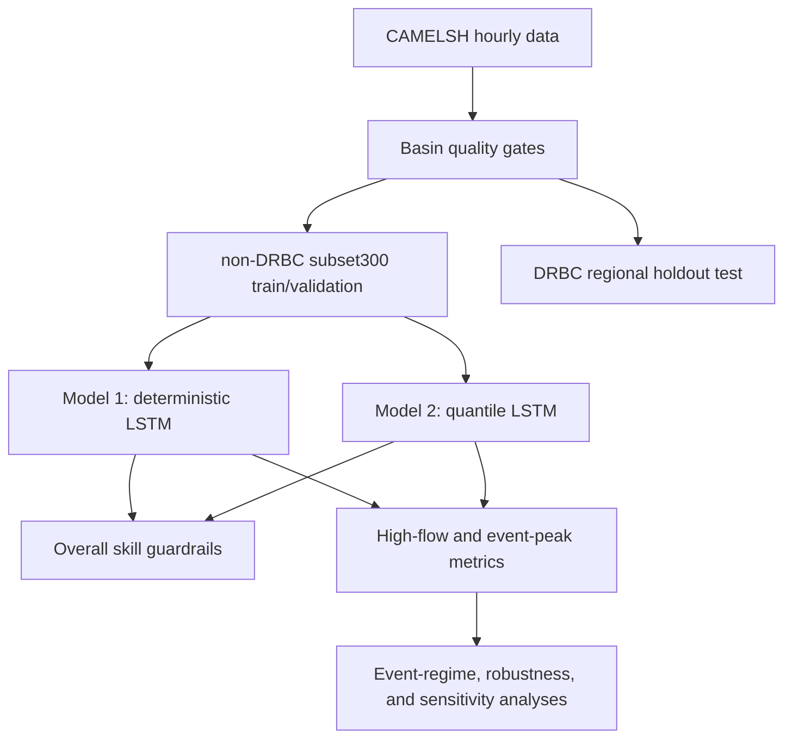

# IMRaD 기반 논문 Proposal 한국어 사본

## 작업 제목

**Multi-Basin LSTM 모델의 확률적 확장을 통한 극한 홍수 첨두 과소추정 완화**

## 초록

Multi-basin LSTM 모델은 강우-유출 예측에서 강력한 baseline이지만, 단일 point prediction은 드문 홍수 첨두를 낮게 예측하는 한계를 보일 수 있다. 이 proposal은 그 문제가 LSTM backbone 자체의 한계만이 아니라 output design의 한계일 수 있다는 점을 검증한다. Deterministic head는 하나의 중심 hydrograph를 내도록 학습되지만, 홍수 위험 의사결정에서 중요한 것은 upper tail인 경우가 많기 때문이다.

Model 1은 deterministic multi-basin LSTM이다. Model 2는 같은 backbone을 유지하되 `q50`, `q90`, `q95`, `q99`를 예측하는 quantile head를 붙이고 pinball loss로 학습한다. 핵심 비교는 Model 2가 항상 더 좋은 median predictor인지가 아니다. 더 정확한 주장은 `q50`이 중심 예측 성능의 guardrail 역할을 하는 동안, `q95`와 `q99` 같은 upper quantile output이 극한 홍수 첨두 과소추정을 줄일 수 있는지다.

본 연구는 hourly CAMELSH 자료를 사용한다. 모델은 non-DRBC 유역에서 학습하고, DRBC Delaware River Basin holdout 유역에서 평가한다. 따라서 primary test는 random basin split이 아니라 regional generalization test다. Compute 제약이 있으므로 공식 비교는 고정된 `scaling_300` subset과 paired seed `111 / 222 / 444`를 사용한다. Model 2 seed `333`은 NaN loss로 실패했기 때문에, 균형 잡힌 paired aggregate를 위해 Model 1 seed `333`도 제외한다.

Results는 overall hydrograph skill, high-flow와 event-peak skill, probabilistic calibration, event-regime heterogeneity, Broad vs Natural robustness, checkpoint sensitivity를 분리해 제시한다. 이 분리가 중요하다. NSE나 KGE가 괜찮아 보여도, 실제 위험 평가에서 중요한 flood peak를 체계적으로 낮게 예측할 수 있기 때문이다.

## 1. Introduction

홍수 예측은 평균적인 hydrograph를 잘 재현하는 문제만은 아니다. 홍수 경보, 인프라 계획, 위험 평가에서 중요한 실패 양상은 드문 high-flow peak의 크기나 timing을 놓치는 것이다. Large-sample hydrology 연구들은 LSTM rainfall-runoff model이 여러 유역에서 meteorological forcing과 static catchment attribute를 함께 학습할 때 강력한 regional/global baseline이 될 수 있음을 보여주었다. 하지만 NSE와 KGE 같은 대표 지표는 전체 시계열 적합도를 요약하기 때문에 upper tail의 반복적인 오류를 가릴 수 있다.

이 문제는 데이터와 학습 목표 양쪽에서 생긴다. Hourly streamflow record는 low flow와 moderate flow가 대부분이고, 피해를 유발하는 flood peak는 드물다. Point-prediction loss를 최소화하는 deterministic model은 평균 오차를 줄이는 과정에서 보수적인 중심 응답을 학습할 수 있다. 많은 시간대에서는 괜찮은 선택일 수 있지만, 가장 큰 peak는 낮게 눌릴 수 있다. 따라서 extreme flood underestimation은 LSTM memory나 basin representation의 문제만이 아니라, 모델이 하나의 값만 출력하도록 요구받는 구조의 문제일 수 있다.

Probabilistic forecasting은 output design을 바꾼다. Quantile regression은 모델이 `q90`, `q95`, `q99` 같은 conditional upper-tail output을 학습하게 한다. 다만 본 연구의 upper quantile은 complete uncertainty solution이 아니라 decision-relevant tail output으로 해석한다. 현재 quantile set에는 `q05`나 `q01` 같은 lower quantile이 없으므로 two-sided prediction interval을 정의하지 않는다. 또한 return period를 추정하지도 않는다. 특히 Model 2 `q99`는 99년 빈도 홍수가 아니라, 주어진 input sequence와 target time에 대한 conditional 99th quantile이다.

따라서 연구 공백은 구체적이다. 같은 backbone, 같은 split, 같은 training subset, 같은 paired-seed protocol에서 deterministic LSTM의 flood-peak underestimation이 deterministic regression head를 upper-tail quantile head로 바꾸는 것만으로 얼마나 줄어드는가?

본 연구의 연구 질문은 네 가지다.

1. Model 2 `q50`은 Model 1 대비 허용 가능한 overall hydrograph skill을 유지하는가?
2. Model 2 `q90/q95/q99`는 Model 1 대비 high-flow 및 event-peak underestimation을 줄이는가?
3. Upper-tail gain은 특정 event regime이나 severity class에 집중되는가?
4. 결론은 Broad vs Natural cohort 선택과 checkpoint sensitivity에 대해 robust한가?

기대하는 기여는 extreme flood underestimation에 대한 통제된 output-head comparison이다. Physics-guided hybrid modeling은 timing, routing, state interpretability를 다루는 후속 연구 방향으로 남겨두며, 현재 공식 Model 1 vs Model 2 비교축에는 포함하지 않는다.

## 2. Methods

### 2.1 Study Design

본 연구는 통제된 two-model comparison으로 설계한다. Backbone, input feature, training subset, temporal split, seed protocol은 최대한 고정한다. 주요 실험 변화는 output head다.



이 설계가 지원하는 핵심 해석은 하나다. 두 모델 사이의 upper-tail error가 체계적으로 다르다면, 가장 방어 가능한 설명은 다른 hydrologic encoder가 아니라 output design 차이라는 것이다.

### 2.2 Data, Region, and Cohorts

주 데이터셋은 hourly CAMELSH다. Target variable은 basin outlet의 hourly `Streamflow`이며, water level이 아니라 discharge로 해석한다. Dynamic input은 CAMELSH generic 설정을 따르며 precipitation, temperature, potential evaporation, shortwave/longwave radiation, humidity, pressure, wind components, `CAPE`, convective rainfall fraction을 포함한다. Static attribute는 basin area, slope, aridity, snow fraction, soil depth, permeability, forest fraction, baseflow index를 요약한다.

평가 지역은 Delaware River Basin Commission 경계로 정의한다. 모델은 Delaware-only regional model이 아니다. Non-DRBC 유역에서 학습하고 DRBC 유역에서 regional holdout 평가를 수행한다. Broad non-DRBC quality-pass pool은 `1923`개 유역이다. 전체 pool 학습은 현재 비용 제약상 어렵기 때문에 공식 실험은 고정된 `scaling_300` cohort를 사용한다.

| split role | basin count | 연구 내 역할 |
| --- | ---: | --- |
| train | 269 | non-DRBC multi-basin training subset |
| validation | 31 | non-DRBC checkpoint selection |
| test | 38 | DRBC regional holdout evaluation |

더 넓은 prepared split은 source pool이자 reference context로 남긴다. Natural cohort는 hydromodification risk가 낮은 robustness subset이며, Broad main result를 대체하지 않는다.

Temporal split은 다음과 같다.

| period | dates | role |
| --- | --- | --- |
| train | `2000-01-01` to `2010-12-31` | model fitting |
| validation | `2011-01-01` to `2013-12-31` | checkpoint selection |
| test | `2014-01-01` to `2016-12-31` | primary DRBC evaluation |

일부 basin은 usable-year coverage가 불균등하므로, training membership을 모든 유역이 같은 sample contribution을 했다는 뜻으로 해석하지 않는다. Low-support basin은 재학습으로 고치기보다 data-support limitation과 defense point로 투명하게 보고한다. 현재 compute budget에서는 전체 재학습이 현실적이지 않기 때문이다.

### 2.3 Models and Output Interpretation

Model 1은 deterministic baseline이다. Shared LSTM encoder와 regression head를 사용해 각 target time step마다 streamflow 하나를 예측한다. 모든 paired comparison에서 기준 모델 역할을 한다.

Model 2는 같은 backbone을 유지하고 `q50`, `q90`, `q95`, `q99` 네 quantile을 예측한다. `q50`은 conditional median이므로 Model 1과 central point prediction으로 직접 비교할 수 있는 유일한 Model 2 output이다. Upper quantile은 tail output으로 평가한다.

현재 quantile head는 monotone upper-quantile design을 따른다. 즉 상위 quantile을 아래 quantile 위에 positive increment로 쌓는다.

```text
q50 = z50
q90 = q50 + softplus(d90)
q95 = q90 + softplus(d95)
q99 = q95 + softplus(d99)
```

이 구조는 quantile crossing을 줄이고 `q50 <= q90 <= q95 <= q99` 순서를 보장한다.

Quantile output은 각 target time step에서 학습된다. 과거 336시간의 99번째 분위수를 직접 계산하는 것이 아니다. Target time `t`에 대해 Model 2는 input sequence를 보고 `q50_t`, `q90_t`, `q95_t`, `q99_t`를 예측하고, 각 예측값은 관측 `Streamflow_t`와 quantile loss로 비교된다. Quantile level `tau`의 pinball loss는 아래와 같다.

```text
L_tau(y_t, q_tau,t) =
  tau * (y_t - q_tau,t),       if y_t > q_tau,t
  (1 - tau) * (q_tau,t - y_t), if y_t <= q_tau,t
```

`q99`에서는 underprediction에 대한 벌점이 overprediction보다 훨씬 크다. 그래서 backbone을 바꾸지 않고도 더 높은 tail response를 학습할 수 있다. 다만 nominal quantile이 실제로 calibration되어 있는지는 별도로 확인해야 한다. `q99` output은 관측값이 그 아래에 기대 빈도로 들어올 때에만 calibrated 99% upper bound라고 말할 수 있다.

### 2.4 Training and Checkpoint Selection

공식 paired seed는 `111 / 222 / 444`다. Model 2 seed `333`은 NaN loss로 실패했기 때문에, 최종 paired result에서는 Model 1 seed `333`도 제외한다. 이렇게 해야 같은 seed set에서 균형 잡힌 비교가 가능하다.

Primary checkpoint는 DRBC test result를 보기 전에 non-DRBC validation median NSE로 선택한다. 현재 primary epoch mapping은 다음과 같다.

| model | seed | primary epoch |
| --- | ---: | ---: |
| Model 1 | 111 | 25 |
| Model 1 | 222 | 10 |
| Model 1 | 444 | 15 |
| Model 2 | 111 | 5 |
| Model 2 | 222 | 10 |
| Model 2 | 444 | 10 |

Epoch `005 / 010 / 015 / 020 / 025 / 030`의 validation checkpoint grid 결과는 sensitivity diagnostic에만 사용한다. Test behavior를 본 뒤 primary checkpoint를 다시 고르는 용도로 사용하지 않는다.

### 2.5 Evaluation Metrics and Statistical Unit

평가는 central hydrograph skill과 flood-specific behavior를 분리한다.

| metric family | metrics | interpretation |
| --- | --- | --- |
| Overall skill | `NSE`, `KGE`, `NSElog` | central hydrograph guardrail |
| High-flow bias | `FHV`, high-flow relative bias, underestimation fraction | 큰 유량을 체계적으로 낮게 또는 높게 예측하는지 |
| Peak magnitude | peak relative error, `Peak-MAPE`, peak under-deficit | event 또는 window peak 크기 정확도 |
| Peak timing | peak timing error in hours | peak가 빠른지 늦은지 |
| Detection/recall | top 1% flow recall, threshold exceedance recall | 관측 high-flow time을 회복하는지 |
| Probabilistic diagnostics | pinball loss, one-sided coverage, calibration error, quantile gap | nominal quantile이 실제 quantile처럼 동작하는지 |

기본 통계 단위는 basin-level paired delta다. 각 metric에 대해 같은 basin과 seed에서 차이를 계산한 뒤 aggregate한다. 주요 요약값은 median delta, IQR, win rate, `n_basin`, `n_seed`다. Paired Wilcoxon signed-rank test는 supplementary diagnostic으로 포함할 수 있지만, 해석에서는 p-value보다 direction, effect size, seed consistency를 우선한다.

Event analysis에서는 event가 basin 안에 nested되어 있다. Event가 많은 basin이 결과를 지배하지 않도록, 권장 reporting path는 `event -> basin/event-regime summary -> across-basin aggregate`다.

### 2.6 High-Flow Events and Event Regimes

High-flow event analysis는 official flood inventory가 아니라 observed streamflow event candidate를 사용한다. 기본 threshold는 basin-specific hourly `Streamflow` `Q99`다. Event 수가 너무 적은 basin에서는 `Q98`, 그다음 `Q95`로 fallback할 수 있으며, 선택된 threshold는 해석을 위해 따로 저장한다.

이 구분은 중요하다. Event table의 `Q99`는 high-flow candidate를 잡기 위한 observed-flow threshold다. Model 2의 `q99`는 conditional model output이다. 둘 다 99년 빈도 홍수나 official flood occurrence로 부르면 안 된다.

Flood type은 확정적인 causal classification이 아니라 event-regime stratification으로 다룬다. Primary grouping은 `hydromet_only_7 + KMeans(k=3)`이며, regime은 다음처럼 해석한다.

| regime | interpretation |
| --- | --- |
| Recent rainfall | 최근 강수 신호가 지배적인 event |
| Antecedent / multi-day rain | 선행 강수 또는 multi-day rainfall signal이 강한 event |
| Weak / low-signal hydromet regime | hydrometeorological signal이 약하거나 혼합된 event |

Rule-based `degree_day_v2` label은 QA와 sensitivity check로 사용한다. 이를 확정적인 snowmelt 또는 rain-on-snow causal label로 해석하지 않는다.

### 2.7 Extreme-Rain Stress Test

Extreme-rain analysis는 supplementary stress test다. Hourly `Rainf` rolling sum에서 extreme rainfall candidate를 식별하고, 고정된 Model 1과 Model 2 checkpoint가 DRBC historical stress response를 얼마나 추적하는지 평가한다.

해석 경계가 중요하다. Primary DRBC `2014-2016` test는 independent regional holdout이다. 반면 DRBC historical stress period는 `1980-2024`를 포함하므로 training 또는 validation year와 시간적으로 겹칠 수 있다. 따라서 historical stress result는 robustness evidence이지 temporal independence evidence가 아니다. Positive-response event는 peak tracking과 under-deficit 평가에 사용하고, low-response event는 upper-quantile false-positive risk를 점검하는 negative control로 사용한다.

## 3. Results Plan

Results section은 artifact 생성 순서가 아니라 claim strength 순서로 구성한다.

첫째, central-skill guardrail을 보고한다. Model 1과 Model 2 `q50`을 `NSE`, `KGE`, `NSElog`로 비교하고, `FHV`, `Peak-MAPE`, peak timing 같은 flood-related guardrail도 함께 본다. 이 절의 질문은 quantile head가 central hydrograph를 무너뜨리는지다. 이 결과만으로 flood-tail claim을 판단하지 않는다.

둘째, high-flow stratum result를 보고한다. 핵심 비교는 observed high-flow hour에서 Model 1과 Model 2 `q50/q90/q95/q99`를 비교하는 것이다. 특히 basin top `1%`, basin top `0.1%`, observed peak hour를 본다. 가설을 강하게 지지하는 패턴은 Model 2 `q95` 또는 `q99`가 Model 1 대비 underestimation fraction과 under-deficit을 basin과 seed 전반에서 줄이는 것이다. 이때 Model 2 `q50`이 항상 더 좋아야만 하는 것은 아니다.

셋째, event-level peak behavior를 보고한다. Event window는 peak relative error, peak under-deficit, timing error, event RMSE, threshold recall로 요약한다. 결론은 raw event count 기준이 아니라 basin/event-regime aggregate 기준으로 제시하는 것이 좋다.

넷째, probabilistic diagnostic을 보고한다. One-sided empirical coverage는 `q90`, `q95`, `q99`가 nominal quantile처럼 동작하는지 확인한다. Quantile gap은 high-flow period에서 upper-tail spread가 의미 있게 벌어지는지 보여준다. 이 진단이 필요한 이유는 높은 `q99`가 underestimation을 줄이더라도 calibration이 나쁘거나 false positive가 많을 수 있기 때문이다.

다섯째, event-regime heterogeneity를 보고한다. Upper-tail gain이 recent-rainfall, antecedent/multi-day rainfall, weak-signal regime 전반에 공유되는지, 아니면 특정 regime이 결과를 주도하는지 확인한다. 이 결과는 causal flood-process attribution이 아니라 model-error stratification으로 표현한다.

여섯째, robustness와 sensitivity를 보고한다. Broad vs Natural comparison은 hydromodification-risk filtering이 paired delta 방향을 바꾸는지 확인한다. Primary vs all-validation-epoch analysis는 결론이 특정 유리한 checkpoint 하나에 의존하는지 확인한다.

계획된 주요 table과 figure는 다음과 같다.

| item | content | purpose |
| --- | --- | --- |
| Table 1 | model, seed, primary epoch, split, basin counts | reproducibility |
| Table 2 | primary overall metrics | central skill guardrail |
| Table 3 | high-flow stratum metrics by predictor | main tail-underestimation evidence |
| Table 4 | event-level peak and timing metrics | event-scale flood behavior |
| Table 5 | coverage, calibration, quantile gaps | probabilistic validity |
| Figure 1 | basin-level paired-delta distributions | basin robustness |
| Figure 2 | high-flow stratum performance by `q50/q90/q95/q99` | tail behavior |
| Figure 3 | event-regime paired deltas | heterogeneity |
| Figure 4 | primary vs all-epoch sensitivity | checkpoint robustness |
| Figure 5 | selected hydrograph cases | qualitative peak behavior |

현재 해석 전략은 보수적으로 둔다. Metric이 뒷받침하지 않는 한 Model 2 `q50`을 Model 1보다 전반적으로 더 좋은 모델이라고 쓰지 않는다. 더 강하고 안전한 주장은 다음이다. 같은 LSTM backbone, 같은 split, 같은 paired seed 조건에서 upper quantile output은 deterministic peak underestimation을 드러내고 줄일 수 있으며, calibration과 false-positive behavior는 별도로 검증해야 한다.

## 4. Discussion

본 연구의 기대 기여는 deterministic LSTM의 flood underestimation이 output-design problem의 영향을 받는지 명확히 하는 것이다. 만약 Model 2 `q95/q99`가 peak under-deficit을 줄이지만 Model 2 `q50`은 Model 1과 비슷하거나 약간 낮은 성능을 보인다면, 그 결과도 중심 thesis를 지지할 수 있다. 이는 probabilistic head의 가치가 모든 central hydrograph metric을 개선하는 데 있는 것이 아니라, deterministic point estimate가 누르는 upper-tail risk를 표현하는 데 있음을 보여주기 때문이다.

한계도 명확히 둔다. 첫째, 현재 quantile head는 upper tail만 모델링하므로 complete predictive distribution이나 central prediction interval을 제공하지 않는다. 둘째, 현재 DRBC quality-pass test set은 38개 basin이므로 basin heterogeneity와 uncertainty를 모든 결론에 함께 보여줘야 한다. 셋째, observed high-flow candidate는 official flood inventory가 아니다. 넷째, historical extreme-rain stress test는 independent temporal test가 아니며 checkpoint selection에 사용할 수 없다. 다섯째, 현재 training subset에는 basin별 sample support 불균형이 있으며, 이는 비용이 큰 재학습으로 고치기보다 투명하게 보고한다.

이 한계는 최종 claim의 경계를 정한다. 논문은 quantile LSTM이 flood forecasting을 해결했다고 주장하면 안 된다. 또한 `q99`가 정의상 calibrated flood warning threshold라고 주장해서도 안 된다. 결과가 뒷받침한다면 주장할 수 있는 것은 이것이다. Deterministic point output은 upper-tail flood peak를 낮게 누를 수 있고, quantile output head는 통제된 multi-basin LSTM 비교에서 이 과소추정을 완화한다.

후속 연구는 자연스럽게 세 방향으로 이어진다. Lower quantile을 추가하면 proper interval evaluation이 가능하다. Post-hoc calibration은 upper quantile을 operational warning에 더 해석 가능하게 만들 수 있다. 이후 physics-guided state 또는 flux-constrained core를 별도 후속 연구로 도입하면, 현재 output-head comparison을 흐리지 않으면서 timing, routing, snowmelt, groundwater 관련 generalization error를 겨냥할 수 있다.

## References

- Addor, N., Newman, A. J., Mizukami, N., and Clark, M. P. (2017). The CAMELS dataset. <https://doi.org/10.5194/hess-21-5293-2017>
- Feng, D., Lawson, K., and Shen, C. (2021). Mitigating prediction error of deep learning streamflow models in large data-sparse regions with ensemble modeling and soft data. <https://doi.org/10.1029/2021GL092999>
- Frame, J. M., Kratzert, F., Klotz, D., et al. (2022). Deep learning rainfall-runoff predictions of extreme events. <https://hess.copernicus.org/articles/26/3377/2022/>
- Gneiting, T., and Raftery, A. E. (2007). Strictly Proper Scoring Rules, Prediction, and Estimation. <https://sites.stat.washington.edu/raftery/Research/PDF/Gneiting2007jasa.pdf>
- Hoedt, P. J., Kratzert, F., Klotz, D., et al. (2021). MC-LSTM: Mass-conserving LSTM.
- Jiang, S., Zheng, Y., and Solomatine, D. (2022). River flooding mechanisms and their changes in Europe revealed by explainable machine learning. <https://hess.copernicus.org/articles/26/6339/2022/hess-26-6339-2022.html>
- Klotz, D., Kratzert, F., Gauch, M., et al. (2022). Uncertainty estimation with deep learning for rainfall-runoff modeling.
- Knoben, W. J. M., Freer, J. E., and Woods, R. A. (2019). Inherent benchmark or not? Comparing Nash-Sutcliffe and Kling-Gupta efficiency scores. <https://hess.copernicus.org/articles/23/4323/2019/>
- Koenker, R., and Hallock, K. F. (2001). Quantile Regression. <https://www.aeaweb.org/articles?id=10.1257/jep.15.4.143>
- Kratzert, F., Klotz, D., Brenner, C., Schulz, K., and Herrnegger, M. (2018). Rainfall-runoff modelling using Long Short-Term Memory networks.
- Kratzert, F., Klotz, D., Shalev, G., et al. (2019). Toward Improved Predictions in Ungauged Basins. <https://doi.org/10.1029/2019WR026065>
- Mizukami, N., Rakovec, O., Newman, A. J., et al. (2019). On the choice of calibration metrics for high-flow estimation using hydrologic models. <https://hess.copernicus.org/articles/23/2601/2019/>
- Nearing, G. S., et al. (2024). Global prediction of extreme floods in ungauged watersheds. <https://www.nature.com/articles/s41586-024-07145-1>
- Papacharalampous, G., Tyralis, H., Langousis, A., et al. (2019). Probabilistic Hydrological Post-Processing at Scale. <https://www.mdpi.com/2073-4441/11/10/2126>
- Stein, L., Pianosi, F., and Woods, R. (2020). Event-based classification for identifying flood generating processes. <https://research-information.bris.ac.uk/ws/files/220895815/Stein_et_al_2020_Hydrological_Processes.pdf>
- Towler, E., and McCreight, J. L. (2021). A wavelet-based approach to streamflow event identification and modeled timing error evaluation. <https://hess.copernicus.org/articles/25/2599/2021/hess-25-2599-2021.html>
- Yilmaz, K. K., Gupta, H. V., and Wagener, T. (2008). A process-based diagnostic approach to model evaluation. <https://doi.org/10.1029/2007WR006716>
