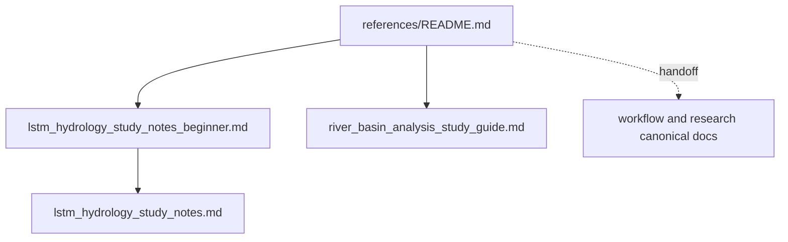

# Reference Notes

이 폴더는 외부 자료를 CAMELS 맥락으로 번역한 support note를 모은다. 공식 workflow와 연구 규칙은 이 폴더에 두지 않는다.

## Structure

## Documents

| Document | Role |
| --- | --- |
| [`lstm_hydrology_study_notes_beginner.md`](lstm_hydrology_study_notes_beginner.md) | LSTM hydrology 문헌을 읽기 위한 입문 노트 |
| [`lstm_hydrology_study_notes.md`](lstm_hydrology_study_notes.md) | LSTM hydrology 문헌 지형도와 프로젝트 적용 메모 |
| [`river_basin_analysis_study_guide.md`](river_basin_analysis_study_guide.md) | 유역 형상과 하천망 개념을 basin analysis 해석으로 연결하는 학습 가이드 |

## Recommended order

1. 공식 기준은 먼저 [`../README.md`](../README.md), [`../workflow/README.md`](../workflow/README.md), [`../research/README.md`](../research/README.md)에서 확인한다.
2. LSTM hydrology 배경이 낯설다면 [`lstm_hydrology_study_notes_beginner.md`](lstm_hydrology_study_notes_beginner.md)부터 읽는다.
3. 더 긴 문헌 메모는 [`lstm_hydrology_study_notes.md`](lstm_hydrology_study_notes.md)로 이어서 읽는다.
4. basin geometry와 하천망 개념이 필요할 때 [`river_basin_analysis_study_guide.md`](river_basin_analysis_study_guide.md)를 본다.
