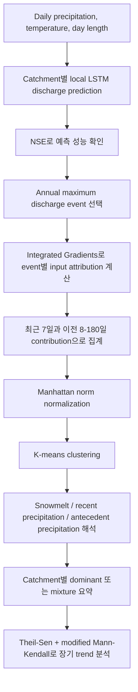
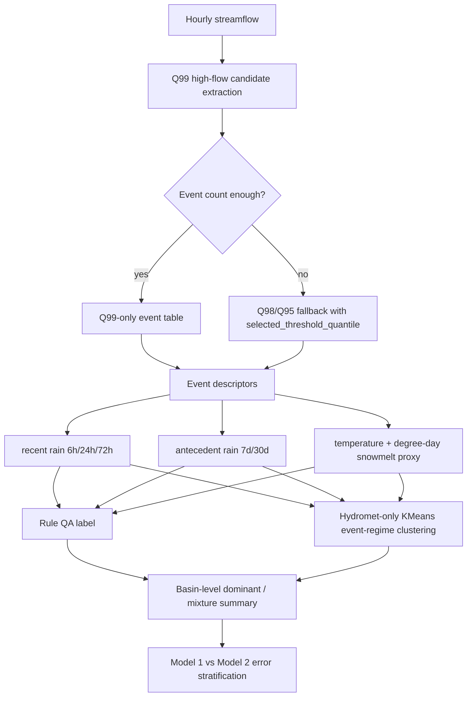

# Jiang et al. (2022) HESS 논문 해설

대상 논문은 Shijie Jiang, Emanuele Bevacqua, Jakob Zscheischler의 “River flooding mechanisms and their changes in Europe revealed by explainable machine learning”이다. 원문 PDF는 [`jiang_2022_hess_river_flooding_mechanisms_explainable_ml.pdf`](jiang_2022_hess_river_flooding_mechanisms_explainable_ml.pdf)에 있다.

이 문서는 논문을 처음 읽을 때 헷갈리기 쉬운 부분을 CAMELS 프로젝트 관점에서 풀어 쓴 참고 메모다. 핵심은 이 논문이 flood type을 직접 맞히는 classifier를 만든 것이 아니라, `LSTM discharge prediction -> Integrated Gradients attribution -> K-means clustering -> flood mechanism interpretation`이라는 절차로 flood-generating mechanism을 추론했다는 점이다.

## 1. 논문은 어떤 내용으로 흘러가는가

이 논문은 “기후변화가 유럽의 홍수 생성 메커니즘 자체를 바꾸고 있는가?”라는 질문에서 출발한다. 기존 연구들은 유럽의 홍수 빈도, 계절성, 크기가 변하고 있다는 점은 보여줬지만, 그 변화가 어떤 process 변화에서 왔는지는 충분히 분리하지 못했다고 본다. 특히 기존 방법에는 두 가지 약점이 있다고 짚는다.

첫째, catchment-level seasonality 비교나 driver seasonality 비교는 한 유역의 flood-generating process가 시간에 따라 크게 변하지 않는다고 암묵적으로 가정하기 쉽다. 하지만 실제로는 같은 유역에서도 어떤 해는 recent rainfall, 어떤 해는 antecedent wetness, 어떤 해는 snowmelt가 dominant할 수 있다.

둘째, event-based multicriteria classification은 storm duration, snowmelt amount, soil moisture threshold 같은 지표와 threshold를 사람이 미리 정해야 한다. threshold가 조금만 바뀌어도 classification이 바뀔 수 있어서, 대륙 규모 장기 변화 분석에서는 subjectivity가 커질 수 있다.

그래서 저자들은 explainable ML을 사용한다. 먼저 각 catchment별로 daily discharge를 예측하는 local LSTM을 학습한다. 입력은 과거 180일의 precipitation, temperature, day length이고, 출력은 target day의 discharge다. 그다음 annual maximum discharge event마다 Integrated Gradients를 계산해서, peak discharge 예측에 각 입력 변수가 얼마나 기여했는지 시점별로 분해한다. 마지막으로 이 feature attribution pattern을 K-means로 묶어 세 가지 flood mechanism으로 해석한다.

전체 흐름은 아래처럼 볼 수 있다.



논문의 결과 제시는 단계적으로 진행된다. 먼저 1077개 유럽 catchment를 대상으로 모델을 학습하고, 평균 NSE가 0.5를 넘는 977개 catchment만 downstream mechanism analysis에 쓴다. 이때 median NSE average는 0.74였고, 이후 분석 대상 annual maximum discharge event는 53,968개다.

그다음 이 53,968개 event를 attribution pattern에 따라 세 cluster로 나눈다. 논문은 이 cluster를 각각 `snowmelt-driven`, `recent-precipitation-driven`, `antecedent-precipitation-driven` flood로 해석한다. 여기서 antecedent precipitation은 실제 soil moisture 관측이 아니라, excessive soil moisture의 proxy로 읽힌다.

이후 event-level classification을 catchment-level로 집계한다. 논문에서 중요한 메시지는 많은 catchment가 단일 mechanism으로 깔끔하게 설명되지 않는다는 점이다. 전체 catchment의 52.1%는 mixture로 분류되었고, 단일 dominant mechanism만 보면 recent precipitation 26.9%, antecedent precipitation 10.9%, snowmelt 10.1%였다. mixture 중에서는 recent precipitation + antecedent precipitation 조합이 33.8%로 가장 컸다.

마지막으로 1950-2020 기간의 장기 변화를 본다. 818개 catchment를 대상으로 1950-1985와 1985-2020을 비교했을 때, 79.6%는 catchment-level dominant mechanism을 유지했다. 하지만 event-level proportion은 변했다. snowmelt-driven annual maxima는 10년당 0.8% 감소했고, recent-precipitation-driven flood는 10년당 1.1% 증가했다. antecedent-precipitation-driven flood는 약한 감소 경향이 있었지만 전체 기간 기준으로는 통계적으로 유의하지 않았다.

논문의 이야기 구조는 결국 이렇다. “유역별 annual flood peak를 explainable ML로 event-level attribution한다. 그 attribution을 clustering하면 세 가지 주요 flood mechanism이 드러난다. 유럽 전체에서 snowmelt의 영향은 줄고 recent heavy precipitation의 영향은 커지는 방향으로 event composition이 변했다. 이 변화는 warming, snowpack 감소, short-term precipitation extreme 증가라는 기후변화 반응과 대체로 일관된다.”

## 2. 여기서 사용한 분류 기법은 무엇인가

이 논문의 분류는 일반적인 supervised classification이 아니다. flood type 정답 label을 놓고 classifier를 훈련한 것이 아니라, discharge를 예측하는 supervised regression model을 먼저 만들고, 그 모델의 attribution을 unsupervised clustering으로 묶은 뒤, cluster를 물리적으로 해석했다.

정확히는 세 단계다.

첫 단계는 `supervised discharge modeling`이다. 각 catchment마다 local LSTM을 학습한다. 입력은 180일 길이의 precipitation, temperature, day length이고, 출력은 일별 discharge다. LSTM은 flood mechanism label을 예측하지 않는다. 단지 meteorological forcing과 discharge 사이의 nonlinear temporal relation을 학습한다.

둘째 단계는 `explainable attribution`이다. 학습된 LSTM에 Integrated Gradients를 적용해 annual maximum discharge event마다 입력 변수의 기여도를 구한다. 한 event에 대해 원래 attribution tensor는 `180일 x 3변수` 구조다. 이 값은 “실제 세계에서 이 변수가 중요한가”라기보다 “이 LSTM 모델이 해당 peak discharge를 예측할 때 이 입력을 얼마나 사용했는가”에 가깝다.

셋째 단계는 `unsupervised clustering`이다. 저자들은 540차원 attribution sequence를 그대로 clustering하지 않고, 다음 6개 값으로 압축했다.

| 벡터 요소 | 해석 |
| --- | --- |
| `P_recent_7d` | peak 직전 최근 7일 precipitation contribution |
| `P_antecedent_8_180d` | 그 이전 8-180일 precipitation contribution |
| `T_recent_7d` | 최근 7일 temperature contribution |
| `T_antecedent_8_180d` | 이전 8-180일 temperature contribution |
| `D_recent_7d` | 최근 7일 day length contribution |
| `D_antecedent_8_180d` | 이전 8-180일 day length contribution |

이 6차원 contribution vector는 Manhattan norm으로 정규화한다. 즉 각 원소를 전체 절대값 합으로 나눈다. 이렇게 하는 이유는 attribution의 절대 크기가 peak discharge magnitude와 연결되어 있기 때문이다. 정규화하지 않으면 cluster가 mechanism pattern보다 event magnitude 차이를 더 반영할 수 있다.

그다음 모든 event의 normalized 6차원 vector에 K-means clustering을 적용한다. 후보 cluster 수는 2-8개였고, silhouette coefficient와 silhouette plot을 보고 최종적으로 `K=3`을 선택했다. 평균 silhouette만 보면 2개와 3개 cluster가 비슷했지만, 2-cluster 해에서는 한 cluster의 sample-level silhouette이 전반적으로 낮아 3개가 더 적절하다고 판단했다.

최종 cluster 해석은 다음과 같다.

| Cluster | 주요 attribution pattern | 논문의 물리적 해석 | 전체 event 비율 |
| --- | --- | --- | --- |
| Cluster 1 | recent temperature contribution이 큼 | snowmelt-driven flood | 15.5% |
| Cluster 2 | recent precipitation contribution이 큼 | recent-precipitation-driven flood | 49.9% |
| Cluster 3 | antecedent precipitation contribution이 큼 | antecedent-precipitation / soil-moisture-excess-driven flood | 34.6% |

여기서 중요한 점은 cluster label이 모델의 직접 출력이 아니라는 것이다. K-means는 단지 attribution vector를 비슷한 것끼리 묶는다. `snowmelt`, `recent precipitation`, `antecedent precipitation`이라는 이름은 cluster centroid, spatial distribution, snowfall fraction, elevation, slope, flood seasonality와 맞춰 보면서 저자들이 해석한 결과다.

Catchment-level dominant mechanism은 event label의 비율을 집계해서 만든다. 어떤 mechanism의 event 비율이 다른 mechanism 비율보다 충분히 크면 single dominant mechanism으로 보고, 그렇지 않으면 mixture catchment로 둔다. 즉 이 논문은 event-level classification과 catchment-level summarization을 분리한다.

## 3. 분석 및 통계기법은 무엇이고, 그 상세는 무엇인가

이 논문의 분석 기법은 크게 `prediction quality control`, `model interpretation`, `attribution compression`, `unsupervised clustering`, `trend analysis`, `driver comparison`으로 나뉜다. 중요한 점은 이 절차가 하나의 classifier가 아니라는 것이다. LSTM은 discharge를 예측하는 회귀 모델이고, Integrated Gradients는 그 회귀 모델의 입력 기여도를 설명하는 도구이며, K-means는 설명 결과를 사후적으로 묶는 군집화 도구다.

전체 분석 파이프라인을 기술적으로 쓰면 아래와 같다.

| 단계 | 입력 | 계산 | 산출물 | 논문에서의 역할 |
| --- | --- | --- | --- | --- |
| Local LSTM | catchment별 180일 `P/T/D` sequence와 daily discharge | supervised sequence-to-one regression | daily discharge prediction | forcing-discharge 관계 학습 |
| 10-fold CV | catchment별 장기 시계열 | temporal fold별 train/test 반복 | fold별 NSE, 10개 trained LSTM | 예측 성능과 attribution 안정성 확보 |
| NSE filtering | observed/predicted discharge | NSE 계산, 평균 NSE > 0.5 조건 | 977개 catchment | 해석 가능한 catchment만 downstream 분석 |
| Annual maxima selection | daily discharge series | water/calendar year별 peak 추출 | 53,968 peak events | mechanism attribution 대상 event |
| Integrated Gradients | trained LSTM, event별 180일 input | baseline에서 actual input까지 gradient 적분 | `180일 x 3변수` attribution | event-level driver contribution 계산 |
| Contribution aggregation | IG attribution tensor | recent 7 d와 antecedent 8-180 d로 합산 | 6차원 vector | clustering 가능한 feature 생성 |
| Manhattan normalization | 6차원 vector | L1 norm으로 scale normalization | normalized pattern vector | magnitude가 아니라 pattern 기준 비교 |
| K-means | normalized vectors | candidate k=2-8 평가 후 k=3 선택 | event cluster label | three flood mechanism 도출 |
| Trend analysis | 연도별/윈도별 mechanism proportion | Theil-Sen slope + modified Mann-Kendall | trend magnitude와 유의성 | mechanism 변화 정량화 |

### 3.1 Local LSTM과 10-fold cross-validation

LSTM은 각 catchment별로 따로 학습했다. 논문이 regional LSTM이 아니라 local LSTM을 택한 이유는 interpretability 때문이다. Regional LSTM은 여러 유역을 하나의 모델로 학습할 수 있고 ungauged basin 예측에는 더 유리할 수 있지만, 보통 static catchment attributes를 함께 넣어야 한다. 이 경우 precipitation, temperature, day length와 static attributes 사이의 confounding 또는 multicollinearity가 생겨 Integrated Gradients attribution을 물리적으로 해석하기 어려워진다. 그래서 이 논문은 prediction optimum보다 event-level local attribution의 해석 가능성을 우선했다.

모델 입력은 target day를 포함한 과거 180일의 precipitation `P`, temperature `T`, day length `D`다. 출력은 같은 날의 daily discharge다. 같은 날 forcing을 포함한 이유는 작은 catchment에서는 당일 강수가 당일 유출 peak에 영향을 줄 수 있기 때문이다. 모델 구조는 single LSTM layer와 32-unit dense layer로 설명된다. 학습 optimizer는 Adam이고, initial learning rate는 0.01, maximum epoch는 200이다.

각 catchment에서는 시간 순서를 섞지 않고 10-fold cross-validation을 수행했다. 일반적인 random k-fold가 아니라, 시계열 순서를 보존한 blocked temporal CV에 가깝다. 각 fold는 한 번씩 test period가 되고, 나머지 9개 fold가 training pool이 된다. 이 training pool 내부에서는 70%를 parameter update에, 30%를 validation에 사용해서 validation loss가 더 이상 줄지 않을 때 학습을 멈춘다.

이 방식의 목적은 단순히 성능 숫자를 얻는 것이 아니다. 같은 catchment에서 10개의 독립 LSTM이 만들어지므로, 각 event에 대해 10개의 attribution sequence를 얻을 수 있다. 논문은 이 10개 attribution을 평균해 stochastic training noise를 줄인다. 즉 10-fold CV는 `out-of-sample prediction 평가`, `catchment별 성능 평균/표준편차 산출`, `Integrated Gradients 평균화를 통한 attribution 안정화`라는 세 역할을 동시에 한다.

### 3.2 NSE

NSE는 LSTM이 discharge를 잘 예측했는지 확인하는 quality gate다. 예측이 충분히 맞지 않는 catchment에서 attribution을 해석하면, 그 attribution은 hydrological process라기보다 잘못 학습된 model artifact일 수 있다.

NSE는 보통 아래처럼 계산한다.

```text
NSE = 1 - sum_t (Q_obs,t - Q_sim,t)^2 / sum_t (Q_obs,t - mean(Q_obs))^2
```

값이 1에 가까울수록 좋고, 0은 관측 평균으로 예측하는 것과 비슷하며, 음수는 관측 평균보다 못한 예측을 뜻한다. 논문은 NSE > 0.5를 satisfactory simulation의 실용 기준으로 보고, 이 기준을 넘는 catchment만 mechanism analysis에 사용했다.

구체적으로는 10개 fold의 test NSE를 catchment별로 계산하고, 그 평균과 표준편차를 본다. 평균 NSE는 모델이 해당 catchment의 forcing-discharge 관계를 충분히 학습했는지 보여주고, 표준편차는 fold에 따라 성능이 얼마나 흔들리는지 보여준다. 논문은 1077개 catchment 중 평균 NSE가 0.5를 넘는 977개 catchment만 이후 분석에 사용했다. median NSE average는 0.74였다. 따라서 이 논문에서 NSE는 최종 연구 질문의 결과라기보다, “이 catchment의 LSTM attribution을 downstream flood mechanism 분석에 넘겨도 되는가”를 판단하는 필터 역할을 한다.

### 3.3 Integrated Gradients

Integrated Gradients는 특정 input feature가 model output에 얼마나 기여했는지를 gradient 기반으로 계산하는 설명 기법이다. baseline input `x0`에서 실제 input `x`까지 직선 경로를 만들고, 그 경로를 따라 output에 대한 input gradient를 적분한다. 논문의 notation을 단순화하면 feature `i`의 attribution은 아래처럼 볼 수 있다.

```text
IG_i(x) = (x_i - x0_i) * integral_0^1 [ partial f(x0 + alpha * (x - x0)) / partial x_i ] d alpha
```

여기서 `f`는 학습된 LSTM이고, `x`는 특정 annual maximum event를 예측할 때 사용된 180일 입력 sequence다. `x0`는 feature가 없는 상태를 나타내는 baseline이다. 실제 구현에서는 적분을 수치적으로 근사한다.

논문에서 중요한 성질은 `completeness`다. Integrated Gradients attribution을 모든 feature에 대해 합하면 `f(x) - f(x0)`가 된다. 그래서 model output을 feature contribution의 합으로 분해할 수 있고, 특정 기간이나 특정 변수의 contribution도 합산해서 볼 수 있다. 이 성질 때문에 precipitation의 최근 7일 contribution, antecedent period contribution처럼 기간별 attribution aggregation이 가능해진다.

Attribution score의 부호도 중요하다. 양수 attribution은 해당 input이 model output, 즉 predicted discharge를 증가시키는 방향으로 작용했다는 뜻이고, 음수 attribution은 output을 감소시키는 방향으로 작용했다는 뜻이다. 예를 들어 recent precipitation의 양수 contribution이 크면 LSTM은 그 최근 강수를 peak discharge 증가 요인으로 사용했다고 해석한다. 반대로 antecedent temperature의 음수 contribution은 evapotranspiration 또는 drying effect와 물리적으로 연결해 해석할 수 있지만, 이것도 모델 attribution의 해석이지 직접 관측된 process는 아니다.

논문은 각 annual maximum event에 대해 10개 LSTM fold에서 나온 IG sequence를 평균한다. 평균 후 attribution tensor의 shape는 여전히 `180일 x 3변수`다. 여기서 3변수는 precipitation, temperature, day length다. 중요한 주의점은 이 attribution이 “현실에서 이 변수가 causal driver다”를 바로 뜻하지 않는다는 것이다. 정확한 표현은 “학습된 LSTM이 이 event의 discharge peak를 예측할 때, 이 입력 feature가 output을 증가 또는 감소시키는 방향으로 얼마나 기여했는가”다. 논문도 radiation 같은 변수를 더 넣으면 day length와 collinearity가 생겨 attribution 해석이 어려워질 수 있다고 지적한다.

### 3.4 Contribution vector 집계와 Manhattan norm normalization

각 event의 Integrated Gradients는 `180일 x 3변수`로 나온다. 이것을 직접 time-series clustering하면 계산량이 매우 크다. 저자들은 Dynamic Time Warping 기반 time-series clustering도 가능하다고 언급하지만, 수만 개 event에 적용하기에는 비효율적이라고 본다.

그래서 attribution을 6차원 contribution vector로 집계한다. 핵심은 `recent 7 d`와 `antecedent 8-180 d`를 나누는 것이다. 논문에서 한 event의 raw contribution vector는 아래와 같은 구조다.

```text
v = [
  sum IG(P, days 1-7),
  sum IG(P, days 8-180),
  sum IG(T, days 1-7),
  sum IG(T, days 8-180),
  sum IG(D, days 1-7),
  sum IG(D, days 8-180)
]
```

여기서 `days 1-7`은 peak에 가까운 최근 7일이고, `days 8-180`은 더 오래된 antecedent period다. 7일 window는 synoptic-scale precipitation, snowmelt-driven response, large-catchment response time을 포착하기 위한 실용적 선택이다. 논문은 5일 window로 바꿔도 세 mechanism의 전체 비율과 trend 결론은 크게 달라지지 않았다고 보고한다. 다만 7일과 5일 모두 사람이 정한 separating window이므로, 완전히 objective한 기준은 아니다.

Manhattan norm normalization은 다음처럼 이해하면 된다.

```text
v_norm = v / sum(abs(v_i))
```

부호는 유지한다. 이 정규화는 L1 normalization이다. Integrated Gradients는 completeness 성질 때문에 peak discharge magnitude가 큰 event일수록 attribution 절대값도 커질 수 있다. 만약 raw vector를 그대로 clustering하면 큰 flood와 작은 flood가 mechanism 차이가 아니라 scale 차이로 나뉠 수 있다. Manhattan norm normalization을 거치면 각 event는 “얼마나 큰 flood였나”보다 “어떤 driver contribution pattern을 가졌나”를 기준으로 비교된다.

구현 관점에서는 normalization 전에 `sum(abs(v_i))`가 0에 가까운 event가 있는지 확인해야 한다. 논문에서는 이를 별도 이슈로 다루지 않지만, 실제 재현 코드에서는 0 division 방지와 low-attribution event handling이 필요하다.

### 3.5 K-means와 silhouette coefficient

K-means는 normalized 6차원 contribution vector를 cluster로 나누는 unsupervised learning 기법이다. 입력은 53,968개 event의 normalized vector이고, 출력은 각 event의 cluster assignment와 cluster centroid다. K-means의 목적함수는 각 sample과 자신이 속한 centroid 사이의 squared Euclidean distance 합, 즉 within-cluster sum of squares를 최소화하는 것이다. 따라서 K-means는 “정답 flood type”을 맞히는 것이 아니라, attribution pattern 공간에서 가까운 event들을 묶는다.

논문은 candidate cluster number를 2-8로 두고 silhouette coefficient를 사용해 cluster quality를 평가했다. Appendix에서는 average silhouette coefficient와 total within-cluster sum of squares를 함께 확인한다.

Silhouette coefficient는 한 sample이 자기 cluster 안에서 얼마나 잘 모여 있고, 가장 가까운 다른 cluster와 얼마나 분리되어 있는지 보는 지표다. 표준 정의는 같은 cluster 내 평균 거리 `a`, 가장 가까운 다른 cluster까지의 평균 거리 `b`에 대해 `(b - a) / max(a, b)`다. 값은 -1에서 1 사이이며, 클수록 해당 sample이 자기 cluster에 잘 속해 있다고 본다.

논문은 silhouette 분석을 통해 3개 cluster를 선택했다. 평균 silhouette만 보면 2개와 3개 cluster가 모두 가능해 보이지만, sample-level silhouette plot에서 2-cluster 해는 한 cluster의 silhouette이 전반적으로 낮게 나타난다. 그래서 세 cluster가 더 안정적인 해석 단위라고 판단한다.

Cluster label은 centroid의 dominant contribution과 spatial/seasonal coherence를 보고 붙인다. Recent temperature contribution이 큰 cluster는 snowmelt-driven으로, recent precipitation contribution이 큰 cluster는 recent-precipitation-driven으로, antecedent precipitation contribution이 큰 cluster는 antecedent-precipitation 또는 soil-moisture-excess-driven으로 해석한다. 여기서 label은 K-means가 자동으로 제공한 물리 label이 아니라, centroid, geographic distribution, snowfall fraction, elevation, slope, flood seasonality와 대조해 사람이 붙인 hydrological interpretation이다.

### 3.6 Catchment-level dominant / mixture 요약

Event-level label만으로는 catchment 특성을 말하기 어렵다. 그래서 논문은 각 catchment에서 세 mechanism 비율을 계산하고, 특정 mechanism이 충분히 우세하면 dominant mechanism으로 둔다. 그렇지 않으면 mixture로 둔다.

Catchment `c`에서 mechanism `m`의 비율은 아래처럼 계산할 수 있다.

```text
p_c,m = N_c,m / N_c
```

여기서 `N_c`는 catchment `c`의 annual maximum event 수이고, `N_c,m`은 그중 mechanism `m`으로 분류된 event 수다. 논문은 특정 mechanism의 비율이 다른 mechanism보다 충분히 우세하면 single dominant mechanism으로 보고, 그렇지 않으면 mixture로 둔다. 원문 표현은 dominant mechanism의 proportion이 다른 annual maximum peak discharge type의 maximum proportion보다 70% 이상 우세한 경우로 설명된다. 이 기준은 event-level cluster label을 basin-level categorical summary로 올리는 운영 기준이다.

이 접근의 장점은 한 유역을 하나의 고정 process로 가정하지 않는다는 점이다. 실제로 논문 결과에서 52.1% catchment는 mixture였고, recent precipitation + antecedent precipitation mixture가 가장 흔했다. 이는 같은 유역에서도 event마다 dominant driver가 달라질 수 있다는 점을 보여준다. 논문에서는 single mechanism basin보다 mixture basin이 더 흔하므로, basin-level label만으로 event-level heterogeneity를 없애면 중요한 정보가 사라진다.

논문은 cluster decision boundary에 가까운 event도 확인했다. 가장 가까운 centroid와 두 번째 centroid까지의 거리 차이가 0.10 미만이면 ambiguous event로 보았고, 이런 event는 single-mechanism catchment보다 mixture catchment에서 훨씬 많이 나타났다. 이는 mixture catchment가 단지 집계상의 애매함이 아니라, 실제로 event process가 섞여 있거나 compound할 가능성이 높다는 해석을 지지한다.

### 3.7 Theil-Sen estimator와 modified Mann-Kendall test

Trend magnitude는 Theil-Sen estimator로 추정했다. Theil-Sen은 모든 pairwise slope의 median을 사용하는 robust nonparametric slope estimator로 이해하면 된다. outlier나 비정규성에 덜 민감하기 때문에 장기 hydrometeorological proportion trend를 볼 때 유용하다.

시계열 `(t_i, y_i)`가 있을 때 Theil-Sen slope는 모든 `i < j` 쌍에 대해 아래 slope를 계산하고 그 median을 취한다.

```text
slope_ij = (y_j - y_i) / (t_j - t_i)
Theil-Sen slope = median(slope_ij)
```

여기서 `y_i`는 특정 mechanism의 proportion이다. Continental-scale에서는 해당 연도 전체 annual maximum events 중 특정 mechanism이 차지하는 비율이고, catchment-scale에서는 20-year moving window 안에서 특정 mechanism이 차지하는 비율이다. 이 slope는 “10년당 몇 %p 증가/감소했는가”처럼 해석할 수 있다.

Trend 유의성은 modified Mann-Kendall test로 평가했다. Mann-Kendall test는 monotonic trend가 있는지 보는 비모수 검정이다. 논문에서는 autocorrelation을 보정한 modified version을 사용했다. Mechanism proportion이나 moving-window series는 시간적으로 독립이 아닐 수 있으므로, 일반 Mann-Kendall보다 이 선택이 더 적절하다.

Mann-Kendall test의 기본 아이디어는 모든 time pair에 대해 뒤 시점 값이 앞 시점 값보다 큰지 작은지를 비교해 monotonic increase/decrease 신호가 우연보다 강한지 보는 것이다. Modified Mann-Kendall은 serial autocorrelation이 있을 때 유효 표본 수를 보정한다. 이 논문에서 moving window proportion은 서로 겹치는 window를 사용하므로 독립성이 약하다. 따라서 modified version을 쓰는 것이 중요하다.

대륙 규모에서는 매년 전체 annual maximum event 중 각 mechanism 비율을 계산하고, 그 proportion time series에 trend를 적용했다. Catchment 규모에서는 20-year moving window로 mechanism proportion series를 만든 뒤 trend를 계산했다. 이때 각 window에는 최소 10년 이상의 peak data가 있어야 했다. 20년 window는 한 window 안의 event 수를 확보하면서 decadal variability를 볼 수 있게 하는 절충이다.

### 3.8 95% confidence interval과 regional driver comparison

Continental proportion plot에는 표본비율의 95% confidence interval도 제시했다. 형태는 `p_hat +/- 1.96 * sqrt(p_hat * (1 - p_hat) / n)`로 볼 수 있다. 이는 mechanism proportion의 sampling uncertainty를 시각적으로 보여주기 위한 장치다.

이 confidence interval은 binomial proportion의 normal approximation이다. 특정 연도에 event 수가 `n`개이고, 그중 mechanism `m`의 비율이 `p_hat`이면, 같은 조건에서 표본을 다시 뽑았을 때 proportion 추정치가 어느 정도 흔들릴 수 있는지를 근사적으로 보여준다. 독립 event라는 가정이 완전히 맞지는 않을 수 있지만, continental-scale proportion plot에서 uncertainty band를 그리는 간단한 방법이다.

논문은 trend의 원인을 더 이해하기 위해 hotspot region을 골라 potential driver 변화를 같이 비교했다. 사용한 driver는 세 가지다.

| Driver | 논문에서의 역할 |
| --- | --- |
| Annual maximum 7 d total precipitation | recent heavy precipitation forcing proxy |
| Mean spring temperature, January-April | snowmelt timing과 snowpack 감소 관련 proxy |
| 7 d recent window 이전 30 d precipitation | antecedent soil moisture condition proxy |

Driver comparison은 hotspot region별로 수행된다. 먼저 특정 mechanism trend가 두드러지는 지역을 고르고, 그 지역의 catchments 중 significant trend를 보이는 subset을 선택한다. 그다음 event-level mechanism proportion은 20-year moving window로 계산하고, precipitation/temperature driver도 20-year moving average로 smoothing한다. 이렇게 만든 곡선을 나란히 비교해 mechanism 변화가 physical driver 변화와 일관적인지 본다.

이 분석은 엄밀한 causal regression이 아니다. Mechanism proportion trend와 hydrometeorological driver trend가 같은 방향으로 움직이는지 비교하는 diagnostic analysis에 가깝다. 예를 들어 Alps와 Scandinavia의 snowmelt-driven flood 감소는 spring warming과 연결되고, 일부 지역의 recent-precipitation-driven flood 증가는 annual maximum 7 d precipitation 증가와 같이 해석된다. 독립 변수들의 효과를 분리한 회귀분석이 아니므로 “driver가 mechanism shift를 causal하게 증명했다”고 말하면 과하다.

### 3.9 방법론 해석에서 특히 조심할 점

첫째, Integrated Gradients는 model attribution이지 관측 causal attribution이 아니다. LSTM이 잘 학습한 catchment에서 hydrologically plausible한 explanation을 얻는 것이 목표지만, attribution은 모델 입력과 구조, baseline 선택, feature collinearity에 영향을 받는다.

둘째, K-means cluster는 강제로 discrete type을 만든다. 실제 flood event는 recent rainfall과 antecedent wetness가 함께 작동하거나, rain-on-snow처럼 compound process일 수 있다. 논문도 cluster boundary 근처 event를 ambiguous하게 보고, mixture catchment를 넓게 인정한다.

셋째, recent 7 d와 antecedent 8-180 d의 구분은 실용적이지만 주관적이다. 5일 sensitivity에서 큰 결론이 유지되었다는 점은 robustness 근거지만, 모든 catchment에서 동일 window가 최적인 것은 아니다.

넷째, trend analysis는 mechanism label의 uncertainty를 완전히 전파하지 않는다. K-means classification 자체의 uncertainty, model attribution uncertainty, window 선택 uncertainty가 trend 결과에 영향을 줄 수 있다. 따라서 논문의 trend는 “event-level attribution pattern composition의 변화”로 읽는 것이 가장 정확하다.

## 4. 결론은 무엇인가

논문의 결론은 결과 결론과 방법론 결론으로 나누어 읽는 것이 좋다.

결과적으로, 유럽의 annual maximum flood mechanism은 세 가지 큰 축으로 설명된다. 전체 53,968개 event 중 recent precipitation이 49.9%, antecedent precipitation이 34.6%, snowmelt가 15.5%였다. Catchment 수준에서는 단일 mechanism보다 mixture가 더 흔했다. 전체 catchment의 52.1%가 mixture였고, 가장 흔한 mixture는 recent precipitation과 antecedent precipitation의 조합이었다.

시간 변화 측면에서는 완전한 regime shift가 대다수 catchment에서 일어난 것은 아니다. 1950-1985와 1985-2020을 비교하면 79.6% catchment는 dominant mechanism을 유지했다. 하지만 event-level composition은 변했다. snowmelt-driven annual maxima는 10년당 0.8% 감소했고, recent-precipitation-driven annual maxima는 10년당 1.1% 증가했다. 이는 기온 상승, snowpack 감소, short-term precipitation extreme 증가라는 climate change response와 대체로 일관된다고 해석된다.

이 변화는 flood seasonality와 flood magnitude에도 영향을 줄 수 있다. 특히 snowmelt-dominated catchment에서 rain-driven 또는 soil-moisture-driven flood의 비중이 커지면 flood timing이 바뀌고, flood seasonality가 더 diffuse해질 수 있다. 저자들은 이런 mechanism shift를 이해하는 것이 future flood risk prediction과 management에 중요하다고 본다.

방법론적으로는, explainable ML과 cluster analysis를 결합하면 사전에 process threshold를 강하게 정하지 않고도 event-level flood mechanism을 도출할 수 있다는 점을 보여준다. 이 방식은 기존 rule-based multicriteria classification보다 subjectivity를 줄일 수 있지만, 완전히 객관적이라는 뜻은 아니다. Input variable 선택, recent/antecedent separating window, model architecture, attribution method, multicollinearity는 여전히 해석에 영향을 준다.

그래서 이 논문의 가장 방어 가능한 결론은 다음 문장에 가깝다.

```text
유럽의 annual maximum flood event는 explainable LSTM attribution과 clustering을 통해 recent precipitation, antecedent precipitation, snowmelt의 세 dominant attribution pattern으로 요약될 수 있으며, 지난 70년 동안 snowmelt-driven event는 줄고 recent-precipitation-driven event는 늘어나는 경향이 관측된다.
```

반대로 너무 강하게 말하면 위험한 결론도 있다. 예를 들어 “Integrated Gradients가 실제 causal mechanism을 완전히 식별했다”거나 “antecedent precipitation cluster는 관측 soil moisture excess와 동일하다”는 표현은 피해야 한다. 논문 자체도 soil moisture나 snowmelt를 직접 관측한 것이 아니라, precipitation, temperature, day length와 LSTM attribution을 통해 해석한 것이다.

## 5. 우리 유역의 high discharge, q99 분류에 사용할 수 있는가

결론부터 말하면, 사용할 수 있다. 다만 `그대로 복제`하기보다 `event-first 3-regime 해석 틀`로 adapted workflow를 만드는 것이 맞다. 우리 CAMELSH 프로젝트는 hourly data, Q99/POT high-flow candidate, multi-basin LSTM, Model 1/Model 2 peak underestimation 비교가 중심이기 때문이다.

Jiang et al.에서 바로 가져올 수 있는 부분은 네 가지다.

첫째, basin을 먼저 고정 type으로 나누지 않고 event를 먼저 분류하는 철학이다. 같은 basin에서도 event마다 mechanism이 달라질 수 있으므로, q99 high-flow candidate도 event-level로 먼저 typing한 뒤 basin-level composition으로 요약하는 편이 안전하다.

둘째, mechanism 축이다. `recent precipitation`, `antecedent precipitation`, `snowmelt`는 우리 workflow의 `recent_precipitation`, `antecedent_precipitation`, `snowmelt_or_rain_on_snow`와 직접 연결된다. 단, 우리 데이터에서는 snowmelt를 직접 관측하지 않으므로 `degree-day snowmelt/rain-on-snow proxy`라고 보수적으로 표현해야 한다.

셋째, dominant보다 mixture를 허용하는 요약 방식이다. DRBC holdout이나 CAMELSH 전체 selected basin에서도 단일 label만 붙이면 실제 event heterogeneity가 가려질 수 있다. Basin-level 결과는 top-1 share, top-2 share, mixture 여부를 함께 보는 것이 더 좋다.

넷째, model-error stratification에 쓸 수 있다는 점이다. q99/high-flow event를 regime별로 나눈 뒤 Model 1 deterministic LSTM과 Model 2 quantile LSTM의 peak relative error, top 1% recall, FHV, coverage/calibration을 비교하면, probabilistic head가 어떤 event regime에서 underestimation을 줄이는지 해석할 수 있다.

하지만 그대로 쓰기 어려운 부분도 뚜렷하다.

| Jiang et al. (2022) | CAMELSH 프로젝트 | 적용 시 조정 |
| --- | --- | --- |
| Daily annual maximum discharge | Hourly Q99/Q98/Q95 high-flow candidate | Annual maxima가 아니라 POT event로 보고 independence/separation rule을 명확히 둔다. |
| Local LSTM per catchment | Multi-basin LSTM + static attributes | Main model attribution을 곧바로 causal typing으로 쓰지 않는다. |
| Precipitation, temperature, day length | prcp, tmax/tmin, srad, vp, PET 가능 | 변수를 많이 넣을수록 attribution collinearity가 커지므로 typing feature는 단순하게 유지한다. |
| IG attribution 기반 cluster | Descriptor 기반 rule label + KMeans event-regime | Jiang식 XAI는 main classifier가 아니라 보조 sensitivity로 둔다. |
| Recent 7 d vs antecedent 8-180 d | Recent 6h/24h/72h, antecedent 7d/30d | Hourly event response에 맞춰 window를 재설계한다. |
| Snowmelt 해석은 temperature attribution 중심 | Degree-day snowmelt/rain-on-snow proxy | Confirmed snowmelt가 아니라 proxy class로 표현한다. |

현재 프로젝트에 가장 잘 맞는 adapted workflow는 아래 순서다.



우리 연구에서 방어 가능한 표현은 다음과 같다.

```text
Following event-based flood-generating-process studies, we classify observed high-flow event candidates using hydrometeorological descriptors around each peak and summarize event-regime composition at the basin level. The labels are used for stratified model evaluation, not as confirmed causal attribution of official flood events.
```

즉 q99 event typing은 충분히 가능하지만, “공식 flood 원인 판정”이라고 쓰면 안 된다. `observed high-flow event candidate`, `hydrometeorological proxy typing`, `event regime`, `snowmelt/rain-on-snow proxy` 같은 표현이 더 안전하다.

Jiang et al. 방법을 우리 q99 분류에 쓸 때 가장 실용적인 결론은 이렇다. Main workflow는 현재 문서화된 `Q99 event table -> event descriptor -> degree_day_v2 rule QA label -> hydromet_only_7 + KMeans(k=3) event-regime -> basin composition -> regime별 model error analysis`를 유지하는 것이 좋다. Jiang식 Integrated Gradients는 나중에 일부 basin이나 auxiliary forcing-only local LSTM에서 sensitivity analysis로 붙이면 좋지만, 지금 공식 분류기로 삼기에는 비용과 해석 리스크가 크다.

특히 우리 논문에서는 다음 세 가지 robustness check가 중요하다.

1. `Q99-only` event만 사용했을 때와 `Q98/Q95 fallback` 포함 전체 event를 사용했을 때 regime composition과 Model 1/Model 2 비교 결론이 유지되는지 확인한다.
2. `selected_threshold_quantile`, `flood_relevance_tier`, `return_period_confidence_flag`를 결과표에서 같이 control한다. Q95 fallback event가 많은 cluster에서 나온 결과를 q99 extreme conclusion처럼 쓰면 안 된다.
3. Rule-based label과 ML-based event-regime이 크게 충돌하는 basin/event를 따로 살펴본다. 충돌이 큰 경우에는 causal mechanism claim보다 “hydrometeorological response regime”이라고 표현하는 것이 안전하다.

## 짧은 요약

Jiang et al. (2022)는 flood type 정답을 학습한 분류 논문이 아니라, LSTM이 학습한 forcing-discharge relation을 Integrated Gradients로 해석하고 그 attribution pattern을 K-means로 묶은 논문이다. 이 방식으로 유럽 annual maximum flood event를 `recent precipitation`, `antecedent precipitation`, `snowmelt` 세 mechanism으로 요약했고, 지난 70년 동안 snowmelt-driven flood는 줄고 recent-precipitation-driven flood는 늘어났다고 결론 내린다.

우리 CAMELSH q99/high discharge 분석에는 이 논문의 철학을 가져오는 것이 맞다. 즉 event-first로 분류하고, basin은 dominant/mixture composition으로 요약하며, model underestimation을 regime별로 해석한다. 다만 q99 event는 official flood가 아니고, snowmelt나 soil moisture도 proxy이므로, 최종 문장에서는 causal attribution보다 `observed high-flow event-regime stratification`으로 표현하는 것이 가장 방어 가능하다.
