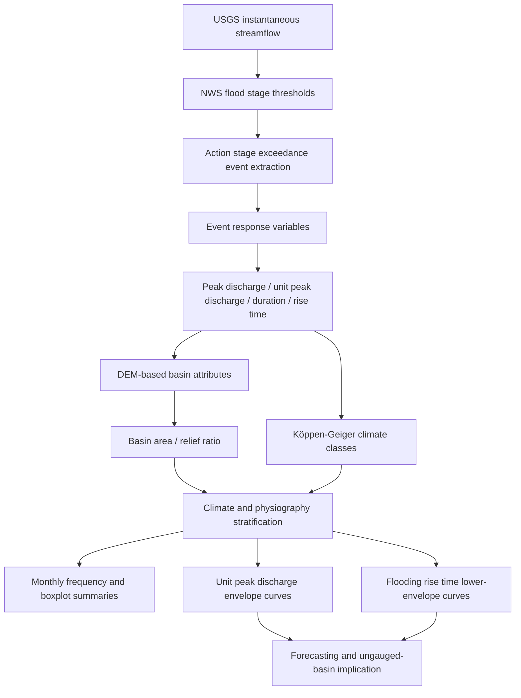
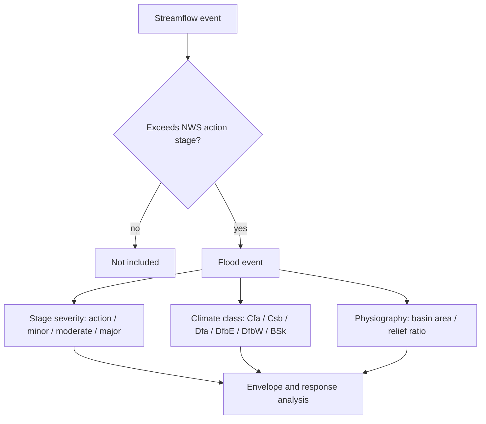
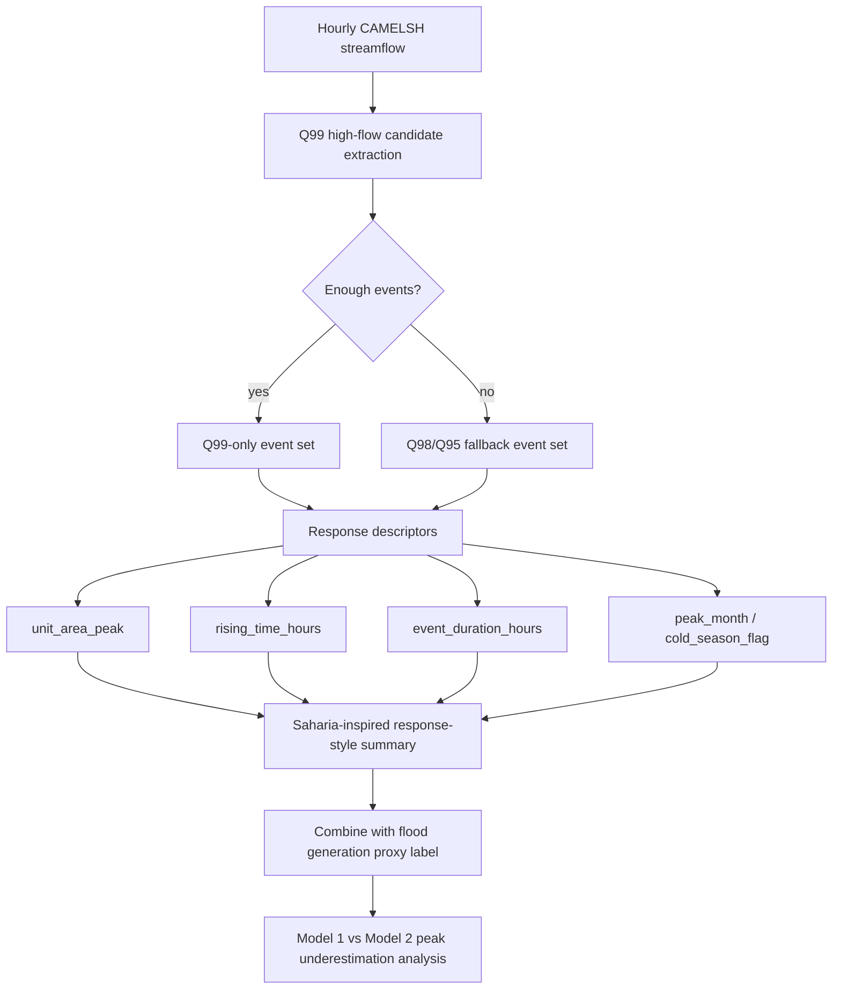

# Saharia et al. (2017) Journal of Hydrology 논문 해설

대상 논문은 Manabendra Saharia, Pierre-Emmanuel Kirstetter, Humberto Vergara, Jonathan J. Gourley, Yang Hong의 “Characterization of floods in the United States”이다. 원문 PDF는 [`1-s2.0-S0022169417301476-main.pdf`](1-s2.0-S0022169417301476-main.pdf)에 있다.

이 문서는 Jiang et al. (2022) 해설과 같은 형식으로, 논문 흐름, 분류 또는 stratification 기법, 분석 및 통계기법, 결론, CAMELSH q99/high-discharge 적용 가능성을 정리한다. 핵심은 이 논문이 flood generation mechanism을 event별로 분류한 논문이 아니라, `NWS flood stage threshold로 정의한 실제 flood event archive`를 이용해 미국 홍수의 magnitude, seasonality, rise time을 climate class와 physiography별로 특성화한 논문이라는 점이다.

## 1. 논문은 어떤 내용으로 흘러가는가

이 논문은 미국 전역의 flood를 일관되게 특성화할 수 있는 데이터 기반이 부족했다는 문제에서 출발한다. 기존 연구들은 case study 중심이거나 일부 지역에 한정되어 있었고, flood peak, flood duration, rise time 같은 flood response 변수와 basin geomorphology, climatology를 함께 연결한 대규모 archive가 충분하지 않았다고 본다.

저자들은 Unified Flash Flood Database 중 USGS streamflow archive를 사용한다. 여기서 중요한 점은 flood를 annual maxima나 recurrence interval로 정의하지 않고, NWS와 local stakeholders가 gauge별로 정한 `action stage` 초과로 정의한다는 것이다. 최종 분석 표본은 `1936-2013`년의 `78년` 기록에서 나온 `70,273개 flooding events`, `1642개 gauges`다. 사건은 streamflow가 action stage를 넘은 시점부터 threshold 아래로 내려간 시점까지로 정의되고, 그 안에서 peakflow, peak time, flood duration, rise time 등을 계산한다.

그다음 이 event archive를 Köppen-Geiger climate class, annual precipitation, basin area, relief ratio 같은 배경 변수와 결합한다. 분석 순서는 대체로 아래처럼 진행된다.



논문은 먼저 flood event의 spatial and temporal distribution을 보여준다. 6개 climate class, 즉 `Cfa`, `Csb`, `Dfa`, `Dfb(E)`, `Dfb(W)`, `BSk`로 station과 event를 나누고, class별 event count, gauges count, events/gauge, 월별 seasonality를 비교한다. `Cfa`는 39,872개 event로 가장 많고, `Dfb(W)`는 905개로 가장 적다. 월별로는 West Coast의 `Csb`가 cool season에, desert Southwest의 `BSk`가 warm-season monsoon 시기에, Southeast의 `Cfa`가 early spring에 더 강한 flood seasonality를 보인다.

그다음 geomorphology와 flood response를 연결한다. Basin area와 relief ratio를 계산하고, 서부 산악 지역이 동부보다 relief ratio가 높으며 flood response가 더 빠를 수 있다고 해석한다. 이후 unit peak discharge와 basin area의 관계를 `Q_u = aA^b` power-law envelope curve로 정리한다. Flood stage별 action/minor/moderate/major curve와 climate class별 curve를 따로 만들고, CONUS major-stage envelope의 exponent `b = -0.440`이 유럽 extreme flood envelope `Q_u = 97.0A^-0.4`와 가깝다고 설명한다.

마지막으로 flooding rise time을 분석한다. 논문에서 rise time은 rainfall centroid부터 peak까지의 lag time이 아니라, `action stage를 처음 넘은 시점부터 peakflow까지의 시간`이다. 모든 event에서 평균 rise time은 `20.6 h`, 중앙값은 `10 h`였다. Desert Southwest의 `BSk`는 intense monsoon thunderstorm과 steep terrain 때문에 빠르게 반응하고, 인접한 `Dfb(W)`는 snowmelt 영향으로 상대적으로 느린 response가 나타난다고 해석한다.

전체적으로 이 논문은 “미국 flood의 발생과 응답 특성은 기후대, storm type, basin size, topographic relief의 결합으로 달라진다”는 그림을 만든다. 단일 event의 생성 원인을 분류하기보다, 대규모 operational flood archive를 기반으로 regional scaling behavior와 response style을 정리하는 흐름이다.

## 2. 여기서 사용한 분류 기법은 무엇인가

이 논문에는 Jiang et al. (2022)처럼 ML classifier, clustering, event-level flood mechanism label이 없다. 대신 여러 층의 `stratification`을 사용한다. 즉 “분류 기법”이라기보다 “어떤 기준으로 event와 basin을 나눠 비교했는가”가 핵심이다.

첫 번째 기준은 `NWS flood stage`다. NWS는 gauge별로 `action`, `minor`, `moderate`, `major` stage를 정의한다. 이 논문에서 flood event의 1차 정의는 action stage 초과다. Action stage는 NWS나 관련 기관이 유의미한 hydrologic activity에 대비해 어떤 mitigation action을 시작해야 하는 수위로 설명되며, 일부 gauge에서는 bank-full condition과 유사한 기준으로 취급된다.

Flood stage는 두 역할을 한다. 하나는 event extraction threshold다. Streamflow가 action stage를 넘으면 flood event가 시작되고, 다시 threshold 아래로 내려가면 event가 끝난다. 다른 하나는 severity stratification이다. Unit peak discharge envelope curve를 action, minor, moderate, major stage별로 따로 만들어, severity가 커질수록 basin area와 peak intensity의 upper envelope가 어떻게 달라지는지 본다.

두 번째 기준은 `Köppen-Geiger climate class`다. 논문은 CONUS의 event와 gauge를 여섯 climate class로 나눈다.

| Climate class | 논문 내 해석 |
| --- | --- |
| `Cfa` | warm temperate fully humid extremely continental, Southeast 포함, event 수가 가장 큼 |
| `Csb` | warm temperate summer dry warm summer, West Coast, cool-season flood가 두드러짐 |
| `Dfa` | snow fully humid hot summer |
| `Dfb(E)` | snow fully humid warm summer east, Great Lakes/New England 쪽 |
| `Dfb(W)` | snow fully humid warm summer west, Rocky Mountain / Intermountain West 쪽 |
| `BSk` | arid steppe cold arid, desert Southwest, monsoon thunderstorm 영향 |

세 번째 기준은 `physiographic grouping`이다. 여기에는 basin area와 relief ratio가 들어간다. Relief ratio는 basin total relief를 main drainage line 방향의 basin length로 나눈 dimensionless topographic steepness proxy다. 논문은 이 값을 이용해 서부 산악 유역과 동부 완경사 유역의 response 차이를 해석한다. 다만 이 논문은 k-means 같은 formal physiographic clustering을 수행하지 않는다. Climate class와 geomorphic descriptor를 축으로 분포와 scaling 관계를 비교하는 방식이다.

네 번째는 `Csb1 / Csb2` sub-group이다. West Coast의 `Csb` 안에서 basin area 분포와 envelope behavior가 불연속적으로 보여서, 저자들은 약 `250 km2` 기준을 언급하며 `Csb1`과 `Csb2`로 나누어 추가 해석한다. 이건 공식 climate class가 아니라 결과 해석을 위한 ad hoc sub-grouping이다.

따라서 이 논문의 classification 구조는 아래처럼 요약된다.



여기서 조심할 점은, 이 논문이 `recent precipitation`, `antecedent precipitation`, `snowmelt` 같은 flood generation mechanism label을 event별로 붙이지 않는다는 것이다. Snowmelt, monsoon thunderstorm, tropical storm, orographic precipitation 같은 표현은 결과 해석에서 등장하지만, 사건별 causative class로 formal하게 부여된 것은 아니다.

## 3. 분석 및 통계기법은 무엇이고, 그 상세는 무엇인가

이 논문의 방법론은 inferential statistics보다는 descriptive hydrology와 empirical scaling analysis에 가깝다. 유의성 검정이나 causal model보다, 대규모 event archive를 정리하고 climate/physiography strata별로 분포와 envelope를 비교한다. 따라서 “통계기법”의 핵심은 p-value 기반 검정보다 `event definition`, `normalization`, `area scaling`, `envelope curve`, `conditional quantile`, `response-time lower bound`에 있다.

전체 분석 구조를 입력과 산출물 기준으로 쓰면 아래와 같다.

| 단계 | 입력 | 계산 | 산출물 | 논문에서의 역할 |
| --- | --- | --- | --- | --- |
| Event extraction | USGS instantaneous streamflow, NWS action stage | threshold exceedance 구간 탐지 | 70,273 flood events | operational flood archive 생성 |
| Stage severity stratification | action/minor/moderate/major stage | peakflow가 넘는 stage 수준 구분 | stage별 event subset | severity별 envelope 비교 |
| Climate stratification | gauge 위치, Köppen-Geiger map | climate class overlay | `Cfa/Csb/Dfa/Dfb(E)/Dfb(W)/BSk` label | regional flood regime 비교 |
| Geomorphic attributes | DEM, basin delineation | area, relief ratio 계산 | basin physiography table | response 차이 해석 |
| Frequency summaries | event count, gauge count, event month | count normalization | events/gauge, monthly relative frequency | sampling 차이를 줄인 분포 비교 |
| Flood magnitude scaling | peak discharge, basin area | unit peak discharge, log-log envelope | `Q_u = aA^b` | 면적별 flood intensity upper bound |
| Rise-time scaling | event start, peak time, basin area | rise time, lower envelope | `T_r = aA^b` | 빠른 response의 하한선 |
| Quantile summaries | basin area, unit peak discharge | conditional quantiles | 10/25/50/75/90% bands | uncertainty band와 ungauged-basin 활용 |

### 3.1 Event extraction과 response variable 계산

입력은 USGS instantaneous streamflow, gauge별 NWS action stage threshold, 그리고 gauge metadata다. USGS instantaneous streamflow는 5-60분 간격으로 수집된 관측 유량이고, NWS stage threshold는 gauge별로 action, minor, moderate, major flood stage를 제공한다. 논문은 10,106개 USGS gauges 중 NWS flood stage가 정의된 3490개 gauge를 우선 대상으로 삼고, regulation/diversion 영향이 있는 gauge를 quality code로 제거한 뒤, 최종적으로 1642개 gauge의 70,273개 event를 분석한다.

Event extraction은 threshold exceedance 방식이다. Streamflow가 action stage를 처음 넘는 시점을 event start로, threshold 아래로 내려가는 시점을 event end로 둔다. Event 안에서 최대 유량이 peak discharge이고, 그 시점이 peak time이다. 따라서 이 논문의 event는 “연중 최고 유량”이나 “상위 몇 % 유량”이 아니라, gauge별 operational flood threshold를 넘은 구간이다.

논문에서 event table에 들어가는 핵심 response variable은 다음과 같다.

| 변수 | 정의 | 역할 |
| --- | --- | --- |
| `peak_discharge` | event 중 최대 유량 | flood magnitude |
| `flood_duration` | action stage 초과 구간의 길이 | event persistence |
| `flooding_rise_time` | action stage 최초 초과 시점부터 peak time까지 | response speed proxy |
| `recession_time` | peak 이후 threshold 아래로 돌아가기까지의 시간 | recession behavior |
| `unit_peak_discharge` | peak discharge / basin area | basin-size normalized intensity |

이 중 논문이 가장 강하게 밀고 가는 변수는 `unit_peak_discharge`와 `flooding_rise_time`이다. Unit peak discharge는 basin size가 다른 event를 비교하기 위한 면적 정규화 첨두 유량이다. Flooding rise time은 rainfall centroid 기반 lag time이 아니라, action stage 초과 시점부터 peak까지의 시간이다. 모든 historical event에 gridded rainfall이 있는 것은 아니므로, 논문은 discharge record만으로 계산 가능한 response-speed proxy로 rise time을 사용한다.

이 정의의 장점은 운영적으로 일관된 event table을 만들 수 있다는 점이다. 단점은 threshold에 매우 민감하다는 점이다. Action stage가 낮게 잡힌 gauge에서는 event start가 더 이르게 잡혀 rise time이 길어질 수 있고, action stage가 높게 잡힌 gauge에서는 rise time이 짧아질 수 있다. 따라서 rise time은 catchment의 절대 lag time이라기보다 “해당 operational flood threshold를 넘은 뒤 peak까지 걸린 시간”으로 읽어야 한다.

### 3.2 Climate class별 event count와 gauge-normalized frequency

Climate class마다 gauge 수가 다르므로 raw event count만 비교하면 bias가 생긴다. 그래서 논문은 Table 1에서 `flooding events / gauges`를 함께 계산한다.

| Climate class | Events | Gauges | Events/Gauges |
| --- | ---: | ---: | ---: |
| `Csb` | 1,688 | 78 | 21.64 |
| `BSk` | 1,129 | 110 | 10.26 |
| `Dfb(W)` | 905 | 84 | 10.77 |
| `Dfb(E)` | 9,901 | 230 | 43.05 |
| `Dfa` | 16,778 | 313 | 53.60 |
| `Cfa` | 39,872 | 827 | 48.21 |

이 표는 동부 미국의 `Dfb(E)`, `Dfa`, `Cfa`가 서부의 `Csb`, `BSk`, `Dfb(W)`보다 gauge당 event 수가 많다는 해석으로 이어진다. 여기서 events/gauge는 단순한 exposure normalization이다. Climate class마다 gauge 수가 다르기 때문에, event count를 gauge count로 나누어 “station 하나당 평균 event 수”처럼 비교하는 것이다.

다만 events/gauge는 완전한 flood frequency estimator는 아니다. Gauge별 record length가 모두 같지 않고, action stage threshold의 local definition도 gauge마다 다르며, 전체 dataset의 시간 분포도 균일하지 않다. 따라서 이 값은 class 간 event abundance를 비교하기 위한 descriptive normalization이지, 엄밀한 occurrence rate model은 아니다.

### 3.3 Monthly frequency normalization

Flood seasonality는 월별 event count를 climate class별 총 event 수로 나누어 비교한다. 즉 각 class 안에서 월별 상대빈도를 계산한다. 이렇게 해야 `Cfa`처럼 event 수가 매우 많은 class와 `Dfb(W)`처럼 event 수가 적은 class를 같은 축에서 비교할 수 있다.

계산은 아래처럼 볼 수 있다.

```text
monthly_share(class, month) =
  event_count(class, month) / total_event_count(class)
```

출력은 climate class별 12개월 상대빈도 분포다. 이 분석에서 West Coast `Csb`는 November-March cool season에 flood가 집중되고, `BSk`는 June-September late summer monsoon season에 flood가 많으며, `Dfb(W)`는 April-July warm-season onset에, `Cfa`는 early spring 쪽에 상대적으로 높은 빈도를 보인다.

이 방법은 seasonality 비교에는 좋지만, event 발생률의 시간 trend를 말해주지는 않는다. 각 class 내부에서 월별 비율을 보는 것이므로, 특정 class의 전체 flood 수가 많거나 적은 문제는 제거되지만, gauge density나 record length의 차이는 여전히 남아 있다.

### 3.4 Major/action stage ratio trend check

논문은 전체 dataset이 78년을 포함하지만, event의 92.9%가 마지막 20년에 몰려 있고 gauge 수가 시간에 따라 바뀐다고 지적한다. 그래서 장기 trend를 raw count로 강하게 해석하지 않는다.

대신 최근 30년에 대해 연도별 `major stage floods / action stage floods` 비율을 계산해 extreme severity 비중을 본다.

```text
major_action_ratio(year) =
  count(events exceeding major stage in year) /
  count(events exceeding action stage in year)
```

이 비율은 “그 해 action-stage flood 중 major-stage flood가 차지하는 비중”이다. Gauge 수나 reporting intensity가 시간에 따라 늘어나는 상황에서 raw major flood count만 보면 관측망 증가 효과와 실제 severity 증가가 섞일 수 있다. 분모에 action-stage event 수를 넣으면 적어도 같은 연도의 전체 detected flood volume에 대한 상대 severity를 볼 수 있다.

CONUS 전체에서는 명확한 trend가 없고, `Dfb(E)`에서는 증가 경향이 시사된다고 설명한다. 다만 이 분석은 formal trend test가 아니라 descriptive check에 가깝다. Mann-Kendall test나 regression slope의 p-value를 제시하지 않으므로, “증가를 통계적으로 검정했다”가 아니라 “증가 경향이 보인다” 정도로 읽어야 한다.

### 3.5 Box-and-whisker plots

논문은 annual precipitation, relief ratio, unit peak discharge, basin area를 climate class별 boxplot으로 비교한다. Box 내부 선은 median, box 하단과 상단은 25th와 75th percentile, open circle은 mean, whisker는 extreme observations, 1.5 IQR 밖의 점은 outlier로 표현한다.

Boxplot은 class별 평균 차이뿐 아니라 dispersion과 skewness를 한 번에 보는 목적이다. 예를 들어 `Csb`는 annual precipitation이 높고, unit peak discharge median도 높으며, basin area가 상대적으로 작다는 식의 해석이 가능하다.

통계적으로는 distribution comparison의 시각화 도구다. 논문은 boxplot을 통해 class별 차이를 설명하지만, ANOVA, Kruskal-Wallis, pairwise test 같은 formal group difference test는 수행하지 않는다. 따라서 “분포가 다르게 보인다”는 descriptive conclusion은 가능하지만, “통계적으로 유의한 차이가 검정되었다”는 표현은 피해야 한다.

### 3.6 Relief ratio

Relief ratio는 다음 개념이다.

```text
relief_ratio = basin_total_relief / longest_basin_dimension_parallel_to_main_drainage_line
```

이 값은 basin steepness와 빠른 runoff concentration 가능성을 나타내는 geomorphic proxy다. 논문은 CONUS relief ratio가 `0.0002-0.17` 범위이고 평균은 `0.008`이라고 보고한다. West Coast `Csb`, Rocky Mountains `Dfb(W)`, Intermountain West `BSk`가 동부 `Dfa`, `Dfb(E)`, `Cfa`보다 relief ratio가 높다.

Relief ratio는 basin area와 독립적인 값이 아니다. 논문은 relief ratio와 basin area의 scatter plot을 같이 보여주며, 일반적으로 basin area가 커질수록 relief ratio가 작아지는 경향을 확인한다. 이 배경이 중요한 이유는 unit peak discharge나 rise time을 area와만 연결하면, 산악 소유역의 relief 효과가 area 효과처럼 보일 수 있기 때문이다. 그래서 논문은 area scaling을 보되, mountainous region에서는 relief가 response에 더 큰 영향을 줄 수 있다고 해석한다.

### 3.7 Unit peak discharge와 power-law envelope curve

논문의 핵심 경험식은 unit peak discharge와 basin area의 관계다.

```text
Q_u = a A^b
```

여기서 `Q_u`는 unit peak discharge, `A`는 contributing basin area, `a`는 reduced discharge, `b`는 scaling coefficient다. Log-log 공간에서 `log(Q_u)`와 `log(A)` 사이 회귀선을 적합하고, 그 선을 위로 이동시켜 upper envelope를 정의한다. 논문은 이 envelope를 flood stage별, climate class별로 만든다.

계산 절차를 구현 관점에서 쓰면 다음과 같다.

1. 각 event에 대해 `Q_u = Q_peak / A`를 계산한다. 여기서 `Q_peak`는 `m3/s`, `A`는 `km2`이고, `Q_u` 단위는 `m3 s-1 km-2`다.
2. `A`와 `Q_u`를 log-transform한다.
3. `log(Q_u) = log(a) + b log(A)` 형태의 선형 회귀를 적합한다.
4. 적합선을 위로 이동시켜 관측 event들의 upper envelope가 되도록 한다.
5. 이동된 선을 다시 원래 scale로 바꾸면 `Q_u = aA^b` 형태가 된다.

여기서 `b`는 scaling exponent다. `b`가 더 음수이면 basin area가 커질수록 unit peak discharge가 더 빠르게 감소한다. 이는 rainfall forcing의 spatial extent, storm duration, land surface storage, aridity, evaporation 등이 커지는 basin scale에서 flood intensity를 얼마나 희석하는지를 반영한다.

다만 논문은 “regression line을 shift해 upper envelope를 만들었다”고 설명하지만, shift의 exact rule은 자세히 쓰지 않는다. 예를 들어 모든 점을 완전히 감싸는지, 최상위 몇 percent를 기준으로 하는지, outlier를 어떻게 처리하는지는 명시적이지 않다. 따라서 재현 연구에서는 upper envelope 기준을 별도로 문서화해야 한다. 예를 들면 `99.5th percentile residual을 통과하도록 shift`처럼 정하는 것이 방어 가능하다.

CONUS-wide flood stage별 coefficient는 다음과 같다.

| Flood stage | a | b |
| --- | ---: | ---: |
| Action | 59.322 | -0.460 |
| Minor | 116.749 | -0.503 |
| Moderate | 87.813 | -0.512 |
| Major | 91.267 | -0.440 |

Major-stage `b = -0.440`은 유럽 extreme flood envelope `Q_u = 97.0A^-0.4`와 가깝다. 논문은 이를 통해 CONUS의 큰 flood envelope가 유럽 연구와도 정합적이며, 더 넓게는 unit peak discharge의 upper limit가 존재할 수 있다는 해석을 제시한다.

Climate class별로 보면 `BSk`는 `b = -0.501`로 basin area가 커질수록 unit peak discharge가 빠르게 감소하고, `Csb`는 `b = -0.081`로 감소가 완만하다. 논문은 이를 rainfall forcing의 spatial scale, atmospheric humidity, dry land surface condition, evaporation과 연결해서 설명한다. 건조한 `BSk`에서는 small basin에서 convective storm이 매우 큰 unit peak discharge를 만들 수 있지만, basin area가 커지면 storm footprint가 전체 basin을 덮지 못하고 dry surface/evaporation 효과가 커져 unit peak discharge가 급격히 줄어든다. 반대로 West Coast `Csb`에서는 synoptic-scale orographic precipitation이 더 넓은 area에 작용하므로 area 증가에 따른 감소가 완만하다고 해석한다.

이 envelope curve는 prediction model이라기보다 historical upper-bound summary다. 특정 basin에서 다음 flood peak를 예측하는 식이 아니라, “이 basin area와 climate class에서 역사적으로 관측된 high-end unit peak discharge가 어느 정도였는가”를 알려주는 경험적 benchmark로 읽어야 한다.

### 3.8 Quantile plots

Envelope curve는 upper bound를 보여주지만, 일반적인 event 분포와 불확실성은 잘 보여주지 않는다. 그래서 논문은 basin area 조건부 unit peak discharge의 `10th`, `25th`, `50th`, `75th`, `90th` percentile을 그린다.

이 quantile plot은 ungauged basin에서 basin area와 climate class만 알고 있을 때 기대 가능한 unit peak discharge 범위 또는 uncertainty band를 제공할 수 있다는 주장으로 이어진다. Median은 first-order relationship을, 25-75 percentile은 interquartile uncertainty를, 10-90 percentile은 더 넓은 event variability를 보여준다.

구현하려면 보통 아래 절차가 필요하다.

1. Basin area를 log-scale bin으로 나눈다.
2. 각 bin 안의 event `Q_u` 값을 모은다.
3. bin별 `10/25/50/75/90` percentile을 계산한다.
4. bin center와 quantile 값을 연결해 conditional quantile curve를 그린다.

다만 원문은 area binning이나 smoothing rule을 자세히 설명하지 않는다. 따라서 재현하려면 bin 개수, bin 폭, minimum samples per bin, smoothing 여부를 별도로 명시해야 한다. Quantile plot은 envelope보다 robust하지만, binning choice에 민감할 수 있다.

### 3.9 Flooding rise time과 lower-envelope curve

Flooding rise time도 basin area와 power-law 관계로 분석한다.

```text
T_r = a A^b
```

여기서 `T_r`은 action stage 최초 초과부터 peak까지의 시간이다. Unit peak discharge에서는 upper envelope를 봤지만, rise time에서는 fastest possible response를 보려는 목적이므로 lower envelope를 본다.

계산 절차는 unit peak discharge envelope와 비슷하지만 방향이 반대다.

1. 각 event에 대해 `T_r = t_peak - t_start`를 시간 단위로 계산한다.
2. `A`와 `T_r`을 log-transform한다.
3. `log(T_r) = log(a) + b log(A)` 형태의 회귀를 적합한다.
4. 적합선을 아래로 이동시켜 관측 rise time의 lower envelope가 되도록 한다.
5. 원래 scale로 되돌려 `T_r = aA^b`를 얻는다.

여기서 `b`가 클수록 basin area가 커질 때 fastest response time이 더 빠르게 길어진다는 뜻이다. 작은 basin은 짧은 시간 안에 action stage에서 peak로 올라갈 수 있지만, 큰 basin은 water travel time과 spatially distributed storage 때문에 peak까지 걸리는 최소 시간이 길어진다.

CONUS 전체의 rise-time exponent는 Table 3 기준 `b = 0.434`다. Climate class별로는 `BSk`가 intense convective monsoon storms와 steep terrain 때문에 주어진 basin area에서 더 빠르게 반응하고, `Dfb(W)`는 높은 고도와 snowmelt 영향으로 더 느린 response가 나타난다고 해석한다.

이 분석의 forecasting 의미는 분명하다. 특정 basin area에서 flood가 얼마나 빠르게 peak에 도달할 수 있는지 하한선을 알면, warning lead time과 flash-flood risk management에 도움이 된다.

하지만 rise time은 action stage threshold에 의해 정의되므로, rainfall-runoff lag time과 동일하지 않다. 같은 hydrograph라도 threshold가 낮으면 start가 빨라져 rise time이 길어지고, threshold가 높으면 start가 peak에 가까워져 rise time이 짧아진다. 따라서 rise-time lower envelope는 “강수에서 유출까지의 물리적 lag time”이 아니라 “operational flood threshold를 넘은 뒤 peak까지의 최소 시간”이다.

### 3.10 이 논문에서 쓰지 않은 통계기법도 중요하다

이 논문은 대규모 자료를 쓰지만, formal inferential framework는 제한적이다. 예를 들어 class별 boxplot 차이에 대해 hypothesis test를 하지 않고, major/action ratio에 대해 Mann-Kendall trend test도 하지 않는다. Power-law envelope curve도 confidence interval을 제공하지 않는다. Quantile plot은 uncertainty band처럼 보이지만, quantile regression의 추정 불확실성을 계산한 것은 아니다.

이 점은 논문의 약점이라기보다 목적의 차이에 가깝다. 이 논문은 “어떤 변수가 유의한가”를 검정하는 논문이 아니라, operational flood archive를 가지고 CONUS flood response의 empirical benchmark를 만드는 논문이다. 따라서 결과 해석은 “통계적으로 검정된 causal effect”보다 “대규모 관측자료에서 일관되게 보이는 descriptive pattern”으로 읽어야 한다.

### 3.11 이 논문이 flood generation typing 논문과 다른 점

이 논문은 event-level causative mechanism classification이 아니다. `snowmelt`, `monsoon thunderstorm`, `orographic precipitation`, `tropical storm` 같은 설명은 있지만, event마다 label을 붙여서 분류하지 않는다.

차이는 아래처럼 정리된다.

| 항목 | Saharia et al. (2017) | Jiang et al. (2022) 같은 mechanism typing |
| --- | --- | --- |
| Event definition | NWS action stage exceedance | annual maximum discharge 또는 high-flow event |
| 주된 입력 | discharge, flood stage threshold, basin area, DEM, climate class | meteorological drivers, discharge, attribution 또는 process indicators |
| 분류 단위 | stage, climate class, physiographic strata | event-level flood-generating mechanism |
| 방법 | descriptive statistics, envelope curve, quantile plot | rule-based typology, ML attribution, clustering 등 |
| 산출물 | regional flood response scaling | event mechanism label과 basin-level composition |
| 강점 | operational flood archive와 response benchmark | causative process 해석 |
| 한계 | event별 원인 label 없음 | threshold/indicator/attribution 해석 불확실성 |

따라서 이 논문은 flood generation typing의 직접 방법론이라기보다, high-flow event response를 어떻게 정의하고 요약할지에 대한 중요한 참고문헌이다.

## 4. 결론은 무엇인가

논문의 결론은 네 가지로 요약할 수 있다.

첫째, 미국에서 가장 큰 unit peak discharge는 extraordinary precipitation을 경험하는 West Coast `Csb`와 southeastern U.S. `Cfa`에서 나타난다. Unit peak discharge와 basin area의 관계는 causative rainfall의 spatial scale, atmospheric humidity, basin aridity, land surface condition에 의해 달라진다.

둘째, flood seasonality는 climate class마다 크게 다르다. West Coast는 cool season, Intermountain West와 desert Southwest는 더 따뜻한 계절, Southeast는 early spring에 flood가 더 두드러진다. 논문은 미국 flood seasonality가 유럽보다 훨씬 다양하며, 이 차이는 storm type의 다양성에서 온다고 본다.

셋째, unit peak discharge와 flooding rise time은 모든 climate class에서 basin area와 관련된다. 다만 산악 지역, 특히 Rocky Mountains 같은 곳에서는 basin area보다 relief가 response에 더 큰 영향을 줄 수 있다.

넷째, unit peak discharge envelope curve는 유럽 및 전세계 extreme flood 연구와 정합적인 관계를 보인다. CONUS major-stage flood의 `b = -0.440`은 유럽 extreme flood의 `-0.4`와 가깝다. 이는 flood intensity의 scale-dependent upper bound를 경험적으로 보여주는 결과다.

마지막으로 rise time 측면에서는 desert Southwest `BSk`가 가장 빠르게 반응한다. 이는 intense monsoon thunderstorms와 steep terrain이 결합되기 때문이다. 반대로 가까운 `Dfb(W)` 지역은 snowmelt 영향 때문에 더 느린 response가 나타나는 것으로 해석된다.

이 논문의 기여는 “미국 flood 특성화” 자체뿐 아니라, operational flood threshold와 USGS observations를 결합해 large-event flood response benchmark를 만들었다는 데 있다. 저자들은 이 framework가 FLASH 같은 distributed hydrologic model 평가와 ungauged basin flood prediction에 활용될 수 있다고 본다.

다만 결론을 읽을 때는 주의가 필요하다. 이 논문은 개별 event의 causative mechanism을 확정하지 않는다. 예를 들어 `BSk`의 빠른 rise time을 monsoon thunderstorm과 연결하고 `Dfb(W)`의 느린 response를 snowmelt와 연결하지만, 이것은 climate/seasonality/physiography에 근거한 regional interpretation이지 event-level causal classification은 아니다.

## 5. 우리 유역의 high discharge, q99 분류에 사용할 수 있는가

결론부터 말하면, 부분적으로 사용할 수 있다. 다만 q99 event를 official flood로 정당화하는 근거로 쓰면 안 되고, `high-discharge response descriptor`와 `basin screening / model-error interpretation`을 강화하는 근거로 쓰는 것이 맞다.

우리 CAMELSH workflow와 이 논문의 가장 큰 차이는 event threshold다. Saharia et al.의 flood는 NWS가 gauge별로 정의한 action stage를 초과한 event다. 반면 우리 q99 event는 basin 내부 hourly discharge distribution의 상위 1%를 넘는 observed high-flow candidate다. 따라서 `Q99 exceedance = NWS flood stage exceedance`라고 말하면 안 된다. 우리 문서의 기존 표현처럼 `observed high-flow event candidate`라고 유지해야 한다.

그래도 가져올 수 있는 요소는 뚜렷하다.

첫째, `unit_area_peak`를 high-flow severity의 핵심 지표로 쓰는 근거가 된다. Saharia et al.은 basin area가 다른 flood event를 비교하기 위해 unit peak discharge를 중심 변수로 둔다. 우리도 DRBC holdout basin이나 CAMELSH event를 비교할 때 raw peak discharge보다 unit-area peak를 같이 보는 것이 더 방어 가능하다.

둘째, `rising_time_hours`를 response speed 또는 flashiness 해석 축으로 쓰는 근거가 된다. Saharia의 rise time은 action stage 기준이지만, 우리 event table에서도 threshold 초과 event start와 peak time을 기준으로 rising time을 계산할 수 있다. 다만 Q99/Q98/Q95 fallback threshold에 따라 rise time 값이 달라질 수 있으므로 `selected_threshold_quantile`과 함께 해석해야 한다.

셋째, seasonality를 high-flow event interpretation에 포함하는 근거가 된다. 논문은 climate class별 flood seasonality가 flood response 해석에 중요하다는 점을 보여준다. 우리도 `peak_month`, `cold_season_flag`, snowmelt proxy, rain-on-snow proxy를 함께 보아야 한다.

넷째, physiography를 mechanism label이 아니라 response-style 설명 변수로 쓰는 근거가 된다. Basin area, slope, relief, snow fraction, aridity 같은 static attributes는 event cause를 직접 확정하지는 않지만, 특정 basin이 빠른 response 또는 큰 unit-area peak를 보이는 이유를 설명하는 데 도움이 된다.

현재 프로젝트에 맞춘 adapted workflow는 아래처럼 정리할 수 있다.



우리 연구에서 방어 가능한 표현은 다음에 가깝다.

```text
Following large-sample flood characterization studies, we summarize observed high-flow candidates using area-normalized peak magnitude, rise time, duration, and seasonality. Because our thresholds are distribution-based rather than official flood-stage thresholds, these events are interpreted as high-flow candidates rather than confirmed flood-stage exceedances.
```

즉 Saharia et al.은 우리 q99 typing에서 `flood generation label`을 만드는 직접 근거라기보다, `response severity`, `response speed`, `seasonality`, `basin-scale normalization`을 어떻게 써야 하는지에 대한 근거다.

구체적으로는 다음처럼 쓰는 것이 좋다.

| CAMELSH 변수 | Saharia에서의 대응 | 우리 해석 |
| --- | --- | --- |
| `unit_area_peak` | unit peak discharge | basin size를 보정한 high-flow severity |
| `rising_time_hours` | flooding rise time | threshold-dependent response speed proxy |
| `event_duration_hours` | flood duration | event persistence |
| `selected_threshold_quantile` | action stage 기준과의 차이를 표시하는 우리 metadata | Q99/Q98/Q95 event 강도 차이 control |
| `q99_event_frequency` | events/gauge normalization과 유사한 빈도 비교 | basin별 high-flow candidate frequency |
| `peak_month`, `cold_season_flag` | monthly frequency / seasonality | snow-related 또는 season-specific response 해석 |
| `area`, `slope`, `relief proxy` | basin area / relief ratio | response style 설명 변수 |

조심해야 할 표현도 분명하다. `우리 q99 event가 NWS action stage flood에 해당한다`, `Saharia와 같은 flood classification을 재현했다`, `rise time과 unit-area peak만으로 causative mechanism을 판정했다`, `snowmelt event를 response metric만으로 확인했다` 같은 문장은 피해야 한다.

반대로 안전한 결론은 이렇다. Saharia et al. (2017)은 CAMELSH q99/high-flow candidate 분석에서 event response descriptor를 해석하는 데 유용하다. 특히 `unit_area_peak`, `rising_time_hours`, `event_duration_hours`, seasonality를 basin screening과 Model 1/Model 2 error stratification의 보조 축으로 쓰는 근거가 된다. 다만 flood generation mechanism typing은 Jiang et al. (2022)나 Stein/Tarasova 계열 문헌을 따라 별도로 두고, Saharia 계열 지표는 `severity/response-style stratification`으로 분리하는 것이 가장 방어 가능하다.

## 짧은 요약

Saharia et al. (2017)은 미국 전역의 NWS action-stage flood event 70,273개와 USGS gauge 1642개를 이용해 flood magnitude, seasonality, rise time을 climate class와 basin physiography별로 특성화한 논문이다. 핵심 기법은 classifier가 아니라 NWS flood stage 기반 event definition, Köppen-Geiger climate class stratification, unit peak discharge와 flooding rise time의 power-law envelope curve 분석이다.

우리 CAMELSH q99/high-discharge 연구에는 event definition을 그대로 가져오기보다 response descriptor 해석 근거로 쓰는 것이 맞다. `unit_area_peak`, `rising_time_hours`, `event_duration_hours`, seasonality를 model underestimation 분석의 보조 stratification으로 쓰되, q99 event는 official flood가 아니라 `observed high-flow event candidate`라고 표현해야 한다.
