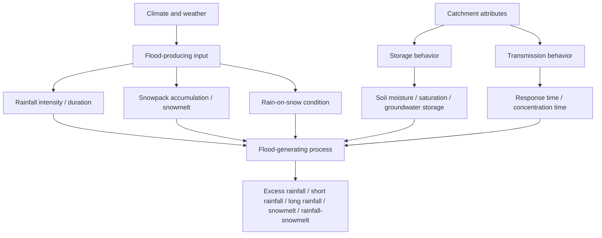
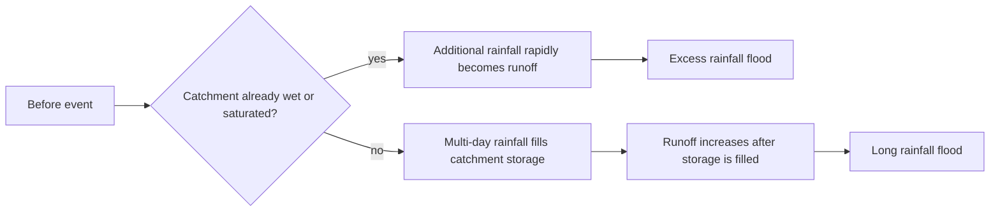
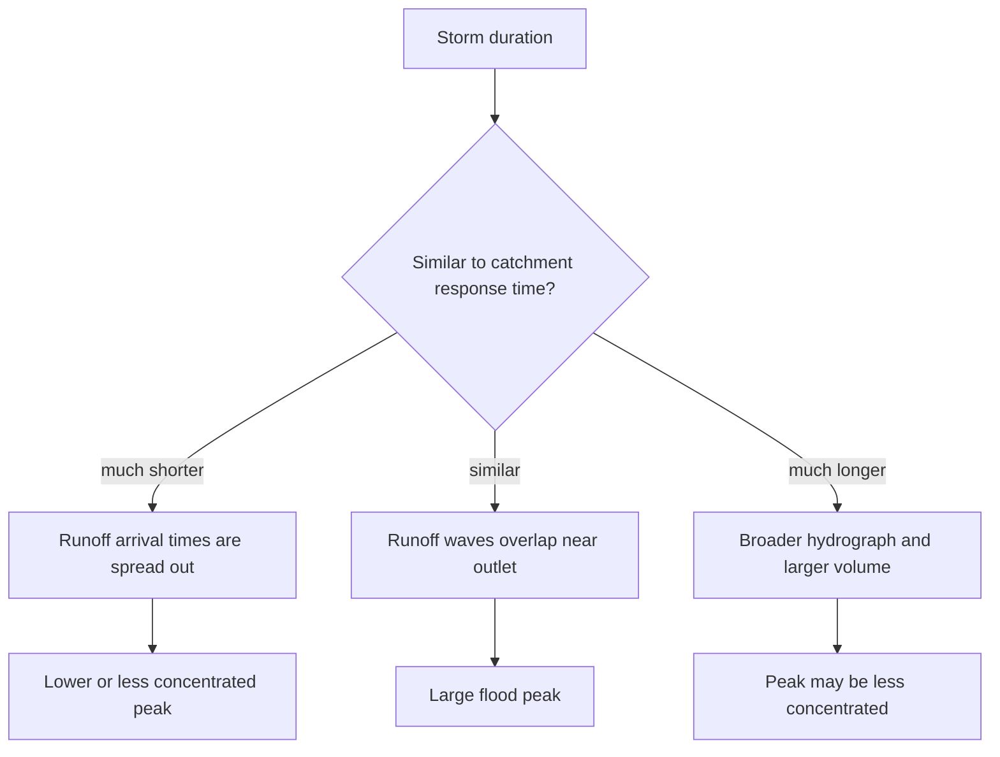
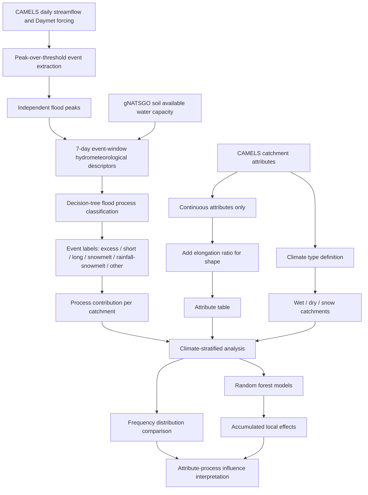
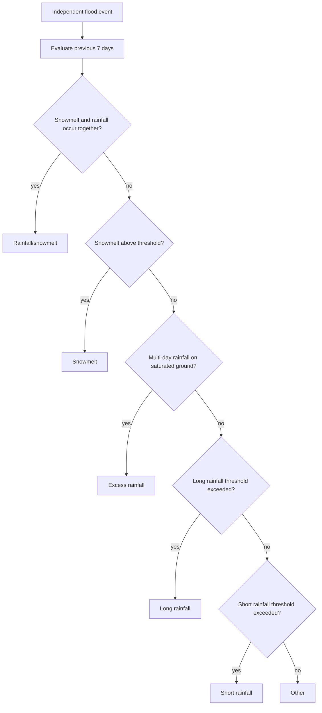
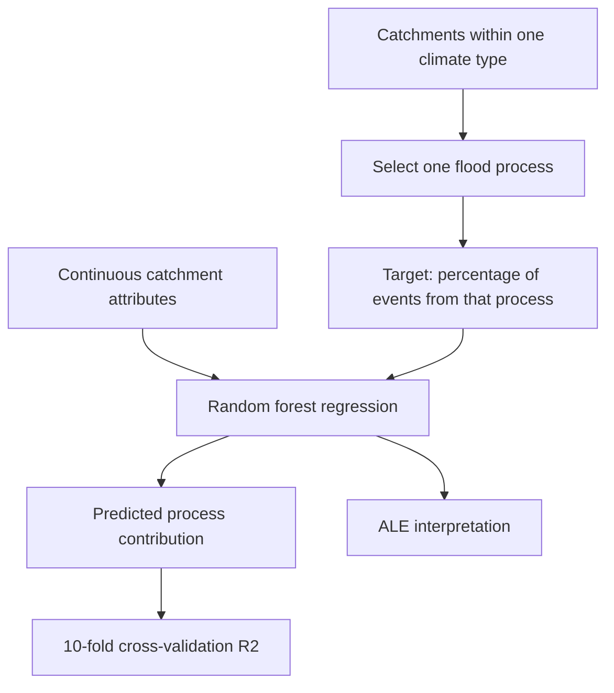

# Stein et al. (2021) WRR 논문 해설: 홍수 생성 과정에 영향을 주는 인자

대상 논문은 Lina Stein, Martyn P. Clark, Wouter J. M. Knoben, Francesca Pianosi, Ross A. Woods의 “How Do Climate and Catchment Attributes Influence Flood Generating Processes? A Large-Sample Study for 671 Catchments Across the Contiguous USA”이다. 원문 PDF는 [`stein_2021_wrr_climate_catchment_attributes_conus.pdf`](stein_2021_wrr_climate_catchment_attributes_conus.pdf)에 있다.

이 문서는 논문 1.1절과 Table 1을 중심으로, 홍수 생성 과정에 영향을 줄 수 있는 climate/catchment attributes를 한국어로 풀어 쓴 참고 메모다. 핵심은 이 논문이 “홍수 크기만” 설명하려는 논문이 아니라, 어떤 유역에서 어떤 `flood-generating process`가 더 자주 나타나는지를 climate와 catchment attributes로 설명하려는 논문이라는 점이다.

## 1. 논문의 기본 관점

논문은 유역에서 어떤 홍수 생성 과정이 나타나는지는 크게 두 가지에 달려 있다고 본다.

첫째는 `flood-producing input`의 availability다. 즉 홍수를 만들 수 있는 입력이 실제로 존재하느냐의 문제다. 예를 들어 짧고 강한 대류성 폭우가 있는지, 며칠간 지속되는 강우가 있는지, 눈이 쌓였다가 녹는 조건이 있는지, 눈 위에 비가 내리는 조건이 있는지가 여기에 해당한다.

둘째는 유역이 물을 어떻게 저장하고 전달하는가다. 같은 비가 내려도 어떤 유역은 토양, 습지, 지하 저장공간에 물을 오래 붙잡아 두고, 어떤 유역은 경사가 급하거나 토양이 얕아 물을 빠르게 하류로 보낸다. 이 차이가 runoff generation 방식, peak timing, flood magnitude, 그리고 어떤 flood process가 flood event로 관측되는지를 바꾼다.

이 관계는 아래처럼 볼 수 있다.



중요한 점은 각 attribute가 독립적으로 작동하지 않는다는 것이다. 기후, 지형, 토양, 식생, 지질은 공간적으로 서로 강하게 얽혀 있다. 예를 들어 고도가 높은 유역은 보통 기온이 낮고, 눈 비율이 높고, 경사가 급하고, 토양이 얕을 수 있다. 따라서 어떤 결과가 `elevation` 때문인지, `snow fraction` 때문인지, `slope` 때문인지 완전히 분리하기 어렵다. 이 논문이 random forest와 accumulated local effects(ALE)를 함께 쓴 이유도 이런 correlated attributes 문제를 줄이기 위해서다.

## 2. flood process 용어 번역

이 논문은 Stein et al. (2019)의 event-based classification을 사용해 홍수 사건을 다섯 가지 hydrometeorological process로 나눈다.

| 원문 | 권장 번역 | 의미 |
| --- | --- | --- |
| `excess rainfall` | 초과강우 홍수 / 포화초과 강우 홍수 | 유역이 이미 습윤하거나 포화에 가까운 상태에서 추가 강우가 내려 runoff가 빠르게 커지는 홍수다. 논문에서는 saturation excess flow로 설명한다. |
| `short rainfall` | 단기 강우 홍수 | 24시간 이내의 짧고 강한 강우가 직접적인 원인이 되는 홍수다. 강우강도가 infiltration capacity를 넘거나 유역을 빠르게 포화시킬 때 나타나기 쉽다. |
| `long rainfall` | 장기 강우 홍수 | 며칠 동안 이어진 강우가 유역 저장공간을 점진적으로 채운 뒤 발생하는 홍수다. 처음부터 포화되어 있었다기보다, 긴 강우가 antecedent wetness를 만들어 가는 경우에 가깝다. |
| `snowmelt` | 융설 홍수 | 쌓여 있던 눈이 녹으면서 발생하는 홍수다. 기온, 고도, 계절, snowpack 상태와 밀접하다. |
| `rainfall/snowmelt` 또는 `rain-on-snow` | 강우-융설 복합 홍수 / 눈 위 강우 홍수 | 비와 눈 녹은 물이 함께 runoff에 기여하는 홍수다. snowpack이 이미 물을 많이 머금고 있거나 녹기 쉬운 상태일수록 위험이 커질 수 있다. |
| `other` | 기타 / 미분류 | decision tree 기준으로 위 다섯 process 중 하나로 분류하기 어려운 사건이다. Stein et al. (2021)의 주요 분석에서는 제외된다. |

이 중 `excess rainfall`과 `long rainfall`은 모두 강우 기반 flood지만, 구분 기준이 다르다. `excess rainfall`은 홍수 전 유역이 이미 포화에 가까운지, 즉 antecedent condition이 핵심이다. `long rainfall`은 긴 강우가 저장공간을 채워 flood로 이어지는지가 핵심이다.



## 3. Table 1 읽는 법

Table 1의 `Attribute`는 홍수 생성 과정에 영향을 줄 수 있다고 선행연구에서 제안된 climate/catchment factor다. `Positive influence`는 해당 attribute 값이 커질수록 특정 flood process가 더 자주 또는 더 강하게 나타날 가능성이 있다는 뜻이고, `Negative influence`는 반대로 줄어들 가능성이 있다는 뜻이다. `Neutral/no influence`는 뚜렷한 영향이 없거나 선행연구에서 영향이 확인되지 않았다는 뜻이다.

`Study location`은 Stein et al. (2021)의 본 연구 대상지 구분이 아니라, Table 1에서 인용한 선행연구들이 수행된 지역을 뜻한다.

| 코드 | 의미 |
| --- | --- |
| `AT` | Austria, 오스트리아 |
| `CH` | Switzerland, 스위스 |
| `CZ` | Czech Republic, 체코 |
| `DE` | Germany, 독일 |
| `SE` | Sweden, 스웨덴 |
| `UK` | United Kingdom, 영국 |
| `US` | United States, 미국 |
| `Global` | 특정 국가가 아니라 global 또는 다지역 연구 |
| `-` | 연구 위치가 명시되지 않음 |

예를 들어 `DE, DE, US, US`처럼 쉼표로 여러 지역이 나열된 경우는 같은 attribute에 대해 여러 선행연구가 있고, 각 연구의 위치를 순서대로 적은 것이다. `UK/US/SE`처럼 slash로 연결된 경우는 하나의 연구가 여러 지역을 함께 다룬 것으로 보면 된다.

Table 1의 주요 내용을 번역하면 아래와 같다.

| Attribute | 번역 | Positive influence | Negative influence | Neutral/no influence | 해석 |
| --- | --- | --- | --- | --- | --- |
| `Elevation` | 고도 | 강우-융설 복합 홍수 | - | - | 고도가 높으면 눈 축적과 융설 조건이 바뀌므로 rainfall/snowmelt process와 관련될 수 있다. |
| `Area` | 유역 면적 | 장기 강우 홍수, 초과강우 홍수 | 단기 강우 홍수 | 융설 홍수 | 면적이 작으면 짧은 폭우가 유역 전체를 덮기 쉬워 short rainfall이 유리하고, 큰 유역은 장기 강우나 포화 관련 과정이 중요해질 수 있다. |
| `Slope` | 유역 경사 | 융설 홍수, 단기 강우 홍수 | - | 단기 강우 홍수 | 경사가 크면 물이 빠르게 outlet으로 전달되어 short rainfall이나 snowmelt response가 커질 수 있지만, 일부 연구에서는 영향이 뚜렷하지 않았다. |
| `Round catchment shape` | 둥근 유역 형상 | 단기 강우 홍수 | - | 단기 강우 홍수 | 둥근 유역은 여러 지점에서 생긴 flood wave가 outlet에 비슷한 시간에 도착하기 쉬워 peak가 커질 수 있다. |
| `Precipitation intensity` | 강우 강도 | 단기 강우 홍수, 강우-융설 복합 홍수 | 초과강우 홍수 | - | 강한 비는 infiltration capacity를 넘겨 빠른 runoff를 만들 수 있다. 눈이 있는 지역에서는 비가 snowmelt와 결합할 수도 있다. |
| `Precipitation peak winter` | 겨울철 강수 피크 | 초과강우 홍수 | - | - | 겨울에는 evapotranspiration이 낮아 토양이 잘 마르지 않기 때문에 포화 상태가 유지되기 쉽고, excess rainfall flood 가능성이 커질 수 있다. |
| `Precipitation peak summer` | 여름철 강수 피크 | 강우-융설 복합 홍수 | - | - | 특정 지역에서는 여름철 강수와 융설 시기가 겹치며 rainfall/snowmelt event를 만들 수 있다. |
| `Mean annual precipitation` | 연평균 강수량 | 초과강우 홍수, 강우-융설 복합 홍수 | 단기 강우 홍수 | - | 평균 강수량이 높으면 유역이 습윤하거나 포화될 가능성이 커진다. 반대로 매우 짧고 국지적인 강우 지배성은 약해질 수 있다. |
| `Aridity` | 건조도 | 단기 강우 홍수, 장기 강우 홍수 | 초과강우 홍수 | - | 건조한 지역은 평소 토양이 마른 경우가 많아 excess rainfall은 줄고, 강한 대류성 폭우나 긴 강우가 flood를 만들 가능성이 커질 수 있다. |
| `Soil storage` | 토양 저장능력 | 초과강우 홍수, 장기 강우 홍수 | 단기 강우 홍수, 융설 홍수 | - | 저장능력이 크면 짧은 비가 바로 runoff가 되기 어렵다. 그러나 저장공간이 채워진 뒤에는 saturated condition에서 excess rainfall이나 long rainfall flood가 발생할 수 있다. |
| `Vegetation` | 식생 | 초과강우 홍수 | 단기 강우 홍수, 융설 홍수, 강우-융설 복합 홍수 | 단기 강우 홍수 | 식생은 침투와 표면 거칠기를 늘려 빠른 runoff를 줄일 수 있다. 숲은 snowfall interception과 sublimation을 통해 snow-related process에도 영향을 줄 수 있다. |
| `Subsurface storage` | 지하 저장공간 | 초과강우 홍수, 장기 강우 홍수 | 단기 강우 홍수 | - | 지하 저장공간이 크면 flood response가 완만해져 short rainfall flood가 줄 수 있고, 저장공간이 찬 뒤 나타나는 process가 중요해질 수 있다. |

## 4. 기후와 날씨

`Climate and weather`는 flood-producing input 자체를 결정한다. 논문에서 가장 먼저 강조하는 것은 강수와 기온의 공간적·시간적 분포다. 강수가 언제, 얼마나, 어떤 강도로 내리는지와 기온이 언제 영하 또는 영상으로 유지되는지가 snowpack accumulation, snowmelt, rain-on-snow, rainfall flood의 가능성을 바꾼다.

겨울 강수가 있고 겨울 기온이 계속 영하인 지역에서는 snowpack이 쌓이고 봄이나 초여름까지 녹지 않을 수 있다. 이런 지역에서는 계절 초반이나 봄/초여름에 비가 눈 위에 내리면서 rain-on-snow event가 생길 수 있다. 반대로 겨울 기온이 0도 근처에서 자주 오르내리는 지역에서는 겨울 중에도 rain-on-snow flood가 발생할 수 있다.

강우 기반 flood에서는 rainfall과 evapotranspiration의 계절성이 중요하다. 강수 피크가 추운 계절에 있고 evapotranspiration이 낮으면 토양이 잘 마르지 않는다. 이때 강수와 evapotranspiration은 `out of phase`, 즉 계절적 타이밍이 어긋난 상태다. 강수는 많고 토양 건조는 약하므로 saturated condition이 만들어지기 쉽고, excess rainfall flood 가능성이 커진다.

반대로 강수 피크와 evapotranspiration 피크가 같은 계절에 오면 `in phase` 상태다. 비가 많이 오는 시기와 토양을 말리는 힘이 큰 시기가 겹치므로 유역이 더 건조하게 유지될 수 있다. 이 경우에는 홍수가 나기 위해 며칠 동안의 강우가 먼저 catchment storage를 채워야 하므로 long rainfall flood 쪽으로 이어질 수 있다.

건조 지역에서는 short rainfall flood가 특히 중요할 수 있다. Convective thunderstorm처럼 짧고 강한 비가 infiltration capacity를 넘기면, 평소 토양이 건조하더라도 매우 빠른 runoff가 발생할 수 있다. 동시에 눈이 적고 evaporation이 커서 다른 flood process, 특히 snow-related process나 persistent saturation 기반 process는 상대적으로 덜 나타날 수 있다.

정리하면, 기후와 날씨는 다음 질문에 답한다.

| 질문 | 관련 process |
| --- | --- |
| 눈이 쌓일 만큼 춥고 강수가 있는가? | snowmelt, rainfall/snowmelt |
| 눈이 녹는 시기에 비가 오는가? | rain-on-snow, rainfall/snowmelt |
| 강한 단기 폭우가 있는가? | short rainfall |
| 강수 피크가 evapotranspiration이 낮은 계절에 있는가? | excess rainfall |
| 강수 피크와 evapotranspiration 피크가 겹치는가? | long rainfall 가능성 증가 |

## 5. antecedent condition

`Antecedent condition`은 flood event가 발생하기 전의 유역 상태를 뜻한다. 가장 중요한 것은 soil moisture, saturation state, snowpack wetness처럼 “이미 물이 얼마나 차 있었는가”다.

같은 강우량이라도 antecedent condition에 따라 flood process가 달라진다. 유역이 이미 젖어 있거나 포화에 가까우면 추가 비가 토양에 저장되지 못하고 빠르게 runoff로 전환된다. 이 경우는 excess rainfall flood로 해석하기 쉽다. 반대로 유역이 상대적으로 건조하면 비가 먼저 토양과 지하 저장공간을 채우고, 긴 강우가 이어진 뒤에야 runoff가 커질 수 있다. 이 경우는 long rainfall flood와 더 가깝다.

Snow-related flood에서도 antecedent condition은 중요하다. snowpack이 차갑고 dry한 상태라면 비가 내려도 처음에는 눈층이 물을 머금거나 에너지 일부가 snowpack을 데우는 데 쓰일 수 있다. 반대로 snowpack이 이미 따뜻하고 물을 많이 머금은 ripe 상태라면 추가 강우가 바로 snowmelt water와 함께 흘러나와 rain-on-snow flood 가능성을 키운다.

따라서 antecedent condition은 “얼마나 비가 왔는가”만큼이나 “비가 오기 전에 유역이 어떤 준비 상태였는가”를 설명하는 개념이다.

## 6. 유역 저장과 전달 특성

논문은 steady forcing condition과 variable forcing condition을 구분한다. Steady forcing condition은 예를 들어 눈이 없고 유역이 계속 포화 상태로 유지되는 경우처럼, 가능한 flood process 중 사실상 하나만 나타날 수 있는 환경이다. 이런 경우에는 catchment attributes가 flood magnitude나 runoff coefficient에는 영향을 줄 수 있어도, flood-generating process 자체에는 큰 영향을 주지 않을 수 있다.

하지만 이런 환경은 드물다. 대부분의 유역은 계절, storm type, antecedent wetness, snow condition이 바뀌며 여러 flood-generating process를 경험한다. 이런 variable forcing condition에서는 catchment storage와 transmission behavior가 어떤 process가 실제 flood event로 이어질지 강하게 결정한다.

예를 들어 storm duration이 catchment response time과 비슷할 때 큰 flood magnitude가 나타나기 쉽다. 이유는 유역 여러 지점에서 생성된 runoff가 outlet에 도착하는 시간이 잘 겹치기 때문이다. storm duration이 너무 짧으면 먼 곳의 runoff가 늦게 도착해 peak가 분산될 수 있고, 너무 길면 hydrograph가 넓어지면서 peak보다 volume 중심의 반응이 될 수 있다.

이 관계는 아래처럼 볼 수 있다.



짧은 response time을 가진 유역은 short rainfall flood에 민감할 수 있다. 경사가 급하고, 면적이 작고, 유역 형상이 둥글면 물이 outlet에 빠르게 모이기 때문이다. 다만 짧은 time of concentration은 지형만으로 결정되지 않는다. 유역이 사전에 포화되어 있으면 토양 저장 지연이 줄어들어 response가 짧아질 수 있다. 이 경우에는 short rainfall flood라기보다 excess rainfall flood에 취약한 유역으로 해석할 수 있다.

## 7. slope: 유역 경사

`Slope`는 유역 평균 경사다. 경사가 클수록 물이 중력 방향으로 빠르게 이동하기 쉬우므로, meltwater나 rainfall runoff가 outlet에 도달하는 시간이 짧아질 수 있다. 특히 얇은 토양과 결합하면 저장공간이 작고 전달 속도가 빨라져 flood response가 더 빠르게 나타난다.

Snowmelt flood에서는 steep catchment가 meltwater를 하천으로 빠르게 전달할 수 있다. Rainfall-induced flood에서는 경사가 transit time을 줄여 short rainfall flood를 강화할 수 있다. 논문은 steep slope가 soil thickness의 proxy일 수도 있다고 설명한다. 급경사 지역은 토양이 얇을 가능성이 있고, 얇은 토양은 저장능력이 낮아 빠른 runoff를 만들 수 있기 때문이다.

다만 slope의 영향은 논쟁적이다. 어떤 연구들은 slope가 short rainfall이나 snowmelt response를 강화한다고 보았지만, 다른 연구들은 flood magnitude나 flood frequency curve shape를 잘 설명하지 못한다고 보았다. 따라서 slope는 단독 원인이라기보다 soil depth, drainage efficiency, relief, basin area와 함께 해석해야 한다.

CAMELSH/CAMELS attribute 관점에서는 `slope_mean` 같은 변수가 short response basin을 설명하는 데 쓰일 수 있지만, 이 값을 곧바로 “flood peak가 크다”로 해석하면 위험하다. slope는 flood process의 가능성을 바꾸는 proxy이지, 모든 지역에서 일관된 flood magnitude predictor는 아니다.

## 8. area: 유역 면적

`Area`는 유역 면적이다. 일반적으로 절대 flood magnitude는 면적이 커질수록 커질 수 있지만, 면적으로 정규화한 specific magnitude 또는 unit discharge는 면적이 커질수록 작아지는 경향이 있다. 큰 유역일수록 강우가 유역 전체에 동시에 같은 강도로 내리기 어렵고, runoff 도착 시간도 분산되기 때문이다.

유역 면적은 time of concentration에 영향을 준다. 작은 유역은 concentration time이 짧다. 따라서 짧고 강한 convective storm이 유역 전체를 덮으면 outlet에서 빠르고 큰 peak가 발생할 수 있다. 이 때문에 humid area에서도 작은 유역에서는 short rainfall flood가 더 흔할 수 있다.

반대로 큰 유역은 대류성 storm 하나가 전체 유역을 덮기 어렵다. 유역 일부에만 강한 비가 오면 전체 outlet 기준 flood event로 커지지 않을 수 있다. 큰 유역에서 flood가 발생하려면 더 넓고 오래 지속되는 synoptic storm이나 antecedent wetness가 중요해질 수 있다. 따라서 long rainfall이나 excess rainfall process가 상대적으로 중요할 수 있다.

Snowmelt flood의 경우 area 효과는 상대적으로 작게 나타날 수 있다고 선행연구가 보고했다. 이는 snowmelt가 강우 storm footprint와 달리 계절적·공간적으로 더 넓게 작동할 수 있기 때문으로 해석할 수 있다.

## 9. shape: 유역 형상

`Catchment shape`는 유역이 둥근지 길쭉한지를 뜻한다. 논문 Table 1에서는 `round catchment shape`가 따로 제시된다.

둥근 유역에서는 유역 여러 지점에서 생성된 flood wave가 outlet에 비슷한 시간에 도착하기 쉽다. 특히 storm duration이 catchment time of concentration과 비슷하면 각 지점의 runoff가 겹치면서 flood peak가 커질 수 있다. 그래서 둥근 유역은 short rainfall flood와 관련될 수 있다고 본다.

길쭉한 유역은 일반적으로 runoff 도착 시간이 더 분산될 수 있다. 그러나 예외도 있다. storm cell이 유역 상류에서 하류 방향으로 이동하면, 상류에서 내려오는 flood wave와 하류에서 새로 생성되는 runoff가 outlet 근처에서 겹쳐 매우 큰 peak를 만들 수 있다. 따라서 shape 효과도 storm movement direction과 함께 봐야 한다.

일부 연구에서는 catchment shape와 flood magnitude의 명확한 관계를 찾지 못했다. 따라서 shape는 물리적으로 plausible한 factor지만, 모든 지역에서 강한 predictor로 작동한다고 단정하면 안 된다.

## 10. soils: 토양

`Soils`는 soil storage capacity, infiltration capacity, soil depth 등을 포함한다. 토양은 기후, 지질, 지형, 식생과 함께 발달하므로 다른 attributes와 강하게 얽혀 있다.

Soil storage capacity가 크고 infiltration capacity가 높으면 강우가 바로 surface runoff로 전환되지 않는다. 더 큰 rainfall input이 들어와야 저장공간이 채워지고 runoff가 발생한다. 그래서 이런 유역에서는 짧은 강우만으로는 short rainfall flood가 잘 생기지 않을 수 있다.

하지만 저장공간이 충분히 채워진 뒤에는 상황이 달라진다. storage capacity를 초과하면 추가 강우가 빠르게 runoff로 전환되어 flood magnitude가 커질 수 있다. Rogger et al. (2012)이 말한 flood frequency curve의 step-change는 이런 저장 한계 초과와 관련해 해석할 수 있다.

건조 및 반건조 지역에서는 saturation excess와 infiltration excess가 모두 나타날 수 있다. `Saturation excess`는 토양이 이미 포화되어 더 이상 물을 저장하지 못해 runoff가 발생하는 경우다. `Infiltration excess`는 토양이 포화되지 않았더라도 rainfall intensity가 infiltration capacity보다 커서 물이 침투하지 못하고 surface runoff로 흐르는 경우다. Crusting, bare rock surface, compacted soil은 infiltration excess를 강화할 수 있다.

Wood et al. (1990)의 해석처럼, 토양 특성은 작은 규모 flood에서 더 중요하고, 큰 flood에서는 rainfall property가 더 중요할 수 있다. 매우 큰 storm에서는 토양 차이가 일부 무력화되고 강우량·강우강도 자체가 flood response를 지배할 수 있기 때문이다.

## 11. open-water storage: 습지, 호수, 저수지

`Open-water storage`는 wetlands, lakes, reservoirs처럼 지표에 노출된 물 저장공간을 뜻한다. 이런 요소들은 유역의 전체 storage capacity를 키운다.

습지는 downstream flood response를 완화할 수 있지만, 그 효과는 saturation state에 크게 의존한다. 습지가 이미 포화되어 있다면 추가 강우는 거의 바로 runoff로 기여할 수 있다. 따라서 저장공간이 큰 유역은 flood가 아예 안 난다는 뜻이 아니라, 포화 조건 이후 excess rainfall flood가 나타날 가능성이 커질 수 있다.

Reservoir는 자연 습지나 호수보다 해석이 더 복잡하다. Reservoir가 유역 storage capacity를 늘리는지, flood peak를 줄이는지는 local water resources management plan과 운영 규칙에 따라 달라진다. 홍수 조절 목적의 여유용량이 있으면 peak를 낮출 수 있지만, 이미 수위가 높거나 방류 운영이 다르면 효과가 달라질 수 있다.

이 논문에서는 open-water storage를 flood process의 잠재 영향인자로 소개하지만, 본문 분석에서 모든 인과관계를 독립적으로 검정하는 것은 아니다. CAMELSH 연구에서 이 변수를 쓰려면 reservoir regulation이나 human influence flag와 함께 조심스럽게 해석해야 한다.

## 12. elevation: 고도

`Elevation`은 temperature와 precipitation regime에 직접 연결된다. 고도가 높을수록 기온이 낮아 눈이 쌓이기 쉽고, snowmelt timing도 늦어질 수 있다. 오스트리아 연구에서는 고도가 높을수록 spring snowmelt flood 발생 시기가 늦어진다고 보고됐다.

미국에서는 rainfall/snowmelt flood가 중간 고도 유역에서 많이 나타난다는 연구들이 있다. 너무 낮은 고도에서는 눈이 충분히 쌓이지 않을 수 있고, 너무 높은 고도에서는 비보다 눈이 우세하거나 melt timing이 다를 수 있다. 중간 고도는 비와 눈, melting condition이 함께 만나는 전이대이므로 rain-on-snow 또는 rainfall/snowmelt event가 자주 나타날 수 있다.

다만 elevation은 독립적인 물리 과정이라기보다 여러 조건의 proxy이기도 하다. 고도가 높은 유역은 더 춥고, 더 많은 눈을 받고, 경사가 급하고, 식생이 다르고, 토양이 얕을 수 있다. 그래서 논문 discussion에서도 elevation은 mountainous catchment의 proxy로 해석될 수 있다고 본다.

CAMELSH/DRBC 적용에서는 DRBC가 고산 snowmelt-dominant region은 아니더라도, basin elevation이나 snow fraction은 winter/spring high-flow response와 관련될 수 있다. 특히 temperature near-freezing condition과 함께 보면 rain-on-snow 가능성을 설명하는 데 도움이 된다.

## 13. geology와 subsurface storage: 지질과 지하 저장공간

`Geology`는 drainage network, subsurface storage, soil development에 영향을 준다. 암석과 지질 구조에 따라 물이 지하로 스며들어 저장될 수 있는 정도가 달라지고, 이것이 flood response를 완만하게 만들 수 있다.

`Subsurface storage`가 크면 flood response가 dampened, 즉 완화된다. 비가 내려도 물이 바로 하천으로 가지 않고 지하 저장공간에 들어갔다가 천천히 배출될 수 있기 때문이다. 이런 유역에서는 short rainfall flood가 줄어들고, 저장공간이 차오른 뒤 발생하는 long rainfall 또는 excess rainfall process가 상대적으로 중요할 수 있다.

지하 저장공간은 erosion과 drainage network 발달에도 간접 영향을 준다. response가 완만하면 침식력이 낮아지고, 토양 발달이 더 잘 일어나며, 이것이 다시 storage를 늘리는 feedback이 생길 수 있다.

그러나 Stein et al. (2021)의 결과에서는 soil이나 geology attribute가 flood process distribution에 강하게 영향력 있는 것으로 나타나지는 않았다. 이는 soil/geology가 중요하지 않다는 뜻이라기보다, available attributes가 실제 storage/transmission process를 충분히 표현하지 못했거나 climate attributes의 영향이 더 강했을 가능성을 뜻한다.

## 14. vegetation: 식생

`Vegetation`은 flood magnitude와 frequency에 미치는 영향이 오래 논의된 인자다. 특히 deforestation과 reforestation의 효과가 많이 연구됐다. 어떤 대규모 연구는 forest가 flood magnitude와 frequency에 영향을 준다고 보고하지만, 다른 연구들은 그 효과가 제한적이라고 본다.

Flood process 관점에서 vegetation은 여러 경로로 작동한다.

첫째, 식생은 surface roughness를 증가시킨다. 표면 거칠기가 커지면 물이 하류로 이동하는 속도가 늦어지고 quick runoff가 줄어들 수 있다.

둘째, 식생은 soil infiltration capacity를 높일 수 있다. 뿌리와 유기물, 토양 구조 개선은 물이 토양으로 들어갈 수 있는 능력을 키운다. 이 경우 short rainfall flood나 infiltration-excess runoff가 줄어들 수 있다.

셋째, forest canopy는 snowfall interception과 sublimation을 바꾼다. 침엽수림은 눈을 canopy에 붙잡고, 그 일부가 sublimation으로 대기 중으로 돌아갈 수 있다. 이는 snowpack accumulation과 snowmelt amount를 바꾸므로 snowmelt flood와 rainfall/snowmelt flood에도 영향을 줄 수 있다.

식생 효과는 scale에 민감하다. 작은 유역과 작은 magnitude flood에서는 land use나 vegetation 변화가 flood response에 더 잘 드러날 수 있다. 반면 큰 유역이나 극단적으로 큰 flood에서는 storm property와 basin-wide saturation이 더 중요해져 vegetation signal이 약해질 수 있다.

건조 및 반건조 지역에서는 vegetation이 특히 중요할 수 있다. 식생이 infiltration capacity를 증가시키면 짧고 강한 비가 surface runoff로 바로 바뀌는 것을 줄일 수 있기 때문이다. 따라서 arid/semiarid basin에서 vegetation loss는 short rainfall flood response를 강화할 수 있다.

## 15. aridity: 건조도

`Aridity`는 보통 PET/P, 즉 potential evapotranspiration을 precipitation으로 나눈 값으로 표현된다. 값이 클수록 대기 수요에 비해 강수 공급이 부족하므로 더 건조한 유역으로 해석한다.

건조도가 높으면 excess rainfall flood는 줄어들 가능성이 있다. 토양이 평소 건조하고 유역이 지속적으로 포화 상태에 머물 가능성이 낮기 때문이다. 반대로 short rainfall flood는 늘어날 수 있다. 건조 지역에서는 강한 convective storm이 국지적으로 내리고, rainfall intensity가 infiltration capacity를 넘으면 빠른 runoff가 발생한다.

Long rainfall flood도 aridity와 관련될 수 있다. 건조한 유역에서는 flood가 나기 위해 먼저 저장공간을 채우는 시간이 필요할 수 있고, 따라서 며칠 동안 이어지는 강우가 중요해질 수 있다. 다만 너무 건조하면 긴 강우가 있어도 증발과 침투 손실이 커서 flood로 연결되지 않을 수도 있으므로, 지역별 맥락이 필요하다.

Stein et al. (2021)은 climate type을 wet, dry, snow-influenced로 나누는데, 이때 aridity와 snow fraction이 핵심 축이다. `wet`은 PET/P < 1인 energy-limited catchment이고, `dry`는 PET/P > 1인 water-limited catchment다. Snow fraction이 20%보다 큰 유역은 aridity와 관계없이 snow catchment로 분류한다.

## 16. precipitation intensity와 seasonality

`Precipitation intensity`는 강우가 얼마나 강하게 오는지를 뜻한다. 짧은 시간에 강한 비가 내리면 infiltration capacity를 넘거나 유역을 빠르게 포화시킬 수 있다. 그래서 short rainfall flood와 강하게 연결된다.

`Precipitation peak winter`는 강수량이 가장 많은 시기가 겨울철이라는 뜻이다. 겨울에는 evapotranspiration이 낮기 때문에 토양이 잘 마르지 않는다. 이때 강수 최대 시기가 토양 건조가 최소인 시기와 겹치므로, 유역이 saturated condition에 도달하기 쉽다. 따라서 excess rainfall flood가 늘어날 수 있다.

`Precipitation peak summer`는 강수량이 가장 많은 시기가 여름철이라는 뜻이다. 일반적으로 여름에는 evapotranspiration도 커서 토양이 더 건조하게 유지될 수 있지만, snowmelt season과 강수가 겹치는 특정 지역에서는 rainfall/snowmelt flood와 관련될 수 있다.

`Mean annual precipitation`은 연평균 강수량이다. 평균 강수량이 많으면 유역이 더 습윤하고 포화되기 쉬워 excess rainfall flood가 늘어날 수 있다. 미국 사례에서는 rainfall/snowmelt event frequency와도 관련이 있다고 언급된다. 예를 들어 windward slope는 rain shadow effect 때문에 leeward slope보다 더 많은 강우를 받고, 이런 지역에서는 rainfall/snowmelt event 발생률이 높을 수 있다.

## 17. snowpack과 rain-on-snow

`Snowpack`은 지표 위에 쌓인 눈층, 즉 적설층이다. 단순히 눈이 있느냐가 아니라 눈층의 온도, 밀도, 수분 함량, 저장 여유, 녹는 상태를 포함한다.

Snowmelt와 rainfall/snowmelt process는 snowpack condition에 크게 의존한다. 눈이 차갑고 건조하면 비가 내려도 바로 runoff가 되지 않을 수 있다. snowpack이 비를 일부 저장하거나, 비의 에너지가 눈층을 데우는 데 쓰일 수 있기 때문이다. 이것이 `rainfall retention capacity`다. 즉 내린 비를 곧바로 흘려보내지 않고 snowpack이나 유역 내부에 일시적으로 붙잡아 두는 능력이다.

반대로 snowpack이 이미 따뜻하고 물을 많이 머금은 상태라면 rainfall retention capacity가 낮다. 추가로 내린 비는 snowmelt water와 함께 빠르게 빠져나와 runoff를 키울 수 있다. 이때 rain-on-snow flood 가능성이 커진다.

Rain-on-snow flood는 두 가지 조건이 함께 맞아야 한다. 하나는 antecedent snowpack condition이고, 다른 하나는 rainfall-producing weather system이다. snowpack이 준비되어 있어도 비가 충분히 오지 않으면 큰 flood가 되지 않고, 비가 많이 와도 snowpack이 없거나 비를 잘 저장하는 상태라면 rain-on-snow response가 약할 수 있다.

## 18. windward slope, leeward slope, rain shadow effect

논문은 미국에서 rainfall/snowmelt event frequency가 지역이 받는 강우량과 관련된다고 언급한다. 이때 `windward slope`와 `leeward slope` 개념이 나온다.

`Windward slope`는 바람을 맞는 산지 사면이다. 습한 공기가 산을 타고 올라가며 냉각되고, 수증기가 응결해 강수량이 많아질 수 있다. `Leeward slope`는 산을 넘은 뒤의 바람그늘 사면이다. 공기가 내려가며 따뜻해지고 건조해져 강수량이 줄어드는 경우가 많다. 이 효과가 `rain shadow effect`다.

강우량이 많은 windward region에서는 snowpack이 있는 시기에 비도 많이 받을 수 있으므로 rainfall/snowmelt event 발생률이 높아질 수 있다. 이는 단순히 눈이 많은 곳이 위험하다는 뜻이 아니라, 눈과 비가 함께 만나는 지형·기후 조건이 중요하다는 뜻이다.

## 19. 논문 결과를 CAMELSH 연구에 연결할 때의 해석

이 논문은 CAMELSH 기반 high-flow event screening과 flood type 해석에 직접적인 배경 문헌으로 쓸 수 있다. 특히 “같은 유역에서도 여러 flood-generating process가 섞인다”는 점과 “climate attributes가 process distribution에 가장 강한 영향을 준다”는 점이 중요하다.

CAMELSH 연구에서 바로 연결되는 변수들은 다음과 같다.

| 논문 인자 | CAMELSH/CAMELS에서 가능한 proxy | 해석 방향 |
| --- | --- | --- |
| precipitation intensity | event-window rainfall, recent rainfall maximum | short rainfall 또는 recent precipitation event 식별 |
| antecedent condition | antecedent rainfall, antecedent API, modeled soil moisture가 있으면 soil moisture | excess rainfall 또는 long rainfall 구분 |
| aridity | PET/P, aridity attribute | wet/dry climate stratification |
| snow influence | snow fraction, temperature, degree-day snowmelt proxy | snowmelt 또는 rain-on-snow 가능성 |
| slope | mean slope, relief, elevation gradient | fast response basin proxy |
| area | basin area | response time, storm footprint, unit discharge scaling |
| elevation | mean elevation, high-elevation fraction | snow accumulation/melt timing proxy |
| vegetation | forest fraction, LAI, land cover | infiltration, roughness, snow interception proxy |
| soil storage | soil depth, porosity, permeability | storage and infiltration behavior |
| subsurface storage/geology | permeability, baseflow index, geology class | damped response, groundwater influence proxy |

다만 CAMELSH에서 flood process label을 붙일 때는 과도한 causal claim을 피해야 한다. 예를 들어 observed streamflow와 forcing만으로 `confirmed rain-on-snow flood`라고 단정하기보다는, `degree-day snowmelt/rain-on-snow proxy class`처럼 표현하는 편이 안전하다. 마찬가지로 Q99 event는 official flood event가 아니라 observed high-flow event candidate로 부르는 것이 방어 가능하다.

## 20. 논문에서 특히 가져갈 문장 수준의 메시지

이 논문에서 프로젝트 문서나 논문 서술에 가져갈 수 있는 메시지는 다음과 같다.

첫째, flood process는 단일 driver로 결정되지 않는다. 홍수를 만드는 입력의 존재와 유역의 저장·전달 특성이 함께 작동한다.

둘째, climate attributes는 flood process distribution에 가장 강한 영향을 준다. Aridity, snow fraction, precipitation seasonality, mean precipitation은 유역이 어떤 process를 경험할 가능성이 큰지 설명하는 핵심 축이다.

셋째, catchment attributes의 영향은 process와 climate type에 따라 달라진다. 같은 slope나 vegetation이라도 wet basin, dry basin, snow-influenced basin에서 의미가 달라질 수 있다.

넷째, 많은 유역은 하나의 flood-generating process만 경험하지 않는다. Event-level process가 섞이므로 basin-level dominant type만 쓰면 중요한 heterogeneity가 사라질 수 있다.

다섯째, soil/geology 같은 물리적으로 중요한 attributes가 large-sample statistical analysis에서 약하게 보일 수 있다. 이는 중요하지 않다는 뜻이 아니라, available attributes나 spatial correlation, climate dominance 때문에 signal이 약하게 관측될 수 있다는 뜻이다.

## 21. Methodology

Stein et al. (2021)의 methodology는 크게 다섯 단계로 볼 수 있다. 첫째, CAMELS 유역과 기상·유량·속성 자료를 준비한다. 둘째, daily streamflow에서 독립 flood event를 추출한다. 셋째, 각 event를 hydrometeorological flood-generating process로 분류한다. 넷째, 유역을 wet, dry, snow climate type으로 나누어 분석 단위를 만든다. 다섯째, attributes와 flood process distribution 사이의 관계를 두 가지 방법, 즉 frequency distribution comparison과 random forest plus ALE로 평가한다.

전체 흐름은 아래와 같다.



### 21.1 Data

논문은 contiguous United States의 CAMELS dataset을 사용한다. 표본은 `671`개 유역이고, daily data 기간은 `1980-2014`년이다. 모든 유역은 최소 20년 이상의 자료를 가지고 있고, 대부분의 유역은 34년 자료를 포함한다. CAMELS 유역은 human influence가 작도록 선별되어 있어, 대체로 small headwater catchments가 많다.

Flood event classification에는 daily observed streamflow와 Daymet meteorological forcing이 사용된다. 여기서 forcing은 주로 precipitation과 temperature다. Soil moisture routine에는 soil available water capacity가 필요한데, CAMELS 기본 속성에는 이 변수가 없어서 gNATSGO soil database를 추가로 사용한다. Actual evapotranspiration은 Newman et al. (2015)이 Sacramento Soil Moisture Accounting Model에서 산출한 값을 사용한다.

여기서 Daymet forcing은 Stein et al. (2021)이 사용한 CAMELS-US daily dataset 안의 기상 forcing을 뜻한다. CAMELSH 프로젝트에 이 방법론을 적용할 때 Daymet을 별도로 가져간다는 의미는 아니다. CAMELSH에서는 CAMELSH hourly forcing에서 공통으로 안정적으로 쓸 수 있는 precipitation, temperature, 필요 시 PET 또는 관련 proxy를 사용해 같은 역할의 event-window descriptor를 만든다.

Catchment attributes는 Addor et al. (2017)의 CAMELS attributes를 사용한다. 속성 그룹은 topography, climate, soil, vegetation, geology, streamflow indices로 나뉜다. 예를 들어 mean annual precipitation, fraction of precipitation falling as snow, aridity, mean elevation, mean slope, forest fraction, soil depth, permeability 같은 값이 여기에 들어간다.

이 논문에서는 categorical attributes는 분석하지 않는다. 이유는 frequency distribution comparison 방법이 categorical variable을 같은 방식으로 처리하기 어렵기 때문이다. 두 방법, 즉 frequency distribution method와 ALE method가 같은 attribute set을 보도록 하기 위해 continuous attributes만 사용한다. 추가로 유역 형상을 나타내기 위해 elongation ratio를 계산한다. 이 값이 1에 가까우면 둥근 유역이고, 0에 가까우면 길쭉한 유역이다.

정리하면 data layer는 다음과 같다.

| 자료 | 사용 목적 |
| --- | --- |
| CAMELS daily observed streamflow | flood peak event 추출 |
| CAMELS Daymet precipitation and temperature | Stein et al. (2021) 원논문에서 event-window rainfall, snowfall/melt condition 계산 |
| CAMELSH hourly forcing | CAMELSH 적용 시 Daymet 대신 사용하는 기상 forcing source |
| gNATSGO available water capacity | simple soil moisture routine 입력 |
| Sacramento-SMA actual evapotranspiration | water balance and antecedent condition 관련 정보 |
| CAMELS catchment attributes | flood process distribution을 설명하는 predictor |
| Calculated elongation ratio | catchment shape proxy |

### 21.2 Flood event extraction

Flood event는 peaks-over-threshold 방식으로 추출한다. 즉 전체 시계열에서 독립적인 streamflow peak를 찾고, threshold보다 작은 peak는 제외한다. 구현에는 R package `quantmod`의 `findPeaks` 함수가 사용됐다.

독립 peak 판단에는 두 기준이 들어간다. 첫째, 두 peak 사이의 시간 간격이 mean rising time보다 커야 한다. 이 mean rising time은 서로 충분히 떨어진 5개의 clean hydrograph, 즉 이전 peak와 시간적으로 잘 분리된 상위 5개 peak에서 계산한다. 둘째, 두 peak 사이의 trough가 첫 번째 peak의 2/3보다 낮아야 독립 event로 볼 수 있다. 이 기준은 서로 붙어 있는 작은 진동을 별도 flood event로 과도하게 나누지 않기 위한 장치다.

논문은 두 가지 event magnitude subset을 만든다. 하나는 평균적으로 연 1개 event가 나오도록 한 큰 peak subset이고, 다른 하나는 평균적으로 연 3개 event가 나오도록 한 작은 peak까지 포함한 subset이다. 본문 주요 그림과 결과는 평균 `3 events per year` 기준을 중심으로 제시되고, 평균 `1 event per year` 기준은 robustness check 성격으로 사용된다.

이 선택은 방법론적으로 중요하다. Land use나 storage capacity 같은 유역 속성은 아주 큰 flood보다 중소 규모 flood에서 더 잘 드러날 수 있기 때문이다. 반대로 극단적으로 큰 flood에서는 storm property 자체가 지배적이어서 catchment attribute signal이 약해질 수 있다. 그래서 논문은 flood magnitude subset을 나누어 attribute 영향이 event size에 따라 달라지는지도 확인한다.

### 21.3 Flood process classification

추출된 flood event는 Stein et al. (2019)의 decision tree를 사용해 다섯 가지 hydrometeorological generating process로 분류한다. 분류 대상 process는 `excess rainfall`, `short rainfall`, `long rainfall`, `snowmelt`, `rainfall/snowmelt`다. 어느 process에도 해당하지 않으면 `other`로 둔다. `other`는 Stein et al. (2021)의 주요 attribute influence 분석에서는 제외된다.

Decision tree는 각 flood event 전 `7-day` window의 hydrometeorological condition을 평가한다. 입력은 flood event date, precipitation, temperature, simple lumped model routine에서 계산한 soil moisture와 snowmelt estimate다. Snowfall과 melt를 구분하는 critical temperature는 `1°C`로 둔다.

분류 순서는 물리적으로 겹칠 수 있는 process를 우선순위에 따라 처리한다.



먼저 rainfall과 snowmelt가 동시에 있었는지 확인한다. 이 경우는 simplified rain-on-snow definition에 해당한다. 다만 snowpack energy balance를 직접 계산하지 않기 때문에, 엄밀한 물리 기반 rain-on-snow 진단이라기보다 large-sample classification을 위한 operational definition이다.

그다음 snowmelt가 threshold보다 컸는지 확인해 snowmelt flood를 분류한다. Snow-related process가 아니면, 평균보다 큰 multi-day rainfall이 previously saturated ground 위에 내렸는지를 확인해 excess rainfall flood를 분류한다. 이 조건도 만족하지 않으면 long rainfall threshold, 그다음 short rainfall threshold를 순서대로 확인한다.

Threshold는 모든 유역에 같은 절대값을 쓰지 않고, 각 catchment의 hydrometeorological time series에 기반해 정한다. 이 점이 중요하다. 미국 전역의 다양한 climate region에 같은 `mm/day` threshold를 적용하면 wet region과 dry region의 event가 불공정하게 분류될 수 있기 때문이다. 따라서 논문은 location-independent decision tree를 사용하되, threshold는 catchment-specific time series distribution에서 가져오는 방식으로 large-sample 적용성을 확보한다.

### 21.4 Climate type definition

논문은 모든 유역을 한 번에 분석하지 않고, wet, dry, snow-influenced catchments로 나눈다. 이유는 attribute의 영향이 climate context에 따라 달라질 가능성이 크기 때문이다. 예를 들어 slope가 short rainfall response에 미치는 영향은 dry basin과 snow basin에서 다르게 나타날 수 있고, vegetation의 효과도 wet basin과 arid basin에서 다를 수 있다.

Climate type은 CAMELS의 두 climate index로 정의한다. 하나는 aridity index `PET/P`이고, 다른 하나는 precipitation falling as snow fraction이다.

| Climate type | 정의 | 해석 |
| --- | --- | --- |
| `wet` | aridity index `PET/P < 1`이고 snow fraction이 20% 이하 | precipitation이 potential evapotranspiration보다 큰 energy-limited catchment |
| `dry` | aridity index `PET/P > 1`이고 snow fraction이 20% 이하 | potential evapotranspiration이 precipitation보다 큰 water-limited catchment |
| `snow` | snow fraction > 20%, aridity와 무관 | snowmelt 또는 rainfall/snowmelt contribution 가능성이 큰 catchment |

Snow fraction threshold `20%`는 절대적인 자연 법칙이라기보다 literature와 sample balance를 함께 고려한 운영 기준이다. 선행연구에서는 15%나 30% 근처의 기준도 사용된다. Stein et al. (2021)은 세 climate group의 catchment 수가 어느 정도 비슷해지면서 snowmelt contribution이 있는 유역들을 함께 묶을 수 있는 값으로 20%를 선택한다.

이 stratification의 목적은 aridity와 snow fraction 자체의 중요성을 다시 발견하는 데 있지 않다. 이미 이 두 속성은 flood process distribution에 강한 영향을 준다고 알려져 있기 때문에, 먼저 climate type으로 나누고 그 안에서 다른 catchment attributes의 영향이 어떻게 달라지는지를 보려는 것이다.

### 21.5 Frequency distribution comparison

첫 번째 attribute influence 평가 방법은 frequency distribution comparison이다. 논문에서는 이를 statistics-based approach 또는 comparative hydrology approach로 볼 수 있다. 핵심 질문은 “특정 flood process가 발생한 event들이 어떤 attribute 값을 가진 catchment에서 더 많이 나왔는가”다.

분석은 climate type별로 나누어 수행한다. 예를 들어 dry catchments 안에서 `slope`가 `short rainfall` process와 관련이 있는지 따로 보고, snow catchments 안에서 같은 관계를 다시 본다. 이렇게 해야 전체 CONUS에서 climate gradient가 너무 강해서 catchment attribute signal을 가리는 문제를 줄일 수 있다.

절차는 다음과 같다.

1. 하나의 climate type을 선택한다.
2. 하나의 continuous attribute를 선택한다. 예를 들어 mean annual precipitation, slope, forest fraction 등을 선택한다.
3. 하나의 flood process를 선택한다. 예를 들어 excess rainfall을 선택한다.
4. 해당 process로 분류된 event들의 catchment attribute 값을 event 수만큼 반복해 process-specific distribution을 만든다.
5. 같은 climate type의 모든 event를 사용해 all-event attribute distribution을 만든다.
6. 두 empirical cumulative distribution function, 즉 process-specific ECDF와 all-event ECDF를 비교한다.

예를 들어 어떤 유역의 mean annual precipitation이 400 mm/year이고 이 유역에서 excess rainfall event가 15개 있었다면, excess rainfall distribution에는 400이라는 값이 15번 들어간다. 다른 유역의 mean annual precipitation이 350 mm/year이고 excess rainfall event가 10개 있었다면, 350이라는 값이 10번 들어간다. 이렇게 event contribution에 따라 catchment attribute가 가중된다.

Attribute 값은 비교 가능하도록 min-max normalization을 한다.

```text
x_norm = (x - min(x)) / (max(x) - min(x))
```

그다음 ECDF curve에서 100개 지점을 잡아 process-specific ECDF와 all-event ECDF의 평균 차이를 계산한다. 이 값이 attribute influence summary statistic이 된다.

```text
influence_summary =
  mean over 100 ECDF points [ECDF_all_events(x) - ECDF_process(x)]
```

이 값의 절댓값이 클수록 해당 process의 attribute distribution이 전체 event distribution과 다르다는 뜻이다. 즉 그 attribute가 그 process 발생과 관련이 있을 가능성이 크다. 부호는 방향을 나타낸다. 논문 설명 기준으로 음수 값은 작은 attribute 값에서 해당 process가 상대적으로 더 많이 나타나는 경향을, 양수 값은 큰 attribute 값에서 해당 process가 상대적으로 더 많이 나타나는 경향을 뜻한다.

이 방법의 장점은 linear correlation만 보는 것이 아니라 attribute space 전체에서 분포 차이를 볼 수 있다는 점이다. 따라서 nonlinear relationship도 어느 정도 포착할 수 있다. 또한 process 간 비교가 직관적이고, ECDF curve 자체를 보면 어떤 attribute range에서 차이가 나는지도 해석할 수 있다.

한계도 분명하다. 표본 수가 작은 process, 예를 들어 dry catchment의 snowmelt나 rainfall/snowmelt event는 ECDF가 불안정할 수 있다. 또 어떤 process event가 압도적으로 많으면 all-event distribution이 그 process에 끌려갈 수 있다. Categorical attribute는 처리하기 어렵고, ECDF curve가 서로 교차하는 경우에는 평균 차이가 0에 가까워져 실제 영향이 요약값에서 사라질 수 있다. 그래서 논문은 point size로 event sample size를 함께 표시하고, curve도 시각적으로 확인한다.

### 21.6 Random forest modeling

두 번째 방법은 random forest regression model이다. 이 모델은 두 목적으로 사용된다. 하나는 catchment attributes만으로 flood process distribution을 예측할 수 있는지 확인하는 것이고, 다른 하나는 학습된 모델을 ALE로 해석해 어떤 attribute가 process contribution 예측에 중요한지 평가하는 것이다.

Target variable은 event label 자체가 아니라, catchment별 process contribution이다. 즉 각 catchment에서 특정 process가 차지하는 event percentage를 예측한다. 예를 들어 어떤 catchment의 flood events 중 70%가 excess rainfall이면, excess rainfall model의 target은 70%다.

모델은 climate type과 flood process별로 따로 만든다. 즉 wet-excess rainfall, wet-short rainfall, dry-excess rainfall, snow-snowmelt처럼 조합마다 별도의 random forest regression model이 있다. 이 방식은 process와 climate type에 따라 attribute relationship이 다를 수 있다는 논문 가설과 맞는다.



Prediction accuracy는 10-fold cross-validation으로 평가한다. Dataset을 10개 subset으로 나누고, 9개 subset으로 학습한 뒤 나머지 1개 subset에서 평가한다. 이 과정을 10번 반복하면 모든 catchment가 한 번씩 validation fold가 된다. 성능 지표는 coefficient of determination, 즉 `R2`다.

Random forest는 training data에 과적합될 수 있으므로 training score보다 cross-validation score가 더 적절하다. 또한 논문은 random forest 결과의 robustness를 보기 위해 서로 다른 `50`개 initial random seed로 모델 생성을 반복한다.

### 21.7 Accumulated Local Effects

Random forest를 해석할 때 흔히 variable importance를 사용할 수 있다. 예를 들어 어떤 predictor를 shuffle했을 때 error가 얼마나 증가하는지 보는 방식이다. 하지만 CAMELS attributes는 서로 강하게 correlated되어 있기 때문에, 일반 variable importance는 bias를 가질 수 있다. 예를 들어 elevation, snow fraction, temperature, precipitation seasonality가 서로 얽혀 있으면, 한 변수의 중요도가 다른 변수와의 상관 때문에 과대 또는 과소 평가될 수 있다.

그래서 논문은 accumulated local effects, 즉 ALE를 사용한다. ALE는 partial dependence plot보다 correlated features 문제에 덜 민감한 interpretable machine learning 방법이다. 기본 아이디어는 특정 attribute 값을 조금 변화시켰을 때 model prediction이 locally 얼마나 변하는지를 관측 데이터가 실제로 존재하는 구간 안에서 계산하는 것이다.

ALE 계산은 다음처럼 이해할 수 있다.

1. 관심 attribute의 값을 quantile 기준 interval로 나눈다.
2. 각 interval 안에 있는 관측치들에 대해, attribute 값을 interval lower boundary와 upper boundary로 바꿨을 때 model prediction 차이를 계산한다.
3. 이 local prediction difference를 interval별로 평균한다.
4. interval별 local effects를 누적해 ALE curve를 만든다.
5. curve를 zero-centered로 조정한다.

ALE curve가 0에서 멀리 벗어나는 구간은 해당 attribute가 model prediction에 conditional effect를 가진다는 뜻이다. 예를 들어 dry catchment에서 aridity가 커질수록 short rainfall contribution prediction이 올라간다면, ALE curve는 aridity 증가 구간에서 양의 방향으로 움직일 수 있다.

논문은 curve 전체를 하나의 숫자로 요약하기 위해 ALE 값의 mean absolute value를 계산한다. 이 값이 클수록 해당 random forest model에서 그 attribute가 process contribution prediction에 더 큰 영향을 준다고 본다. 단, 이 값은 같은 model 안의 attributes끼리 비교할 수 있을 뿐, 서로 다른 process나 climate model 사이에서 절대값을 직접 비교하면 안 된다. 그래서 논문은 model별로 min-max normalization을 적용해 Figure 7b에서 ranking을 보여준다.

ALE의 한계도 있다. ALE는 실제 data에서 직접 계산한 causal effect가 아니라, 학습된 model이 attribute 변화에 어떻게 반응하는지를 요약한 값이다. 따라서 random forest prediction performance가 낮으면 ALE 해석도 신뢰도가 낮아진다. 또 data가 특정 attribute range에 거의 없으면, quantile interval이 넓어져 그 구간의 local effect 해석이 불안정해질 수 있다. 논문은 water fraction, organic fraction, carbonate rocks fraction처럼 zero가 많거나 unevenly distributed된 속성에서 이런 문제가 생길 수 있다고 지적한다.

### 21.8 Robustness checks

논문은 결과가 분석 선택에 과도하게 의존하지 않는지 확인하기 위해 몇 가지 robustness check를 수행한다.

첫째, flood peak magnitude subset을 바꿔 본다. 평균 3 events per year 기준의 main analysis와 평균 1 event per year 기준의 larger flood subset 결과를 비교한다. 본문에서는 larger flood subset에서도 유사한 결과가 나온다고 설명한다.

둘째, random forest를 50개 different initial random seeds로 반복한다. Random forest에는 bootstrap sample과 tree construction randomness가 들어가므로, seed 하나에 우연히 의존하지 않는지 확인하는 절차다.

셋째, ALE를 각 random forest iteration마다 계산한다. 이를 통해 attribute ranking이나 influence pattern이 seed에 따라 크게 흔들리는지 볼 수 있다.

넷째, leave-one-attribute-out 방식으로 각 attribute를 하나씩 제거한 뒤 ALE를 다시 계산한다. 이 절차는 correlated attributes가 있을 때 특정 attribute의 영향이 다른 attribute에 의해 대체되거나 왜곡되는지를 확인하는 데 도움이 된다.

### 21.9 Methodology의 해석상 주의점

이 methodology는 large-sample comparative hydrology에 적합하지만, event별 causality를 완전히 증명하는 구조는 아니다. Decision tree classification은 precipitation, temperature, simple soil moisture, snowmelt estimate에 기반한 operational classification이다. 특히 rainfall/snowmelt는 snowpack energy balance를 직접 풀지 않으므로, strict physical diagnosis라기보다 defensible proxy label로 읽는 것이 안전하다.

Frequency distribution comparison은 attribute와 process occurrence의 association을 보여준다. 그러나 climate, topography, soils, vegetation, geology가 서로 얽혀 있기 때문에 단순 분포 차이를 causal effect로 바로 해석하면 안 된다. 예를 들어 elevation effect처럼 보이는 것이 실제로는 snow fraction, slope, precipitation regime의 결합일 수 있다.

Random forest와 ALE는 nonlinear relationship과 correlated attributes 문제를 다루는 데 유용하지만, 여전히 model-based interpretation이다. Cross-validation R2가 낮은 process/climate 조합에서는 ALE ranking의 신뢰도도 낮다. 논문 Figure 7b에서 point size로 prediction accuracy를 함께 보여주는 이유가 여기에 있다.

### 21.10 CAMELSH 연구에 적용할 때의 methodology 함의

이 논문을 CAMELSH 프로젝트에 가져올 때는 “똑같이 복제”하기보다, 현재 데이터와 연구 질문에 맞는 원칙을 가져오는 것이 좋다.

첫째, event-first 접근을 유지하는 것이 중요하다. 유역을 먼저 하나의 type으로 고정하지 말고, 독립 high-flow event를 추출한 뒤 event-window forcing과 antecedent descriptors를 계산하고, event label을 basin-level proportion으로 집계하는 방식이 Stein et al.의 관점과 맞다.

둘째, CAMELSH hourly data에서는 daily CAMELS와 달리 시간 해상도가 더 높으므로, `recent precipitation`, `antecedent precipitation`, `temperature-based snowmelt proxy`를 더 세밀하게 만들 수 있다. 다만 SWE나 full snowpack energy balance가 없으면 snow-related label은 proxy로 표현해야 한다.

셋째, DRBC holdout 연구에서는 flood typing 자체가 main contribution이 아니므로, 복잡한 process attribution을 새로 주장하기보다 transparent proxy classification으로 두는 편이 안전하다. 예를 들어 `observed high-flow event candidate`, `recent precipitation proxy`, `antecedent precipitation proxy`, `degree-day snowmelt/rain-on-snow proxy`처럼 표현하면 방어 가능성이 높다.

넷째, model comparison과 연결할 때는 basin-level dominant type만 쓰기보다 event-level 또는 type-share 정보를 유지하는 것이 좋다. Stein et al.의 중요한 메시지 중 하나는 많은 catchment가 여러 flood-generating processes를 함께 경험한다는 점이기 때문이다. 따라서 DRBC selected basin screening에서도 dominant type, mixture 여부, uncertain share를 함께 저장하는 것이 더 낫다.

다섯째, attribute influence 분석을 추가로 한다면 climate stratification 또는 snow/aridity stratification을 먼저 고려해야 한다. 전체 유역을 한꺼번에 분석하면 climate gradient가 너무 강해 slope, soil, vegetation 같은 catchment attributes의 해석이 흐려질 수 있다.

## 22. 용어 사전

| 원문 | 번역 | 설명 |
| --- | --- | --- |
| `catchment` | 유역 | 특정 outlet으로 물이 모이는 배수 영역이다. |
| `forcing condition` | 강제 조건 / 외부 입력 조건 | 강수, 기온, 복사, evapotranspiration demand처럼 유역에 작용하는 외부 기상·기후 조건이다. |
| `flood-generating process` | 홍수 생성 과정 | 홍수를 실제로 만들어낸 지배적 hydrometeorological mechanism이다. |
| `antecedent condition` | 선행 조건 / 사전 습윤 상태 | event 이전의 soil moisture, saturation, snowpack wetness 같은 상태다. |
| `evapotranspiration` | 증발산 | 지표·수면 증발과 식물 증산을 합친 물 손실 과정이다. |
| `PET` | 잠재증발산량 | 물이 충분할 때 기후 조건상 가능한 evapotranspiration이다. |
| `aridity index` | 건조도 지수 | 보통 PET/P로 표현하며, 값이 클수록 건조하다. |
| `snowpack` | 적설층 | 지표 위에 쌓인 눈층과 그 내부 상태다. |
| `snowmelt` | 융설 | 눈이 녹아 물이 되는 과정이다. |
| `rain-on-snow` | 눈 위 강우 | 눈이 쌓인 상태에서 비가 내려 snowmelt와 runoff를 강화하는 조건이다. |
| `rainfall retention capacity` | 강우 보유/저류 능력 | 내린 비를 바로 흘려보내지 않고 snowpack이나 유역이 일시적으로 붙잡아 둘 수 있는 능력이다. |
| `runoff coefficient` | 유출계수 | 강수 중 runoff로 전환되는 비율이다. |
| `response time` | 유역 반응시간 | 강우나 융설 입력 이후 outlet 유량이 반응하는 대표 시간이다. |
| `time of concentration` | 도달시간 / 집중시간 | 유역에서 가장 먼 지점의 runoff가 outlet에 도달하는 데 걸리는 대표 시간이다. |
| `transit time` | 이동시간 | 물이 유역 내부를 통과해 outlet까지 이동하는 시간이다. |
| `infiltration capacity` | 침투능 | 토양이 물을 받아들일 수 있는 최대 속도다. |
| `saturation excess` | 포화초과 유출 | 토양이 포화되어 추가 물이 저장되지 못하고 runoff가 되는 현상이다. |
| `infiltration excess` | 침투초과 유출 | rainfall intensity가 infiltration capacity를 넘어 surface runoff가 생기는 현상이다. |
| `windward slope` | 바람받이 사면 | 습한 바람을 직접 맞아 지형성 강수가 많아지기 쉬운 사면이다. |
| `leeward slope` | 바람그늘 사면 | 산을 넘은 뒤 건조해진 공기의 영향을 받아 강수가 줄어드는 사면이다. |
| `rain shadow effect` | 비그늘 효과 | 산악 지형 때문에 바람그늘 쪽 강수가 줄어드는 현상이다. |
