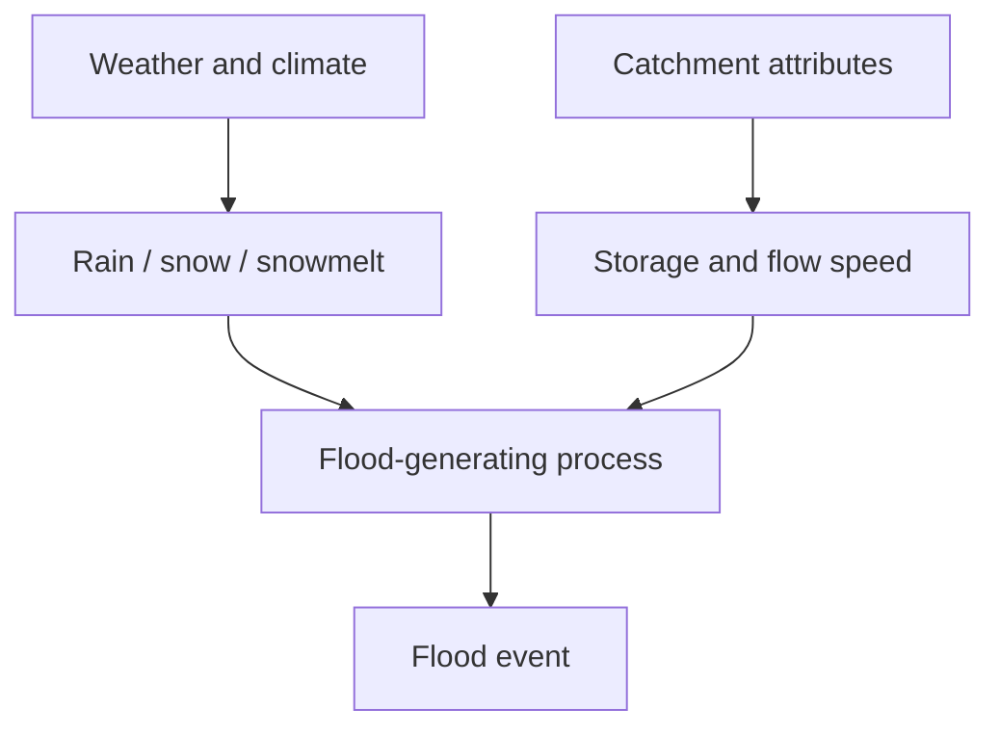
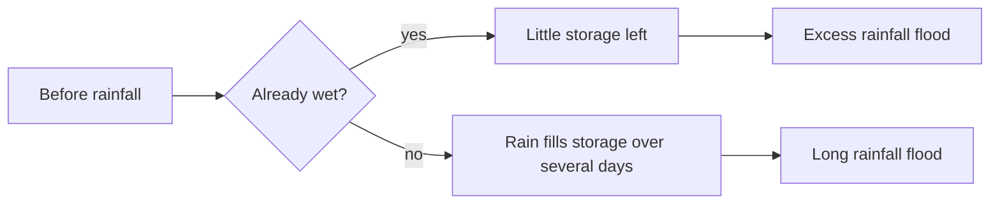
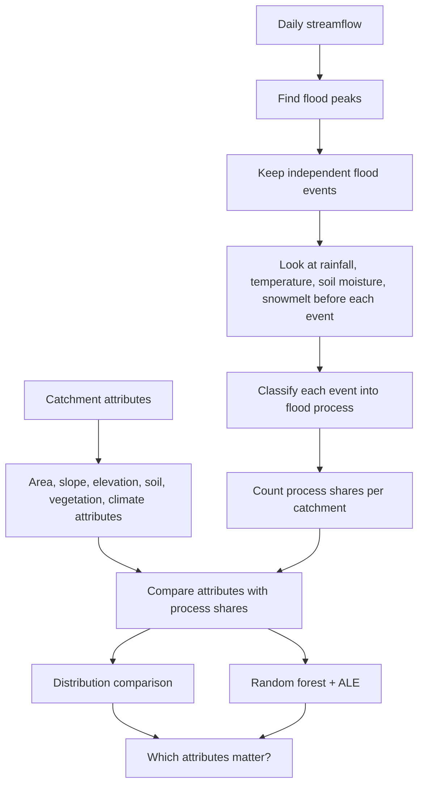
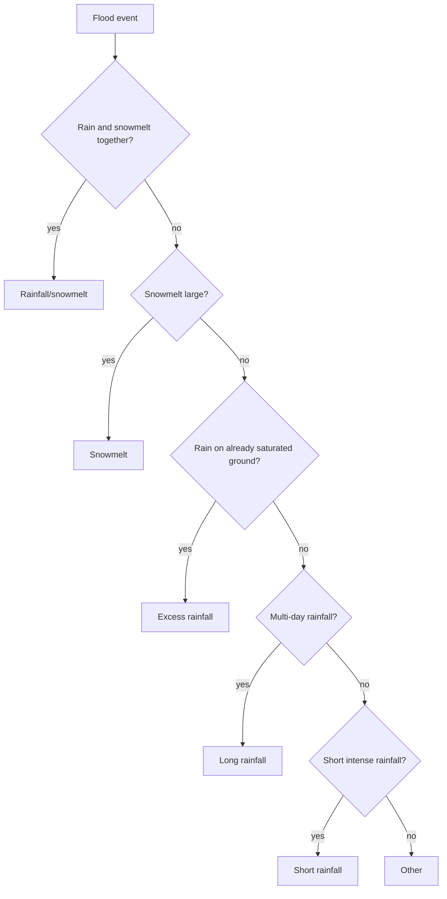
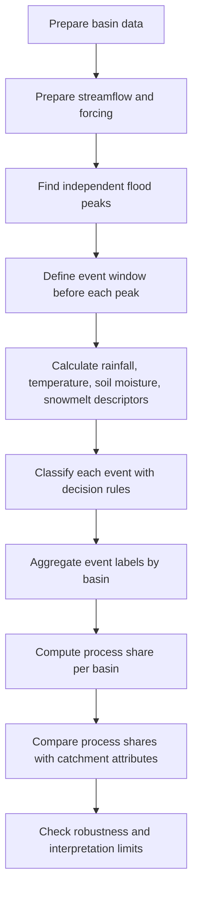
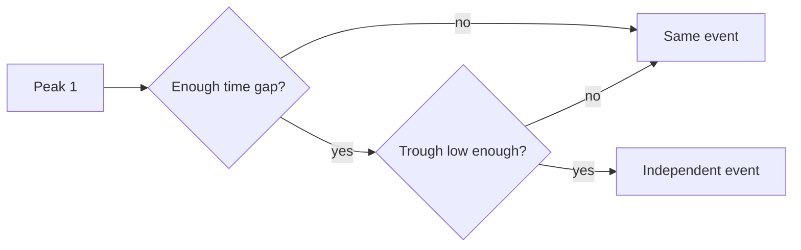
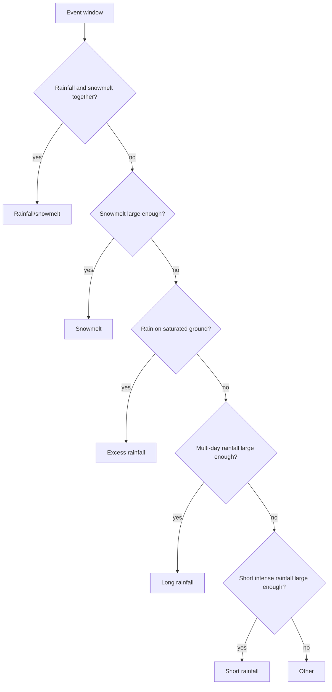
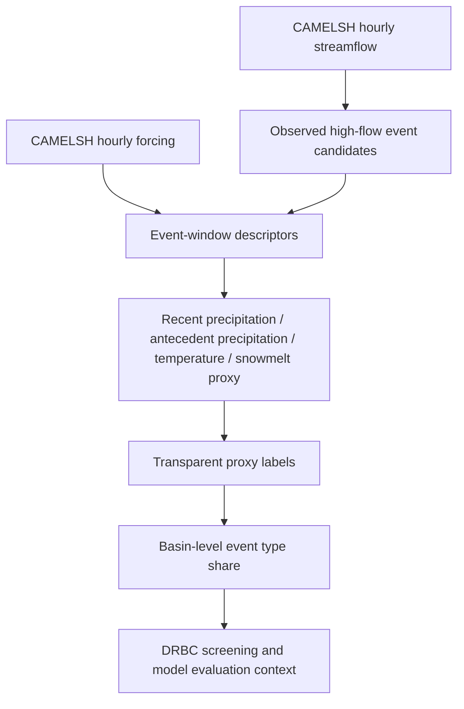

# Stein et al. (2021) 학부생용 해설

대상 논문은 Stein et al. (2021), “How Do Climate and Catchment Attributes Influence Flood Generating Processes?”이다. 원문 PDF는 [`stein_2021_wrr_climate_catchment_attributes_conus.pdf`](stein_2021_wrr_climate_catchment_attributes_conus.pdf)에 있고, 더 자세한 연구 메모는 [`stein_2021_wrr_climate_catchment_attributes_conus_study_notes.md`](stein_2021_wrr_climate_catchment_attributes_conus_study_notes.md)에 있다.

이 문서는 학부생이 처음 읽는다는 가정으로 쓴 쉬운 버전이다. 논문의 세부 통계나 ALE 수식보다, “이 논문이 무엇을 물었고, 어떤 자료로, 어떤 순서로 분석했는지”를 이해하는 데 초점을 둔다.

## 1. 이 논문의 질문

이 논문의 질문은 간단히 말하면 이렇다.

```text
왜 어떤 유역에서는 짧고 강한 비가 홍수를 만들고,
어떤 유역에서는 며칠간 이어지는 비가 홍수를 만들고,
어떤 유역에서는 눈 녹은 물이나 눈 위에 내린 비가 홍수를 만들까?
```

즉 이 논문은 단순히 “홍수가 얼마나 큰가”만 보는 논문이 아니다. 더 중요한 질문은 “그 홍수가 어떤 과정으로 만들어졌는가”다. 논문에서는 이것을 `flood-generating process`, 즉 홍수 생성 과정이라고 부른다.

논문의 큰 생각은 다음과 같다. 홍수는 기상 입력과 유역 성질이 함께 만들어낸 결과다. 비가 많이 오는 것만으로는 충분하지 않고, 그 비를 유역이 얼마나 저장하는지, 얼마나 빨리 하류로 보내는지도 중요하다.



## 2. 다섯 가지 홍수 생성 과정

Stein et al. (2021)은 홍수 사건을 다섯 가지 process로 나눈다. 이름이 어렵지만, 기본 아이디어는 비교적 직관적이다.

| 원문 | 쉬운 번역 | 쉽게 말하면 |
| --- | --- | --- |
| `excess rainfall` | 초과강우 홍수 | 유역이 이미 젖어 있거나 포화되어 있는데 비가 더 와서 물이 바로 흘러나가는 경우다. |
| `short rainfall` | 단기 강우 홍수 | 짧고 강한 비가 와서 빠르게 생기는 홍수다. |
| `long rainfall` | 장기 강우 홍수 | 며칠 동안 비가 계속 와서 유역 저장공간이 차오른 뒤 생기는 홍수다. |
| `snowmelt` | 융설 홍수 | 쌓여 있던 눈이 녹아서 생기는 홍수다. |
| `rainfall/snowmelt` | 강우-융설 복합 홍수 | 비와 눈 녹은 물이 같이 작용해서 생기는 홍수다. `rain-on-snow`와 비슷한 개념으로 보면 된다. |

가장 헷갈리기 쉬운 것은 `excess rainfall`과 `long rainfall`이다. 둘 다 비 때문에 생기지만, 차이는 비가 오기 전 유역 상태에 있다.

`excess rainfall`은 유역이 이미 젖어 있는 상태에서 비가 오는 경우다. 스펀지가 이미 물을 많이 머금고 있으면 물을 더 부었을 때 바로 넘치는 것과 비슷하다.

`long rainfall`은 처음에는 저장 여유가 있지만, 비가 며칠 동안 계속 오면서 그 저장공간이 점점 차고, 이후 runoff가 커지는 경우다.



## 3. 홍수에 영향을 주는 인자들

논문에서 말하는 인자는 크게 두 묶음으로 나눌 수 있다. 하나는 climate/weather 쪽 인자이고, 다른 하나는 catchment attributes다.

Climate/weather 쪽 인자는 “홍수를 만들 수 있는 물이 어떤 형태로 들어오는가”를 설명한다. 비가 짧고 강하게 오는지, 며칠 동안 오는지, 눈으로 쌓이는지, 눈이 녹는 시기에 비가 오는지가 여기에 해당한다.

Catchment attributes는 “들어온 물이 유역 안에서 어떻게 움직이는가”를 설명한다. 경사가 급한지, 면적이 작은지, 토양이 물을 많이 저장하는지, 숲이 많은지, 지하 저장공간이 큰지가 여기에 해당한다.

| 인자 | 쉬운 설명 | 홍수와의 관련 |
| --- | --- | --- |
| 강우 강도 | 비가 얼마나 세게 오는가 | 강한 비는 단기 강우 홍수를 만들기 쉽다. |
| 강수 계절성 | 비가 어느 계절에 많이 오는가 | 겨울에 비가 많고 evapotranspiration이 작으면 토양이 젖어 excess rainfall이 잘 생길 수 있다. |
| evapotranspiration | 증발산, 즉 물이 대기로 빠져나가는 과정 | evapotranspiration이 크면 토양이 마르기 쉬워 포화 상태가 덜 유지된다. |
| aridity | 건조도 | 건조한 유역은 평소 포화 상태가 아니므로 excess rainfall은 줄고, 짧고 강한 폭우가 중요해질 수 있다. |
| snow fraction | 강수 중 눈으로 내리는 비율 | 눈 비율이 높으면 snowmelt나 rain-on-snow 가능성이 커진다. |
| elevation | 고도 | 고도가 높으면 기온이 낮아 눈이 쌓이고 늦게 녹을 가능성이 커진다. |
| slope | 경사 | 경사가 급하면 물이 하류로 빨리 이동해 빠른 flood response가 나타날 수 있다. |
| area | 유역 면적 | 작은 유역은 짧은 폭우에 빠르게 반응하고, 큰 유역은 긴 강우나 넓은 storm이 더 중요할 수 있다. |
| shape | 유역 형상 | 둥근 유역은 여러 지점의 runoff가 outlet에 비슷한 시간에 도착해 peak가 커질 수 있다. |
| soil storage | 토양 저장능력 | 저장능력이 크면 비가 바로 runoff가 되지 않지만, 저장공간이 차면 큰 runoff가 생길 수 있다. |
| open-water storage | 습지, 호수, 저수지 같은 저장공간 | 물을 붙잡아 flood를 늦출 수 있지만, 이미 포화되어 있으면 추가 비가 바로 runoff가 될 수 있다. |
| geology / subsurface storage | 지질과 지하 저장공간 | 지하 저장공간이 크면 flood response가 완만해질 수 있다. |
| vegetation | 식생 | 침투를 늘리고 흐름을 늦춰 빠른 runoff를 줄일 수 있다. 눈 관련 과정에도 영향을 줄 수 있다. |

## 4. 이 논문에서 사용한 자료

이 논문은 미국 본토의 `671`개 CAMELS 유역을 사용한다. 자료 기간은 `1980-2014`년 daily data다. CAMELS는 수문학에서 많이 쓰는 유역 자료 모음이고, 이 논문에서는 streamflow, precipitation, temperature, catchment attributes를 함께 사용한다.

중요한 점은 Stein et al. (2021) 원논문은 CAMELS-US daily dataset의 Daymet forcing을 사용했다는 것이다. 여기서 Daymet forcing은 precipitation과 temperature 같은 기상 입력이다.

하지만 우리 CAMELSH 프로젝트에 적용할 때 Daymet을 새로 가져간다는 뜻은 아니다. CAMELSH에서는 CAMELSH hourly forcing을 사용해 같은 역할을 하는 변수를 만든다.

```text
Stein et al. (2021):
CAMELS daily streamflow + CAMELS Daymet precipitation/temperature

CAMELSH 적용:
CAMELSH hourly streamflow + CAMELSH hourly forcing precipitation/temperature
```

## 5. Methodology를 쉬운 말로 보기

논문의 방법론은 아래 흐름으로 이해하면 된다.



### 5.1 flood event를 먼저 찾는다

첫 단계는 streamflow time series에서 홍수 후보 event를 찾는 것이다. 논문은 `peaks-over-threshold` 방식을 사용한다. 쉽게 말해 유량 시계열에서 높은 peak를 찾고, 서로 너무 가까워 사실상 같은 홍수처럼 보이는 peak는 하나로 묶거나 제외한다.

논문은 두 가지 기준을 사용한다. 하나는 평균적으로 1년에 1개 정도 나오는 큰 event subset이고, 다른 하나는 평균적으로 1년에 3개 정도 나오는 더 넓은 event subset이다. 이렇게 한 이유는 큰 홍수와 중간 규모 홍수에서 유역 속성의 영향이 다를 수 있기 때문이다.

### 5.2 event마다 홍수 유형을 붙인다

두 번째 단계는 각 event가 어떤 process로 생겼는지 분류하는 것이다. 논문은 event 전 7일 동안의 precipitation, temperature, soil moisture, snowmelt estimate를 본다.

분류 순서는 대략 이렇다.



여기서 `rainfall/snowmelt`는 엄밀한 snow energy balance model로 진단한 것이 아니라, large-sample 분석을 위한 단순화된 분류다. 그래서 CAMELSH에서도 이 유형은 “확정된 rain-on-snow”라기보다 “snowmelt/rain-on-snow proxy”로 부르는 편이 안전하다.

### 5.3 유역을 climate type으로 나눈다

세 번째 단계는 유역을 기후 조건에 따라 나누는 것이다. 전체 미국을 한 번에 분석하면 너무 다양한 유역이 섞인다. 그래서 논문은 wet, dry, snow 세 그룹으로 나눈다.

| 그룹 | 기준 | 쉬운 의미 |
| --- | --- | --- |
| `wet` | PET/P < 1, snow fraction <= 20% | 강수량이 potential evapotranspiration보다 많아 비교적 습한 유역 |
| `dry` | PET/P > 1, snow fraction <= 20% | potential evapotranspiration이 강수량보다 커서 건조한 유역 |
| `snow` | snow fraction > 20% | 강수 중 눈의 비율이 높아 눈 관련 홍수가 중요할 수 있는 유역 |

이렇게 나누는 이유는 같은 attribute라도 기후에 따라 의미가 달라지기 때문이다. 예를 들어 vegetation이 많은 유역이라도 wet climate와 dry climate에서 runoff에 미치는 영향은 다를 수 있다.

### 5.4 첫 번째 분석: 분포 비교

첫 번째 분석 방법은 비교적 직관적이다. 특정 process가 자주 나타난 유역들이 어떤 attribute 값을 갖는지 보고, 전체 event의 attribute 분포와 비교한다.

예를 들어 dry climate 유역에서 short rainfall event가 많이 나온다고 하자. 그러면 short rainfall event가 나온 유역들의 slope, area, aridity, vegetation 값 분포를 만든다. 그리고 dry climate 전체 event의 attribute 분포와 비교한다. 두 분포가 많이 다르면, 그 attribute가 short rainfall process와 관련이 있을 가능성이 있다.

이 방법의 장점은 눈으로 이해하기 쉽다는 점이다. 특정 process가 작은 유역에서 더 자주 나오는지, 높은 고도에서 더 자주 나오는지, 건조한 유역에서 더 자주 나오는지 분포 차이로 볼 수 있다.

단점도 있다. event 수가 너무 적으면 분포가 불안정하다. 또 여러 attribute가 서로 강하게 연결되어 있으면, 어떤 attribute가 진짜 원인인지 분리하기 어렵다. 예를 들어 elevation이 높으면 snow fraction도 높고 slope도 클 수 있기 때문에, elevation 하나만의 효과라고 말하기 어렵다.

### 5.5 두 번째 분석: random forest와 ALE

두 번째 분석은 machine learning을 사용한다. 논문은 random forest를 이용해 catchment attributes만으로 각 유역의 flood process 비율을 예측한다.

예를 들어 어떤 유역에서 flood event의 70%가 excess rainfall이고 20%가 short rainfall이고 10%가 long rainfall이라면, random forest는 area, slope, aridity, elevation, vegetation 같은 attributes를 보고 이런 process percentage를 예측하려고 한다.

그다음 ALE를 사용해 random forest가 어떤 attribute를 중요하게 사용했는지 해석한다. ALE는 `Accumulated Local Effects`의 약자다. 쉽게 말하면 “다른 조건은 가능한 한 실제 자료 범위 안에 두고, 특정 attribute가 변할 때 모델 예측이 어떻게 바뀌는가”를 보는 방법이다.

일반적인 variable importance는 correlated attributes가 많을 때 해석이 흔들릴 수 있다. CAMELS attributes는 서로 상관이 강하다. 예를 들어 elevation, snow fraction, temperature, slope가 서로 연결될 수 있다. ALE는 이런 문제를 줄이기 위해 사용된다.


### 5.6 실제로는 어떤 순서로 진행하는가

Methodology를 실제 작업 절차처럼 풀면 아래 순서가 된다. 핵심은 “유역을 먼저 분류하는 것”이 아니라, “홍수 event를 먼저 찾고, event마다 원인을 추정한 뒤, 그 결과를 유역 단위로 다시 요약하는 것”이다.



첫째, 분석 가능한 유역을 정한다. Stein et al. (2021)은 미국 본토의 CAMELS 유역 `671`개를 사용했고, daily streamflow와 Daymet forcing을 연결했다. 여기서 중요한 경계조건은 모든 유역이 같은 수준의 자료 품질을 가져야 한다는 점이다. 어떤 유역은 유량 자료가 너무 짧거나 결측이 많고, 어떤 유역은 forcing과 streamflow 기간이 잘 맞지 않을 수 있다. 이런 유역을 그대로 넣으면 flood event 수와 process 비율이 자료 품질 차이에 의해 흔들릴 수 있다.

둘째, 유량 시계열에서 flood peak를 찾는다. 논문은 `peaks-over-threshold` 방식을 사용한다. 전체 기간 중 높은 peak들을 찾고, threshold보다 낮은 peak는 flood event 후보에서 제외한다. 이때 threshold는 “절대 유량 몇 m3/s 이상”처럼 고정하지 않고, 유역별 유량 분포를 기준으로 잡는다. 큰 유역과 작은 유역은 유량 규모가 다르기 때문에 같은 절대값을 쓰면 공정하지 않기 때문이다.

셋째, peak가 서로 독립적인지 확인한다. 서로 너무 가까운 peak들은 실제로는 하나의 긴 홍수 event 안에서 생긴 작은 굴곡일 수 있다. 논문은 두 peak 사이의 시간 간격과 중간 trough, 즉 두 peak 사이에서 유량이 얼마나 내려갔는지를 함께 본다. 중간 유량이 충분히 떨어지지 않았다면 두 peak를 별개의 event로 나누지 않는다.

넷째, 각 peak 앞의 일정 기간을 event window로 잡는다. 논문에서는 event 전 `7일`을 본다. 이 기간 동안 비가 왔는지, 눈이 녹았는지, 기온이 어떤 상태였는지, 토양이 이미 젖어 있었는지를 계산한다. 즉 peak 당일의 유량만 보는 것이 아니라, peak가 생기기 전 며칠 동안 유역에 무슨 일이 있었는지를 보는 것이다.

다섯째, decision tree로 event label을 붙인다. 하나의 event에는 `excess rainfall`, `short rainfall`, `long rainfall`, `snowmelt`, `rainfall/snowmelt` 중 하나가 붙을 수 있다. 어느 조건에도 잘 맞지 않으면 `other`로 둔다. 이 `other`는 “홍수가 아니다”라는 뜻이 아니라, 사용한 규칙만으로는 지배 process를 안정적으로 정하기 어렵다는 뜻에 가깝다.

여섯째, event label을 유역 단위로 집계한다. 예를 들어 어떤 유역에서 flood event가 30개 있고, 그중 18개가 excess rainfall, 9개가 long rainfall, 3개가 short rainfall이면 이 유역은 excess rainfall 비율이 60%, long rainfall 비율이 30%, short rainfall 비율이 10%인 유역으로 요약된다. 논문은 이 비율을 catchment attributes와 비교한다.

### 5.7 flood event 추출의 세부 기준

Flood event 추출에서 가장 중요한 문제는 “큰 peak를 찾는 것”보다 “같은 홍수를 여러 번 세지 않는 것”이다. 수문곡선은 한 번의 storm 뒤에도 여러 번 출렁일 수 있다. 이 출렁임을 모두 flood event로 세면 short rainfall이나 long rainfall 비율이 왜곡될 수 있다.

논문은 독립 peak를 판단할 때 두 가지 조건을 사용한다. 첫째, 두 peak 사이의 시간 간격이 유역의 평균 상승 시간보다 충분히 길어야 한다. 평균 상승 시간은 유량이 rising limb를 따라 올라가는 대표 시간으로 보면 된다. 둘째, 두 peak 사이의 trough가 앞 peak의 `2/3`보다 낮아야 한다. 쉽게 말해 첫 peak 이후 유량이 충분히 내려갔다가 다시 올라야 새로운 event로 인정한다.



논문은 event 규모에 대해서도 두 가지 기준을 둔다. 하나는 평균적으로 `1년에 1개` 정도 나오는 큰 event subset이고, 다른 하나는 평균적으로 `1년에 3개` 정도 나오는 넓은 event subset이다. 본문 분석은 주로 `3 events per year` 기준을 사용하고, `1 event per year` 기준은 결과가 큰 홍수만 봐도 비슷한지 확인하는 robustness check에 가깝다.

이 선택에는 이유가 있다. 아주 큰 홍수에서는 storm 자체가 너무 강해서 유역 속성의 차이가 상대적으로 덜 보일 수 있다. 반대로 중간 규모 홍수까지 포함하면 soil, vegetation, storage, slope 같은 유역 특성의 영향이 더 잘 드러날 수 있다. 그래서 논문은 flood magnitude threshold 하나만 고정하지 않고, event 규모가 달라져도 결론이 유지되는지 확인한다.

### 5.8 process classification의 경계조건

Event label을 붙이는 단계에서는 몇 가지 경계조건을 분명히 이해해야 한다. 먼저 논문은 full physical model로 모든 홍수 원인을 재현한 것이 아니다. precipitation, temperature, 간단한 soil moisture estimate, snowmelt estimate를 이용해 large-sample에 적용 가능한 operational classification을 만든 것이다.

분류는 event 전 `7일` window를 기준으로 한다. 이 기간 안에서 rainfall과 snowmelt가 함께 있었는지, snowmelt가 충분히 컸는지, 강우 전에 토양이 이미 젖어 있었는지, 강우가 며칠 동안 이어졌는지, 짧고 강한 강우가 있었는지를 차례로 본다. Snowfall과 melt를 구분할 때는 critical temperature `1°C`를 사용한다.

분류 순서도 중요하다. 어떤 event는 비도 오고 눈도 녹고 토양도 젖어 있을 수 있다. 이런 경우 모든 process가 조금씩 관련될 수 있지만, 분석에서는 하나의 대표 label을 붙여야 한다. 그래서 decision tree는 `rainfall/snowmelt`와 `snowmelt` 같은 snow-related condition을 먼저 확인하고, 그다음 `excess rainfall`, `long rainfall`, `short rainfall` 순서로 본다.



Threshold는 모든 유역에 같은 절대값으로 주지 않는다. 예를 들어 “강수량이 30 mm/day 이상이면 short rainfall”처럼 하면 습한 유역과 건조한 유역을 공정하게 비교하기 어렵다. Stein et al. (2021)은 decision tree 구조는 모든 유역에 공통으로 적용하되, threshold는 각 유역의 hydrometeorological time series 분포를 바탕으로 정한다. 이 방식은 미국 전체처럼 기후 차이가 큰 영역을 한 번에 분석할 때 중요하다.

따라서 이 classification은 “이 event의 원인을 완벽히 증명했다”가 아니라 “같은 규칙을 많은 유역에 적용했을 때, 이 event는 어떤 process에 가장 가깝게 분류된다”는 뜻으로 읽어야 한다. 특히 `rainfall/snowmelt`는 strict한 snow energy balance 진단이 아니므로, 확정적인 rain-on-snow event라기보다 simplified rain-on-snow 또는 snowmelt/rainfall proxy에 가깝다.

### 5.9 climate type과 attribute 분석의 경계조건

논문은 전체 유역을 한꺼번에 분석하지 않고 `wet`, `dry`, `snow` 세 그룹으로 나눈다. 이 stratification은 단순한 편의가 아니라 중요한 방법론적 장치다. 미국 전체 유역을 한 번에 보면 aridity, snow fraction, elevation, temperature 같은 큰 climate gradient가 너무 강해서 slope, soil, vegetation 같은 catchment attribute의 효과를 보기 어려워질 수 있다.

기준은 단순하다. `PET/P < 1`이고 snow fraction이 20% 이하이면 `wet`, `PET/P > 1`이고 snow fraction이 20% 이하이면 `dry`, snow fraction이 20%보다 크면 aridity와 상관없이 `snow`로 둔다. 여기서 `20%`는 절대적인 자연 법칙이 아니라 operational threshold다. 선행연구와 표본 균형을 고려해 snow influence가 의미 있는 유역을 묶기 위해 선택한 기준으로 보면 된다.

Attribute 분석에서도 경계조건이 있다. 논문은 categorical attribute를 제외하고 continuous attribute 중심으로 분석한다. 이유는 frequency distribution comparison과 ALE가 같은 predictor set을 보도록 맞추기 위해서다. 또 유역 형상을 나타내기 위해 elongation ratio를 추가로 계산한다. 이 값은 둥근 유역인지 길쭉한 유역인지 나타내는 shape proxy다.

Frequency distribution comparison에서는 process-specific event들의 attribute 분포와 전체 event의 attribute 분포를 비교한다. 여기서 어떤 유역에서 같은 process event가 많이 발생하면, 그 유역의 attribute 값이 distribution에 여러 번 들어간다. 즉 이 분석은 “유역 수 기준”이 아니라 “event contribution 기준”으로 attribute 분포를 보는 방식이다.

이 방법은 직관적이지만 한계도 있다. 어떤 process event 수가 너무 적으면 분포 비교가 불안정하다. 또 ECDF curve가 중간에 서로 교차하면 평균 차이가 작게 나와서 실제 차이가 약해 보일 수 있다. 그래서 논문은 숫자 하나만 보지 않고, event sample size와 curve 형태도 함께 확인한다.

### 5.10 random forest와 ALE를 실행할 때의 세부 절차

Random forest 단계에서 예측 대상은 개별 event label이 아니다. 예측 대상은 유역별 process contribution, 즉 “이 유역의 flood event 중 특정 process가 몇 퍼센트인가”이다. 예를 들어 wet climate 유역에서 excess rainfall 비율을 예측하는 모델, dry climate 유역에서 short rainfall 비율을 예측하는 모델처럼 climate type과 process 조합별로 따로 모델을 만든다.

이렇게 나누는 이유는 같은 attribute라도 climate type에 따라 의미가 달라지기 때문이다. 예를 들어 slope가 큰 유역은 어떤 곳에서는 short rainfall response와 연결될 수 있지만, snow-influenced basin에서는 snowmelt water가 얼마나 빨리 전달되는지와 더 관련될 수 있다. 하나의 global random forest로 모든 process를 한꺼번에 설명하면 이런 차이가 흐려질 수 있다.

모델 성능은 `10-fold cross-validation`으로 본다. 전체 유역을 10개 그룹으로 나누고, 9개 그룹으로 학습한 뒤 남은 1개 그룹에서 평가한다. 이 과정을 10번 반복하면 모든 유역이 한 번씩 validation에 쓰인다. 성능 지표는 `R2`다. Training score가 아니라 cross-validation score를 보는 이유는 random forest가 training data에 잘 맞는 것과 새로운 유역에 대해 설명력이 있는 것은 다르기 때문이다.

논문은 random forest의 random seed에도 의존하지 않도록 `50`개 seed로 반복한다. Random forest는 bootstrap sample과 tree split 과정에 randomness가 들어가기 때문에, 한 seed에서만 나온 attribute ranking을 그대로 믿으면 위험하다. 여러 seed에서 비슷한 결과가 나오면 더 안정적인 pattern으로 볼 수 있다.

ALE는 random forest가 배운 관계를 해석하기 위해 사용된다. Partial dependence plot처럼 attribute 하나를 바꿔 보는 방법이지만, 실제 data가 존재하는 범위 안에서 local effect를 계산한다는 점이 중요하다. CAMELS attributes는 서로 상관이 강하기 때문에, 실제로 거의 존재하지 않는 조합을 억지로 만들어 해석하면 잘못된 결론이 나올 수 있다. ALE는 이런 위험을 줄이기 위한 선택이다.

다만 ALE도 causal effect를 증명하지는 않는다. ALE curve는 “random forest 모델이 이 attribute 변화에 어떻게 반응하는지”를 보여주는 것이지, field experiment처럼 해당 attribute만 바꿨을 때 실제 홍수가 어떻게 변하는지를 직접 관측한 결과는 아니다. 특히 cross-validation `R2`가 낮은 process-climate 조합에서는 ALE ranking도 조심해서 읽어야 한다.

### 5.11 CAMELSH에 적용할 때의 진행 방법

CAMELSH 프로젝트에서 이 methodology를 가져올 때는 원논문을 그대로 복제하기보다, 같은 논리를 hourly 자료와 DRBC holdout 연구 질문에 맞게 바꾸는 것이 좋다.

먼저 event-first 원칙은 유지한다. DRBC basin을 “이 유역은 snowmelt basin이다”처럼 처음부터 하나의 type으로 고정하지 않고, hourly streamflow에서 observed high-flow event candidate를 찾는다. 그다음 event 전 window에서 precipitation, antecedent precipitation, temperature, 필요하면 degree-day snowmelt proxy를 계산한다. 마지막으로 event label 또는 proxy label을 붙인 뒤, basin별 type share와 dominant/mixture 여부를 저장한다.



여기서 label 이름은 조심해서 정하는 편이 안전하다. CAMELSH에 SWE, snowpack liquid water content, full snow energy balance가 없으면 `confirmed rain-on-snow`라고 쓰기 어렵다. 대신 `degree-day snowmelt proxy`, `rainfall/snowmelt proxy`, `winter/spring mixed precipitation proxy`처럼 자료가 실제로 뒷받침하는 수준으로 표현하는 것이 좋다.

또 DRBC 연구에서 이 event typing은 main contribution이 아니라 model evaluation을 해석하기 위한 보조 진단에 가깝다. 따라서 official flood inventory처럼 말하지 말고 `observed high-flow event candidate`라고 두는 편이 방어 가능하다. 이 표현은 “관측 유량에서 큰 event로 잡혔다”는 뜻이지, 피해가 발생한 공식 홍수라는 뜻은 아니다.

CAMELSH 적용 시 경계조건을 정리하면 다음과 같다.

| 항목 | Stein et al. (2021) | CAMELSH 적용 시 권장 해석 |
| --- | --- | --- |
| 자료 해상도 | daily | hourly를 쓰되 event window는 목적에 맞게 hours/days로 재정의 |
| forcing source | CAMELS Daymet | CAMELSH hourly forcing |
| event 이름 | flood event | observed high-flow event candidate |
| snow diagnosis | simple snowmelt estimate | degree-day 또는 temperature-based proxy |
| rain-on-snow | rainfall/snowmelt operational class | confirmed class가 아니라 proxy class |
| event label | five process labels + other | recent rainfall, antecedent wetness, long rainfall, snowmelt/mixed proxy, uncertain 등으로 단순화 가능 |
| basin summary | process contribution per catchment | DRBC basin별 type share, dominant type, mixture/uncertain share |

이렇게 하면 Stein et al.의 장점, 즉 event-first 접근과 basin-level process share라는 아이디어는 가져오면서도, CAMELSH 자료가 직접 보장하지 못하는 snow physics나 causal attribution을 과하게 주장하지 않을 수 있다.

## 6. 이 논문 결과를 아주 간단히 말하면

논문의 결과를 학부생 수준에서 요약하면 다음과 같다.

첫째, 기후 관련 인자가 가장 중요하다. 특히 snow fraction, aridity, precipitation seasonality, mean precipitation이 flood process distribution에 큰 영향을 준다.

둘째, wet catchments에서는 excess rainfall이 매우 흔하다. 이미 습한 환경에서는 유역이 포화되기 쉬워, 추가 강우가 runoff로 이어지는 경우가 많다.

셋째, dry catchments에서는 short rainfall과 long rainfall이 상대적으로 중요해진다. 평소에는 건조하지만, 짧고 강한 storm이나 며칠간의 비가 flood를 만들 수 있다.

넷째, snow catchments에서는 elevation과 snow-related conditions가 중요하다. 눈이 쌓이고 녹는 조건, 비와 눈 녹은 물이 함께 작용하는 조건이 flood process를 바꾼다.

다섯째, catchment attributes의 영향은 기후별로 다르게 나타난다. 같은 slope, vegetation, soil attribute라도 wet, dry, snow basin에서 의미가 달라질 수 있다.

## 7. CAMELSH 연구와 연결해서 이해하기

우리 CAMELSH 프로젝트에서 이 논문은 flood typing을 설계할 때 중요한 참고문헌이다. 하지만 Stein et al. (2021)의 방법을 그대로 복사하는 것이 목표는 아니다.

가져갈 핵심 원칙은 세 가지다.

첫째, basin을 처음부터 하나의 flood type으로 고정하지 않는다. 먼저 event를 찾고, event마다 어떤 forcing이 중요했는지 본 뒤, 그 event label들을 basin level로 요약하는 방식이 더 안전하다.

둘째, climate와 catchment attributes를 구분해서 해석한다. 강수, 온도, snow fraction, aridity는 어떤 flood process가 가능한지를 크게 결정한다. 반면 slope, area, soil, vegetation은 들어온 물이 얼마나 빨리 runoff로 바뀌는지를 설명한다.

셋째, CAMELSH에서는 Daymet이 아니라 CAMELSH hourly forcing을 사용한다. 따라서 Stein 원논문의 Daymet precipitation/temperature는 “어떤 종류의 forcing이 필요한가”를 보여주는 참고이고, 실제 구현 source는 CAMELSH forcing이다.

CAMELSH에 맞춰 단순화하면 아래처럼 볼 수 있다.

| Stein et al. (2021) 개념 | CAMELSH 적용 |
| --- | --- |
| daily streamflow에서 flood peak 추출 | hourly streamflow에서 observed high-flow event candidate 추출 |
| Daymet precipitation/temperature | CAMELSH hourly forcing의 precipitation/temperature |
| soil moisture and snowmelt estimate | antecedent rainfall, degree-day snowmelt proxy 등으로 단순화 |
| five flood-generating processes | recent precipitation, antecedent precipitation, snowmelt/rain-on-snow proxy, uncertain class |
| process contribution per catchment | basin별 event type share와 dominant/mixture label |

## 8. 읽을 때 조심할 점

이 논문은 “이 attribute가 flood를 직접 일으켰다”라고 단정하는 논문이 아니다. 더 정확히는 “어떤 attribute 값을 가진 유역에서 어떤 flood process가 더 자주 나타나는가”를 large-sample로 분석한 논문이다.

또 `rainfall/snowmelt` classification은 실제 snowpack energy balance를 완전히 계산한 것이 아니다. 따라서 이 label은 물리적으로 그럴듯한 process proxy로 이해해야 한다.

마지막으로, soil이나 geology가 결과에서 약하게 보인다고 해서 중요하지 않다는 뜻은 아니다. 기후 인자가 너무 강하거나, 사용 가능한 soil/geology attribute가 실제 지하 저장과 흐름을 충분히 표현하지 못했을 수 있다.

## 9. 최소 용어 정리

| 용어 | 쉬운 뜻 |
| --- | --- |
| `catchment` | 유역. 비가 내려 하나의 outlet으로 모이는 영역이다. |
| `forcing` | 유역에 작용하는 외부 입력이다. 강수, 기온 등이 대표적이다. |
| `runoff` | 비나 눈 녹은 물 중 하천으로 흘러가는 물이다. |
| `antecedent condition` | 홍수 전 유역 상태다. 토양이 젖었는지, 눈이 어떤 상태인지 등을 포함한다. |
| `evapotranspiration` | 증발산이다. 지표 증발과 식물 증산을 합친 물 손실 과정이다. |
| `PET` | 잠재증발산량이다. 물이 충분할 때 대기가 가져갈 수 있는 물의 양이다. |
| `aridity` | 건조도다. PET/P가 클수록 더 건조하다고 본다. |
| `snowpack` | 지표 위에 쌓인 눈층과 그 내부 상태다. |
| `response time` | 비가 온 뒤 유역 outlet 유량이 반응하는 데 걸리는 대표 시간이다. |
| `infiltration capacity` | 토양이 물을 받아들일 수 있는 최대 속도다. |
| `saturation` | 토양이나 저장공간이 물로 거의 찬 상태다. |
| `ALE` | 모델이 특정 attribute 변화에 어떻게 반응하는지 보는 해석 방법이다. |
