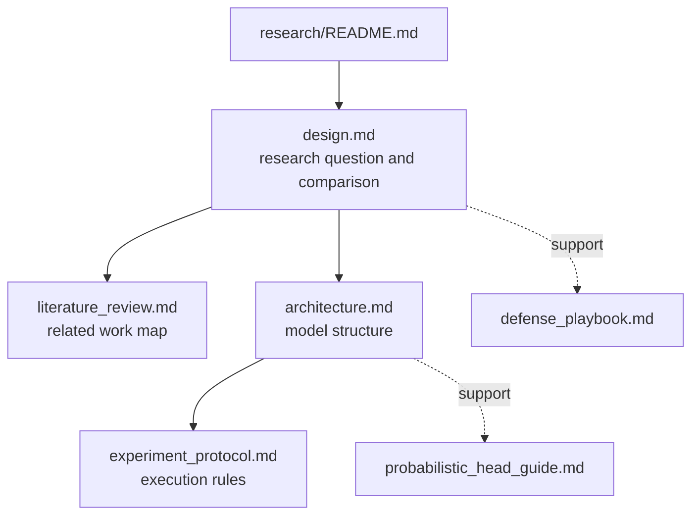

# Research Docs

이 폴더는 연구 질문, 모델 구조, 실험 규범을 정리한다. canonical 문서가 비교 실험의 source of truth이고, support 문서는 설명과 검토를 보강한다.

현재 논문의 공식 비교 대상은 Model 1 deterministic baseline과 Model 2 probabilistic baseline이다. Model 3 physics-guided hybrid는 저장소에 개념 메모를 남겨 두되, 이 폴더에서는 후속 확장 방향으로만 읽는 것이 맞다.

## Structure

## Canonical docs

| Document | Role |
| --- | --- |
| [`design.md`](design.md) | 연구 질문, 비교축, 평가 방향을 정리한다. |
| [`architecture.md`](architecture.md) | 현재 논문의 Model 1과 Model 2 구조를 고정하고, 저장소에 남겨 둔 Model 3 개념의 위치를 후속 확장으로 정리한다. |
| [`experiment_protocol.md`](experiment_protocol.md) | 현재 논문 비교의 split, loss, metric, config 규칙을 고정한다. |
| [`literature_review.md`](literature_review.md) | related work의 축과 인용 방향을 정리한다. |

## Support docs

| Document | Role |
| --- | --- |
| [`probabilistic_head_guide.md`](probabilistic_head_guide.md) | Model 2 probabilistic head의 직관과 설계 이유를 설명한다. |
| [`defense_playbook.md`](defense_playbook.md) | 현재 two-model paper scope에서 예상 질문과 취약 지점을 점검한다. |

## Recommended order

1. [`design.md`](design.md)
2. [`literature_review.md`](literature_review.md)
3. [`architecture.md`](architecture.md)
4. [`experiment_protocol.md`](experiment_protocol.md)
5. 필요할 때 [`probabilistic_head_guide.md`](probabilistic_head_guide.md)
6. 방어 논리 점검이 필요할 때 [`defense_playbook.md`](defense_playbook.md)
