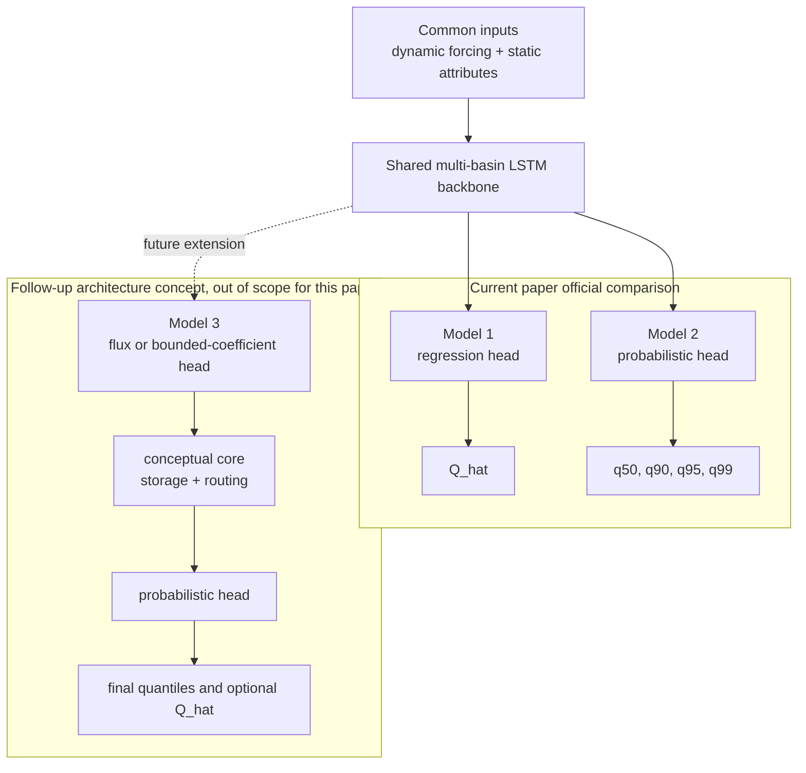
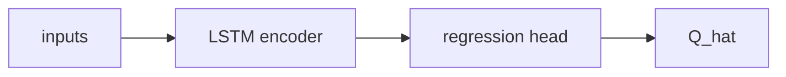
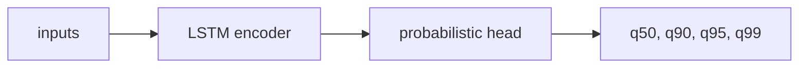
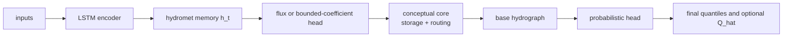
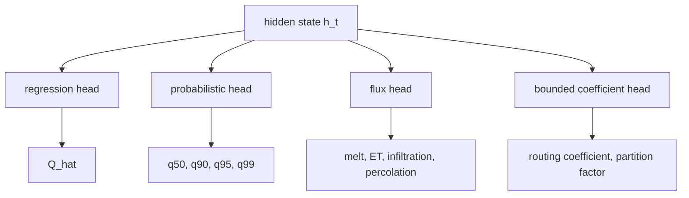

# 모델 구조와 아키텍처

## 서술 목적

이 문서는 현재 논문에서 비교하는 모델의 `구성 요소와 연결 방식`을 정리한다. 즉 `head가 무엇을 내는지`, `현재 논문에서 무엇을 공식 비교하는지`, `Model 3를 어디까지 후속 개념으로 남겨 두는지`를 설명한다.

## 다루는 범위

- 현재 논문의 공식 비교인 deterministic LSTM과 probabilistic LSTM의 구조 비교
- head와 shared backbone의 역할 구분
- Model 3 physics-guided hybrid를 follow-up architecture concept로 위치시키는 원칙

## 다루지 않는 범위

- 연구 질문과 비교 가설의 상세 해석
- exact split 규칙과 config key
- quantile head의 학부 수준 직관 설명

## 상세 서술

## 현재 논문의 공식 구조

현재 논문의 공식 비교는 하나의 shared multi-basin LSTM backbone 위에서 regression head와 probabilistic head를 바꿔 붙이는 두 모델이다. Model 3는 저장소에 남겨 두지만, 아래 도식에서도 `follow-up architecture concept`로만 위치시킨다.

1. `Deterministic multi-basin LSTM`
2. `Probabilistic multi-basin LSTM`

현재 논문의 구조를 이렇게 고정하는 이유는 성능 차이를 먼저 `출력 head 변화`의 효과로 해석하기 위해서다. Physics-guided core는 그다음 단계에서만 해석 가능한 확장으로 남겨 둔다.

## 공통 입력

현재 논문의 공식 비교 모델 두 개와 follow-up concept 모두 아래 입력에서 출발한다.

- dynamic forcing: `prcp`, `tmax`, `tmin`, `srad`, `vp`, 필요 시 `PET`
- static attributes: 면적, 평균 경사, aridity, snow fraction, soil depth, permeability, baseflow index 등
- 선택적 lagged obs: 후속 실험에서 `lagged Q`를 넣을 수 있음

현재 설계의 기본 단위는 `non-DRBC CAMELSH global training -> DRBC holdout basin evaluation` 구조 위의 multi-basin hourly streamflow prediction이다. 따라서 현재 backbone은 특정 지역에 맞춘 regional model이 아니라, 다양한 basin에서 공통 표현을 학습하는 `global multi-basin model`로 이해해야 한다.

## 1. Deterministic LSTM

가장 단순한 baseline이다.

LSTM은 hidden state `h_t`를 만들고, regression head는 이를 최종 유량 `Q_hat`으로 바꾼다. 이 모델은 평균적인 수문곡선을 맞추는 기준선이다.

## 2. Probabilistic LSTM

두 번째 모델은 backbone은 그대로 두고 출력층만 바꾼다.

핵심은 point estimate 대신 `upper-tail quantiles`를 직접 예측하게 만드는 것이다. 이렇게 해야 평균 회귀로 생기는 `peak underestimation`을 더 직접적으로 줄일 수 있다.

이 단계에서의 핵심 질문은 이것이다. `physics guidance 없이 probabilistic output만으로도 extreme flood peak bias를 얼마나 줄일 수 있는가?`

## 3. 후속 아키텍처 개념: Physics-guided probabilistic hybrid

Model 3는 probabilistic LSTM 위에 conceptual core를 추가하는 follow-up architecture concept다. 현재 논문의 공식 비교 대상은 아니지만, 이후 확장 방향을 명확히 해 두기 위해 구조 메모는 유지한다. 다만 `To bucket or not to bucket?`에서 비판받은 naïve dynamic-parameter hybrid를 그대로 쓰지 않는다.

우리가 후속으로 지향하는 구조는 다음과 같다.

여기서 중요한 점은 LSTM이 conceptual model의 파라미터 전체 `θ_t`를 시점별로 마음대로 바꾸는 것이 아니라, `melt`, `ET`, `infiltration`, `percolation`, `routing coefficient` 같은 제한된 flux 또는 bounded coefficient만 제안하도록 하는 것이다.

이 구조의 장점은 세 가지다.

- physics의 역할이 단순 장식이 아니라 실제 `state update`와 `routing`에 들어감
- AI가 physics를 덮어쓰는 정도를 줄일 수 있음
- probabilistic head와 결합해 peak magnitude와 tail risk를 동시에 다룰 수 있음

## conceptual core의 기본 상태 변수

Model 3를 후속으로 구현한다면, 복잡도를 과도하게 높이지 않고 다음과 같은 상태 변수로 시작하는 것이 적절하다.

- `snow storage`
- `soil storage`
- `fast runoff storage`
- `slow/baseflow storage`
- 필요 시 `channel/routing storage`

이 상태들은 물수지와 runoff generation을 표현하는 최소 골격이다.

## head의 역할 구분

현재 논문의 공식 head는 `regression head`와 `probabilistic head`다. `flux head`와 `bounded coefficient head`는 Model 3 follow-up concept에서만 사용한다.

- `regression head`: `h_t -> Q_hat`
- `probabilistic head`: `h_t -> q50, q90, q95, q99`
- `flux head`: `h_t -> melt, ET, infiltration, percolation ...`
- `bounded coefficient head`: `h_t -> routing coefficient, partition factor ...`

즉 LSTM의 본래 출력은 hidden state `h_t`이고, 우리가 보는 값은 각 head가 `h_t`를 해석한 결과다.

## 문서 정리

1. backbone은 첫 논문에서 `multi-basin LSTM`으로 고정한다.
2. 현재 논문의 공식 비교는 regression head와 probabilistic head의 차이만 본다.
3. physics-guided core는 후속 비교축으로 남겨 두되, `dynamic-parameter shell`이 아니라 `state/flux-constrained` 구조로 설계한다.
4. 첫 논문은 CAMELSH hourly 기반 extreme flood response에 집중하고, sub-hourly flash flood와 Model 3 검증은 후속 연구 주제로 분리한다.

## 관련 문서

- [`design.md`](design.md): 연구 질문과 비교 가설
- [`experiment_protocol.md`](experiment_protocol.md): split, loss, metric, config key
- [`probabilistic_head_guide.md`](probabilistic_head_guide.md): quantile head의 직관 설명
