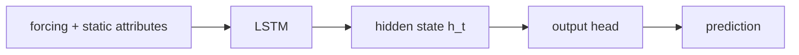
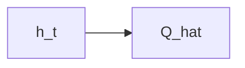
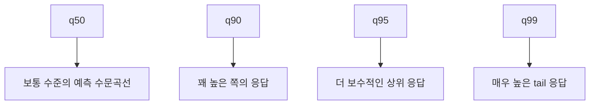
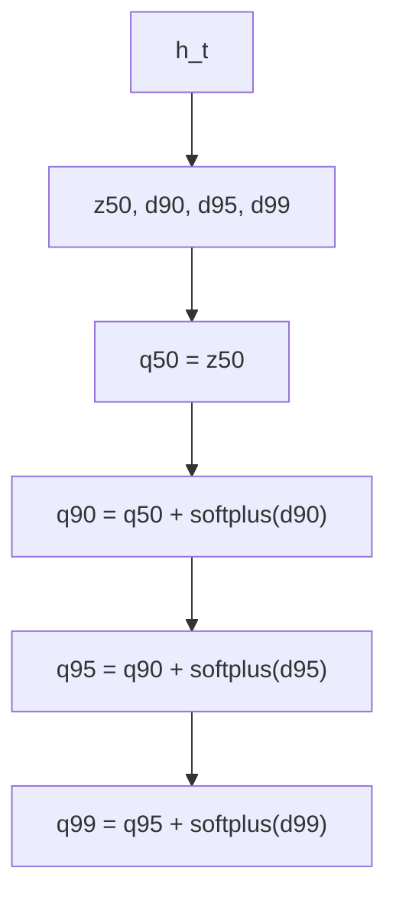
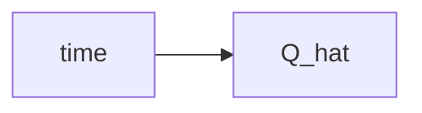
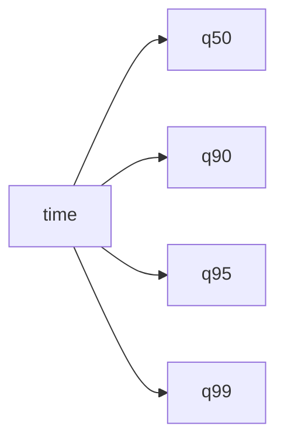
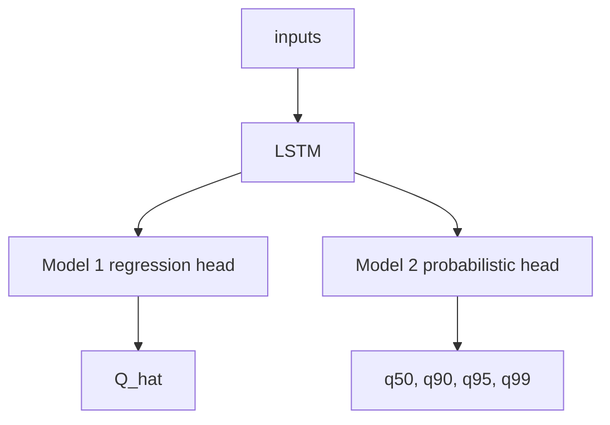

# Probabilistic Head Guide

## 서술 목적

이 문서는 현재 프로젝트의 `probabilistic head`가 무엇이고 왜 필요한지 설명한다. 수문학과 토목공학 학부 수준을 기준으로, 수식은 최소화하고 구조의 이유를 직관적으로 설명하는 것이 목적이다.

## 다루는 범위

- deterministic output과 probabilistic quantile output의 차이
- quantile head의 구조와 pinball loss의 직관
- 현재 프로젝트에서 head를 쓰는 이유와 구현 방향

## 다루지 않는 범위

- 실험 split과 metric 계산 규칙 전체
- NeuralHydrology 내부 구현 세부 코드
- physics-guided hybrid의 상세 설계와 후속 실험 범위

## 상세 서술

즉 이 문서는 `개념 설명`이 목적이다. 실제 key와 metric 규칙은 [`experiment_protocol.md`](experiment_protocol.md), 현재 논문의 backbone과 head 비교 구조는 [`architecture.md`](architecture.md)에서 다룬다.

## 한 줄 요약

기존 deterministic LSTM은 매 시점마다 유량 하나만 예측한다. 반면 probabilistic head는 같은 시점에 대해 `중앙값(q50)`과 `상위 유량 범위(q90, q95, q99)`를 함께 예측해서, 특히 홍수 첨두처럼 드물고 큰 값을 더 직접적으로 다루려는 구조다.

## 먼저, head가 무엇인가

LSTM은 입력 시계열을 읽어 내부 상태 `h_t`를 만든다. 우리가 보고 싶은 유량은 이 `h_t`를 마지막 출력층이 해석해 만든다. 이 출력층이 `head`다.

현재 프로젝트에서 생각하는 구조는 아래처럼 보면 된다.

여기서 deterministic model의 head는 `유량 하나`를 내고, probabilistic model의 head는 `여러 quantile`을 낸다.

## deterministic output이 왜 아쉬운가

deterministic model은 매 시점에 하나의 값만 예측한다.

이 방식은 평균적인 상황에서는 잘 작동할 수 있다. 하지만 수문 자료에서는 평범한 유량이 대부분이고 큰 홍수 첨두는 드물다. 그래서 모델은 학습 과정에서 `대부분의 시간에 손해를 덜 보는 방향`으로 가기 쉽고, 그 결과 첨두를 조금 눌러서 예측하는 경향이 생길 수 있다. 현재 프로젝트가 보는 `extreme flood underestimation`이 바로 이 지점과 연결된다.

## probabilistic head는 무엇을 추가하나

probabilistic head는 한 시점의 유량을 하나의 숫자로만 보지 않고, 가능한 범위를 여러 quantile로 요약한다.

현재 프로젝트의 첫 번째 설계안은 아래 네 개를 예측하는 것이다.

- `q50`
- `q90`
- `q95`
- `q99`

직관적으로 보면 이렇다.

- `q50`은 중앙값에 해당하는 대표 예측이다. 가장 전형적인 유량 수준을 나타낸다.
- `q90`, `q95`, `q99`는 점점 더 높은 상위 유량 범위를 나타낸다.

여기서 중요한 점은 `q99`가 “99년 빈도 홍수” 같은 return period 개념이 아니라는 점이다. 이건 빈도해석의 재현기간과 같은 말이 아니다. 이 모델의 quantile은 `해당 시점의 조건에서 모델이 예측한 상위 분포 위치`라고 이해해야 한다.

## 수문학적으로 어떻게 이해하면 좋은가

토목 쪽 감각으로 보면 deterministic model은 `이 시간의 유량은 이 값이다`라고 한 줄만 그리는 방식에 가깝다. 반면 probabilistic head는 `중심선 하나 + 상위 위험선 몇 개`를 같이 그리는 방식에 가깝다.

예를 들어 어떤 강우 event 동안 아래처럼 볼 수 있다.

그러면 우리는 단순히 “평균적으로 맞았는가”만 보는 것이 아니라, “큰 첨두를 열어 줄 준비가 되어 있는가”를 함께 볼 수 있다.

이 프로젝트에서 probabilistic head를 현재 논문 비교축에 두는 이유도 여기 있다. 먼저 `출력 설계만 바꿔도 peak bias가 줄어드는지`를 확인하려는 것이다. physics-guided hybrid는 그 다음에 별도 후속 확장으로 검토할 수 있다.

## 현재 프로젝트에서 생각하는 head 구조

가장 단순한 생각은 `h_t`에서 바로 4개의 값을 뽑는 것이다.

$$
h_t \rightarrow [q_{50}, q_{90}, q_{95}, q_{99}]
$$

하지만 이렇게 단순하게 두면 문제가 하나 생긴다. 학습 중에 아래처럼 이상한 결과가 나올 수 있다.

$$
q_{95} < q_{90}
$$

이건 말이 안 된다. 상위 95% quantile은 90% quantile보다 낮으면 안 되기 때문이다. 이런 문제를 `quantile crossing`이라고 부른다.

그래서 현재 프로젝트에서는 아래처럼 `증분(increment)` 구조를 쓰는 것이 더 적절하다.

여기서 `softplus`는 입력을 항상 양수로 바꾸는 함수라고 생각하면 된다.

즉,

- `d90`는 `q50`에서 `q90`까지 올라가는 양
- `d95`는 `q90`에서 `q95`까지 더 올라가는 양
- `d99`는 `q95`에서 `q99`까지 더 올라가는 양

을 뜻한다.

이렇게 하면 구조적으로 아래 순서가 자동으로 보장된다.

이게 이 구조의 가장 큰 장점이다. 모델이 “상위 quantile인데 더 낮게 내는” 비물리적인 출력을 만들기 어려워진다.

## 왜 q50는 그대로 두고, 나머지만 increment로 올리나

`q50`은 중앙값 역할을 하므로 기준선이다. 이 값은 위아래 어느 방향으로도 갈 수 있어야 한다.

반면 `q90`, `q95`, `q99`는 이름 그대로 더 높은 quantile이므로, 기준선보다 내려가면 안 된다. 그래서 상위 quantile들은 `q50` 위에 양의 increment를 쌓는 구조가 자연스럽다.

수문곡선으로 생각하면, `q50`은 기본 수문곡선이고, 상위 quantile들은 그 위에 `홍수 tail 여유분`을 추가하는 방식이라고 볼 수 있다.

## loss는 어떻게 학습시키나

이 구조는 보통 `pinball loss`로 학습시킨다.

이 이름이 낯설어도 직관은 어렵지 않다.

예를 들어 `q90`은 “전체의 약 90%는 이 값 아래에 있도록” 학습돼야 한다. 그러면 실제 관측치가 `q90`보다 훨씬 큰데 모델이 낮게 예측한 경우에는 손실을 크게 줘야 한다. 반대로 실제값이 `q90`보다 조금 아래에 있는 것은 어느 정도 자연스러운 일이므로, 같은 오차라도 벌을 덜 주는 것이 맞다.

즉 `pinball loss`는 quantile마다 `어느 쪽 오차를 더 크게 혼낼지`를 다르게 주는 손실이라고 이해하면 된다.

이를 아주 직관적으로 쓰면 아래와 같다.

- `q50`은 위아래 오차를 거의 대칭적으로 본다.
- `q90`은 너무 낮게 예측한 오차를 더 크게 본다.
- `q95`, `q99`는 더더욱 낮게 예측한 오차를 크게 본다.

이게 중요한 이유는 현재 프로젝트의 문제 자체가 `큰 peak를 너무 낮게 잡는 경향`이기 때문이다. MSE 같은 손실은 평균 오차를 줄이는 데는 좋지만, tail을 특별히 열어 주도록 직접 요구하지는 않는다. 반면 pinball loss는 상위 quantile에서 `큰 값을 놓치지 말라`는 신호를 더 분명하게 준다.

## 그림으로 보면 무엇이 달라지나

deterministic model은 보통 아래처럼 한 줄만 준다.

probabilistic model은 아래처럼 여러 줄을 준다.

그래서 평가도 달라진다.

- `q50`은 기존 point prediction처럼 `NSE`, `KGE`, `Peak Timing Error` 같은 지표에 사용할 수 있다.
- `q90`, `q95`, `q99`는 `coverage`, `calibration`, `pinball loss` 같은 probabilistic 지표에 사용할 수 있다.

즉 모델 2는 모델 1의 대체물이 아니라, 모델 1이 보지 못하던 `상위 tail 정보`를 추가로 제공하는 확장이라고 보면 된다.

## 이 구조가 프로젝트 질문과 어떻게 연결되나

현재 프로젝트의 첫 번째 핵심 질문은 이것이다.

`physics를 넣지 않아도 output head만 바꾸면 extreme flood underestimation이 줄어드는가?`

이 질문에 답하려면 backbone은 그대로 두고, 출력만 바꿔야 한다.

그래서 비교 구조가 아래처럼 되는 것이다.

이렇게 해야 모델 2가 좋아졌을 때, 그 이유를 `LSTM backbone이 달라져서`가 아니라 `head가 tail-aware하게 바뀌어서`라고 비교적 명확하게 해석할 수 있다.

## 토목공학적으로 기억하면 좋은 비유

이 구조를 완전히 엄밀한 수문 빈도해석으로 받아들이면 안 되지만, 직관을 잡기 위한 비유는 가능하다.

deterministic model은 “예상 유량선 하나만 제시하는 설계안”에 가깝다. probabilistic head는 “대표선 하나와 보수적인 상위 검토선 몇 개를 함께 제시하는 설계안”에 가깝다.

홍수 대응에서는 보통 평균적인 날보다 큰 event에서의 판단이 더 중요하다. 따라서 상위 범위를 별도로 추적하는 것은 수문적으로도 자연스러운 발상이다.

현재 프로젝트가 `q50`만 보는 모델에서 `q90/q95/q99`까지 보는 모델로 가려는 이유도 바로 여기 있다.

## 자주 생기는 오해

### 1. q99는 99년 빈도 홍수인가

아니다. 여기서 `q99`는 return period가 아니라 `모델이 예측한 상위 quantile`이다.

### 2. probabilistic head를 쓰면 무조건 더 안전한가

그렇지는 않다. calibration이 나쁘면 상위 quantile도 믿기 어렵다. 그래서 coverage와 calibration을 같이 봐야 한다.

### 3. 그러면 q99만 쓰면 되는가

그것도 아니다. `q99`만 보면 전체 수문곡선이 과도하게 커질 수 있다. `q50`은 중심선, `q90/q95/q99`는 상위 범위라는 역할 구분이 필요하다.

### 4. 이 구조가 physics를 넣은 것인가

아니다. 이 단계는 어디까지나 `output design`을 바꾸는 것이다. physics-guided hybrid는 저장소에 남겨 둔 후속 확장 주제다.

## 문서 정리

현재 구현 방향은 아래처럼 정리할 수 있다.

1. `Model 1`은 `NeuralHydrology`의 `cudalstm + regression head`를 사용한다.
2. `Model 2`는 backbone은 그대로 두고, head만 `quantile head`로 바꾼다.
3. quantile은 `q50, q90, q95, q99`를 사용한다.
4. quantile crossing을 막기 위해 upper quantile은 increment 구조로 만든다.
5. 학습은 `pinball loss`를 사용한다.

한 문장으로 다시 정리하면, probabilistic head는 `유량 하나만 찍는 구조`를 `중심선과 상위 홍수 범위를 함께 예측하는 구조`로 바꿔서, extreme flood peak를 더 직접적으로 다루려는 장치다.

## 관련 문서

- 현재 논문의 모델 구조와 후속 확장 메모의 위치는 [`architecture.md`](architecture.md)에서 다룬다.
- 모델 비교 질문과 contribution 구조는 [`design.md`](design.md)에서 다룬다.
- config key와 평가 규칙은 [`experiment_protocol.md`](experiment_protocol.md)에서 다룬다.
