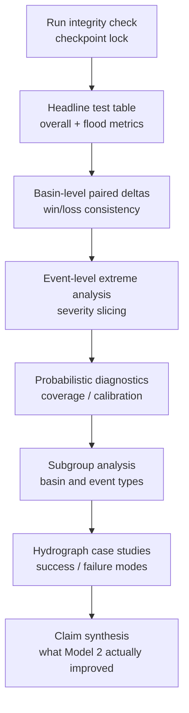

# Result Analysis Protocol

## 서술 목적

이 문서는 `Model 1`과 `Model 2`의 학습과 DRBC holdout test까지 모두 끝난 뒤, 어떤 raw artifact에서 어떤 비교표와 그림을 만들고 어떤 순서로 해석할지를 고정한다. 핵심은 `test NSE 한 줄`로 끝내지 않고, `overall skill`, `peak underestimation`, `event behavior`, `probabilistic reliability`를 분리해서 읽는 것이다.

## 다루는 범위

- test 이후 `Model 1 vs Model 2` 결과 비교 절차
- run, basin, event, quantile 단위 분석의 역할 구분
- 논문 본문과 부록에 들어갈 권장 표/그림과 해석 규칙

## 다루지 않는 범위

- split, loss, config key, run artifact 저장 규칙 자체
- event extraction 규칙의 상세 구현
- quantile head의 직관 설명이나 모델 구조 개념

이 문서는 [`experiment_protocol.md`](experiment_protocol.md), [`../workflow/event_response_spec.md`](../workflow/event_response_spec.md), [`architecture.md`](architecture.md)의 downstream 결과 해석 문서다.

## 핵심 원칙

1. `test set`은 checkpoint 선택에 쓰지 않는다. 각 run의 reported epoch는 validation만 보고 먼저 잠근 뒤 test를 읽는다.
2. `Model 2`의 point comparison은 항상 `q50`으로 한다. `q90/q95/q99`는 probabilistic diagnostic과 peak capture 해석에만 쓴다.
3. 비교 단위는 `전체 평균` 하나가 아니라 `run -> basin -> event -> quantile` 순서로 내려가야 한다. hourly 시계열 전체를 한 번에 평균내면 low flow가 너무 많이 섞여 extreme signal이 약해진다.
4. `bias`와 `accuracy`를 같이 본다. signed peak bias만 줄어도 전체적으로 과대추정으로 뒤집히면 안 되고, absolute error만 줄어도 underestimation direction이 계속 남아 있으면 연구 질문에 충분히 답하지 못한다.
5. seed는 고르지 않는다. `111 / 222 / 333`을 모두 보고하고, seed별 결과를 먼저 읽은 뒤 그 위에 `mean ± std`를 얹는다.

## 분석 파이프라인

## 원시 산출물과 쓰임새

| Raw artifact | 보통 위치 | 무엇에 쓰는가 |
| --- | --- | --- |
| `output.log` | `runs/<run>/output.log` | run 실패, resume 꼬임, epoch 누락, test 실행 여부를 먼저 확인한다. |
| `config.yml` | `runs/<run>/config.yml` | split, input, backbone, seed가 정말 동일했는지 검증한다. |
| `validation_metrics.csv` | `runs/<run>/validation/model_epoch*/validation_metrics.csv` | checkpoint selection과 학습 안정성 확인에 쓴다. |
| `validation_results.p` | `runs/<run>/validation/model_epoch*/validation_results.p` | 필요하면 validation hydrograph와 custom metric sanity check에 쓴다. |
| `test_metrics.csv` | `runs/<run>/test/model_epoch*/test_metrics.csv` | built-in basin-level metric의 1차 source다. |
| `test_results.p` | `runs/<run>/test/model_epoch*/test_results.p` | `NSElog`, custom peak metric, top 1% recall, event-level RMSE, case-study hydrograph에 쓴다. |
| `test_all_output.p` | `runs/<run>/test/model_epoch*/test_all_output.p` | `Model 2`의 quantile coverage, calibration, interval width 같은 probabilistic diagnostic source다. |

권장 원칙은 `raw artifact -> tidy csv -> table/figure` 순서를 지키는 것이다. 논문 표를 pickle이나 raw CSV에서 바로 뽑기 시작하면 built-in metric과 custom metric이 섞이면서 재현성이 약해진다.

## 먼저 답해야 하는 연구 질문

결과 비교는 아래 다섯 질문에 순서대로 답하는 구조로 읽는 것이 좋다.

1. `Model 2`가 `Model 1`보다 DRBC test basin에서 extreme peak underestimation을 실제로 줄였는가.
2. 그 개선이 `overall hydrograph skill`의 붕괴 없이 나왔는가.
3. 개선이 일부 basin 몇 개에만 몰린 것인가, 아니면 basin 전반에서 반복되는가.
4. 개선이 `가장 큰 event`에서 더 커지는가.
5. `Model 2`의 upper quantile이 믿을 만한가. 즉 calibrated uncertainty인지, 아니면 그냥 넓은 band인지.

## metric과 방법을 어떻게 읽을지

| 방법 또는 지표 | 주 입력 | 무엇을 보는가 |
| --- | --- | --- |
| `NSE`, `KGE`, `NSElog` | `test_metrics.csv`, `test_results.p` | 전체 수문곡선 skill이 유지되는지 본다. `Model 2`가 peak만 올리고 전체 hydrograph를 망치지 않았는지 확인하는 안전장치다. |
| `FHV` | `test_metrics.csv` | high-flow volume bias를 본다. 큰 흐름 구간 전체를 체계적으로 낮게 잡는지, 혹은 과대추정으로 뒤집혔는지를 읽는다. |
| signed `Peak Relative Error` | `test_results.p` 기반 custom metric | 연구 질문의 핵심이다. 음수 쪽으로 치우치면 peak underestimation이 남아 있다는 뜻이고, `Model 2`가 이 분포를 0 쪽으로 당기는지가 중요하다. |
| absolute `Peak Relative Error` 또는 `Peak-MAPE` | built-in + custom | peak 오차의 절대 크기를 본다. 방향을 지운 정확도 지표이므로, signed peak bias와 항상 같이 읽어야 한다. |
| `Peak Timing Error` | `test_metrics.csv` | peak magnitude가 아니라 timing 문제를 본다. magnitude는 좋아졌는데 timing이 그대로면 future physics-guided or routing 개선 필요성이 남는다. |
| `top 1% flow recall` | `test_results.p` 기반 custom metric | 극단 high flow를 실제로 놓치지 않는지 본다. 평균적인 fit보다 `tail hit rate`에 더 직접적이다. |
| `event-level RMSE` | event table + `test_results.p` | 이벤트 창 전체의 hydrograph fidelity를 본다. peak 한 점만 맞춘 것이 아니라 rising limb, falling limb를 얼마나 같이 따라갔는지 읽는다. |
| `pinball loss` | `test_all_output.p` 또는 quantile output export | quantile forecast 전체 품질을 본다. `Model 2` 내부 평가의 기본 축이다. |
| `coverage` | `test_all_output.p` | `q90/q95/q99`가 nominal 빈도와 맞는지 본다. 너무 낮으면 under-dispersed, 너무 높으면 over-wide prediction이다. |
| `calibration` curve / error | `test_all_output.p` | upper quantile이 체계적으로 낮거나 높은지를 더 자세히 본다. 전체 coverage 하나보다 더 진단적이다. |
| interval width 또는 sharpness | `test_all_output.p` | coverage가 좋아도 band가 너무 넓으면 의미가 약하다. 그래서 calibration은 항상 sharpness와 같이 읽는 것이 좋다. |

## 공식 비교 절차

### 1. Run integrity와 checkpoint selection을 먼저 잠근다

먼저 각 seed와 모델 조합마다 `config.yml`, `output.log`, validation artifact를 확인한다. 여기서 검증할 것은 `train/validation/test basin file`, `날짜 경계`, `dynamic/static input`, `backbone`, `seed`, `test basin 수`, `저장된 epoch 수`다. `head`, `loss`, `quantiles` 외 다른 차이가 있으면 그 run은 공식 비교에서 빼거나 별도 표기로 분리해야 한다.

checkpoint는 `validation`만 보고 고른다. 현재 권장 기본 규칙은 `best validation median NSE`다. 이유는 두 모델 모두에 같은 기준을 걸 수 있고, test flood metric을 직접 보고 checkpoint를 고르는 순환 해석을 피할 수 있기 때문이다. 다만 부록이나 sanity note로 `best abs validation FHV`, `best validation Peak-MAPE` 기준 sensitivity를 함께 남기는 것은 가능하다. 핵심은 `headline table`에는 딱 하나의 잠긴 규칙만 써야 한다는 점이다.

이 단계가 보는 것은 `비교 공정성`과 `학습 안정성`이다. 결과가 좋고 나쁘고를 보기 전에, 애초에 같은 실험을 비교하고 있는지부터 고정한다.

### 2. Headline test table에서 큰 그림을 먼저 본다

그다음은 selected checkpoint의 `test basin aggregate`를 만든다. 이 표는 보통 basin-level metric을 먼저 계산한 뒤, 각 seed 안에서 `mean`, `median`을 만들고, 마지막에 세 seed의 `mean ± std`를 보고하는 방식이 가장 안전하다. seed 하나를 대표값처럼 쓰지 않는다.

headline table에는 최소한 아래 항목이 들어가야 한다.

- overall skill: `NSE`, `KGE`, `NSElog`
- flood-specific: `FHV`, signed `Peak Relative Error`, absolute `Peak Relative Error` 또는 `Peak-MAPE`, `Peak Timing Error`, `top 1% flow recall`, `event-level RMSE`
- probabilistic only: `pinball loss`, `coverage`, `calibration`

여기서 중요한 해석은 단순히 `NSE가 더 높다/낮다`가 아니다. 본 연구의 1차 headline은 `Model 2가 peak underestimation 관련 지표를 개선하면서 overall skill을 유지했는가`다. 즉 `signed peak bias`, `FHV`, `top 1% recall`이 핵심 headline이고, `NSE/KGE/NSElog`는 그 개선이 전체 성능 희생 없이 나왔는지 확인하는 보조 축이다.

### 3. Basin-level paired delta로 개선의 일관성을 본다

aggregate 평균만 보면 몇 개 basin의 큰 개선이 전체를 끌어올린 것인지 알기 어렵다. 그래서 각 seed 안에서 같은 basin끼리 `Model 2 - Model 1`의 paired delta를 만든다. 단, 지표 방향을 통일하는 것이 좋다.

- higher-is-better metric: `delta = Model2 - Model1`
- lower-is-better metric: `delta = Model1 - Model2`
- signed bias metric: signed 값 자체와 `|bias|` 감소량을 둘 다 본다

예를 들어 signed `Peak Relative Error`는 분포가 0에 가까워지는지가 중요하고, absolute peak error는 절대 크기 자체가 줄었는지가 중요하다. 둘을 한 값으로 합쳐 버리면 underestimation 완화와 단순 error reduction이 뒤섞인다.

권장 요약은 `win / tie / loss basin count`, basin-level delta의 `median`, `IQR`, 그리고 seed별 paired bootstrap confidence interval 또는 `Wilcoxon signed-rank` 보조 검정이다. 다만 통계 검정 하나로 결론을 대신하지는 않는다. 이 단계가 보는 것은 `개선이 전반적인가, 아니면 몇 basin에 국한되는가`다.

### 4. Extreme-event 단위로 쪼개서 정말 극한에서 좋아졌는지 본다

이 연구의 질문은 일반적인 평균 유량 예측이 아니라 `extreme flood underestimation`이다. 따라서 basin aggregate 뒤에는 반드시 event-level 분석이 와야 한다. event 정의는 [`../workflow/event_response_spec.md`](../workflow/event_response_spec.md)를 그대로 따르고, basin별로 추출한 event window 안에서 `peak error`, `peak timing`, `event-level RMSE`, `event top-1% hit`, 필요하면 event runoff ratio 같은 보조 값을 붙인다.

그다음 event를 observed peak 크기 기준으로 `all events`, `top 10%`, `top 5%`, `top 1%`처럼 severity slice로 나눈다. basin마다 scale 차이가 크면 raw peak 대신 `unit-area peak`나 basin-internal percentile rank를 같이 보는 것이 좋다.

이 단계가 보는 것은 `Model 2의 개선이 정말 큰 event에서 커지는가`다. 만약 중간 크기 event에서는 비슷하고 상위 몇 퍼센트에서만 차이가 커진다면, 그 자체가 `tail-aware output` 가설을 지지하는 결과가 된다.

### 5. threshold exceedance와 peak capture를 따로 본다

`top 1% flow recall`은 단순 보조지표가 아니라, 이 연구에서 매우 중요한 판별 축이다. `NSE`나 event RMSE가 좋아도 극단 flow threshold를 계속 놓치면 peak underestimation 문제는 남아 있다고 보는 편이 맞다.

권장 비교는 두 층이다. 첫째, 시간축 기준으로 `observed top 1%` 구간을 얼마나 많이 잡았는지 본다. 둘째, event peak 기준으로 observed peak가 model high-flow prediction에 의해 포착됐는지 본다. built-in `Missed-Peaks`가 있으면 참고 지표로 같이 놓을 수 있다.

이 단계가 보는 것은 `Model 2가 tail을 실제로 열었는지`다. 그냥 평균적으로 약간 올라간 정도인지, 아니면 extreme threshold 자체를 더 자주 넘겨서 miss를 줄였는지 구분할 수 있다.

### 6. Probabilistic diagnostic은 전체 기간과 high-flow 조건부로 나눠 본다

`Model 2`는 point metric만 보고 끝내면 절반만 읽은 셈이다. `q90/q95/q99`에 대해 전체 test 기간 coverage를 먼저 계산하고, 그다음 `observed top 10%` 또는 `top 1%` 구간에 한정한 conditional coverage를 따로 계산하는 것이 좋다. 전체 coverage만 보면 low flow가 대부분이라 upper-tail calibration 문제가 가려질 수 있다.

권장 비교는 아래 순서다.

1. 전체 기간 `coverage(q90/q95/q99)`
2. 전체 기간 calibration curve 또는 empirical coverage error
3. high-flow 조건부 coverage
4. high-flow 조건부 calibration
5. 평균 interval width 또는 peak-window interval width

이 단계가 보는 것은 `upper quantile이 믿을 만한가`다. coverage가 nominal보다 낮으면 extreme를 여전히 덜 열고 있는 것이고, nominal보다 훨씬 높으면서 interval width가 과도하게 넓으면 정보력 없는 uncertainty일 수 있다.

### 7. Basin subgroup 분석으로 어디서 이득이 나는지 본다

`Model 2`가 모든 basin에서 비슷하게 좋아질 필요는 없다. 오히려 어떤 basin type에서 이득이 집중되는지를 보는 것이 후속 연구 방향을 정하는 데 중요하다. basin-level metric delta를 [`../workflow/basin_analysis.md`](../workflow/basin_analysis.md)와 관련된 정적 특성, 그리고 event-response descriptor와 결합해서 subgroup summary를 만든다.

우선순위가 높은 subgroup 후보는 아래와 같다.

- `snow_fraction` high / low
- `baseflow_index` high / low
- `aridity` high / low
- `area`, `slope`, `permeability`
- flood generation type 또는 event responsiveness

이 단계가 보는 것은 `probabilistic head의 이득이 어디에서 특히 큰가`다. 만약 snow 영향이 크거나 groundwater memory가 긴 basin에서 timing 한계가 더 강하게 남는다면, 그건 future physics-guided extension의 타당성을 뒷받침하는 근거가 된다.

### 8. Hydrograph case study로 메커니즘을 보여준다

최종적으로는 정량표만으로는 설득력이 약하다. 대표 basin 또는 대표 event를 골라 observed hydrograph, `Model 1`, `Model 2 q50`, `Model 2 q90/q95/q99`를 한 그림에 겹쳐 보여주는 case study가 필요하다.

권장 샘플은 아래 네 유형이다.

- `Model 2`가 peak magnitude를 분명히 개선한 성공 사례
- `Model 2`가 uncertainty band는 열었지만 `q50`은 여전히 낮은 사례
- timing error가 그대로 남은 사례
- `Model 2`가 오히려 나빠진 failure 사례

이 단계가 보는 것은 `왜 좋아졌는지`, `왜 아직 부족한지`다. 표에서는 같은 delta여도, 어떤 basin은 magnitude만 좋아지고 어떤 basin은 q95만 peak를 감싸는 식으로 메커니즘이 다를 수 있다.

## 권장 표와 그림

논문이나 내부 리포트에서는 아래 정도 구성이 가장 실용적이다.

| ID | 권장 산출물 | 역할 |
| --- | --- | --- |
| Table 1 | run / seed / selected epoch summary | 공식 비교에 들어간 run과 checkpoint를 투명하게 고정한다. |
| Table 2 | main test comparison table | `Model 1 vs Model 2`의 overall + flood + probabilistic headline을 한 번에 보여준다. |
| Figure 1 | basin-level paired delta distribution | 개선이 몇 basin에만 집중됐는지, 전반적으로 퍼졌는지 보여준다. |
| Figure 2 | event severity vs metric delta | event가 커질수록 `Model 2` 이득이 커지는지 보여준다. |
| Figure 3 | reliability / calibration plot | `q90/q95/q99`가 믿을 만한지 보여준다. |
| Figure 4 | subgroup heatmap 또는 forest plot | 어떤 basin type에서 이득이 큰지 보여준다. |
| Figure 5 | hydrograph case studies | 메커니즘과 failure mode를 직관적으로 보여준다. |

## 권장 tidy 산출물

분석 단계에서 최소한 아래 형태의 tidy artifact를 남겨 두는 것이 좋다.

- `checkpoint_selection.csv`
- `test_basin_metrics_tidy.csv`
- `event_metrics_tidy.csv`
- `quantile_diagnostics_tidy.csv`
- `subgroup_summary.csv`
- `case_study_manifest.csv`

파일명이 꼭 이 이름일 필요는 없지만, `run/seed/model/basin/event/metric/value` 형태로 길게 정리된 tidy table이 있어야 재분석과 그림 수정이 쉬워진다.

## 결과 해석의 기본 규칙

결론은 아래처럼 읽는 것이 가장 자연스럽다.

1. `Model 2`가 signed peak bias, `FHV`, `top 1% recall`, `event-level RMSE`를 일관되게 개선하고 `NSE/KGE/NSElog`가 유지되면, `extreme underestimation의 중요한 병목이 output design`이라는 해석이 가능하다.
2. `Model 2`의 `q90/q95/q99`는 peak를 더 잘 감싸지만 `q50` improvement가 약하면, `uncertainty representation`은 좋아졌지만 point prediction bias는 충분히 풀리지 않았다고 읽는다.
3. magnitude 지표는 좋아졌는데 `Peak Timing Error`가 그대로면, 후속 연구에서 routing/state 구조를 강화할 이유가 남는다.
4. 개선이 특정 basin type에 집중되면, 그 subgroup이 future physics-guided extension의 우선 대상이 된다.

핵심은 `Model 2가 이겼다/졌다`로 끝내지 않는 것이다. 무엇이 좋아졌고, 무엇은 아직 그대로이며, 그 차이가 `output design`만으로 설명되는지까지 밀고 가야 논문 스토리가 단단해진다.

## 관련 문서

- [`design.md`](design.md): 연구 질문과 비교 가설
- [`experiment_protocol.md`](experiment_protocol.md): split, loss, metric, raw artifact 규칙
- [`architecture.md`](architecture.md): Model 1 / Model 2 구조
- [`probabilistic_head_guide.md`](probabilistic_head_guide.md): quantile head 직관 설명
- [`../workflow/event_response_spec.md`](../workflow/event_response_spec.md): event 정의와 event-level 분석 기준
