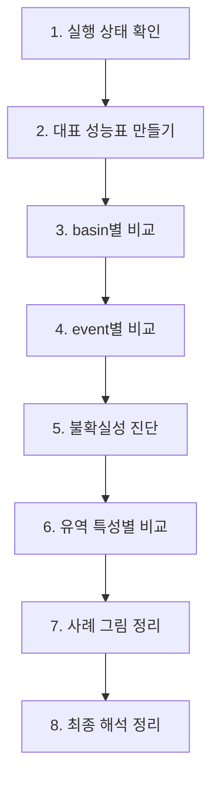

# 결과 비교 가이드

## 이 문서는 무엇을 위한 문서인가

핵심 질문은 아주 단순해요.

1. `Model 2`가 `Model 1`보다 홍수 첨두를 덜 낮게 예측했는가
2. 그 개선이 전체 시계열 성능을 망치지 않았는가
3. 큰 홍수일수록 `Model 2`의 장점이 더 잘 보이는가
4. `Model 2`가 내놓는 불확실성 정보(`q90`, `q95`, `q99`)를 믿어도 되는가

이 문서는 [`experiment_protocol.md`](experiment_protocol.md), [`architecture.md`](architecture.md), [`../workflow/event_response_spec.md`](../workflow/event_response_spec.md)를 바탕으로, “실험이 끝난 뒤 결과를 어떻게 읽을지”를 설명해요.

## 가장 먼저 기억할 원칙

| 원칙                              | 쉬운 설명                                                                                             |
| --------------------------------- | ----------------------------------------------------------------------------------------------------- |
| `test`는 모델 선택에 쓰지 않기  | 어떤 epoch를 쓸지는 `validation`만 보고 정해야 해요. `test`를 보고 고르면 비교가 공정하지 않아요. |
| `Model 2`의 대표 예측은 `q50` | `Model 2`는 여러 quantile을 내지만, `Model 1`과 정면 비교할 때는 `q50`을 대표값으로 써요.       |
| 평균 하나만 보지 않기             | 전체 평균만 보면 중요한 홍수 신호가 가려질 수 있어요. basin별, event별로도 같이 봐야 해요.            |
| 방향과 크기를 같이 보기           | “얼마나 틀렸는가”도 중요하고, “너무 낮게 예측했는가”도 중요해요. 둘은 다른 질문이에요.            |
| seed 하나만 믿지 않기             | Model 1과 Model 2 모두 `111 / 222 / 444`를 보고, 마지막에 `평균 ± 표준편차`로 정리하는 것이 좋아요. Model 2 seed `333`은 NaN loss로 실패했고, Model 1 seed `333`도 공정한 paired-seed 비교를 위해 제외해요. |

## 전체 흐름



## 어떤 파일을 보면 되는가

| 파일                       | 보통 위치                                                     | 왜 보는가                                                             |
| -------------------------- | ------------------------------------------------------------- | --------------------------------------------------------------------- |
| `output.log`             | `runs/<run>/output.log`                                     | 실행이 정상 종료됐는지, 중간에 꼬인 부분은 없는지 확인해요.           |
| `config.yml`             | `runs/<run>/config.yml`                                     | 두 모델이 정말 같은 조건에서 돌았는지 확인해요.                       |
| `validation_metrics.csv` | `runs/<run>/validation/model_epoch*/validation_metrics.csv` | 어떤 epoch를 대표로 고를지 정할 때 봐요.                              |
| `test_metrics.csv`       | `runs/<run>/test/model_epoch*/test_metrics.csv`             | 기본 성능 지표를 가장 먼저 확인할 때 봐요.                            |
| `test_results.p`         | `runs/<run>/test/model_epoch*/test_results.p`               | custom 지표, event 분석, 사례 그림을 만들 때 필요해요.                |
| `test_all_output.p`      | `runs/<run>/test/model_epoch*/test_all_output.p`            | `Model 2`의 quantile 결과와 coverage, calibration을 볼 때 필요해요. 저장 비용이 크기 때문에 모든 epoch sweep의 필수 파일은 아니고, selected checkpoint 중심으로 만들어요. |

## 어떤 지표를 왜 보는가

### 1. 전체 성능 지표

| 지표       | 무엇을 보는가                    | 왜 필요한가                                              |
| ---------- | -------------------------------- | -------------------------------------------------------- |
| `NSE`    | 전체 시계열을 얼마나 잘 맞췄는지 | 가장 기본적인 전체 성능 확인용이에요.                    |
| `KGE`    | 상관, 평균, 변동성을 함께 봄     | NSE 하나만 보면 놓치는 부분을 보완해줘요.                |
| `NSElog` | 작은 유량까지 포함한 전체 성능   | 홍수만 좋아지고 평소 유량이 무너졌는지 확인할 수 있어요. |

### 2. 홍수 중심 지표

| 지표                    | 무엇을 보는가                                 | 한 줄 해석                                                             |
| ----------------------- | --------------------------------------------- | ---------------------------------------------------------------------- |
| `FHV`                 | 큰 유량 구간 전체를 높게 또는 낮게 예측했는지 | 음수 쪽이면 큰 흐름을 전반적으로 낮게 잡는 경향이 있다고 볼 수 있어요. |
| `Peak Relative Error` | 홍수 첨두를 얼마나 높게 또는 낮게 예측했는지  | 이 연구에서 가장 중요한 지표예요.                                      |
| `Peak-MAPE`           | 첨두 오차의 크기 자체                         | 방향은 모르지만, 얼마나 크게 틀렸는지는 알 수 있어요.                  |
| `Peak Timing Error`   | 첨두 시점을 맞췄는지                          | 높이는 맞아도 시간이 어긋날 수 있기 때문에 따로 봐야 해요.             |
| `top 1% flow recall`  | 아주 큰 유량 구간을 얼마나 놓치지 않았는지    | 극한 홍수를 실제로 잡아냈는지 보는 지표예요.                           |
| `event-level RMSE`    | 홍수 event 전체 모양을 잘 따라갔는지          | 첨두 한 점만 맞춘 것이 아닌지 확인해요.                                |

### 3. 확률 예측 지표

| 지표               | 무엇을 보는가                                    | 한 줄 해석                                             |
| ------------------ | ------------------------------------------------ | ------------------------------------------------------ |
| `pinball loss`   | quantile 예측이 전체적으로 좋은지                | `Model 2`의 기본 품질 점검이에요.                    |
| `coverage`       | 예를 들어 `q90`이 실제로 90% 정도를 포함하는지 | 예측 구간이 너무 좁거나 너무 넓은지 볼 수 있어요.      |
| `calibration`    | 예측한 확률 수준과 실제 빈도가 잘 맞는지         | “이 정도면 90%”라고 한 말이 믿을 만한지 보는 거예요. |
| `interval width` | 예측 구간 폭이 얼마나 넓은지                     | coverage만 좋고 구간이 너무 넓으면 실용성이 떨어져요.  |

## 실제 비교 순서

### 먼저: 결과를 두 층으로 나눠서 읽기

`Model 2`는 quantile을 여러 개 같이 학습하는 모델이에요. 그래서 `q50` 하나만 떼어 놓고 `Model 2 전체 성능`이라고 부르면 해석이 어색해질 수 있어요.

특히 현재 구조에서는 `q50`이 `q90/q95/q99`와 완전히 독립적으로 학습되는 값이 아니라, upper quantile과 함께 학습된 `중앙 예측선`이에요. 그래서 결과는 아래 두 층으로 나눠 읽는 것이 좋아요.

| 해석 층                | 무엇을 비교하는가                                                                                             | 어떻게 불러야 하는가                      | 왜 이렇게 나누는가                                                                                |
| ---------------------- | ------------------------------------------------------------------------------------------------------------- | ----------------------------------------- | ------------------------------------------------------------------------------------------------- |
| `중앙예측선 비교`    | `Model 1`의 단일 예측값 vs `Model 2(q50)`                                                                 | `중앙예측 성능`                         | `q50`은 `Model 2`의 대표 중앙선이지만, `Model 2` 전체를 다 설명하는 값은 아니기 때문이에요. |
| `확률모델 가치 비교` | `Model 2`의 `q90/q95/q99`, `coverage`, `calibration`, `상위 첨두 포함 비율`, `top 1% 유량 포착률` | `홍수/분포 성능` 또는 `확률모델 가치` | `Model 2`의 진짜 장점은 upper tail과 uncertainty 표현에 있기 때문이에요.                        |

즉, `NSE`, `KGE`, `NSElog` 같은 값은 앞으로 `전체 성능`보다는 `중앙예측선 성능`이라고 부르는 편이 더 정확해요. 반대로 `q90/q95/q99`와 관련된 결과는 `Model 2`가 홍수와 불확실성을 얼마나 잘 다뤘는지를 보여주는 별도 구역으로 읽어야 해요.

이 구분을 쓰면 아래처럼 정리할 수 있어요.

| 질문                                                         | 어디에서 답하는가        |
| ------------------------------------------------------------ | ------------------------ |
| `Model 2(q50)`가 중앙 예측선으로서도 괜찮은가              | `중앙예측선 비교`      |
| `Model 2`가 큰 홍수를 덜 놓치는가                          | `확률모델 가치 비교`   |
| `Model 2`의 불확실성 정보는 믿을 만한가                    | `확률모델 가치 비교`   |
| output design을 바꾼 것이 extreme flood 대응에 도움이 되는가 | 두 구역을 함께 보고 해석 |

### 1단계. 먼저 실행이 공정했는지 확인하기

먼저 `config.yml`과 `output.log`를 확인해요. 여기서 꼭 봐야 하는 것은 `train/validation/test basin file`, 날짜 구간, 입력 변수, backbone, seed예요.

쉽게 말하면, `head`와 `loss`를 제외한 나머지가 거의 같아야 해요. 다른 조건이 많이 바뀌면 `Model 2가 좋아졌다`고 말하기 어려워져요.

### 2단계. 대표 epoch 고르기

대표 epoch는 `validation`만 보고 정해요. 현재 가장 무난한 규칙은 `validation median NSE가 가장 좋은 epoch`를 고르는 거예요. Model 1의 loss는 `NSE`, Model 2의 loss는 `pinball`이라서 validation loss끼리 직접 비교하면 기준이 섞입니다.

현재 subset300 validation CSV 기준 primary checkpoint는 아래처럼 잠가요. 이 단계의 목적은 “어느 checkpoint를 공식 결과로 쓸 것인가”를 먼저 정하는 거예요. `test`를 보고 고르면 안 돼요.

| model | seed | primary epoch |
| --- | ---: | ---: |
| Model 1 | 111 | 25 |
| Model 1 | 222 | 10 |
| Model 1 | 444 | 15 |
| Model 2 | 111 | 5 |
| Model 2 | 222 | 10 |
| Model 2 | 444 | 10 |

동시에 validation이 저장된 epoch `005 / 010 / 015 / 020 / 025 / 030` 전체에 DRBC test를 돌리는 것은 괜찮아요. 다만 이건 primary epoch를 고르는 과정이 아니라, checkpoint sensitivity와 epoch30 fixed-budget robustness를 확인하는 diagnostic sweep으로 표시해야 해요.

### 3단계. 중앙예측 성능표 만들기

그다음 `test`에서 `중앙예측 성능표`를 만들어요. 여기서는 `Model 1`과 `Model 2(q50)`를 직접 비교해요.

이 표는 `Model 2 전체 성능표`가 아니라, `Model 2의 중앙예측선(q50) 성능표`라고 이해하는 것이 맞아요.

이 표에는 아래 두 묶음이 들어가는 게 좋아요.

1. 전체 성능: `NSE`, `KGE`, `NSElog`
2. 홍수 성능: `FHV`, `Peak Relative Error`, `Peak Timing Error`, `top 1% flow recall`, `event-level RMSE`

여기서 먼저 볼 것은 `Model 2(q50)`가 중앙 예측선으로서 홍수 관련 지표를 얼마나 개선했는가예요. 그다음에 `NSE`, `KGE`, `NSElog`가 유지됐는지 보면 돼요.

다만 이 표만 보고 `Model 2 전체가 좋다` 또는 `Model 2 전체가 나쁘다`고 결론 내리면 안 돼요. `Model 2`의 확률모델 장점은 다음 단계의 `홍수/분포 비교표`에서 따로 읽어야 해요.

### 4단계. basin별로 비교하기

평균만 보면 일부 basin의 큰 개선이 전체를 끌어올린 것처럼 보일 수 있어요. 그래서 basin별로 `Model 2 - Model 1` 차이를 따로 계산해요.

이 단계에서 보면 좋은 값은 아래와 같아요.

| 비교 항목                 | 왜 보는가                                                                                                                                           |
| ------------------------- | --------------------------------------------------------------------------------------------------------------------------------------------------- |
| `개선 basin 수`         | 각 basin의 metric 차이가 좋은 방향으로 바뀐 basin이 몇 개인지 보여줘요. 다만 개선의 `크기`는 못 보여주기 때문에 보조 요약으로만 쓰는 것이 좋아요. |
| basin별 차이의 `median` | 전형적인 개선 크기를 보여줘요. basin-level 비교의 핵심 요약이에요.                                                                                  |
| basin별 차이의 `IQR`    | 개선이 고르게 나타났는지, 들쑥날쑥한지 보여줘요.                                                                                                    |
| basin별 delta 분포 그림   | 몇 basin만 크게 좋아진 것인지, 전반적으로 조금씩 좋아진 것인지 보여줘요.                                                                            |

여기서 중요한 점은 `개선 basin 수`만으로 결론을 내리지 않는 거예요. basin 비교의 main message는 `basin별 delta의 median`, `IQR`, 분포 그림에서 읽고, `개선 basin 수`는 “좋은 방향 변화가 반복적으로 나왔는가”를 확인하는 보조 신호로만 쓰는 것이 좋아요.

### 5단계. event별로 비교하기

이 연구는 홍수 첨두 과소추정이 핵심이기 때문에, event별 비교가 꼭 필요해요. basin 전체 평균만 보면 큰 홍수 몇 개가 묻혀버릴 수 있어요.

권장 방법은 아래와 같아요.

1. event를 추출한다.
2. 각 event에서 `peak error`, `Peak Timing Error`, `event-level RMSE`를 계산한다.
3. event를 크기별로 나눈다.

예를 들면 이렇게 나눌 수 있어요.

| event 묶음        | 보는 이유                               |
| ----------------- | --------------------------------------- |
| 전체 event        | 전체적인 경향 확인                      |
| 상위 10% 큰 event | 큰 홍수에서 차이가 커지는지 확인        |
| 상위 5% 큰 event  | 더 극한으로 갈수록 차이가 커지는지 확인 |
| 상위 1% 큰 event  | 정말 큰 event에서의 성능 확인           |

이 단계의 핵심 질문은 `Model 2`의 장점이 정말 큰 홍수에서 더 강하게 나타나는가예요.

### 6단계. 극한 유량을 실제로 잡았는지 보기

`top 1% flow recall`은 반드시 따로 보는 것이 좋아요. 평균 오차가 작아도, 정말 큰 유량 구간을 계속 놓치면 이 연구의 핵심 문제는 해결되지 않은 거예요.

쉽게 말하면 이 지표는 “가장 큰 물이 왔을 때 모델이 그걸 알아챘는가”를 보는 거예요.

### 7단계. `Model 2`의 불확실성 정보가 믿을 만한지 보기

`Model 2`는 `q50`만 있는 모델이 아니에요. 그래서 `q90`, `q95`, `q99`도 꼭 봐야 해요.

다만 여기서 한 가지를 분명히 해야 해요. 현재 모델이 보여주는 것은 `전체 uncertainty`라기보다 `upper-tail 중심 uncertainty`예요.

왜냐하면 지금 quantile set에는 `q10`, `q05` 같은 아래쪽 quantile이 없고, `q50`, `q90`, `q95`, `q99`처럼 위쪽 정보만 있기 때문이에요. 그래서 이 모델은

- `중앙 예측선보다 실제가 더 클 수 있는가`
- `특히 홍수처럼 큰 값에서 얼마나 위로 열어둬야 하는가`

를 보는 데 더 적합해요.

이 점은 아래처럼 이해하면 쉬워요.

| 구분                              | 지금 문서에서 무엇으로 확인하는가           | 뜻                                        |
| --------------------------------- | ------------------------------------------- | ----------------------------------------- |
| `upper-tail 크기`               | `q95 - q50`, `q99 - q50` 같은 폭        | 중심선보다 위로 얼마나 더 열어두는지      |
| `upper-tail 신뢰도`             | `coverage`, `calibration`               | 그렇게 열어둔 폭이 실제로 믿을 만한지     |
| `홍수 때 upper-tail이 커지는지` | 큰 유량 구간에서의 `q95-q50`, `q99-q50` | 평소보다 홍수 때 더 조심스럽게 예측하는지 |
| `실제 peak를 감싸는지`          | `상위 첨두 포함 비율`                     | upper quantile이 실제 홍수 첨두를 덮는지  |

그래서 이 문서에서 `uncertainty`라고 부르는 것은 더 정확하게는 `홍수 쪽 상방 불확실성` 또는 `upper-tail uncertainty`라고 이해하는 것이 좋아요.

추천 순서는 아래와 같아요.

1. 전체 기간의 `coverage`
2. 전체 기간의 `calibration`
3. 큰 유량 구간에서의 `coverage`
4. 큰 유량 구간에서의 `calibration`
5. 예측 구간 폭(`interval width`)

이때 중요한 점은 `coverage`만 높다고 좋은 게 아니라는 거예요. 구간이 너무 넓어서 뭐든 다 포함하면 쓸모가 떨어질 수 있어요.

또한 현재 설정만으로는 아래를 직접 보기는 어려워요.

| 현재 설정의 한계                | 뜻                                                                           |
| ------------------------------- | ---------------------------------------------------------------------------- |
| lower quantile이 없음           | 위쪽뿐 아니라 아래쪽까지 포함한 `양방향 uncertainty`는 직접 못 봐요.       |
| `q50, q90, q95, q99`만 있음   | 사실상 `홍수 쪽 상방 uncertainty`를 보는 구조예요.                         |
| epistemic / aleatoric 분리 불가 | 모델이 몰라서 불확실한지, 데이터 자체가 noisy해서 불확실한지는 구분 못 해요. |

### 7-1단계. 홍수/분포 비교표는 어떻게 만들면 좋은가

이 표는 `Model 2 전체 가치`를 보여주는 핵심 표예요. 다시 말해, `중앙예측 성능표`가 `q50`만의 비교라면, 이 표는 `Model 2`가 quantile 모델로서 어떤 장점을 갖는지를 보여주는 구역이에요.

이 부분은 한 표에 다 몰아넣기보다, 아래처럼 두 층으로 나누는 것이 좋아요.

| 구역               | 무엇을 넣는가                                 | 왜 나누는가                                                                  |
| ------------------ | --------------------------------------------- | ---------------------------------------------------------------------------- |
| `중앙예측 비교`  | `Model 1`과 `Model 2(q50)`의 지표         | 두 모델을 가장 공정하게 직접 비교하는 구역이에요.                            |
| `홍수/분포 비교` | `Model 2`의 `q90/q95/q99`까지 포함한 지표 | `Model 2`가 tail과 uncertainty에서 어떤 장점을 갖는지 보여주는 구역이에요. |

중요한 점은 `q95`, `q99`는 `Model 1`의 단일 예측값과 완전히 같은 역할이 아니라는 거예요. 그래서 이 구역에서는 단순 `승/패 개수`보다는 `포착 비율`, `포함 비율`, `coverage`, `calibration`처럼 더 맞는 이름을 쓰는 것이 좋아요.

운영상으로는 모든 validation epoch sweep에서 먼저 `test_metrics.csv`와 `test_results.p`만 만들어 `Model 1`과 `Model 2(q50)`의 중앙예측 성능을 확인하는 편이 안전해요. `test_all_output.p`는 `y_quantiles` 외에도 full output을 크게 저장할 수 있으므로, `q90/q95/q99` 기반 coverage와 calibration은 primary checkpoint와 꼭 필요한 robustness checkpoint에만 만들거나, 필요한 quantile만 뽑는 lean export로 계산하는 것이 좋아요.

이 표를 통해 답하려는 질문은 아래와 같아요.

| 질문                                               | 이 표에서 보는 항목                                     |
| -------------------------------------------------- | ------------------------------------------------------- |
| `Model 2`가 큰 첨두를 더 잘 감싸는가             | `상위 첨두 포함 비율`, `q95/q99`                    |
| `Model 2`가 극한 유량을 덜 놓치는가              | `top 1% 유량 포착률`                                  |
| `Model 2`의 upper-tail uncertainty가 믿을 만한가 | `coverage`, `calibration`, `q95-q50`, `q99-q50` |
| `Model 2`가 전체 quantile 분포를 잘 학습했는가   | `pinball loss`                                        |

아래는 각 지표를 실제로 어떻게 계산하고 해석하면 좋은지 정리한 표예요.

| 항목                    | 어떻게 계산하는가                                                                                                                                                       | 무엇과 비교하는가                                                                               | 어떻게 해석하는가                                                                                                                                         |
| ----------------------- | ----------------------------------------------------------------------------------------------------------------------------------------------------------------------- | ----------------------------------------------------------------------------------------------- | --------------------------------------------------------------------------------------------------------------------------------------------------------- |
| `pinball loss`        | 각 시점에서 관측값과 `q50/q90/q95/q99`의 오차를 quantile별 비대칭 규칙으로 계산한 뒤 평균해요.                                                                        | 전체 기간 값과, 큰 유량 구간 값으로 나눠 봐요.                                                  | 값이 작을수록 좋아요. 특히 큰 유량 구간에서 많이 줄면 `Model 2`가 tail을 더 잘 배웠다고 볼 수 있어요.                                                   |
| `upper-tail 폭`       | 각 시점에서 `q95-q50`, `q99-q50`를 계산한 뒤 평균 또는 중앙값을 구해요.                                                                                             | 전체 기간 값과, 큰 유량 구간 값으로 나눠 봐요.                                                  | 폭이 크면 모델이 “실제는 중심선보다 더 클 수 있다”고 보고 있다는 뜻이에요. 다만 폭만 크다고 좋은 것은 아니고 `coverage`와 같이 봐야 해요.             |
| `coverage`            | 예를 들어 `q90`이면, 전체 시점 중 `실제 유량 <= q90`인 비율을 계산해요.                                                                                             | 계산된 비율과 목표값 `0.90`을 비교해요. `q95`, `q99`도 같은 방식이에요.                   | 실제 coverage가 목표보다 낮으면 quantile 선이 너무 낮은 거예요. 반대로 너무 높으면 선이 너무 높거나 구간이 너무 넓을 수 있어요.                           |
| `calibration`         | `q50`, `q90`, `q95`, `q99` 각각에 대해 `목표 확률`과 `실제 coverage`를 한 표나 선그래프로 그려요.                                                           | 대각선(`예측한 확률 = 실제 빈도`)과 비교해요.                                                 | 선이 대각선 아래로 내려가면 upper quantile이 낮아서 큰 유량을 충분히 감싸지 못하는 거예요.                                                                |
| `상위 첨두 포함 비율` | 각 홍수 event에서 `실제 peak 시점`의 관측 첨두값이 `q_tau` 아래에 들어가는지 확인해요. 예를 들어 `q95(실제 peak 시점) >= 실제 peak`면 포함된 것으로 세요.         | `Model 1`, `Model 2(q50)`, `Model 2(q95)`, `Model 2(q99)`를 같이 놓고 비교할 수 있어요. | `q50`보다 `q95/q99`의 포함 비율이 높다면, `Model 2`가 tail을 열어서 큰 첨두를 더 잘 감싼다고 볼 수 있어요.                                          |
| `top 1% 유량 포착률`  | basin별 관측 test 시계열에서 상위 1% 기준값을 정한 뒤,`실제로 top 1%였던 시점`을 모델이 같이 top 1% 이상으로 올렸는지 계산해요. `hits / observed top 1% count`예요. | `Model 1`, `Model 2(q50)`, `Model 2(q95)`, `Model 2(q99)`를 비교해요.                   | 값이 높을수록 극한 유량을 덜 놓친다는 뜻이에요. 다만 너무 자주 높게 예측해서 억지로 맞춘 것일 수도 있으니 `coverage`나 예측 초과 비율과 같이 봐야 해요. |

#### 1. `pinball loss`는 두 번 계산하는 것이 좋아요

`pinball loss`는 전체 기간 한 번만 계산하면 low flow 구간이 너무 많이 섞여요. 그래서 아래처럼 두 버전으로 나누는 것이 좋아요.

| 버전                         | 계산 구간                             | 왜 필요한가                                  |
| ---------------------------- | ------------------------------------- | -------------------------------------------- |
| 전체 `pinball loss`        | test 전체 시계열                      | `Model 2`의 전반적인 quantile 품질을 봐요. |
| 고유량 구간 `pinball loss` | 예: 관측 상위 10% 또는 상위 1% 구간만 | tail을 정말 잘 배웠는지 따로 볼 수 있어요.   |

만약 전체 값은 비슷한데 고유량 구간 `pinball loss`가 분명히 좋아진다면, 이건 `Model 2`의 장점이 특히 홍수 구간에서 나타난다는 뜻이에요.

#### 2. `coverage`는 전체 기간과 큰 유량 구간을 나눠서 봐야 해요

예를 들어 `q95 coverage = 0.95`에 가까우면 좋아 보여도, 그게 low flow 덕분일 수 있어요. 그래서 아래처럼 두 줄로 나누는 것이 좋아요.

| coverage 종류   | 계산 방법                                              |
| --------------- | ------------------------------------------------------ |
| 전체 coverage   | test 전체 시점에서 계산                                |
| 조건부 coverage | 관측 유량이 상위 10% 또는 상위 1%인 시점만 골라서 계산 |

이렇게 보면 `Model 2`가 평소에는 맞는데, 진짜 큰 유량에서는 여전히 `q95`, `q99`가 낮은지 아닌지를 알 수 있어요.

#### 2-1. `upper-tail 폭`도 같이 보면 좋아요

`coverage`와 `calibration`은 “믿을 만한가”를 보는 지표예요. 여기에 `q95-q50`, `q99-q50` 같은 폭을 같이 두면 “얼마나 열어두었는가”까지 함께 볼 수 있어요.

| 폭 지표                       | 어떻게 읽는가                                       |
| ----------------------------- | --------------------------------------------------- |
| `q95-q50`가 큼              | 중심선보다 위쪽 가능성을 꽤 넓게 열어둔 거예요.     |
| `q99-q50`가 큼              | 아주 극단적인 홍수까지 더 크게 대비한 거예요.       |
| 큰 유량 구간에서 폭이 더 커짐 | 모델이 홍수 상황에서 더 불확실하다고 판단한 거예요. |

다만 폭이 큰 것만으로는 좋은 모델이라고 말할 수 없어요. `coverage`, `calibration`이 같이 좋아야 “잘 열린 uncertainty”라고 볼 수 있어요.

#### 3. `calibration`은 숫자 하나와 그림 하나를 같이 두는 것이 좋아요

가장 단순한 방법은 아래 두 가지예요.

| 방식 | 예시                                                          |
| ---- | ------------------------------------------------------------- |
| 표   | `q90: 실제 0.84`, `q95: 실제 0.90`, `q99: 실제 0.96`    |
| 그림 | 가로축 `목표 확률`, 세로축 `실제 비율`인 calibration plot |

숫자 표는 빠르게 읽기 좋고, 그림은 체계적으로 낮거나 높은지를 한눈에 보여줘요. 둘을 같이 두는 것이 가장 좋아요.

#### 4. `상위 첨두 포함 비율`은 event 단위로 보는 지표예요

이 지표는 “홍수 peak를 quantile 선이 감쌌는가”를 보는 거예요. 계산은 아래 순서로 하면 돼요.

1. basin별로 event를 나눠요.
2. 각 event의 실제 peak 시점과 실제 peak 크기를 찾어요.
3. 그 시점에서 `Model 1`, `Model 2(q50)`, `Model 2(q95)`, `Model 2(q99)` 값을 읽어요.
4. 예를 들어 `q95 >= 실제 peak`면 그 event는 `q95가 peak를 포함했다`고 기록해요.
5. 전체 event 중 몇 %가 포함됐는지 계산해요.

예시는 이렇게 읽으면 돼요.

| 지표                           | 값  | 해석                                                                                          |
| ------------------------------ | --- | --------------------------------------------------------------------------------------------- |
| `Model 1 peak 포함 비율`     | 32% | 단일 예측선이 실제 첨두를 충분히 못 따라간 event가 많다는 뜻이에요.                           |
| `Model 2 q50 peak 포함 비율` | 38% | 중앙선만 놓고 봐도 약간 좋아졌다고 볼 수 있어요.                                              |
| `Model 2 q95 peak 포함 비율` | 71% | upper quantile은 실제 큰 첨두를 꽤 많이 감싸고 있다는 뜻이에요.                               |
| `Model 2 q99 peak 포함 비율` | 86% | 아주 상위 quantile은 peak를 더 넓게 감싸요. 다만 너무 넓은지는 `coverage`와 같이 봐야 해요. |

이 지표는 `Model 2`의 “tail 보호막”이 실제로 작동하는지 보여주는 데 좋아요.

#### 5. `top 1% 유량 포착률`은 시간축 기준 hit rate예요

이건 event 하나씩 보는 게 아니라, 시간축 전체에서 “정말 큰 유량 시점”을 얼마나 놓치지 않았는지 보는 지표예요.

계산 순서는 아래처럼 두면 돼요.

1. basin별 관측 test 시계열에서 상위 1% 기준값을 정해요.
2. 관측이 그 기준 이상인 시점만 모아요.
3. 같은 시점에서 모델 예측도 그 기준 이상인지 확인해요.
4. 맞춘 개수 / 실제 top 1% 시점 개수로 포착률을 계산해요.

예를 들어 `top 1% 유량 포착률 = 0.62`면, 실제로 아주 컸던 시점 100개 중 62개를 모델이 같이 크게 봤다는 뜻이에요.

이 지표는 아래처럼 같이 읽는 것이 좋아요.

| 함께 볼 것                            | 이유                                                     |
| ------------------------------------- | -------------------------------------------------------- |
| `top 1% 유량 포착률`                | 극한 유량을 덜 놓쳤는지 봐요.                            |
| 예측 초과 비율 또는 warning frequency | 너무 자주 크게 예측해서 포착률만 높인 것은 아닌지 봐요.  |
| `coverage`, `calibration`         | `q95`, `q99`가 단순히 과장된 선인지 아닌지 확인해요. |

#### 6. 이 구역에서는 `승/패 개수`보다 이런 요약이 더 잘 맞아요

`q95`, `q99`는 단일 대표선이 아니라 upper quantile이라서, 여기서는 `승/패`보다 아래 표현이 더 자연스러워요.

| 권장 요약                     | 뜻                                                                  |
| ----------------------------- | ------------------------------------------------------------------- |
| `peak 포함 basin 비율`      | 각 basin에서 event peak를 일정 비율 이상 감싼 basin이 얼마나 되는지 |
| `고유량 포착 개선 basin 수` | `top 1% 유량 포착률`이 `Model 1`보다 좋아진 basin이 몇 개인지   |
| `coverage 오차`             | 목표 coverage와 실제 coverage 차이                                  |
| `calibration 오차`          | quantile 선이 얼마나 체계적으로 높거나 낮은지                       |

즉 이 부분은 “누가 이겼는가”보다 “`Model 2`가 tail과 uncertainty를 얼마나 잘 보여주는가”를 설명하는 구역으로 읽는 것이 맞아요.

### 8단계. 어떤 유역에서 특히 좋아지는지 보기

모든 basin에서 똑같이 좋아질 필요는 없어요. 오히려 어떤 유형의 basin에서 장점이 크게 나타나는지 보는 것이 더 중요할 수 있어요.

예를 들면 아래처럼 나눠볼 수 있어요.

| basin 특성                            | 왜 볼 수 있는가                          |
| ------------------------------------- | ---------------------------------------- |
| `snow_fraction` 높음 / 낮음         | 눈 영향을 많이 받는 유역인지 보기 위해   |
| `baseflow_index` 높음 / 낮음        | 지하수 영향이 큰 유역인지 보기 위해      |
| `aridity` 높음 / 낮음               | 건조한 유역인지 보기 위해                |
| `area`, `slope`, `permeability` | 유역 크기와 반응 특성이 다른지 보기 위해 |

이 단계는 “`Model 2`가 어디에서 특히 강한가”를 찾는 단계예요.

### 9단계. 사례 그림으로 마무리하기

숫자만으로는 설명이 부족할 수 있어요. 그래서 대표 사례를 그림으로 보여주는 것이 좋아요.

추천 사례는 아래 네 가지예요.

1. `Model 2`가 첨두 높이를 확실히 개선한 사례
2. `Model 2`가 `q50`은 비슷하지만 `q90/q95/q99`가 첨두를 잘 감싼 사례
3. 높이는 좋아졌지만 timing은 여전히 어긋난 사례
4. `Model 2`가 오히려 나빠진 사례

이 그림은 “왜 좋아졌는지”와 “무엇이 아직 부족한지”를 직관적으로 보여줘요.

## 논문이나 발표 자료에 넣기 좋은 표와 그림

| 이름   | 무엇을 담는가               | 왜 필요한가                                             |
| ------ | --------------------------- | ------------------------------------------------------- |
| 표 1   | run, seed, 선택한 epoch     | 어떤 결과를 공식 비교에 썼는지 투명하게 보여줘요.       |
| 표 2   | `중앙예측 성능 비교표`    | `Model 1`과 `Model 2(q50)`의 직접 비교를 보여줘요.  |
| 표 3   | `홍수/분포 비교표`        | `Model 2`의 quantile 장점과 확률모델 가치를 보여줘요. |
| 그림 1 | basin별 성능 차이 분포      | 개선이 일부 basin만의 효과인지 확인할 수 있어요.        |
| 그림 2 | event 크기별 성능 차이      | 큰 홍수일수록 차이가 커지는지 보여줘요.                 |
| 그림 3 | coverage / calibration 그림 | `Model 2`의 quantile이 믿을 만한지 보여줘요.          |
| 그림 4 | basin 특성별 비교 그림      | 어떤 유역에서 효과가 큰지 보여줘요.                     |
| 그림 5 | 사례 hydrograph             | 실제 파형 차이를 직관적으로 보여줘요.                   |

## 최종 해석을 어떻게 쓰면 좋은가

결론은 보통 아래 네 줄 안에서 정리돼요.

| 결과 패턴                                                                 | 해석                                                                               |
| ------------------------------------------------------------------------- | ---------------------------------------------------------------------------------- |
| `Model 2(q50)`가 첨두 관련 지표를 개선했고 중앙예측 성능도 유지됨       | `중앙예측선` 차원에서도 output design 변화가 도움이 되었다고 볼 수 있어요.       |
| `Model 2(q50)`는 큰 차이가 없지만 `q95/q99`와 홍수/분포 지표가 좋아짐 | `Model 2`의 장점은 중앙선보다 tail과 uncertainty 표현에 있다고 해석할 수 있어요. |
| `q90/q95/q99`는 좋아졌는데 `q50` 개선은 작음                          | 불확실성 표현은 좋아졌지만 대표 예측선은 아직 부족할 수 있어요.                    |
| 첨두 높이는 좋아졌는데 timing은 그대로                                    | 후속 연구에서 routing이나 state 구조를 더 봐야 할 수 있어요.                       |
| 특정 basin 유형에서만 크게 좋아짐                                         | 그 basin 유형이 후속 연구의 중요한 단서가 될 수 있어요.                            |

## 헷갈리기 쉬운 개념 정리

아래 내용은 실제 비교와 해석에서 자주 헷갈리는 부분만 따로 모아둔 요약이에요. 발표 자료를 만들거나 결과 문장을 쓸 때도 이 구역을 바로 참고하면 돼요.

### 1. `q50`은 `Model 2 전체`가 아니라 `중앙예측선`이에요

| 항목                | 뜻                                              | 어떻게 읽어야 하는가                            |
| ------------------- | ----------------------------------------------- | ----------------------------------------------- |
| `q50`             | `Model 2`가 내놓는 중앙 예측선                | `Model 1`과 직접 비교할 때 쓰는 대표선이에요. |
| `q90 / q95 / q99` | 큰 유량 쪽 가능성을 열어둔 upper quantile       | tail과 uncertainty를 보는 선이에요.             |
| `Model 2 전체`    | `q50`과 upper quantile을 모두 포함한 확률모델 | `q50` 하나만으로 다 설명하면 안 돼요.         |

그래서 `NSE`, `KGE`, `NSElog`는 `Model 2 전체 성능`이라기보다 `Model 2(q50)의 중앙예측선 성능`이라고 부르는 편이 더 정확해요.

### 2. `q50`만 학습한 경우와 여러 quantile을 같이 학습한 경우의 `q50`은 달라질 수 있어요

현재 구조에서는 `q50`이 따로 떨어진 값이 아니고, `q90/q95/q99`의 바닥선 역할도 같이 해요. 그래서 `q50`만 따로 학습한 모델과 `q50, q90, q95, q99`를 함께 학습한 모델의 `q50`은 같을 필요가 없어요.

| 이유                                      | 쉬운 설명                                                                           |
| ----------------------------------------- | ----------------------------------------------------------------------------------- |
| `q50`이 upper quantile의 기준선         | 지금 head는 `q50` 위에 양의 증가분을 더해서 `q90/q95/q99`를 만들어요.           |
| upper quantile loss도 `q50`에 영향을 줌 | `q90/q95/q99`를 잘 맞추려는 gradient가 `q50`까지 같이 움직여요.                 |
| 결과적으로 `q50`이 타협값이 됨          | 현재 `q50`은 `중앙값 전용 값`이라기보다 `tail까지 함께 본 중앙선`에 가까워요. |

그래서 `Model 2(q50)`는 `순수 point predictor`의 출력이라기보다 `joint quantile training`으로 얻은 중앙예측선이라고 설명하는 것이 좋아요.

### 3. `loss의 합`과 `예측값의 합`은 다른 개념이에요

`pinball loss`를 여러 quantile에 대해 합쳐서 학습한다고 해서, `q50 + q90 + q95 + q99`나 그 평균이 대표 유량이 되는 것은 아니에요.

| 항목                          | 의미                                                      |
| ----------------------------- | --------------------------------------------------------- |
| `pinball loss`의 합         | 여러 quantile을 동시에 잘 맞추게 만드는 학습 목표예요.    |
| `q50, q90, q95, q99`의 평균 | 서로 다른 확률 수준의 선을 임의로 섞은 숫자예요.          |
| 대표 예측선                   | 확률적 의미가 분명한 값이어야 하므로 보통 `q50`을 써요. |

예를 들어 `q50`은 중앙값, `q90`은 상위 90% quantile, `q99`는 더 높은 upper-tail 선이에요. 이 값을 평균내면 `중앙값`도 아니고 `q90`도 아닌, 해석이 모호한 숫자가 돼요.

### 4. `q99`와 `Q99`는 다른 기호예요

이 둘은 이름이 비슷해서 자주 헷갈리지만, 실제로는 역할이 완전히 달라요.

| 기호    | 무엇인가                                            | 계산 범위                | 어디에 쓰는가                                       |
| ------- | --------------------------------------------------- | ------------------------ | --------------------------------------------------- |
| `q99` | 모델이 시점마다 내는 99% quantile 예측선            | 시점별 예측값            | pinball loss, coverage, calibration, peak 포함 비율 |
| `Q99` | 관측 유량 시계열에서 계산한 99번째 백분위 threshold | 보통 basin별 관측 시계열 | high-flow event 정의, top 1% 기준선                 |

여기서 `Q99`는 `336시간 입력창` 안에서 계산하는 값이 아니에요. 또 모든 basin을 합쳐서 하나만 쓰는 값도 아니고, 기본적으로는 `basin별 observed threshold`예요.

실무적으로는 아래처럼 정리하면 안전해요.

| 상황                          | 권장 기준                                                          |
| ----------------------------- | ------------------------------------------------------------------ |
| event 추출                    | basin별 관측 시계열에서 `Q99`를 계산                             |
| test 지표에서 `top 1%` 정의 | basin별 `test 기간` 관측 시계열에서 threshold를 계산             |
| 문서 표기                     | 모델 quantile은 `q99`, 관측 threshold는 `Q99 threshold`로 구분 |

### 5. `q99`의 pinball 관점 오차는 `y_t`와 `q99_t`의 비교예요

`q99`의 오차는 `q99_t - Q99`가 아니고, 각 시점의 실제값 `y_t`와 예측 quantile `q99_t`의 차이예요.

```text
e_t = y_t - q99_t
L_0.99 = max(0.99 * e_t, -0.01 * e_t)
```

이 식은 `q99`가 너무 낮아서 큰 값을 놓친 경우를 훨씬 더 크게 벌주는 구조예요.

| 경우            | 뜻                               | 벌점 해석           |
| --------------- | -------------------------------- | ------------------- |
| `y_t > q99_t` | `q99`가 실제 큰 값을 못 감쌌음 | 큰 벌점을 받아요.   |
| `y_t < q99_t` | `q99`가 실제보다 위에 있음     | 작은 벌점만 받아요. |

즉 `q99`는 `실제값을 정확히 맞추는 선`이라기보다, `큰 값을 놓치지 않도록 위쪽을 열어둔 선`이라고 이해하는 것이 맞아요.

### 6. `calibration`은 “정말 그 확률 수준에 맞는가”를 보는 값이에요

`q99 calibration`은 `q99라고 부른 선 아래에 실제값이 정말 약 99% 들어가느냐`를 보는 거예요.

```text
empirical coverage(q99) = mean( 1[y_t <= q99_t] )
calibration error(q99) = empirical coverage(q99) - 0.99
```

| 결과                           | 해석                                              |
| ------------------------------ | ------------------------------------------------- |
| `empirical coverage = 0.990` | 거의 이상적이에요.                                |
| `empirical coverage = 0.985` | `q99`가 조금 낮아서 큰 값을 덜 감싸는 편이에요. |
| `empirical coverage = 0.997` | `q99`가 너무 높거나 너무 넓을 수 있어요.        |

중요한 점은 `calibration`은 한 시점으로 판단할 수 없고, 많은 시점을 모아서 봐야 한다는 거예요. 또 전체 기간 값만 보지 말고, 관측 상위 10%나 상위 1% 같은 고유량 구간에서도 따로 보는 것이 좋아요.

### 7. `q99`는 너무 높아져도 좋은 게 아니에요

`q99`는 underestimation을 줄이는 데 도움이 될 수 있지만, 너무 높아지면 그냥 넓게 덮어버리는 선이 될 수도 있어요. 그래서 `coverage` 하나만 보고 좋다고 하면 안 되고, 폭과 calibration을 같이 봐야 해요.

| 같이 볼 신호                               | 어떻게 읽는가                                       |
| ------------------------------------------ | --------------------------------------------------- |
| `coverage`가 0.99보다 훨씬 큼            | `q99`가 과보수적일 수 있어요.                     |
| `q99 - q50` 폭이 지나치게 큼             | upper-tail을 너무 넓게 연 것일 수 있어요.           |
| peak 포함 비율은 높은데 calibration은 나쁨 | 잘 맞춘 게 아니라 그냥 높게 잡았을 가능성이 있어요. |

그래서 `q99`는 보통 `coverage + calibration + upper-tail 폭 + peak 포함 비율`을 함께 봐야 해요.

### 8. 지금 모델이 보여주는 uncertainty는 `전체 uncertainty`가 아니라 `upper-tail uncertainty`예요

현재 quantile set은 `q50, q90, q95, q99`뿐이라서 아래쪽 quantile 정보가 없어요. 따라서 지금 모델은 양방향 불확실성을 다 보여주는 것이 아니라, `홍수처럼 실제가 더 커질 가능성`을 위쪽 방향으로 표현하는 데 더 가깝다고 이해하면 돼요.

| 현재 볼 수 있는 것                    | 현재 직접 보기 어려운 것                 |
| ------------------------------------- | ---------------------------------------- |
| `q95-q50`, `q99-q50` 같은 상방 폭 | lower-tail까지 포함한 양방향 uncertainty |
| `coverage`, `calibration`         | epistemic / aleatoric uncertainty 분리   |
| peak 포함 비율, top 1% 포착           | 완전한 예측분포 전체 모양                |

## 아주 짧은 체크리스트

- [ ] 대표 epoch를 `validation`만 보고 골랐는가
- [ ] all validation epoch test sweep을 primary selection이 아니라 sensitivity / robustness 분석으로 표시했는가
- [ ] `Model 2`의 대표 예측을 `q50`으로 비교했는가
- [ ] `Model 2` seed `444`의 resume 사용, NaN skip 허용값, checkpoint 복구 여부를 run note에 남겼는가
- [ ] 전체 성능과 홍수 성능을 따로 봤는가
- [ ] basin별 비교를 했는가
- [ ] event별 비교를 했는가
- [ ] `top 1% flow recall`을 봤는가
- [ ] `coverage`, `calibration`을 확인했는가
- [ ] 사례 hydrograph를 정리했는가

## 관련 문서

- [`design.md`](design.md): 연구 질문 설명
- [`experiment_protocol.md`](experiment_protocol.md): 실험 규칙 정리
- [`architecture.md`](architecture.md): Model 1 / Model 2 구조 설명
- [`probabilistic_head_guide.md`](probabilistic_head_guide.md): quantile head 쉬운 설명
- [`../workflow/event_response_spec.md`](../workflow/event_response_spec.md): event 정의 규칙
