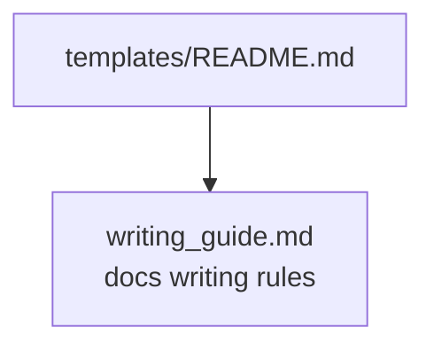

# Templates

이 폴더는 문서 체계, 작성 규칙, 향후 템플릿을 다룬다. 공식 실험 방법이나 분석 결과의 source of truth는 이 폴더에 두지 않는다.

## Structure

## Support docs

| Document | Role |
| --- | --- |
| [`writing_guide.md`](writing_guide.md) | 문서 타입, 링크, 용어, 중복 방지, Mermaid 사용 규칙을 정리한다. |
