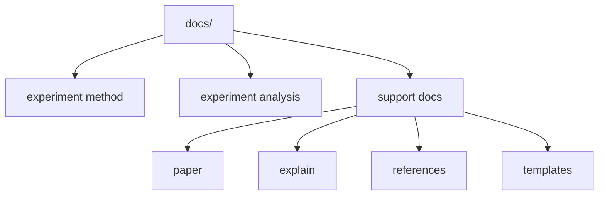

# Writing Guide

이 문서는 `docs/` 문서를 같은 기준으로 쓰기 위한 규칙을 정리한다. 공식 규칙은 짧고 분명하게 쓰고, 문서 간 역할은 겹치지 않게 나눈다.

## 문서 타입

- `experiment/method/`의 canonical 문서는 공식 기준을 고정한다.
- `experiment/analysis/`는 결과 해석을 추적한다.
- guide, playbook, study note, writing guide는 support 문서다.
- support 문서는 설명과 배경을 보강하지만 source of truth가 되지 않는다.

## 파일 이름 규칙

- 문서 파일명은 영어 `snake_case`를 쓴다.
- 폴더 인덱스만 `README.md`를 쓴다.
- agent context 파일은 루트 `AGENTS.md`만 쓴다.
- 삭제한 이름은 다시 쓰지 않는다. 예를 들면 `prob_head.md`, `basin_explain.md`, `literature-review.md` 같은 이름으로 되돌리지 않는다.

## 인트로 규칙

- 첫 문단에서 이 문서가 무엇을 고정하는지 먼저 말한다.
- 배경 설명으로 길게 시작하지 않는다.
- 필요하면 초반에 아래 세 가지를 짧게 적는다.
  - 이 문서의 역할
  - 다루는 범위
  - 다루지 않는 범위
- 문서가 짧다면 별도 섹션 대신 첫 두세 문장 안에서 처리해도 된다.

## 헤딩 규칙

- `#` 제목은 한 번만 쓴다.
- `##`는 역할, 구조, 규칙, 관련 문서처럼 큰 덩어리를 나눌 때 쓴다.
- `###`는 세부 규칙이 실제로 여러 개일 때만 쓴다.
- 표와 목록은 구조가 있을 때만 쓴다. 짧은 설명은 산문으로 끝내도 된다.
- 같은 문서 안에서 heading 깊이를 불필요하게 늘리지 않는다.

## 링크 규칙

- 저장소 내부 링크는 상대 경로를 쓴다.
- 사람용 문서는 `AGENTS.md`를 일반 onboarding 문서처럼 연결하지 않는다.
- 링크는 handoff가 필요한 지점에만 건다. 같은 링크를 한 문서 안에서 반복하지 않는다.
- canonical 문서를 가리킬 때는 왜 그 문서로 넘어가야 하는지 한 문장 안에서 분명히 적는다.

## 중복 방지 규칙

- 문서마다 `주 질문`을 하나만 둔다.
- 공식 기준은 canonical 문서 한 곳에서만 정의한다.
- support 문서에서는 규칙을 다시 정의하지 않고 설명만 덧붙인다.
- 이미 다른 문서에 있는 긴 배경 설명은 요약만 남기고 링크로 넘긴다.

## 용어 규칙

- 문서 전체에서 같은 대상을 같은 이름으로 부른다.
- 기술 용어는 영어를 유지해도 되지만, 역할과 이유는 한국어로 설명한다.
- 모델 이름은 `Model 1`, `Model 2`, `Model 3`로 고정한다.
- basin, holdout, quantile, event 같은 핵심 용어는 문서마다 다른 번역으로 흔들지 않는다.
- DRBC, CAMELSH처럼 이미 굳은 약어는 그대로 쓴다.

## Mermaid 사용 규칙

- 구조, 흐름, 의존 관계가 핵심일 때 Mermaid를 쓴다.
- 노드 문구는 짧게 쓴다. 긴 설명은 본문이나 표로 넘긴다.
- taxonomy, reading path, pipeline, comparison map에는 Mermaid가 잘 맞는다.
- 규칙 문장 자체를 Mermaid로 대신하지 않는다. threshold, 예외, 정의는 본문에 남긴다.

## explain 입문 문서 작성 원칙

`docs/explain/`는 비전공 대학생을 대상으로 한 입문 설명이다. canonical 문서와 달리, 정확성을 지키면서도 "처음 보는 사람이 끝까지 따라올 수 있는가"를 최우선으로 한다. 아래 원칙은 `08_rq_analysis_map.md` 개정에서 합의된 기준이다.

### 대상과 톤

- 비전공 대학생 기준. 수문학·기계학습 배경을 전제하지 않는다. 개념은 일상어와 비유로 먼저 푼다.
- 한국어 위주. 영어는 고정 전문 용어·코드 식별자에만 쓴다. 약어는 첫 등장 시 풀어쓴다. 예: `LSTM(Long Short-Term Memory)`, `DRBC(Delaware River Basin Commission, 델라웨어 강 유역 관리 위원회)`.
- 매우 상세하게. 각 개념은 "정의 → 직관·비유 → 값이 크면/작으면 무슨 뜻인지"로 풀어 쓴다.

### 헤딩

- 명사구로 쓴다. 문장·의문문으로 끝내지 않는다("~하는가", "~인가", "~보기" 지양).
- 짧고 직관적으로. RQ 하위 항목은 `질문 내용` / `질문 이유` / `분석 목적` / `결과 해석 방식`처럼 고정한다.

### 구현 포인터 (보고서식)

- 설명 문장 한가운데에 파일 경로를 박지 않는다.
- 핵심 계산은 실제 코드 몇 줄을 코드블록으로 인용하고, 코드블록 첫 줄 주석에 출처를 `# 파일경로: 함수` 형식으로 적는다. 인용 코드는 반드시 실제 소스에서 가져온다(지어내지 않는다).
- 긴 경로·디렉토리 나열은 산문이 아니라 리스트로 뺀다.
- 변수명을 보여줄 때는 산문이 아니라 리스트나 표로 적는다. 억지로 모든 곳에 끼워 넣지 않는다.
- 다른 문서를 가리키기만 하고 끝내지 않는다. 핵심 내용은 본문에서 직접 서술한다.

### 지표 표기

- 지표 참조 표는 간결한 카드로만 쓴다. 자체 정의 지표는 `[지표 | 심볼 | 변수명 | 범위 | 최적화 방향]`, 표준 평가지표(NSE/RMSE/MAE 등)는 변수명 열을 빼고 머리글을 `평가지표`로 쓴다.
- 표에 전체 설명을 담지 않는다. 표 바로 아래에 각 항목을 하위 섹션으로 두고 거기서 상세히 설명한다.
- 수식은 코드블록이 아니라 math block(`$$ … $$`, 한국어는 `\text{}`)으로 쓴다. 식 아래에 한 줄 해석을 붙여 의미를 푼다.
- 수식 안에서 예측값은 `Sim`, 관측값은 `Obs`로 적는다(예: `\max(0,\ \text{Obs} - \text{Sim}) / \text{Obs}`). 본문 산문에서는 "예측", "관측"으로 풀어 쓴다.

### 그림

- 관련 그림이 있으면 그 그림을 언급하는 지점 바로 뒤에 삽입한다.
- 그림은 `docs/explain/figures/`에 두고, 상대 경로로 ``처럼 넣는다.
- 캡션(alt-text)은 "무엇을 보여 주는 그림인지"를 한 문장으로 적는다.

### 정확성

- 경로·함수·변수명·범위·수치는 실제 코드나 canonical 문서에서 확인한 것만 쓴다. 확인 안 되면 정성적으로 쓰고, 과장·미확인 인과 단정은 하지 않는다.
- 고정 조건(seed `111 / 222 / 444`, `scaling_300` train/validation, DRBC test 85개, split `2000-2010 / 2011-2013 / 2014-2016`)을 전제로 서술한다.

## 빠른 체크리스트

- 이 문서의 역할이 한 문장으로 보이는가
- canonical인지 support인지 분명한가
- 저장소 내부 링크가 상대 경로인가
- 다른 문서와 같은 규칙을 중복 정의하지 않았는가
- 구조 설명이 길다면 Mermaid나 표로 줄였는가

explain 입문 문서라면 추가로:

- 헤딩이 명사구인가(의문문·문장 종결이 아닌가)
- 약어를 첫 등장 시 풀어썼는가
- 파일 경로를 산문에 박지 않고, 코드 인용에는 출처 주석을 달았는가
- 지표 표가 간결 카드이고, 상세 설명을 표 아래 하위 섹션으로 뺐는가
- 수식을 math block으로 쓰고 식 해석을 붙였는가
- 관련 그림을 언급 지점 뒤에 삽입했는가
