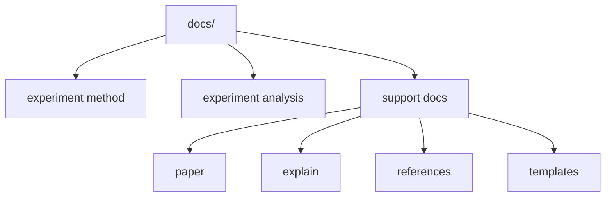

# Writing Guide

이 문서는 `docs/` 문서를 같은 기준으로 쓰기 위한 규칙을 정리한다. 공식 규칙은 짧고 분명하게 쓰고, 문서 간 역할은 겹치지 않게 나눈다.

## 문서 타입

- `experiment/method/`의 canonical 문서는 공식 기준을 고정한다.
- `experiment/analysis/`는 결과 해석을 추적한다.
- guide, playbook, study note, writing guide는 support 문서다.
- support 문서는 설명과 배경을 보강하지만 source of truth가 되지 않는다.

## 파일 이름 규칙

- 문서 파일명은 영어 `snake_case`를 쓴다.
- 폴더 인덱스만 `README.md`를 쓴다.
- agent context 파일은 루트 `AGENTS.md`만 쓴다.
- 삭제한 이름은 다시 쓰지 않는다. 예를 들면 `prob_head.md`, `basin_explain.md`, `literature-review.md` 같은 이름으로 되돌리지 않는다.

## 인트로 규칙

- 첫 문단에서 이 문서가 무엇을 고정하는지 먼저 말한다.
- 배경 설명으로 길게 시작하지 않는다.
- 필요하면 초반에 아래 세 가지를 짧게 적는다.
  - 이 문서의 역할
  - 다루는 범위
  - 다루지 않는 범위
- 문서가 짧다면 별도 섹션 대신 첫 두세 문장 안에서 처리해도 된다.

## 헤딩 규칙

- `#` 제목은 한 번만 쓴다.
- `##`는 역할, 구조, 규칙, 관련 문서처럼 큰 덩어리를 나눌 때 쓴다.
- `###`는 세부 규칙이 실제로 여러 개일 때만 쓴다.
- 표와 목록은 구조가 있을 때만 쓴다. 짧은 설명은 산문으로 끝내도 된다.
- 같은 문서 안에서 heading 깊이를 불필요하게 늘리지 않는다.

## 링크 규칙

- 저장소 내부 링크는 상대 경로를 쓴다.
- 사람용 문서는 `AGENTS.md`를 일반 onboarding 문서처럼 연결하지 않는다.
- 링크는 handoff가 필요한 지점에만 건다. 같은 링크를 한 문서 안에서 반복하지 않는다.
- canonical 문서를 가리킬 때는 왜 그 문서로 넘어가야 하는지 한 문장 안에서 분명히 적는다.

## 중복 방지 규칙

- 문서마다 `주 질문`을 하나만 둔다.
- 공식 기준은 canonical 문서 한 곳에서만 정의한다.
- support 문서에서는 규칙을 다시 정의하지 않고 설명만 덧붙인다.
- 이미 다른 문서에 있는 긴 배경 설명은 요약만 남기고 링크로 넘긴다.

## 용어 규칙

- 문서 전체에서 같은 대상을 같은 이름으로 부른다.
- 기술 용어는 영어를 유지해도 되지만, 역할과 이유는 한국어로 설명한다.
- 모델 이름은 `Model 1`, `Model 2`, `Model 3`로 고정한다.
- basin, holdout, quantile, event 같은 핵심 용어는 문서마다 다른 번역으로 흔들지 않는다.
- DRBC, CAMELSH처럼 이미 굳은 약어는 그대로 쓴다.

## Mermaid 사용 규칙

- 구조, 흐름, 의존 관계가 핵심일 때 Mermaid를 쓴다.
- 노드 문구는 짧게 쓴다. 긴 설명은 본문이나 표로 넘긴다.
- taxonomy, reading path, pipeline, comparison map에는 Mermaid가 잘 맞는다.
- 규칙 문장 자체를 Mermaid로 대신하지 않는다. threshold, 예외, 정의는 본문에 남긴다.

## explain 문서 작성 원칙

`docs/explain/`는 수문학 전공 대학생을 대상으로 한 설명이다. canonical 문서와 달리, 정확성을 지키면서도 "이 연구의 방법·결과를 따라올 수 있는가"를 최우선으로 한다. 아래 원칙은 `08_rq_analysis_map.md` 개정에서 합의된 기준이다.

### 대상과 톤

- 수문학 전공 대학생 기준. 유역, 하천 유량, 홍수 첨두, 유출, 재현기간, NSE·KGE 같은 **수문학 기본 개념은 전제한다** — 다시 풀어 쓰지 않는다. 반면 기계학습 배경(LSTM, quantile 회귀, calibration 등)은 전제하지 않고, 처음 등장할 때 한 번 짚는다.
- 간결하게. 일상 비유와 장황한 단계별 풀이는 지양한다. ML 개념도 "정의 → 이 연구에서의 역할 → 값 해석"을 한두 문장으로 압축한다. 수문학 개념은 곧장 사용한다.
- 한국어 위주. 영어는 고정 전문 용어·코드 식별자에만 쓴다. ML 약어는 첫 등장 시 풀어쓴다. 예: `LSTM(Long Short-Term Memory)`. 수문학에서 굳은 약어(DRBC, NSE, KGE, CAMELSH 등)는 한국어 풀이 없이 그대로 쓰되, 고유명사는 첫 등장 시 한 번만 병기한다. 예: `DRBC(Delaware River Basin Commission)`.
- 한자 병기는 쓰지 않는다. 영문 원어만 괄호에 둔다. 예: "유역(流域, basin)" → "유역(basin)", "첨두(尖頭, peak)" → "첨두(peak)".
- 말투는 보고서체. 정의·설명을 풀어 늘어놓지 말고 정제된 한 문장으로 끊는다. 정의문은 "~이다" 군더더기를 빼고 명사구로 끝낸다. 예: "quantile 예측의 품질을 보는 비대칭 손실이다." → "quantile 예측의 품질을 보는 비대칭 손실." 추상적 문장체 정의는 피하고 수식·범위·역할로 바로 말한다.
- 가벼운 구어체를 문어체로 압축한다. 관형절(`~하는`, `~되는`)을 명사 나열로 줄인다. 예: "모델이 학습하는 기간" → "모델 학습 기간", "최종 성능을 보고하는 기간" → "전체 성능 평가 기간". 구어 어휘는 문어 어휘로. 예: "쉬운 설명" → "설명", "헛경보" → "위경보", 표 머리글의 "쉬운 설명" → "설명".

### 헤딩

- 명사구로 쓴다. 문장·의문문으로 끝내지 않는다("~하는가", "~인가", "~보기", "~막는 이유", "~정리" 지양). 예: "quantile crossing을 막는 이유" → "quantile crossing 방지 방법", "한 문장으로 정리" → "결론".
- 짧게. 괄호 부제·수식어를 붙이지 않는다. 예: "한 문단 요약 (먼저 큰 그림부터)" → "한 문단 요약", "이 연구에서 쓰는 주요 지표" → "주요 지표".
- RQ 하위 항목은 `질문 내용` / `질문 이유` / `분석 목적` / `결과 해석 방식`처럼 고정한다.

### 구현 포인터 (보고서식)

- 설명 문장 한가운데에 파일 경로·설정 항목·설정값을 박지 않는다. 꼭 필요할 때만 넣고, 나머지는 리스트나 표로 따로 뺀다.
- 긴 파일 위치를 본문에 적어야 하면, 본문에는 스크립트·함수 이름만 짧게 쓰고 전체 경로는 각주(`[^src-...]`)로 뺀다. 예: 본문 "유역 매칭은 `export_camelsh_matches_from_defined_region.py`가 한다[^src-match].", 각주 "[^src-match]: `scripts/data/export_camelsh_matches_from_defined_region.py`". 한 문서 안에서 같은 경로는 각주 하나로 재사용한다.
- 핵심 계산을 코드로 보여줄 때는 산문에 변수명을 나열하지 말고, 실제 코드 몇 줄을 코드블록으로 인용한다. 코드블록 첫 줄 주석에 출처를 `# 파일경로: 함수` 형식으로 적는다. 인용 코드는 반드시 실제 소스에서 가져온다(지어내지 않는다).
- loss·정규화처럼 수식으로 더 분명해지는 계산은 코드 인용 대신(또는 함께) 수식으로 보인다. 긴 코드 경로를 산문에 풀어 쓰는 것보다 수식 한 줄이 낫다.
- 변수명·경로·디렉토리 나열은 산문이 아니라 리스트나 표로 적는다. 산출물(table, reference 등)을 안내할 때는 이름·위치·내용을 표나 리스트로 묶는다.
- 다운로드 → split 같은 절차를 단계별로 길게 나열하지 않는다. 논문 이해에 필요한 건 절차가 아니라 구성·정의다. "데이터셋이 무엇인지 → 원자료 출처 → 자료 종류 → split·screening 조건 → 조합 설계" 같은 구성 축으로 쓴다. 좌표계 변경 등으로 더 이상 쓰지 않는 처리 과정은 설명하지 않는다.
- 텍스트로 그린 화살표 다이어그램(`inputs -> LSTM -> head`)은 쓰지 않는다. 흐름·구조는 Mermaid로 그린다.
- 다른 문서를 가리키기만 하고 끝내지 않는다. 핵심 내용은 본문에서 직접 서술한다.

### 지표 표기

- 지표 참조 표는 간결한 카드로만 쓴다. 열 순서는 `[지표 | 변수명 | 심볼 | 범위 | 최적화 방향]`으로, 맨 앞 열은 지표의 정확한 이름이다. 심볼(α·β·δ 등)을 첫 열·머리글로 올리지 않는다. 표준 평가지표(NSE/RMSE/MAE 등)는 변수명 열을 빼고 머리글을 `평가지표`로 쓴다.
- 표의 각 행이 정확히 어느 지표를 가리키는지 분명히 한다("첨두 과소추정 정도"처럼 지표가 모호하면 정식 지표명·심볼을 함께 적는다).
- 표에 전체 설명을 담지 않는다. 표 바로 아래에 각 항목을 하위 섹션으로 두고, 정의(명사구) → 수식 → 한 줄 해석 → 값 해석 순으로 적는다. 주요 지표가 빈약하면 보강한다.
- 수식은 코드블록이 아니라 math block(`$$ … $$`, 한국어는 `\text{}`)으로 쓴다. 식 아래에 한 줄 해석을 붙여 의미를 푼다.
- 수식 안에서는 수문학 관례대로 기준 지표 기호에 출처를 아래첨자로 단다. 유량은 $Q$로 쓰고, 예측은 `sim`, 관측은 `obs`를 아래첨자로 붙인다: $Q_{\text{sim}}$, $Q_{\text{obs}}$, 분위 예측은 $Q_{\text{sim},\tau}$. 첫 수식 근처에서 "$Q$는 유량, 아래첨자 sim은 예측, obs는 관측"을 한 번 정의한다. 본문 산문에서는 "예측", "관측"으로 풀어 쓴다.

### 그림

- 관련 그림이 있으면 그 그림을 언급하는 지점 바로 뒤에 삽입한다.
- 그림은 `docs/explain/figures/`에 두고, 상대 경로로 ``처럼 넣는다.
- 캡션(alt-text)은 "무엇을 보여 주는 그림인지"를 한 문장으로 적는다.

### 정확성

- 경로·함수·변수명·범위·수치는 실제 코드나 canonical 문서에서 확인한 것만 쓴다. 확인 안 되면 정성적으로 쓰고, 과장·미확인 인과 단정은 하지 않는다.
- 고정 조건(seed `111 / 222 / 444`, `scaling_300` train/validation, DRBC test 85개, split `2000-2010 / 2011-2013 / 2014-2016`)을 전제로 서술한다.
- 일부 후속 분석(q99 분석 등)은 더 넓은 평가 구간을 쓴다. 그런 분석을 다룰 때는 기본 split과 다른 구간임을 표의 별도 행이나 한 줄로 분명히 밝힌다.

## 빠른 체크리스트

- 이 문서의 역할이 한 문장으로 보이는가
- canonical인지 support인지 분명한가
- 저장소 내부 링크가 상대 경로인가
- 다른 문서와 같은 규칙을 중복 정의하지 않았는가
- 구조 설명이 길다면 Mermaid나 표로 줄였는가

explain 문서라면 추가로:

- 헤딩이 짧은 명사구인가(의문문·문장 종결·괄호 부제가 아닌가)
- ML 약어를 첫 등장 시 풀어썼는가. 수문학 기본 개념을 불필요하게 다시 풀지 않았는가
- 한자 병기를 빼고 영문 원어만 두었는가
- 말투가 보고서체인가. 정의를 명사구로 끊었는가
- 파일 경로·설정값·변수명을 산문에 박지 않고 리스트·표로 뺐는가. 코드 인용에는 출처 주석을 달았는가
- 절차 단계 나열 대신 구성·정의 축으로 썼는가
- 텍스트 화살표 다이어그램을 Mermaid로 바꿨는가
- 지표 표 열 순서가 `지표 | 변수명 | 심볼 | …`이고, 심볼을 머리글로 올리지 않았는가
- 수식을 math block으로 쓰고 식 해석을 붙였는가
- 관련 그림을 언급 지점 뒤에 삽입했는가
