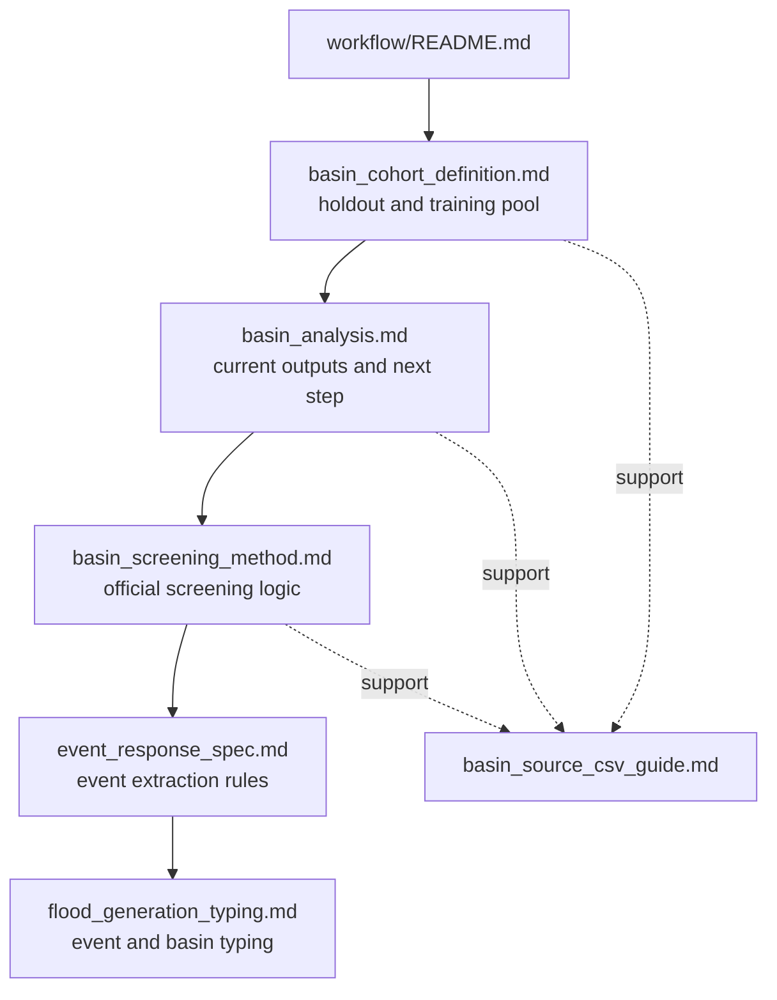

# Workflow Docs

이 폴더는 basin selection, screening, event workflow의 기준 문서를 모은다. 공식 규칙은 canonical 문서에만 두고, 설명용 자료는 support 문서로 분리한다.

## Structure

## Canonical docs

| Document | Role |
| --- | --- |
| [`basin_cohort_definition.md`](basin_cohort_definition.md) | DRBC holdout basin과 non-DRBC training pool의 공식 기준을 고정한다. |
| [`basin_analysis.md`](basin_analysis.md) | 현재 분석 산출물과 다음 screening 단계의 위치를 정리한다. |
| [`basin_screening_method.md`](basin_screening_method.md) | 논문 본문용 basin screening 규범을 정리한다. |
| [`event_response_spec.md`](event_response_spec.md) | observed-flow event table 생성 규칙을 고정한다. |
| [`flood_generation_typing.md`](flood_generation_typing.md) | event와 basin의 flood generation typing 규칙을 정리한다. |

## Support docs

| Document | Role |
| --- | --- |
| [`basin_source_csv_guide.md`](basin_source_csv_guide.md) | basin analysis table의 source CSV와 컬럼 해석을 설명한다. |

## Recommended order

1. [`basin_cohort_definition.md`](basin_cohort_definition.md)
2. [`basin_analysis.md`](basin_analysis.md)
3. [`basin_screening_method.md`](basin_screening_method.md)
4. [`event_response_spec.md`](event_response_spec.md)
5. [`flood_generation_typing.md`](flood_generation_typing.md)
6. 필요할 때 [`basin_source_csv_guide.md`](basin_source_csv_guide.md)
